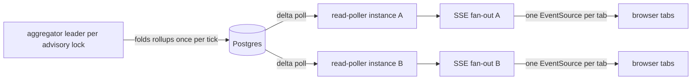

# ADR 0019 — Dashboard realtime: one multiplexed SSE stream per tab over a Postgres read-poller

- **Status:** Accepted
- **Date:** 2026-07-02
- **Deciders:** Senior Backend Engineer, Enterprise UX Architect, Solutions Architect
- **Phase:** Dashboard P7 · **Source:** `docs/waterfall-dashboard/02-architecture.md`

## Context
The dashboard's live surfaces — overview tiles, Provider health, Provider Key status, queue stats,
worker state, alert events, import progress, approval changes — must update without per-client polling
(a locked architecture principle: no polling storms). Clients are browsers authenticated by the session
cookie (ADR-0018). Two hard constraints shape the transport: (1) Go stdlib has no WebSocket
implementation, and hand-rolling RFC 6455 is a large security-sensitive liability; (2) browsers cap
HTTP/1.1 connections at roughly **6 per origin** (long-standing browser practice, exact per-browser
values UNVERIFIED), so with 8 topics, per-topic `EventSource` connections from one page plus a second
tab exhaust the pool and starve REST calls. All client→server traffic is already covered by
Idempotency-Key REST writes, so nothing requires a bidirectional channel. Scale target: 200+ concurrent
dashboard clients with ≤2s delta latency (UNVERIFIED until the P7 soak test).

## Options considered
| Option | Pros | Cons | Key tradeoff surfaced |
|--------|------|------|-----------------------|
| **A. SSE, ONE multiplexed stream per browser tab (chosen)** | plain HTTP through the existing middleware chain — authn, `Principal`, RLS, instrumentation all apply unchanged; `EventSource` gives auto-reconnect, `Last-Event-ID`, and `retry:` for free; cookie auth is native; one connection regardless of topic count | one-way only (acceptable: writes are REST); proxies must be configured to not buffer and to tolerate long-lived responses | protocol simplicity + free client state machine vs one-way limitation we do not feel |
| B. WebSockets | bidirectional, binary framing | **rejected: bidirectionality is unneeded** (all writes are Idempotency-Key REST); no stdlib implementation — hand-rolling RFC 6455 handshake/masking/fragmentation/ping-pong is a security-sensitive project against the zero-dependency budget; **more infra/proxy friction** (Upgrade handling); **no native reconnect or Last-Event-ID** — we would rebuild what `EventSource` ships | capability we will not use vs cost we would certainly pay |
| C. Per-client polling | trivial to build | **rejected: polling storms violate the architecture principles** — N clients × ~12 tiles × 2s cadence hammers Postgres with redundant identical aggregates; DB load scales O(clients) | implementation ease vs the exact failure mode the spec forbids |
| D. Per-topic SSE endpoints `GET /v1/admin/streams/{topic}` | simple routing, isolated buffers | **rejected: browser connection-pool exhaustion** — 8 topics against the ~6-per-origin HTTP/1.1 limit means one busy page plus a second tab starves REST; correctness would silently depend on HTTP/2 at every proxy hop | endpoint simplicity vs a client-side resource ceiling we do not control |

## Decision
**Option A.** One `EventSource` per browser tab, topics multiplexed on a single stream:

- **Endpoint:** `GET /v1/admin/streams?topics=<csv>` — topics: `overview`, `provider`, `key`,
  `queue`, `worker`, `alert`, `import`, `approval` (singular — the event-name first segment;
  doc 04 §3.2 / OI-API-2). Changing the mounted topic set means reconnecting with a new query
  string plus `Last-Event-ID`.
- **Wire contract:** `event: <domain>.<entity>.<verb>` (e.g. `overview.tiles.tick`,
  `provider.health.changed`, `key.status.changed`, `queue.stats.tick`, `worker.state.changed`,
  `alert.event.fired`, `import.batch.progress`, `approval.request.changed` — the first segment IS the
  topic); `id: <epochms>-<seq>`; `data:` is snake_case JSON
  `{"v":1,"ts":"...","scope":{...},"payload":{...}}`. A `: heartbeat` comment every 15s defeats idle
  timeouts; a `retry:` hint tunes reconnect.
- **Replay:** a **256-event ring buffer per topic** serves `Last-Event-ID` replay; if the client's id
  has scrolled out (e.g. a 50k-row import burst), the server emits an explicit `reset` event and the
  client refetches snapshots. **QoS split:** `*.tick` events replace query-cache snapshots and may be
  coalesced under load (degradation mode: widen tick intervals); `*.changed`/`*.fired`/`*.progress`
  events carry invalidation semantics and are **never silently dropped**.
- **Server topology:** server-side aggregation with single-computation fan-out. The leader-elected
  aggregator (`pg_try_advisory_lock(hashtext('dash_aggregator'))`) folds telemetry once per tick; a
  **per-instance read-poller** picks up deltas and fans out through
  `realtime.Source{ Subscribe(topics) (ch, cancel) }` to every subscriber on that instance. DB read
  rate is O(instances), not O(clients).

- **Evolution path, behind the same interface:** the poller ships first. A **LISTEN/NOTIFY extension to
  the hand-rolled `internal/pg` client** — handling the async `'A'` NotificationResponse message in
  `conn.go` readMessage, plus `Conn.Listen(channel)` and `WaitNotification(ctx)` on a dedicated
  non-pooled connection — is a **timeboxed enhancement** that replaces poll latency with push; if the
  timebox expires, the poller remains fully correct. **Redis pub/sub remains the multi-region design
  target** behind `realtime.Source` (design-time target per the locked stack decision; Postgres-backed
  implementation now).
- **Client fallback:** on disconnect, the SPA degrades to 15s refetch plus exponential resubscribe with
  jitter; an explicit live/reconnecting/degraded indicator is part of the UI conventions (doc 08).

## Rationale
The transport choice is dominated by what we do NOT need: no client→server streaming exists anywhere in
the design, so WebSocket's only advantage is irrelevant while its costs (hand-rolled RFC 6455,
proxy Upgrade friction, bespoke reconnect protocol) are certain. SSE rides the existing HTTP stack —
middleware, session auth, RLS principal binding — untouched, which keeps G1 tenant isolation enforcement
identical for streamed and requested data. The single multiplexed stream is forced by arithmetic, not
taste: per-topic connections cannot survive the browser's per-origin connection budget. We chose
**boring HTTP plus a browser-native client state machine over a richer protocol**, and pushed all
fan-out cost server-side where the aggregator makes it O(instances).

## Consequences
- Positive: zero new dependencies; live UX with DB load independent of viewer count; replay and
  reconnect semantics testable against a written contract; transport swap (LISTEN/NOTIFY, Redis
  pub/sub) is invisible above `realtime.Source`.
- Negative / accepted costs: deployment must guarantee SSE-safe proxying — response buffering off
  (e.g. `X-Accel-Buffering: no`), idle timeouts above the 15s heartbeat (doc 11); one long-lived
  goroutine per connected client per instance; poll latency until the LISTEN/NOTIFY timebox lands;
  reconnect thundering herd after a deploy is mitigated by jitter and by serving snapshots from the
  aggregator's last in-memory tick.
- Follow-ups / new ADRs triggered: `internal/pg` NOTIFY extension (timeboxed, no new ADR needed — same
  decision); a Redis-backed `realtime.Source` at multi-region would ratify the design target in a new
  ADR; ADR-0018 supplies the cookie auth this transport assumes.

## Verification
P7 acceptance gates: 200-client SSE soak with ≤2s delta latency (targets UNVERIFIED until this load
test); `Last-Event-ID` replay correctness including ring-buffer **overflow → reset → snapshot refetch**
(not just happy path); heartbeat keeps streams alive through the reference proxy config; kill the
aggregator leader and observe takeover (chaos case, P12); a contract test pins the event-name vocabulary
to the OpenAPI/SSE documentation so topics cannot drift from `docs/waterfall-dashboard/04-api-contracts.md`.
