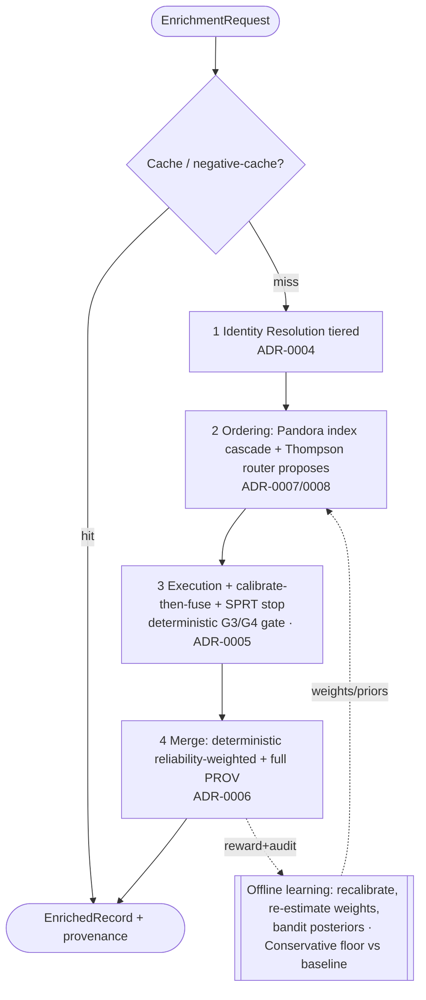

# 02 — Waterfall Methodology Research

**Status:** `IN-REVIEW` · **Owner:** Distributed Systems Engineer + GTM Data Platform Architect · **Last updated:** 2026-07-01
**Gated by:** [waterfall-correctness](../skills/waterfall-correctness/SKILL.md) · [Architecture Reviewer](../agents/architecture-reviewer.md) · `/architecture-review` GATE

> **Provenance.** Workflow `wf_8ebd6dba-440` (Phase 2): **10 subagents** = 5 methodology Research
> agents + 5 adversarial citation Verify agents, ~**420,835** tokens, **199** web fetches. **46**
> methods across 5 topics; **46** citations re-fetched, **2 downgraded**, **0 hallucinated
> references**. `verified_date` = 2026-07-01. Decisions recorded as **ADR-0004…0008**.

## 1. Method & verification legend
Same discipline as `01`: every method carries a real `source_url` (fetched) + `verified_date` or is
`UNVERIFIED`; a second agent re-fetched each citation to catch the classic LLM failure of
hallucinated papers. Markers: `✓✓` re-checked & confirmed · `✓` cited (not in re-check sample) ·
`⚠↓` downgraded on re-fetch · `○` UNVERIFIED.

> **Terminology note (doc-consistency):** "**cascade**" in this document refers to the specific
> ML *classifier/detector-cascade* technique (Viola–Jones cheap-first evaluation). It is **not** a
> synonym for the canonical **Waterfall** entity (the ordered/conditional Provider sequence, Glossary
> `00` §7). We adopt the *cascade technique* to structure the *Waterfall*.

## 2. Executive synthesis — one coherent engine, one invariant

The five research tracks converge on a single design with one governing invariant:

> **"Model proposes, deterministic gate disposes."** Learned/adaptive components (the routing
> bandit, learned reservation values) only **rank/propose**. The Execution Engine independently
> re-enforces the hard gates **G3** (timeout/breaker/bounded backoff) and **G4** (cost ceiling +
> credit reservation) before *every* call, and the merge is **rule-deterministic**. Every bandit/
> budget safety result in the literature is *soft/asymptotic* and can transiently overshoot —
> unacceptable when a cost ceiling or timeout is a hard contract. So learning lives **inside** a
> deterministic feasibility filter, never around it.

This resolves the recurring tension (adaptive cost-optimality vs. determinism/auditability/bounded
spend) the same way in all five areas: **interpretable, idempotent, provenance-friendly defaults on
the request path; expensive adaptive estimation offline.** It also makes G1/G2/G5 fall out naturally
— posterior/calibrator state is tenant-scoped (G1), the bandit RNG is seeded from the idempotency key
so replays reproduce the same choice (G2), and every provider pull writes
value+confidence+provider+cost+timestamp+run_id which is simultaneously the **audit record and the
learning signal** (G5).

## 3. The adopted end-to-end methodology (request path)

Per Record, per requested Field set, one deterministic spine with learned advisors bolted on:

*(Canonical diffable source with full detail: [`diagrams/enrichment-pipeline.mmd`](../diagrams/enrichment-pipeline.mmd) — kept in sync with this section per `doc-consistency`.)*

| Stage | Adopted method (request path) | Why (constraint fit) | ADR |
|-------|-------------------------------|----------------------|-----|
| **0 Cache/preview** | negative + result cache; cheap discovery before paid reveal | cost (G4), matches every provider's charge-on-success model (`01` §5 K2/K3) | — |
| **1 Identity resolution** | **Tiered**: T0 deterministic exact on strong keys → T1 tenant-scoped blocking (LSH, cap K) → T2 Fellegi–Sunter (EM m/u, 2 thresholds, per-field weights) → T3 cost-gated ML (Ditto, feature-flag) | precision-first + idempotent (T0), bounded candidate set (G3/G4), interpretable weights = provenance (G5); ML only for the ambiguous middle band | **0004** |
| **2 Ordering + routing** | **Pandora/Weitzman reservation-value index** cascade (offline-precomputed per tenant,field), skip if index < best-in-hand; **Thompson-sampling** router *proposes* the ranking (value-per-$) | provably-good, deterministic, auditable default; learner advises but cannot breach gates | **0007**, **0008** |
| **3 Execution + stop** | per-call **calibrate** (isotonic/Platt per provider,field) → **log-odds Bayesian fusion** (weight caps + correlation discount) → **SPRT** stop when confidence ≥ target **OR** G4 ceiling **OR** G3 timeout (three hard stops; confidence never the only one); bounded parallel prefix | associative/idempotent, O(#providers), interpretable additive weights (G5); minimal expected paid calls to hit SLA | **0005** |
| **4 Merge/conflict** | **online deterministic** reliability-weighted resolution (CRH-style weights + freshness decay + per-tenant authority + explicit tie-break); keep **all** candidate values as **W3C PROV** | idempotent + bounded on request path; losers retained for audit/dispute/re-resolution (G5); copy-discount because providers resell overlapping data | **0006** |
| **5 Offline learning** | re-estimate calibrators, FS m/u, source reliabilities (Accu **copy-discount**), reservation indices, bandit posteriors; **Conservative-Bandit floor** (never worse than the static baseline) | keeps adaptivity off the hot path; shipping learning can only help | **0008** |

**Cross-cutting correctness map:** G1 — all posterior/calibrator/cluster IDs are tenant-namespaced;
blocking keys tenant-scoped so candidates never cross tenants. G2 — deterministic keys on
(tenant, record, field, provider); bandit RNG seeded from idempotency key. G3/G4 — the execution gate
re-checks timeout/breaker and ceiling/credits before every call; parallelism is a bounded prefix.
G5 — Fellegi–Sunter per-field match weights + log-odds contributions + the resolution rule that fired
are all persisted as PROV lineage; losing values retained.

## 4. Methodology survey (cited)

> Markers: `✓✓` cited & adversarially re-checked · `✓` cited (not in re-check sample) · `⚠↓` cited but **downgraded** on re-fetch · `○` UNVERIFIED.

### 4.1 Identity Resolution / Record Linkage
*Topic scope:* Record linkage / entity resolution for a Waterfall Enrichment Engine (identity resolution, dedup, blocking, matching) — resolving a Person/Company across providers by email, domain+name, and LinkedIn
*Adversarial check:* 10 citations re-fetched → 10 confirmed, 0 downgraded. No hallucinated citations.

| ✔ | Method | What it is | Best for (in our waterfall) | Source |
|---|---|---|---|---|
| ✓✓ | **Fellegi-Sunter probabilistic record linkage (m/u weights, EM-trained)** | The foundational probabilistic framework (Fellegi & Sunter, JASA 1969) that scores a candidate record pair by summing per-field match weights log2(m_i/u_i), where m is P(agreement \| true match) and u is P(agreement \| non-match). It yields a calibrated match… | The scoring/decision tier of the waterfall once candidates exist: converting per-field agreements (email, domain, name similarity) into one auditable, calibrated match p… | [link](https://moj-analytical-services.github.io/splink/topic_guides/theory/fellegi_sunter.html) _secondary_ |
| ✓✓ | **Deterministic / rule-based (exact & hierarchical waterfall) matching** | Records are declared matches by exact or rule-based agreement on strong identifiers (e.g. normalized email, email-domain + normalized company name, canonical LinkedIn URL). AWS Entity Resolution frames this as a hierarchical set of 'waterfall matching rules' … | Tier-0 fast path of our engine: cheap, high-precision exact matches on strong keys before any fuzzy/ML work runs, and the natural fit for hashed-PII matching. | [link](https://docs.aws.amazon.com/entityresolution/latest/userguide/what-is-service.html) _secondary_ |
| ✓✓ | **Blocking / indexing (standard blocking, sorted-neighborhood, canopy clustering, token/LSH)** | Candidate-generation techniques that avoid the O(n^2) all-pairs comparison by grouping likely-matching records into blocks (inverted-index/standard blocking, sorted-neighborhood sliding window, canopy clustering with a cheap metric, schema-agnostic token bloc… | The candidate-generation stage that feeds the scorer: e.g. block Persons by email-domain or name-token, Companies by normalized-domain, so only a bounded set of pairs re… | [link](https://arxiv.org/abs/1905.06167) _primary_ |
| ✓✓ | **String similarity metrics (Jaro-Winkler, Levenshtein/edit distance)** | Field-level fuzzy comparators used inside pair scoring. Jaro-Winkler (Jaro similarity plus a prefix bonus, p=0.1 over up to 4 leading chars) returns 0..1 and is tuned for short strings like personal names; Levenshtein counts insert/delete/substitute edits. Th… | Comparing names and short attributes (first/last name, company name) within candidate pairs to produce the agreement signals the Fellegi-Sunter or ML layer consumes. | [link](https://en.wikipedia.org/wiki/Jaro%E2%80%93Winkler_distance) _secondary_ |
| ✓✓ | **Deep-learning entity matching (Ditto; DeepMatcher; Magellan lineage)** | Ditto (Li et al., VLDB 2021) casts entity matching as a sequence-pair classification problem over pre-trained Transformers (BERT/DistilBERT/RoBERTa), with domain-knowledge injection, long-string summarization, and data augmentation. Reported up to ~29% F1 gai… | A cost-gated escalation tier for the hard middle band — dirty/textual pairs where deterministic + FS + string metrics are ambiguous and maximum accuracy justifies the sp… | [link](https://arxiv.org/abs/2004.00584) _primary_ |
| ✓✓ | **Active-learning supervised matching (dedupe / Bilenko learnable similarity)** | The dedupe Python library learns both blocking predicates and a logistic-regression pairwise matcher, using active learning to ask a human to label only the most informative candidate pairs. Based on Bilenko's dissertation on learnable similarity functions fo… | Bootstrapping a supervised matcher for a new entity type/provider mix with minimal labeling effort, when a full DL pipeline is overkill. | [link](https://github.com/dedupeio/dedupe/blob/main/README.md) _secondary_ |
| ✓✓ | **Splink (scalable Fellegi-Sunter + EM on SQL backends)** | MoJ's open-source library implementing the Fellegi-Sunter model with EM parameter estimation over DuckDB/Spark/Athena SQL backends at 100M+ records, adding term-frequency adjustments and interactive match-weight diagnostics. A concrete, adoptable reference im… | The production probabilistic-scoring engine if we want SQL-native, warehouse-scale linkage with auditable weights rather than building FS from scratch. | [link](https://moj-analytical-services.github.io/splink/topic_guides/theory/fellegi_sunter.html) _secondary_ |
| ✓✓ | **Zingg (ML entity resolution / MDM on Spark)** | Open-source ML tool that learns two models — a blocking model that indexes near-similar records (comparing only ~0.05-1% of the pair space) and a similarity classifier that predicts matches — trained via active learning. Does both probabilistic (fuzzy) and de… | Batch MDM / golden-record construction across many silos when a Spark-based, learn-your-own-blocking pipeline is acceptable. | [link](https://github.com/zinggAI/zingg) _secondary_ |
| ✓✓ | **AWS Entity Resolution (managed rule-based + ML + provider-led matching)** | Managed service offering three matching techniques — configurable rule-based waterfall matching, a preconfigured ML model over name/email/phone/address/DOB, and data-service-provider-led matching — with schema mapping, built-in normalization, PII hashing, inc… | An API-first managed fallback tier in the waterfall (and a buy-vs-build reference), especially for hashed-PII consumer matching and provider-led enrichment without runni… | [link](https://docs.aws.amazon.com/entityresolution/latest/userguide/what-is-service.html) _secondary_ |
| ✓✓ | **Evaluation: pairwise & cluster precision/recall/F1** | Standard quality measurement: pairwise precision = fraction of predicted links that are true links; pairwise recall = fraction of true links recovered; F1 = their harmonic mean. Binette et al. (2024) add an entity-centric framework with cluster precision/reca… | Choosing/calibrating match thresholds per entity type (Person vs Company) and gating releases — deciding where on the precision/recall curve our waterfall should sit. | [link](https://arxiv.org/abs/2404.05622) _primary_ |

**Recommendation for our engine:** Adopt a tiered ('waterfall-within-the-waterfall') resolver, not a single matcher, so precision, cost, and latency are controlled tier by tier: TIER 0 - Deterministic exact match (adopt now). Normalize then match on strong keys: canonicalized email, email-domain + normalized company name, and canonical LinkedIn URL. This is fast, cheap, explainable, and idempotent (deterministic key -> stable match ID). It resolves the majority of records and short-circuits the expensive tiers, directly serving G3 (bounded) and G4 (cost ceiling). Model it on AWS Entity Resolution's hierarchical rule ordering (rule 1 more precise than rule 2) and match on hashed identifiers where PII policy requires. TIER 1 - Blocking to generate candidates (adopt now). Only when Tier 0 misses, generate a CAPPED candidate set using standard blocking (email-domain, normalized-name tokens) plus LSH/MinHash on names for typo tolerance, per the Papadakis survey. Hard-cap K candidates per record so cost/latency stay bounded (G3/G4). Blocking keys MUST be tenant-scoped so candidates never cross tenant boundaries (tenant isolation) and cluster/match IDs must be namespaced per tenant. TIER 2 - Fellegi-Sunter probabilistic scoring (adopt now; build on Splink's formulation). Score blocked pairs with additive match weights log2(m_i/u_i) using Jaro-Winkler on names and exact/host agreement on email/domain, training m/u via EM (no labels needed). Emit a calibrated match probability AND per-field weight contributions, which we persist as G5 provenance ('matched on email exact +8.2, name JW 0.93 +3.1'). Use TWO thresholds: auto-link above high, auto-reject below low, and route the middle band to Tier 3. Mitigate FS's independence assumption by treating correlated signals (domain+company-name) as a single comparison to avoid double-counting evidence. TIER 3 - ML escalation, cost-gated and optional (defer / feature-flag). Reserve a Ditto-style Transformer matcher ONLY for the ambiguous middle band, gated behind the G4 cost ceiling and a G3 timeout, because of GPU cost, latency, and weak provenance/auditability. Consider dedupe (MIT, active learning) before full DL when we lack labels and need something embeddable. BUY-VS-BORROW: Use AWS Entity Resolution as an API-first managed FALLBACK provider node inside the enrichment waterfall (hashed PII, provider-led matching, GetMatchId) rather than the core resolver, to avoid lock-in on the hot path. Do NOT take Zingg into the codebase: its AGPL-3.0 copyleft is an IP risk for a proprietary engine and its Spark/batch orientation fights our per-call bounded model — but borrow its two-model (blocking model + similarity model) design. Evaluate every tier with pairwise AND cluster precision/recall/F1 (Binette et al.) to place thresholds per entity type; track cluster metrics to catch transitivity-driven false merges. Net: build our own Tier-0 deterministic + Tier-1 blocking + Tier-2 Fellegi-Sunter core (Splink formulation) because it is interpretable, label-free, idempotent, and provenance-friendly; keep ML and managed services as gated escalation/fallback nodes, never the default path.

**Central tradeoff (→ ADR):** Central ADR tradeoff: PRECISION vs RECALL vs COST/LATENCY vs INTERPRETABILITY. Deterministic-only maximizes precision, is idempotent, near-zero cost, and trivially auditable — but leaves recall on the table (misses typos, aliases, missing keys). Probabilistic (Fellegi-Sunter) and ML matching recover that recall but add parameter-estimation/labeling burden, threshold-tuning risk, and cost/latency that must be explicitly bounded (G3) and capped before execution (G4). The recall knob is also a SAFETY knob: a threshold set too loose produces false merges, which in a multi-tenant system is a tenant-isolation breach and corrupts golden records — so blocking and IDs must be tenant-scoped and the merge threshold must favor precision by default. Secondary tradeoff: interpretability/provenance (G5) — Fellegi-Sunter's additive per-field match weights are directly loggable as field-level provenance, whereas a Transformer matcher (Ditto) buys accuracy at the cost of being a black box that is hard to audit and attribute. Recommended ADR stance: default to high-precision deterministic + interpretable FS scoring, treat ML/managed services as cost-gated escalation, and make the match threshold a per-entity-type, evaluation-driven decision.

**Open questions:** 1) Labeled data: do we have (or can we cheaply generate via active learning) ground-truth match labels per entity type to justify supervised/DL tiers, or must we stay unsupervised (FS+EM)? 2) Thresholds: how do we calibrate and version per-entity-type thresholds (Person vs Company) and re-calibrate as provider mix drifts, without breaking idempotency of previously assigned match IDs? 3) Clustering & transitivity: after pairwise scoring, how do we resolve records into stable entities (connected components / correlation clustering) and mint idempotent, tenant-namespaced cluster IDs that survive incremental updates? 4) PII & privacy: do we hash identifiers (email/phone) before cross-provider matching, and does that preclude fuzzy comparison (hashing kills Jaro-Winkler)? 5) Buy-vs-build economics: at what volume does AWS Entity Resolution per-record cost beat operating our own FS engine, and does provider-led matching there conflict with our API-first/no-scraping and cost-ceiling constraints? 6) Provenance schema: exact shape for persisting per-field match-weight contributions (G5) so every resolved field is traceable to the evidence that merged it.

### 4.2 Confidence Aggregation & Calibration
*Topic scope:* Confidence aggregation & evidence combination across multiple providers (per-field calibration, cross-provider fusion, and a stop-at-target-confidence gate) for a Waterfall Enrichment Engine
*Adversarial check:* 10 citations re-fetched → 10 confirmed, 0 downgraded. No hallucinated citations.

| ✔ | Method | What it is | Best for (in our waterfall) | Source |
|---|---|---|---|---|
| ✓✓ | **Log-odds Bayesian evidence combination (Naive-Bayes-style additive fusion)** | Convert each provider's calibrated per-field probability p_i into a log-odds weight ln(p_i/(1-p_i)) and sum them (plus a prior log-odds) to get the posterior log-odds, then squash back with the logistic function. This is Bayes' rule under conditional independ… | The default cross-provider aggregator for a single field once each provider score is calibrated. Associative and order-independent, so it composes naturally with a water… | [link](https://en.wikipedia.org/wiki/Naive_Bayes_spam_filtering) _secondary_ |
| ✓✓ | **Noisy-OR combination** | Models 'the value is true if at least one independent cause fires.' Each active source i has an activation probability p_i (leak term for background); the effect is present with P = 1 - Π_i (1 - p_i). Parameters scale linearly with the number of parents rathe… | Existence / boolean-ish fields where any single reliable provider asserting the fact should raise confidence toward 1 (e.g. 'company has raised funding', 'email is valid… | [link](https://arxiv.org/abs/1303.1479) _primary_ |
| ✓✓ | **Fellegi-Sunter probabilistic record-linkage weights (m/u agreement weights)** | For each field, define m = P(providers agree \| they are reporting the true value) and u = P(agree \| not). Agreement contributes weight log2(m/u); disagreement contributes log2((1-m)/(1-u)). Sum weights across fields/comparisons to a total match score and co… | Value-agreement / corroboration across providers on the SAME field: when two providers return the same phone/domain/title, how much should agreement raise confidence, an… | [link](https://en.wikipedia.org/wiki/Record_linkage) _secondary_ |
| ✓✓ | **Logarithmic opinion pool / Product of Experts (weighted geometric mean)** | Combine provider probability distributions as a normalized weighted geometric mean: p_pool ∝ Π_i p_i(x)^{w_i}, with weights w_i reflecting each source's reliability. Generalizes Hinton's Product of Experts and is the multiplicative counterpart of the linear (… | A weighted generalization of log-odds fusion when we want to explicitly down-weight less-reliable providers with a continuous reliability weight w_i, and when combining … | [link](https://arxiv.org/abs/1502.04206) _primary_ |
| ✓✓ | **Weighted voting / Weighted Majority Algorithm** | Each provider (expert) has a weight; the ensemble predicts the weighted-vote winner. On a mistake, wrong experts' weights are multiplied by β<1, so weight migrates to reliable providers online. Total mistakes are bounded by O(log N + m) where m is the best si… | A simple, robust fallback for adjudicating conflicting categorical values when we lack calibrated probabilities, and for continuously learning per-provider trust weights… | [link](https://en.wikipedia.org/wiki/Weighted_majority_algorithm_(machine_learning)) _secondary_ |
| ✓✓ | **Dempster-Shafer theory (belief functions + Dempster's rule of combination)** | Assigns mass to SETS of hypotheses (allowing explicit 'don't know' mass on the whole frame) and combines two sources via m12(A) = (1/(1-K)) Σ_{B∩C=A} m1(B)m2(C), where K is the conflict mass, giving Belief (lower) and Plausibility (upper) bounds. Handles igno… | Situations where representing 'provider abstained / has no coverage' is important and we want an explicit uncertainty interval [Belief, Plausibility] rather than a singl… | [link](https://en.wikipedia.org/wiki/Dempster%E2%80%93Shafer_theory) _secondary_ |
| ✓✓ | **Platt scaling (sigmoid calibration)** | Fit a logistic map P(y=1\|f) = 1/(1+exp(A·f + B)) from a raw provider score/margin f to a probability, estimating A,B by maximum likelihood on a held-out calibration set. Two parameters; temperature scaling is the single-parameter variant. John Platt, 1999. | Turning a provider's raw/heuristic score into a real per-(provider,field) probability when labeled outcomes are SPARSE (few hundred), or when the miscalibration is a smo… | [link](https://www.cs.cornell.edu/courses/cs678/2007sp/platt.pdf) _primary_ |
| ✓✓ | **Isotonic regression calibration (Pair-Adjacent-Violators)** | Non-parametric calibration: fit a monotonically increasing step function mapping raw score to empirical fraction-positive, minimizing squared error via the pair-adjacent-violators algorithm on a held-out set. Only assumption is monotonicity. Zadrozny & Elkan;… | The preferred per-(provider,field) calibrator once we have plenty of labeled outcomes (~1000+): it corrects arbitrary monotonic distortions that a sigmoid cannot. | [link](https://scikit-learn.org/stable/modules/calibration.html) _secondary_ |
| ✓✓ | **Reliability diagrams & Expected Calibration Error (ECE)** | Diagnostic, not a combiner: bin predictions by confidence and plot accuracy-vs-confidence; a perfectly calibrated model lies on the diagonal (P(Y=Ŷ \| conf=p)=p). ECE = weighted average \|accuracy(bin) - confidence(bin)\|. Guo et al. (2017) also show temperat… | Continuously validating that our per-provider calibrators and final aggregated confidence remain honest, and for alerting when a provider drifts and needs recalibration. | [link](https://ar5iv.labs.arxiv.org/html/1706.04599) _primary_ |
| ✓✓ | **Sequential Probability Ratio Test (SPRT) as the stop-at-target-confidence gate** | Accumulate the running log-likelihood-ratio S_i = S_{i-1} + log Λ_i as each provider returns; continue calling providers while a < S_i < b, and STOP (accept/reject the value) once S_i crosses a boundary. Thresholds derive from target error rates: b ≈ log((1-β… | The waterfall's early-exit gate: order providers by expected info-per-dollar, keep accumulating log-odds evidence, and stop the instant accumulated confidence reaches th… | [link](https://en.wikipedia.org/wiki/Sequential_probability_ratio_test) _secondary_ |

**Recommendation for our engine:** Adopt a two-layer 'calibrate-then-fuse' pipeline with an SPRT-style stop gate, and treat richer evidence theories as inspiration only. LAYER 1 — Per-(provider,field) calibration. Never fuse raw provider scores. Learn a calibrator that maps each provider's raw score/heuristic for each field into a real probability: isotonic regression when a (provider,field) cell has ample labeled outcomes (~1000+), Platt/sigmoid (or a Beta model) for sparse cells to avoid overfit. Calibrators are trained on de-identified outcome labels and are provider-intrinsic, so a single GLOBAL calibrator set is shared across tenants — this respects tenant isolation (no tenant's rows leak into another's confidence) while giving enough samples. Persist calibrator id+version on every field as provenance (G5). Monitor each calibrator and the final output with reliability diagrams + ECE as an SLO; drift triggers recalibration. LAYER 2 — Cross-provider fusion in log-odds. Combine the calibrated, per-field probabilities by summing log-odds weights with a prior (Bayesian/Naive-Bayes fusion), which for presence-type fields is exactly noisy-OR and for value-agreement is the Fellegi-Sunter m/u weight sum. Use log-odds because it is associative and order-independent (re-runs are idempotent), O(#providers) cheap, and every provider's contribution is an auditable additive weight (G5). Corroboration boost = adding a second independent provider's agreement weight; disagreement subtracts its weight (Fellegi-Sunter disagreement weight). CAP each provider's per-field weight and apply a correlation discount for providers sharing upstream data, so no single miscalibrated or duplicated source dominates — this is the pragmatic fix for the overconfidence of noisy-OR/Dempster and the 'veto' failure of log pools. GATE — Stop-at-target-confidence via SPRT. Order providers by expected marginal-info-per-dollar; call them in waterfall order accumulating the same log-odds sum; STOP as soon as the accumulated confidence reaches the target threshold (b ≈ log((1-β)/α)) OR the pre-execution cost ceiling (G4) is hit OR the bounded/timeout budget (G3) is exhausted — confidence is one of three hard stops, never the only one. This yields the minimal expected number of paid calls to hit the SLA, which is the entire economic point of a waterfall. REJECT for production: full Dempster-Shafer (Zadeh conflict blow-up, costly, hard to audit — keep only its 'explicit abstention mass' idea by giving no-coverage providers zero weight rather than 0.5) and raw noisy-OR on uncalibrated scores. Weighted Majority is a good online mechanism for LEARNING per-provider trust weights that feed the log-odds caps, but it is not itself the confidence output.

**Central tradeoff (→ ADR):** Central ADR tradeoff: calibrated log-odds Bayesian fusion (interpretable, cheap, associative/idempotent, provenance-friendly, SLA-mappable via SPRT) versus richer uncertainty theories (Dempster-Shafer, full Bayesian nets) that natively model conflict, correlation, and ignorance but are costlier, harder to audit, and prone to counterintuitive conflict behavior. We choose log-odds fusion and PAY for its conditional-independence assumption with explicit weight caps + provider-correlation discounts. Secondary tradeoffs: (a) calibration accuracy vs data volume — isotonic (accurate, needs ~1000+ labels/cell) vs Platt/Beta (robust on sparse cells); (b) global calibration (larger samples, simpler, tenant-isolated) vs per-tenant calibration (captures tenant-specific data quality but risks small samples and isolation leakage); (c) stopping aggressiveness — lower target confidence = fewer paid provider calls (cheaper, faster) vs higher confidence = more corroboration and cost. Confidence must be gated jointly with the G4 cost ceiling and G3 timeout, never confidence alone.

**Open questions:** 1) Ground truth: how do we source labeled per-(provider,field) outcomes to fit m/u and calibrators — human spot-audits, downstream conversion/bounce feedback, provider-vs-provider adjudication? 2) Provider correlation: how do we estimate and store the correlation/shared-upstream matrix that drives evidence de-duplication (many GTM providers resell the same underlying data)? 3) Global vs per-tenant calibration under tenant isolation — where is the sample-size/isolation break-even, and can we use hierarchical (global prior, tenant shrinkage) calibration? 4) Value adjudication vs confidence: when providers return DIFFERENT non-null values, which value wins and what confidence does the losing/blended value carry? 5) Cold start: default priors and conservative weight caps for a newly added provider with no calibration history. 6) Recalibration cadence and drift thresholds (ECE budget) that trigger automatic recalibration, and how to version calibrators idempotently. 7) SPRT threshold setting per field-class SLA and handling overshoot so realized error rates match the promised target confidence.

### 4.3 Truth Discovery / Data Fusion / Conflict Resolution
*Topic scope:* Truth discovery / data fusion / conflict resolution: which value wins when providers disagree (merge + conflict resolution across provider results, provenance-preserving, for a waterfall enrichment engine)
*Adversarial check:* 9 citations re-fetched → 7 confirmed, 2 downgraded. No hallucinated citations.

| ✔ | Method | What it is | Best for (in our waterfall) | Source |
|---|---|---|---|---|
| ✓✓ | **Majority / plurality voting (mean or median for numeric)** | The simplest fusion rule and the universal baseline for truth discovery: pick the value asserted by the most providers (plurality), or take the mean/median for continuous fields. It treats every source as equally reliable. | The cheapest default resolver and the cold-start fallback before any per-provider reliability statistics exist. | [link](https://arxiv.org/abs/1505.02463) _secondary_ |
| ✓✓ | **TruthFinder (reliability-weighted iterative truth discovery)** | Yin, Han & Yu (KDD 2007 / IEEE TKDE 2008). Iteratively co-estimates source trustworthiness and fact confidence: a source is trustworthy if it asserts many high-confidence facts, and a fact is confident if asserted by trustworthy sources. Adds influence betwee… | Offline (batch) estimation of per-(provider, field) reliability weights from our own measured hit-rate / feedback data. | [link](http://hanj.cs.illinois.edu/pdf/kdd07_xyin.pdf) _primary_ |
| ✓✓ | **Dawid-Skene latent-class EM (per-source confusion matrices)** | Dawid & Skene, JRSS-C 28(1):20-28, 1979. Uses EM to jointly estimate each observer's full confusion matrix (per-class error rates) and the latent true label when ground truth is unavailable. This is the foundational latent-truth model behind most modern crowd… | Offline calibration of per-(provider, field) error rates, especially where a provider's error rate is class/value dependent rather than a single scalar. | [link](https://ideas.repec.org/a/bla/jorssc/v28y1979i1p20-28.html) _primary_ |
| ✓✓ | **Latent Truth Model (Bayesian, two-sided source quality)** | Zhao, Rubinstein, Gemmell & Han, VLDB 2012. A probabilistic graphical model that treats each value's truth as a latent variable and models two-sided source quality separately: sensitivity/recall (catching true facts) and specificity / false-positive rate. Inf… | Offline, for multi-valued fields (e.g., several valid phones/domains) and when we want well-calibrated confidence rather than a raw winner. | [link](http://vldb.org/pvldb/vol5/p550_bozhao_vldb2012.pdf) _primary_ |
| ✓✓ | **Accu + source-dependence / copy detection** | Dong, Berti-Equille & Srivastava (surveyed in 'Data Fusion: Resolving Conflicts from Multiple Sources'). Bayesian accuracy-based fusion (Accu) that additionally detects when sources copy or derive values from one another and discounts copied values, so corrob… | Offline discounting of correlated providers before their corroboration votes feed our weighting (critical because our providers overlap on upstream data). | [link](https://arxiv.org/abs/1503.00310) _secondary_ |
| ✓✓ | **CRH — unified optimization framework for heterogeneous data** | Li, Li, Gao, Zhao, Fan & Han, SIGMOD 2014. Frames truth discovery as minimizing the total source-weight-weighted deviation between observations and inferred truths, with a per-data-type loss function (0-1 loss for categorical fields, normalized squared loss f… | The conceptual model for OUR merge step: precompute the per-source weights offline, then apply CRH's weighted, per-type scoring deterministically at merge time. | [link](https://cse.buffalo.edu/~jing/doc/sigmod14_crh.pdf) _primary_ |
| ⚠↓ | **Rule-based conflict-resolution functions (trust-order / recency / authority / corroboration)** | Bleiholder & Naumann, 'Data Fusion', ACM Computing Surveys 41(1), 2008. Classifies conflict handling into conflict-ignoring, conflict-avoiding, and conflict-resolving; within resolving it defines deciding vs mediating resolution functions such as trust a sour… | The ONLINE merge/resolution layer of the engine — the deterministic resolver, parameterized by weights learned offline. | [link](https://dl.acm.org/doi/10.1145/1456650.1456651) _secondary_ |
| ⚠↓ | **Recency-aware / dynamic-world truth discovery** | Dong, Berti-Equille & Srivastava, 'Truth Discovery and Copying Detection in a Dynamic World', PVLDB 2(1):562-573, 2009. Extends source-reliability truth discovery to values that legitimately change over time, distinguishing genuine updates (freshness) from er… | Informing our freshness-decay function and 'most-recent-wins' tie rule, plus offline lifespan modeling for volatile fields. | [link](https://dl.acm.org/doi/10.14778/1687627.1687691) _primary_ |
| ✓✓ | **Provenance / lineage retention (W3C PROV)** | W3C PROV family (PROV-Overview, PROV-DM), W3C Working Group Note, 2013. A standard, interoperable model of provenance using entities, activities, and agents with relations like wasGeneratedBy, wasAttributedTo, and wasDerivedFrom — the canonical way to record … | The mandatory provenance layer around the resolver: store every candidate value with source, timestamp, confidence and the resolution rule that fired. | [link](https://www.w3.org/TR/prov-overview/) _secondary_ |

**Downgraded on re-check:** `Rule-based conflict-resolution functions — Bleiho…` (unreachable: dl.acm.org returned HTTP 403 to the fetcher (bot-block/paywall, not a 404). CrossRef (api.crossref.org/works/…); `Recency-aware / dynamic-world truth discovery — D…` (unreachable: dl.acm.org returned HTTP 403 to the fetcher (bot-block, not a 404). CrossRef (api.crossref.org/works/10.14778…)

**Recommendation for our engine:** Split estimation from resolution. ONLINE (request path, must honor G3 bounded/timeout, G4 cost ceiling, idempotency, tenant isolation): use a deterministic, reliability-weighted resolution function in the style of Bleiholder & Naumann's 'deciding' functions, but with the weights coming from CRH's formulation — score each candidate value by source_weight * per-type agreement (0-1 match for categorical fields like email/title, normalized squared closeness for numeric fields like revenue/headcount), then apply freshness decay and a per-tenant authority/trust-order, with an explicit deterministic tie-break (highest weight, then most recent, then lexicographic). This is O(#candidates), pure, idempotent and cheap — no iteration or sampling at request time. OFFLINE (batch, per-tenant, off the request path): run the expensive estimators — TruthFinder or CRH to (re)estimate the per-(provider, field, region) reliability weights from OUR measured hit-rates and feedback, Dawid-Skene/LTM where per-class error or multi-truth calibration matters, and Accu-style copy/dependence detection to DISCOUNT correlated providers so corroboration is not double-counted (this is essential because B2B providers resell overlapping upstream data — naive majority vote is actively wrong for us). Version the weight table so a re-estimation triggers deterministic, idempotent re-resolution. PROVENANCE (G5, non-negotiable): model every field with W3C PROV — persist ALL candidate values (winners AND losers) with provider, fetch timestamp, provider-reported and calibrated confidence, and the exact resolution rule/weights that fired (wasDerivedFrom / wasAttributedTo / wasGeneratedBy). Never discard losing values; they enable audit, dispute resolution, re-resolution under new weights, and idempotent replay. GUARDRAIL: an ML/learned router may reorder or reweight providers but deterministic rules override it and it may never exceed the G3 timeout or G4 cost ceiling; the merge itself stays rule-deterministic. Concretely: do NOT run TruthFinder/LTM/CRH live; adopt the deterministic weighted-vote-with-recency online, feed it offline-learned, copy-discounted weights, and wrap everything in PROV provenance.

**Central tradeoff (→ ADR):** Central ADR tradeoff: accuracy and adaptivity of joint source-reliability truth discovery (iterative/Bayesian — TruthFinder, CRH, Dawid-Skene, LTM, which learn who to trust from the data and adapt over time) VS the determinism, idempotency, bounded latency (G3) and pre-execution cost ceiling (G4) required on the request path, which a precomputed reliability-weighted resolution function delivers but a live estimator does not. We resolve it by splitting the two: expensive estimation runs offline/per-tenant (adaptive), cheap deterministic weighted resolution runs online (idempotent, bounded, provenance-preserving). Secondary tradeoff: interpretability/auditability (rule-based trust-order + PROV lineage can explain exactly why a value won, which GTM and compliance require) VS the raw accuracy of latent Bayesian models that are harder to explain per field. Third, sharper for us than in the literature: naive corroboration count assumes source independence, but our providers copy/resell upstream data — so 'more sources agree' can be an illusion, making copy/dependence discounting (Accu) a correctness requirement, not an optimization.

**Open questions:** 1) Cold start: what default weights and trust order do we use per (provider, field, region) before we have enough measured hit-rate data? 2) Multi-truth fields: email, phone, and domain can legitimately have several valid values — the single-truth assumption in TruthFinder/CRH breaks, so where do we adopt LTM-style multi-truth resolution vs force a single winner? 3) Source dependence: how do we estimate and refresh the copy/reseller graph among providers per tenant/region so corroboration isn't double-counted, and how often? 4) Recency policy: what freshness half-life per field (job title vs company domain churn at very different rates) and how does 'most recent' interact with 'most reliable' on ties? 5) Weight versioning and idempotency: how do we version the offline weight table and re-resolve historical records deterministically without breaking prior provenance? 6) Determinism of ties: exact, documented, tenant-stable tie-break ordering. 7) Calibration: how do we turn provider-reported confidence into comparable, calibrated per-field scores (Dawid-Skene/LTM) without an online model call?

### 4.4 Provider Ordering — Cost-Aware Cascade / Optimal Stopping
*Topic scope:* Provider ordering as cost-aware cascade / optimal stopping (first / parallel / sequential / skip / stop) for a Waterfall Enrichment Engine
*Adversarial check:* 8 citations re-fetched → 8 confirmed, 0 downgraded. No hallucinated citations.

| ✔ | Method | What it is | Best for (in our waterfall) | Source |
|---|---|---|---|---|
| ✓✓ | **Weitzman's Pandora's Box rule (reservation-value index policy)** | Canonical model of costly sequential search: each 'box' (provider) has an opening cost and a value drawn from a known distribution. Compute per-provider a reservation value (fair cap) at which the expected marginal gain of opening equals its cost, open provid… | The default, auditable sequential ordering and stop rule for the waterfall when provider outcomes are roughly independent and we keep the best field value found. | [link](https://www.bowaggoner.com/blog/2018/07-20-pandoras-box/) _secondary_ |
| ✓✓ | **Gittins index (dynamic allocation index)** | Assigns each option a scalar index equal to the deterministic reward that would make you indifferent between continuing with that option and taking the sure thing; the policy 'always pick the max-index option' is optimal for the discounted multi-armed bandit,… | A v2 upgrade: adaptively learning per-segment / per-tenant provider quality across many enrichment jobs, generalizing the static Pandora ordering. | [link](https://arxiv.org/abs/2506.10872) _primary_ |
| ✓✓ | **Detector / attentional cascade (Viola-Jones, 2001)** | Arrange classifiers (stages) by increasing cost/complexity; a cheap, high-recall first stage rejects the vast majority of easy negatives early (skip), and only survivors are escalated to progressively more expensive stages. Expected cost is dominated by the c… | Structuring the waterfall topology itself: cheap-first stages with per-stage early-exit when the confidence target for a field is met. | [link](https://en.wikipedia.org/wiki/Viola%E2%80%93Jones_object_detection_framework) _secondary_ |
| ✓✓ | **Wald's Sequential Probability Ratio Test (SPRT)** | Accumulate the log-likelihood ratio of evidence as each provider returns; STOP and accept when the sum crosses an upper threshold derived from the target Type-II rate beta, reject when it drops below a lower threshold derived from the target Type-I rate alpha… | The stopping/confidence layer: deciding when accumulated provider agreement is sufficient to stop versus calling one more provider. | [link](https://en.wikipedia.org/wiki/Sequential_probability_ratio_test) _secondary_ |
| ✓✓ | **Value of Information / Expected Value of Sample Information (Howard 1966; Raiffa-Schlaifer)** | Quantifies the expected increase in decision value from acquiring (imperfect) information before deciding. Rule: acquire a source only if its expected sample-information value (EVSI) exceeds its cost; EVPI is the upper bound for perfect information. This is e… | The per-call gating rule: compute the expected marginal value of the next provider; skip it when VOI is below its cost. | [link](https://en.wikipedia.org/wiki/Value_of_information) _secondary_ |
| ✓✓ | **Budgeted / sequential cost-sensitive feature acquisition (Contardo, Denoyer & Artieres 2016; cf. Ji & Carin 2007)** | A learned (policy-gradient RL) sequential policy that, at prediction time, chooses which costly feature (provider) to acquire next given the features already observed, to minimize total budgeted cost while meeting an accuracy target. Ordering, skipping, and s… | A later-stage optimization: a learned per-record policy that personalizes provider order/skip once we have labeled enrichment outcomes. | [link](https://arxiv.org/abs/1607.03691) _primary_ |
| ✓✓ | **FrugalGPT LLM cascade (Chen, Zaharia & Zou 2023)** | Applied cost-aware cascade over heterogeneous PAID APIs: query cheaper models first, use a learned scorer to accept-or-escalate the answer, and stop at the first sufficiently-confident output. Reported to match the best single model at up to ~98% lower cost. … | The concrete implementation template for our engine: cheap-first cascade plus a per-field confidence scorer that decides accept vs. escalate vs. stop. | [link](https://arxiv.org/abs/2305.05176) _primary_ |
| ✓✓ | **Secretary problem / classic optimal stopping (1/e ~37% rule)** | The canonical optimal-stopping problem: values arrive sequentially, decisions are irrevocable with no recall; observe and reject the first ~1/e fraction, then take the first candidate better than all seen so far. Illustrates the explore-then-commit stopping s… | Conceptual grounding only; not a direct production algorithm for our waterfall (the recall-allowed setting points to Weitzman over the secretary rule). | [link](https://en.wikipedia.org/wiki/Secretary_problem) _secondary_ |

**Recommendation for our engine:** Adopt a Weitzman/Pandora reservation-value index policy as the DEFAULT ordering-and-stopping brain, packaged as a Viola-Jones-style cheap-first cascade, with a FrugalGPT-style per-field confidence scorer as the accept/escalate/stop gate. Concretely: (1) Offline, per tenant and per field, precompute each provider's reservation index from its cost table and historical value/hit-rate distribution; store it as static, auditable config. (2) At plan time, sort candidate providers by descending reservation value to get the sequential order, and SKIP any provider whose reservation value is below the best value already obtainable — this is the VOI 'call only if expected marginal value > cost' rule made static. (3) STOP when the best field value in hand exceeds the reservation value of every remaining provider, OR when a per-field confidence target is reached (an SPRT-style accumulated-agreement threshold across providers) — whichever comes first. (4) Honor G4 by summing the planned providers' costs BEFORE execution and truncating the tail of the ordered plan so committed spend never exceeds the ceiling; honor G3 with bounded, timeout-wrapped calls (a provider that times out is treated as a miss and the cascade continues); honor G5 by recording, for every field, which provider produced it plus the index/threshold that triggered accept-or-stop; honor idempotency by keying the plan and each provider result on (tenant, record, field, provider) and caching. (5) Use PARALLEL calls only as a bounded 'parallel prefix': fire the top-k cheapest providers together when their combined committed cost is under the ceiling AND their summed marginal VOI beats waiting — trading a little extra spend for latency, but never exceeding G4. Explicitly DEFER the learned RL policy (Contardo) and full Gittins-index quality learning to v2 once we have labeled outcomes; start static because it is provably good, interpretable, deterministic, and trivially auditable for provenance/idempotency. Treat the secretary rule as intuition only, not code.

**Central tradeoff (→ ADR):** The central ADR tradeoff: adaptive, cost-OPTIMAL-but-model-hungry policies (VOI/EVSI, learned RL acquisition, Gittins) that need calibrated per-provider reliability and value models and produce opaque, non-deterministic decisions, VERSUS a simple, provably-good, interpretable STATIC reservation-value index cascade (Weitzman) that we can precompute, cap under a hard pre-execution budget, and fully attribute in provenance. In short: marginal cost-optimality and per-record adaptivity vs. determinism, auditability (G5 provenance + idempotency), and the enforceable pre-execution cost ceiling (G4). A secondary tradeoff is cost vs. latency: a strict sequential cascade minimizes expected spend but adds serial latency, while parallel fan-out cuts latency but commits spend before outcomes are known and risks breaching the G4 ceiling — so parallelism must be a bounded prefix, not the default.

**Open questions:** 1) Cold start: how do we estimate per-provider reservation values before we have labeled hit-rate/value data per tenant and field? 2) Correlated providers: Pandora optimality assumes independence, but several vendors resell the same upstream data — how do we detect correlation and discount redundant providers' VOI? 3) Budgeted parallelism: what is the correct rule for choosing the parallel prefix size so committed spend provably respects G4 while cutting latency? 4) Auditable learning: if/when we move to a learned scorer or Gittins-style quality updates, how do we keep decisions deterministic and idempotent enough for provenance and replay? 5) Confidence calibration: how do we calibrate the per-field SPRT-style stop threshold per provider/tenant so 'stop when confident' is trustworthy? 6) Recall policy: can a skipped provider be revisited later in the same job (recall) without breaking idempotency and the cost ceiling?

### 4.5 Learned / Adaptive Routing
*Topic scope:* Learned/adaptive routing under uncertainty (AI-assisted provider selection) for the Waterfall Enrichment Engine — multi-armed and contextual bandits, cost-aware/budgeted and safe variants, inside hard deterministic guardrails (G3 timeout/bounded, G4 cost ceiling, G5 provenance)
*Adversarial check:* 9 citations re-fetched → 9 confirmed, 0 downgraded. No hallucinated citations.

| ✔ | Method | What it is | Best for (in our waterfall) | Source |
|---|---|---|---|---|
| ✓✓ | **Regret-minimizing MAB framing (exploration vs exploitation; regret)** | The foundational framework: treat each (provider, field, region) choice as an arm with unknown reward (hit-rate, value-per-dollar). The router must trade off exploiting the current best-known arm against exploring uncertain arms; quality is measured by cumula… | The mental model and vocabulary for the whole router: choosing an algorithm, defining the reward signal, and setting a regret budget the ADR can reason about. | [link](https://banditalgs.com/) _secondary_ |
| ✓✓ | **Epsilon-greedy (epsilon_n-GREEDY)** | With probability 1-epsilon pick the empirically best provider; with probability epsilon pick uniformly at random to explore. Auer, Cesa-Bianchi & Fischer (2002) analyze a decaying epsilon_n ~ 1/n schedule and prove it achieves logarithmic regret when the expl… | A dead-simple, auditable baseline / first shipping version of the learned router, and for A/B sanity-checking any fancier policy. | [link](https://homes.di.unimi.it/~cesabian/Pubblicazioni/ml-02.pdf) _primary_ |
| ✓✓ | **UCB1 (Upper Confidence Bound; optimism in the face of uncertainty)** | Pick the provider maximizing empirical_mean + sqrt(2*ln(n)/N_i): an exploration bonus that is large for rarely-tried arms and shrinks as evidence accumulates. Auer, Cesa-Bianchi & Fischer (2002) prove UCB1 achieves O(log n) regret uniformly over time for boun… | Deterministic, tunable exploration where you want a defensible, reproducible reason for each routing decision (the bonus term is the explanation). | [link](https://homes.di.unimi.it/~cesabian/Pubblicazioni/ml-02.pdf) _primary_ |
| ✓✓ | **Thompson sampling (posterior/probability matching; Beta-Bernoulli)** | Maintain a posterior over each provider's success rate; each round sample a value from every posterior and play the argmax, so arms are chosen in proportion to their probability of being optimal. Russo, Van Roy, Kazerouni, Osband & Wen's tutorial monograph co… | The production default for per-(provider, field, region) success-rate routing: cheap, robust, and cold-start-friendly via priors. | [link](https://arxiv.org/abs/1707.02038) _secondary_ |
| ✓✓ | **Contextual bandits — LinUCB (disjoint & hybrid linear models)** | Condition the provider choice on a feature vector (region, seniority, company size, data class, freshness need). Li, Chu, Langford & Schapire (WWW 2010) model reward as linear in context and choose the arm maximizing predicted reward plus a ridge-regression c… | When a single global ranking per field is too coarse — e.g., Provider A wins for EMEA SMB emails but Provider B wins for US enterprise direct-dials. | [link](https://arxiv.org/abs/1003.0146) _primary_ |
| ✓✓ | **Adversarial bandits — EXP3 (exponential-weights)** | Makes no stochastic assumption: rewards may be chosen adversarially. EXP3 maintains exponential weights over arms, mixes in uniform exploration, and uses importance-weighted reward estimates, achieving O(sqrt(T*K*log K)) regret against the best fixed arm in h… | Worst-case robustness when provider behavior is effectively adversarial or wildly non-stationary (rate-limit games, silent quality degradation, coordinated outages). | [link](https://epubs.siam.org/doi/10.1137/S0097539701398375) _primary_ |
| ✓✓ | **Non-stationary bandits — Discounted-UCB & Sliding-Window-UCB** | Adapt UCB to reward distributions that change at unknown times: Discounted-UCB exponentially down-weights old observations; Sliding-Window-UCB uses only the last tau samples. Garivier & Moulines prove both track abrupt changes and match the switching-bandit r… | The core drift problem in enrichment: provider coverage/accuracy, key-pool health, and pricing all change over weeks; the router must forget stale evidence. | [link](https://arxiv.org/abs/0805.3415) _primary_ |
| ✓✓ | **Cost-aware / budgeted bandits — Bandits with Knapsacks (BwK)** | Generalizes bandits to resource constraints: each pull yields reward but consumes limited budget(s) (money, credits, quota), and play stops when a budget is exhausted. Badanidiyuru, Kleinberg & Slivkins give PrimalDualBwK and BalancedExploration, achieving re… | The economic heart of the waterfall: choosing providers to maximize filled-fields-per-cost under per-record/job/tenant budgets, exactly the G4 setting. | [link](https://arxiv.org/abs/1305.2545) _primary_ |
| ✓✓ | **Conservative / safe bandits (baseline-constrained exploration)** | Explore new strategies while keeping cumulative reward above a fixed fraction of a known baseline policy uniformly over time. Wu, Shariff, Lattimore & Szepesvari (ICML 2016) pull the baseline arm whenever the UCB-chosen arm would risk violating the safety con… | Bounding the downside of a learned router: guarantee the adaptive policy never does worse (cost or coverage) than the incumbent deterministic rule-based ordering. | [link](https://arxiv.org/abs/1602.04282) _primary_ |

**Recommendation for our engine:** Adopt a "model proposes, deterministic gate disposes" router. Concretely: (1) PRIMARY POLICY — per-(provider, field, region) Thompson sampling with a Beta-Bernoulli success model, because it is empirically top-tier (Chapelle & Li), self-tunes exploration, and handles cold-start via informative priors seeded from our own G5 provenance logs. Keep posterior state keyed by tenant_id for G1 isolation, with optional HIERARCHICAL priors that share learning ONLY for non-PII firmographics (never PII), and seed the sampler RNG from the idempotency key so a replay reproduces the same choice (G2). (2) COST-AWARENESS — do not rank by raw hit-rate; rank by expected value-per-dollar using a Lagrangian score reward - lambda*cost, taking the BwK insight that the objective is confidence-gained-per-budget, not accuracy alone. Combine with the cheap search/preview -> paid reveal and cache/negative-cache check before any billed call. (3) NON-STATIONARITY — apply a discount factor / sliding window to the posteriors (Discounted/SW-UCB idea) so drifting or degraded providers decay out; a G3 circuit-breaker removes an unhealthy provider arm entirely and EXP3 is the worst-case fallback mode if the stochastic model is detected to be badly miscalibrated. (4) CONTEXT — start with SEGMENTED Thompson (per field x region x coarse company-size bucket) for interpretability and easy provenance; graduate specific fields to LinUCB / logistic contextual bandits only where segmentation is measurably too coarse, and gate every promotion behind Li et al.'s offline replay evaluator run on historical logs so we never pay live providers to validate a policy. (5) HARD GUARDRAILS ARE INVARIANTS, NOT LEARNED — the bandit only emits a PREFERENCE RANKING; the Execution Engine independently re-checks G3 (connect/total timeout, max attempts, breaker, jittered backoff) and G4 (per-record/job/tenant cost ceiling + credit reservation) BEFORE every call and drops any provider that would breach them. This is critical because every bandit safety result above (BwK budgets, Conservative Bandits floors) is SOFT/asymptotic and can transiently overshoot — unacceptable when a cost ceiling or timeout is a hard contract. Use Conservative Bandits as the design anchor for one extra promise: the learned policy is constrained to never underperform the incumbent static rule-based waterfall (the baseline), so shipping learning can only help. Every pull writes value+confidence+provider+cost+timestamp+run_id (G5), which is simultaneously the audit record AND the bandit's reward feedback — closing the historical-learning loop the docs call for. Net: Thompson (default) + Lagrangian cost weighting (BwK) + posterior discounting (non-stationary) + segmented context graduating to LinUCB + a deterministic G3/G4 feasibility filter + a Conservative-Bandit floor vs. the static baseline.

**Central tradeoff (→ ADR):** Exploration vs. exploitation under HARD constraints: paying real provider dollars and adding latency to learn which provider is best (exploration/regret) vs. exploiting the current best-known provider (cheaper now, but risks stale, locally-optimal routing under drift and cold-start). This is bounded on one side by hard, non-negotiable invariants (G4 cost ceiling, G3 timeout) that cap how much exploration is ever permitted, and on the other by the enterprise need for interpretability and per-field provenance (G5) and per-tenant isolation (G1). Secondary tradeoffs the ADR must record: (a) statistical optimality of a black-box contextual/neural bandit (LinUCB and beyond) vs. the operational simplicity, explainability, reproducibility, and easy tenant-isolation of segmented Thompson/UCB; (b) a learned router's SOFT/asymptotic safety guarantees (BwK budgets, Conservative-Bandit floors) vs. the platform's need for HARD deterministic guardrails — resolved by making the learner a ranker inside a deterministic feasibility gate rather than trusting it to self-limit; (c) adaptivity vs. stability in the non-stationarity knob (short discount/window reacts fast to provider drift but re-incurs cold-start cost and is noisier).

**Open questions:** 1) Reward definition: is the arm's reward binary success, calibrated confidence gained, or confidence-per-dollar? This choice (ties to WR-1 confidence-aggregation and G5 calibration) determines whether the bandit optimizes coverage, accuracy, or margin. 2) Reproducibility vs. Thompson's randomness: confirm that seeding the sampler from the idempotency key gives acceptable exploration while satisfying G2 replay-determinism, or whether we need a deterministic UCB variant for auditability-critical tenants. 3) Cross-tenant sharing policy: exactly which firmographic (non-PII) signals may feed hierarchical priors without violating G1, and does contractual provider caching permit it. 4) Discount/window horizon per field: how fast does provider quality actually drift (needs data from Phase 3 provider benchmarking) to set the non-stationary forgetting rate. 5) Offline-eval fidelity: is our logged-policy propensity data rich enough for unbiased LinUCB-style offline replay before promoting a policy, given the deterministic guardrails skew which providers ever get logged. 6) Baseline for Conservative-Bandit floor: define the incumbent static rule-based waterfall precisely so 'never worse than baseline' is measurable. 7) Interaction with parallel/skip/stop plans (doc 08): bandit theory assumes one arm per round, but the waterfall issues parallel and sequential calls with early stop — needs a multiple-play / budgeted-combinatorial extension, not vanilla single-pull bandits.

## 5. Consolidated open questions (feed later phases)

The research surfaced recurring unknowns. Most resolve once we have **measured** per-provider data
(Phase 3) and a labeled outcome feedback loop (implementation). None block the Phase 2 methodology
decisions; they parameterize them.

| ID | Open question | Resolved in |
|----|---------------|-------------|
| WQ-1 | Ground-truth labels for calibration + FS m/u + reliabilities (spot-audit? downstream bounce/conversion feedback? provider-vs-provider adjudication?) | Impl (feedback loop) + `21` |
| WQ-2 | **Provider correlation / copy graph** (GTM providers resell overlapping data → corroboration must be copy-discounted, Accu-style) | `03` benchmarking + Impl |
| WQ-3 | Cold-start defaults: priors, conservative weight caps, reservation values for a new provider with no history | `08`, `12` |
| WQ-4 | Multi-truth fields (email/phone/domain can have several valid values) — where to allow multi-truth vs force one winner | `06` schema + `08` |
| WQ-5 | Freshness half-life per field (job_title churns fast; company_domain slow) driving recency decay | `08`, `16` (cache TTLs) |
| WQ-6 | Global vs per-tenant calibration break-even under G1 (hierarchical shrinkage?) | `06`, Impl |
| WQ-7 | Cluster/transitivity: connected-components vs correlation clustering; idempotent tenant-namespaced cluster IDs that survive incremental updates | `06`, `08` |
| WQ-8 | Bandit reward definition (binary success vs calibrated confidence gained vs confidence-per-$) | `08` (ties WQ-1) |
| WQ-9 | Multiple-play/budgeted-combinatorial bandit extension (waterfall issues parallel + sequential + early-stop, not one arm/round) | `08`, `09` |
| WQ-10 | PII hashing vs fuzzy match (hashing email/phone kills Jaro–Winkler) — which identifiers are hashed pre-match | `18`, `06` |
| WQ-11 | Buy-vs-build economics for a managed resolver (AWS Entity Resolution) as a **fallback provider node** vs our own FS engine | `03`, `19` |

## 6. Reviewer result (`/gate-check` Phase 2)

**Architecture Reviewer + Gap-Analysis, run 2026-07-01.**

| Check | Result | Evidence |
|-------|--------|----------|
| Every method cited or `UNVERIFIED` | **PASS** | 46 methods; each with fetched `source_url` or `○`; 2 downgraded |
| Adversarial citation verification (anti-hallucination) | **PASS** | 46 re-fetched; 2 downgraded; 0 hallucinated references flagged |
| ≥2 options compared per decision + tradeoff surfaced | **PASS** | each §4 topic compares 8–10 methods + a "central tradeoff (→ADR)" |
| Decisions recorded as ADRs | **PASS** | ADR-0004…0008, each names the losing option + why |
| Correctness-gate fit (G1–G5) explicit | **PASS** | §3 cross-cutting map; SPRT stop is *joint* with G3/G4; provenance G5 designed in |
| Diagram ↔ prose parity | **PASS** | `diagrams/enrichment-pipeline.mmd` matches §3; inline diagram is a synced subset |
| Glossary terms only / cross-refs resolve | **PASS** | Record/Field/Provider/Confidence/Provenance used canonically |
| Back-propagated + logged | **PASS** | edits to `08`, `09`, `05`, `06`; `CHANGELOG` updated |
| Scope completeness (Gap-Analysis) | **PASS** | stub topics WR-1/2/3 all decided; open items are *parameterization*, not gaps |

**Open items:** WQ-1…WQ-11 are all `ACCEPTED` — they parameterize the chosen methods and resolve
with measured provider data (`03`) or the implementation feedback loop; none invalidate a decision.

**Gate recommendation:** `GATE-PASS` — zero unaccepted `FAIL`/`UNVERIFIED`. **Awaiting human approval
to advance to Phase 3 (Provider Research & Comparison Matrix).**
