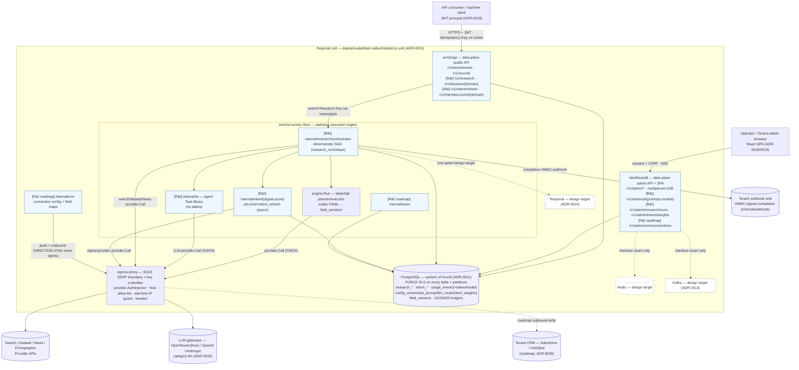
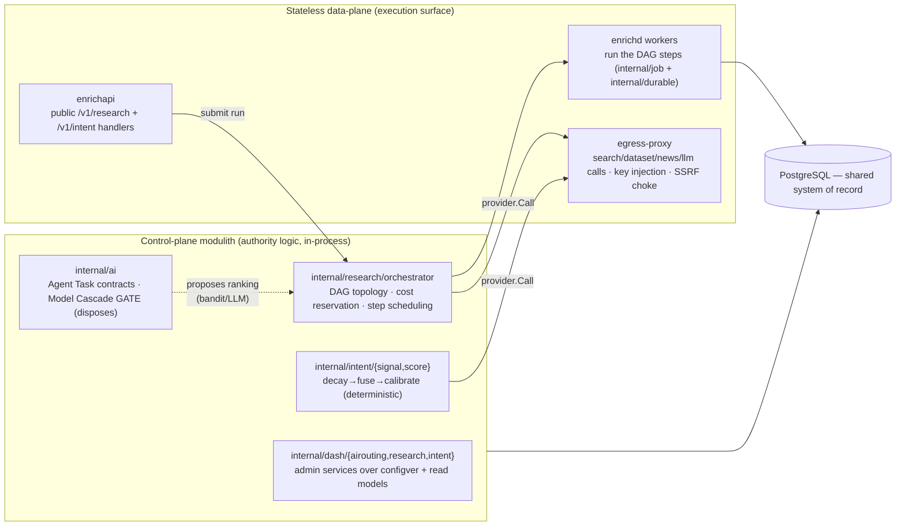

# 02 — Architecture

> **Status:** DRAFT · **Owner:** Lead Enterprise Solutions Architect · **Last updated:** 2026-07-09 · **Gated by:** /architecture-review, /security-audit, /scale-check, /provider-audit

> This document is the **C4 container view of the extended platform**. It shows where each new
> subsystem named in [`00-overview.md §2`](00-overview.md) sits in the **ADR-0010 modulith
> control-plane vs stateless data-plane** split, maps the **domain → Dossier** request path onto the
> existing code (`engine.Run`, `internal/job`, `internal/provider`, the egress-proxy) plus the new
> modules, and states the hard-gate compliance obligations enforced **by placement**. It **extends,
> never re-litigates**, the ratified architecture: ADR-0010 (modulith + data-plane), ADR-0011
> (Postgres-RLS), ADR-0012 (API strategy), ADR-0013 (Kafka design-target), ADR-0014 (Temporal
> cost-gated), ADR-0015 (regional cell), and the R&I ADRs 0025–0030. It realizes the subsystem/plane
> assignments frozen in [`00 §2.3`](00-overview.md) and the AI/intent designs in
> [`04`](04-ai-pipeline.md)/[`05`](05-intent-methodology.md). The governing invariant is verbatim:
> **"the model proposes, a deterministic gate disposes."** Terms follow the Glossary
> (`docs/00-Project-Overview.md §7` + [`00 §6`](00-overview.md)): Tenant, Company, Person, Provider,
> Field, Waterfall, Dossier, Research Run, Agent Task, Intent Signal, Intent Class Score, Model
> Cascade, Source Type. All latency/throughput/cost numbers are **UNVERIFIED** design targets until
> the gates in [`10`](10-scalability.md)/[`11`](11-cost-model.md)/[`13`](13-observability.md) measure
> them (`00 §8`).

---

## 1. Placement in the ratified architecture (ADR-0010)

ADR-0010 fixes two planes. The **control-plane modulith** holds authority logic — planning,
orchestration, config, scoring, admin — as in-process Go packages sharing one Postgres system of
record (ADR-0011). The **stateless data-plane** is the horizontally-scaled execution surface: the
`enrichapi` public API, the `enrichd` worker fleet, and the **egress-proxy** that is the *sole* SSRF
boundary and provider-key custodian. This series adds **no new plane and no new deployable** — every
new subsystem slots into one of the existing slots:

| New subsystem | Package(s) | Plane (ADR-0010) | Runs on deployable | Owns tables (migration) |
|---|---|---|---|---|
| AI research orchestration | `internal/research/orchestrator` | control-plane logic, executed on execution-engine workers | `enrichd` (fan-out); submitted from `enrichapi` | `research_runs`, `research_steps`, `research_dossiers`, `research_sources` (**0015**) + token/model cols on `usage_events` |
| AI agent library | `internal/ai` | control-plane | in-process in `enrichd` | — (library; no tables) |
| Data collection adapters | `internal/provider/adapters/*` (`search`/`dataset`/`news`/`llm`) | **data-plane egress** | egress-proxy (call path unchanged) | — (catalog rows only, registry projection, ADR-0023) |
| Computed intent | `internal/intent/{signal,score}` | control-plane, async lane | `enrichd` (`job.Kind=intent_refresh`) | `intent_signals` (partitioned), `intent_scores` (**0016**) |
| AI routing/prompts admin | `internal/dash/airouting` (thin over `configver`) | control-plane | `dashboardd` | — (`config_versions` kinds `ai_prompt`, `llm_route`) |
| Research monitoring admin | `internal/dash/research` | control-plane | `dashboardd` | — (reads `research_*`) |
| Intent surface admin | `internal/dash/intent` | control-plane | `dashboardd` | — (reads `intent_*`; owns `intent_weights` config) |
| News/market *(roadmap)* | `internal/news` | control-plane + data-plane egress | `enrichd` | `news_items`, `market_signals` (**0018**) |
| CRM outbound *(roadmap)* | `internal/crm` (push is a *direction* of the egress-proxy) | control-plane + egress direction | `dashboardd` (config) + egress-proxy (push) | `crm_connections`, `crm_field_maps`, `crm_push_ledger` (**0019**) |

Two placement rules are load-bearing and appear again in §3/§4:

1. **The orchestrator is control-plane *logic* that runs on data-plane *workers*.** It decides the DAG
   (`internal/research`), but its fan-out executes as `internal/job` + `internal/durable` steps on the
   `enrichd` fleet — the same durable queue/worker fabric enrichment already uses (ADR-0014: Temporal
   is a cost-gated design target behind an interface, **not** the v1 fan-out).
2. **Every new external call is a data-plane egress call.** Search/dataset/news/LLM providers — and
   roadmap CRM push — traverse the **single** egress-proxy with its host allow-list, dial-time IP
   guard, key injection, and breaker. A model can never open a socket; there is no second internet
   route (ADR-0010/0025/0030).

## 2. Container view (C4 level 2)

The diagram is the C4 container view of the *extended* platform. Solid edges are live call paths;
dashed nodes are ADR design-targets reachable only behind Go interface seams (unchanged from
`docs/waterfall-dashboard/02`). New R&I containers are tagged **[R&I]**.



Boundary rules the diagram encodes:

| Boundary | Rule | Source |
|---|---|---|
| consumer → enrichapi | `/v1/research` + `/v1/intent/*` on the **public** API deployable; JWT (ADR-0018); `Idempotency-Key` required on writes; snake_case JSON; uniform error body `{"error":{"code","message"}}`. | ADR-0012, `06` |
| enrichapi → orchestrator | No direct compute on the request thread: `POST /v1/research` writes a `research_runs` row and submits a Research Run via `internal/job`, returning `202 {job_id, status}` (or a capped sync preview). | ADR-0028, `04 §4` |
| worker → egress-proxy | **Only** through `provider.Call` under a `CallPolicy` with a leased key injected at egress; LLM/async policy `{Timeout:60–90s, MaxAttempts:1}` (ADR-0024/0026). No package opens its own socket. | ADR-0010/0024 |
| any module → Postgres | Only via the RLS tx helper; app role has no BYPASSRLS; `app.current_tenant`/`app.current_role` bound from the verified Principal (ADR-0020). | ADR-0011/0020 |
| CRM push (roadmap) | An **outbound direction** of the existing egress-proxy, **not** a second deployable; CRM tokens envelope-sealed, injected only at egress. | ADR-0030 |
| dashed nodes | Design targets behind Go interfaces only; no code path imports a client for them. | ADR-0011/0013/0014 |

## 3. Control-plane vs data-plane, subsystem by subsystem

The split is the auditability boundary: **authority decisions are control-plane and in one repo; every
byte on the wire is a data-plane egress call.**



Placement consequences that hold everywhere:

- **The Model Cascade *gate* is control-plane; the model *call* is data-plane.** `internal/bandit` or an
  LLM may *propose* a model ranking or a candidate answer (data returned over egress); the deterministic
  accept/escalate/stop gate in `internal/ai`/`internal/research` *disposes* on deterministic signals
  only (schema-valid, budget, attempt count, agreement) — never LLM self-confidence, never a
  model-chosen tool (ADR-0026; `04 §5`).
- **Intent scoring is control-plane and deterministic.** LLM-extracted signals arrive as data-plane
  results but enter the deterministic decay→fuse→calibrate pipeline as `ai_inference` signals; the
  customer-visible Intent Class Score is computed in-process, reproducibly, against a pinned
  `config_version_id` (ADR-0027; `05`).
- **Admin surfaces are read-mostly control-plane on `dashboardd`.** `internal/dash/research` reads
  `research_*`; `internal/dash/intent` reads `intent_*` and owns the `intent_weights` config;
  `internal/dash/airouting` is a thin service over `configver` for `ai_prompt`+`llm_route`. None own a
  new table beyond the `configver` kinds — the no-orphan-UI rule from `docs/waterfall-dashboard/02` holds
  (`08`).

## 4. The domain → Dossier request path

One `POST /v1/research` walks the frozen path **collect → enrich → AI research → tech → news → intent
→ competitors → summary → validate → CRM-map → store → respond/webhook**, mapped onto existing code
plus the new modules. The async lane is the default; `?mode=sync` returns a capped-budget preview
(firmographics + `company_profile`, last-known/`pending` intent) and never blocks on a compute
(ADR-0028; `06`).

```mermaid
sequenceDiagram
    autonumber
    participant C as API consumer
    participant API as enrichapi /v1/research
    participant J as internal/job + internal/durable
    participant O as internal/research/orchestrator
    participant COL as collection adapters — search/dataset/news
    participant W as engine.Run — Waterfall scalar Fields
    participant AI as internal/ai Agent Tasks
    participant GATE as Model Cascade gate — deterministic
    participant EG as egress-proxy — SSRF + key inject
    participant INT as internal/intent — async
    participant WH as internal/webhook — HMAC
    participant PG as PostgreSQL

    C->>API: POST /v1/research {company_domain, wanted_sections[]} + Idempotency-Key
    API->>PG: ledger-before-call (G2); write research_runs; reserve aggregate Dossier ceiling (G4)
    API-->>C: 202 {job_id, status:"queued"}
    API->>J: submit Research Run
    J->>O: dispatch (worker resumes mid-run on crash — internal/durable)

    Note over O,EG: COLLECT — seeds via egress (structured API responses only; ADR-0025)
    O->>EG: provider.Call search/dataset/news (G3/G4)
    EG->>COL: bounded call, key injected at boundary
    COL-->>O: firmographic/technographic/postings/filings/news seeds

    Note over O,W: ENRICH — scalar Fields flow through the existing Waterfall
    O->>W: enrich canonical scalar Fields (incl. 6 new URLs/ticker/funding)
    W->>EG: provider.Call firmographic providers
    W->>PG: field_versions (+ G5 provenance)

    Note over O,GATE: AI RESEARCH — company_research → tech → news → competitors → summary
    O->>AI: company_research (resolves Company identity) then tech/hiring/news/competitor/seo/market
    AI->>EG: LLM provider.Call (CallPolicy{60–90s,1})
    EG-->>AI: candidate answer (proposal)
    AI->>GATE: dispose: schema-valid? budget? attempts? agreement?
    GATE-->>AI: accept / escalate one tier (free→mid→paid) / stop
    AI->>PG: research_steps (+ research_sources, source_type=ai_inference, losers retained)

    Note over O,INT: INTENT — proposed signals hand off ASYNC (never blocks the run)
    O->>INT: intent Agent Task deposits ai_inference proposals → job.Kind=intent_refresh
    INT-->>O: (async) last-known Intent Class Scores or pending

    Note over O,PG: VALIDATE → CRM-MAP → STORE
    O->>AI: summarization (depends on all sections) → json_validation guard
    O->>PG: assemble research_dossiers (crm_ready projection built here)

    O->>WH: completion webhook (HMAC-signed, idempotent)
    WH-->>C: POST {job_id, status:"succeeded", dossier_url}
    C->>API: GET /v1/research/{id} (or GET /v1/dossiers/{domain})
    API-->>C: 200 Dossier JSON
```

Path notes tying the stages to code:

| Stage | Code | Notes |
|---|---|---|
| **collect** | `internal/research/orchestrator` → `internal/provider` (`search`/`dataset`/`news`) via egress | Structured API responses only; a returned URL is discovery-only, resolved via another Provider API (ADR-0025). Common Crawl index-only. |
| **enrich** | `engine.Run(ctx, req, plan)` | The scalar parts that are canonical Fields use the existing Waterfall planner/executor and land in `field_versions` — including the six new scalars (`twitter_url`, `facebook_url`, `github_url`, `crunchbase_url`, `company_ticker`, `total_funding_usd`; ADR-0028). |
| **AI research → tech → news → competitors → summary** | `internal/ai` Agent Tasks on `internal/job`+`internal/durable`, disposed by the Model Cascade gate | `company_research` first (resolves Company identity), then the six section tasks concurrently, then `summarization` (`04 §3–§5`). |
| **intent** | `internal/intent` via `job.Kind=intent_refresh` | **Async only** — never blocks; the run deposits `ai_inference` proposals and reads last-known/`pending` (ADR-0027; `05`). |
| **validate** | `json_validation` Agent Task (struct-based, stdlib) | Struct-invalid output can never enter a Dossier; re-ask capped by `CallPolicy.MaxAttempts` (`04 §6`). |
| **CRM-map** | `internal/research` builds `crm_ready.{account,contact}` | Normalized projection so a roadmap CRM connector ingests without transformation (ADR-0028/0030). |
| **store** | `research_dossiers` + `research_sources` (0015) | One `research_sources` row per source reference (G5); `ai_inference` visibly distinct, never a high-confidence fact. |
| **respond/webhook** | `GET /v1/research/{id}`, `GET /v1/dossiers/{domain}`, `internal/webhook` HMAC | Mirrors `GET /v1/enrichments/{id}`; webhook signer is the existing one (`06`). |

## 5. Hard-gate compliance enforced by placement

The five platform gates and the single SSRF boundary are satisfied by **where each subsystem sits**,
not by new machinery. Each row is a release obligation whose proof lands as a test in the slices
(`14`, `16`); numbers stay UNVERIFIED until measured.

| Gate | Enforced by placement | Where | Proof obligation |
|---|---|---|---|
| **G1 tenant isolation** | Every new table (`research_*`, `intent_*`, roadmap `news_*`/`crm_*`) is control-plane state in Postgres with `tenant_id` + FORCE RLS (partitions too); `intent_signals` policy applies to parent **and** partitions; hot-path role has no BYPASSRLS; GUCs bound from the verified Principal. | `internal/research`, `internal/intent`, tx helper | Cross-tenant zero-rows test on **every** new table + partition (release blocker, `14`). |
| **G2 idempotency** | Ledger-before-call on every search/dataset/news/LLM/CRM call; `POST /v1/research` + `intent_refresh` are idempotent; LLM key pins `model`+`prompt_version`+`input_hash`+`config_version` (cache-on-first-success). | `enrichapi` handler, `internal/ai`, `internal/intent` | Replay → same `job_id`/result; reuse with different body → 409 (`06 §`). |
| **G3 bounded** | All new calls go through `provider.Call` with a `CallPolicy` (LLM/async `{Timeout:60–90s, MaxAttempts:1}`, ADR-0024) + breaker; the DAG itself is bounded by attempt counters and the durable step log. | data-plane egress + orchestrator | Integration test drives an LLM adapter through `provider.Call`; policy honored (`04 §2`). |
| **G4 cost ceiling** | Aggregate Dossier ceiling reserved at `research_runs` creation *before* collection; per-step reserve/charge; LLM reserve-on-estimate/charge-on-actual tokens (columns on `usage_events`); per-Tenant AI/intent budget via `configver`. | `internal/research`, egress accounting | Cost telemetry shows paid-token share below cap (UNVERIFIED, `11`). |
| **G5 provenance** | Every Field + Dossier value records provider, `source_type` (`api`\|`dataset`\|`ai_inference`), cost, idempotency key, confidence; losers retained; queryable via `research_sources`; jobs pin `config_version_id`. | `research_sources`, `field_versions` | A Dossier value with no `research_sources` row fails the parity/provenance test (`06`, `14`). |
| **SSRF / single boundary** | The egress-proxy is the **sole** internet route **in and out**; the host allow-list is extended per new adapter; CRM push is a *direction* of it, not a second egress; **a model cannot SSRF** (no model-driven fetch — the orchestrator chooses tools). | egress-proxy only | Dial-time guard refuses RFC1918/metadata targets; audit finds no second egress and no direct socket (`09`, ADR-0030). |

## 6. Deployment fit

No new binary. The three existing deployables absorb the R&I subsystems along their existing scaling
axes (ADR-0010/0015); env/config detail is in [`12`](12-deployment.md).

| Deployable (`cmd/*`) | Absorbs | Scaling axis | Why it fits |
|---|---|---|---|
| **`enrichapi`** | `/v1/research`, `/v1/research/{id}`, `/v1/dossiers/{domain}`, `/v1/intent/refresh`, `/v1/intent/accounts/{domain}` | request rate (stateless) | Same public-API shape, auth, idempotency, and error body as `/v1/enrichments`; a research request is a *submit + poll* like an Enrichment Job (`06`). |
| **`enrichd`** | orchestrator DAG fan-out, Agent Tasks, `intent_refresh` refreshes | job throughput (autoscale on queue depth) | The durable `internal/job`+`internal/durable`+`internal/pgoutbox` fabric already runs bounded, resumable steps; the DAG is more of the same (ADR-0014 — not Temporal by default). |
| **`dashboardd`** | `/v1/admin/ai/{prompts,models}`, `/v1/admin/research/runs`, `/v1/admin/intent/weights`, roadmap `/v1/admin/crm/connections` | admin traffic (read-mostly) | New `internal/dash/*` feature packages follow the five-file module shape, reuse SSE/telemetry/cost/health/approvals, and add no new table beyond `configver` kinds (`08`). |
| **egress-proxy** (within the data-plane) | search/dataset/news/llm categories; roadmap CRM outbound direction | egress fan-out | Host allow-list + key injection + breaker are per-adapter config; zero new call path, zero new Go dependency (ADR-0025/0026/0030). |

Regional-cell fit (ADR-0015) is unchanged: research/intent are Tenant-scoped like enrichment and live
inside the cell's residency/blast-radius unit; roadmap CRM push stays inside the cell's egress-proxy.
The design targets (Redis/Kafka/Temporal) remain interface seams — the DAG fan-out uses the Postgres
`internal/job` path now and can adopt Temporal later behind the same interface without a topology
change (`00 §5`, ADR-0014).

## 7. What this document does **not** change

| # | Not changed | Pointer |
|---|---|---|
| 1 | The architecture style — modulith control-plane + stateless data-plane. New subsystems extend it. | ADR-0010, `00 §3` non-goal 5 |
| 2 | The number of internet routes — still exactly one (the egress-proxy), in and out. | ADR-0010/0030 |
| 3 | The Go dependency set — LLM/search/dataset/news/CRM are HTTP+JSON adapters; zero new dep. | ADR-0016/0022/0026 |
| 4 | The one-owner-per-table registry — `internal/research` owns `research_*`, `internal/intent` owns `intent_*`; canonical names fixed (never the `dossiers` alias). | `00 §2.3`, ADR-0028 |
| 5 | The sync path — computed intent is async-only; the sync preview is capped and never blocks. | ADR-0027, `00 §3` non-goal 6 |

## Open items

| ID | Item | Status | Owner |
|----|------|--------|-------|
| ARCH-RI-1 | Orchestrator ↔ `internal/durable` step-resume contract (which DAG stages checkpoint) — ratify at /architecture-review, detail in `04 §4`/`10` | OPEN (decision recorded: `internal/job`+`internal/durable`, not Temporal) | Lead Solutions Architect |
| ARCH-RI-2 | `enrichapi` vs `enrichd` split for the sync-preview compute (capped preview runs inline on `enrichapi` or hops to a worker) | OPEN — resolve with the `06` sync-preview budget | Principal Backend Engineer |
| ARCH-RI-3 | Egress-proxy outbound "write" mode for roadmap CRM push (ADR-0030) — placement recorded, implementation deferred to Slice 27+ | Deferred (roadmap) | Staff Security Engineer |
| ARCH-RI-4 | All latency/throughput figures in §2–§6 (sync p95, DAG fan-out concurrency) are UNVERIFIED until the `10`/`13` load gates | OPEN — converted by `10` load-test plan | Principal Backend Engineer |
| ARCH-RI-5 | Temporal adoption trigger for the DAG fan-out (QS-TMP-1 hedge) — the interface seam is in place; swap is cost-gated (ADR-0014) | Deferred | Lead Solutions Architect |
