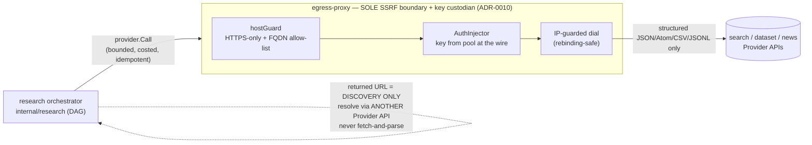
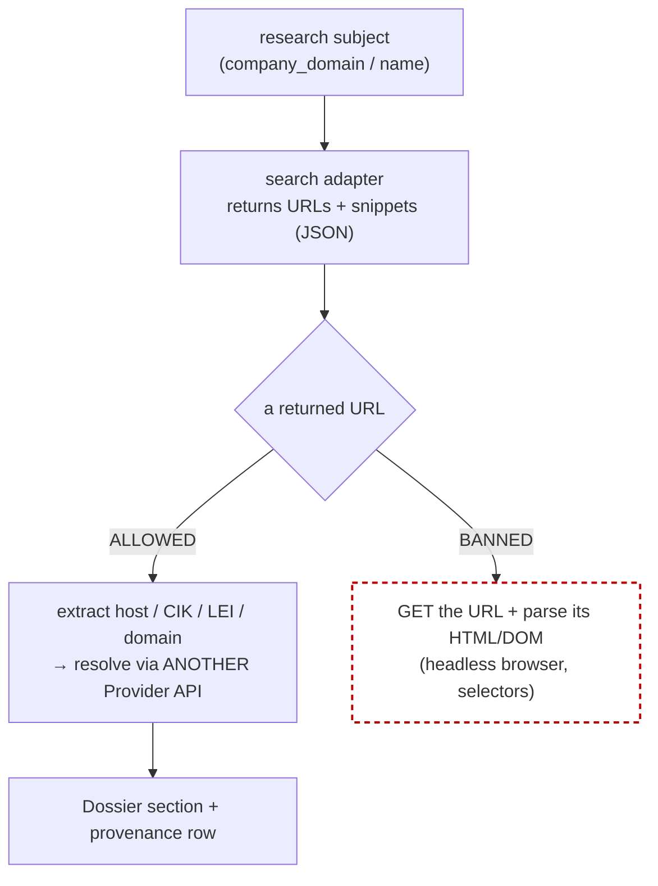

# 03 — Data Collection Engine

> **Status:** DRAFT · **Owner:** Principal Backend Engineer (Data Plane) · **Last updated:** 2026-07-09 · **Gated by:** /architecture-review, /security-audit, /provider-audit

> This document designs the **Data Collection Engine** — the `search` / `dataset` / (roadmap) `news`
> Provider categories that feed the Dossier. It **realizes [ADR-0025](../../adr/0025-data-collection-search-dataset-apis.md)**
> (search + public-dataset APIs are legitimate server-side Providers; the returned-URL / page-fetch
> boundary; Common Crawl index-only) and slots those adapters into the existing egress machinery
> exactly as [`00-overview.md §2.3`](00-overview.md) fixes: adapters are **code** in
> `internal/provider/adapters/*.go`, the catalog is their **projection** (ADR-0023,
> `cmd/providerseed`), and every call passes the five gates through the **single** SSRF-guarded
> egress-proxy. Provider profiles and cited facts live in [`01-research-findings.md`](01-research-findings.md);
> the field/Dossier targets are fixed by [ADR-0028](../../adr/0028-research-dossier-api-field-additions.md)
> and detailed in [`07-provider-expansion.md`](07-provider-expansion.md). Nothing here forks a locked
> decision; it is the build spec for collection.

---

## 1. Role & position

Producing a **Dossier** (`00 §6`) needs two data shapes the enrichment roster does not cover:
**web-search discovery** (find the entities/records that mention a Company) and **authoritative public
datasets** (firmographics, filings, scholarly, legal-entity). The Data Collection Engine adds these as
**ordinary Providers** — no new call path, no new deployable, **zero new Go dependency**. Each adapter
is a secret-free `provider.HTTPAdapter` / `AsyncHTTPAdapter` emitting an `AuthDescriptor`; the egress
tier injects the credential and enforces SSRF; the breaker, cost, and idempotency ledgers apply
unchanged. The engine is a **data-plane** concern (`00 §2.3`): collection runs on the execution-engine
workers under the research orchestrator ([`04-ai-pipeline.md`](04-ai-pipeline.md)), never on the sync
per-Field hot path except for the capped-budget preview.

## 2. The three new categories as registry rows

Categories are **one slug each, no aliases** (ADR-0025): `search`, `dataset`, `news`. Because
`providers.category` has no CHECK constraint, introducing them needs **no migration** (ADR-0025
§Decision). An adapter is added exactly as every existing one: **append one `Registered` entry to
`internal/provider/adapters/registry.go` + write its `<slug>.go` file** (the registry is an explicit
append-only slice — "no `init()` magic, no codegen"). The table below is the initial set; full auth
schemes, DocsURLs, and status rationale are in [`07 §2`](07-provider-expansion.md).

| Category | Slug | Sync / async | ADR-0009 status | What it collects | Boundary note |
|---|---|---|---|---|---|
| `search` | `brave-search` | sync (`New`) | ACTIVE-CANDIDATE | Own-index web discovery | URLs discovery-only |
| `search` | `serper` | sync (`New`) | **DEPRIORITIZED** | Google-SERP-derived discovery | off by default; compliance-gated |
| `search` | `tavily` | sync (`New`) | **DEPRIORITIZED** | LLM-search discovery | off by default; index fields only |
| `dataset` | `common-crawl` | sync (`New`) | ACTIVE-CANDIDATE (**index-only**) | CDX capture index (URL/host discovery) | **WARC bodies DEFERRED** |
| `dataset` | `openalex` | sync (`New`) | ACTIVE-CANDIDATE | Scholarly works/authors/institutions | structured entities |
| `dataset` | `sec-edgar` | sync (`New`) | ACTIVE-CANDIDATE | US filings (Submissions / XBRL facts) | CIK resolves via EDGAR API |
| `news` *(roadmap)* | *(e.g. `gdelt`)* | sync (`New`) | ACTIVE-CANDIDATE (**index-only**) | News/event index discovery | roadmap (`internal/news`, migration 0018); index-only, same boundary |

> `news` is **roadmap** (`00 §2.2`): `internal/news` owns `news_items`/`market_signals` at migration
> **0018**, behind a later gate. Its adapters obey the *same* ADR-0025 boundary (index/structured
> response only), so they are listed here for completeness, not built in the core spine.

## 3. The ADR-0025 no-scraping boundary (load-bearing)

The failure mode ADR-0025 guards is not "calling a search API," it is "following its URLs into page
scraping." The boundary is **structural and testable**, not a slogan:

1. **Structured responses only.** An adapter's `Decode` consumes **only** a provider's server-side
   **JSON / Atom / CSV / JSONL** response. It **never** issues a raw GET to an arbitrary page and runs
   DOM selectors, headless-browser automation, or HTML parsing over page bodies. (Enforced by the same
   `HTTPAdapter.Decode` contract every roster adapter uses; grep for HTML-parsing/headless imports must
   find none — the Go backend is stdlib-only, ADR-0016/0022.)
2. **Returned URLs are discovery-only.** A URL a search API returns may be resolved **only** by passing
   its host/identifier to **another registered Provider API** — a returned domain → GLEIF LEI lookup, a
   returned CIK → SEC EDGAR filing API, a returned company name → a firmographics adapter. It is
   **never** fetched-and-parsed as a web page.
3. **Common Crawl is index-only.** The `common-crawl` adapter consumes the **CDX index API** (URL/host
   discovery) exclusively. Parsing Common Crawl **WARC bodies** is archived-page-HTML extraction —
   scraping-by-proxy — and is **DEFERRED** (needs its own future ADR; `00` RI-OI-4). The adapter has no
   WARC-body code path.
4. **Browser automation / headless / DOM scraping are permanently banned** (ADR-0002 core, restated by
   ADR-0025). **No first-party crawling** anywhere.

**Verification obligation** (ADR-0025 §Verification, lands as tests in `14`): a Gap-Analysis + Security
audit confirms no `search`/`dataset` adapter issues a raw page GET or runs DOM/HTML parsing; every URL
is resolved solely via another registered Provider API; the `common-crawl` adapter exposes no WARC-body
access.

## 4. Egress SSRF host-allow-list expansion

The egress-proxy is the **sole** SSRF boundary in *and* out (ADR-0010; `00 §9`). Every new adapter's
default base host must be on the FQDN allow-list before its first call. The mechanism already exists and
is **automatic**, not hand-edited:

- `adapters.Hosts()` (`internal/provider/adapters/registry.go`) returns the distinct default base-URL
  hostnames of **every** registered adapter; the enrich binaries build the egress allow-list with
  `provider.NewHostAllowList(adapters.Hosts()...)` (`internal/provider/ssrf.go`).
- **Adding a `search`/`dataset` adapter therefore extends the allow-list by construction** — appending
  the `Registered` row makes its host appear in `Hosts()`. No separate allow-list file is edited.
- The allow-list is a **FQDN** check; the resolved IP is validated at **dial time** against the
  internal-range blocklist (loopback, RFC1918/ULA, link-local incl. `169.254.169.254`, CGNAT,
  `0.0.0.0/8`), which is **DNS-rebinding-safe** and immune to IP-literal tricks. HTTPS is mandatory;
  redirects are re-checked on every hop and capped at 5.
- **Who adds hosts.** A backend engineer adds the adapter + row (code review); the host is admitted only
  because the constructed adapter's `Base()` is a real vendor FQDN. An operator never types a host into a
  UI — that would be a record-data-derived host, which the allow-list explicitly forbids. OAuth token
  URLs (`AuthDescriptor.TokenURL`) must **also** be on the allow-list, since the token exchange runs
  through the same SSRF-checked base transport (`internal/provider/egress.go`).

**SSRF test** (per adapter, `14`): an RFC1918 / metadata-endpoint target for the new host is refused
with `ErrSSRFBlocked` (classified `BAD_REQUEST`, non-retryable).

## 5. Async CallPolicy & bounded execution (G3)

Every collection call runs through `provider.Call` under a `CallPolicy` (G3 bounded). Two shapes:

| Adapter kind | Constructor | `CallPolicy` | Rationale |
|---|---|---|---|
| Single request/response search + dataset | `New` → `HTTPAdapter` | engine default (or a per-adapter override via `HTTPAdapter.Policy`) | Brave/Serper/Tavily, OpenAlex, SEC EDGAR, GLEIF, CDX are single-shot. |
| Multi-round-trip (submit→poll / match→fetch) | `NewAsync` → `AsyncHTTPAdapter` | ADR-0024 async shape `{Timeout: 60–90 s, MaxAttempts: 1}` | Only if a `dataset`/`news` source is inherently multi-step (none of the initial set is; reserved for parity with the async roster). |

The initial `search`/`dataset` adapters are all **sync** `New` adapters. The **60–90 s / MaxAttempts:1**
async policy is the same one the LLM adapters carry (ADR-0026); it is not a default for the fast search
APIs, which stay on the engine default plus a breaker. SEC EDGAR's fair-access rate and Brave's 50-qps
capacity map to the row's `rate_limit_rpm` / breaker columns at seed time (`07`); exact numbers are
**UNVERIFIED** until measured (`00` RI-5/RI-6).

## 6. Freshness & caching (G2)

Collection is idempotent and cache-first, reusing the platform's G2 ledger — **no Redis, no new store**:

- **Ledger-before-call (G2).** Every collection call writes its idempotency ledger row before egress;
  the key pins `config_version` + the normalized subject (`company_domain` / CIK / LEI) + the adapter
  slug. A replay returns the stored result. (For LLM calls the key additionally pins `model` +
  `prompt_version` + `input_hash`, ADR-0026 — not applicable to deterministic search/dataset calls.)
- **Freshness TTL.** A Dossier section carries `data_freshness{generated_at, last_updated}` (ADR-0028);
  `internal/research` re-enqueues a refresh via `internal/job` on a per-section TTL. Search discovery is
  short-TTL (surging/news-adjacent); authoritative datasets (filings, LEI) are long-TTL. Exact TTLs are
  a tuning parameter tracked as **UNVERIFIED** (RI-6) until a freshness measurement (`14`).
- **Dedup is deterministic.** Deduplication of collected records uses deterministic keys
  (`company_domain`, normalized name, CIK, LEI) + the idempotency ledger + Postgres full-text — **no
  embeddings / vector store** (RAG deferred, ADR-0029).

## 7. Per-category field / Dossier mapping

Collected data lands under the **boundary rule** (ADR-0028): single-valued → a canonical Field (waterfall
+ `field_versions`); multi-valued/relational → **Dossier-only**. `source_type` is recorded on every
value; **`ai_inference` is never fused as a fact** (`00 §3`).

| Category | Typical outputs | Lands as | `source_type` |
|---|---|---|---|
| `search` | Discovered entity URLs/snippets → resolved via another Provider API | Dossier `news[]`, `search_keywords[]`, competitor discovery seeds; scalar Fields only after resolution (e.g. `crunchbase_url`) | `api` |
| `dataset` — SEC EDGAR | Ticker, filings, XBRL facts (funding/revenue) | `company_ticker` Field; funding/filings enrich Dossier `firmographics` + `funding_rounds[]` | `dataset` |
| `dataset` — GLEIF | LEI, legal name, parent/child hierarchy | Dossier `firmographics` + `locations[]`; deterministic **resolution key** | `dataset` |
| `dataset` — OpenAlex | Scholarly works/affiliations (R&D signal) | Dossier `firmographics`/`technographics` context; an intent **signal** (ADR-0027) | `dataset` |
| `dataset` — Common Crawl (index) | Host/URL presence + timestamps | discovery seeds only (which Provider API to call next) | `dataset` |
| `news` *(roadmap)* | News/event index records | Dossier `news[]`; intent `buying_signals[]` | `api` |

The six new **canonical scalar Fields** that collection can populate (`twitter_url`, `facebook_url`,
`github_url`, `crunchbase_url`, `company_ticker`, `total_funding_usd`) are registered **doc-first**
(ADR-0028; `07 §4`); all multi-valued objects stay Dossier-only.

## 8. Gates G1–G5 per collection call

| Gate | How a `search`/`dataset` call satisfies it |
|---|---|
| **G1 tenant isolation** | Collected values + provenance rows carry `tenant_id` + FORCE RLS on `research_*` (migration 0015); the hot-path role has no BYPASSRLS; `app.current_tenant`/`app.current_role` bound from the verified Principal. |
| **G2 idempotency** | Ledger-before-call keyed on `config_version` + normalized subject + slug; replay returns the stored result; cache-first (§6). |
| **G3 bounded** | Every call via `provider.Call` under a `CallPolicy` + breaker + capped retry; async sources use `{Timeout:60–90 s, MaxAttempts:1}`; every fetch through the egress-proxy only. |
| **G4 cost ceiling** | Aggregate Dossier ceiling reserved before collection; per-call reserve/charge against the cost ledger; DEPRIORITIZED sources routed last so free/clean sources spend first. |
| **G5 provenance** | Every value records provider, `source_type ∈ {api,dataset,ai_inference}`, cost, idempotency key, confidence in `research_sources`; losers retained; `ai_inference` never fused as a high-confidence fact. |
| **SSRF / single boundary** | FQDN allow-list (auto-extended via `adapters.Hosts()`) + dial-time IP guard; a **model cannot SSRF** (no model-driven fetch — the DAG, not the LLM, chooses which adapter to call). |

## Open items

| ID | Item | Status | Owner |
|---|---|---|---|
| DC-OI-1 | Per-section freshness TTLs (short for search/news, long for datasets) | UNVERIFIED until measured (`14`) | Backend + Product |
| DC-OI-2 | Seed `rate_limit_rpm` / breaker for SEC EDGAR fair-access + Brave 50-qps | Open — from `01` RF-OI-1 | Backend |
| DC-OI-3 | Common Crawl WARC-body extraction (index-only for now) | Deferred — needs its own ADR (`00` RI-OI-4) | Architecture |
| DC-OI-4 | ADR-0009 human-policy confirmation for Serper/Tavily before enabling | Pending (`00` RI-OI-1) | Security + Product |
| DC-OI-5 | `news` category adapters (roadmap, `internal/news`, migration 0018) | Roadmap (`15`) | Backend |
