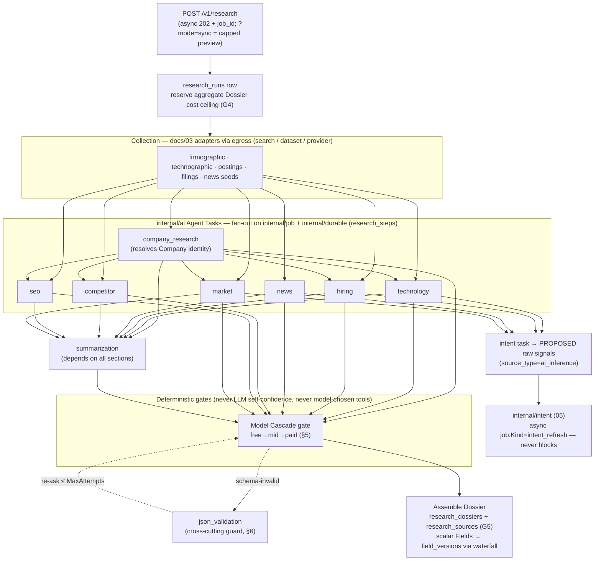

# 04 — AI Research Engine & Orchestration

> **Status:** DRAFT · **Owner:** Staff ML Engineer · **Last updated:** 2026-07-09 · **Gated by:** /architecture-review, /security-audit, /provider-audit

> This document realizes the **AI Research Engine** subsystem named in [`00-overview.md §2.1`](00-overview.md)
> and the two AI-layer ADRs it slots into: **ADR-0026** (LLM-as-egress-adapter + deterministic cost cascade)
> and **ADR-0027** (computed intent consumes LLM-*proposed* signals). It is the design authority for
> `internal/ai` (the typed agent-task library) and `internal/research/orchestrator` (the deterministic DAG),
> and it inherits — never re-litigates — ADR-0007 (Pandora reservation-value cascade), ADR-0008 (guardrailed
> bandit), ADR-0005 (calibrate-then-fuse), ADR-0024 (async-adapter `CallPolicy`), ADR-0014 (Temporal is
> cost-gated, *not* the default fan-out), and ADR-0016/0022 (stdlib-only). The governing invariant is
> verbatim: **"the model proposes, a deterministic gate disposes."** Terms follow the Glossary
> (`docs/00-Project-Overview.md §7` + [`00 §6`](00-overview.md)): Tenant, Company, Person, Provider, Field,
> Waterfall, Dossier, Research Run, Agent Task, Prompt Version, Model Cascade, Source Type.

---

## 1. Role & invariant

The AI Research Engine turns collected structured data (search/dataset/provider results, `docs/03`) into
the reasoned sections of a **Dossier** — summaries, extracted entities, classifications, normalizations, and
*proposed* intent signals. It does this with **zero new Go dependency**: every LLM call is an ordinary
Provider adapter through the existing egress tier (ADR-0026), and every spend, tool, and escalation decision
is disposed by a **deterministic gate over deterministic signals** — never by an LLM's self-reported
confidence and never by a model-chosen tool call (ADR-0026 §Decision). Two engine boundaries hold everywhere
in this document:

| Boundary | Rule | Source |
|---|---|---|
| **LLM never disposes** | An LLM (and the `internal/bandit` router) may only *propose* — a candidate answer, a signal, a model ranking. The orchestrator's deterministic gate accepts / escalates / stops. | ADR-0026, governing invariant |
| **AI output is never a fact** | Every AI-derived value carries `source_type = ai_inference`, is kept distinct, and is **never** fused as a high-confidence sourced fact (intent signals are re-fused through the deterministic pipeline of `05`, not written through). | ADR-0026/0028, `00 §3` |

All latency, token-cost, and paid-share numbers here are **design targets** carried as **UNVERIFIED** until
measured (`11`, `13`); see `00 §8`.

## 2. LLM-as-egress-adapter mechanics

An LLM chat/completions call is plain HTTPS + JSON (the OpenAI-compatible schema OpenRouter/OpenAI/Anthropic
expose), transport-indistinguishable from the ~145 provider calls the egress tier already makes. So an LLM is
a **Provider**: a `provider.HTTPAdapter` (or `AsyncHTTPAdapter` for slow/streamed models) in
`internal/provider/adapters/*.go`, self-registered through `registry.go` under the single new category **`llm`**
(ADR-0025 §Decision; one slug, no aliases). No new call path, no new dependency.

**Example adapters (code, ADR-0023 projection):** `openrouter` (free-model pool — the default carrier),
`openrouter-paid`, `openai`, `anthropic`. Each emits an `AuthDescriptor{Scheme: AuthBearer,
KeyPoolSelector: "<slug>:default"}` (`internal/provider/provider.go`); the egress `AuthInjector` attaches the
bearer key **as the request leaves the trust boundary** — the adapter never holds a secret, exactly as today.

The five gates map onto the call verbatim:

| Gate | Mechanism on an LLM call |
|---|---|
| **G3 bounded** | `provider.Call` with a `CallPolicy{Timeout: 60–90s, MaxAttempts: 1}` (the ADR-0024 async-adapter shape, surfaced via `PolicyOverrider`/`HTTPAdapter.Policy`) + the per-model breaker. The `MaxAttempts:1` is the *transport* bound; the orchestrator's re-ask/escalation loop (§5) is a separate, gate-bounded layer above it — an LLM call never resubmits itself. |
| **G4 cost ceiling** | Reserve **estimated** tokens *before* the call, charge **actual** prompt+completion tokens *on success* (existing reserve/charge with an over-reserve buffer + nightly reconcile, OI in `11`). The aggregate Dossier ceiling is reserved once before collection (ADR-0028). |
| **G2 idempotency** | Ledger-before-call. Key = `hash(tenant, subject, task_type, model_slug, prompt_version, input_hash, config_version)`. LLM output is not bit-reproducible, so G2 here means **cache-on-first-success** (temperature pinned low / seed where honored), *not* reproduce-identically; re-issuing the key returns the stored result (ADR-0026 §Nondeterminism). |
| **G5 provenance** | Every AI-derived value records `provider` (model slug), `source_type = ai_inference`, tokens, cost, `prompt_version`, and confidence, with **losing candidate answers retained** — into `research_sources` (migration 0015). |
| **G1 tenant isolation** | Token/cost accounting rows carry `tenant_id` + FORCE RLS; the new **token/model columns on `usage_events`** (migration 0015) inherit the table's existing tenant policy. |

**Accounting columns (migration 0015).** `usage_events` gains `model_slug text`, `prompt_tokens int`,
`completion_tokens int`, `llm_cost_usd numeric` (nullable — non-LLM rows leave them NULL), so per-model spend
and free-vs-paid share are queryable alongside every other provider call. No new ledger table (one-owner-per-table:
`usage_events` keeps its owner).

## 3. Agent Task catalog (`internal/ai`)

`internal/ai` is a **library, not a service** — it owns **no tables** (`00 §2.3`). It exposes one typed
**Agent Task** per unit of AI work: a `TaskType`, an input contract, a **Prompt Version** (a `config_versions`
kind `ai_prompt`, §7), and a **typed Go output struct** that the response must unmarshal into (§6). Each task
executes as one `research_steps` row (§4). The ten tasks are frozen (`00 §2.1`):

| `TaskType` | Input contract (typed) | Prompt (`ai_prompt` key) | Typed output struct → Dossier target |
|---|---|---|---|
| `company_research` | `{company_domain, name?, firmographic_seeds}` (from `search`/`dataset`/firmographic adapters) | `company_research.v*` | `CompanyProfile{legal_name, description, hq, employees_band, sector, socials…}` → `company_profile`, resolves the canonical Company identity |
| `technology` | `{company_domain, technographic_seeds}` (BuiltWith/Wappalyzer/HG deltas) | `technology.v*` | `TechStack{categories[], products[], recent_adds[], recent_drops[]}` → `technographics` |
| `hiring` | `{company_domain, job_postings[]}` (TheirStack/PredictLeads) | `hiring.v*` | `HiringSignals{roles[], departments[], velocity, locations[]}` → `hiring_signals[]` + intent input |
| `news` | `{company_domain, name, date_window}` (`news`/`search` adapters) | `news.v*` | `NewsItems[]{title, url, published_at, topic, sentiment}` → `news[]` |
| `competitor` | `{company_domain, sector}` | `competitor.v*` | `Competitors[]{name, domain, basis}` → `competitors[]` (Dossier-only, never a Field per ADR-0028) |
| `seo` | `{company_domain}` | `seo.v*` | `SEOProfile{keywords[], topics[]}` → `search_keywords[]` (Dossier-only) |
| `market` | `{company_domain, sector, firmographics}` | `market.v*` | `MarketContext{segment, trends[], tam_notes}` → market intent input |
| `intent` | `{company_domain, collected_signals[]}` (technographic deltas, postings, funding, news) | `intent.v*` | `ProposedSignals[]{class, type, magnitude, evidence}` — **proposed raw signals only**, `source_type = ai_inference`; handed to `internal/intent` (`05`), **never** written as a class score |
| `summarization` | `{assembled_sections}` | `summarization.v*` | `Summary{ai_summary, ai_reasoning}` → `ai_summary`, `ai_reasoning` |
| `json_validation` | `{raw_model_text, target_struct}` | `json_validation.v*` | the target struct, or a bounded re-ask (§6) |

The `intent` task is the sole bridge into the Computed Intent Engine and is deliberately declawed: it **proposes**
`{class, type, magnitude, evidence}` observations that enter the decay→fuse→calibrate pipeline of [`05`](05-intent-methodology.md)
as one more `ai_inference` signal — it never emits a customer-visible Intent Class Score.

## 4. Deterministic orchestration DAG (`internal/research/orchestrator`)

A **Research Run** (one `POST /v1/research`) is a **deterministic DAG** fanned out on the **existing
`internal/job` + `internal/durable` lane — not Temporal by default** (ADR-0014: Temporal is a cost-gated
design target behind an interface, not the v1 fan-out). The orchestrator writes a `research_runs` row, then
schedules Agent Tasks as `research_steps` rows with explicit dependencies; each step's durable state is the
`internal/durable` log, so a worker crash resumes mid-Run rather than restarting it. Collection adapters
(`docs/03`) supply seeds; the intent hand-off is async (`05`), so intent **never** blocks the sync preview.

Ordering rules the DAG encodes: `company_research` runs first (it resolves the canonical Company identity the
other tasks key on); the six section tasks then run **concurrently**; `intent` consumes the signal-bearing
tasks and hands proposals to the async intent lane; `summarization` depends on all assembled sections;
`json_validation` is a **cross-cutting guard** the gate invokes on schema-invalid output, not a pipeline stage.
The DAG topology is **code, not model-authored** — the orchestrator decides which task runs, honoring
"the model never chooses which tool/provider to call" (ADR-0026).

## 5. Model Cascade + the deterministic escalation gate

Per Agent Task, candidate models are ordered **free → mid → paid** by an **ADR-0007 Pandora reservation-value
cascade** — the same reservation-value ordering the enrichment router already embodies, applied to models
instead of data vendors (ADR-0026 §Rationale). `internal/bandit` (Thompson sampling, guardrailed per ADR-0008)
**may propose** the ranking; the gate **disposes**. The accept / escalate / stop decision reads **only
deterministic signals**:

| Gate signal | Source | Disposition |
|---|---|---|
| (a) **Schema-valid** output | struct unmarshal + explicit field checks (§6) | invalid → route to `json_validation` re-ask, then escalate |
| (b) **G4 budget** remaining | reserve/charge ledger | exhausted → **stop** (return best-so-far + `pending`) |
| (c) **Attempt count** ≤ policy | orchestrator step counter | exceeded → **stop** |
| (d) **Cross-field / cross-model agreement** | compare candidate answers | disagreement → **escalate** one cascade tier |

**Never** used to dispose: an LLM's **self-reported confidence**, and a **model-emitted "call tool X"**
instruction (ignored — no model-driven tool execution). The cascade climbs one tier at a time
(free → mid → paid) and stops at the first tier that clears (a)+(d) within (b)+(c); free models therefore
carry the default load and paid models are a gated escalation, keeping paid-token share below the configured
cap (UNVERIFIED, `11`). A scripted-fake-LLM test asserts escalation fires **only** on (a)/(b)/(c)/(d), never
on self-confidence (ADR-0026 §Verification).

## 6. Struct-based JSON validation (stdlib)

Output validation is **struct-based and stdlib-only** — the `internal/api/dto.go` pattern (`toDomain()`:
unmarshal into a typed struct, then explicit field checks returning a human-readable error), **not** a general
JSON-Schema engine and **not** a third-party validator (ADR-0026 §Decision; ADR-0016/0022). Each Agent Task
declares its output struct (§3); the validator unmarshals the model's text and range/enum/required-checks it.

On failure the orchestrator invokes the **`json_validation` Agent Task**, which re-asks the model to repair
its output against the same target struct. Re-asks are **capped by the `CallPolicy.MaxAttempts` / step
attempt-count** (gate signal (c)); an exhausted cap stops with best-so-far rather than looping. Struct-invalid
output can never enter a Dossier — the assemble step consumes only validated structs.

## 7. Prompts & routing as versioned config (`configver`)

Prompt templates and model-routing policy are **versioned config, not new tables and not code** (ADR-0026):

- **`ai_prompt`** — an immutable prompt template version, via `internal/dash/configver`, admin-surfaced at
  `/v1/admin/ai/prompts` by `internal/dash/airouting` (`00 §2.3`). Its **version** is part of the G2 key
  (§2), so editing a prompt mints a new version → a new cache key → no stale reuse. The Prompt Version a step
  used is pinned into `research_steps` (G5).
- **`llm_route`** — the model-cascade / fallback policy (candidate order, per-tier budget caps), via the same
  `configver`, admin-surfaced at `/v1/admin/ai/models`.

Both default to the sentinel **`platform`** Tenant (operator-owned) with optional per-Tenant override, and
publishing a version is approval-gated exactly like `routing_policy` / `waterfall_workflow` (four-eyes for
blast-radius verbs, ADR-0020; `00 §4`). The **models themselves are provider-catalog rows** projected from
`registry.go` (ADR-0023) — there is **no `llm_models` table** (`00 §2.3`). This reuses migration 0006's
`config_versions`/`config_active`/`config_epochs` machinery — **no new migration** for prompts/routing.

## 8. Cost optimization & caching

| Lever | Mechanism |
|---|---|
| **Free-first carrier** | `openrouter` free pool is the default cascade head; paid tiers are gated escalations only (§5). |
| **Cache-on-first-success** | The G2 key (§2) caches the first valid answer per `(tenant, subject, task_type, model, prompt_version, input_hash, config_version)`; a re-Run of the same subject with unchanged inputs pays zero LLM tokens (ADR-0026). |
| **Reserve-on-estimate / charge-on-actual** | G4 reserves an estimated-token budget before the call and reconciles to actual prompt+completion tokens on success (token estimator + buffer %: OI in `11`). |
| **Freshness TTL re-Runs** | Background refresh re-enqueues via `internal/job` on a freshness TTL (ADR-0028) rather than re-computing on every read. |
| **Deferred embeddings/RAG** | No vector store in the assembly path; dedup/retrieval uses deterministic keys + Postgres full-text (ADR-0029) — keeps per-token embedding cost out. |

## 9. Storage & provenance

`internal/research` is the one owner of `research_runs`, `research_steps`, `research_dossiers`,
`research_sources` (**migration 0015**; FORCE RLS, no BYPASSRLS; ADR-0028, `00 §2.3`). Per Agent Task the
orchestrator writes a `research_steps` row (task type, model slug, Prompt Version, tokens, cost, latency,
outcome, retained losers). Every AI-derived value lands a `research_sources` row with
`source_type = ai_inference` — **queryable, distinct, and never fused as a high-confidence fact** — alongside
the `api`/`dataset` sources. The scalar parts that *are* canonical Fields flow through the normal waterfall
into `field_versions`; the multi-valued/relational sections stay Dossier-only (the ADR-0028 boundary rule).
`ai_inference` intent proposals are handed to `internal/intent` and only become customer-visible after passing
the deterministic decay→fuse→calibrate pipeline of [`05`](05-intent-methodology.md).

## 10. Gate compliance summary

| Gate | Where satisfied |
|---|---|
| **G1 tenant isolation** | `research_*` (0015) carry `tenant_id` + FORCE RLS; `usage_events` token/model columns inherit its policy; hot-path role has no BYPASSRLS. |
| **G2 idempotency** | Ledger-before-call; key pins `model` + `prompt_version` + `input_hash` + `config_version`; cache-on-first-success (§2, §8). |
| **G3 bounded** | Every LLM call via a dedicated bounded call in `internal/ai.LLMClient` (hard `context.WithTimeout` under `CallPolicy{Timeout:60–90s, MaxAttempts:1}` + a per-model `provider.Breaker`) — the same G3 machinery as `provider.Call`, not the Field-shaped `Fetch` path (see Deviation **D-1**); egress-proxy is the sole route (§2). |
| **G4 cost ceiling** | Aggregate Dossier ceiling reserved before collection; per-step LLM reserve-on-estimate / charge-on-actual; per-Tenant AI budget via `configver` (§2, §8). |
| **G5 provenance** | `research_sources` row per value with `source_type=ai_inference`, model, tokens, cost, Prompt Version, confidence; losers retained (§9). |
| **Model proposes, gate disposes** | LLM + `internal/bandit` only propose; deterministic gate disposes every spend/tool/escalation over deterministic signals only (§5). |
| **Stdlib-only** | LLM = HTTP+JSON adapter; struct-based validation; no LLM/vector SDK (ADR-0016/0022/0026/0029). |

## 11. Implementation deviations (ADR-0003 deviation protocol)

**D-1 (2026-07-10, slice 21) — LLM uses a dedicated client + a separate registry, not `HTTPAdapter.Fetch`.**
The design wording "LLM reuses `internal/provider.HTTPAdapter`" overstated the fit. The real
`provider.Adapter` contract is **Field-shaped** (`Request{Known,Fields}` → `Result{Values map[Field]Observation}`)
and `adapters.registry.All()` wires every entry straight into the **enrichment engine** — an LLM fills no
Field and must never be wired there. Resolution, implemented and green in slice 21:
- The reusable egress machinery is reused **verbatim** — key injection at the boundary
  (`provider.AuthInjector`), the SSRF choke, oauth2-cc, the `provider.Breaker`, and the bounded
  `CallPolicy` — but via a **dedicated `internal/ai.LLMClient`** (chat-messages-in / free-form-JSON-out),
  not `HTTPAdapter.Fetch`. Secret containment is unchanged: the AuthInjector transport still holds and
  injects the key; the AI layer never sees it.
- A tiny, backward-compatible seam was exported from package `provider`: `WithAuthDescriptor(ctx, d)`
  (attach the descriptor from outside the package) and `ClassifyStatus(code)` (reuse the status→taxonomy
  map). No other `provider` behavior changed; every existing adapter/test is unaffected.
- LLM **Models are a separate registry** (`ai.Models()`), **not** `adapters.registry`, so they are never
  wired into the enrichment engine. Their **catalog projection** (ADR-0023, for the dashboard/key-pools)
  is done by a dedicated seeder that lands with `internal/dash/airouting` (remainder of slice 21), not by
  `cmd/providerseed`.
- The ADR-0026 decision is otherwise honored in full (LLM-as-egress-adapter reusing egress/key/breaker/cost;
  deterministic free→paid cascade; zero new Go dep; struct-based validation).

## Open items

| ID | Item | Status | Owner |
|----|------|--------|-------|
| AI-OI-1 | Token estimator + over-reserve buffer % (G4 on LLM) | Draft in `11` | Backend + ML |
| AI-OI-2 | Default `llm_route` cascade tiers + per-tier budget caps | Draft | ML + Product |
| AI-OI-3 | Cross-model agreement metric (gate signal (d)) definition + threshold | Draft | ML |
| AI-OI-4 | Prompt-injection content-trust for untrusted collected text feeding tasks | Baseline in `09` | Security |
| AI-OI-5 | Free-model availability / per-token pricing per adapter | UNVERIFIED until `01`/`11` | Research |
