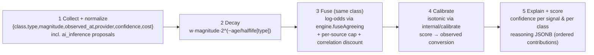
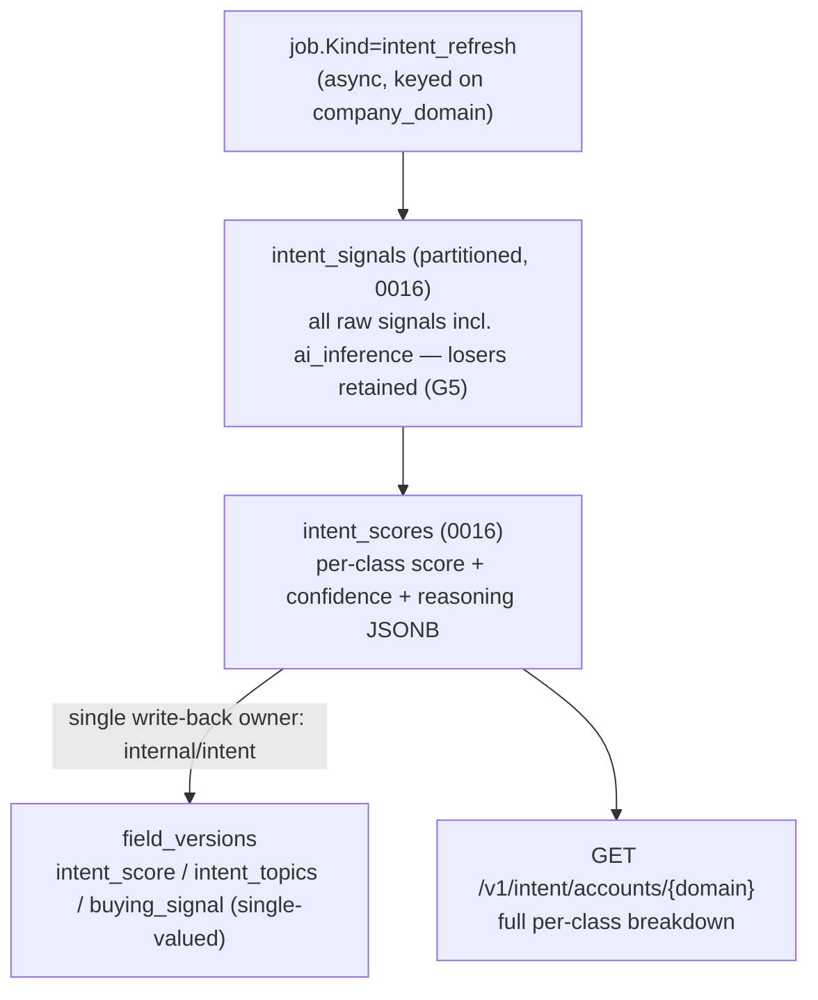

# 05 — Computed Intent Methodology

> **Status:** DRAFT · **Owner:** Staff ML Engineer · **Last updated:** 2026-07-09 · **Gated by:** /architecture-review, /provider-audit, /scale-check

> This document realizes the **Computed Intent Engine** named in [`00-overview.md §2.1`](00-overview.md) and
> is the design authority for **ADR-0027** (signal → decay → fuse → calibrate → guardrailed score). It
> **supersedes the framing** of [`docs/14-Intent-Engine.md`](../14-Intent-Engine.md) — which becomes the
> third-party *ingest* lane (`intent_data`) — and defines the *computed* lane instead. It reuses, never
> reinvents, ADR-0005 (`internal/engine.fuseAgreeing` log-odds fusion + `internal/calibrate` isotonic),
> ADR-0008 (guardrailed learning), and ADR-0026 (LLM outputs enter only as *proposed* raw signals). The
> governing invariant is verbatim: **"the model proposes, a deterministic gate disposes"** — an LLM may
> propose a raw signal, but the customer-visible score is produced by a **deterministic, auditable** pipeline.
> Terms follow the Glossary (`docs/00-Project-Overview.md §7` + [`00 §6`](00-overview.md)): Tenant, Company,
> Provider, Field, Intent Signal, Intent Class Score, Source Type.

---

## 1. Role & lane separation

`internal/intent` (packages `signal` + `score`) computes each Company's intent across **ten classes** from
signals it collects, producing a **weighted score, a confidence, and human-readable reasoning per class**
(the master-prompt requirement). It is a **separate lane** from per-Field enrichment — different key (Company /
account, not Person), different cadence (async / batch), different freshness model (surge + decay) — a
separation `docs/14` established and ADR-0027 keeps.

Two hard lane rules hold everywhere in this document:

| Rule | Statement | Source |
|---|---|---|
| **Async-only** | The computed engine **never** runs on the sync per-Field enrichment path. A synchronous Dossier preview shows last-known intent or `pending`, never a blocking compute. | ADR-0027, `00 §3` |
| **LLM proposes, never scores** | An LLM-extracted signal enters as **one more raw signal** with `source_type = ai_inference`; it is **never** a final Intent Class Score. It must pass decay → fuse → calibrate like any other signal. | ADR-0026/0027 |

`intent_data` (from `docs/14`) remains the third-party **ingest** store (Bombora/6sense/G2/HG topics). The
computed engine adds `intent_signals` + `intent_scores` (**migration 0016**). Ingested third-party topics may
enter the computed pipeline as *signals* (with their own class/type/provider), but the two stores stay
distinct. Scoring-quality numbers (calibration accuracy, conversion tracking) are **UNVERIFIED** until
backtested (§9; `00 §8`, RI-4).

## 2. The ten signal classes

Each class is fed by raw signals normalized to `{class, type, magnitude, observed_at, provider, confidence,
cost}` (`00 §6` Intent Signal), sourced from existing/new Provider adapters (`docs/03`, `docs/07`) **and** from
the `intent` Agent Task (`04 §3`, `ai_inference`). The taxonomy is frozen (ADR-0027 §Context):

| # | Class (`class`) | Representative raw signal `type`s | Adapter / agent source |
|---|---|---|---|
| 1 | `buying` | funding round, budget/RFP mention, exec hire in economic-buyer role, pricing-page visits (via provider) | firmographics (funding), `news`/`search` agents, `predictleads` |
| 2 | `hiring` | job-posting velocity, role/department mix, backfill vs growth | `theirstack`, `predictleads`, `hiring` agent |
| 3 | `tech-replacement` | technographic **drop** of an incumbent, RFP for a category, migration-language in postings | `builtwith`/`wappalyzer`/`hg-insights` deltas, `technology` agent |
| 4 | `ai-adoption` | AI/ML tooling adds, AI-role postings, AI announcements | technographic **adds**, `hiring` + `news` agents |
| 5 | `security-investment` | security tooling adds, security-role postings, breach/compliance news | technographic deltas, `hiring` + `news` agents |
| 6 | `cloud-migration` | cloud-vendor technographic adds, on-prem→cloud postings, migration announcements | technographic deltas, `technology` + `news` agents |
| 7 | `digital-transformation` | platform re-tooling, transformation-program news, broad tech-stack churn | technographic churn, `news` + `market` agents |
| 8 | `crm-replacement` | CRM technographic drop/add, RevOps/CRM-admin postings, CRM-migration mentions | technographic deltas, `hiring` + `news` agents |
| 9 | `outsourcing` | vendor/agency postings, outsourcing announcements, contractor-role mix | `hiring` + `news` agents |
| 10 | `marketing-investment` | martech adds, marketing-role postings, campaign/rebrand news | technographic deltas, `hiring` + `news` agents |

Every raw signal — including LLM-proposed ones — is **retained** (losers kept, G5) in `intent_signals`, so a
score is fully reconstructible from its inputs.

## 3. The math (deterministic pipeline)

Each class score is computed by a **deterministic, auditable** five-step pipeline. Steps 3–4 reuse the
ADR-0005 machinery verbatim.

1. **Collect + normalize.** Raw signals arrive as `{class, type, magnitude, observed_at, provider, confidence,
   cost}`. LLM outputs enter here as `ai_inference` signals — never later.
2. **Decay.** Per-class raw score

   > `score[class] = Σᵢ w[class, typeᵢ] · magnitudeᵢ · decay(ageᵢ)`, with `decay = 2^(−age / halflife[type])`

   — the surge-plus-decay half-life idea from `docs/14`, a freshness half-life **per signal type** (recent
   signals dominate; stale ones fade).
3. **Fuse.** Corroborating signals of the **same class** combine in **log-odds** via
   `internal/engine.fuseAgreeing` (ADR-0005) — two independent providers reporting the same class reinforce
   each other, staying in `[0,1)` — under the ADR-0005 **per-source weight cap + correlation discount** so
   correlated providers (e.g. two crawl-derived technographic sources) do **not** double-count.
4. **Calibrate.** The fused score is mapped to a real probability by `internal/calibrate` isotonic regression
   (fused score → observed conversion), backfilled by the offline-learning job (ADR-0008 guardrails).
5. **Explain + confidence.** **Confidence (G5) is attached per signal *and* per class score.** Each
   `intent_scores` row stores a `reasoning` **JSONB** — the *ordered per-signal contributions*
   (`type, raw_magnitude, decayed_value, weight, provider, cost`) — whose log-odds contributions **sum to the
   stored fused score**: the auditable "why."

Determinism is a release obligation: re-running `intent_refresh` for an account against a **pinned**
`config_version_id` reproduces the same class scores **byte-for-byte** from the same signals (ADR-0027
§Verification).

## 4. Weights as versioned config

Class/type **weights and half-lives are versioned config — not code and not a new table**: a
`config_versions` kind **`intent_weights`** via `internal/dash/configver`, admin-surfaced at
`/v1/admin/intent/weights` by `internal/dash/intent` (`00 §2.3`). A refresh job **pins** `config_version_id`
exactly as an Enrichment Job pins config (ADR-0006), so a re-score is reproducible against the weights that
produced it, and a weight change mints a new version (publish approval-gated like every other `configver`
kind, ADR-0020). This reuses migration 0006's machinery — **no new migration** for weights. The learned
components (isotonic calibration map, any bandit-proposed ordering) stay in the **propose** role and are
guardrailed (ADR-0008); the deterministic pipeline disposes.

## 5. Async lane & triggers

A new **`job.Kind = "intent_refresh"`** keyed on **`company_domain`** / account runs on the existing
`internal/job` + `internal/pgoutbox` path (`internal/durable` for step durability). Triggers, preferring
push over polling (ADR-0027):

| Trigger | Mechanism |
|---|---|
| **Scheduled sweep** | Periodic re-score of tracked accounts on a freshness cadence. |
| **Provider webhook** | A surging account (e.g. new funding/postings webhook) enqueues a targeted refresh. |
| **Research Run hand-off** | The `intent` Agent Task (`04 §3`) deposits `ai_inference` proposals, which enqueue/append to a refresh. |

**Intent never runs on the sync per-Field enrichment path** (ADR-0027, `00 §3`). A synchronous Dossier preview
(`?mode=sync`, ADR-0028) shows last-known intent or `pending` — never a blocking compute. Keying on
`company_domain` makes concurrent triggers for the same account coalesce (G2) rather than double-score.

## 6. Write-back ownership

`internal/intent` is the **single write-back owner** — the **only** writer of the canonical Fields
`intent_score` / `intent_topics` / `buying_signal` into `field_versions` (G5 provenance), reconciling the
computed engine with the existing Field vocabulary. The **per-class breakdown stays in `intent_scores`**
(exposed via `GET /v1/intent/accounts/{domain}`), **not** overloaded onto the single-valued Fields — the
distinction between the ambiguous single `intent_score` Field and the ten per-class Intent Class Scores is
load-bearing (`00 §6`). No other module writes these Fields; no shared ownership.

## 7. Tables & gates (migration 0016)

`internal/intent` is the one owner of `intent_signals` and `intent_scores` (**migration 0016**; FORCE RLS on
parent **and** partitions, no BYPASSRLS). `intent_signals` is **RANGE-partitioned** (by `observed_at`) for the
high-cardinality signal feed, following the `docs/03` telemetry-partitioning discipline; partitions are created
by the runtime partition-maintainer, never by migrations.

| Gate | Where satisfied |
|---|---|
| **G1 tenant isolation** | `intent_signals` + `intent_scores` carry `tenant_id` + FORCE RLS on parent **and** every partition; cross-tenant read returns zero rows (release-blocker test). |
| **G2 idempotency** | `intent_refresh` keyed on `company_domain` + pinned `config_version_id`; concurrent triggers coalesce; ledger-before-call on every signal-provider + LLM call. |
| **G3 bounded** | Every signal-provider / LLM call via `provider.Call` + `CallPolicy` + breaker; egress-proxy is the sole route (`00 §9`). |
| **G4 cost ceiling** | Per-signal `cost` reserved/charged; per-Tenant intent budget via `configver`. |
| **G5 provenance** | Confidence per signal **and** per class score; `reasoning` JSONB reconstructs the score; `ai_inference` signals visibly distinct, never a class score; losers retained. |

## 8. Explainability & the audit contract

Every `intent_scores` row is defensible field-by-field: its `reasoning` JSONB lists the ordered per-signal
contributions, and their log-odds contributions **sum to the stored fused score** (ADR-0027 §Verification). A
test asserts an `ai_inference` signal is **fused/calibrated, not written through** — i.e. an LLM proposal never
surfaces as a class score without passing decay → fuse → calibrate. This is what makes the customer-visible
number **auditable and reproducible**, satisfying "the model proposes, a deterministic gate disposes."

## 9. Calibration labels & cold-start

Isotonic calibration (step 4) needs labels (fused score → observed conversion). **Cold-start** uses priors
seeded from provenance/confidence; as outcomes accrue, the **offline-learning job** (ADR-0008, guardrailed)
tunes the calibration map — never an online/unguarded update. Intent accuracy stays **UNVERIFIED** until a
**backtest against conversion labels** (`00 §8`, RI-4); label sourcing is tracked as an Open item.

## Open items

| ID | Item | Status | Owner |
|----|------|--------|-------|
| INT-OI-1 | Intent calibration-label sourcing (cold-start priors → offline-learning) | Draft | ML |
| INT-OI-2 | Default `intent_weights` values + per-type half-lives | Draft | ML + GTM Data |
| INT-OI-3 | Correlation-discount grouping for crawl-derived technographic providers | Draft | ML |
| INT-OI-4 | Backtest harness vs conversion labels (RI-4 → measured) | Planned in `14` | ML |
| INT-OI-5 | Provider-webhook surge triggers per adapter (push over polling) | Draft in `03`/`07` | Backend |
