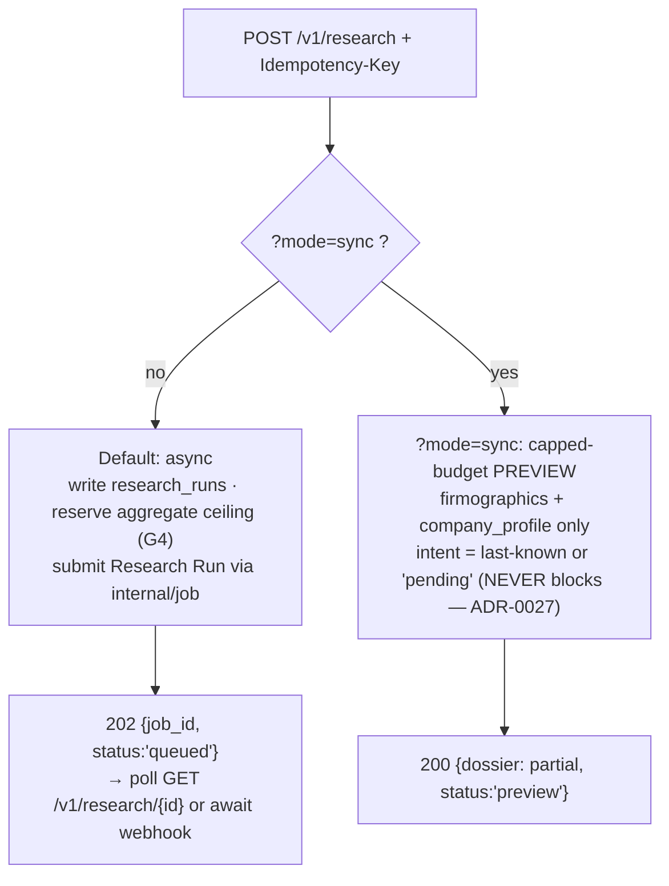

# 06 — Research API & Dossier Schema

> **Status:** DRAFT · **Owner:** Senior Product Manager + Principal Backend Engineer · **Last updated:** 2026-07-09 · **Gated by:** /architecture-review, /security-audit

> This document is the **Research API contract** and the **full Dossier JSON schema**. It realizes
> **ADR-0028** (research-dossier API + the six DOC-FIRST scalar Fields, one-value-per-Field preserved)
> and the delivery verb of [`00-overview.md §1`](00-overview.md); it consumes the AI pipeline of
> [`04`](04-ai-pipeline.md), the computed intent of [`05`](05-intent-methodology.md), and the
> collection boundary of [`03`](03-data-collection.md). It reuses the existing API conventions verbatim
> (ADR-0012): `internal/api` handlers, `internal/job` submit-and-poll, `internal/webhook` HMAC signing,
> `Idempotency-Key` on writes, snake_case JSON, cursor pagination, and the uniform error body. It is the
> human-readable twin of [`openapi-research.json`](openapi-research.json), which is machine-authoritative
> and parity-tested against the handler DTOs (the ADR-0012 discipline). Terms follow the Glossary
> (`docs/00-Project-Overview.md §7` + [`00 §6`](00-overview.md)): Tenant, Company, Person, Provider,
> Field, Dossier, Research Run, Intent Class Score, Source Type. Section coverage and latency numbers
> are **UNVERIFIED** design targets until measured (`00 §8`, RI-3).

---

## 1. Role & the two-home boundary rule

The headline capability is **domain → Dossier**: one call takes a Company `company_domain` (or name /
LinkedIn / work email / phone) and returns a normalized, CRM-ready **Dossier**. Because the existing
API is subject + wanted-Fields oriented (`POST /v1/enrichments`) and the Field model is strictly
**one normalized value per Field**, the Dossier is a **research-owned composite document**, not an
extension of the Field vocabulary (ADR-0028). One rule governs where every datum lives:

| Shape | Home | Path | Example |
|---|---|---|---|
| **Single-valued** | canonical **Field** | Waterfall → `field_versions` (G5) | `twitter_url`, `company_ticker`, `total_funding_usd`, `employee_count`, `intent_score` |
| **Multi-valued / relational** | **Dossier-only** (never a Field) | `research_dossiers` composite JSON + `research_sources` rows | `news[]`, `competitors[]`, `hiring_signals[]`, `funding_rounds[]`, `search_keywords[]`, `intent.buying_signals[]` |

The six **new** single-valued Fields (33 → 39, DOC-FIRST per ADR-0023) are `twitter_url`,
`facebook_url`, `github_url`, `crunchbase_url`, `company_ticker`, `total_funding_usd`. They flow
through the normal Waterfall and appear in the Dossier's `firmographics`/`company_profile` **by
reference to their Field value** — not as a second source of truth. A test asserts no multi-valued
Dossier object ever writes a `field_versions` row (ADR-0028 §Verification).

## 2. Endpoint surface

All research + intent endpoints are on the **`enrichapi`** public deployable (`02 §6`); admin surfaces
(`/v1/admin/ai/*`, `/v1/admin/research/runs`, `/v1/admin/intent/weights`) are on `dashboardd` and are
specified in [`08`](08-dashboard-extensions.md). Every write requires `Idempotency-Key` (ADR-0012).

| Method + path | Purpose | Success | Auth | Idempotency-Key |
|---|---|---|---|---|
| `POST /v1/research` | Start a Research Run for a subject; async by default, `?mode=sync` = capped preview | `202 {job_id, status}` (async) / `200 {dossier}` (sync preview) | JWT | **Required** |
| `GET /v1/research/{id}` | Research Run status + Dossier when ready | `200 {job_id, status, dossier?}` | JWT | — (read) |
| `GET /v1/dossiers/{domain}` | Latest stored Dossier for a Company | `200 {dossier}` | JWT | — (read) |
| `POST /v1/intent/refresh` | Enqueue an async computed-intent refresh for an account | `202 {job_id, status}` | JWT | **Required** |
| `GET /v1/intent/accounts/{domain}` | Full per-class Intent Class Score breakdown | `200 {account}` | JWT | — (read) |
| *(callback)* completion **webhook** | HMAC-signed Run-complete notification to the tenant sink | tenant returns `2xx` | HMAC (`internal/webhook`) | idempotent (`job_id`) |

Conventions (identical to `/v1/enrichments`, ADR-0012): snake_case JSON; uniform error body
`{"error":{"code","message"}}`; `202 {"job_id","status"}` for async work; cursor pagination with an
opaque base64url cursor and a hard limit cap of 200 on any list; `/v1` versioning.

## 3. `POST /v1/research`

### 3.1 Request body

At least one subject identifier is required. `wanted_sections[]` is optional; omitted → all sections.

```json
{
  "company_domain": "acme.io",
  "company_name": "Acme Corporation",
  "linkedin_url": "https://www.linkedin.com/company/acme",
  "work_email": "jordan@acme.io",
  "phone": "+1-415-555-0100",
  "wanted_sections": [
    "company_profile", "firmographics", "technographics",
    "hiring_signals", "intent", "news", "competitors",
    "ai_summary", "search_keywords", "crm_ready"
  ]
}
```

| Field | Type | Rule |
|---|---|---|
| `company_domain` | string | Preferred key; normalized (host, lowercased, no scheme). One of the five identifiers is required (`BAD_REQUEST` otherwise). |
| `company_name` | string | Used when no domain; the `company_research` task resolves the canonical Company identity (`04 §3`). |
| `linkedin_url` | string | Optional subject seed. |
| `work_email` | string | Optional; also seeds `contact_profile` (the Person). |
| `phone` | string | Optional subject seed. |
| `wanted_sections[]` | string[] | Subset of the Dossier top-level sections (§6). Unknown section → `BAD_REQUEST`. |

`wanted_sections[]` values are exactly the Dossier top-level section names: `company_profile`,
`contact_profile`, `firmographics`, `technographics`, `hiring_signals`, `intent`, `news`,
`competitors`, `ai_summary`, `search_keywords`, `crm_ready`.

### 3.2 Async (default) vs sync preview



- **Async (default).** Returns `202 {job_id, status}` immediately; the full Dossier is assembled on the
  `enrichd` fleet (`02 §4`) and delivered via `GET /v1/research/{id}` or the completion webhook.
- **`?mode=sync` preview.** Returns `200` with a **capped-budget** partial Dossier: `firmographics` +
  `company_profile` only, `intent` shown as **last-known or `pending`** — a sync preview **never**
  triggers a blocking intent compute (ADR-0027/0028). The preview's `metadata.mode = "preview"` and its
  `confidence.by_section` omits unresolved sections.

### 3.3 Idempotency rule

`Idempotency-Key` is **required** on `POST /v1/research` and `POST /v1/intent/refresh` (ADR-0012). A
replay with the **same key + same body** returns the original `202 {job_id, status}` (or the stored
result). A reuse with the **same key + a different body** → `409 CONFLICT`. The key is the ledger key
(G2, ledger-before-call); it also seeds the Research Run's per-step LLM idempotency keys, which
additionally pin `model`+`prompt_version`+`input_hash`+`config_version` (`04 §2`).

### 3.4 Example responses

Async accept:

```json
{ "job_id": "run_01J8Z3K7A2QF", "status": "queued" }
```

Sync preview (partial Dossier — see §5 for the full skeleton):

```json
{
  "status": "preview",
  "dossier": {
    "company_profile": { "legal_name": "Acme Corporation", "domain": "acme.io", "sector": "SaaS" },
    "firmographics": { "employee_count": 320, "hq_country": "US", "total_funding_usd": 74000000 },
    "intent": { "intent_score": 0.61, "status": "last_known", "intent_topics": ["buying"], "buying_signals": [] },
    "confidence": { "overall": 0.55, "by_section": { "company_profile": 0.8, "firmographics": 0.7 } },
    "metadata": { "config_version": "cfgv_2026_07_09_a", "mode": "preview" },
    "data_freshness": { "generated_at": "2026-07-09T12:00:00Z", "last_updated": "2026-07-08T09:14:00Z" }
  }
}
```

## 4. `GET /v1/research/{id}`, `GET /v1/dossiers/{domain}`, and the webhook

- **`GET /v1/research/{id}`** mirrors `GET /v1/enrichments/{id}`: `200 {job_id, status, dossier?}`. `status ∈
  {queued, running, succeeded, failed}`; `dossier` is present once `status = succeeded`. A Run belonging to
  another Tenant is reported as `NOT_FOUND` (existence never disclosed, ADR-0011/0020).
- **`GET /v1/dossiers/{domain}`** returns the **latest stored** Dossier for a Company (from
  `research_dossiers`), independent of any live Run. `NOT_FOUND` if none exists for the caller's Tenant.
  Background freshness re-Runs keep it current on a TTL (ADR-0028).
- **Completion webhook.** On Run completion `internal/webhook` POSTs an **HMAC-signed, idempotent**
  notification to the tenant sink: `{job_id, status, company_domain, dossier_url, generated_at}`. The
  signature is the existing HMAC scheme (`X-Waterfall-Signature`); the tenant verifies it before trusting
  the body. Redelivery carries the same `job_id` and is a no-op for a tenant that already processed it.

## 5. The full Dossier JSON schema

The Dossier is the research-owned composite. Every top-level section below is frozen by ADR-0028; the
skeleton is annotated with each field's **home** (Field vs Dossier-only) and its `source_type`. This
skeleton is the twin of the `Dossier` schema in `openapi-research.json`.

```json
{
  "company_profile": {
    "legal_name": "Acme Corporation",
    "domain": "acme.io",
    "description": "Acme builds developer tooling for ...",
    "sector": "SaaS",
    "hq": { "city": "San Francisco", "region": "CA", "country": "US" },
    "employees_band": "201-500",
    "founded_year": 2016,
    "socials": {
      "twitter_url": "https://twitter.com/acme",
      "facebook_url": "https://facebook.com/acme",
      "github_url": "https://github.com/acme",
      "crunchbase_url": "https://crunchbase.com/organization/acme",
      "linkedin_url": "https://www.linkedin.com/company/acme"
    }
  },
  "contact_profile": {
    "full_name": "Jordan Rivera",
    "title": "VP Engineering",
    "work_email": "jordan@acme.io",
    "linkedin_url": "https://www.linkedin.com/in/jordanrivera",
    "seniority": "vp",
    "department": "engineering"
  },
  "firmographics": {
    "employee_count": 320,
    "revenue_band": "$50M-$100M",
    "company_ticker": null,
    "total_funding_usd": 74000000,
    "funding_stage": "series_c",
    "hq_country": "US",
    "naics": "511210"
  },
  "technographics": {
    "categories": ["cloud", "analytics", "crm"],
    "products": ["AWS", "Snowflake", "Salesforce"],
    "recent_adds": ["Snowflake"],
    "recent_drops": ["Redshift"]
  },
  "hiring_signals": [
    { "role": "Staff Security Engineer", "department": "security", "location": "Remote-US",
      "posted_at": "2026-06-28", "velocity": "up", "source_type": "api" }
  ],
  "intent": {
    "intent_score": 0.72,
    "status": "computed",
    "intent_topics": ["buying", "security-investment"],
    "buying_signals": [
      { "class": "buying", "type": "funding_round", "magnitude": 0.9, "observed_at": "2026-06-01",
        "confidence": 0.8, "source_type": "dataset" }
    ]
  },
  "news": [
    { "title": "Acme raises $40M Series C", "url": "https://news.example/acme-series-c",
      "published_at": "2026-06-01", "topic": "funding", "sentiment": "positive", "source_type": "api" }
  ],
  "competitors": [
    { "name": "Globex", "domain": "globex.com", "basis": "same-sector overlap", "source_type": "ai_inference" }
  ],
  "ai_summary": "Acme is a Series-C developer-tooling company showing security-investment and buying intent ...",
  "ai_reasoning": "Summary derives from a funding round (dataset), security-role hiring velocity (api), and a Snowflake add ...",
  "search_keywords": ["developer tooling", "ci/cd security", "data warehouse migration"],
  "crm_ready": {
    "account": {
      "name": "Acme Corporation",
      "domain": "acme.io",
      "industry": "SaaS",
      "employee_count": 320,
      "annual_revenue_usd": 80000000,
      "hq_country": "US",
      "linkedin_url": "https://www.linkedin.com/company/acme",
      "intent_score": 0.72
    },
    "contact": {
      "full_name": "Jordan Rivera",
      "first_name": "Jordan",
      "last_name": "Rivera",
      "title": "VP Engineering",
      "email": "jordan@acme.io",
      "seniority": "vp",
      "linkedin_url": "https://www.linkedin.com/in/jordanrivera"
    }
  },
  "confidence": {
    "overall": 0.78,
    "by_section": {
      "company_profile": 0.9, "firmographics": 0.85, "technographics": 0.7,
      "hiring_signals": 0.75, "intent": 0.68, "news": 0.8, "competitors": 0.55
    }
  },
  "provenance": [
    {
      "field": "firmographics.total_funding_usd",
      "provider": "crunchbase",
      "source_type": "dataset",
      "cost": 2,
      "idem_key": "idmp_9f2a...",
      "confidence": 0.8,
      "retained_losers": [
        { "provider": "openalex", "value": 70000000, "confidence": 0.6 }
      ]
    },
    {
      "field": "ai_summary",
      "provider": "openrouter:deepseek-r1:free",
      "source_type": "ai_inference",
      "cost": 0,
      "idem_key": "idmp_1c77...",
      "confidence": 0.6,
      "retained_losers": []
    }
  ],
  "processing_log": [
    { "step": "collect", "status": "ok", "at": "2026-07-09T12:00:01Z" },
    { "step": "company_research", "status": "ok", "model": "openrouter:llama-3.3-70b:free", "at": "2026-07-09T12:00:04Z" },
    { "step": "intent_handoff", "status": "async", "at": "2026-07-09T12:00:07Z" },
    { "step": "summarization", "status": "ok", "at": "2026-07-09T12:00:11Z" }
  ],
  "metadata": {
    "config_version": "cfgv_2026_07_09_a",
    "mode": "full",
    "run_id": "run_01J8Z3K7A2QF",
    "subject": { "company_domain": "acme.io" }
  },
  "data_freshness": {
    "generated_at": "2026-07-09T12:00:12Z",
    "last_updated": "2026-07-09T12:00:12Z"
  }
}
```

Section homes and source-type rules:

| Section | Home | Notes |
|---|---|---|
| `company_profile` | mixed | `legal_name`/`description`/`sector`/`hq` are Dossier-composed; `socials.*` mirror canonical **Fields** (incl. the 6 new scalars). |
| `contact_profile` | mixed | The Person; scalar identifiers are Fields, the composed profile is Dossier. |
| `firmographics` | mixed | `company_ticker`, `total_funding_usd`, `funding_stage`, revenue/employees are **Fields**; the object is a Dossier projection of them. |
| `technographics` | Dossier-only | Multi-valued category/product lists + adds/drops deltas. |
| `hiring_signals[]` | Dossier-only | Multi-valued; each row carries its own `source_type`. |
| `intent` | mixed | `intent_score`/`intent_topics`/`buying_signal` are single-valued **Fields** written by `internal/intent` (`05 §6`); `buying_signals[]` detail is Dossier-only. `status ∈ {computed, last_known, pending}`. |
| `news[]`, `competitors[]`, `search_keywords[]` | Dossier-only | Multi-valued (ADR-0028); `competitors` is **never** a Field. |
| `ai_summary`, `ai_reasoning` | Dossier-only | `source_type = ai_inference`; **never** fused as a fact (ADR-0026). |
| `crm_ready.{account,contact}` | Dossier-only | Normalized CRM projection (§7). |
| `confidence.{overall,by_section}` | Dossier-only | Per-section confidence (G5). |
| `provenance[]` | Dossier-only | One row per value with `{field, provider, source_type, cost, idem_key, confidence, retained_losers}`; queryable twin in `research_sources`. |
| `processing_log[]` | Dossier-only | Ordered step outcomes (from `research_steps`). |
| `metadata` | Dossier-only | Pins `config_version` (G5) + `mode`/`run_id`/`subject`. |
| `data_freshness` | Dossier-only | `generated_at` (this Run) + `last_updated` (latest stored refresh). |

`source_type ∈ {api, dataset, ai_inference}` on every `provenance[]` row and on every multi-valued item
that carries one; **`ai_inference` values are visibly distinct and never counted as high-confidence
sourced facts** (ADR-0026/0028). Losing candidate answers are retained in `retained_losers` (G5).

## 6. Per-endpoint error codes

The error body is uniform: `{"error":{"code":"SNAKE_OR_UPPER","message":"..."}}`. The code taxonomy
maps 1:1 onto the platform's provider error classes (`internal/provider` `ClassAuth`, `ClassRateLimit`,
`ClassTransient`, `ClassNotFound`, `ClassBadRequest`, `ClassQuota`, `ClassProviderDown`), so a research
failure surfaces the same vocabulary as any enrichment failure.

| Code | HTTP | Meaning | Maps to |
|---|---|---|---|
| `AUTH` | 401/403 | Missing/invalid JWT or insufficient role | `ClassAuth` |
| `RATE_LIMIT` | 429 | Caller exceeded the API rate limit | `ClassRateLimit` |
| `TRANSIENT` | 503 | Retryable internal/transport error (retry with backoff) | `ClassTransient` |
| `NOT_FOUND` | 404 | Run/Dossier/account absent **or** owned by another Tenant | `ClassNotFound` |
| `BAD_REQUEST` | 400 | Missing subject identifier, unknown `wanted_section`, malformed body | `ClassBadRequest` |
| `QUOTA` | 402/429 | Tenant AI/research/cost budget exhausted (G4) | `ClassQuota` |
| `PROVIDER_DOWN` | 502 | A required upstream provider/LLM is unavailable past the breaker | `ClassProviderDown` |
| `CONFLICT` | 409 | `Idempotency-Key` reused with a different body | (idempotency ledger) |

Per-endpoint applicability:

| Endpoint | Typical error codes |
|---|---|
| `POST /v1/research` | `AUTH`, `BAD_REQUEST` (no identifier / unknown section), `CONFLICT` (idem reuse), `QUOTA`, `RATE_LIMIT` |
| `GET /v1/research/{id}` | `AUTH`, `NOT_FOUND`, `TRANSIENT` |
| `GET /v1/dossiers/{domain}` | `AUTH`, `NOT_FOUND`, `TRANSIENT` |
| `POST /v1/intent/refresh` | `AUTH`, `BAD_REQUEST`, `CONFLICT`, `QUOTA`, `RATE_LIMIT` |
| `GET /v1/intent/accounts/{domain}` | `AUTH`, `NOT_FOUND`, `TRANSIENT` |

`PROVIDER_DOWN`/`QUOTA` reached **mid-Run** do not fail the whole Dossier: the Run stops that branch,
returns best-so-far with the section marked lower-confidence or `pending`, and records the stop in
`processing_log[]` (the ADR-0026 gate signal (b) "budget → stop with best-so-far"). A `POST` that cannot
even reserve the aggregate ceiling fails fast with `QUOTA`.

## 7. `crm_ready` normalization

`crm_ready.{account, contact}` is a **normalized projection** the research module builds so a roadmap
CRM connector (ADR-0030) ingests it **without transformation**. Normalization rules:

| Rule | Detail |
|---|---|
| Canonical field names | CRM-neutral keys (`name`, `domain`, `industry`, `employee_count`, `annual_revenue_usd`, `email`, `first_name`/`last_name`, `title`, `seniority`, `linkedin_url`). Connector-specific field-map (Salesforce/HubSpot) is applied at push time (`crm_field_maps`, ADR-0030), not here. |
| Derived splits | `contact.full_name` is split into `first_name`/`last_name`; `firmographics.revenue_band` is projected to a numeric `annual_revenue_usd` midpoint where possible. |
| Types normalized | Currency as integer USD; enums lowercased (`seniority`, `industry`); URLs canonicalized. |
| Provenance preserved | Each `crm_ready` value still traces to a `provenance[]`/`research_sources` row; `ai_inference` values are flagged so a connector can choose to exclude them from a CRM write. |
| No secrets, no push | `crm_ready` is data only. The push itself is an **outbound direction of the egress-proxy** with the CRM token injected at the boundary (ADR-0030) — the Dossier never carries a CRM credential. |

## 8. Intent endpoints (contract summary)

Full methodology is in [`05`](05-intent-methodology.md); the API shape:

- **`POST /v1/intent/refresh`** `{company_domain}` + `Idempotency-Key` → `202 {job_id, status}`. Enqueues
  `job.Kind=intent_refresh` keyed on `company_domain` (concurrent triggers coalesce, G2). **Async only** —
  never a blocking compute (ADR-0027).
- **`GET /v1/intent/accounts/{domain}`** → `200 {account}` with the **full per-class breakdown**: the ten
  Intent Class Scores, each with `score`, `confidence`, and the ordered `reasoning` contributions (the
  auditable "why"). Distinct from the single-valued `intent_score` Field surfaced in the Dossier.

```json
{
  "company_domain": "acme.io",
  "generated_at": "2026-07-09T06:00:00Z",
  "config_version": "iw_2026_07_01",
  "classes": [
    { "class": "buying", "score": 0.72, "confidence": 0.7,
      "reasoning": [
        { "type": "funding_round", "raw_magnitude": 0.9, "decayed_value": 0.74, "weight": 0.5, "provider": "crunchbase", "cost": 2 },
        { "type": "exec_hire", "raw_magnitude": 0.4, "decayed_value": 0.31, "weight": 0.3, "provider": "predictleads", "cost": 1 }
      ] },
    { "class": "security-investment", "score": 0.55, "confidence": 0.6, "reasoning": [] }
  ]
}
```

## 9. Contract parity & OpenAPI

`openapi-research.json` is machine-authoritative and covers `/v1/research`, `/v1/intent`, and the
`/v1/admin/{ai,research,intent}` surface. A parity test asserts the handler DTOs match the OpenAPI
schemas (the ADR-0012 `TestAdminOpenAPIParity` discipline), and that every `POST` carries the
`Idempotency-Key` header. The `Dossier` schema in the OpenAPI is the twin of §5; a Dossier value with no
`research_sources` row, or a multi-valued object that wrote a `field_versions` row, fails the
provenance/boundary tests (`14`; ADR-0028 §Verification).

## Open items

| ID | Item | Status | Owner |
|----|------|--------|-------|
| API-OI-1 | Exact sync-preview budget cap (which providers/tasks run inline) + p95 target | OPEN — resolve with `02 ARCH-RI-2` / `10` | Principal Backend Engineer |
| API-OI-2 | `wanted_sections[]` → task-graph pruning (skip Agent Tasks for unrequested sections) | Draft in `04 §4` | Backend + ML |
| API-OI-3 | `revenue_band` → `annual_revenue_usd` numeric projection rule for `crm_ready` | Draft (§7) | Product + Backend |
| API-OI-4 | Webhook retry/backoff + signature header name finalization (reuse `internal/webhook`) | Draft (§4) | Backend |
| API-OI-5 | Dossier schema version field + migration/parity policy when a section is added | OPEN — versioned per ADR-0028 | Principal Backend Engineer |
| API-OI-6 | Per-Tenant research rate-limit + `QUOTA` vs `RATE_LIMIT` thresholds | UNVERIFIED until `11` | Backend + Product |
