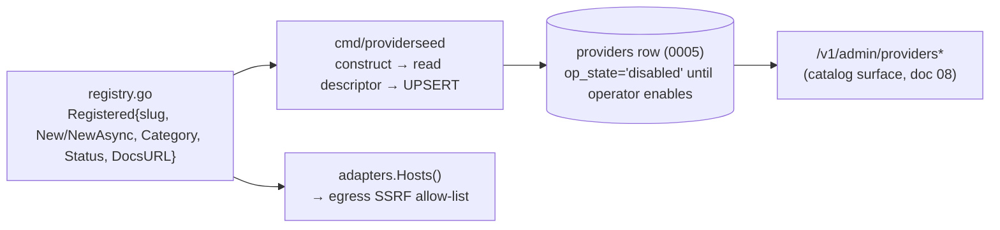

# 07 — Provider & Field Expansion

> **Status:** DRAFT · **Owner:** Provider Integration Lead · **Last updated:** 2026-07-09 · **Gated by:** /provider-audit, /architecture-review, /security-audit

> This document is the **registry-level expansion spec**: every new adapter (`search` / `dataset` /
> `llm`, plus roadmap `news`) as a `Registered` row, how those rows **project** into the provider
> catalog (`cmd/providerseed`, [ADR-0023](../../adr/0023-adapter-registry-catalog-seed-field-vocabulary.md)), the **six new canonical scalar Fields**
> registered doc-first, and the **Dossier-only** multi-valued objects that must never become Fields.
> It **realizes [ADR-0025](../../adr/0025-data-collection-search-dataset-apis.md)** (categories,
> ADR-0009 inclusion status), [ADR-0026](../../adr/0026-llm-egress-adapter-cost-cascade.md) (the `llm`
> adapters), and [ADR-0028](../../adr/0028-research-dossier-api-field-additions.md) (the 33→39 Field
> vocabulary + the boundary rule). Cited provider facts are in [`01-research-findings.md`](01-research-findings.md);
> the collection design is [`03-data-collection.md`](03-data-collection.md); the LLM pipeline is
> [`04-ai-pipeline.md`](04-ai-pipeline.md). Nothing here re-decides a locked fact.

---

## 1. What this doc adds

Two expansions, both **code + doc only where possible, zero new Go dependency**:

1. **New Provider adapters** in four new categories (`search`, `dataset`, `llm`; roadmap `news`) — each
   a secret-free `provider.HTTPAdapter` / `AsyncHTTPAdapter` appended to the explicit registry slice
   (`internal/provider/adapters/registry.go`) plus a `<slug>.go` file. `providers.category` has no CHECK
   constraint, so introducing the categories needs **no migration** (ADR-0025).
2. **Field-vocabulary extension** — **6 new canonical scalar Fields (33 → 39)** registered **doc-first**
   (ADR-0023/0028): `docs/00 §7` → `internal/domain/field.go` const + `canonicalFields` map →
   `Valid()`. Adding a normalized-scalar Field is **not** a schema change. All multi-valued/relational
   data stays **Dossier-only**.

The onboarding claim is the platform's standing one (corrected per ARCH-4): **new Provider = one adapter
file (Build/Decode closures for HTTP vendors, or the full `Adapter` interface for bespoke protocols) +
one registry row; zero core-engine changes; provider *config* changes propagate by catalog epoch
without deploy.**

## 2. New adapter registry table

Auth-scheme names are the repo's `AuthDescriptor` schemes (`internal/provider/egress.go`). Status is the
**ADR-0009 verdict**, not auto-granted (ADR-0025 §Decision): clean own-index / authoritative-dataset →
**ACTIVE-CANDIDATE**; crawl-provenance search → **DEPRIORITIZED** (off by default, compliance-gated).
Cited facts and free-tier numbers are in [`01 §3–4`](01-research-findings.md); all pricing/limits are
**UNVERIFIED** until /provider-audit + `11` (RI-5).

### 2.1 `search`

| Slug | Sync/async | ADR-0009 status | Auth scheme | DocsURL |
|---|---|---|---|---|
| `brave-search` | sync `New` | ACTIVE-CANDIDATE | `AuthAPIKeyHeader` (`X-Subscription-Token`) | https://api-dashboard.search.brave.com/app/documentation/web-search/get-started |
| `serper` | sync `New` | **DEPRIORITIZED** | `AuthAPIKeyHeader` (`X-API-KEY`) | https://serper.dev/ |
| `tavily` | sync `New` | **DEPRIORITIZED** | `AuthBearer` (`tvly-…`) | https://docs.tavily.com/ |

### 2.2 `dataset`

| Slug | Sync/async | ADR-0009 status | Auth scheme | DocsURL |
|---|---|---|---|---|
| `common-crawl` | sync `New` | ACTIVE-CANDIDATE (**index-only**; WARC deferred) | **none** (public) | https://index.commoncrawl.org/ |
| `openalex` | sync `New` | ACTIVE-CANDIDATE | `AuthAPIKeyQuery` (free key) | https://developers.openalex.org/ |
| `sec-edgar` | sync `New` | ACTIVE-CANDIDATE | **none** (public; descriptive `User-Agent`) | https://www.sec.gov/search-filings/edgar-application-programming-interfaces |

> **Already-registered authoritative datasets** (not re-added here): `gleif` (LEI), `opencorporates`,
> `companies-house`, `brreg`, `ares-cz`, `recherche-entreprises`, and other government registries live
> under category `firmographics` in the current registry. ADR-0025 cites them as the precedent that a
> provider's upstream crawl/aggregation provenance is a **compliance gate, not a hard bar** — a search
> API is the same case.

### 2.3 `llm` (see [ADR-0026](../../adr/0026-llm-egress-adapter-cost-cascade.md), [`04`](04-ai-pipeline.md))

| Slug | Sync/async | ADR-0009 status | Auth scheme | Role | DocsURL |
|---|---|---|---|---|---|
| `openrouter` | sync `New` | ACTIVE-CANDIDATE | `AuthBearer` | **Primary — free-model pool** (`:free`) | https://openrouter.ai/docs |
| `openrouter-paid` | sync `New` | ACTIVE-CANDIDATE | `AuthBearer` | Mid/paid escalation (gate-disposed) | https://openrouter.ai/docs |
| `openai` | sync `New` | ACTIVE-CANDIDATE | `AuthBearer` | Paid escalation | https://platform.openai.com/docs/api-reference/chat |
| `anthropic` | sync `New` | ACTIVE-CANDIDATE | `AuthAPIKeyHeader` (`x-api-key` + `anthropic-version`) | Paid escalation | https://docs.anthropic.com/en/api/messages |

The LLM cascade orders these **free → mid → paid** (ADR-0007 reservation value); the
accept/escalate/stop decision is **disposed by a deterministic gate** over schema-validity + budget +
attempt-count + agreement — **never** an LLM's self-reported confidence, and the **model never chooses
which tool/provider to call** (ADR-0026). `openrouter` (free pool) carries the default load;
`openrouter-paid`/`openai`/`anthropic` are gated escalations. Output validation is **struct-based,
stdlib-only** — no JSON-Schema engine, no third-party validator.

### 2.4 `news` (roadmap)

Category reserved (one slug); adapters are **roadmap** under `internal/news` (owns
`news_items`/`market_signals`, migration **0017**; `00 §2.2`, `15`). They obey the **same** ADR-0025
boundary — structured/index responses only, returned URLs discovery-only. Not built in the core spine.

## 3. Projection into the catalog (`cmd/providerseed`, ADR-0023)

A new adapter is **code**; its `providers` catalog row is a **projection** of that code, so the runtime
adapter and its row can never drift (ADR-0023). The projection is mechanical and idempotent:

- `cmd/providerseed` iterates `adapters.Registry()`, constructs each adapter with a nil client purely to
  read its **integration descriptor** (`NameV` / `BaseURL` / `Auth` / `Caps`), and **UPSERTs** one
  `providers` row (migration 0005) under the sentinel `platform` Tenant via `providers.Seed`.
- The row is seeded from the `Registered` metadata: `id = slug`, `category`, `status` (ADR-0009),
  `base_url`, `auth_scheme` / `auth_header` / `auth_query_param` (the serialized `AuthDescriptor`),
  `region`, `docs_url`, capabilities, and `unit_cost_credits` (min capability cost).
- **New rows land `op_state='disabled'`** (DB default). Nothing serves until an operator reviews the row,
  sets `compliance_review_status` where the provider is **DEPRIORITIZED**, creates a `"<slug>:default"`
  key pool + keys, and enables it. Re-running the seeder refreshes **only** the integration descriptor,
  never operator lifecycle state — safe to run repeatedly after adding adapters.

Consequence: the `search`/`dataset`/`llm` providers surface in the dashboard **automatically** through
the existing `internal/dash/providers` + `web/features/providers` (`00 §2.4`) — **no orphan UI**, no new
admin module for the catalog itself.

## 4. The six new canonical scalar Fields (doc-first)

Registered **doc-first** per ADR-0023/0028: `docs/00 §7` (already done) → `internal/domain/field.go`
const + `canonicalFields` map → `Valid()` accepts exactly **39**. Each is genuinely **single-valued**,
so it flows through the normal **waterfall + `field_versions` + provenance** path — **not** a schema
change.

| # | Field | Type | Typical source | Notes |
|---|---|---|---|---|
| 34 | `twitter_url` | scalar URL | firmographics / search-resolved | single canonical handle URL |
| 35 | `facebook_url` | scalar URL | firmographics / search-resolved | |
| 36 | `github_url` | scalar URL | firmographics / search-resolved | org URL |
| 37 | `crunchbase_url` | scalar URL | firmographics / Crunchbase adapter | |
| 38 | `company_ticker` | scalar string | SEC EDGAR / firmographics | public-company ticker |
| 39 | `total_funding_usd` | scalar number | firmographics / funding sources | **aggregate**; individual rounds/investors stay Dossier-only |

`funding_stage` / `company_revenue` stay as-is; funding **rounds**/investors enrich them **in the
Dossier**, not as Fields. **Invariant test** (ADR-0028; `14`): `Valid()` accepts exactly the 39, and no
multi-valued Dossier object ever writes a `field_versions` row.

## 5. Dossier-only multi-valued objects

The **boundary rule** (ADR-0028, load-bearing): **multi-valued / relational** data is **never** a Field —
it lives only in the research-owned composite Dossier (`research_dossiers`), with queryable provenance in
`research_sources`. These objects are **Dossier-only**:

| Object | Shape | Home | Why not a Field |
|---|---|---|---|
| `competitors[]` | list of companies | Dossier | multi-valued; breaks one-value-per-Field |
| `acquisitions[]` | list of events | Dossier | relational/temporal |
| `funding_rounds[]` | list of rounds (+investors) | Dossier | multi-valued; `total_funding_usd` is the scalar projection |
| `partnerships[]` | list of relationships | Dossier | relational |
| `locations[]` | list of sites | Dossier | multi-valued (GLEIF hierarchy, registries) |
| `seo_keywords[]` | list of keywords | Dossier | multi-valued |
| `campaigns[]` | list of campaigns | Dossier | multi-valued |
| `news[]` | list of news items | Dossier | multi-valued; roadmap `news_items` for depth (0017) |

Every Dossier value carries a `source_type ∈ {api, dataset, ai_inference}`; **AI-inferred values are
never fused as high-confidence facts** and are visibly distinguished (`00 §3`, ADR-0028).

## 6. ADR-0009 inclusion status & compliance gating

Inclusion is decided by the **ADR-0009 gate**, applied at seed time and enforced by `op_state`:

- **ACTIVE-CANDIDATE** — Brave, OpenAlex, SEC EDGAR, GLEIF, government registries, and the `llm`
  adapters. Clean own-index / authoritative-dataset / first-party-inference. Still land `disabled` and
  require operator enablement (§3), but carry no compliance flag.
- **DEPRIORITIZED** — **Serper** and **Tavily** (Google-SERP-derived provenance). **Off by default**,
  routed after cleaner sources, and require `compliance_review_status` to be set before enablement —
  the same treatment as Coresignal/ContactOut. Pending the **ADR-0009 human-policy confirmation**
  (`00` RI-OI-1).
- **EXCLUDED** providers are **never registered** (no `Registered` row).

**Inclusion audit** (/provider-audit, per ADR-0025 §Verification): Serper/Tavily are DEPRIORITIZED and
off by default; Brave/OpenAlex/SEC-EDGAR/GLEIF are ACTIVE-CANDIDATE; the `common-crawl` adapter is
index-only (no WARC-body access); every new adapter's egress passes the host allow-list + dial-time IP
guard.

## Open items

| ID | Item | Status | Owner |
|---|---|---|---|
| PE-OI-1 | ADR-0009 human-policy confirmation for Serper/Tavily (DEPRIORITIZED) | Pending (`00` RI-OI-1) | Security + Product |
| PE-OI-2 | `field.go` const + `canonicalFields` + `Valid()==39` lands at implementation (Slice 22) | Doc-first done; code pending | Backend |
| PE-OI-3 | Per-provider pricing/limits/coverage seeded into rows | UNVERIFIED until /provider-audit + `11` (RI-5) | Research + Backend |
| PE-OI-4 | `news` category adapters (roadmap, `internal/news`, 0017) | Roadmap (`15`) | Backend |
| PE-OI-5 | Confirm SEC EDGAR `User-Agent` + rate cap and OpenAlex/GLEIF auth specifics into descriptors | Open (`01` RF-OI-1/2) | Research |
