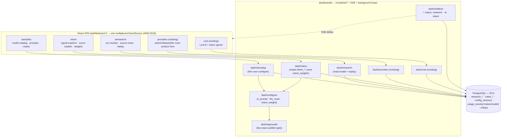

# 08 — Dashboard Extensions

> **Status:** DRAFT · **Owner:** Senior Full-Stack Engineer (Dashboard) · **Last updated:** 2026-07-09 · **Gated by:** /architecture-review, /security-audit, /provider-audit

> This document specifies the **admin/dashboard surfaces** for the Research & Intelligence subsystems. It
> realizes the module/owner map frozen in [`00-overview.md §2.3`](00-overview.md)/[`§2.4`](00-overview.md) and
> the placement in [`02-architecture.md §3`](02-architecture.md): three new `internal/dash/*` feature packages —
> **`airouting`** (LLM model catalog + `ai_prompt`/`llm_route` config CRUD), **`research`** (Research Run
> monitor + source trace + replay), **`intent`** (signal explorer + score-explain + `intent_weights` editor) —
> plus the automatic surfacing of the new `search`/`dataset`/`llm` Providers through the **existing**
> `internal/dash/providers`. It re-uses, never re-litigates, the dashboard's ratified plumbing:
> `docs/waterfall-dashboard/02` (module shape, cache inventory, SSE), `/08` (UI architecture), `/10`
> (telemetry/observability), and ADR-0018/0019/0020 (session, single multiplexed SSE stream, RBAC taxonomy).
> The governing invariant is verbatim: **"the model proposes, a deterministic gate disposes"** — every panel is a
> deterministic view of state a real service reads or writes. Terms follow the Glossary
> (`docs/00-Project-Overview.md §7` + [`00 §6`](00-overview.md)): Tenant, Provider, Field, Dossier, Research Run,
> Agent Task, Prompt Version, Model Cascade, Intent Signal, Intent Class Score, Source Type. All latency/cost
> numbers are **UNVERIFIED** design targets until measured (`13`; `00 §8`).

---

## 1. Scope, and the two hard rules

The R&I dashboard work adds **no new deployable and no new admin data model beyond `configver` kinds**. It ships
as **three feature packages on `dashboardd`** (the ADR-0010 data-plane admin surface) following the mandatory
five-file module shape (`types.go`, `service.go`, `store.go`, `pgstore.go`, `http.go` exposing `Routes(mux, mw)`;
`docs/waterfall-dashboard/02 §2.1`), plus a filtered view over the **existing** provider catalog. Two rules bind
every panel below:

| Rule | Statement | Source |
|---|---|---|
| **No-orphan-UI** | Every panel binds to a real service → owned/read table → `/v1/admin/*` endpoint → `web/feature`. A panel with no backing endpoint may not exist; the map in §2 is machine-checked by the scripted no-orphan-UI check (`docs/waterfall-dashboard/12` P11) and the `TestAdminOpenAPIParity` contract test. | `docs/17-Dashboard-Planning.md`, `docs/waterfall-dashboard/02 §2.4` |
| **No new owned table** | `airouting`/`research`/`intent` own **zero** new tables. `airouting` is a *thin service over* `internal/dash/configver` (kinds `ai_prompt`, `llm_route`); `research` **reads** `research_*` (owned by `internal/research`, migration 0015); `intent` **reads** `intent_*` (owned by `internal/intent`, migration 0016) and owns the `intent_weights` `configver` kind. | `00 §2.3`, ADR-0026/0027/0028 |

## 2. Module → service → table → endpoint → web-feature map (mandatory)

Every R&I admin panel resolves to exactly one row. Endpoints keep the dashboard conventions verbatim: snake_case
JSON, cursor pagination (limit cap 200), `Idempotency-Key` required on writes, uniform error body
`{"error":{"code","message"}}`, `202 {"approval_request_id"}` for approval-gated writes.

| Admin module | Service role | Backing table(s) (owner / migration) | Endpoint group | Web feature | Writes? |
|---|---|---|---|---|---|
| `internal/dash/airouting` | Thin service over `configver` for LLM prompt + route config; read-only projection of the `llm` provider-catalog rows | `config_versions`/`config_active`/`config_epochs` **kinds `ai_prompt`,`llm_route`** (owner `configver`, migration 0006); `providers` **read** (category `llm`, owner `dash/providers`) | `/v1/admin/ai/prompts`, `/v1/admin/ai/models` | `web/features/aimodels` | writes = versioned-config publish (approval-gated) |
| `internal/dash/research` | Read model + replay over Research Runs | `research_runs`, `research_steps`, `research_dossiers`, `research_sources` **read** (owner `internal/research`, migration 0015); `usage_events` token/model cols **read** | `/v1/admin/research/runs` (+ `/{id}`, `/{id}/steps`, `/{id}/sources`, `/{id}/replay`) | `web/features/airesearch` | replay = `202 {job_id}` (re-enqueue) |
| `internal/dash/intent` | Signal explorer + score-explain; owns `intent_weights` config | `intent_signals`, `intent_scores` **read** (owner `internal/intent`, migration 0016); `config_versions` **kind `intent_weights`** | `/v1/admin/intent/weights` (+ `/v1/admin/intent/accounts/{domain}`, `/signals`, `/scores/{domain}`) | `web/features/intent` | weights publish (approval-gated) |
| `internal/dash/providers` *(existing, unchanged)* | Catalog + health + stats for **all** Providers incl. new `search`/`dataset`/`llm` | `providers` + telemetry rollups (owner `dash/providers`/aggregator) | `/v1/admin/providers*` (existing) | `web/features/providers` *(existing)* | existing provider CRUD/actions |
| `internal/dash/cost` *(existing, extended read)* | LLM/search/dataset spend surfaces through the existing cost analytics | `cost_rollup_1d`, `tenant_usage_1d`, `provider_stats_*` + `usage_events` token/model cols | `/v1/admin/cost/*` (existing) | `web/features/cost` *(existing)* | budgets CRUD (existing) |

## 3. `internal/dash/airouting` → `web/features/aimodels`

**Purpose.** Operator surface for the AI layer's two governed artifacts — **Prompt Versions** (`ai_prompt`) and
**Model Cascade routing** (`llm_route`) — plus a **read-only LLM model catalog**. It is a *thin service over*
`configver` (`00 §2.3`, ADR-0026 §Prompts-and-routing): it mounts no new lifecycle, reusing the shared
`draft → validated → published → archived` machinery and the single publish path (`docs/waterfall-dashboard/02 §2.3`).

| Panel | Binds to | Read/write | Notes |
|---|---|---|---|
| **Model catalog** | `GET /v1/admin/ai/models` → `providers` rows `category='llm'` | read | Projection of `registry.go` (ADR-0023) — `openrouter`(free), `openrouter-paid`, `openai`, `anthropic`. **No `llm_models` table** (`00 §2.3`); this is the same catalog `web/features/providers` renders, filtered to `llm`. Health/stats reuse the provider health center (§6). |
| **Route editor** (`llm_route`) | `GET/POST /v1/admin/ai/models`, `.../versions/{id}/{validate,publish,rollback}` | write (approval-gated) | Cascade tier order (free→mid→paid) + per-tier budget caps as a `config_versions` payload; validators reject a route that names a non-existent or EXCLUDED model, or that tries to override G3/G4 (mirrors routing-policy validators). Publish is four-eyes (§5). |
| **Prompt library** (`ai_prompt`) | `GET/POST /v1/admin/ai/prompts`, `.../versions/{id}/{validate,publish,rollback}` | write (approval-gated) | Immutable Prompt Versions; **the version is part of the G2 LLM key** (ADR-0026 §2) so publishing mints a new version → new cache key → no stale reuse. Editing an active prompt reverts it to `draft` (shared lifecycle). |
| **Draft-vs-active diff + version rail** | `GET .../change-history/{kind}/{id}` (existing) | read | Rollback = publish of a prior version id — nothing destroyed (`docs/waterfall-dashboard/02 §2.7`). |

**Ownership honesty.** `airouting` never writes `providers` (that stays `dash/providers`) and never writes
`config_versions` directly outside the `configver` publish path — one lifecycle, one audit story. The models
themselves are catalog rows; `airouting` only *reads* them to render the cascade the `llm_route` payload orders.

## 4. `internal/dash/research` → `web/features/airesearch`

**Purpose.** Operator/tenant-admin surface to **monitor Research Runs**, **trace a Dossier value to its source**
(G5), and **replay** a run. It is a **read model over `research_*`** (owner `internal/research`) plus one
approval-gated write (replay re-enqueue). It writes **no** research table.

| Panel | Binds to | Read/write | Notes |
|---|---|---|---|
| **Run monitor** (list + live) | `GET /v1/admin/research/runs` (cursor, filters: status, subject, config_version) + SSE topic `research` | read | One row per `research_runs`; live `research.run.progress`/`research.run.changed` deltas (§7). Bounded-query guard: rollup/indexed reads only, never a raw scan. |
| **Run detail — step DAG** | `GET /v1/admin/research/runs/{id}` + `/{id}/steps` → `research_steps` | read | Per Agent Task: `task_type`, `model_slug`, Prompt Version, tokens, cost, latency, outcome, retained losers, and the **Model Cascade decision** (accept / escalate / stop) with the deterministic gate signal that disposed it (schema-valid / budget / attempts / agreement — never self-confidence). |
| **Source trace** (provenance) | `GET /v1/admin/research/runs/{id}/sources` → `research_sources` | read | One row per source reference with `source_type ∈ {api, dataset, ai_inference}`; **`ai_inference` is visibly distinguished and labelled "not a fact"** (ADR-0026/0028). Answers "why does this Dossier field say X?" field-by-field. |
| **Replay** | `POST /v1/admin/research/runs/{id}/replay` (Idempotency-Key) → `202 {job_id}` | write | Re-enqueues a Research Run via `internal/job` against the pinned or latest `config_version`; a cache-on-first-success re-run of unchanged inputs pays zero LLM tokens (ADR-0026 §8). Blast-radius replays (bulk/cross-tenant) are approval-gated (§5). |
| **Dossier viewer** | `GET /v1/dossiers/{domain}` (public API, RLS) surfaced read-only | read | Renders the stored Dossier + per-section confidence; the operator view never bypasses RLS. |

## 5. `internal/dash/intent` → `web/features/intent`

**Purpose.** Surface the **computed** intent engine (`05`): explore raw **Intent Signals**, explain a per-class
**Intent Class Score**, and edit the **`intent_weights`** config. Reads `intent_*` (owner `internal/intent`);
owns only the `intent_weights` `configver` kind.

| Panel | Binds to | Read/write | Notes |
|---|---|---|---|
| **Signal explorer** | `GET /v1/admin/intent/signals` (cursor, filters: class, type, provider, source_type, window) → `intent_signals` | read | `intent_signals` is **RANGE-partitioned + high-cardinality** (`05 §7`); the explorer is strictly bounded (cursor pagination, partition-pruned by `observed_at`, limit cap 200) — no raw full-scan. `ai_inference` signals are visibly flagged. |
| **Score-explain** | `GET /v1/admin/intent/scores/{domain}` / `GET /v1/admin/intent/accounts/{domain}` → `intent_scores` | read | Renders the `reasoning` JSONB: the ordered per-signal contributions (`type, raw_magnitude, decayed_value, weight, provider, cost`) whose log-odds contributions **sum to the stored fused score** — the auditable "why" (ADR-0027 §Verification). Also shows confidence per signal and per class. |
| **Weights editor** (`intent_weights`) | `GET/POST /v1/admin/intent/weights`, `.../versions/{id}/{validate,publish,rollback}` | write (approval-gated) | Class/type weights + per-type half-lives as a `config_versions` payload; a refresh job **pins** `config_version_id`, so a re-score is reproducible against the weights that produced it (ADR-0006/0027 §4). Publish is four-eyes (§5). |
| **Freshness/backlog tile** | `GET /v1/admin/intent/accounts/{domain}` + SSE topic `intent` | read | Shows last-computed age per class (feeds `intent.score_staleness_s`, `13 §4`) and `pending` state; intent is **async-only** — the panel never triggers a blocking compute (ADR-0027). |

## 6. Reuse of the ratified dashboard plumbing

Nothing below is new machinery — each is the existing dashboard seam applied to R&I state.

| Concern | Reused mechanism | R&I application |
|---|---|---|
| **RBAC** (ADR-0018/0020) | `internal/dash/rbac` role×action matrix, server-side | `operator` manages the LLM model catalog, platform prompts/routes, and cross-tenant research/intent health+cost (enumerated, **audited reads only**); `tenant_admin` governs their Tenant's research/intent config + AI budgets (+ roadmap CRM connections); `tenant_user` reads their Tenant's Dossiers + intent. Platform prompts/routes/weights default to the sentinel `platform` Tenant with optional per-Tenant override (`00 §4`). |
| **Approvals** (four-eyes) | `internal/dash/approvals.Gate` | Publishing any `ai_prompt` / `llm_route` / `intent_weights` version — and any blast-radius replay — is approval-gated exactly like `routing_policy`/`waterfall_workflow` (four-eyes, TOTP step-up); executor re-enters with Idempotency-Key = approval request id. |
| **Telemetry / cost** | leader aggregator rollups (`internal/dash/telemetry`) + `internal/metrics`; `internal/dash/cost` | LLM/search/dataset calls are Provider calls, so per-model spend, free-vs-paid share, and token counts fold from `usage_events` (+ the new `model_slug`/`prompt_tokens`/`completion_tokens`/`llm_cost_usd` columns, migration 0015) into the existing rollups and `/v1/admin/cost/*`. New metric families in `13 §1`. |
| **Health** | `internal/dash/health` scheduled probes | `search`/`dataset`/`llm` Providers get scheduled health checks through the **existing** health center (a probe is a G3-bounded `provider.Call` with a leased key); LLM probes prefer a zero-token metadata/models endpoint where available (`13 §5`). No new health module. |
| **SSE** (ADR-0019) | one multiplexed stream `GET /v1/admin/streams?topics=` + `internal/dash/realtime` | **Add topics** `research`, `ai`, `intent` to the closed topic set — never per-topic connections (§7). |
| **Providers surface** | `internal/dash/providers` + `web/features/providers` (existing) | The new-category rows appear **automatically** via the ADR-0023 seed projection (`07 §3`) — no new admin module for the catalog itself. |

## 7. SSE topics (extend the closed set, one multiplexed stream)

ADR-0019 fixes **one** multiplexed EventSource per browser tab (`GET /v1/admin/streams?topics=a,b,c`); per-topic
connections would exhaust the HTTP/1.1 six-connection pool. The R&I work **adds three topics** to the existing
closed set (`overview, provider, key, queue, worker, alert, import, approval` → **+ `research`, `ai`, `intent`**),
keeping the singular-noun vocabulary and the `event: <domain>.<entity>.<verb>` schema.

| Topic | Events (`<domain>.<entity>.<verb>`) | QoS | Fed by | Consumed by |
|---|---|---|---|---|
| `research` | `research.run.progress`, `research.run.changed` | `progress`/`changed` never dropped | run status folded by the aggregator/poller from `research_runs`/`research_steps` | `web/features/airesearch` monitor |
| `ai` | `ai.prompt.changed`, `ai.model.changed`, `ai.route.changed` | `changed` never dropped | `configver` publish of `ai_prompt`/`llm_route` (epoch bump) | `web/features/aimodels` (invalidate config queries) |
| `intent` | `intent.score.changed`, `intent.refresh.progress`, `intent.weights.changed` | `changed`/`progress` never dropped | `intent_refresh` job progress + `intent_scores` writes + `intent_weights` publish | `web/features/intent` |

QoS follows the existing split: these are `*.changed`/`*.progress` events (invalidation-carrying) and are **never
silently dropped**; only `*.tick` snapshots may coalesce under load (`docs/waterfall-dashboard/02 §2.6`).
Last-Event-ID replay + ring-overflow `reset` semantics are inherited unchanged.

## 8. No-orphan-UI proof obligation

The §2 map is the contract. Its enforcement rides the existing machinery, extended to the R&I endpoints:

- **OpenAPI parity.** Every `/v1/admin/ai/*`, `/v1/admin/research/*`, `/v1/admin/intent/*` route is in the admin
  OpenAPI (`docs/waterfall-dashboard/openapi-admin.yaml`) and covered by `TestAdminOpenAPIParity` — a panel binding
  to a route absent from the spec fails CI.
- **Scripted no-orphan check.** The P11-style scripted check (`docs/waterfall-dashboard/12`) is extended to
  `aimodels`/`airesearch`/`intent`: every rendered panel maps to a live endpoint in the map.
- **Catalog is a projection, not a hand-built screen.** The `llm`/`search`/`dataset` rows in `web/features/providers`
  come from the seed projection (`07 §3`), so there is *no* bespoke catalog UI to drift.

## 9. Gate compliance (dashboard surfaces)

The admin surfaces are read-mostly control-plane; the five gates hold by placement (`02 §5`).

| Gate | How the R&I dashboard satisfies it |
|---|---|
| **G1 tenant isolation** | Every read of `research_*`/`intent_*`/`config_versions` goes through the dual-GUC RLS tx helper (`internal/dash/db`); `app_rls` has no BYPASSRLS; operator cross-tenant reads only on the enumerated, audit-logged list (the additive `FOR SELECT USING (app_current_role()='operator')` policies on `research_dossiers` + `intent_scores`, **migration 0017**, mirroring 0009's `tenant_usage_*` operator-read); `intent_signals` policy applies to parent **and** partitions. A Tenant never sees another's Runs/signals/Dossiers. |
| **G2 idempotency** | Every write (prompt/route/weights publish, research replay) carries `Idempotency-Key`; reuse with a different body → 409; approval executor is exactly-once (Idempotency-Key = approval id). |
| **G3 bounded** | List/detail reads are cursor-paginated (limit cap 200), partition-pruned, and served from indexed reads/rollups — never a raw `intent_signals`/`usage_events` scan. Health probes are G3-bounded `provider.Call`s. |
| **G4 cost ceiling** | The dashboard **observes** spend (LLM $ + tokens) and **configures** per-Tenant AI/intent budgets via `configver`; it never enforces spend — budgets alert, the engine's G4 ceiling enforces (the doctrine of `docs/waterfall-dashboard/10`). Replay reserves the aggregate Dossier ceiling like any Research Run. |
| **G5 provenance** | The source-trace panel renders `research_sources` verbatim (provider, `source_type`, cost, idem key, confidence, retained losers); `ai_inference` is visibly "not a fact". Every admin mutation appends to the hash-chained `audit_log`. |
| **Model proposes, gate disposes** | The run-detail panel shows *which deterministic gate signal* disposed each cascade decision; the UI never exposes a control to let a model choose a tool/spend, and never renders LLM self-confidence as a decision input. |

## Open items

| ID | Item | Status | Owner |
|----|------|--------|-------|
| DE-OI-1 | Exact route list under `/v1/admin/{ai,research,intent}/*` frozen into `openapi-admin.yaml` (parity test) at implementation | OPEN — lands with the R&I slices (`16`) | Senior Full-Stack Engineer |
| DE-OI-2 | Three new SSE topics (`research`,`ai`,`intent`) added to the `GET /v1/admin/meta/enums` closed vocabulary + evaluator/UI in lockstep | OPEN (decision recorded; parity per `docs/waterfall-dashboard/10` OBS-2) | Senior Backend Engineer |
| DE-OI-3 | Signal-explorer query shape over partitioned `intent_signals` (partition-pruned filters + indexes) — confirm EXPLAIN hits partial indexes | OPEN — `13`/`14` | Senior Backend Engineer |
| DE-OI-4 | Replay RBAC boundary: which replays are single-run (tenant_admin) vs blast-radius (four-eyes) | OPEN (decision recorded: bulk/cross-tenant → approval) | Security + Product |
| DE-OI-5 | Roadmap CRM connections admin (`/v1/admin/crm/connections`, `web/features/crm`) — specified in `15`, not built in the core spine | Deferred (roadmap, ADR-0030) | Dashboard Lead |
