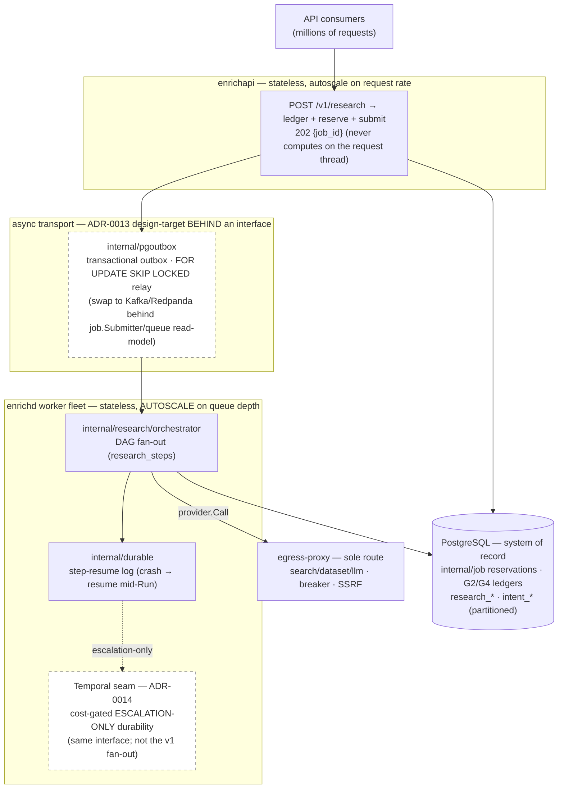
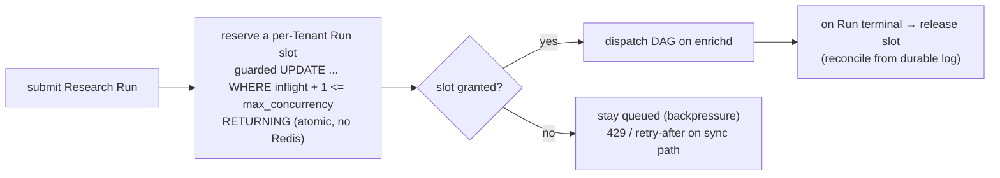

# 10 — Scalability

> **Status:** DRAFT · **Owner:** Principal Backend Engineer · **Last updated:** 2026-07-09 · **Gated by:** /scale-check, /architecture-review, /security-audit

> This document is the **scale design** for the Research & Intelligence platform: how it sustains
> **100+ concurrent Research Runs per user**, **thousands of concurrent Runs across tenants**, and
> **millions of research requests** on the *existing* elastic data-plane — **no new plane, no new
> deployable, no new dependency**. It realizes the placement frozen in [`02-architecture.md`](02-architecture.md)
> and the async/durable lane of [`04 §4`](04-ai-pipeline.md)/[`05 §5`](05-intent-methodology.md), and it
> **extends — never re-litigates** — ADR-0010 (elastic stateless data-plane), ADR-0011
> (Postgres-RLS-pool; Redis/ClickHouse are design-targets *behind Go interfaces*), ADR-0013
> (Kafka-protocol async transport, design-target), ADR-0014 (Temporal durable execution, **cost-gated /
> escalation-only**), ADR-0024 (async-adapter `CallPolicy`), and ADR-0026 (LLM cost cascade). The
> governing invariant is verbatim: **"the model proposes, a deterministic gate disposes."** Terms follow
> the Glossary (`docs/00-Project-Overview.md §7` + [`00 §6`](00-overview.md)): Tenant, Company, Provider,
> Dossier, Research Run, Agent Task, Intent Signal. **Every throughput, latency, and concurrency number
> here is a design target carried as UNVERIFIED** until the named load-test gate measures it (`00 §8`,
> RI-1/RI-3; §6).

---

## 1. Targets & the shape of the load

| Target | Design goal | Tag | Gate that converts it |
|---|---|---|---|
| Per-user concurrency | **100+** concurrent Research Runs per user | UNVERIFIED | Fleet load test (§6, staging) |
| Cross-tenant concurrency | **thousands** of concurrent Runs across tenants | UNVERIFIED | Fleet load test (§6) |
| Total volume | **millions** of research requests | UNVERIFIED | Soak test (§6) |
| Sync preview latency | p95 ≤ ~3s (capped preview only) | UNVERIFIED (RI-3) | Latency test (§6) |
| Async Dossier | full Dossier within SLA | UNVERIFIED (RI-3) | Latency test (§6) |

The load has a **fan-out shape** that dominates the sizing: one `POST /v1/research` is **one Research
Run**, and one Run fans out into a small DAG of Agent Tasks + collection calls (`04 §4`). So the unit
the *fleet* must sustain is not "requests/s" but **steps/s**:

```
steps_per_run ≈ collect(1) + company_research(1) + {technology, hiring, news,
                competitor, seo, market}(6) + summarization(1) + json_validation(guard)
              ≈ ~10 durable steps per Run   [UNVERIFIED — depends on wanted_sections pruning, API-OI-2]
```

Intent is a **separate async lane** (`job.Kind=intent_refresh`) that never blocks a Run and coalesces
per `company_domain` (`05 §5`), so it is sized independently (§3).

## 2. The scale spine — existing elastic data-plane, no new plane

Every subsystem rides the three existing deployables along their existing scaling axes (`02 §6`); the
async transport and durability targets are **interface seams**, Postgres-backed today.



| Layer | Scaling mechanism | ADR | Notes |
|---|---|---|---|
| **Ingestion** | `enrichapi` is stateless; `POST /v1/research` does **ledger-before-call + G4 reserve + submit**, returns `202`, and never computes on the request thread. | ADR-0010/0012 | Request-rate autoscale; a research request is a *submit + poll* like an Enrichment Job (`06`). |
| **Async transport** | `internal/pgoutbox` transactional outbox with `FOR UPDATE SKIP LOCKED` relay, visibility timeout, DLQ + redrive — **the Kafka/Redpanda implementation of the same `job.Submitter` / queue read-model interface** (ADR-0013). | ADR-0013 | Kafka is a **design-target behind the interface**; the DAG is engine-agnostic, so an engine swap is a `store.go` change with **zero** orchestrator change (`02 §6`). |
| **Execution / fan-out** | `enrichd` workers **autoscale on queue depth**; the orchestrator fans out the DAG as `research_steps` on `internal/job` + `internal/durable`; a crash **resumes mid-Run** rather than restarting. | ADR-0010/0014 | This is the v1 fan-out — **not** Temporal (ADR-0014). |
| **Durability escalation** | Temporal is a **cost-gated, escalation-only** durability target **behind the same interface** — reserved for the longest/most-complex multi-agent Runs if the hand-rolled saga+outbox proves insufficient (QS-TMP-1). | ADR-0014 | Adopting it is a topology-preserving swap, not a redesign (`00 §5`). |
| **Egress** | The egress-proxy fans out bounded `provider.Call`s with per-provider breakers + Key-Pool selection; free-model LLM load is the default carrier (`11`). | ADR-0010/0026 | Egress concurrency is bounded per provider (breaker + `concurrency_limit`). |

## 3. Per-tenant concurrency reservations — Postgres, the G4 reserve pattern, **no Redis client**

Fairness and blast-radius containment need a **per-Tenant concurrency reservation** so one Tenant's 100+
Runs cannot starve others. This is built on the **existing Postgres reservation pattern** — the same
atomic-batched-lease shape `key_budgets` already uses for Key Pools
(`docs/waterfall-dashboard/02 §2.5`/§3) — extended to a **research-concurrency budget**. It is the **G4
reserve → charge → reconcile** discipline applied to *slots* instead of *tokens*:



| Property | Mechanism |
|---|---|
| **Reservation store** | A per-Tenant `inflight`/`max_concurrency` counter row updated with the same guarded pattern as `key_budgets`: `UPDATE ... SET inflight = inflight + 1 WHERE inflight + 1 <= max_concurrency RETURNING` — an atomic database-side invariant, **crash-safe** (a lost worker releases its slot on the durable-log reconcile, exactly like the nightly `day_leased` reconcile). |
| **Two levels** | Per-**user** concurrency (the 100+ target) and per-**Tenant** aggregate (the thousands-across-tenants fairness bound) are two counters; the Tenant cap is the blast-radius limit. |
| **G4 alignment** | Slot reservation is the *concurrency* analogue of the **cost** reservation `POST /v1/research` already does (reserve aggregate Dossier ceiling before collection, `06 §3.2`); both are reserve-before-work, reconcile-on-terminal. |
| **Backpressure** | Over-cap submissions **stay queued** (async) or return `429 RATE_LIMIT`/`QUOTA` with retry semantics (sync); the queue is the buffer, not unbounded in-memory fan-out. |
| **NO Redis client** | This uses **Postgres + `internal/job` only**. Redis stays a **design-target behind the ADR-0011 `rotation.BudgetStore` / breaker / SSE-`Source` interfaces** — no `redis` import anywhere (`00 §9` stdlib-only; ADR-0011). The swap trigger is *measured* cross-instance convergence > 1s or lease-write saturation (§6), not a default. |

Intent concurrency is bounded the same way but is naturally self-limiting: `intent_refresh` **coalesces
per `company_domain`** (G2), so concurrent triggers for one account collapse to one compute (`05 §5`).

## 4. Batching, dedup & idempotent processing

Throughput per unit cost is protected by **doing less work**, using mechanisms the platform already has —
**no new store, no embeddings** (RAG deferred, ADR-0029):

| Lever | Mechanism | Realizes |
|---|---|---|
| **Idempotent submit** | `POST /v1/research` + `intent_refresh` require `Idempotency-Key`; a replay returns the original `job_id` (`06 §3.3`). Duplicate submits do **no** extra work. | G2 |
| **Cache-on-first-success** | Per-step LLM/collection results are cached on the G2 key (`config_version` + subject + slug; LLM adds `model`+`prompt_version`+`input_hash`); a re-Run of an unchanged subject pays **zero** LLM tokens and zero provider calls (`04 §8`). | G2 |
| **Intent coalescing** | `intent_refresh` keyed on `company_domain` collapses concurrent triggers into one score (`05 §5`). | G2 |
| **Deterministic dedup** | Collected records dedup on deterministic keys (`company_domain`, normalized name, CIK, LEI) + the ledger + Postgres full-text — no vector store (`03 §6`, ADR-0029). | ADR-0029 |
| **Freshness-TTL refresh** | Background re-Runs re-enqueue on a per-section TTL rather than recomputing on every read (`03 §6`, `04 §8`); long-TTL datasets (filings/LEI) refresh rarely, short-TTL discovery/news often. | ADR-0028 |
| **`wanted_sections` pruning** | The DAG skips Agent Tasks for unrequested sections (fewer steps/Run) — reduces `steps_per_run` for narrow requests (API-OI-2). | ADR-0028 |
| **Provider batch/bulk APIs** | Where a `dataset`/firmographic provider exposes a bulk endpoint, the adapter batches (existing `bulk_api`/`batch_api` provider columns). | existing roster |

## 5. Throughput model (Little's Law)

Sizing is a **Little's Law** exercise, `L = λ · W` (concurrency = arrival-rate × mean time-in-system),
applied at two levels. **All inputs are UNVERIFIED design targets**; the arithmetic shows *how* the
fleet is sized, and §6 measures the inputs.

**Level 1 — Runs.** For a user holding `L_user = 100` concurrent Runs with mean wall-time `W_run`, the
sustained per-user submit rate the fleet must clear is `λ_user = L_user / W_run`:

| `W_run` (mean Run wall-time) [UNVERIFIED] | `λ_user = 100 / W_run` | Interpretation |
|---|---|---|
| 30 s | ≈ 3.3 Runs/s per user | fast/cached Runs |
| 60 s | ≈ 1.7 Runs/s per user | typical full Dossier |
| 120 s | ≈ 0.8 Runs/s per user | heavy multi-section, paid escalations |

**Level 2 — Steps → workers.** Each Run is ~`10` durable steps (§1). The step arrival rate across `T`
active tenants each at concurrency `L_tenant` is `λ_step ≈ (T · L_tenant · steps_per_run) / W_run`. The
worker count is `N_workers = (λ_step · W_step) / c`, where `W_step` is mean step wall-time (dominated by
the LLM `CallPolicy{Timeout:60–90s}`) and `c` is per-worker step concurrency:

```
Example (all UNVERIFIED):
  T·L_tenant (fleet concurrency) = 2000 concurrent Runs
  steps_per_run                  = 10
  W_run                          = 60 s     → λ_step = 2000·10/60 ≈ 333 steps/s
  W_step                         = 3 s (mean; free-model fast path, not the 90s cap)
  c (concurrent steps/worker)    = 50       → N_workers = 333·3/50 ≈ 20 workers
```

The load-bearing consequences, all consistent with the placement in `02`:

- **Workers autoscale on `λ_step` via queue depth** — the outbox backlog *is* the autoscale signal; the
  fleet grows/shrinks with `T·L_tenant` without a topology change.
- **`W_step` is bounded by G3** (`CallPolicy{Timeout:60–90s, MaxAttempts:1}`) so a stuck LLM cannot
  inflate `L` unboundedly; the breaker sheds a failing provider.
- **The DB is not the bottleneck by design** — the hot path is one durable write per step (the
  `usage_events`/`research_steps` insert), and reservations amortize like the `≈ rps/64` Key-Pool lease
  batching (`docs/waterfall-dashboard/02 §2.5`), not per-call.
- **Sync preview is a *separate*, capped path** — it runs firmographics + `company_profile` only and
  never blocks on intent (`06 §3.2`), so its p95 is decoupled from the async fan-out (ARCH-RI-2).

## 6. Load-test plan — UNVERIFIED → measured

Every §1 target is converted by a named test in the hardening slice (`14`, `16`); until then the number
carries UNVERIFIED (`00 §8`). Tests run against PostgreSQL 17 in staging (the `scripts/run-rls-test.sh`
integration harness lineage).

| Gate | Measures | Passes when |
|---|---|---|
| **LT-1 per-user concurrency** | 100+ concurrent Runs for one user; slot-reservation correctness under `-race` | no over-admit past `max_concurrency`; no cross-user starvation; RI-1 |
| **LT-2 fleet concurrency** | thousands of concurrent Runs across N tenants; per-Tenant fairness | no Tenant exceeds its cap; queue drains; workers autoscale on depth; RI-1 |
| **LT-3 volume soak** | millions of requests over a sustained window; DB write-rate + reservation reconcile | reconcile matches ground truth; no unbounded backlog; RI-1 |
| **LT-4 sync latency** | sync-preview p95 under load | p95 ≤ ~3s; RI-3 |
| **LT-5 async SLA** | full-Dossier time-in-system distribution | within SLA; `W_run`/`W_step`/`steps_per_run` measured → feeds §5; RI-3 |
| **LT-6 backpressure/chaos** | provider breaker trips, worker loss, outbox lag | Runs resume mid-DAG (durable log); over-cap → `429`, not OOM; slots released on worker loss |
| **LT-7 Redis/Temporal triggers** | cross-instance reservation convergence; longest-Run durability | convergence ≤ 1s at fan-out **or** record the swap trigger (ADR-0011/0014) — the interface is in place, the swap is evidence-gated |

## 7. Failure & backpressure summary

| Condition | Behavior |
|---|---|
| Over per-Tenant/user cap | async → stay queued; sync → `429 RATE_LIMIT`/`QUOTA` with retry (`06 §6`). |
| Worker crash mid-Run | `internal/durable` resumes the Run at the last checkpointed step; the reservation slot is released on reconcile (no leak). |
| Provider/LLM down | per-provider breaker sheds it; the Run stops that branch, returns best-so-far with the section `pending`/lower-confidence (ADR-0026 gate signal (b); `06 §6`). |
| Budget exhausted mid-Run | G4 → stop with best-so-far (`04 §5`); a submit that cannot reserve the aggregate ceiling fails fast `QUOTA`. |
| Outbox backlog grows | autoscale adds workers; if transport saturates, that is the ADR-0013 Kafka swap trigger (interface already in place). |

## Open items

| ID | Item | Status | Owner |
|----|------|--------|-------|
| SCALE-RI-1 | Per-Tenant / per-user `max_concurrency` defaults + reservation-table DDL (mirrors `key_budgets` shape) | Draft (§3) | Principal Backend Engineer |
| SCALE-RI-2 | Measured `W_run` / `W_step` / `steps_per_run` inputs to the Little's-Law model (feeds autoscale policy) | UNVERIFIED until LT-5 | Backend |
| SCALE-RI-3 | `enrichd` autoscale policy on outbox depth for the DAG fan-out (thresholds, cooldowns) | OPEN — /scale-check | Backend + SRE |
| SCALE-RI-4 | Redis / Temporal swap-trigger thresholds (LT-7 evidence) | Deferred behind ADR-0011/0014 interfaces | Lead Solutions Architect |
| SCALE-RI-5 | Sync-preview compute placement (`enrichapi` inline vs worker hop) affecting LT-4 p95 | OPEN — ties to `02` ARCH-RI-2 / `06` API-OI-1 | Principal Backend Engineer |
