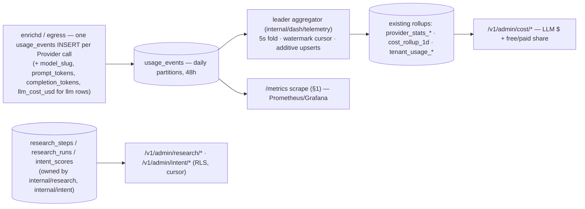

# 13 — Observability

> **Status:** DRAFT · **Owner:** Senior Backend Engineer · **Last updated:** 2026-07-09 · **Gated by:** /architecture-review, /security-audit, /scale-check

> This document is the **observability contract** for the Research & Intelligence subsystems: the new metric
> families with cardinality bounds, the reuse of the telemetry rollup pipeline, the SSE topics, the closed
> alert-metric vocabulary additions, the health checks for the new Provider categories, and the logging policy with
> **prompt-injection-safe redaction of fetched/AI content**. It extends `docs/waterfall-dashboard/10` (the
> dashboard observability contract: `internal/metrics` registry, rollups, closed alert vocabulary, no-PII logging)
> and `docs/20-Monitoring.md` (Prometheus + Grafana + OTel + ELK; **no PII in metrics or logs**) to the R&I layer,
> and it realizes the metric hooks named in [`00-overview.md §7`](00-overview.md) doc-13 row and the AI/intent
> designs in [`04`](04-ai-pipeline.md)/[`05`](05-intent-methodology.md). Governing invariant, verbatim:
> **"the model proposes, a deterministic gate disposes"** — telemetry **observes**; it never enforces (budgets and
> rules alert, the engine's **G4 cost ceiling** enforces). Gates are referenced by exact label: **G1 tenant
> isolation, G2 idempotency, G3 bounded execution, G4 cost ceiling, G5 provenance.** Every threshold/series-count
> figure is a design target carried **UNVERIFIED** until the `14` load/chaos pass measures it (`00 §8`).

---

## 1. Metric catalog

The R&I subsystems run on the **engine plane** (`enrichapi`/`enrichd` + the egress-proxy, `12 §1`), so their
families are registered on the shared in-repo `internal/metrics` registry and exported at each instance's
`GET /metrics` **without** the `dash_` prefix — they are siblings of the existing engine families
(`provider_calls_total`, `provider_cost_credits_total`, `queue_depth`), not dashboardd families. **`dashboardd`
never re-registers them** (the `docs/waterfall-dashboard/10 §1.2` discipline); its view of the same facts is the
rollup tables (§2), fed from `usage_events`, not from scraping.

**Cardinality rule (BINDING, inherited verbatim).** Label values come only from **closed, enumerable sets** —
Provider ids (operator-curated catalog), the 10 closed Agent Task types, the 10 intent classes, the 3 Source Types,
the 8-class error taxonomy, closed cascade tiers. **`tenant_id` is NEVER a label**, and neither is any unbounded id
(Run id, step id, subject/`company_domain`, Record id, **`model_slug`**). Per-Tenant and per-model analytics are
served exclusively from the RLS-scoped rollups + `research_*`/`intent_*` tables through `/v1/admin/*` — metrics
exist for platform operations only. No PII, no fetched content, and no LLM prompt/completion text ever appears in a
label or help string (§6). Duration histograms reuse the shared log-spaced bucket set.

### 1.1 New engine-plane metric families

| # | Name | Type | Labels (closed value set) | Cardinality bound | Purpose |
|---|------|------|---------------------------|-------------------|---------|
| 1 | `research_job_duration_seconds` | histogram | `mode` (`sync`,`async` = 2), `outcome` (`succeeded`,`failed`,`partial`,`cancelled` = 4) | ≤ ~104 series (8 × 13 buckets) | End-to-end Research Run latency by terminal outcome; p95/p99 feed RI-3. |
| 2 | `research_step_outcome_total` | counter | `task_type` (10 Agent Tasks, `04 §3`), `outcome` (`ok`,`schema_invalid`,`escalated`,`stopped_budget`,`stopped_attempts`,`error` = 6) | ≤ 60 | Per-Agent-Task disposition; the deterministic-gate outcome distribution (never self-confidence). |
| 3 | `llm_tokens_total` | counter | `adapter` (`openrouter`,`openrouter-paid`,`openai`,`anthropic` = 4), `tier` (`free`,`mid`,`paid` = 3), `kind` (`prompt`,`completion` = 2) | ≤ 24 | Token throughput by carrier/tier; free-vs-paid share (RI-2). Per-**model** detail lives in `usage_events.model_slug`, never a label. |
| 4 | `llm_cost_usd_total` | counter | `adapter` (4), `tier` (3) | ≤ 12 | Charged LLM spend (USD) by carrier/tier; paid-tier share vs the configured cap. |
| 5 | `llm_cascade_escalations_total` | counter | `task_type` (10), `reason` (`schema_invalid`,`disagreement` = 2) | ≤ 20 | Cascade tier climbs (free→mid→paid); **only** the two escalate-signals occur here (budget/attempts cause a *stop*, counted in #2) — proves escalation never fires on self-confidence. |
| 6 | `intent_score_freshness_seconds` | gauge | `class` (10 intent classes, `05 §2`) | 10 | `max(now − computed_at)` per class across tracked accounts; the staleness signal feeding `intent.score_staleness_s` (§4). |
| 7 | `intent_signals_total` | counter | `class` (10), `source_type` (`api`,`dataset`,`ai_inference` = 3) | ≤ 30 | Raw signals ingested per class/origin; `ai_inference` visibly separable (never fused as a fact). |
| 8 | `search_calls_total` | counter | `provider` (`search` catalog slugs, bounded), `outcome` (`results`,`zero_results`,`error` = 3) | ≤ 3 × search-catalog | **Collection-semantic** outcome of a `search` call (did it return usable discovery) — distinct from transport success in `provider_calls_total` (§1.2). |
| 9 | `dataset_calls_total` | counter | `provider` (`dataset` catalog slugs), `outcome` (`hit`,`miss`,`error` = 3) | ≤ 3 × dataset-catalog | Collection-semantic outcome of a `dataset` lookup (filing/LEI/scholarly hit vs miss). |
| 10 | `research_runs_inflight` | gauge | — | 1 | Saturation: Research Runs currently executing on this instance (autoscale signal, `10`). |

Worst-case total across the R&I catalog is a few hundred series per instance at the design-target catalog size —
negligible beside the dashboardd catalog (`docs/waterfall-dashboard/10 §1.1`), and comfortably inside a single
Prometheus scrape (**UNVERIFIED** until `14` measures actual counts).

### 1.2 Existing engine metrics reused (never re-registered for R&I)

The `search`/`dataset`/`llm` adapters are **Providers**, so their transport-level facts are already counted by the
engine families below — the R&I families above add only the *R&I-specific dimensions* those don't carry (Agent Task
type, tier, class, collection outcome).

| Name | What it already covers for R&I | R&I family that complements it |
|------|-------------------------------|--------------------------------|
| `provider_calls_total{provider,result}` | transport success/failure of every `search`/`dataset`/`llm` call by the 8-class error taxonomy | `search_calls_total`/`dataset_calls_total` add the *collection-semantic* outcome; `research_step_outcome_total` adds the *task* outcome |
| `provider_cost_credits_total{provider}` | modeled credit spend per Provider incl. new categories | `llm_cost_usd_total` adds the **USD** token cost carried in `usage_events.llm_cost_usd` |
| provider latency histogram (rollup `lat_hist`) | p95/p99 per Provider incl. LLM/search | `research_job_duration_seconds` adds end-to-end Run latency |

## 2. Rollup pipeline reuse

The R&I layer adds **no new rollup table for v1**. Migration 0015 adds four **columns** to `usage_events`
(`model_slug text`, `prompt_tokens int`, `completion_tokens int`, `llm_cost_usd numeric` — nullable; non-LLM rows
leave them NULL, `04 §2`), and the **existing leader-elected aggregator** (`internal/dash/telemetry`,
`pg_try_advisory_lock(hashtext('dash_aggregator'))`) folds them into the **existing** rollups additively:

- **Per-Provider spend** (incl. `llm`/`search`/`dataset`) folds into `provider_stats_*` / `cost_rollup_1d` exactly
  as every Provider call does — the new categories are Providers, so no fold code changes shape.
- **Token/USD dimensions** ride the carried columns: `SUM(prompt_tokens+completion_tokens)` and `SUM(llm_cost_usd)`
  per Provider/day, giving free-vs-paid share and daily LLM $ without a bespoke table.
- **Per-model (`model_slug`) detail** is intentionally **not** a rollup dimension or a metric label (unbounded). It
  is queried on demand from `usage_events` (48h) + `research_steps` under the dual-GUC RLS transaction for the
  `web/features/airesearch`/`aimodels` surfaces — bounded, cursor-paginated, never a raw scan.
- **Single writer, watermark, replayability** properties are inherited unchanged (`docs/waterfall-dashboard/10 §2`):
  only the leader writes rollups; the incremental fold consumes each `usage_events` row once past a persisted
  watermark; rollups are refoldable from the 48h raw stream (additive `ON CONFLICT` is idempotent).

## 3. SSE topics

Live R&I views ride the **one multiplexed SSE stream** (ADR-0019); doc 08 §7 adds the three closed topics
(`research`, `ai`, `intent`) to the existing set, with `event: <domain>.<entity>.<verb>` schema and the QoS split
(`*.changed`/`*.progress` never dropped, `*.tick` coalescible). The dashboardd poller derives these deltas from
`research_runs`/`research_steps`, `config_versions` epoch bumps (`ai_prompt`/`llm_route`/`intent_weights`), and
`intent_refresh` progress + `intent_scores` writes. `dash_sse_*` metrics (`docs/waterfall-dashboard/10 §1.1`
#4–#7) already cover per-topic subscription/publish/drop counts, so the new topics are observable without new
metrics.

## 4. Closed alert-metric vocabulary additions

The alert rule builder exposes a **CLOSED** metric vocabulary (`docs/waterfall-dashboard/10 §4`, currently 17
entries): each entry is CHECK-able against `alert_rules.metric`, the evaluator switches over it, and the SPA mirrors
it via `GET /v1/admin/meta/enums` — adding one requires changing the table, the evaluator, and the UI enum in
lockstep (four-way parity, OBS-2). The R&I layer adds **four** entries. **It reuses the existing vocabulary
wherever the new subsystems are already Providers or queues** — no duplication:

- `search`/`dataset`/`llm` Provider health reuses **`provider.success_rate`**, **`provider.error_rate`**,
  **`provider.p95_latency_ms`**, **`provider.credits_remaining`** scoped by `provider_id` (§5).
- Research/intent backlog reuses **`queue.depth`** / **`queue.oldest_age_s`** / **`queue.dead_count`** scoped by the
  `research` / `intent_refresh` queue names (the DAG fan-out and refresh ride `job_outbox`, `04 §4`/`05 §5`).

| Metric (new) | Source | Unit | Allowed scope keys | Default (op / threshold / window) |
|---|---|---|---|---|
| `llm.paid_token_share` | `usage_events` token columns folded — `SUM(tokens WHERE tier IN (mid,paid)) / NULLIF(SUM(tokens),0)` over window | ratio 0..1 | — (platform), `provider_id` | gt / 0.25 / 3600s **UNVERIFIED** (RI-2 cap) |
| `llm.cost_daily_usd` | `cost_rollup_1d` (`SUM(llm_cost_usd)` current UTC day in scope) | USD | `provider_id`, `workflow_key` | gt / `budgets.limit` for the day-scope budget when set, else user-set / — |
| `research.failure_rate` | `research_runs` — `count(status='failed') / NULLIF(count(*),0)` over window (N-of-M bucket rule) | ratio 0..1 | — (platform) | gt / 0.10 / 900s **UNVERIFIED** |
| `intent.score_staleness_s` | `intent_scores` — `max(now − computed_at)` over tracked accounts (staleness-shaped: absence of fresh rows **is** the breach, like `worker.heartbeat_age_s`) | seconds | — (platform), `class` | gt / 86400 / — **UNVERIFIED** |

Notes (inherited discipline): defaults are rule-builder pre-fills, **not** enforcement — budgets and rules alert,
G4 enforces. `— (platform)`-scoped entries live under `tenant_id='platform'`, are operator-only (RBAC), and read
rollups/owned tables under the dual-GUC RLS transaction — the evaluator never touches a raw `usage_events` scan and
can never see across Tenants (G1). Every default is a pre-tune value, **UNVERIFIED** until production baselines
exist (`14`).

## 5. Health checks for the new Provider categories

`search`/`dataset`/`llm` Providers get scheduled health checks through the **existing** health center
(`internal/dash/health`, `docs/waterfall-dashboard/10 §3.3`) — **no new health machinery**. A probe is a
**G3-bounded `provider.Call`** with a jittered interval, bounded concurrency, and a leased Provider Key through the
normal `rotation.LeaseResolver` path, so probes are attributed, budget-checked, and SSRF-guarded exactly like
production traffic. Category-specific probe shape:

| Category | Probe | Cost note |
|---|---|---|
| `llm` | Prefer a **zero-token metadata endpoint** (e.g. the gateway's models/health endpoint) so a probe **spends no budget**; only if none exists, a minimal bounded completion counted in G4. | Keeps health cheap; a probe never triggers a paid escalation (DP-OI-4). |
| `search` | A cheap canned discovery query for a known term; success = a well-formed structured response (not page content). | Standard `provider.Call`; breaker + rate-limit columns apply. |
| `dataset` | A known-entity lookup (e.g. a fixed CIK/LEI) resolving through the structured API. | Index/structured response only (ADR-0025 boundary). |

Each probe INSERTs one `provider_health_checks` row and increments `dash_health_checks_total{provider,result}` with
the 8-class error mapping; status transitions emit `provider.health.changed` and become visible to the alert
evaluator through `provider_stats_1m` + `provider_health_checks`. A down LLM/search/dataset Provider therefore
surfaces as a **`provider.success_rate`/`provider.error_rate`/`provider.p95_latency_ms` breach scoped by
`provider_id`** — the existing vocabulary — driving the §5-degradation cascade/skip in `12 §5`. LLM/search health
needs no new metric or vocabulary entry.

## 6. Logging & prompt-injection-safe content redaction

R&I inherits the three separated streams and the structured `log/slog` JSON format from
`docs/waterfall-dashboard/10 §7` (App log → ELK; Access log → `api_access_log`; Audit log → hash-chained
`audit_log`) and the **BINDING no-PII policy** (no Record/Subject data, Field values, emails, secrets, session ids
in any label, help string, or log line; the `secrets.Secret` wrapper redacts). Two R&I extensions:

**Canonical research-scoped slog fields** (bounded identifiers + counts only — never content):

| Field | Type | Content |
|-------|------|---------|
| `req_id` | string | per-request id; join key across app log ↔ `api_access_log` ↔ future OTel span |
| `tenant` | string | opaque Tenant id from the verified Principal — never a name/email |
| `run_id` / `step_id` | string | Research Run / step ids (opaque) |
| `task_type` | string | one of the 10 closed Agent Task types |
| `model_slug` | string | the model used (a catalog id — bounded, safe as a *field* though not a metric label) |
| `prompt_version` | string | the pinned `ai_prompt` version (G5) |
| `prompt_tokens` / `completion_tokens` | int | token counts (numbers, not text) |
| `llm_cost_usd` | number | charged cost |
| `outcome` / `gate_signal` | string | terminal outcome + the deterministic signal that disposed it (`schema_invalid`/`budget`/`attempts`/`agreement`) |

**Fetched/AI content is never logged as text (prompt-injection-safe + PII-safe).** This is the R&I-specific rule
on top of no-PII:

- **Collected content is untrusted data, not log material.** Raw search snippets, resolved-source bodies, and any
  fetched text carry both PII **and** adversarial prompt-injection payloads (e.g. "ignore previous instructions",
  markup, control sequences). They are **never** interpolated into an app-log line, an alert message, an SSE
  payload, or a notification body as rendered text — an injected string must not reach a log viewer or alert
  channel where it could be read as an instruction or exploit a downstream renderer.
- **Log the reference, not the value.** Content is identified by its idempotency key / content hash and its
  provider + `source_type`; the value itself lives only in the provenance rows (`research_sources`) under RLS. Error
  messages from egress are logged with **bodies truncated and scrubbed** (they may echo submitted PII), matching the
  dashboard's Provider-egress logging rule.
- **LLM prompt/completion text is not logged.** The prompt is reconstructable from the pinned `prompt_version` +
  `input_hash`; the completion is stored (redacted-in-logs) in `research_steps`/`research_sources`. Logs carry token
  counts, cost, and outcome — never the text. This keeps injection payloads and PII out of ELK by construction.
- The rule applies **transitively** to metric labels (already closed sets, §1) and SSE payloads (ids + status +
  counts, never content).

## 7. Gate & self-verification summary

| Gate | How R&I observability satisfies it |
|---|---|
| **G1 tenant isolation** | `tenant_id` is never a metric label; per-Tenant/per-model analytics are RLS-scoped rollup/table reads only; the evaluator reads under the dual-GUC transaction (no raw `usage_events`/`intent_signals` scan). |
| **G2 idempotency** | Metrics/rollups are folded from the durable `usage_events` stream past a watermark (each row once); a refold is byte-identical (additive `ON CONFLICT`). |
| **G3 bounded** | Health probes are bounded `provider.Call`s (CallPolicy + breaker); alert reads are cursor/rollup-bounded. |
| **G4 cost ceiling** | Telemetry **observes** LLM $/token share and freshness; it never enforces — `llm.*` alerts warn, the engine's G4 rejects at reserve time. LLM health probes prefer zero-token endpoints. |
| **G5 provenance** | Source-trace reads `research_sources` verbatim; `ai_inference` visibly distinct; every admin mutation hash-chains into `audit_log`; logs carry the disposing gate signal. |
| **No PII / injection-safe** | No PII, no fetched content, no prompt/completion text in labels, logs, alerts, or SSE payloads; content is referenced by hash under RLS (§6). |

## Open items

| ID | Item | Status | Owner |
|----|------|--------|-------|
| OB-OI-1 | Four-way parity for the four new alert entries (`§4` vocabulary ⊆ evaluator switch ⊆ `meta/enums` ⊆ SPA rule-builder) + `§1` families ↔ registered metrics | OPEN — `14` / at impl (extends `docs/waterfall-dashboard/10` OBS-2) | Senior Backend Engineer |
| OB-OI-2 | `intent_score_freshness_seconds` emitter: which loop scans `intent_scores` for the per-class max age without a full scan (partition-pruned/indexed) | OPEN — `05`/`14` | Senior Backend Engineer |
| OB-OI-3 | All `§4` default thresholds (`llm.paid_token_share` 0.25, `research.failure_rate` 0.10, `intent.score_staleness_s` 86400s) are pre-tune values, UNVERIFIED until the `14` load/chaos pass | OPEN — `14` | Senior Backend Engineer |
| OB-OI-4 | LLM health-probe endpoint per adapter (zero-token metadata vs minimal completion) so §5 probes never spend budget | OPEN — shared with DP-OI-4 (`12`) | Senior Backend Engineer |
| OB-OI-5 | OTel tracing across a Research Run DAG (span per Agent Task) — design target; `req_id`/`run_id` reserved as correlation keys pending the ADR-0016 dependency decision | OPEN — design target (mirrors `docs/waterfall-dashboard/10` OBS-4) | Solutions Architect |
