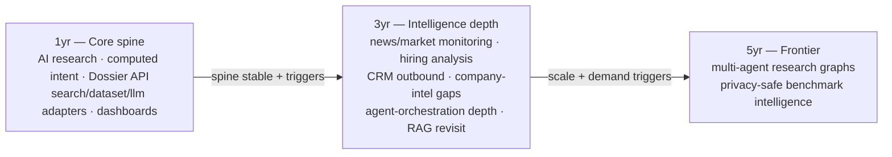

# 15 — Roadmap

> **Status:** DRAFT · **Owner:** Senior Product Manager + Principal Enterprise Software Architect · **Last updated:** 2026-07-09 · **Gated by:** /architecture-review, /provider-audit, /scale-check

> This document is the **1-year / 3-year / 5-year roadmap** for the Research & Intelligence platform. It fixes
> the **core spine** built in this series (`00 §2.1`) as the 1-year deliverable and stages everything the series
> **specifies but does not core-design** (`00 §2.2`) behind explicit **triggers** — nothing here is auto-scheduled;
> each item ships only when its trigger fires, its dependency is met, and (where structural) its ADR is written.
> It realizes the roadmap pointer in [`00-overview.md §2.2`](00-overview.md) and carries the deferred decisions of
> ADR-0029 (embeddings/RAG revisit trigger) and ADR-0030 (CRM outbound — design accepted, implementation roadmap).
> Governing invariant everywhere, verbatim: **"the model proposes, a deterministic gate disposes"** — every future
> item inherits the five gates + the single SSRF egress-proxy; none re-litigates the ratified architecture
> (ADR-0010/0011/0013/0014/0015). Terms follow the Glossary (`docs/00-Project-Overview.md §7` + [`00 §6`](00-overview.md)).
> Every scale/cost/coverage number is a design target carried **UNVERIFIED** (`00 §8`) until measured.

---

## 1. The trigger discipline

The platform grows by **evidence, not calendar**. A roadmap item is a *standing option*, not a commitment: it
carries a **value** (why), a **trigger** (the measured condition that promotes it from roadmap to build), a
**dependency** (what must exist first), and an **ADR** (the decision that governs it — existing, or a new one the
trigger requires). This mirrors the ADR-0011/0029 "design-target behind an interface, promoted on a trigger"
pattern the platform already uses for Redis/ClickHouse/pgvector — the deferral is a *decision*, not an omission.

| Field | Meaning |
|---|---|
| **Value** | The product/GTM capability the item unlocks. |
| **Trigger** | The measured condition (scale, cost, demand, accuracy gap) that promotes it. Absent the trigger, it stays parked. |
| **Dependency** | The spine slice(s) / infra it requires (`16` slice ids). |
| **ADR** | The governing decision; a new ADR is written **before** structural work begins (plan-first, ADR-0003). |

## 2. Horizon at a glance

| Horizon | Theme | Items | Governing ADRs |
|---|---|---|---|
| **1 year** | Core spine (fully designed, `16` slices 21–27 core) | AI Research Engine · computed intent · Dossier API · `search`/`dataset`/`llm` adapters · admin dashboards | 0025, 0026, 0027, 0028 |
| **3 year** | Intelligence depth (specified, trigger-gated) | news/market monitoring · hiring-signal analysis · CRM outbound · company-intel gaps (competitors/acquisitions/funding-rounds/partnerships/locations) · agent-orchestration depth · embeddings/RAG revisit | 0030, 0027, 0028, 0029, (new: news, agent-graph) |
| **5 year** | Frontier (directional) | multi-agent research graphs · privacy-safe benchmark intelligence | (new ADRs at trigger) |

## 3. One year — the core spine

The 1-year deliverable is the **fully-designed** subsystem set of this series, sliced in [`16`](16-implementation-phases.md)
(slices 21–27, of which 21–26 are the core; 27 opens the 3-year roadmap). It is a commitment, not an option — no
external trigger, only the internal slice dependencies.

| Item | Value | Dependency | ADR |
|---|---|---|---|
| **LLM-as-egress adapters + deterministic cost cascade** | Reason over collected data on **free-first** models with zero new Go dep; paid spend is a gated escalation, never model-chosen. | Dashboard P1–P4 (providers, keys, `configver`, telemetry); `16` slice 21 | 0026 |
| **`search` + `dataset` collection adapters** | Discovery + authoritative datasets (Brave/OpenAlex/SEC-EDGAR/GLEIF/registries) through the SSRF-guarded egress; no scraping. | Dashboard P1 (registry); `16` slice 22 | 0025 |
| **6 DOC-FIRST scalar Fields (33→39)** | `twitter_url`/`facebook_url`/`github_url`/`crunchbase_url`/`company_ticker`/`total_funding_usd` flow through the normal Waterfall + provenance. | `docs/00 §7` registration (done); `16` slice 22 | 0028/0023 |
| **AI Research Engine + orchestration** | Deterministic DAG turns collected data into Dossier sections; `research_*` provenance (0015). | slices 21+22; `16` slice 23 | 0026/0028 |
| **Research-Dossier API** | `domain → Dossier` in one call (async 202 + sync preview + HMAC webhook); CRM-ready normalization. | slice 23; `16` slice 24 | 0028 |
| **Computed Intent Engine** | Ten-class computed intent with confidence + reasoning; async-only; single write-back owner. | slices 22+23; `16` slice 25 | 0027 |
| **Admin dashboards** | `airouting`/`research`/`intent` modules + web screens; no-orphan-UI; reuse SSE/telemetry/cost/health/approvals. | slices 21–25; `16` slice 26 | 0026/0027/0028 |

**Exit condition for the 1-year spine:** slices 21–26 pass their acceptance criteria (`16`), the RI-1/RI-2/RI-3
targets are measured (`14 §8`), and docs `00`–`16` flip DRAFT→ACCEPTED.

## 4. Three years — intelligence depth (trigger-gated)

### 4.1 News & market monitoring (depth)

- **Value.** Continuous company/market monitoring beyond the per-Run `news`/`market` Agent Tasks: a standing
  `news` Provider category, event streams, and market-signal aggregation feeding intent and alerts.
- **Trigger.** Sustained tenant demand for *continuous* (not on-Run) monitoring **and** a `news`-category provider
  with adequate freshness (RI-6 measured, `03`).
- **Dependency.** `16` slice 27 (news `news_items`/`market_signals`, **migration 0017**); the intent lane (`05`).
- **ADR.** A new **news-monitoring ADR** (category `news`, retention, dedup) + ADR-0027 (signals consume it). The
  `news` category slug is already reserved (ADR-0025) so no re-litigation.

### 4.2 Hiring-signal analysis (depth)

- **Value.** Beyond the per-Run `hiring` Agent Task: longitudinal hiring velocity, department-mix trends, and
  backfill-vs-growth classification as first-class intent inputs and a Dossier `hiring_signals` timeline.
- **Trigger.** Hiring signals prove predictive in the intent backtest (RI-4, `05 §9`/INT-OI-4) **and** a
  posting-provider (TheirStack/PredictLeads) coverage measurement clears the bar (RI-5).
- **Dependency.** Computed intent (slice 25); the `hiring` Agent Task (`04 §3`).
- **ADR.** ADR-0027 (hiring types already in the taxonomy, `05 §2`); no new ADR unless a longitudinal store is
  needed beyond `intent_signals` partitions.

### 4.3 CRM outbound (push connectors)

- **Value.** Push the normalized `crm_ready.{account,contact}` projection into a tenant's CRM (Salesforce/HubSpot)
  — closing the loop from research to the system of record without manual export.
- **Trigger.** Tenant demand for write-back **and** the `crm_ready` normalization proven stable in production
  (`06 §7`); security sign-off on the outbound trust direction (`09 §2`).
- **Dependency.** Dossier API + `crm_ready` (slice 24); `16` slice 27 (`crm_connections`/`crm_field_maps`/
  `crm_push_ledger`, **migration 0018**).
- **ADR.** **0030** (design accepted): push is an outbound *direction* of the single egress-proxy — **no second
  internet route**; CRM OAuth tokens envelope-sealed, injected only at egress; every push idempotent
  (`crm_push_ledger`) and provenanced. Per-CRM connector semantics land with the implementation.

### 4.4 Company-intelligence gaps (as Dossier objects)

- **Value.** Deepen the Dossier's relational sections — **competitors, acquisitions, funding-rounds, partnerships,
  locations** — as fully-provenanced multi-valued Dossier objects (never Fields, the ADR-0028 boundary).
- **Trigger.** Authoritative dataset/API coverage for each object (e.g. funding rounds via a dataset adapter,
  filings via SEC-EDGAR) measured adequate (RI-5); tenant demand per object.
- **Dependency.** Dossier schema (slice 24); the relevant `dataset` adapters (slice 22 / `07`).
- **ADR.** **0028** already fixes these as **Dossier-only** objects (`06 §5`, ADR-0028 boundary rule) — each new
  object is a schema-versioned Dossier extension (API-OI-5), **not** a Field-vocabulary change.

### 4.5 Agent-orchestration depth

- **Value.** Richer DAGs — conditional sub-tasks, `wanted_sections[]`-driven task-graph pruning (API-OI-2),
  cross-Task agreement voting, and a cost-gated **Temporal** fan-out for large Runs (ADR-0014, currently behind an
  interface, **not** the v1 fan-out).
- **Trigger.** Run complexity or scale exceeds what the `internal/job` + `internal/durable` lane serves within SLA
  (RI-1/RI-3 measured) — the ADR-0014 cost-gate condition — **and** the deterministic-gate discipline is preserved.
- **Dependency.** Orchestrator (slice 23); the existing durable lane.
- **ADR.** ADR-0014 (Temporal cost-gated) governs the fan-out promotion; the model-proposes/gate-disposes invariant
  is non-negotiable — added orchestration depth never lets a model choose a tool or dispose a spend (ADR-0026).

### 4.6 Embeddings / RAG revisit

- **Value.** Semantic dedup of collected documents, "companies like this" similarity, and retrieval-augmented
  grounding over the stored source corpus.
- **Trigger (ADR-0029, any of).** (a) the Dossier/source corpus outgrows deterministic-key + Postgres full-text
  dedup (measurable duplicate miss-rate); (b) a product feature requires semantic similarity; (c) LLM-context
  grounding needs retrieval beyond targeted provider calls.
- **Dependency.** The research corpus (`research_sources`, slice 23) at scale.
- **ADR.** **0029** defers it and **records the preferred path**: Postgres-native (either `pgvector` via the
  migration runner, or brute-force cosine over `float4[]` for small corpora) **behind an interface** — decided in a
  **future embeddings/RAG ADR**, never defaulted to a managed vector DB. Deferring protects zero-dep + free-first.

## 5. Five years — frontier (directional)

### 5.1 Multi-agent research graphs

- **Value.** Beyond a fixed DAG: research *graphs* where specialized agents negotiate, cross-verify, and
  decompose open-ended research goals — while the **deterministic gate still disposes every spend, tool, and
  escalation** (the invariant does not bend at any horizon).
- **Trigger.** The fixed DAG's coverage/quality plateaus against measured research goals **and** free-first economics
  hold at graph scale (RI-2) — otherwise cost runs away.
- **Dependency.** Agent-orchestration depth (§4.5); a mature cost cascade (slice 21) proven at scale.
- **ADR.** A new **multi-agent-graph ADR** — must re-affirm: no model-driven tool/spend, egress remains the sole
  route, every agent output is `ai_inference` until deterministically fused (ADR-0026/0027).

### 5.2 Privacy-safe benchmark intelligence

- **Value.** Cross-tenant *aggregate* benchmarks (e.g. "companies in your segment show rising cloud-migration
  intent") delivered **without** exposing any single tenant's data — differentially-private / k-anonymized
  aggregates over the intent corpus.
- **Trigger.** Enough tenant coverage that aggregates are meaningful **and** a privacy method that provably keeps
  G1 (no cross-tenant leakage) intact — the harder gate.
- **Dependency.** Computed intent at multi-tenant scale (slice 25); a privacy-budget mechanism.
- **ADR.** A new **benchmark-privacy ADR** — G1 is the design constraint: aggregates are computed under a privacy
  budget, never by relaxing RLS; no raw cross-tenant read path ever exists (RAG-cross-tenant stays banned, ADR-0029).

## 6. Consolidated trigger register

| ID | Item | Trigger (promotes to build) | Dependency | ADR |
|----|------|-----------------------------|------------|-----|
| RM-1 | News & market monitoring | continuous-monitoring demand + `news` freshness (RI-6) | slice 27 / 0017 | new news ADR + 0027 |
| RM-2 | Hiring-signal analysis | hiring proves predictive (RI-4) + posting coverage (RI-5) | slice 25 / `04 §3` | 0027 |
| RM-3 | CRM outbound push | write-back demand + `crm_ready` stable + security sign-off | slice 27 / 0018 | **0030** |
| RM-4 | Company-intel objects (competitors/acquisitions/funding-rounds/partnerships/locations) | per-object dataset coverage (RI-5) + demand | slice 24 / `07` | **0028** (Dossier-only) |
| RM-5 | Agent-orchestration depth (incl. Temporal fan-out) | Run scale/complexity exceeds durable-lane SLA (RI-1/RI-3) | slice 23 | 0014 + 0026 |
| RM-6 | Embeddings / RAG | corpus outgrows deterministic+full-text dedup, OR semantic-similarity feature, OR grounding need | slice 23 corpus | **0029** → future RAG ADR |
| RM-7 | Multi-agent research graphs | fixed-DAG quality plateau + free-first holds at graph scale (RI-2) | RM-5 | new graph ADR |
| RM-8 | Privacy-safe benchmark intelligence | tenant coverage + G1-preserving privacy method | slice 25 at scale | new privacy ADR |

## Open items

| ID | Item | Status | Owner |
|----|------|--------|-------|
| RM-OI-1 | ADR-0009 human-policy confirmation for DEPRIORITIZED search (Serper/Tavily) — gates any monitoring that would route them (`00` RI-OI-1) | Pending | Security + Product |
| RM-OI-2 | News-monitoring ADR (category `news` retention/dedup/freshness) before RM-1 build | Not started (trigger-gated) | Architecture + Product |
| RM-OI-3 | Per-CRM connector semantics (upsert keys, rate limits, field maps) for RM-3 (ADR-0030 defers to implementation) | Deferred | Backend + Product |
| RM-OI-4 | Future embeddings/RAG-on-Postgres ADR (`pgvector` vs `float4[]` brute-force) written when RM-6 trigger fires | Deferred (ADR-0029) | Architecture + ML |
| RM-OI-5 | Company-intel object schemas + dataset-adapter coverage per object (RM-4) | Draft (`07`) | Backend + Research |
| RM-OI-6 | Privacy method (DP / k-anonymity) that provably preserves G1 for RM-8 | Not started (5yr) | ML + Security |
