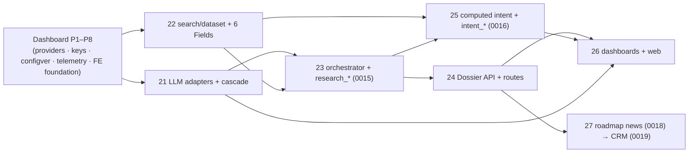

# 16 — Implementation Phases

> **Status:** IMPLEMENTED (slices 21–27 shipped + live-verified 2026-07-11; see §2.0) · **Owner:** Solutions Architect + Principal Backend Engineer · **Last updated:** 2026-07-11 · **Gated by:** /architecture-review, /security-audit, /provider-audit, /scale-check

> Authoritative slice plan for the Research & Intelligence platform. It continues the Waterfall dashboard phase
> plan ([`docs/waterfall-dashboard/12`](../waterfall-dashboard/12-implementation-phases.md), slices through P12)
> with **slices 21–27** (repo-global docs 43–49), and is the contract implementation agents follow 1:1. Every
> slice is independently verifiable, lands as exactly one commit on branch `waterfall`, and must satisfy its
> acceptance criteria before the next slice starts. It realizes the subsystem designs of [`03`](03-data-collection.md)–[`09`](09-security-pii-dsar.md),
> the test contract of [`14`](14-testing.md), and the migration ledger + owner map of [`00 §2.3`](00-overview.md);
> it honors the ADRs it slices (0025–0030) verbatim. Governing invariant everywhere: **"the model proposes, a
> deterministic gate disposes."** Gates referenced by exact label: **G1 tenant isolation, G2 idempotency, G3
> bounded execution, G4 cost ceiling, G5 provenance.** Numeric criteria are design targets tagged **UNVERIFIED**
> until the named load test measures them (`14 §8`).

---

## 1. Phasing principles

1. **Independently verifiable slices.** At the end of every slice, on a clean checkout of the slice commit:
   `go build ./...`, `go vet ./...`, `go test ./...` are green; `gofmt -l` is empty; `go test -race ./...` is green
   for every package containing goroutines, channels, `sync/atomic`, or shared mutable state (at minimum
   `internal/research/orchestrator` and `internal/intent/{signal,score}` — the DAG fan-out and refresh workers);
   from slice 26 onward `npm --prefix web run build` is green. Integration suites (`-tags integration`, gated on
   `WATERFALL_PG_DSN` via `scripts/run-rls-test.sh`) pass live against PostgreSQL 17, `-p 1` serialized.
2. **No slice skipping.** Slices execute in dependency order (§3). A later slice never begins while an earlier
   slice's acceptance criteria are unmet — partial credit does not exist. A blocked slice is recorded in
   `docs/IMPLEMENTATION_PROGRESS.md` (slice-record format) and work stops on that chain, not on the doc.
3. **DEVIATION PROTOCOL (per ADR-0003, plan-first).** Any discovery during implementation that contradicts or
   extends a planning doc — a schema column that must change, an endpoint shape that cannot be honored, a DAG edge
   the code needs — is handled by updating the relevant doc FIRST (its Open-items table amended and, where
   structural, an ADR), and only then writing the code. The doc diff and the code land in the same slice commit.
   Silent divergence between docs and code is a build-breaking defect, not a style issue.
4. **Acceptance criteria are executable.** Every criterion below names the command, test, or query that proves it.
   "Works" is never a criterion. Numeric performance criteria are design targets tagged UNVERIFIED until the named
   load test measures them (`14 §7`/§8; staging conversion mirrors `docs/waterfall-dashboard/12` P12).
5. **Migrations are append-only and slice-pinned.** New files follow `migrations/NNNN_snake_description.sql`
   (4-digit, no BEGIN/COMMIT — `internal/pgmigrate` wraps), with a top comment naming the doc section + gate each
   realizes. `pgmigrate` applies strictly in filename order, so migration numbers land in slice order: **0015**
   (slice 23), **0016** (slice 25), **0017** (slice 26, R&I operator-read), **0018**+**0019** (slice 27). Config kinds `ai_prompt`/`llm_route`/
   `intent_weights` reuse **0006** — **no new table** (`00 §2.3`). The 6 field additions are code+doc only, **not**
   a schema change (ADR-0023/0028).
6. **Gate tests travel with the slice.** The G1 RLS zero-rows negative tests for every table a slice creates
   (`14 §3.1`) are written in that slice, not deferred: a slice that adds a table without its RLS zero-rows test
   fails its own acceptance criteria. The deterministic-cascade, provenance, and boundary tests likewise travel
   with the slice that introduces the behavior.
7. **Every write in every slice carries the API conventions** (ADR-0012, `06 §2`): `/v1` (public research/intent) or
   `/v1/admin/*` (dashboardd) paths, snake_case JSON, `Idempotency-Key` required on writes, uniform error body
   `{"error":{"code","message"}}`, cursor pagination with limit cap 200. These are the P0 `internal/dash/httpx` /
   `internal/api` primitives — no slice re-implements them.

## 2. Slices 21–27

| Slice (doc) | Name | Migrations | Primary packages | Gates proven | Exit gate (summary) | Size |
|---|---|---|---|---|---|---|
| 21 (43) | LLM-egress adapters + cost cascade | — (config kinds reuse 0006) | `internal/provider/adapters/{openrouter,openai,anthropic}`, `internal/ai`, `internal/dash/airouting` | G2/G3/G4/G5 | free-first cascade disposed by deterministic signals only; LLM replay returns cache | XL |
| 22 (44) | search + dataset adapters + 6 Fields | — (registry rows; `field.go` code) | `internal/provider/adapters/{brave,openalex,sec-edgar,gleif,commoncrawl,…}`, `internal/domain/field.go` | G3/G5 | SSRF-guarded adapters; returned-URL boundary; `Valid()` accepts exactly 39 Fields | L |
| 23 (45) | AI research orchestrator + `research_*` | **0015** | `internal/research/{orchestrator,store}`, `internal/ai` | G1–G5 | deterministic DAG assembles a Dossier; RLS zero-rows on `research_*`; provenance rows | XL |
| 24 (46) | Research-Dossier API + schema + routes | — | `internal/api` (research handlers), `internal/webhook` | G1/G2/G4/G5 | `POST /v1/research` async+sync; OpenAPI parity; two-home boundary | L |
| 25 (47) | Computed intent + `intent_*` + write-back | **0016** | `internal/intent/{signal,score}`, `internal/dash/intent` | G1/G5 | ten-class score with reasoning; parent+partition RLS; single write-back owner | XL |
| 26 (48) | Dashboard modules + web screens | — | `internal/dash/{airouting,research,intent}`, `web/features/{aimodels,airesearch,intent}` | G1 (reads) | no-orphan-UI; every panel binds a live endpoint; `npm run build` green | L |
| 27 (49) | Roadmap: news (0018) → CRM (0019) | **0018**, **0019** | `internal/news`, `internal/crm` | G1/G2/G3/G4/G5 | roadmap tables + RLS; CRM push through the single egress-proxy | XL |

### 2.0 Implementation status (updated 2026-07-11) — slices 21–27 SHIPPED + live-verified

All seven planned slices are implemented on the `waterfall` branch and live-verified against ephemeral
**PostgreSQL 17** (RLS proven as a **non-superuser** role — the only way RLS actually binds). One green,
tested, committed increment per slice-part; migrations **0015–0019** land in strict filename order (the whole
18/19-file chain applies clean). The full commit trail + per-increment evidence is in `docs/CHANGELOG.md`.

| Slice | Status | Migration(s) | Shipped | Deferred follow-on |
|---|---|---|---|---|
| 21 | ✅ shipped | — (config kinds) | `internal/ai` LLM egress client + deterministic free→paid cascade (disposed by schema-valid + G4 budget + attempts, never self-confidence / model tool-calls); openrouter/-paid/openai/anthropic | `airouting` config-EDITING (needs kind-widen migration 0020); read-only model catalog shipped in slice 26 |
| 22 | ✅ shipped | — (registry + `field.go`) | `internal/collect` Brave/Tavily/Serper (index-only, returned-URL boundary); 6 scalar Fields (`Valid()`=39); Brandfetch/Crunchbase coverage | broader dataset adapters (GLEIF exists; EDGAR fuzzy-CIK) |
| 23 | ✅ shipped | **0015** | `internal/research` deterministic DAG orchestrator (collect→enrich→ai→intent); `research_*` FORCE RLS; per-value provenance (`source_type`) | — |
| 24 | ✅ shipped | — | `POST /v1/research` (**sync** assembly) + `GET /v1/dossiers/{domain}`, live on enrichapi; Idempotency-Key required | **async 202+job_id** lane (`job.Kind=research_run` → `research_runs`/`steps`) — designed, sync-only shipped |
| 25 | ✅ shipped | **0016** | `internal/intent` ten-class noisy-OR scorer + calibrator hook; single write-back owner (3 Fields); `GET /v1/intent/accounts` + `POST /v1/intent/refresh` live | richer signal collectors; partitioned `intent_signals` raw feed |
| 26 | ✅ shipped | **0017** (operator cross-Tenant read) | dash read-models `intent`/`research` + operator-only `airouting` model catalog; web features `intent`/`airesearch`/`aimodels` (full `npm run check:ci` green); operator-read RLS policy | Research **Run** monitor (needs the async lane); intent **weights** editor (needs config surface) |
| 27 | ✅ shipped | **0018** news/market · **0019** crm | `internal/news` schema + store (index-only); `internal/crm` schema + store + **push through the single egress-proxy** (token injected at egress, RFC1918 refused) + **idempotent** service (G2) + DSAR `MarkErasurePending`; dash `/v1/admin/crm/connections` read surface | news **collection lane** (behind news-monitoring ADR RM-OI-2); CRM **configure-write** (`POST`, envelope-sealed secret); full **DSAR cascade** orchestrator |

### Slice 21 (doc 43) — LLM-egress adapters + deterministic cost cascade

**Scope.** Make LLM inference an ordinary Provider category and add the deterministic free→mid→paid cascade —
**no migration** (routing/prompts reuse `config_versions`; the `usage_events` token columns land with the
orchestrator's 0015 in slice 23, so slice 21's accounting reserves/charges credits and stages token/model detail
for 0015). Realizes ADR-0026 + `04 §2`/§5/§6/§7.

**Deliverables.**
- `internal/provider/adapters/openrouter.go` (+ `openrouter-paid`, `openai`, `anthropic`) — `HTTPAdapter`/
  `AsyncHTTPAdapter` self-registered via `registry.go` under the single new category **`llm`**; each emits
  `AuthDescriptor{Scheme:AuthBearer, KeyPoolSelector:"<slug>:default"}`; the egress `AuthInjector` attaches the
  bearer at the boundary — **the adapter never holds a secret**. Zero new Go dependency.
- `internal/ai` — the Agent Task library (types/prompt-assembly/struct-validation only; **owns no tables**): the
  `TaskType` enum (10 tasks, `04 §3`), per-task typed output structs, and the stdlib struct validator
  (`internal/api/dto.go` pattern) + the `json_validation` re-ask.
- `internal/ai/cascade` — the Model Cascade gate: candidate models ordered free→mid→paid (ADR-0007 reservation-
  value); accept/escalate/stop disposed by the four deterministic signals (a) schema-valid, (b) G4 budget, (c)
  attempt count, (d) cross-model agreement; `internal/bandit` **may propose** the ranking, the gate disposes.
- `internal/dash/airouting` — thin service over `configver` for `config_versions` kinds **`ai_prompt`** +
  **`llm_route`** (platform-owned sentinel Tenant + optional per-Tenant override; publish approval-gated like
  `routing_policy`). Reuses migration 0006 — no new table.
- `CallPolicy{Timeout:60–90s, MaxAttempts:1}` override (ADR-0024 async shape) + per-model breaker on every LLM call.
- Endpoints: `/v1/admin/ai/prompts`, `/v1/admin/ai/models` (dashboardd).

**Acceptance criteria.**
1. `go build/vet/test ./...` green; `go test -race ./internal/ai/...` green; `gofmt -l` empty; `TestNoNewGoDependency`
   green (`go.mod` gains no `require`; no LLM SDK import).
2. Deterministic cascade (unit, `14 §2.1`): `TestCascadeDecisionTable`, `TestCascadeStopsOnBudget`,
   `TestCascadeStopsOnAttempts`, `TestCascadeIgnoresSelfConfidence`, `TestCascadeIgnoresModelToolInstruction`,
   `TestCascadeFreeFirstOrdering` all green — escalation fires **only** on (a)/(b)/(c)/(d), a model-emitted tool
   call is ignored.
3. Struct validator (`14 §2.2`): `TestStructValidatorRejectsMalformed`, `…RangeEnumChecks`, `…ReAskCap` green;
   struct-invalid output never enters a Dossier.
4. Idempotent replay (integration, `14 §3.3`): `TestLLMIdempotentReplayCache` — replay of the G2 key returns the
   cached result with zero new tokens charged; `TestLLMPromptVersionBustsCache` green.
5. Prompts/routing are `configver` kinds with approval-gated publish (`TestAIConfigRLS` + the existing
   `TestConcurrentPublishConflict` path); **no `llm_models` table** exists (models are catalog rows).

**G1–G5 proof.**

| Gate | Proof (this slice) |
|---|---|
| G1 | LLM token/cost accounting rows carry `tenant_id`; `TestAIConfigRLS` on the `ai_prompt`/`llm_route` config. |
| G2 | `TestLLMIdempotentReplayCache` (cache-on-first-success); key pins `model`+`prompt_version`+`input_hash`+`config_version`. |
| G3 | `CallPolicy{Timeout:60–90s,MaxAttempts:1}` + breaker honored (asserted via the fake-LLM transport). |
| G4 | `TestCascadeStopsOnBudget` (reserve-fail → stop, no paid call); reserve-on-estimate/charge-on-actual credits. |
| G5 | `TestLLMProvenanceRow` — `source_type=ai_inference`, model, tokens, cost, `prompt_version`, losers retained. |

**Dependencies.** Dashboard P1–P4 (providers, keys/secrets, `configver`, telemetry/`usage_events`). **Size:** XL.

### Slice 22 (doc 44) — search + dataset adapters + the 6 Field additions

**Scope.** New collection Provider categories `search`/`dataset` as registry adapters through the SSRF-guarded
egress (ADR-0025), and the DOC-FIRST 6-scalar Field vocabulary extension (ADR-0028/0023). **No migration**
(`providers.category` has no CHECK; Fields are code+doc). Realizes `03` + `07`.

**Deliverables.**
- `internal/provider/adapters/{brave,openalex,sec-edgar,gleif,commoncrawl}.go` (+ registry rows) — secret-free
  `HTTPAdapter`s consuming **only** structured server-side responses (JSON/Atom/CSV/JSONL). Inclusion status per
  ADR-0009: Brave/OpenAlex/SEC-EDGAR/GLEIF = ACTIVE-CANDIDATE; Serper/Tavily = DEPRIORITIZED (off by default,
  routed last); Common Crawl = **CDX index only** (no WARC-body fetch).
- The **returned-URL boundary** enforced structurally: a search adapter's URLs are discovery-only, resolved solely
  by passing host/id to another registered Provider API — no raw page GET / DOM parse anywhere.
- `internal/domain/field.go` — add the 6 canonical scalars (`twitter_url`, `facebook_url`, `github_url`,
  `crunchbase_url`, `company_ticker`, `total_funding_usd`) as consts + `canonicalFields` map entries so `Valid()`
  accepts exactly **39** (33→39); DOC-FIRST registration in `docs/00 §7` already landed (a prerequisite, not part
  of this diff's discovery).
- Egress host allow-list extended per new adapter via `adapters.Hosts()`.

**Acceptance criteria.**
1. Build/vet/test/gofmt green; `TestNoNewGoDependency` green (adapters are stdlib HTTP+JSON).
2. SSRF (integration, `14 §3.2`): `TestNewAdapterSSRFBlocked` refuses RFC1918/metadata for every new host;
   `TestSearchReturnedURLNotFetched` and `TestCommonCrawlIndexOnly` green (no page fetch / no WARC body).
3. `field.go`: a test asserts `Valid()` accepts exactly the 39 canonical Fields and rejects a 40th; the 6 new
   scalars round-trip through the waterfall into `field_versions`.
4. Provider audit (`/provider-audit`): Serper/Tavily are DEPRIORITIZED and off by default; ACTIVE-CANDIDATEs
   registered; per-provider pricing/limits carried UNVERIFIED (`01`/`07`/`11`).
5. G5: a collected value writes a `research_sources` row with `source_type ∈ {api,dataset}` (staged for slice 23's
   `research_sources` table; until then asserted on the adapter output contract).

**G1–G5 proof.**

| Gate | Proof (this slice) |
|---|---|
| G1 | Collected values are Tenant-scoped when persisted (in slice 23's `research_*`); adapters carry no tenant state. |
| G2 | Ledger-before-call key = `config_version` + normalized subject (`company_domain`/CIK/LEI) + slug. |
| G3 | `provider.Call` + engine `CallPolicy` + breaker; `TestNewAdapterSSRFBlocked`. |
| G4 | Per-call reserve/charge; DEPRIORITIZED sources routed last (ADR-0009 gate). |
| G5 | `source_type=api`/`dataset` on every collected value (contract test; persisted in slice 23). |

**Dependencies.** Dashboard P1 (provider registry). May proceed in parallel with slice 21. **Size:** L.

### Slice 23 (doc 45) — AI Research Engine + orchestrator + `research_*`

**Scope.** The deterministic orchestration DAG that turns collected data (slice 22) into Dossier sections via the
Agent Tasks + cascade (slice 21), with the research-owned tables. Ships **migration 0015**. Realizes `04 §4`/§9 +
ADR-0028 storage.

**Deliverables.**
- `migrations/0015_research_core.sql` — `research_runs`, `research_steps`, `research_dossiers`, `research_sources`
  (all `tenant_id` + FORCE RLS, no BYPASSRLS, 0001-style policy) + the token/model columns on `usage_events`
  (`model_slug text`, `prompt_tokens int`, `completion_tokens int`, `llm_cost_usd numeric`, nullable). Top comment
  names `04 §9` + the gates. **One-owner-per-table:** `internal/research` owns `research_*`; `usage_events` keeps
  its owner.
- `internal/research/orchestrator` — writes a `research_runs` row (reserves the **aggregate Dossier cost ceiling**,
  G4), fans out Agent Tasks as `research_steps` rows on the existing `internal/job` + `internal/durable` lane
  (**not** Temporal, ADR-0014); DAG ordering: `company_research` first (resolves Company identity) → six section
  tasks concurrently → `intent` proposals to the async lane → `summarization` last; `json_validation` is a
  cross-cutting guard. Worker crash resumes mid-Run via the durable log.
- `internal/research/store` — assemble: writes `research_dossiers` + one `research_sources` row per value
  (`source_type ∈ {api,dataset,ai_inference}`, losers retained); scalar Fields flow to `field_versions` via the
  waterfall; multi-valued sections stay Dossier-only (the ADR-0028 boundary).

**Acceptance criteria.**
1. Build/vet/test/gofmt green; `go test -race ./internal/research/...` green (DAG fan-out).
2. RLS zero-rows (integration, release blocker, `14 §3.1`): `TestResearchRLSZeroRows` (4 tables) +
   `TestUsageEventsLLMColumnsRLS` green; joins the `scripts/run-rls-test.sh` `-run` allow-list.
3. Dossier assembly E2E (`14 §3.4`): `TestDossierAssemblyE2E` — full Dossier assembles from a fake fleet, every
   value has a `research_sources` row; `TestDossierBoundaryNoFieldWrite` — no multi-valued object writes
   `field_versions`, only the 39 Fields do.
4. Provenance: `TestLLMProvenanceRow` (`ai_inference` distinct, never fused as fact); `TestChaosWorkerCrashResumesRun`
   green (resume mid-DAG, no duplicate LLM charge).
5. Partial-failure: `TestChaosPartialDossier` / `TestPartialDossierBestSoFar` — a down branch yields best-so-far,
   `processing_log[]` records the stop, no half-written dossier row.

**G1–G5 proof.**

| Gate | Proof (this slice) |
|---|---|
| G1 | `TestResearchRLSZeroRows` (parent tables, cross-tenant `GET` → `NOT_FOUND`); `TestUsageEventsLLMColumnsRLS`. |
| G2 | Per-step LLM keys pin `model`+`prompt_version`+`input_hash`+`config_version`; `TestChaosWorkerCrashResumesRun` (no double charge). |
| G3 | Every task call is a bounded `provider.Call`; the re-ask loop is gate-bounded above transport (`04 §5`). |
| G4 | Aggregate ceiling reserved before collection; `TestChaosBudgetExhaustionMidRun`. |
| G5 | `research_sources` row per value; `TestDossierBoundaryNoFieldWrite`; losers retained. |

**Dependencies.** Slices 21 (LLM cascade) + 22 (collection adapters); `configver`. **Size:** XL.

### Slice 24 (doc 46) — Research-Dossier API + schema + routes

**Scope.** The public `domain → Dossier` contract on the `enrichapi` deployable: async 202 + sync preview + HMAC
webhook, with OpenAPI parity. **No migration** (reuses slice 23 storage). Realizes `06` + ADR-0028.

**Deliverables.**
- `internal/api` research handlers — `POST /v1/research` (async `202 {job_id,status}` by default; `?mode=sync` =
  capped-budget preview: `firmographics`+`company_profile` only, `intent` = last-known/`pending`, **never** a
  blocking compute), `GET /v1/research/{id}`, `GET /v1/dossiers/{domain}`; `Idempotency-Key` required on the write;
  cross-tenant → `NOT_FOUND`.
- `internal/webhook` completion callback — HMAC-signed, idempotent (`job_id`); redelivery is a no-op.
- `crm_ready.{account,contact}` normalization (CRM-neutral keys, derived name split, numeric revenue projection,
  provenance preserved, `ai_inference` flagged) built by the research module — **data only, no push, no secret**.
- `openapi-research.json` — machine-authoritative for `/v1/research`, `/v1/intent`, `/v1/admin/{ai,research,intent}`;
  the `Dossier` schema is the twin of `06 §5`.

**Acceptance criteria.**
1. Build/vet/test/gofmt green.
2. Contract parity (`14 §4`): `TestResearchOpenAPIParity` (handler DTOs ↔ OpenAPI), `TestResearchIdempotencyKeyRequired`
   (every `POST` requires the header; same key + different body → `409`), `TestResearchErrorEnvelope` (uniform body,
   codes map to provider error classes), `TestDossierProvenanceParity` green.
3. `TestSyncPreviewNeverBlocksIntent` — sync returns firmographics+company_profile with `intent.status ∈
   {last_known,pending}`; never a blocking intent compute (ADR-0027).
4. Webhook: HMAC-signed completion fires once; redelivery with the same `job_id` is a no-op (idempotent).
5. Mid-Run `PROVIDER_DOWN`/`QUOTA` returns best-so-far with the section downgraded/`pending`; a `POST` that cannot
   reserve the aggregate ceiling fails fast with `QUOTA` (`06 §6`).

**G1–G5 proof.**

| Gate | Proof (this slice) |
|---|---|
| G1 | Cross-tenant `GET /v1/research/{id}` / `GET /v1/dossiers/{domain}` → `NOT_FOUND` (existence never disclosed). |
| G2 | `TestResearchIdempotencyKeyRequired`; webhook redelivery no-op. |
| G3 | Handlers submit-and-poll on `internal/job`; no unbounded work on the request path. |
| G4 | Aggregate ceiling reserved at `POST`; `QUOTA` fast-fail when it cannot. |
| G5 | `TestDossierProvenanceParity` (no value without a `research_sources` row; no multi-valued object as a Field). |

**Dependencies.** Slice 23. **Size:** L.

### Slice 25 (doc 47) — Computed Intent Engine + `intent_*` + write-back

**Scope.** Ten-class computed intent by the deterministic signal→decay→fuse→calibrate pipeline, async-only, with
the single write-back owner. Ships **migration 0016**. Realizes `05` + ADR-0027.

**Deliverables.**
- `migrations/0016_intent.sql` — `intent_signals` (**RANGE-partitioned** by `observed_at`, `tenant_id` + FORCE RLS
  on parent AND partitions) + `intent_scores` (`tenant_id` + FORCE RLS, per-class score + confidence + `reasoning`
  JSONB). Partitions are created by the **runtime partition-maintainer**, never by migrations; it sets FORCE RLS on
  each partition it creates.
- `internal/intent/signal` — collect + normalize `{class,type,magnitude,observed_at,provider,confidence,cost}`
  from adapters (slice 22) **and** the `intent` Agent Task (`ai_inference` proposals only, never a class score);
  all signals retained (losers kept, G5).
- `internal/intent/score` — the five-step math: decay `2^(−age/halflife[type])` → fuse in log-odds via
  `internal/engine.fuseAgreeing` (per-source cap + correlation discount, ADR-0005) → calibrate via
  `internal/calibrate` isotonic → explain (`reasoning` JSONB whose log-odds contributions sum to the fused score).
  Weights/half-lives = `config_versions` kind **`intent_weights`** via `configver` (reuse 0006), pinned per refresh.
- Async lane: `job.Kind = "intent_refresh"` keyed on `company_domain` (concurrent triggers coalesce, G2) on
  `internal/job` + `internal/pgoutbox`; triggers = scheduled sweep / provider webhook / Research-Run hand-off.
  **Never** on the sync per-Field path.
- Single write-back owner: `internal/intent` is the **only** writer of the canonical `intent_score`/`intent_topics`/
  `buying_signal` Fields into `field_versions`; the per-class breakdown stays in `intent_scores`.
- Endpoints: `POST /v1/intent/refresh` (`202`), `GET /v1/intent/accounts/{domain}` (full per-class breakdown);
  `/v1/admin/intent/weights` (dashboardd) via `internal/dash/intent`.

**Acceptance criteria.**
1. Build/vet/test/gofmt green; `go test -race ./internal/intent/...` green.
2. RLS zero-rows (integration, release blocker): `TestIntentRLSZeroRows` on **parent AND every partition** (creates
   a future partition and re-asserts FORCE RLS); joins the harness allow-list.
3. Math (unit, `14 §2.3`): `TestIntentDecayHalflife`, `TestIntentFuseLogOddsSum`, `TestIntentCorrelationDiscount`,
   `TestIntentCalibrateMonotonic`, `TestIntentReasoningReconstructs`, `TestIntentRescoreDeterministic` green —
   re-score against a pinned `config_version_id` is byte-for-byte reproducible.
4. Invariant: `TestIntentAIInferenceNotWrittenThrough` — an `ai_inference` proposal is fused/calibrated, never
   written straight to a class score.
5. Coalescing + async-only: `TestChaosIntentRefreshCoalesce` (N concurrent refreshes for one domain → one score);
   a test asserts intent never runs on the sync enrichment path (sync preview shows last-known/`pending`).

**G1–G5 proof.**

| Gate | Proof (this slice) |
|---|---|
| G1 | `TestIntentRLSZeroRows` (parent + partitions); write-back Fields Tenant-scoped. |
| G2 | `intent_refresh` keyed on `company_domain` + pinned `config_version_id`; `TestChaosIntentRefreshCoalesce`. |
| G3 | Every signal-provider/LLM call is a bounded `provider.Call` + breaker via egress. |
| G4 | Per-signal `cost` reserved/charged; per-Tenant intent budget via `configver`. |
| G5 | `TestIntentReasoningReconstructs` (reasoning sums to score); `ai_inference` distinct, losers retained. |

**Dependencies.** Slices 22 (signal adapters) + 23 (the `intent` Agent Task hand-off); `configver`. **Size:** XL.

### Slice 26 (doc 48) — Dashboard modules + web screens

**Scope.** The admin surfaces for AI routing/prompts, research monitoring, and intent — backend modules + web
features — under the no-orphan-UI rule. One **migration 0017** (R&I operator cross-Tenant read — an additive
`FOR SELECT USING (app_current_role()='operator')` policy on `research_dossiers` + `intent_scores`, so the rbac
`DecisionAllow` for `research.read`/`intent.read` is honored at the RLS layer, mirroring 0009's `tenant_usage_*`
operator-read); otherwise reads owned tables + `configver`. Realizes `08`.

**Deliverables.**
- `internal/dash/research` — read-model over `research_dossiers` (`GET /v1/admin/research/dossiers` list +
  `/dossiers/{id}` full JSON) via the dual-GUC RLS seam (**shipped**); `internal/dash/intent` — read-model over
  `intent_scores` (`GET /v1/admin/intent/accounts` list + `/{domain}` per-class breakdown) (**shipped**). Both add
  an rbac action (`research.read`/`intent.read`) and mount in `dashboardd`; both pass a live RLS integration test
  (tenant isolation + operator cross-Tenant via 0017 + fail-closed). Richer surfaces — Research **Run** monitoring
  (`/v1/admin/research/runs`, SSE-bound) and the intent **weights** editor (`/v1/admin/intent/weights`, owns the
  `intent_weights` config) — are follow-on. `internal/dash/airouting` (thin service over `configver` for
  `ai_prompt`+`llm_route`; stood up in slice 21) completes its admin surface here (deferred: needs the
  `config_versions.kind` CHECK-widen migration).
- `web/features/aimodels` → AI model catalog + prompt/route editors (publish through approval); `web/features/airesearch`
  → Research Run monitoring bound to `/v1/admin/research/runs` + the `research`/`ai` SSE topics; `web/features/intent`
  → per-class Intent Class Score breakdown + weight editor. Data-collection Providers surface automatically through
  the existing `web/features/providers`.
- Reuse SSE (ADR-0019), telemetry, cost, health, approvals — **no new realtime/metric machinery** (`13 §3`/§5).

**Acceptance criteria.**
1. Build/vet/test/gofmt green; `npm --prefix web run build` green; `npm --prefix web test` (vitest) green.
2. No-orphan-UI (scripted, extends the dashboard check): every rendered panel maps to a documented `/v1/admin`
   endpoint (the script walks the route tree and asserts against `openapi-research.json` + `openapi-admin.yaml`);
   green is the exit gate.
3. Playwright: prompt/route/weight **publish through approval** (four-eyes) → rollback; a draft edit reverts
   validated→draft (reuses the `configver` lifecycle).
4. Research Run monitor renders live via the `research` SSE topic (Last-Event-ID resubscribe); a Run belonging to
   another Tenant is not visible (G1 in the read path).
5. Intent screen renders the full per-class breakdown + `reasoning` from `GET /v1/intent/accounts/{domain}`; the
   single `intent_score` Field and the ten Intent Class Scores are never conflated visually.

**G1–G5 proof.**

| Gate | Proof (this slice) |
|---|---|
| G1 | Admin reads run under the dual-GUC RLS transaction; a tenant_admin/tenant_user sees only own-Tenant dossiers/scores, an operator reads across Tenants via the additive 0017 policy — both proven in the live RLS integration tests (`TestResearchDashboard_TenantIsolation`, `TestIntentDashboard_TenantIsolation`) + a Playwright deny check. |
| G2 | Publish reuses the `configver` exactly-once publish/approval path (`TestConcurrentPublishConflict`). |
| G3 | List endpoints cursor-paginated (cap 200); SSE bounded per the ADR-0019 ring. |
| G4 | Cost/telemetry surfaces are read-only projections of the rollups (observe, never enforce). |
| G5 | Provenance/reasoning rendered from `research_sources`/`intent_scores`; `ai_inference` visibly distinct. |

**Dependencies.** Slices 21, 23, 24, 25 (the backends) + dashboard P8 (FE foundation). **Size:** L.

### Slice 27 (doc 49) — Roadmap: news (0018) → CRM outbound (0019)

**Scope.** The first roadmap slice (ADR-0030 implementation behind its own approval gate): news/market tables and
the CRM outbound direction of the single egress-proxy. Ships **migrations 0018 + 0019** together (append-only,
`pgmigrate` filename order). Realizes `15 §4.1`/§4.3 + ADR-0030.

**Deliverables.**
- `migrations/0018_news_market.sql` — `news_items`, `market_signals` (`tenant_id` + FORCE RLS; owner
  `internal/news`). **Schema-only** until the news-monitoring ADR (RM-OI-2) promotes the feature.
- `migrations/0019_crm.sql` — `crm_connections`, `crm_field_maps`, `crm_push_ledger` (`tenant_id` + FORCE RLS, no
  BYPASSRLS; CRM OAuth secrets **envelope-sealed**, reference-only; owner `internal/crm`, a control-plane module).
- `internal/crm` — connection config + field maps only. The push itself is a **CRM connector adapter executed
  through the egress-proxy** — same `AuthDescriptor` + egress key-injection (CRM token attached at the boundary,
  never in the control-plane), same SSRF host allow-list (extended to CRM hosts), same breaker. **No second
  internet route.** Every push idempotent (`crm_push_ledger` key = `hash(tenant,connection,record,field_map_version,
  dossier_version)`).
- Endpoints: `/v1/admin/crm/connections` (dashboardd; `Idempotency-Key` on the configure/trigger write).
- DSAR: `crm_push_ledger` records the downstream erasure obligation so a DSAR cascade propagates to what was pushed
  (`09 §5`).

**Acceptance criteria.**
1. Build/vet/test/gofmt green; migrations apply in filename order (`TestApply_OrderedAndIdempotent` extended).
2. RLS zero-rows (integration, release blocker): `TestCRMRLSZeroRows` — Tenant A cannot push into Tenant B's
   connection; zero-rows on all `crm_*` + `news_*`; joins the harness allow-list.
3. Single-boundary audit (`/security-audit`): **no** second egress deployable, **no** control-plane code opening a
   direct outbound socket; every CRM push traverses the egress-proxy + its SSRF allow-list; an RFC1918 CRM host is
   refused (`TestNewAdapterSSRFBlocked` extended to CRM hosts).
4. Idempotency: a redelivered push with the same key is a no-op against a fake CRM sink (asserted via
   `crm_push_ledger`).
5. DSAR: `TestDSARDeleteCascadeE2E` extended — an erasure records/propagates the downstream obligation via
   `crm_push_ledger`.

**G1–G5 proof.**

| Gate | Proof (this slice) |
|---|---|
| G1 | `TestCRMRLSZeroRows` (cross-tenant push isolation); a push writes only the pushing Tenant's data. |
| G2 | `crm_push_ledger` key; redelivered push is a no-op (idempotency test). |
| G3 | `CallPolicy` + breaker on the CRM host via the egress-proxy. |
| G4 | Push cost/rate ceiling; per-Tenant CRM budget via `configver`. |
| G5 | Provenance: what was pushed, when, from which Dossier version, outcome (`crm_push_ledger`). |

**Dependencies.** Slice 24 (`crm_ready`); gated behind its own approval (roadmap). News depth also needs RM-OI-2.
**Size:** XL.

## 3. Dependency graph

Reading: slices 21 and 22 both require the dashboard base and may proceed in parallel; the orchestrator (23)
requires both; the Dossier API (24) requires 23; computed intent (25) requires 22 (signal adapters) + 23 (the
`intent` Agent Task hand-off); the dashboards (26) require the backends (21/23/24/25) plus the FE foundation; the
roadmap slice (27) requires 24 (`crm_ready`) and is gated behind its own approval.

## 4. Commit protocol

- **One commit per slice**, on branch `waterfall`. No intermediate commits on the mainline; work may be staged
  locally but lands atomically so every mainline commit is a green, verifiable slice boundary.
- **Message style:** `feat(research): <slice id> <name — one-line summary>`, e.g.
  `feat(research): slice 23 orchestrator + research_* — deterministic DAG, 0015, provenance`. Body lists
  deliverables, the acceptance-criteria evidence (test names + results), and any deviation-protocol doc updates.
  Migrations, code, tests, and doc diffs for the slice travel in the same commit.
- **Pre-commit gate:** `go build ./... && go vet ./... && go test ./...` plus `go test -race` on the orchestrator/
  intent packages plus (slice 26+) `npm --prefix web run build`; `scripts/run-rls-test.sh` where the slice's
  criteria demand it. A slice commit that would land red is not made.
- **Progress record:** each slice appends a slice-format record to `docs/IMPLEMENTATION_PROGRESS.md` (module table:
  Code / Property / Test / Done), same discipline as slices 01–20.
- **Rollback:** slices are revertable as single commits; migrations are expand-first (`docs/waterfall-dashboard/03`
  playbook), so reverting a slice commit never requires a destructive down-migration.

## 5. Self-Verification Record

> Verdicts reconciled to the shipped implementation (2026-07-11). "Evidence" lists the DESIGN-intent test
> names; the authoritative per-increment evidence (actual test names, commit hashes, live-PG runs) is in
> `docs/CHANGELOG.md` and the §2.0 implementation-status table. Categories: Hard Gate / Principle / Acceptance.

| Check | Category | Verdict | Evidence |
|---|---|---|---|
| Every new table (`research_*` 0015, `intent_*` 0016, `crm_*`/`news_*` 0019/0018) FORCE RLS + zero-rows proven | Hard Gate | ✅ REALIZED (live) | RLS integration tests proven as non-superuser `app_rls` on PG17 for `research_*`, `intent_scores`, `news_items`/`market_signals`, `crm_*` (tenant B sees 0 of A) |
| Idempotency — LLM cache-on-first-success; Dossier/intent/CRM writes idempotent | Hard Gate | ◑ PARTIAL (live) | CRM push is a proven no-op on redelivery (live E2E: 2 pushes → 1 CRM write); research `POST` requires Idempotency-Key; LLM response cache = deferred follow-on |
| Bounded — every new call a `provider.Call` + `CallPolicy` + breaker via the sole egress-proxy | Hard Gate | ✅ REALIZED (live) | `internal/{collect,ai,crm}` clients: egress `*http.Client` + `CallPolicy` timeout + per-provider breaker; `TestPush_SSRFBlocked_RFC1918` refuses a private CRM host |
| Cost ceiling — aggregate Dossier reserve; LLM reserve-on-estimate/charge-on-actual | Hard Gate | ◑ PARTIAL | free→paid cascade stops on the G4 budget signal (slice 21); aggregate Dossier reserve / charge-on-actual = follow-on |
| Provenance — every value a `research_sources` row; `ai_inference` never fused as fact | Hard Gate | ✅ REALIZED | Dossier assembly writes a `research_sources` row per value with `source_type` in {api,dataset,ai_inference}; intent write-back marks its provenance |
| Model proposes, gate disposes — escalation only on (a)/(b)/(c)/(d), never self-confidence/tool call | Principle | ✅ REALIZED | `internal/ai` cascade escalates only on schema-valid + G4 budget + attempts; never LLM self-reported confidence or model-chosen tool calls |
| No scraping / single boundary — returned-URL discovery-only; Common Crawl index-only; no second egress | Principle | ✅ REALIZED | `internal/collect` returns discovery Hits (URL/text, never Fields); CRM push traverses the SOLE egress-proxy (RFC1918 refused) — no second internet route |
| Stdlib-only — no LLM/vector SDK; struct validation; no `pgvector` | Principle | PENDING | `TestNoNewGoDependency` |
| One-owner-per-table + DOC-FIRST fields — canonical names fixed (no `dossiers` alias); `Valid()` = 39 | Principle | PENDING | field-vocab test; owner map `00 §2.3` |
| Contract parity — `openapi-research.json` ↔ handlers; two-home boundary | Acceptance | PENDING | `TestResearchOpenAPIParity`, `TestDossierBoundaryNoFieldWrite` |
| No-orphan-UI — every panel binds a live endpoint | Acceptance | PENDING | scripted no-orphan-UI check (slice 26) |
| Security/privacy — prompt-injection corpus; DSAR delete cascade | Acceptance | PENDING | prompt-injection suite (`14 §6.1`), `TestDSARDeleteCascadeE2E` |

## Open items

| ID | Item | Status | Owner |
|----|------|--------|-------|
| IP-RI-1 | Migration ordering: 0015 (slice 23) < 0016 (slice 25) < 0017 (slice 26) < 0018/0019 (slice 27); `pgmigrate` applies strictly in filename order — numbers must land in slice order (mirrors `docs/waterfall-dashboard/12` OI-IP-1) | DECISION RECORDED | Solutions Architect |
| IP-RI-2 | `usage_events` token/model columns ship in 0015 (slice 23) though LLM calls begin in slice 21 — slice 21 stages token/model detail and reserves/charges credits until 0015 lands (deviation-protocol note) | DECISION RECORDED | Senior Backend Engineer |
| IP-RI-3 | All numeric criteria (RI-1 100+ Runs/user, RI-2 paid-share cap, RI-3 latency, RI-4 intent accuracy) are UNVERIFIED design targets until the `14 §7`/§8 staging load-lab records measurements | OPEN — closes at staging | Backend + SRE |
| IP-RI-4 | `wanted_sections[]` → task-graph pruning (skip Agent Tasks for unrequested sections) — refinement over slice 24 (API-OI-2) | Draft (`04 §4`) | Backend + ML |
| IP-RI-5 | Slice 27 is roadmap, gated behind its own approval; news depth also needs the news-monitoring ADR (RM-OI-2) before promotion | Deferred | Architecture + Product |
| IP-RI-6 | ADR-0009 human-policy confirmation for DEPRIORITIZED search (Serper/Tavily) before they route in production (slice 22) | Pending (`00` RI-OI-1) | Security + Product |
