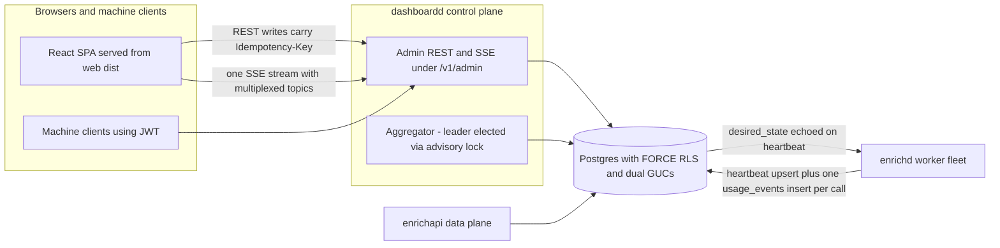

# 00 — Overview: Waterfall Enrichment Engine Management Dashboard

> **Status:** DRAFT · **Owner:** Principal Product Architect · **Last updated:** 2026-07-02 · **Gated by:** /architecture-review, /security-audit

> This document is the anchor for the `docs/waterfall-dashboard/` series and supersedes
> [`docs/17-Dashboard-Planning.md`](../17-Dashboard-Planning.md). It honors and extends doc 17's
> panel → backing-service rule: **no orphan UI** — every panel in every module binds to a real
> service, table, and endpoint enumerated in §2, and P11 carries a scripted no-orphan-UI check.
> The Glossary in [`docs/00-Project-Overview.md §7`](../00-Project-Overview.md) is mandatory and
> canonical; §6 below adds dashboard-specific terms in the same style. The single source of truth
> for all design decisions is the approved MASTER DESIGN SPEC; this document is its product-facing
> projection.

---

## 1 Vision

The Management Dashboard is the **control plane** for the Waterfall Enrichment Engine, built to
the AWS-Console / Datadog / Vercel quality bar. The engine itself is API-first and headless: it
accepts Enrichment Jobs, plans Waterfalls with the Adaptive Router, executes bounded Provider
calls, and records Provenance. The dashboard is where humans **manage the engine** — and
"manage" decomposes into five concrete verbs, each with a dedicated architectural mechanism:

1. **Observe** — live, rollup-first telemetry: every analytics read serves from pre-aggregated
   Rollups folded by a leader-elected aggregator, pushed to browsers as SSE deltas. No per-client
   polling; database load is independent of viewer count.
2. **Configure** — versioned, validated configuration: routing policies and Waterfall workflows
   move through draft → validate → publish → rollback as immutable `config_versions` with atomic
   pointer-flip activation and Config Epoch cache invalidation. Nothing is ever destroyed.
3. **Operate** — audited actions: every admin write carries an Idempotency Key, lands in the
   tamper-evident per-Tenant audit hash chain, and — for blast-radius verbs — passes a four-eyes
   Approval Request quorum with TOTP step-up before server-side exactly-once execution.
4. **Attribute** — every engine call is attributed to exactly one Provider Key via the Lease
   seam, making per-key spend, quota, health, and rotation triggers first-class facts rather
   than estimates.
5. **Secure** — one tenancy mechanism everywhere: FORCE row-level security with dual GUCs
   (`app.current_tenant`, `app.current_role`), a fixed three-role RBAC matrix with ABAC
   attributes, envelope-encrypted secrets with no reveal endpoint, and enumerated —
   never ambient — operator cross-tenant access.

The dashboard proposes nothing the engine's gates do not dispose: the governing invariant is
**"the model proposes, a deterministic gate disposes."** All five hard gates bind the dashboard
exactly as they bind the engine: **G1 tenant isolation**, **G2 idempotency**, **G3 bounded
execution**, **G4 cost ceiling**, **G5 provenance**. The dashboard never bypasses a gate — it
renders gate outcomes, and its own writes are themselves gated (RLS, idempotency ledger, bounded
queries, budget-vs-ceiling validation, audit chain).

Design scale targets — millions of enrichment requests/day, thousands of concurrent workers,
hundreds of Providers, 1,000+ Provider Keys per Provider — are engineering assumptions carried
as UNVERIFIED until load-tested (§8).

The deployable is `cmd/dashboardd`: a Go stdlib-only service exposing admin REST + SSE under
`/v1/admin/*` and serving the React SPA statically from `web/dist`. API-first discipline holds:
the SPA is just a consumer of the same contract machine clients use.

## 2 Scope — the 12 modules

### 2.1 Module definitions

**Module 1 — Global Overview.** The landing surface: a StatTile grid of platform vitals
(request rate, success rate by error class, queue depth and oldest age, worker fleet state,
credit burn, firing alerts) computed **once** per 2-second tick by the advisory-lock-elected
aggregator and fanned out as SSE deltas — snapshot via `GET /v1/admin/overview`, deltas on the
`overview` topic. Every tile deep-links into its owning module; the tile ↔ endpoint map is
documented in doc 09 so no tile is an orphan.

**Module 2 — Provider Management.** CRUD and lifecycle for the Provider catalog: identity and
presentation fields, the integration descriptor (auth scheme, base URL, timeouts, retry policy,
rate and concurrency limits, breaker thresholds), declared capabilities per Field with cost and
expected Confidence, and lifecycle actions (enable/disable/pause/maintenance/test/benchmark/
archive/delete). It keeps ADR-0009's inclusion trichotomy (ACTIVE-CANDIDATE / DEPRIORITIZED /
EXCLUDED) strictly distinct from runtime Op State, and exposes compare, rankings, and coverage
views keyed by the canonical Field vocabulary. Effective availability is computed in exactly one
Go function and returned by the API — never derived client-side.

**Module 3 — API Key Management.** Provider Keys at 1,000+-per-Provider scale: metadata CRUD
over a virtualized server-paginated grid, envelope-encrypted secret storage (write-only —
no reveal endpoint exists anywhere in the API surface), Key Pool CRUD and membership, bulk
import from csv/xlsx/json/paste as audited 202 async jobs with per-row results and permanent
batch provenance, and filter-scoped bulk operations that ship the filter predicate, not an ID
list. Identification is label + last4 + keyed fingerprint prefix.

**Module 4 — Key Rotation Engine.** The runtime brain for key selection and lifecycle: twelve
pool strategies (round_robin, least_used, weighted, credit_based, region_based, lowest_latency,
highest_success, ai_routing, random, priority, failover, overflow) executing O(1) on in-memory
PoolState rebuilt on Config Epoch change; the KM-3 key state machine driven exclusively by the
8-class error taxonomy; quota safety via batched Key Budget leases; and zero-downtime rotation
with an explicit overlap window (overlap 0 = compromise mode). Integrates with the engine
through `rotation.LeaseResolver`, which `provider.AuthInjector` feature-detects — adapters never
hold Provider Keys. Includes a selection-state debug endpoint and a simulate endpoint.

**Module 5 — Provider Health Center.** Jittered, bounded-concurrency scheduled health checks per
Provider and per key; a 90-day status-page-style uptime bar plus a 48-hour hourly heatmap;
uptime, P95, and P99 computed at read time from histogram-bucket Rollups; auto re-enable probes
that recover exhausted keys; and a regional health view. Health outcomes feed the providers list
(dominant failure class badges) and the alert vocabulary.

**Module 6 — Request Routing Center.** Authoring and lifecycle for `routing_policy` config
versions: Provider priority overrides with tri-state inherit/off/on semantics, waterfall order,
parallel groups (bounded cheap prefix per ADR-0007), retry and failover order, Confidence and
cost thresholds, and scope selectors (tenant, product, country) resolved most-specific-wins.
Publish is approval-gated, atomic, and epoch-bumped; dry-run executes `router.Planner` against
the draft with **zero egress** and shows the resolved effective value with its source scope.

**Module 7 — Waterfall Configuration.** Authoring and lifecycle for `waterfall_workflow`
payloads: trigger, entry Provider, parallel and sequential Provider stages, retry logic,
timeout, Confidence threshold, max cost credits, max Providers, fallback Provider, and stop
conditions (target-met | ceiling | exhausted | timeout). Validators reject any payload that
attempts to override **G3 bounded execution** or **G4 cost ceiling**. Shares one lifecycle, one
publish path, and one audit story with Module 6 via the common `configver` engine; the visual
builder is a stepped canvas with a node inspector and an integrated dry-run panel.

**Module 8 — Queue Management.** An engine-agnostic read model over the transactional outbox:
per-state segmented counts (each clickable into a filtered job list), oldest-age as the lead
backpressure signal, paired enqueue/dequeue rates, rich dead-letter inspection (payload, last
error, attempts) before replay, single-job redrive delegating to `pgoutbox.Redrive`, and
filter-scoped bulk replay as a 202 job. Because QS-TMP-1 (Temporal vs saga) remains open, the
panels bind to a closed queue-state vocabulary behind a store interface, not to pgoutbox
specifics.

**Module 9 — Worker Management.** Registry of heartbeat-reporting workers with Desired State vs
observed status rendered side by side and a visible convergence indicator. Actions — restart,
drain, pause, resume, rolling restart with max-unavailable — are audited writes of Desired State
that workers converge to via their 10-second heartbeat; `lost` is derived server-side after
three missed intervals. Drain is distinct from stop: drain finishes in-flight Enrichment Jobs
(which hold leased keys and reserved credits) before exit. Scale is recorded **intent** —
actuation of replicas is deploy-tool territory (§3).

**Module 10 — Cost Analytics.** One canonical group-by/filter query model over `cost_rollup_1d`
(dimensions: provider, key, tenant, workflow, country) with click-to-drill-down; unit economics
as first-class metrics (credits per call, credits per successful result, cost per filled Field,
ROI); forecast with an explicit indicative ~80% band, suppressed below 14 days of history;
budgets with stepped percent alert points — budgets **alert**, only the engine's **G4 cost
ceiling** enforces; anomaly-lite flagging with top-3 contributors; and WYSIWYG NDJSON export
reusing the exact on-screen query.

**Module 11 — Security.** Users and the fixed three-role RBAC matrix with ABAC attributes;
cookie + CSRF sessions with pbkdf2 login, TOTP MFA, recovery codes, and step-up at dangerous
decisions (ADR-0018); IP allowlists; the per-Tenant SHA-256 hash-chained audit log with a
verify endpoint and nightly walker; the API access log; and the Approval Request engine —
enumerated gated action kinds, N-of-M distinct-approver quorum with hard four-eyes, expiry,
and server-side exactly-once execution keyed by the request id.

**Module 12 — Monitoring & Alerting.** Alert rules as flat typed rows over a **closed** metric
vocabulary (no query language): metric, scope, operator, threshold, window, severity, cooldown.
Edge-triggered firing → resolved episodes with N-of-M breach confirmation, resolve hysteresis,
database-enforced dedupe, and ack; reusable notification channels (email, Slack, Teams, Discord,
webhook) with envelope-encrypted configuration, mandatory test-send through the real delivery
path, and SSRF-guarded egress; maintenance-state suppression; and dead-man's-switch
self-monitoring where the evaluator and aggregator watch each other.

### 2.2 Module → backing service / table / endpoint-group map

Extends doc 17 §2. Table ownership follows the one-owner-per-table registry (doc 03); "reads"
marks tables owned elsewhere. All endpoints live under `/v1/admin` with cursor pagination
(`?limit=&cursor=`, cap 200), Idempotency-Key on writes, and the uniform error body
`{"error":{"code","message"}}`.

| # | Module | Backing service | Tables (own · read) | Endpoint group | Supersedes doc 17 panel group |
|---|--------|-----------------|---------------------|----------------|-------------------------------|
| 1 | Global Overview | `internal/dash/overview` + `internal/dash/realtime` | read: all Rollups, `workers`, `alert_events` | `GET /v1/admin/overview`, `/overview/tiles/{tile}`, `/streams?topics=`, `/search`, `/meta/enums` | new — cross-module landing surface |
| 2 | Provider Management | `internal/dash/providers` | own: `providers` | `/v1/admin/providers*` incl. actions, `/providers/compare`, `/providers/rankings`, `/providers/coverage` | Providers: management, benchmarking, rankings, coverage |
| 3 | API Key Management | `internal/dash/keys` + `internal/dash/secrets` | own: `provider_keys`, `key_pools`, `key_pool_members`, `secret_envelopes`, `key_import_batches` | `/v1/admin/providers/{id}/keys`, `/keys*`, `/keys/bulk`, `/key-pools*`, `/key-imports/{job_id}`, `/bulk-jobs/{id}` | Keys & credits: API keys, credits |
| 4 | Key Rotation Engine | `internal/dash/rotation` | own: `key_budgets` · read: `key_pools`, `provider_keys` | `/v1/admin/rotation/*`, `/key-pools/{id}/selection-state`, `/key-pools/{id}/simulate`, `/key-pools/{id}/strategy` | Keys & credits: quota/limit monitors, auto disable/enable status |
| 5 | Provider Health Center | `internal/dash/health` | own: `provider_health_checks` · read: `provider_stats_*` | `/v1/admin/health/*` | Providers: provider health |
| 6 | Request Routing Center | `internal/dash/configver` + `internal/dash/routing` | own: `config_versions`, `config_active`, `config_epochs` (kind `routing_policy`) | `/v1/admin/routing` versions/validate/publish/dry-run/rollback, `/config/epochs` | Providers: provider simulator (dry-run) |
| 7 | Waterfall Configuration | `internal/dash/configver` + `internal/dash/workflows` | own: `workflow_index`; shares `config_versions`, `config_active` (kind `waterfall_workflow`) | `/v1/admin/workflows` versions/validate/publish/dry-run/rollback, `/workflows` index | Admin/governance: config-as-data |
| 8 | Queue Management | `internal/dash/queues` | own: `queue_defs`, `queue_stats_1m` · read: `job_outbox` (writes only via pgoutbox redrive APIs) | `/v1/admin/queues*`, `/dead-letters*`, `/jobs/{id}` | Jobs & queues: queues, retry/dead/running/scheduled jobs, job history |
| 9 | Worker Management | `internal/dash/workers` | own: `workers`, `worker_heartbeats`, `worker_stats_5m` | `/v1/admin/workers*`, `/workers/scale`, `/workers/rolling-restart` | Jobs & queues: workers |
| 10 | Cost Analytics | `internal/dash/cost` | own: `budgets` · read: `cost_rollup_1d`, `tenant_usage_*`, `key_usage_*` | `/v1/admin/cost/*`, `/budgets`, `/cost/export` | Billing & cost: cost analytics, customer usage, usage limits |
| 11 | Security | `internal/dash/security` + `audit` + `approvals` + `rbac` | own: `users`, `sessions`, `mfa_recovery_codes`, `ip_allowlists`, `audit_log`, `audit_chain_heads`, `api_access_log`, `approval_policies`, `approval_requests`, `approval_decisions` | `/v1/admin/auth/*`, `/users*`, `/roles`, `/ip-allowlists`, `/audit-log*`, `/access-log`, `/approvals*`, `/change-history/{kind}/{id}` | Admin/governance: RBAC, tenant management · Observability: audit logs |
| 12 | Monitoring & Alerting | `internal/dash/alerts` | own: `alert_channels`, `alert_rules`, `alert_events` | `/v1/admin/alerts/*` | Observability: alerts, notifications, performance metrics |

**Deltas from doc 17.** (1) Doc 17's backing column named ClickHouse, Kafka/Temporal, and
Prometheus/Grafana/ELK; per locked decision 3 (§5) those are design-time targets behind Go
interfaces — every backing above is the Postgres/stdlib implementation shipping now. (2) Doc
17's "export center" is realized as the WYSIWYG NDJSON cost export plus per-job bulk results;
"webhook logs" as alert-channel test/delivery results. (3) Doc 17's billing/subscription-plan
panels and feature flags are out of scope for this plan (§3): Tenant Account billing remains
with the platform billing system, and no module requires feature flags. (4) "Maintenance mode"
is realized per Provider as the `maintenance` Op State, not as a global switch.

## 3 Non-goals

| # | Non-goal | Rationale / pointer |
|---|----------|---------------------|
| 1 | **Not the enrichment API itself.** The dashboard neither accepts nor serves Enrichment Jobs; `POST/GET /v1/enrichments`, `/v1/records/{subjectID}`, and data-plane dead-letter endpoints stay with `enrichapi`. The dashboard is a separate deployable consuming shared Postgres state under the same gates. | MASTER SPEC §1; ADR-0010 modulith/data-plane split |
| 2 | **No scraping, ever.** No browser automation, headless browsers, or DOM scraping enters through any dashboard feature (Provider test, benchmark, health checks are API calls through the SSRF-guarded egress only). | ADR-0002 |
| 3 | **No GraphQL.** The contract is REST + OpenAPI with a parity test; screen-shaped needs are met by purpose-built aggregate endpoints (`/overview`, `/providers/compare`, `/cost/summary`), which also keep RLS query plans predictable. | ADR-0012 |
| 4 | **Not a BI tool.** No free-form query language, ad-hoc faceting, or arbitrary-dimension pivots. Analytics reads come from fixed-dimension Rollups behind closed vocabularies; raw `usage_events` retention is 48h by design. Deep offline analysis is future ClickHouse-adapter territory. | doc 01 §Cross-cutting theme 2 |
| 5 | **No human-in-the-loop enrichment.** The dashboard manages the engine; it never becomes a workbench for manually editing, approving, or sourcing enrichment Field values. Approval Requests gate **admin actions**, never enrichment results. | docs/00 §2 hard constraint |
| 6 | **No infrastructure actuation.** Worker scale and rolling restart record **Desired State intent** in Postgres; spawning or destroying replicas is deploy-tool territory. The UI states this honestly and shows non-convergence age rather than pretending the dashboard launches processes. | doc 06 honesty note |
| 7 | **No Tenant Account billing or subscription management.** Cost Analytics attributes spend and enforces nothing (budgets alert; **G4 cost ceiling** enforces); invoicing, plans, and payment flows are outside the 12 modules. | §2.2 deltas |

## 4 Audiences & RBAC recap

Three RBAC roles, fixed matrix, all enforcement server-side (the SPA mirrors the matrix for
affordance only — the server is the authority). Detail in doc 05.

| Audience | RBAC role | Scope | Typical use |
|----------|-----------|-------|-------------|
| Platform operator (us) | `operator` | Cross-tenant platform operations: Provider catalog, platform Key Pools, workers, queues, platform config | Run the engine: rotate keys, pause Providers, drain workers, watch cost |
| Tenant admin | `tenant_admin` | Own Tenant only (RLS-scoped): users, budgets, alert rules, BYO Key Pools, routing/workflow config for their scope | Govern their Tenant: approve gated changes, manage users, tune Waterfalls |
| Tenant user | `tenant_user` | Own Tenant, read-mostly | Watch usage, cost, and job outcomes |

**ABAC attributes:** `tenant_id`, `region`, `plan_tier` — carried on the Principal and checked
alongside the role matrix (e.g. region-scoped operator duties, plan-tier feature gating).

**Enforcement mechanics (ADR-0020).** The verified Principal binds two GUCs per transaction —
`app.current_tenant` and `app.current_role` — read only from the session/JWT role scope claim,
never from request bodies. Every table carries FORCE row-level security; operator cross-tenant
SELECT exists only as **explicit, enumerated policies** on a short list of tables (cost and
usage Rollups, audit log, alert events, config reads, users, tenants), and every handler serving
a cross-tenant operator view writes an audit_log row (**G1 tenant isolation**). Cross-tenant
existence is never disclosed — foreign IDs return 404. There is no blanket operator policy on
sessions, secret envelopes, MFA recovery codes, or the G2/G4/G5 ledgers.

## 5 Locked decisions summary

| # | Decision | Summary | Recorded in |
|---|----------|---------|-------------|
| 1 | Frontend stack | React + TypeScript + Vite SPA in `web/`; enumerated dependency list (react, react-dom, react-router, tanstack query/table/virtual, recharts, dnd-kit, zustand, qrcode + dev tooling); hand-rolled design system on CSS custom-property tokens; no CSS framework. This is the **only** exception to the zero-dependency rule and it stops at the `web/` boundary. | **ADR-0016** |
| 2 | Backend | Go stdlib-only `cmd/dashboardd` reusing in-repo primitives: `internal/pg`, `internal/pgstore`, `internal/pgmigrate`, `internal/metrics`, `internal/auth`, `internal/tenant`, `internal/provider`, `internal/pgoutbox`, `internal/job`. | repo core value; ADR-0010, ADR-0011 |
| 3 | Postgres-core depth | All 12 modules built fully on the Postgres/stdlib core. Redis, ClickHouse, Kafka, and Temporal remain design-time targets behind documented Go interfaces (ADR-0013/0014 stay cost-gated; QS-TMP-1 stays open — queue/worker panels are engine-agnostic). | MASTER SPEC §1 |
| 4 | Real-time transport | SSE (stdlib `http.Flusher`) with server-side aggregation and pushed deltas; **one** EventSource per tab multiplexing topics via `GET /v1/admin/streams?topics=`; Last-Event-ID replay from per-topic ring buffers; single-poller aggregation per instance; LISTEN/NOTIFY extension timeboxed. No per-client polling. | **ADR-0019** |
| 5 | Secrets | Envelope encryption: AES-256-GCM DEK per secret wrapped by an identified master key from env (keyring for rotation); pluggable `secrets.Backend` interface with Vault/ASM adapters designed but deferred; the database stores ciphertext + metadata only; no reveal endpoint exists. Resolves open item KM-1. | **ADR-0017** |
| 6 | Dashboard sessions | Cookie + CSRF sessions for browsers (pbkdf2 login, TOTP MFA, step-up at decisions, idle + absolute expiry); JWT for machine clients; both resolve to the same Principal. | **ADR-0018** |
| 7 | Tenancy taxonomy | Sentinel `platform` Tenant + `app.current_role` GUC; three table classes (platform / tenant-config / telemetry) under **one** RLS mechanism; enumerated operator read policies only. | **ADR-0020** |
| 8 | Placement & API shape | New deployable `cmd/dashboardd` + `internal/dash` feature packages; admin REST under `/v1/admin/*`; snake_case JSON; uniform error body `{"error":{"code","message"}}`; Idempotency-Key required on all writes (reuse with a different body → 409); cursor pagination with limit cap 200; 202 envelopes for bulk (`{job_id}`) and approval-gated (`{approval_request_id}`) operations; SPA served from `web/dist`. | MASTER SPEC §1, §8; ADR-0012 conventions |

## 6 Glossary additions

Extends [`docs/00-Project-Overview.md §7`](../00-Project-Overview.md) — same rules: these names
are canonical; update terms only here for dashboard scope. Existing terms (Tenant, Provider,
Provider Key, Key Pool, Waterfall, Enrichment Job, Field, Confidence, Cost Ceiling, Idempotency
Key, …) are used verbatim throughout this series.

| Term | Definition | Do **not** call it |
|------|------------|--------------------|
| **Envelope** | A sealed secret record — AES-256-GCM ciphertext plus its per-secret wrapped DEK, nonce, AAD fingerprint, and master-key id — stored only in `secret_envelopes` and referenced everywhere else by id. | "encrypted blob"; "secret" (that is the plaintext) |
| **Lease** | A single-call checkout of a Provider Key from a Key Pool, carrying the key id and secret plus a `Done` callback that attributes the call's outcome to that key. | "checkout", "session" |
| **Config Epoch** | A per-Tenant, per-config-kind counter bumped atomically on every publish; readers cache active configuration keyed by epoch and rebuild on change. | "generation"; "revision" (that is a config version) |
| **Desired State** | The operator-declared target lifecycle state of a worker (running / draining / paused / stopped), written by the dashboard and converged to by the worker via its heartbeat — distinct from observed status. | "command", "action" |
| **Rollup** | An additive, pre-aggregated time-bucket table (1m/1h/1d) folded from raw events by the aggregator; all analytics reads serve from Rollups, never from raw streams. | "materialized view", "cache" |
| **Approval Request** | The pending record of a gated action's fully resolved payload, awaiting an N-of-M quorum of distinct approvers before server-side exactly-once execution keyed by the request id. | "ticket"; "change request" loosely |
| **Chain Head** | The per-Tenant `audit_chain_heads` row holding the last sequence number and hash of the tamper-evident audit chain; appends serialize on its row lock. | "checkpoint" |
| **Key Budget** | The per-Provider-Key daily/monthly counters of leased vs used quota, advanced by batched atomic lease updates and reconciled nightly from `usage_events` ground truth. | "quota" (that is the Provider-side limit) |
| **Pool Selector** | The string `provider_id:name` identifying a Key Pool; carried by `AuthDescriptor.KeyPoolSelector` and resolved to a concrete Provider Key by `KeyResolver` or `LeaseResolver`. | "pool id" (that is the uuid) |
| **Op State vs Inclusion Status** | Two distinct Provider axes, never conflated: **Op State** is the runtime toggle (enabled / disabled / paused / maintenance); **Inclusion Status** is the ADR-0009 catalog lifecycle (ACTIVE-CANDIDATE / DEPRIORITIZED / EXCLUDED). Effective availability is their computed conjunction — computed in one place, returned by the API, never stored. | a single merged "status" field |

## 7 Document map

The `docs/waterfall-dashboard/` series comprises 15 documents. Each carries this header/footer
discipline, inline Mermaid diagrams, glossary-verbatim terms, and UNVERIFIED tags on unmeasured
claims.

| Doc | Title | One-line scope |
|-----|-------|----------------|
| 00 | Overview | This document — vision, scope, non-goals, RBAC recap, locked decisions, glossary additions, UNVERIFIED register. |
| 01 | Research findings | Phase-1 research adapted: repo capability inventory, per-domain adopted/rejected pattern tables, cross-cutting themes, verification register. |
| 02 | Architecture | C4 container view, the seven architecture principles with concrete mechanisms, hard-gate compliance table, sequence and deployment diagrams, cache inventory. |
| 03 | Database schema | Full DDL for migrations 0004–0009, table-class taxonomy and per-table RLS policy registry, partition/retention matrix, index rationale, one-owner registry, expand→migrate→contract playbook. |
| 04 | API contracts | Conventions, complete endpoint tables with request/response examples and per-endpoint error codes, SSE topics and event schema, OpenAPI pointer, pagination/idempotency/bulk/approval envelopes. |
| 05 | RBAC & security | Role×action matrix, ABAC, session model (ADR-0018), MFA/step-up, envelope secrets (ADR-0017), audit hash-chain spec, approval quorum spec, threat-model deltas, tenant-isolation proof obligations. |
| 06 | Queue & worker design | Queue topology and read model, replay idempotency (G2 proof), DLQ semantics, worker lifecycle state machine, drain vs stop, scale/rolling-restart semantics with the actuation honesty note. |
| 07 | Routing & Waterfall config | Payload JSON Schemas, validation rule catalog, config lifecycle, scope precedence, dry-run/simulator, rotation strategy catalog, KM-3 key state machine. |
| 08 | UI architecture | SPA structure, state management, SSE client, design system, build/deploy, accessibility, ADR-0016 rationale, performance budgets. |
| 09 | UI wireframes | Per-module wireframes and critical user flows, tile↔endpoint map, key-grid column spec, routing-editor interaction spec, empty/error states. |
| 10 | Observability | Metric catalog with cardinality bounds, rollup pipeline, SSE aggregator design, closed alert-metric vocabulary, self-monitoring, log fields, health-check semantics. |
| 11 | Deployment & scaling | dashboardd topology, HA/DR targets, regional-cell fit (ADR-0015), env/config reference, TLS and master-key handling, PG sizing, capacity model and load-test plan, degradation modes. |
| 12 | Implementation phases | P0–P12 with scope, deliverables, acceptance criteria, dependencies; deviation protocol; Self-Verification Record. |
| 13 | Testing strategy | Unit, integration (RLS cross-tenant zero-rows on every new table — release blocker), contract parity, E2E, load, chaos, and security testing. |
| 14 | Runbooks | Fourteen operational runbooks (key exhaustion, key compromise, provider outage/sunset, queue backlog, DLQ drain, audit-chain mismatch, master-key rotation, partition maintenance failure, SSE degradation, approval deadlock, lost workers, budget overrun, restore-and-verify), each symptoms → diagnosis → actions → verification → prevention. |

New ADRs written alongside this series: **ADR-0016** (frontend dependency exception),
**ADR-0017** (envelope-encryption secrets backend), **ADR-0018** (dashboard session model),
**ADR-0019** (Postgres-backed realtime, SSE + poller), **ADR-0020** (platform/tenant table
taxonomy). Existing ADRs 0001–0015 remain in force and are cited by number throughout.

## 8 UNVERIFIED register

Per repo discipline, every numeric scale or performance claim below is a **design target**, not
a measurement. Each carries the UNVERIFIED tag in every downstream doc until its named
verification gate passes.

| ID | Claim | Design target | Tag | Verification gate |
|----|-------|---------------|-----|-------------------|
| U-1 | Enrichment request volume | Millions of enrichment requests/day | UNVERIFIED | P12 load tests (doc 13 load suite) |
| U-2 | Worker fleet size | Thousands of concurrent workers | UNVERIFIED | P12 load tests |
| U-3 | Provider Key inventory | Hundreds of Providers; 1,000+ Provider Keys per Provider | UNVERIFIED | P12 (the P1 gate exercises a 1k-key import only) |
| U-4 | SSE fan-out | 200-client soak with ≤2s delta latency and Last-Event-ID replay | UNVERIFIED | P7 gate; extended soak (500 clients) in the doc 13 load suite at P12 |
| U-5 | Key selection throughput | 10k selections/s under `-race` with no over-lease at 50 goroutines | UNVERIFIED | P2 gate |
| U-6 | Lease convergence | Cross-instance key-state convergence ≤1s; crash loses ≤1 lease batch (≤64 calls) | UNVERIFIED | P2 gate + P12 chaos tests |

## Open items

| ID | Item | Status | Owner |
|----|------|--------|-------|
| — | none — all resolved by MASTER SPEC | — | — |
