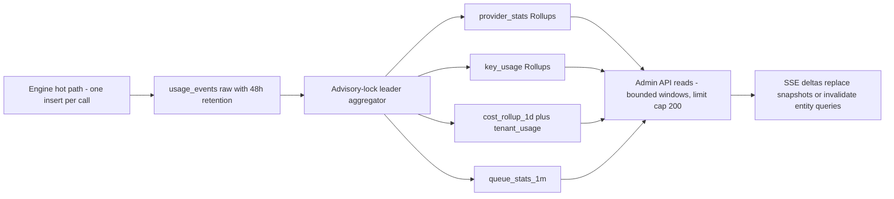

# 01 — Research Findings: Enterprise Control-Plane Patterns

> **Status:** ACCEPTED · **Owner:** Solutions Architect · **Last updated:** 2026-07-06 · **Gated by:** /architecture-review, /security-audit

> Phase-1 research, adapted into the repo's documentation format. It informs every design
> decision in docs 02–14; where a research recommendation and the MASTER DESIGN SPEC differ,
> the MASTER SPEC governs and the delta is recorded in the Open items table at the end.

---

## 1 How to read this document

This document synthesizes Phase-1 research from seven domain investigations into how
best-in-class platforms (AWS, Stripe, Datadog, HashiCorp, Temporal, Segment, Linear,
LaunchDarkly, and roughly forty others) solve the problems our Management Dashboard must solve:
Provider catalogs, secrets at scale, queue/worker operations, alerting, cost analytics, approval
workflows, and real-time console UX. Each domain section lists the systems studied, an
**adopted patterns** table (pattern → exemplar → why → concrete mapping onto our modules,
tables, and endpoints), a **rejected patterns** table (what we deliberately do not build, and
why), and domain-specific risks. Near-identical patterns found independently by multiple
researchers are merged once with both sources noted and cross-referenced. "Cross-cutting
themes" (§10) collects patterns that surfaced in three or more domains — these are the
strongest signals and are treated as architectural doctrine in downstream docs. The
"Verification register" (§11) separates claims verified against primary sources during the
research session from directional general knowledge; anything tagged **UNVERIFIED** must keep
that tag wherever it is cited downstream. All references to our own schema (`providers`,
`secret_envelopes`, `job_outbox`, `alert_rules`, `config_versions`, …), endpoints, and gates
were read directly from the repo migrations and the MASTER DESIGN SPEC. The five hard gates are
cited by their exact labels — **G1 tenant isolation**, **G2 idempotency**, **G3 bounded
execution**, **G4 cost ceiling**, **G5 provenance** — under the governing invariant "the model
proposes, a deterministic gate disposes."

## 2 Repo capability inventory

The verified in-repo seams the dashboard design builds on. Each was read from source this
session; the design treats these as load-bearing contracts, not aspirations.

| Seam | Location | What it provides |
|------|----------|------------------|
| `provider.Adapter` | `internal/provider/provider.go` | `Name() string; Capabilities() []Capability; Fetch(ctx, Request) (Result, error)` — the seam every Provider integration implements; `provider.HTTPAdapter` (`internal/provider/httpadapter.go`) is the generic, data-parameterized runtime behind config-first onboarding — the `providers` row owns the tunables while each Provider's adapter file supplies the `Build`/`Decode` closures (doc 02 §2.2, ARCH-4). |
| `KeyResolver` / `AuthInjector` | `internal/provider/provider.go`, `internal/provider/egress.go` | `KeyResolver.Resolve(poolSelector)` maps a Pool Selector to a secret; `AuthInjector` — an `http.RoundTripper` — injects it at egress per `AuthDescriptor{Scheme, HeaderName, QueryParam, KeyPoolSelector}`, so adapters never hold Provider Keys. |
| `provider.Call` + `Breaker` + SSRF guard | `internal/provider/call.go`, `internal/provider/breaker.go`, `internal/provider/ssrf.go` | The **G3 bounded execution** wrapper — timeout, bounded attempts, backoff, retry only for retryable classes — plus the three-state breaker and resolve-then-dial SSRF-guarded egress. |
| pgstore RLS tx | `internal/pgstore/store.go` | Per-transaction `set_config('app.current_tenant', …)` bound from `tenant.FromContext` (fail-closed); Postgres implementations of the **G2** idempotency ledger, **G4** cost ledger, and **G5** field versions. |
| pgoutbox DLQ / redrive | `internal/pgoutbox/store.go`, `internal/pgoutbox/relay.go` | Transactional outbox: FOR UPDATE SKIP LOCKED claim loop, visibility timeout, max-attempts parks `dead=true` with `last_error`; `DeadLetters(ctx, limit)` and `Redrive(ctx, jobID)` APIs the queues module delegates to. |
| `router.Planner` / `Scorer` | `internal/router/plan.go` | Reservation-value cascade planner (ADR-0007) with a pluggable `Scorer` seam — the zero-egress dry-run engine for config validation. |
| bandit | `internal/bandit/bandit.go` | Beta-Thompson sampling posteriors (ADR-0008) — reused as the `ai_routing` Key Pool strategy and the adaptive Provider-ordering refinement. |
| metrics registry | `internal/metrics/metrics.go` | Hand-rolled Prometheus text-format registry with bounded label cardinality and a no-PII rule; the dashboard's self-monitoring surface. |

Supporting primitives also reused as-is: `internal/pg` (hand-rolled PG wire client,
SCRAM-SHA-256, TLS), `internal/pgmigrate`, `internal/auth` (JWT HS256/RS256), `internal/tenant`
(Principal), and `internal/job` (dispatcher/queue/submitter seams).

---

## 3 Domain 1 — Provider Catalogs & Marketplace-Style Configuration

*Scope: control-plane Provider management — modules 2, 3, 5, and the Provider-facing parts of
6/7/10.*

**Systems studied:** Segment destination catalog + Public API DestinationMetadata + Destination
Actions; Zapier app directory + platform versioning/migration/deprecation; Merge.dev unified-API
connectors (Linked Accounts, capability coverage, issue surfacing); Clay waterfall enrichment
orchestrator (provider stacks, BYO keys vs managed credits); BetterContact waterfall enrichment
(pay-per-verified-result); Workato connector SDK / Tray.io (connector vs connection separation);
Stripe PaymentMethodConfiguration + capabilities.

### 3.1 Adopted patterns

| Pattern | Exemplar | Why | How applied to our design |
|---|---|---|---|
| **Catalog metadata vs instance configuration separation** — global connector definition distinct from per-workspace instance (Segment: DestinationMetadata vs Destination instance; Workato/Tray: connector vs connection) | Segment Public API (verified); Workato/Tray | Prevents Tenant concerns leaking into the shared catalog; clean RLS story (platform-owned catalog rows vs Tenant choices elsewhere). Matches our Class P vs Class T table taxonomy exactly. | `providers` (0005, Class P, sentinel-tenant RLS) is the catalog: identity/presentation fields + integration descriptor. Tenant-facing read = enumerated `visibility='tenant_readable'` SELECT projection (catalog fields only, never breaker/limit internals). Tenant enablement/priority overrides live in `config_versions` routing_policy payloads (Class T); Tenant BYO pools in `key_pools.owner_tenant_id`. The `/providers/:id` page splits tabs accordingly: config (operator-writable catalog+ops) vs keys/health/stats (instance/runtime). |
| **Declarative auth + settings schema per Provider, rendered by a generic form engine** — settings as `{name, type, required, label, description, defaultValue}` data; platform renders forms and injects credentials | Segment Public API (verified `options[]` shape); Zapier platform | Makes "change a Provider's config without a deploy" real (onboarding itself still ships one adapter file — ARCH-4); maps 1:1 onto the repo's existing `provider.AuthDescriptor{Scheme, HeaderName, QueryParam, KeyPoolSelector}` (schemes api-key-header/api-key-query/bearer/basic/oauth2-cc) — the seam already exists. | `providers` columns auth_scheme/auth_header/auth_query_param ARE the serialized AuthDescriptor; `internal/dash/providers` hydrates it and `provider.AuthInjector` (RoundTripper) injects the leased secret at egress so adapters never see keys. Frontend: one generic ProviderConfigForm driven by a field descriptor (closed vocab via GET /v1/admin/meta/enums) — no per-Provider React pages at hundreds-of-Providers scale. Provider-specific extras go in `attrs jsonb` behind typed descriptor entries. |
| **Config-first Provider onboarding through a shared generic runtime** — destination behavior as data executed by a common engine | Segment Destination Actions; Workato connector SDK | A new Provider = one adapter file (`Build`/`Decode` closures for HTTP vendors, full `Adapter` for bespoke protocols) + one `providers` row — zero core-engine changes; provider CONFIG changes propagate by catalog epoch without deploy or restart (doc 02 §2.2, ARCH-4 — never "zero code change"). `provider.HTTPAdapter` is the shared generic runtime; the adapter file supplies request/response shape, the catalog row supplies every tunable. | POST /v1/admin/providers inserts a row whose base_url, api_version, auth_*, timeout_ms, retry_policy jsonb, rate_limit_rpm, breaker_threshold/cooldown parameterize the Provider's `HTTPAdapter` (rebuilt at Config-Epoch refresh around the adapter file's `Build`/`Decode` closures); `capabilities jsonb [{field, cost_credits, expected_confidence}]` implements Adapter.Capabilities() and feeds router.Planner. POST providers/{id}/test reuses provider.Call with a leased key to smoke the descriptor before op_state=enabled (Segment/Zapier both gate publish on a connection test). Adapter files self-register via `init()` into the package-level registry in `internal/dash/providers` keyed by Provider id — no shared registry file is edited (doc 02 §2.2); bespoke protocols implement the full `Adapter` interface; the row still owns all tunables (accepted stdlib-only tradeoff, cross-ref ARCH-4). |
| **Two-axis status: catalog lifecycle distinct from runtime Op State; availability is a computed conjunction, never stored** | Segment (verified status field); Stripe PaymentMethodConfiguration (verified: `available` computed vs `display_preference`) | Confirms ADR-0009's trichotomy (ACTIVE-CANDIDATE/DEPRIORITIZED/EXCLUDED) vs op_state (enabled/disabled/paused/maintenance) is the industry-correct split; warns against persisting derived availability. | Keep both columns on `providers`; add DERIVED (never stored) `effective_available` = status='ACTIVE-CANDIDATE' AND op_state='enabled' AND breaker not open AND count(active provider_keys) above zero — computed in exactly one Go function shared by the providers list serialization, router dry-run, and the configver validator, so UI/validation/planner can never disagree. React list shows a Stripe-style dual badge: lifecycle chip + effective availability with a tooltip naming the failed conjunct. |
| **Layered defaults with tri-state override (inherit/off/on) and visible effective value** | Stripe PaymentMethodConfiguration parent/child (verified enum values none/off/on) | Our routing scope precedence (tenant, product, country most-specific-wins) has the same inheritance problem; a boolean cannot distinguish "no opinion" from "explicitly off," which corrupts precedence resolution. | In the routing_policy JSON Schema (doc 07), per-Provider overrides at each scope use enum inherit\|off\|on (+ optional priority int), not a nullable bool; configver validator rejects 'on' for EXCLUDED Providers; the resolver folds scopes most-specific-wins treating inherit as transparent. The dnd-kit routing editor and dry-run panel render both the set preference and the resolved effective value with provenance ("inherited from country=DE policy v12") — dry-run already runs router.Planner against the draft with zero egress. |
| **Health and delivery outcomes surfaced in the catalog list, broken down by error class** | Segment Event Delivery; Merge.dev per-Linked-Account issue surfacing; Datadog integration tiles (general knowledge) | Operators triage from the list view; grouping failures by error class makes it actionable (auth_failed → rotate keys; rate_limit → raise pool; provider_down → pause + failover). Our 8-class error taxonomy slots in exactly. | Providers list joins `provider_stats_1m/_1h` Rollups whose per-class failure columns (fail_auth, fail_rate_limit, fail_transient, fail_quota, fail_provider_down, …) mirror domain.ErrorClass; rows carry health_score, success EWMA, avg_latency_ms, dominant failure class badge. SSE topic `provider.health.changed` patches the react-query cache so the catalog is live without polling. Module 5's timeline heatmap + P95/P99 overlay is the drill-down (provider_health_checks + lat_hist buckets). |
| **Explicit deprecation/sunset lifecycle with enforced windows and proactive notification of affected configs** | Zapier Platform (verified: 3-week–1-year deprecation window, automated emails 14 days out, migrate-then-cutoff) | Provider sunsets are certain at hundreds-of-Providers scale; the failure mode is a Tenant's published Waterfall silently referencing a dead Provider. Zapier's discipline = window + notify-affected + block-new-usage. | `providers.sunset_at` (0005) drives: (1) configver validator — publishing a config referencing a Provider sunsetting within 30d → validation_report warning; past sunset_at → hard error; (2) nightly sweep over `workflow_index` + active configs emits alert_events ("config references sunsetting provider", doc-10 closed vocab) to affected Tenants' channels; (3) the provider-sunset runbook (doc 14) sequences pause → failover order update → archive. Archive stays non-destructive (archived_at, config history intact) — "deprecate, never yank silently." |
| **Cost-per-successful-result as the canonical Provider economics metric; per-Field cost/coverage drives Waterfall order** | Clay (cheapest-first per data point, credits consumed on hit); BetterContact (pay per verified find) — general knowledge, pricing mechanics UNVERIFIED. *Corroborated by Domain 5's unit-economics finding (CloudZero, Anthropic/OpenAI).* | This is our literal product domain: router.Planner's reservation-value cascade needs expected cost AND hit probability per Field per Provider; buyers evaluate Providers on cost-per-filled-Field, not cost-per-call. | `capabilities jsonb [{field, cost_credits, expected_confidence}]` is the planner input; measured reality comes from usage_events.outcome_class + fields_filled in tenant_usage Rollups. Cost analytics (GET cost/per-enrichment, cost/roi) reports cost-per-successful-result per Provider per Field and the gap between declared expected_confidence and measured hit rate. GET providers/rankings sorts by measured cost-per-hit within a Field — exactly what the Beta-Thompson bandit refines at runtime. |
| **BYO credentials vs platform-managed credentials as a first-class distinction** | Clay (BYO keys vs managed credits — general knowledge, UNVERIFIED specifics); Merge.dev Linked Accounts | Enterprise Tenants will demand their own ZoomInfo/Twilio contracts; ownership changes billing attribution, RLS visibility, and rotation responsibility — bolting it on later forks the key model. | Already structurally present: `key_pools.owner_tenant_id` / `provider_keys.owner_tenant_id` NULL = platform-managed, non-NULL = Tenant BYO, with the enumerated RLS SELECT policy `owner_tenant_id = app_current_tenant()`. Extended semantics: cost_rollup attributes BYO calls at zero platform credits; rotation triggers (auth_failed) route to the owning Tenant's alert_channels; keys tab and /key-pools group by ownership with tenant_admin CRUD limited to own pools (RBAC matrix row). Waterfall validator prefers Tenant BYO pool over platform pool when both exist (doc 07 rule). |
| **Capability-matrix comparison UX: Providers × Fields grid with declared support plus measured coverage** | Merge.dev supported-field matrices; Clay coverage rates (general knowledge); Segment (verified supportedMethods/supportedFeatures) | Choosing Waterfall order across hundreds of Providers requires side-by-side declared capability AND measured performance; prose descriptions don't scale. | GET providers/compare?ids= returns rows keyed by glossary Field/Attribute (work_email, mobile_phone, direct_dial…) with declared {cost_credits, expected_confidence} and measured {hit_rate, p95 from lat_hist, cost_per_hit} from Rollups; GET providers/coverage powers a Fields×Providers heat grid on /providers/compare (react-table, no new deps). POST providers/{id}/benchmark runs a fixed sample through provider.Call with a leased key (bounded by **G3** CallPolicy, spend recorded in cost ledgers), stored as a comparable snapshot — "try before you reorder the Waterfall." |

### 3.2 Rejected patterns

| Pattern | Exemplar | Why rejected |
|---|---|---|
| Dynamic plugin/connector runtime executing partner- or operator-supplied code | Zapier Platform, Workato SDK, Segment Actions | Go stdlib-only is a repo core value: no plugin .so loading (unsupported on our Windows dev target, operationally fragile anyway), no embedded interpreter without third-party deps; arbitrary connector code bypasses the deterministic gates (**G3 bounded execution**, SSRF-guarded egress). Our equivalent is the data-parameterized HTTPAdapter behind one code-reviewed in-repo adapter file per Provider (`Build`/`Decode` closures; full `Adapter` for novel protocols) shipped with a release — an accepted, documented tradeoff (doc 02 §2.2, ARCH-4), not a gap. |
| Separate public catalog service / CDN-published catalog artifact distinct from the operational store | Segment | Segment needs it for thousands of destinations on the public internet with partner self-serve; we have hundreds of Providers exposed only to authenticated Tenants. A second catalog store breaks one-owner-per-table, creates a sync problem, and abandons the single RLS mechanism (ADR-0020 sentinel tenant + tenant_readable projection) that already gives Tenants a safe read-only view from the same Postgres row. |
| Percentage-based traffic migration between config versions (e.g., move 15% of users, watch errors, complete) | Zapier Platform (verified) | Our publish is deliberately an atomic pointer swap (config_active UPDATE + epoch bump) with jobs pinning config_version_id at start; request-level version splitting needs per-request version-selection state, muddies **G2 idempotency** replay, and makes "which config produced this result?" probabilistic. Risk is already mitigated at the right layers: zero-egress dry-run before publish, one-click rollback, and the Beta-Thompson bandit doing gradual shifting between PROVIDERS, where gradualism actually belongs. *(Cross-ref: Domain 6 pointer-flip publish.)* |
| Marketplace partner self-service portal (vendors submit/publish integrations through a review pipeline) | Zapier developer platform, Segment partner portal | Wrong trust model: Providers are data vendors we call, not partners shipping code to us; onboarding is operator-performed and gated by the ADR-0009 internal compliance review (DEPRIORITIZED until reviewed). Submission workflows, partner logins, and review queues are a whole product with zero users in our topology — the approvals engine (0007) already covers the internal four-eyes gate. |
| Three-legged OAuth "connect" flow with browser consent and refresh-credential vaulting as primary auth | Zapier connections, Merge.dev magic-link flow | Our Provider population (Hunter, Prospeo, Twilio, ZoomInfo-class) authenticates with static API keys or oauth2 client-credentials — both covered by AuthDescriptor schemes and envelope-encrypted provider_keys. Three-legged adds redirect endpoints, state/PKCE handling, and refresh machinery (new attack surface absent from the doc 05 threat model) for zero current Providers. Revisit only if a must-have vendor mandates it; the scheme enum is the extension point. |
| Tenant-editable field-mapping UI per Provider | Merge.dev field mappings; Segment destination mappings editor | Normalization to the glossary Field/Attribute vocabulary is an adapter/engine concern with **G5 provenance** attached; Tenant remapping would make Confidence/Provenance semantics Tenant-relative and explode the configver validation surface (arbitrary mappings can't be validated against a closed vocabulary). v1 keeps mapping in Adapter code + capabilities metadata, platform-owned — "the model proposes, a deterministic gate disposes" favors a closed Field list. |

### 3.3 Risks

- **attrs-jsonb drift:** the declarative-settings pattern tempts stuffing routing-critical tunables into `attrs` where CHECK constraints and validators can't see them. Rule for doc 03: anything read by planner/breaker/rotation must be a typed column; attrs is presentation-only.
- **"Zero code" was retracted (doc 02 §2.2, ARCH-4)** — every Provider requires one adapter file (`Build`/`Decode` closures; full `Adapter` for multi-step lookups, odd pagination, HTML-ish responses). The promise is "config changes without deploy," never "config-only" — docs 00/01 must carry that phrasing or the first weird vendor breaks the story.
- **effective_available must live in exactly one service function**; if the SPA, list endpoint, and configver validator each re-derive it, they will disagree. Return the computed value from the API (as Stripe does); never compute it client-side.
- **Sunset sweep is a cross-tenant background job**: it reads Class T config_versions as operator with no request Principal — must use an enumerated operator SELECT policy and write audit_log rows per ADR-0020; easy to violate accidentally.
- **Tri-state inherit/off/on across 8 precedence levels is combinatorially error-prone**; needs table-driven resolver tests in configver (doc 13). The dry-run provenance panel is the only honest UI for it — shipping the editor without it would mislead operators.
- **Benchmark/test actions spend real vendor credits** through leased keys; without per-action cost caps (**G4 cost ceiling** applied to benchmark runs) an operator can burn a pool's daily budget from the compare page.

---

## 4 Domain 2 — Secrets Management & API-Key Lifecycle at Scale

*Scope: envelope encryption, rotation, leasing, attribution, bulk import, audit/break-glass.*

**Systems studied:** HashiCorp Vault (leases, dynamic secrets, KV-v2, transit,
unseal/break-glass); AWS Secrets Manager (staging labels, Lambda rotation); AWS KMS (envelope
encryption, key rotation, aliases); Google Cloud Secret Manager (versioned secrets, version
states); Doppler (references/sync, activity log); GitHub Actions secrets (write-only
sealed-box, log masking); Stripe API keys (restricted keys, roll-with-overlap, last4,
reveal-once); Cloudflare API credentials (scoped policies, TTL, verify endpoint); AWS IAM
access keys (two-active-keys rotation, last-used attribution).

### 4.1 Adopted patterns

| Pattern | Exemplar | Why | How applied to our design |
|---|---|---|---|
| **Envelope encryption: per-secret DEK wrapped by an identified KEK; lazy re-wrap on master-key rotation** — only the small wrapped DEK is re-encrypted, never bulk ciphertext | AWS KMS + Secrets Manager; GCP Secret Manager CMEK | 1,000+ keys/Provider × hundreds of Providers makes full re-encryption on KEK rotation an outage-class operation; DEK-per-secret bounds blast radius of any nonce/key misuse and makes rotation O(rows) tiny updates. | `internal/dash/secrets` Backend{Seal,Open,Rotate} over `secret_envelopes(id, kind, master_key_id, dek_wrapped, nonce, ciphertext, aad_fingerprint, rotated_from)` per migration 0005. Stdlib crypto/aes + GCM; DASH_MASTER_KEY becomes a small keyring (master_key_id → 32B key) so two KEKs can be live during rotation; Rotate(ctx,id) re-wraps only dek_wrapped and stamps rotated_from lineage; a background loop drains old-KEK Envelopes; AAD = envelope id ‖ kind binds ciphertext to its row (swap/splice detection). ADR-0017 + the master-key-rotation runbook (doc 14) document the drain procedure. |
| **Rotation with an explicit overlap window: old and new credentials simultaneously valid, tracked by staged states, never in-place mutation** | AWS Secrets Manager AWSCURRENT/AWSPENDING/AWSPREVIOUS (verified); Stripe key rolling (verified: up to 7-day overlap, or "Now" for compromise) | With thousands of workers holding leased keys mid-flight, instant cutover sprays AUTH failures into the error taxonomy and trips breakers; overlap makes rotation zero-downtime while keeping "expire now" for compromise. | KM-3 'rotating' state (spec §5): POST /v1/admin/keys/{id}/rotate creates a successor provider_keys row (new Envelope, rotated_from lineage, pools copied via key_pool_members); old key enters status='rotating' and keeps serving; a test call with the new key must succeed before pool weight shifts; after the overlap deadline (param, default 24h; 0 = compromise mode per runbook) old → archived. PoolState rebuild on Config-Epoch bump makes cutover visible ≤1s across instances (UNVERIFIED until P2). Never mutate a live key's ciphertext in place. |
| **Just-in-time leasing: workloads never hold long-lived secrets; per-unit-of-work checkout with recorded issue + disposition** | HashiCorp Vault leases (verified lifecycle) | Adapters must never hold keys (existing repo seam); every call must be attributable to a key_id for quota/state-machine triggers; revocation must propagate ~1s to thousands of workers without redistributing secrets. | `rotation.LeaseResolver{Lease(ctx, poolSelector) (Lease{KeyID, Secret, Done func(Outcome)}, error)}` per spec §5; provider.AuthInjector type-asserts LeaseResolver on its KeyResolver and injects at egress; Done(outcome) is the Lease return feeding key_usage Rollups and the trigger state machine. Simplification vs Vault: Lease scope = one call, no TTL/renew loop; quota safety via batched key_budgets counters (UPDATE … WHERE day_leased + $2 <= daily_limit RETURNING, batch ≤64). Vault's prefix-tree revoke maps to pool-/Provider-level disable flipping per-key atomic.Bool in PoolState. |
| **Applications store secret REFERENCES, never values** — consuming tables hold an opaque ID into a single sealed store readable only by the secrets backend | AWS SM ARNs; GCP resource names; Doppler references; Vault paths | One table to protect, audit, and back-restore-verify; makes "no plaintext column anywhere" a schema-level invariant, not a code-review hope; a Vault/ASM adapter can swap in later by changing what the ID resolves against. | Already pinned: `provider_keys.secret_envelope_id`, `users.mfa_totp_envelope_id`, `alert_channels.config_envelope_id` all FK into secret_envelopes; RLS on secret_envelopes has NO tenant policy ever (Class P, operator path only; only internal/dash/secrets touches it — one-owner-per-table). API responses and audit_log jsonb carry Envelope IDs + last4 only; the Secret wrapper type redacts String()/MarshalJSON so slog and panics cannot leak values. |
| **Write-only secrets: last4 + KEYED fingerprint for identification; no reveal endpoint ever; duplicate detection without decryption** | GitHub Actions secrets (write-only); Stripe (reveal-once, sk_live_…last4); Cloudflare (shown once) | At 1,000+ keys/Provider, ops must disambiguate keys and spot re-imports across batches — without a reveal endpoint, which would be our single worst exfiltration surface. | No GET-secret endpoint exists in the ~110-endpoint surface (stronger than Stripe: zero reveal, ever). `secret_last4` captured at Seal; fingerprint = HMAC-SHA256(fingerprint_pepper, plaintext) stored as aad_fingerprint — keyed, not bare SHA-256, so a leaked row cannot be brute-forced against low-entropy vendor keys (crypto/hmac). Import checks fingerprint uniqueness per Provider and reports "duplicate of key X" in key_import_batches.errors. Key grid columns (doc 09): label · ****last4 · fp:8-hex-prefix · status badge; clipboard copies the Envelope ID, never a secret. |
| **Explicit key state machine with error-driven transitions, auto-recovery probes, and disable-before-destroy** | GCP version states (enabled→disabled→destroyed); Stripe expired keys; Cloudflare credential status; Vault revoke | A boolean "enabled" can't express QUOTA-exhausted-until-midnight vs 401-compromised vs 429-cooldown; each needs different recovery, and reversible pause must be distinct from terminal archive for audit honesty. | KM-3 (spec §5) as-is in internal/dash/rotation: active ↔ paused; active → exhausted(QUOTA) → probing → active (auto probe via health module); active → rate_limited(RATE_LIMIT, cooldown) → active; active → auth_failed(AUTH) → disabled (manual only, + alert); expires_at → expired; any → rotating → active/archived; archived terminal. Transitions triggered exclusively by the 8-class domain.ErrorClass reported through Lease.Done — never by parsing Provider bodies in the dashboard. Every transition writes audit_log and emits SSE `key.status.changed`. |
| **Per-key usage attribution and last-used tracking as first-class metadata** — every call attributed to exactly one credential; console proves a key is idle before deletion | AWS IAM access-key-last-used; Stripe per-key request logs; Cloudflare credential analytics | Cost-ordered Waterfalls make per-key spend the core economics; safe rotation/deletion at 1,000+ keys/Provider is impossible unless the UI can prove idleness. | Lease.Done(Outcome) → one INSERT into usage_events(key_id,…) → aggregator folds key_usage_1m/1h/1d (3d/30d/1y retention), updates last_used_at/last_success_at/last_failure_at, latency_ewma_ms, success_ewma on provider_keys; key_budgets day/month leased-vs-used counters with nightly reconcile from usage_events ground truth. Surfaced at GET keys/{id}/usage and grid columns; the delete/archive ConfirmDialog shows "last used 2h ago — 14,203 calls this month" before allowing approval-gated bulk delete. |
| **Bulk credential import as an audited async batch with per-row validation and permanent batch provenance on each key** | Doppler import + activity log; gap analysis of ASM/GitHub (their bulk stories are weak — this is where we differentiate) | "Import 1k keys from a vendor spreadsheet" is a stated P1 gate; synchronous import of 50k rows would hold plaintext in a request transaction for minutes, and un-attributed keys make a bad batch impossible to recall. | POST providers/{id}/keys/import (multipart csv/xlsx/json or paste) → 202 {job_id}; internal/dash/keys job Seals each row immediately (plaintext never persisted anywhere), enforces 25MB/50k caps, zip-ratio guard, formula-injection escaping; per-row results in key_import_batches(total, succeeded, failed, errors jsonb); progress on SSE topic `import` (`import.batch.progress`) to the React progress drawer. `provider_keys.imported_batch_id` makes "disable/archive everything from batch B" a one-filter bulk op — batch-level recall, Stripe-style "expire now" for a poisoned spreadsheet. |
| **Break-glass and privileged access as enumerated, ceremonied, always-audited exceptions — never ambient** | Vault root-credential quorum ceremony + audit devices; AWS CloudTrail on KMS/ASM | An operator role that can silently read cross-tenant is the classic control-plane breach multiplier; the repo already mandates "explicit, enumerated, always audit-logged" — secrets are where that rule earns its keep. | Dual-GUC RLS (app.current_role='operator') grants cross-tenant SELECT only on the enumerated list (spec §3) — never on sessions, mfa_recovery_codes, or secret_envelopes; every cross-tenant handler writes an audit_log row into the per-tenant SHA-256 hash chain (audit_chain_heads row lock, Verify walker + nightly job). Dangerous secret ops (key_bulk_delete, secrets_backend_change) go through approval_policies with four-eyes quorum + TOTP step-up and execute exactly-once with Idempotency Key = Approval Request id. Doc 14 covers key-compromise and audit-chain-mismatch as break-glass procedures. |

### 4.2 Rejected patterns

| Pattern | Exemplar | Why rejected |
|---|---|---|
| Run HashiCorp Vault (or mandate cloud KMS/ASM) as the secrets backend from day one | Vault; AWS SM/KMS | Violates stdlib-only/Postgres-first at the worst spot: Vault is a second HA-critical deployable (unseal ceremony, storage backend, its own DR) plus a network hop; cloud KMS is a hard vendor dependency in a repo that runs on bare PG. The pluggable secrets.Backend interface (ADR-0017) keeps Vault/ASM as designed-but-deferred adapters — the interface is the adoption, the deployment is the rejection. |
| Vault-style dynamic secrets (mint short-lived per-workload credentials instead of storing static keys) | Vault database/AWS secrets engines | Structurally impossible: Provider Keys are issued by third-party vendors (Hunter, Prospeo, Twilio, ZoomInfo-class) with no API for minting ephemeral child credentials — we are custodians of static vendor keys, not an issuer. The blast-radius benefit is captured instead by per-call Leases, pool scoping, and the state machine's fast revocation path. |
| TTL-based leases with renewal loops for engine key checkout | Vault lease lifecycle | A durable lease ledger with TTL renewal = a PG write per checkout plus renewal goroutines in thousands of workers — a hot-path write at millions of requests/day the design explicitly avoids (both figures UNVERIFIED design targets). Batched key_budgets counters (≤64-call batches; crash loses at most one batch; nightly reconcile from usage_events) give the same over-lease bound at ~rps/64 write rate. Lease scope = one call; Done() is the return. |
| Client-side sealed-box encryption in the browser before upload | GitHub Actions (libsodium crypto_box_seal) | Go stdlib has no NaCl sealed box (golang.org/x/crypto is third-party under repo rules), and the benefit is illusory: the server must handle plaintext anyway to test keys (POST keys/{id}/test) and compute last4/fingerprint at import. TLS protects transit; Seal-immediately-in-memory plus the redacting Secret type covers the actual threat, without a JS crypto dependency and a public-key distribution problem. |
| Fully automated four-step rotation functions on a schedule (createSecret/setSecret/testSecret/finishSecret) | AWS SM Lambda rotation | ASM automation works because AWS controls both the store and the credential issuer; our issuers are hundreds of heterogeneous vendors where new keys come from a human in a vendor console — there is no setSecret step we can execute. We adopt the overlap/staging semantics but keep rotation human-initiated with a guided flow (create successor → test → shift → archive) + runbook. Revisit per-Provider if vendors ship key-management APIs. |
| External KMS round-trip on every decrypt | AWS KMS Decrypt-per-access; GCP access model | Lease resolution runs at up to 10k selections/s (P2 gate, UNVERIFIED until load-tested); a network unwrap per Open() adds tail latency and makes an external service a hard availability dependency of the enrichment hot path. KEK lives in process env (keyring), DEK unwrap is local AES, opened secrets cached in-process behind the PoolState epoch — the availability/latency win is worth the weaker-than-HSM custody, which ADR-0017 must state and the Vault adapter can later reverse. |

### 4.3 Risks

- **Master KEK in process env is weaker custody than KMS/HSM**: host env or memory-dump compromise exposes all DEKs. ADR-0017 must state the trade explicitly, keep the Vault/ASM adapter path warm, and deploy tooling (doc 11) must restrict env exposure.
- **Plaintext exists transiently in dashboardd/worker memory** (import, test, egress injection); Go GC does not zeroize; core dumps/swap can capture. Mitigate: disable core dumps in prod, keep Secret-wrapper redaction on every log/JSON path, seal immediately at ingest.
- **Zero-reveal means lost vendor keys are unrecoverable by design** — expect shadow spreadsheets. UX must say this at import time; imported_batch_id provenance and fingerprint dedupe reduce the pain.
- **Batched leases can over-admit up to 64 calls per key on crash**; cross-instance convergence is ~1s (UNVERIFIED) — unacceptable for Providers with hard overage penalties. Document per-Provider; allow batch size 1 (pure DB counter) as a per-key override.
- **Fingerprint must be keyed (HMAC with server-side pepper), not bare SHA-256** — short/structured vendor keys are offline-brute-forceable from a leaked hash. Pin in ADR-0017 and the 0005 migration comment.
- **last4 collides at 1,000+ keys/Provider** and can leak entropy on short keys; identification must pair label + last4 + fingerprint prefix; clamp last4 capture for secrets under ~8 chars.
- **The 'rotating' overlap state keeps a possibly-compromised key valid**; compromise flow must force overlap=0 (Stripe "expire Now" analog), and the runbook must make immediate-archive the default for auth_failed keys.
- **Scale claims underpinning the leasing design (10k selections/s, ≤1s convergence, millions/day) are UNVERIFIED** until the P2/P12 load tests per repo discipline.

---

## 5 Domain 3 — Queue & Worker Orchestration Consoles

*Scope: control-plane UX for job queues, DLQs, and worker fleets — modules 8 and 9.*

**Systems studied:** Sidekiq Web UI; BullMQ / Bull Board; Temporal Web UI + tctl/CLI batch
operations; AWS SQS console (DLQ redrive); AWS ECS console (desired/running counts); AWS Batch
console; Kubernetes Dashboard / Lens / ArgoCD; RabbitMQ management plugin; Celery Flower; GCP
Cloud Tasks console.

### 5.1 Adopted patterns

| Pattern | Exemplar | Why | How applied to our design |
|---|---|---|---|
| **Per-state segmented counts as the queue's primary identity** — a queue is a vector of state counts (waiting/active/scheduled/delayed/retry/failed/dead), each clickable into a filtered job list | Sidekiq Web UI, Bull Board, Temporal status-filtered workflow list | Depth alone hides the failure mode: 10k "delayed" is healthy, 10k "retry" is an incident. The DLQ-drain runbook and backlog alerting need state-level discrimination; our schema already models states. | queue_stats_1m already carries depth/running/scheduled/delayed/retry/failed/dead (spec §4, 0009). GET /v1/admin/queues returns the current state vector from the read model over job_outbox (0002/0003 columns); each count on /queues links to GET queues/{name}/jobs?state=X. State vocabulary is a closed enum in internal/dash/queues/types.go served by GET meta/enums so the SPA renders unknown-state-safe badges. |
| **Oldest-message-age as the primary lag/backpressure signal** | AWS SQS ApproximateAgeOfOldestMessage; RabbitMQ unacked age | At millions/day (UNVERIFIED target), absolute depth is meaningless without drain rate; oldest-age is a direct SLO proxy ("no enrichment waits more than N minutes") and trivially computable from the outbox. | `oldest_age_s` in queue_stats_1m, computed by the advisory-locked aggregator as now() − min(created_at) over pending rows (index-assisted via job_outbox_pending_idx). Exposed in GET queues/{name}/stats, rendered as the lead StatTile with threshold coloring, included in the alert_rules closed metric vocabulary (queue.oldest_age_s, doc 10), and shown on the Overview tile grid as worst-queue oldest-age. |
| **Enqueue-rate vs dequeue-rate side-by-side** | RabbitMQ management (publish vs deliver/ack rates); Datadog queue dashboards | Enrichment traffic is bursty (bulk imports enqueue 50k jobs); ops must distinguish "burst being absorbed" from "workers can't keep up" — the enq/deq pair answers instantly. | enq/deq counters already in queue_stats_1m. /queues/:name renders paired sparklines (lib/charts) with a derived "accumulating" badge when enq exceeds deq for 5+ consecutive buckets. SSE topic queue.stats.tick pushes the latest bucket; sse.ts replaces the snapshot via queryClient.setQueryData (ticks-replace-snapshots rule, spec §9). |
| **DLQ redrive-to-source as an explicit, audited, first-class action — never ad-hoc requeue** | AWS SQS DLQ redrive (verified); Sidekiq Dead set (verified: 10k cap / 6 months, manual retry only) | Migration 0003 already parks poison jobs (dead=true, last_error). Replay must be a single durable state flip composing with the relay's at-least-once claim loop and the engine's **G2 idempotency** — exactly SQS's "move it back and let normal processing handle it." | POST dead-letters/{id}/redrive delegates to pgoutbox: one UPDATE job_outbox SET dead=false, pending=true, attempts=0, last_error=NULL WHERE job_id=$1 AND dead=true — the WHERE dead=true guard makes double-click a no-op (rowcount 0 → 409/200-idempotent); httpx Idempotency-Key ledger covers HTTP retries. Bulk filtered replay = POST queues/{name}/replay → 202+{job_id} with SSE progress. Every redrive goes through the audited() wrapper into the hash-chain audit log. |
| **Rich dead-job inspection before replay: payload, last error, attempts, timestamps in a detail view** | Bull Board, Sidekiq Web UI, SQS console | Blind replay of a poison job burns another max_attempts cycle — and in our case paid Provider credits. Operators must see why it died first. | GET dead-letters lists via the job_outbox_dead_idx partial index (0003, built for this); GET jobs/{id} returns payload jsonb, last_error, attempts, claimed_at/created_at/updated_at. /dead-letters opens a Drawer with CodeBlock payload, the error, and a ConfirmDialog stating the at-least-once + **G2 idempotency** contract. RLS on job_outbox (tenant_id = app_current_tenant()) means tenant admins only inspect their own dead letters; principal fields render through the redacting Secret conventions. |
| **Desired-state vs actual-state as two visible columns, with convergence rather than direct actuation** — console writes intent; agents pull and report | Kubernetes/ArgoCD spec-vs-status; AWS ECS desiredCount vs runningCount | dashboardd has no control channel to worker hosts (no SSH, no broker broadcast) and stdlib-only forbids agent frameworks. Postgres as intent store fits: workers already heartbeat-upsert every 10s, so the heartbeat response is a free convergence channel. | workers table (0008) keeps status and desired_state as separate CHECK-constrained columns. POST workers/{id}/{restart\|drain\|pause\|resume} = audited UPDATE of desired_state; the heartbeat handler echoes desired_state and the worker converges, updating status on the next beat. /workers renders both columns with a "converging" Badge + elapsed time when they differ; SSE worker.state.changed invalidates the entity query. P5 gate "drain converges" tests this loop. |
| **Quiet/drain as a distinct lifecycle action from stop/restart** | Sidekiq Quiet (TSTP) vs Stop (TERM); Kubernetes node drain | Enrichment Jobs hold leased Provider Keys and half-spent credits mid-Waterfall; killing mid-job wastes paid calls. Drain-first makes rotation and deploys loss-free by default. | desired_state='draining' → worker stops claiming from job_outbox (skips FOR UPDATE SKIP LOCKED poll) but finishes jobs_active; status flows draining→stopped when jobs_active=0 (worker lifecycle stateDiagram, doc 06). UI presents Drain and Restart as separate actions with explanatory copy; jobs_active is live in the grid so operators watch it fall. POST workers/rolling-restart sequences drains honoring max-unavailable, Deployment-style, server-side in internal/dash/workers. |
| **Heartbeat-derived liveness with explicit 'lost' state; "queue has depth but zero live workers" surfaced prominently** | Celery Flower offline detection; Kubernetes node leases; Temporal task-queue pollers view | A crashed worker never reports its own death; liveness must be derived server-side. Empty-pollers-on-backed-up-queue is the single most important silent failure a queue console can render. | workers.status='lost' derived by the worker-lost detector loop when last_heartbeat_at exceeds 3×10s (spec 0008). /workers shows relative heartbeat age with red Badge for lost; /queues/:name gets a Workers panel whose empty state when depth is positive renders a prominent "no live workers on this queue" warning tied to alert_rules metrics (workers.lost, queue.zero_workers). |
| **Engine-agnostic console via a normalized read model and closed metrics vocabulary** | Bull Board adapter architecture; Temporal visibility-store split | Spec keeps QS-TMP-1 (Temporal vs saga) and the Kafka target open; the console must not fossilize pgoutbox specifics — panels must survive an engine swap with only a new store implementation. | internal/dash/queues is a read model: service.go depends on store.go interfaces (QueueStats, JobLister, Redriver) whose only vocabulary is the closed set depth/running/scheduled/delayed/retry/failed/dead/enq/deq/oldest_age_s; pgstore.go implements over job_outbox + queue_stats_1m today; a future kafkastore implements the same interface. React queues/workers features bind exclusively to types.gen.ts from the OpenAPI contract — zero backend leakage. Doc 06 records this as the QS-TMP-1 hedge. |
| **Bulk operations scoped by a saved filter/query, executed async with a trackable job ID** | Temporal batch operations (verified: terminate/reset/signal scoped by visibility query → batch Job ID); SQS redrive as a managed async operation | Replaying 20k dead letters synchronously holds an HTTP request open for minutes and is un-auditable as a unit; filter-scoped async batches match the existing 202+job convention for key imports. *(Cross-ref: Domain 7 select-all-matching-filter.)* | POST queues/{name}/replay accepts {filter} (error_class, time range, workflow_key), returns 202+{job_id}, executes as a background job paging through matching dead rows applying the same single-UPDATE redrive; progress streams on SSE into the bulk-jobs progress drawer already built for key imports. The replay job excludes itself from its own scope by kind. The 202→drawer machinery is reused, not new. |

### 5.2 Rejected patterns

| Pattern | Exemplar | Why rejected |
|---|---|---|
| Mount an off-the-shelf queue UI instead of building queue panels | Bull Board, Sidekiq Web, asynqmon | Our queue is a bespoke Postgres transactional outbox (job_outbox, 0002/0003) — no off-the-shelf UI speaks it; every candidate is Redis-backed and a third-party dependency (violates stdlib-only). Worse, a mounted foreign UI bypasses RLS dual-GUC tenancy, the RBAC matrix, the Idempotency-Key ledger, and hash-chain audit — every one a hard gate for admin writes. |
| Direct worker actuation from the console — broker-broadcast remote control or exec-into-process | Celery Flower remote control (AMQP), Kubernetes Dashboard/Lens pod exec | No message broker for broadcast, no SSH/exec channel; adding either violates stdlib-only (AMQP/WebSocket client libs) and creates a second, unaudited control path. Desired-state-in-Postgres convergence adopted instead; doc 06 carries the honesty note that actual replica scaling is deploy-tool territory — the UI must not pretend the dashboard spawns processes. |
| Live peek/purge on the active queue | AWS SQS "poll for messages"; RabbitMQ Get Message / Purge Queue | Purging a transactional outbox destroys durable intent rows and breaks **G2** exactly-once accounting plus the audit trail. Peeking live pending rows at millions/day fights the claim scan on job_outbox_pending_idx, and payloads carry captured principals — cross-tenant exposure risk if any platform-scoped peek path is added. Inspection is deliberately restricted to parked dead letters (dead=true): low-volume, already indexed. |
| Read-time aggregation of queue metrics (COUNT-by-status over the live job store per dashboard request) | RabbitMQ management (in-broker rates), Celery Flower live polling | Those systems aggregate inside a purpose-built broker over in-memory structures; for us it means COUNT(*) over a multi-million-row Postgres table per page load and per SSE tick, per Tenant. We pre-fold into queue_stats_1m via the advisory-locked aggregator (7d retention; 1h/30d) — the same rollup-first discipline as provider_stats and cost_rollup. *(Cross-ref: cross-cutting theme 1.)* |
| Full per-job execution event history timeline | Temporal Web UI event history | Temporal's history view is the payoff of its event-sourced architecture with a dedicated history store. Our jobs are short-lived Waterfalls at millions/day; per-job event streams in Postgres explode storage and add hot-path writes the engine spec forbids (hot path = ONE insert into usage_events, 48h retention). Job detail = outbox row + attributed usage_events; if Temporal is adopted later (QS-TMP-1), its own UI provides history — another reason panels stay engine-agnostic. |
| Infinite automatic retry with backoff and no dead state | Naive RabbitMQ nack-requeue loops; unbounded Cloud Tasks retry configs | A poison job that crashes its worker gets redelivered forever, permanently occupying workers — precisely the crash-loop case migration 0003 exists to stop (park at max_attempts with last_error). Sidekiq's design (bounded retries → dead set → human) matches our ops model: bounded automation, then audited human redrive. |

### 5.3 Risks

- **Two-source-of-truth drift on screen**: the 2s overview tile aggregator and 1m queue_stats_1m rollup can disagree; the tile↔endpoint map (doc 09) must declare one source per number or operators will distrust the console.
- **Redrive resets attempts=0** — a still-poisonous job silently burns another max_attempts cycle of worker time and paid Provider credits; add redrive_count/last_redriven_by (or audit-log join) surfaced in the dead-letter drawer, and rate-limit bulk replay.
- **Convergence is only as honest as worker cooperation**: a wedged worker never converges; "scale" writes intent no process reads unless deploy tooling does. The UI must show non-convergence age and the doc-06 honesty note must reach UI copy.
- **RLS split-brain on queue tables**: job_outbox is tenant-scoped while workers/queue_stats are platform-scoped; the queues feature joins across both classes — needs explicit per-endpoint policy tests or a Tenant sees global stats (info leak) or an admin sees empty panels.
- **Relay vs dashboard privilege mismatch**: the relay claims cross-tenant as BYPASSRLS but dashboard redrive runs as a tenant principal — the redrive UPDATE must satisfy the tenant RLS policy, or platform-initiated redrives of other Tenants' jobs silently update 0 rows and report false success.
- **SSE queue.stats.tick fan-out**: per-queue ticks × Tenants × open dashboards could dominate the 256-event ring buffers; ticks must be coalesced per topic, not per queue.
- **Worker-lost detection at exactly 3×10s races heartbeat jitter**; GC pauses cause flapping lost→running transitions that spam events and alert rules — add hysteresis before alerting.

---

## 6 Domain 4 — Monitoring & Alerting Configuration

*Scope: alert rules, notification channels, alert lifecycle, dedupe/flap suppression,
health-check scheduling, status/health timelines, SLO burn-rate — module 12 + module 5 health
center.*

**Systems studied:** Datadog monitors (metric monitors, renotify, recovery thresholds,
downtimes, composites); Grafana Alerting (rules, contact points, notification policies, mute
timings); Prometheus Alertmanager (grouping, silences, inhibition, repeat_interval); AWS
CloudWatch alarms (datapoints-to-alarm, missing-data policy, composite alarms); PagerDuty
Events API v2 (dedup_key, trigger/ack/resolve, escalation policies); Opsgenie (alias dedupe,
heartbeats/dead-man's switch); Google SRE Workbook "Alerting on SLOs"; Atlassian Statuspage /
Vercel & GitHub status pages (90-day uptime bars); Nagios flap detection (studied as rejected
candidate).

### 6.1 Adopted patterns

| Pattern | Exemplar | Why | How applied to our design |
|---|---|---|---|
| **Flat, typed alert-rule anatomy over a CLOSED metric vocabulary** — rule = (metric, scope filter, operator, threshold, window, severity); no query language | Datadog metric monitors and CloudWatch alarms (metric+statistic+operator+threshold+period); deliberately NOT Grafana/Prometheus free-form queries | Gives the mental model every enterprise tool trains, while staying implementable in Go stdlib: each vocab entry compiles to one parameterized SQL aggregate. Closed vocab bounds cardinality and prevents cross-tenant query surface under RLS. | Maps 1:1 onto `alert_rules(metric /*closed vocab, doc 10*/, scope jsonb, op gt/lt/gte/lte, threshold, window_s, severity, channels uuid[])` in 0007. Doc 10 defines each entry as {name, source rollup table, SQL aggregate, unit, allowed scope keys, default window} — e.g. provider.error_rate → provider_stats_1m; provider.p95_latency_ms → lat_hist percentile-at-read; queue.oldest_age_s → queue_stats_1m; budget.pct_consumed → cost_rollup_1d vs budgets. The 30s evaluator switches on vocab entries, never interprets user strings. Rule editor = pickers (metric → scope → op/threshold/window), not a query box. Parity test: vocab ⊆ evaluator switch ⊆ UI enum, like the OpenAPI parity test. |
| **Edge-triggered episode state machine** — alert events are episodes firing → resolved; notifications on transitions, not per breaching evaluation; recovery notifies | CloudWatch OK/ALARM transitions; Grafana Normal/Pending/Alerting/Resolved; PagerDuty trigger/resolve | Polling evaluators naively re-notify every tick. Edge-triggering plus explicit resolve notification is what makes alerts trustworthy and is the prerequisite for ack, dedupe, and timelines. | `alert_events(state CHECK IN('firing','resolved'), value, fired_at, resolved_at, notified_at, ack_by, ack_at, dedupe_key)` is the episode row. Evaluator keeps last-state in memory keyed (rule_id, scope-instance), rebuilt on start from open episodes — restart-safe. On breach with no open episode: INSERT firing + notify + SSE `alert.event.fired`. On recovery: UPDATE resolved, resolve notification, SSE `alert.event.resolved` (add this verb to the SSE vocabulary). |
| **N-of-M bucket evaluation + explicit missing-data policy** | AWS CloudWatch "datapoints to alarm" + treat-missing-data; Datadog require_full_window | Cheapest effective flap suppression: one transient bad minute inside a 10m window doesn't fire. Missing-data policy matters because sparse Providers legitimately have empty 1m buckets; naive full-window requirements cause bogus No Data states. | Evaluator reads window_s as ceil(window_s/60) buckets from provider_stats_1m/queue_stats_1m and requires a breach fraction (v1: ≥2/3 of non-empty buckets; per-rule later via scope jsonb, no schema change). Empty buckets = not-breaching for rate/latency metrics; for provider.health_check_stale and queue.stats_stale, absence of rows IS the breach (CloudWatch 'breaching'). Resolve requires 3 consecutive clean evaluations (hysteresis) — replaces Datadog recovery thresholds with no extra schema. |
| **Cooldown/renotify as a first-class rule field** — renotify at most once per cooldown while still firing; resolution always notifies | Datadog renotify_interval (verified: only while unresolved); Alertmanager repeat_interval (verified default 4h) | Directly satisfies the P6 gate ("overrun alert once per cooldown") and prevents channel spam from long-lived incidents without suppressing the recovery signal. | `alert_rules.cooldown_s` + `alert_events.notified_at` already exist. Renotify iff state='firing' AND now − notified_at exceeds cooldown_s, updating notified_at in the same transaction as the outbox write (see risks). Ack (POST alerts/events/{id}/ack) suppresses renotify — PagerDuty semantics — but resolve notifications still send and re-fire clears the ack. |
| **Notification channel = reusable typed contact point with a mandatory test-send exercising the real delivery path** | Grafana contact points + Test button; Datadog @-handles; Opsgenie integrations | Decoupling channels from rules means rotating a Slack webhook touches one row, not N rules; test-send is the highest-leverage UX feature here because misconfigured channels fail silently exactly when needed. | `alert_channels(kind email/slack/teams/discord/webhook, config_envelope_id /*encrypted*/)` + `alert_rules.channels uuid[]` already match. Stdlib notifiers: net/smtp for email; Slack/Teams/Discord as incoming-webhook JSON POSTs with per-kind payload builders; generic webhook with HMAC-SHA256 signature header. POST alerts/channels/{id}/test builds a synthetic alert_event through the identical notifier function, returning delivery status + response code. All egress via the SSRF guard (resolve-then-dial private-range denial, no redirects, 5s timeout) per the threat model. |
| **Deterministic dedupe key per (rule, scope-instance) enforcing exactly one open episode, with ack as lifecycle state** | PagerDuty Events API v2 dedup_key; Opsgenie alias | Under concurrency (evaluator restart, future multi-instance) dedupe must be a database invariant, not evaluator memory; it also gives external systems a stable correlation id. | `alert_events.dedupe_key` = sha256(tenant_id ‖ rule_id ‖ canonical scope-instance) — a stable correlation id carried in every notification. The MASTER SPEC (§10b) pins the database invariant as a partial unique index `(tenant_id, rule_id) WHERE state='firing'` in 0007 — at most one open episode per rule, duplicate INSERT resolved via ON CONFLICT DO NOTHING, RLS-scoped; per-scope-instance fan-out within an episode is a doc-10 presentation concern (see Open items RF-1). The webhook notifier includes dedupe_key so customers piping into PagerDuty/Opsgenie get native dedupe free. |
| **Short+long dual-window confirmation for rate metrics** (multiwindow multi-burn-rate insight) | Google SRE Workbook (verified: page when burn rate exceeded over BOTH previous 1h and 5m); Grafana Cloud implementation | We don't need an SLO product, but the core insight — a spike that already ended shouldn't page — is cheap: both windows come from provider_stats_1m in one SQL query. Pairs with budgets.alert_pct stepped burn alerts. | Dual-window vocab entries, not a rule combinator: e.g. provider.error_rate_sustained = breach iff error_rate(last 5m) exceeds T AND error_rate(last window_s) exceeds T via conditional aggregation over provider_stats_1m. Budget burn: budget.pct_consumed emits one episode per crossed step (dedupe_key includes the step; reconcile with the one-episode-per-rule index — Open items RF-1) — Datadog-style warn/critical laddering without multi-threshold schema. Doc 10 flags which entries are dual-window so the rule editor can explain "sustained." |
| **Silences via existing entity states, not a matcher-silence subsystem** — maintenance mode on the monitored object suppresses its scope; per-rule mute-until snooze | Alertmanager silences / Datadog downtimes (the need); implemented the way Datadog mutes host alerts during scheduled downtime | The dominant real case — "Provider X under maintenance, stop alerting" — is already representable: Providers have a maintenance Op State. A general matcher-silence engine is a second rules system we don't need at our scale. | Evaluator skips scope instances whose provider op_state is 'maintenance'/'paused' (join in the evaluation query — zero new tables) and auto-resolves their open episodes with a "suppressed by maintenance" note. One nullable `alert_rules.muted_until timestamptz` for rule-level snooze (PATCH alerts/rules/{id}); evaluator ignores rules with muted_until in the future. Both actions write audit_log — silencing alerts is security-relevant. |
| **Status-page-style health timeline: fixed-count segment uptime bar (90 day-segments) + hour-of-day heatmap, computed from Rollups at read time** | Atlassian Statuspage / Vercel / GitHub 90-day bars; Datadog heatmaps | The uptime bar is the industry-standard glanceable answer to "has this Provider been reliable"; a fixed segment count keeps payloads O(90), SSE-refreshable, and responsive. | GET health/providers/{id}/timeline returns {bucket_start, status up/degraded/down/maintenance/no_data, uptime_pct, worst_error_class, check_count} per bucket — day granularity from a `provider_health_1d` fold of provider_health_checks (add to the 0009 aggregator; raw checks are only 30d, so the daily fold is what makes 90-day bars possible — Open items RF-2), hour granularity last 48h from raw checks. React features/health renders an SVG bar of 90 rects (dataviz palette; never color-only encoding — paired tooltips) plus a 24×14 hour×day heatmap from provider_stats_1h. Component reused on providers/:id health tab and /health. |
| **Dead-man's-switch self-monitoring: the alerting pipeline emits heartbeats; staleness of those heartbeats is alertable** | Opsgenie heartbeats; CloudWatch treat-missing-data=breaching; Datadog No Data state | The evaluator is an advisory-lock singleton in dashboardd; if it stalls, every alert goes silent precisely when nobody is watching. Every serious system makes "the monitor is dead" detectable. | Evaluator and health scheduler upsert a heartbeat row each cycle (self_monitor(component, last_run_at) or the worker_heartbeats pattern); /metrics exposes evaluator_last_run_age_seconds and /readyz degrades when stale (doc 10 self-monitoring section). Vocab entries system.alert_evaluator_stale and system.health_scheduler_stale are evaluated by the OTHER loop (aggregator) so a stalled loop cannot mute its own death. Belt-and-braces: doc 10's Grafana-target note lets ops alert on /metrics staleness externally. |

### 6.2 Rejected patterns

| Pattern | Exemplar | Why rejected |
|---|---|---|
| Free-form query-language alert rules (PromQL-style expressions, monitor query strings) | Prometheus/Grafana rules, Datadog monitor queries | Requires a parser, planner, and safe evaluator — a project in itself under stdlib-only — and arbitrary user expressions over shared rollup tables are a cardinality and cross-tenant-leak hazard even with RLS. The closed vocabulary over pre-built Rollups covers every metric the dashboard itself displays — the honest ceiling of what users can meaningfully alert on. *(Same rejection independently reached in Domain 7 for ad-hoc event faceting.)* |
| Label-matcher notification routing tree (route → sub-routes with matchers, group_by/group_wait/receivers per node) | Alertmanager routing tree, Grafana notification policies | A second rules engine with its own config lifecycle — under plan-first it would demand its own draft→validate→publish versioning, validators, and tree-editor UI, for Tenants with dozens of rules, not thousands. Direct rule→channels uuid[] binding plus severity reaches the same outcomes at our scale; revisit if per-team routing inside a Tenant becomes real. |
| Built-in escalation policies and on-call schedules | PagerDuty escalation policies, Opsgenie schedules | An incident-management product, not a control-plane feature — rotations, overrides, mobile push are months of orthogonal scope. Our webhook channel emitting PagerDuty/Opsgenie-compatible payloads (with dedupe_key) lets customers bring their own escalation stack; ack in alert_events covers the in-dashboard need. |
| Composite monitors (boolean expressions over other rules, cross-alarm aggregation) | Datadog composite monitors, CloudWatch composite alarms | Needs an expression grammar, cross-rule state joins, cycle detection — and its flagship use case for us ("don't fire per-key alerts when the whole Provider is down") is better served by Alertmanager-style inhibition hardcoded as ONE evaluator rule (open provider_down episode suppresses that Provider's key/latency episodes) plus dual-window vocab entries. General combinators are v2-if-ever. |
| Push/streaming alert evaluation on the ingest hot path | Riemann/Datadog-streaming style; Prometheus rule eval pushing to Alertmanager | The engine hot path is contractually ONE insert into usage_events; rule matching there couples alerting latency to enrichment throughput at millions/day (UNVERIFIED target). A 30s polling evaluator over 1m Rollups behind an advisory lock is restart-safe, RLS-clean, and 30s worst-case detection is well inside human response time for this domain. |
| Statistical flap detection via weighted state-change-rate scoring | Nagios/Icinga flap detection | Opaque tuning knobs (weighting curves, thresholds) that even Nagios users routinely disable. Our three simple, explainable mechanisms — N-of-M breach, resolve hysteresis (3 clean evals), cooldown_s — cover the same failure mode and are each visible in the rule editor. (Nagios default percentages UNVERIFIED; immaterial to the rejection.) |

### 6.3 Risks

- **Closed-vocab drift**: every new rollup column or dashboard metric needs a doc-10 vocab entry, evaluator case, and UI label in lockstep — enforce with a parity test or rules silently reference dead metrics.
- **Notification delivery semantics must be deliberate**: notified_at before the HTTP send risks lost notifications on crash; after risks duplicates. Recommend routing sends through the transactional outbox (commit 0d0e550) with dedupe_key+notified-bucket as Idempotency Key — at-least-once with dedupe, documented (Open items RF-5).
- **Webhook/Slack/Teams notifiers are an SSRF vector**: resolve-then-dial private-range denial, redirect refusal, and response-size caps must apply to BOTH real sends and test-send; channel config Envelopes must never echo decrypted URLs to the UI.
- **Scope-instance explosion**: a rule scoped "all keys of Provider X" can spawn 1000+ episodes and notifications; cap open episodes per rule (e.g. 50) and roll up beyond the cap into a single "N instances breaching" notification (degenerate Alertmanager grouping). Reconcile with the one-episode-per-rule index (Open items RF-1).
- **Evaluator singleton is a silent-failure point** without the dead-man's-switch pattern (cross-loop staleness checks + /readyz + external scrape).
- **90-day uptime bars require the provider_health_1d fold from day one** — raw retention is 30d, so a late fold can never backfill beyond 30 days (Open items RF-2).
- **Resolve hysteresis + 30s cadence means fastest resolve notification ≈ 90s after actual recovery** — acceptable, but document it so users trust the resolved signal in retros.

---

## 7 Domain 5 — Cost Analytics & Budget Dashboards

*Scope: Provider spend, per-key attribution, budgets, forecasting, ROI for data enrichment in a
multi-tenant control plane — module 10.*

**Systems studied:** AWS Cost Explorer (group-by/drill-down, forecasting with 80% prediction
interval); AWS Budgets (budget objects, % thresholds, actual vs forecasted alerts); AWS Cost
Anomaly Detection (baseline + dual threshold, root-cause contributors); CloudZero (unit
economics); Datadog usage & cost attribution; GCP Cloud Billing reports + BigQuery export;
Vantage; Kubecost (modeled vs billed reconciliation); OpenAI usage dashboard; Anthropic Console
usage/cost + Usage & Cost Admin API.

### 7.1 Adopted patterns

| Pattern | Exemplar | Why | How applied to our design |
|---|---|---|---|
| **Single canonical group-by + filter query model over a small fixed dimension set**; drill-down = re-query with clicked value as filter and next dimension as group_by | AWS Cost Explorer; Anthropic Console (verified) | One mental model and one query path serves every cost view (by provider, key, tenant, workflow, country); avoids a combinatorial explosion of bespoke endpoints and keeps the SQL surface auditable under plan-first. | GET /v1/admin/cost/summary?group_by=provider\|key\|tenant\|workflow\|country&from=&to=&filter[dim]=v served by ONE query builder in internal/dash/cost/pgstore.go with a whitelist enum mapping group_by → column on cost_rollup_1d (fixed SQL variants, no dynamic identifiers). RLS via the dual-GUC tx helper scopes Tenant rows; the operator cross-tenant SELECT policy on cost_rollup_* enables the platform-wide view. /cost page: clicking a breakdown row pushes the value into filter state and advances group_by — same react-query hook, new params. |
| **Budget as a first-class object = scope + period + limit + multiple percent alert points**; 'actual' thresholds latch once per period, 'forecasted' thresholds may re-fire | AWS Budgets (verified) | Our budgets table (scope tenant/provider/workflow, period day/month, limit_credits, alert_pct int[]) is already shaped exactly like this; AWS's firing semantics give proven, non-spammy alert behavior for free. | The 30s evaluator checks each alert_pct entry against SUM(credits) from cost_rollup_1d/tenant_usage_1d for the budget's scope+period. Fired-latch keyed (tenant_id, scope, scope_key, period_start, threshold_pct, kind) via alert_events dedupe/cooldown: kind=actual latches until period rollover (UTC — Open items RF-4); kind=forecasted re-arms when the projection drops back. GET/PUT /budgets round-trips alert_pct[]; /budgets renders each budget as a progress meter with tick marks at each alert point. Doctrine: budgets alert, **G4 cost ceiling** enforces. |
| **Forecast published WITH an explicit prediction interval, suppressed entirely when history is insufficient** | AWS Cost Explorer (verified: fixed 80% interval, no forecast without enough history; API confidence 51–99); AWS Budgets (~5 weeks before forecast alerts arm) | Honesty about projection confidence is a spec quality bar; a naked trend line invites bad decisions, and "no forecast yet" is more trustworthy than a fabricated one. | GET /cost/forecast returns {method: linear\|seasonal_7d\|insufficient_history, point[], lower[], upper[], history_days}. Pure stdlib math in internal/dash/cost/service.go: least-squares linear on daily credits + day-of-week multiplicative factors from trailing 28d ("linear + 7d seasonality" per spec); interval = point ± z·stddev of residuals (documented as ~80% band, labeled "indicative", UNVERIFIED until backtested); history_days below 14 → insufficient_history and the chart renders "collecting history (N/14 days)"; band as shaded area with dashed projection per dataviz conventions. Forecasted-budget alerts stay disarmed until method ≠ insufficient_history. |
| **Unit economics as first-class metrics: unit cost = spend ÷ unit metric, numerator and denominator carried together so ratios re-aggregate correctly** | CloudZero (verified); Anthropic/OpenAI per-key cost dashboards. *Corroborates Domain 1's cost-per-successful-result finding (Clay/BetterContact).* | For a Waterfall engine the decision metric is cost per SUCCESSFUL result — a cheap Provider with low hit rate can cost more per filled Field than a pricier accurate one. This is exactly the routing-order decision operators tune. | cost_rollup_1d stores credits, calls, successful_results in the same row — division at read time in GET /cost/per-enrichment (credits/calls and credits/NULLIF(successful_results,0) per dimension) so any re-aggregation stays correct. GET /cost/roi frames cost-per-filled-Field from tenant_usage_1d.fields_filled and ranks Providers by credits-per-filled-Field per workflow — directly actionable against the routing editor. /cost StatTile row includes "credits / successful result" next to MTD spend. |
| **Anomaly detection lite: expected-spend baseline + DUAL threshold (percent AND absolute floor), with top contributing dimensions attached** | AWS Cost Anomaly Detection (verified: default 40% above expected AND $100 floor; up to 10 root-cause contributors) | The dual threshold is the key insight and needs zero ML: percent-only spams tiny Tenants, absolute-only misses big ones. Attached contributors turn an alert into a diagnosis — "operator can act without leaving the page." | New closed-vocab metric `cost_anomaly`: expected = median of same-day-of-week daily credits over trailing 28d from cost_rollup_1d (robust, plain SQL percentile_cont — no ML); fire when actual exceeds expected·(1+pct) AND (actual−expected) exceeds min_credits, both in rule params jsonb with defaults (40%, floor scaled to trailing spend). Payload embeds top-3 (provider, workflow) pairs by credit delta vs their own baselines — root cause lite. Fires through existing channels and alert.event.fired SSE. Matches MASTER SPEC §10b anomaly-lite. |
| **Per-key cost attribution with WYSIWYG export: the export takes the same filters/grouping as the on-screen view** | Anthropic Console (verified: filter by key/workspace/model, CSV of displayed data); Datadog usage attribution | At 1,000+ keys/Provider, per-key spend is how operators catch a leaked or misrotated key; WYSIWYG export means finance/audit gets the same numbers operators saw, with no second query path to drift. | Every call is attributed to key_id via LeaseResolver's Done(outcome) → key_usage_1m/1h/1d; group_by=key serves from key_usage_1d. GET /cost/export reuses the SAME query builder and filter params as /cost/summary, streaming NDJSON (Content-Disposition: attachment) through bufio.Writer with periodic Flush and keyset-paginated batches so multi-million-row exports never buffer in memory — pure net/http + database/sql-shaped access over internal/pg. The Export button carries current filter state in the URL. |
| **Modeled vs measured cost distinction: rate-card-derived cost labeled as such, reconciled against Provider-reported actuals with drift surfaced** | Kubecost (rate card → bill reconciliation); Datadog estimated vs billed; CloudZero billing-anchored | Our credits are computed at call time from `providers.unit_cost_credits` — a model, not an invoice. Vendors reprice, refund failures, meter differently; presenting modeled numbers as truth destroys dashboard trust the first time an invoice disagrees. | All /cost figures carry source:'modeled' and the UI shows a "modeled from rate card" Badge with rate-card version. The existing sync-credits Provider action (Provider-reported remaining credits) is the measured signal: Provider cost tab shows modeled cumulative spend vs measured balance delta with a drift % callout; drift above threshold becomes a closed-vocab alert metric. The nightly reconcile job (rewrites day_used from usage_events) is documented as the intra-system reconciliation layer. |
| **Analytics reads served ONLY from pre-aggregated additive Rollups with tiered retention, refoldable from a short-retention raw event stream** | GCP BigQuery export (detail queries pushed offline); AWS CUR; Datadog rollup-served dashboards. *Same discipline adopted in Domains 3 and 7.* | At millions/day (UNVERIFIED target), GROUP BY over raw events per page load melts Postgres; additive INSERT…ON CONFLICT Rollups make reads O(dimensions × days) regardless of traffic; the 48h raw window bounds the blast radius of an aggregation bug. | Validates and hardens the spec'd pipeline: hot path = ONE insert into usage_events (48h daily partitions); the advisory-lock aggregator folds cost_rollup_1d (2y), tenant_usage_1h/_1d (90d/2y), key_usage_* additively; every /cost endpoint reads Rollups only — the bounded-query guard (limit cap 200) makes raw-event scans from the API impossible. Recovery property: any rollup bug found within 48h is repaired by refolding from usage_events (same fold code, idempotent via ON CONFLICT). |

### 7.2 Rejected patterns

| Pattern | Exemplar | Why rejected |
|---|---|---|
| ML-based cost anomaly detection (learned seasonality/trend per Tenant) | AWS CAD's actual implementation; Datadog Watchdog | Stdlib-only leaves no ML runtime, and an opaque learned baseline violates the explainability bar (operators must be able to recompute why an alert fired). At daily-grain credits per (tenant, provider), same-day-of-week trailing-median plus AWS's own dual-threshold defaults captures nearly all the value in ~50 lines of SQL+Go. Revisit only if false-positive rates prove unacceptable in production. |
| Dedicated OLAP/columnar analytics store (export to BigQuery/ClickHouse, query there) | GCP BigQuery export; CloudZero/Vantage pipelines. *Merged with Domain 7's rejection of a Kafka+ClickHouse streaming backend now.* | Postgres-first constraint, and more importantly **G1 tenant isolation**: RLS proof obligations (dual-GUC policies, operator-only cross-tenant SELECT on cost_rollup_*) evaporate the moment rows leave Postgres for a store with its own auth model. cost_rollup_1d cardinality (tenants × providers × workflows × countries × days) is btree-friendly at our scale. ClickHouse/Kafka stay labeled future containers behind Go interfaces in the C4 diagram, not P6/P12 dependencies. |
| Arbitrary user-defined tags/labels as cost-allocation dimensions | AWS cost allocation tags; Kubecost labels; CloudZero Dimensions | Unbounded tag cardinality breaks two hard constraints: doc-10's declared cardinality bounds per rollup, and additive Rollups needing fixed dimension columns for ON CONFLICT keys. Dynamic GROUP BY over jsonb tags would force dynamic SQL identifier construction — a needless injection surface. Five fixed dimensions (provider, key, tenant, workflow, country) answer every control-plane question in the spec; a sixth is a schema migration under expand→migrate→contract — the right friction. |
| Real-time per-request cost streaming to the dashboard (live spend ticker over SSE) | Datadog live usage aesthetics | Cost is hourly/daily-grain decision data; a per-event ticker fans usage_events (millions/day, UNVERIFIED target) through the SSE ring buffers, competing with the engine hot path and 256-event per-topic buffers for zero operator decisions gained. react-query 5s polling of Rollups already beats the 30s evaluator cadence. SSE topics stay reserved for genuinely operational state; budget-breach awareness arrives via alert.event.fired, not a spend firehose. |
| Budget actions that automatically enforce (deny policies / stop resources on threshold) | AWS Budgets Actions | Enforcement already has a single authority: the engine's **G4 cost ceiling** gate (CostLedger Reserve/Release/Committed with ErrCeilingExceeded) enforces atomically at request time. A second enforcement path from the 30s, rollup-lagged evaluator would race the ledger and create split-brain "why did this stop" debugging. Doctrine: **budgets alert, Cost Ceilings enforce** — and the configver validator cross-checks ceilings against budgets at publish time. |
| External telemetry-stream + allocation-stream ingestion for unit costs and shared-cost splitting | CloudZero telemetry/allocation streams (verified mechanics) | That architecture exists because CloudZero ingests third-party bills lacking attribution. We own the metering point: every usage_events row is born with tenant_id, provider_id, key_id, workflow_key attached via LeaseResolver — 100% of credits directly attributed at call time; no shared costs to split, no ingestion pipeline to build. An allocation engine is dead weight plus a write path bypassing the one-owner registry. |

### 7.3 Risks

- **Dimension gap**: cost_rollup_1d has (tenant, provider, workflow, country) but NOT key_id; key_usage_1d has key_id but not tenant/workflow — group_by=key must serve from key_usage_1d, and key→workflow drill-down is impossible beyond the 48h usage_events window. Either document the drill-down boundary in doc 09 or add key_id to cost_rollup_1d after a cardinality bound check (Open items RF-3).
- **Budget period timezone unspecified**: once-per-period latching and month rollover need a declared timezone (recommend UTC, stated in doc 04 — Open items RF-4) or Tenants near date lines see confusing latch/reset times.
- **Forecast credibility at low history**: 28d day-of-week seasonality misleads for Tenants with fewer than 4 full weeks or bursty batch imports; the 14d suppression threshold is a judgment call — label the band "indicative" and tag the interval math UNVERIFIED until backtested.
- **Modeled-credit drift**: rate cards go stale when vendors reprice; drift detection depends on Providers exposing balance/usage APIs (sync-credits), which many won't — some Providers stay "modeled only" forever and the UI must degrade honestly, not hide the badge.
- **NDJSON export under RLS** holds a transaction with tenant GUCs set; a multi-million-row export on a slow client could pin a connection for minutes — use keyset-paginated batches (new short tx per batch, re-setting GUCs) plus statement_timeout, not one long cursor.
- **Anomaly-alert noise for small Tenants**: AWS-scale defaults (40% / fixed floor) mean tiny Tenants cross 40% on one extra batch job; scale the credit floor to trailing spend and expose both knobs in rule params from day one.
- **Aggregator lag vs alert latch**: the 30s evaluator reads Rollups the fold loop may not have caught up on; a budget can be breached in reality minutes before the alert fires — document the detection SLA (fold interval + 30s) in doc 10 so nobody mistakes budget alerts for the **G4** hard gate.

---

## 8 Domain 6 — Approval Workflows & Safe Config Change Management

*Scope: four-eyes/quorum, step-up auth, draft→validate→publish→rollback lifecycles, payload
pinning, approval expiry, audit — module 11 + the configver lifecycle in modules 6/7.*

**Systems studied:** Terraform Cloud/Enterprise (plan → policy check → confirm & apply);
LaunchDarkly (approval requests, environment approval settings, scheduled flag changes);
Spinnaker (manual judgment stages); GitHub protected branches (required reviews, stale-review
dismissal, CODEOWNERS); AWS IAM managed policy versions + Identity Center provisioning;
Azure/Entra PIM (JIT elevation, activation MFA, time-bound assignments); HashiCorp Vault
Enterprise control groups (factors, identity-group authorizers, wrapping tokens).

### 8.1 Adopted patterns

| Pattern | Exemplar | Why | How applied to our design |
|---|---|---|---|
| **Payload pinning — approve exactly what executes** | Terraform (applies the exact saved plan, never a re-plan); LaunchDarkly (verified: conflicting changes fail at apply); GitHub (dismiss stale reviews on new commits) | The core integrity property of an approval gate: the approver's signature must bind to bytes, not intent. Without it, a requester can mutate the change between approval and execution — the exact attack approval-gated deletes/publishes exist to stop. | approval_requests.payload jsonb stores the fully-resolved action payload at request time (key_bulk_delete: resolved key ids, never the live filter). For routing_publish/workflow_publish the payload carries {version_id, payload_hash} pinned at validate; the publish tx re-checks status='validated' AND payload_hash before flipping config_active — and since any draft edit reverts validated→draft (0006 rule), a mutated config makes the pending approval unexecutable: our stale-review dismissal. The executor runs the normal service method, never a re-read of current state. |
| **Review the machine-checked diff, not the request** | Terraform speculative/saved plans + policy-check results; LaunchDarkly instruction diffs; Spinnaker manual judgment context | Approvals degrade to rubber stamps unless the approver sees consequences. A validation report + simulated outcome is the difference between four-eyes and four-eyeballs-glazed. | configver POST /validate stores validation_report jsonb (graph acyclicity, Provider non-EXCLUDED, threshold ranges, ceiling-vs-budget); POST /dry-run runs router.Planner against the draft with current reservation values — zero egress — returning Provider order + expected cost/Confidence. The /approvals detail view renders draft-vs-active JSON diff + validation_report + dry-run output; the routing editor disables Publish until server validate passes. Approvers decide on the same artifacts the executor enforces. |
| **N-of-M quorum of distinct approvers with hard four-eyes (requester ≠ approver)** | Vault control groups (verified: factors with identity-group authorizers); GitHub required_approving_review_count + no self-approval; LaunchDarkly (verified: self-review is a configurable setting) | Distinctness and requester-exclusion are the two properties that make quorum meaningful; both are cheaply enforceable in Postgres rather than application convention. | approval_policies(tenant_id, action_kind, required_approvals, approver_role) per 0007; approval_decisions PRIMARY KEY(request_id, approver_user_id) makes distinct-approver a DB constraint. Service rejects approver = requested_by (four-eyes, unconditional — unlike LaunchDarkly we do NOT offer self-approval; documented deliberate divergence) and checks approver_role via the RBAC matrix. Quorum counted inside one tx holding SELECT … FOR UPDATE on approval_requests so two concurrent final approvals cannot both trigger execution (P4 gate: approval exactly-once). |
| **Step-up MFA at decision time, not just login** | Azure PIM (verified: MFA + justification at activation); GitHub sudo mode | Session cookies live for hours; an unattended browser must not approve a Provider delete. Binding a fresh TOTP proof to the decision strengthens the audit claim "this human approved this." | POST approvals/{id}/approve\|reject requires X-MFA-Code (already in the §8 API surface), verified against the TOTP seed opened from secret_envelopes — RFC 6238 via stdlib crypto/hmac, ±1 time-step skew, recovery-code fallback. approval_decisions.mfa_verified records the proof; sessions.mfa_verified_at is NOT sufficient — the code is demanded per decision. Comment field required (PIM-style justification), landing in the audit chain. |
| **Atomic publish as a version-pointer flip; rollback = re-point to a prior immutable version** *(merged with Domain 7's independently-adopted Vercel/Grafana finding)* | AWS IAM policy versions (default pointer + set-default rollback); LaunchDarkly flag version history; Terraform state versions; Vercel instant rollback (alias re-point to prior immutable deployment); Grafana dashboard version diff/restore | One-click rollback is only trustworthy if publish never destroys anything and activation is a single atomic write. Pointer-flip gives O(1) publish/rollback, total history for audit, and jobs pin the exact version they ran under (**G5 provenance**). | config_active(tenant_id, kind, scope_key) → active_version_id is the pointer; publish = one tx {re-check validated+hash, UPDATE pointer, bump config_epochs, append audit row, NOTIFY}; rollback = POST /rollback {to_version} — literally a publish of the prior version id, same approval gate, same code path, nothing deleted (versions go 'archived', never dropped). Readers cache by epoch; SSE invalidates; jobs pin config_version_id at start so in-flight work is unaffected. UX (Domain 7): version rail with active pinned, publish disabled until validate passes, pre-publish ConfirmDialog shows the payload_hash-pinned draft-vs-active diff. |
| **Enumerated catalog of approval-gated actions with per-scope policy knobs** | GitHub per-branch protection; LaunchDarkly per-environment approval settings (verified); PIM per-role settings | Gating everything causes approval fatigue and shadow workarounds; gating nothing is negligent. A closed vocabulary of dangerous verbs, tunable per Tenant, matches how every studied system scopes its gates — and a CHECK constraint keeps the surface auditable. | approval_policies.action_kind CHECK IN ('key_bulk_delete','provider_delete','provider_archive','routing_publish','workflow_publish','secrets_backend_change') — destructive/blast-radius verbs only; single toggles stay ungated but audited. Services call approvals.Gate(ctx, actionKind, payload): policy row exists → 202 {approval_request_id} (uniform envelope §8); else inline with audit row. Tenants tune required_approvals/approver_role/expires_after_s per action_kind; RLS scopes policies per Tenant, tenant_id='platform' rows govern operator-level actions. |
| **Approval expiry + cancellation as first-class terminal states** | Vault control groups (verified: TTL-bounded wrapping token); PIM activation expiry; LaunchDarkly requester-deletable requests | A pending approval is a loaded gun on a shelf: the world drifts under it (Provider health, budgets, staffing). Time-boxing and requester-cancellation keep the queue honest and bound the window in which a stale payload can execute. | approval_policies.expires_after_s (default 86400) → approval_requests.expires_at; the approval-expirer loop (§7 loop list) flips pending→expired and emits approval.request.changed on SSE. Critically, expiry is ALSO re-checked inside the decision and execution transactions (now() before expires_at) so a dead sweeper cannot leave zombie-approvable requests. POST approvals/{id}/cancel allowed for requester or tenant_admin; expired/cancelled terminal in the status CHECK; every transition appends to audit_log. |
| **Server-side exactly-once execution on quorum, keyed by the request** | Terraform run state machine (confirmed run applies at most once, platform-performed) — contrasted with Vault's requester-retries model | If the last approval triggers execution, concurrent quorum, retries, and crashes all threaten double-execution — fatal for key_bulk_delete. Platform-executed with an Idempotency Key gives exactly-once without requiring the requester online. | On quorum the executor invokes the normal service method (never a parallel code path) with Idempotency-Key = Approval Request id through the existing httpx admin idempotency ledger — crash-then-retry replays into a 409/stored-result, not a second delete. execution_result jsonb + status executed\|failed on approval_requests; failures stay in 'failed' for operator triage (doc 14 "approval deadlock" runbook), never silently retried into a changed world. This is the P4 acceptance gate. |
| **Immutable, tamper-evident audit trail of request → decisions → execution, queryable per object** | All studied systems; PIM audit history and GitHub preserved review records most directly | Approvals exist to produce accountability; accountability requires the record to be append-only and provably untampered — stronger than any studied SaaS actually offers, and cheap since the hash chain already exists. | Every Gate/approve/reject/cancel/expire/execute appends to the hash-chained audit_log (sha256(prev_hash ‖ canonical_json), per-tenant chain serialized by audit_chain_heads row lock, RANGE-partitioned, never deleted). approval_decisions rows (approver, decision, comment, mfa_verified, timestamp) retained forever. GET /change-history/{kind}/{id} joins config_versions + approval_requests + audit_log for a complete who-approved-what timeline; GET /audit-log/verify + the nightly walker prove chain integrity. |

### 8.2 Rejected patterns

| Pattern | Exemplar | Why rejected |
|---|---|---|
| Just-in-time role elevation (eligible→active roles with 1–24h activation) | Azure/Entra PIM, AWS Identity Center temporary elevated access | Our RBAC is a fixed 3-role matrix (operator/tenant_admin/tenant_user) bound into the session scope and injected per-transaction as the app.current_role GUC that RLS evaluates. Time-varying roles require session re-issuance/invalidation machinery and time-aware RLS predicates — an entire PIM subsystem for 3 roles. Step-up TOTP at decision time captures the real win (fresh human proof at the dangerous moment) without dynamic grants. Revisit if the role matrix grows. |
| ChatOps / external-system approvals (Slack buttons, ServiceNow, Teams) | LaunchDarkly ServiceNow integration, Spinnaker + Slack | Decisions require TOTP step-up, which cannot be performed in a Slack interaction; inbound webhook callbacks add an authenticated ingress surface to a stdlib-only backend whose egress is deliberately SSRF-guarded and one-way. Our notifiers will NOTIFY about pending approvals with a deep link to /approvals, but the decision happens only in the dashboard where session + CSRF + MFA + RLS all apply. |
| Policy-as-code gate engine (Sentinel/OPA-style soft-mandatory policies with override) | Terraform Cloud Sentinel | Embedding OPA or any DSL interpreter violates zero-third-party-dependency; hand-rolling a policy language is a bigger project than the approvals feature. Our validation needs form a closed, enumerable rule catalog (acyclicity, Provider existence/non-EXCLUDED, threshold ranges, ceiling-vs-budget) as deterministic Go validators emitting validation_report jsonb — matching "the model proposes, a deterministic gate disposes." No override path: **G3**/**G4**-violating payloads are rejected, not soft-warned. |
| GitOps config management (config in git; protected branches ARE the approval workflow; CI applies on merge) | GitHub protected branches as used by Flux/Argo-style control planes | Routing/Waterfall config is per-Tenant data under Postgres RLS; a repo/path per Tenant moves **G1 tenant isolation** out of the one mechanism we can prove (FORCE RLS + zero-rows tests — a release blocker) into git ACL conventions. Runtime consumers need epoch-cached sub-millisecond DB reads at millions/day, so the DB copy would be authoritative anyway and git becomes a second writer violating one-owner-per-table. config_versions already reproduces the valuable parts: immutable history, diffs, review artifacts. |
| Requester-executes-after-approval via TTL-bound wrapping token | Vault Enterprise control groups (verified mechanics) | Makes execution contingent on the requester returning within the TTL — approvals granted at 5pm rot overnight — and splits the audit story across grant and use. Also drags in unwrap infrastructure that maps poorly onto Postgres-first. Our server-side executor fires in the quorum transaction's wake with Idempotency Key = request id: exactly-once, requester-absence-proof, single audit spine. We keep the good part (TTL) as approval_requests.expires_at. |
| Scheduled/deferred changes (approve now, apply at a future timestamp) | LaunchDarkly scheduled flag changes; PIM time-bound assignments | Deferred application reopens the pinning window: config can drift between approval and fire time, and the payload_hash re-check would then fail silently at 3am with no human present — LaunchDarkly's conflict-fail semantics just move the failure to the worst hour. Our publish executes inside the quorum flow while approvers watch the SSE-live approvals page. Maintenance-window operations are procedural via runbooks (doc 14) for v1; a scheduler is a clean later addition on the same Gate/executor seam. |

### 8.3 Risks

- **Approval deadlock**: required_approvals=N with fewer than N eligible approvers (excluding the requester) makes gated actions permanently impossible — validate policy writes against the live user roster; cover recovery in doc 14.
- **Quorum race double-execution**: two concurrent final approvals must not both fire the executor — SELECT … FOR UPDATE on the request row plus the Idempotency-Key executor; this is the P4 gate and needs a `-race` concurrency test.
- **Filter-drift on bulk actions**: key_bulk_delete approved against a filter would delete different keys at execution than at review — payloads must pin resolved key ids at request creation, with a hard cap bounding the pinned list.
- **Zombie approvals if the expirer dies**: expiry must be re-checked inside decision and execution transactions, not only by the sweeper.
- **Operator cross-tenant approvals**: four-eyes (requester ≠ approver) applies regardless of role, and every such action must write an audit row per the binding constraint — easy to miss in the Gate implementation.
- **MFA step-up availability**: TOTP-at-decision blocks approvals on lost devices — recovery-code path and RFC 6238 skew tolerance must be specified in doc 05 or urgent rollbacks stall on a dead phone.
- **Rollback is approval-gated (it is a publish)**: correct for integrity, but during incidents the gate adds latency — runbooks should pre-stage break-glass guidance (approver-on-call) rather than tempting a bypass path.
- **Deliberate divergence**: we hard-forbid self-approval while LaunchDarkly makes it configurable — single-admin Tenants need a second human for every gated action; approval_policies defaulting (which action_kinds get seeded rows per plan tier) needs explicit spec in doc 05 to avoid locking out small Tenants.

---

## 9 Domain 7 — Real-Time Operations Dashboard UX & Architecture

*Scope: the SPA + SSE control-plane experience across all 12 modules.*

**Systems studied:** AWS Console / Cloudscape Design System (resource list→detail, table
pattern, status indicators, flash messages, loading/error guidelines); Datadog (Live Tail, Log
Explorer high-density tables, monitor status colors, faceted search, rollup-by-window); Vercel
dashboard (deploy lifecycle, live build logs, instant rollback); Linear (bootstrap +
delta-packet sync, IndexedDB store, optimistic transaction queue); Stripe Dashboard (cmd+K,
object pages with events timeline, async exports, saved filters); Grafana (time-range picker +
$__interval downsampling, refresh intervals, Grafana Live, dark theme tokens).

### 9.1 Adopted patterns

| Pattern | Exemplar | Why | How applied to our design |
|---|---|---|---|
| **Server-side aggregation with single-computation fan-out**: one process computes the live view once per tick and broadcasts identical deltas — clients never query individually | Datadog Live Tail (verified: centrally processed/sampled, dedicated live domain); Grafana Live | Locked decision: "SSE + server-side aggregation, deltas pushed, no per-client polling." At 200+ concurrent clients (UNVERIFIED target), per-client 2s queries are a polling storm; compute-once-fan-out makes DB load independent of client count. | internal/dash/overview 2s tile aggregator + internal/dash/realtime Source{Subscribe(topics)}: leader-elected aggregator (pg_try_advisory_lock over the dash_aggregator name) folds usage_events/queue_stats/worker_heartbeats into Rollups; the per-instance poller reads deltas and pushes to sse.go, which fans out to all EventSource clients on that instance. DB read rate = O(instances), not O(clients). Degradation mode = widen tick interval (spec §11), mirroring Live Tail's central sampling under burst. |
| **Snapshot-then-delta realtime protocol**: consistent snapshot via GET, incremental deltas from the stream; on reconnect, replay from last-seen ID or fall back to fresh snapshot | Linear (verified: bootstrap then WebSocket delta packets); WHATWG EventSource Last-Event-ID semantics | Avoids the two classic realtime bugs — rendering from empty state while the stream warms up, and applying deltas to stale state after a gap. Fits react-query exactly: snapshot = query data, delta = setQueryData patch. | GET /v1/admin/overview returns the snapshot; SSE topic 'overview' pushes overview.tiles.tick events that REPLACE the snapshot via queryClient.setQueryData; entity topics push *.changed events that INVALIDATE the entity query (refetch authoritative state) instead of carrying payloads — sidesteps ordering/merge bugs. sse.go keeps a 256-event ring buffer per topic keyed epochms-seq for Last-Event-ID replay; if the client's ID scrolled out, the server emits a 'reset' event and the client refetches snapshots. P7 gate already tests Last-Event-ID replay. |
| **SSE over hand-rolled WebSocket for one-way push**, leaning on EventSource auto-reconnect, Last-Event-ID, and the retry hint | Vercel-style live log streaming; WHATWG EventSource; contrast with Datadog/Linear (bidirectional needs) | All client→server traffic is REST writes with Idempotency-Key (already mandated); only server→client needs streaming. SSE is plain HTTP — Go stdlib http.Flusher, works through the existing middleware chain (authn, RLS principal, audit) — and the browser reconnect state machine is free. | internal/dash/realtime/sse.go: text/event-stream with http.Flusher, 15s comment heartbeats to defeat idle timeouts, a retry hint, per-topic ring buffer for replay. Frontend api/sse.ts owns one manager mapping events to query-cache patches; disconnect triggers 15s refetch fallback + exponential resubscribe (add jitter — see risks). Session-cookie auth works natively since EventSource sends cookies. Locked as ADR-0019. |
| **Resource list → detail page with tabs, deep-linkable, actions at both levels** | AWS Console / Cloudscape resource-management pattern (verified); Stripe object pages + events timeline | Our 12 modules are almost all resource collections (Providers, keys, pools, workflows, workers, queues). One repeated IA makes the ~26 routes learnable; tab-per-concern maps 1:1 onto per-resource sub-endpoints so no orphan UI. | Codified from spec §9: /providers (virtualized table, row actions enable/disable/pause) → /providers/:id with tabs config·keys·health·stats·history, each tab bound to its endpoint (PATCH providers/{id}, GET providers/{id}/keys, /health, /stats?res=, GET change-history/{kind}/{id} as the Stripe-style events timeline fed by audit_log). Tab is a route segment so links/refresh preserve context; breadcrumbs derive from the route tree in app/router.tsx. |
| **Status = color + icon + text label, never color alone, from a closed semantic token set** | Cloudscape StatusIndicator (verified guidance); Datadog monitor states (icon+label per state) | WCAG 1.4.1 (Use of Color) and the quality bar. We have unusually rich status vocabularies — 9 key statuses, 4 op_states, 6 worker states, 8 error classes — indistinguishable by hue alone, especially in dark mode. | Badge + StatTile consume semantic design tokens only (status ok/warn/error/neutral/info/paused custom properties in tokens.css, dark variants); a single lib/status.ts maps every spec enum (provider_keys.status, providers.op_state, workers.status, alert firing/resolved, ErrorClass) to {token, icon, label} — defined once, testable. DEPRIORITIZED/EXCLUDED Inclusion Status (ADR-0009) renders as a distinct badge family from runtime Op State so the trichotomy is never visually conflated. |
| **Virtualized high-density table with fully server-side filter/sort/pagination over keyset cursors** — the client renders a window, never owns the collection | Datadog Log Explorer (server-side query, virtualized infinite scroll); Cloudscape server-side collection table | 1,000+ keys per Provider × hundreds of Providers (UNVERIFIED targets) makes client-side collections impossible; offset pagination degrades on deep pages and fights RLS-filtered scans. Keyset cursors + partial indexes keep every page query indexed. | Keys grid: @tanstack/react-table + @tanstack/react-virtual (fixed row height, overscan); useInfiniteQuery with the opaque base64url {k,id} cursor codec from dash/db; typed filter params (provider_id, status, region, tag) map to existing partial indexes. Sort whitelist enforced server-side (bounded-query guard, limit cap 200). aria-rowcount/aria-rowindex set from server totals so virtualization stays screen-reader-legible. |
| **Select-all-matching-filter sends the filter predicate, not an ID list**, with two-step escalation ("all 50 on page" → "all 4,213 matching filter") *(composes with Domain 3's filter-scoped async batch finding)* | Gmail select-all-matching-search; GitHub issues bulk actions — deliberately beyond AWS Console's mostly page-scoped selection | With 50k-row key inventories, page-scoped selection makes real bulk ops (disable a compromised import batch, rotate a rotation_group) impossible; shipping 50k IDs in a body is a worse contract than shipping the filter. | POST /v1/admin/keys/bulk {ids\|filter, op, patch} → 202 {job_id} (already reserved). Bulk bar shows page-selection count with an escalation link to filter-selection; count-preview (same filter, COUNT under the same RLS tx) renders in the ConfirmDialog; destructive ops route through the approvals Gate. Server re-evaluates the filter inside the job transaction and records matched-at-execution count in bulk-jobs/{id} — rows can change between preview and execution. |
| **Async 202 job + live progress surface for anything slow/bulky, with completion toast deep-linking to results** | AWS Console async ops + Flashbar; Vercel deploy lifecycle (Queued→Building→Ready/Error) with live progress; Stripe async exports | 50k-key imports, filtered replays, and benchmarks cannot be synchronous; users at this bar expect to navigate away and still see progress. pgoutbox + the 'imports' SSE topic already exist — the pattern unifies them. | All bulk endpoints return 202 {job_id} (or 202 {approval_request_id} when gated); import.batch.progress SSE events drive a progress drawer (succeeded/failed/total from key_import_batches); Toast fires on terminal state deep-linking to key-imports/{job_id} or bulk-jobs/{id} error detail. Same drawer serves keys, queues (replay), and approvals execution results — one component, three features. |
| **Time-window-driven resolution selection: the server picks rollup granularity from the requested range** — a 30-day chart never streams 1-minute points | Grafana $__interval auto-downsampling + max data points; Datadog automatic rollup by window | We store 1m/1h/1d Rollups with distinct retentions (7d/90d/2y); client-picked resolution invites 40k-point responses and pathological partition scans. Server-side selection bounds every telemetry query. | GET providers/{id}/stats?res=&from=&to=: res is advisory; dash/health + dash/cost clamp to the coarsest Rollup yielding ≤ ~500 buckets and reject windows exceeding the tier's retention (422). Percentiles (P95/P99 overlays) computed at read from the 20 fixed log-spaced histogram buckets. TimeRangePicker exposes only bounded presets (15m/1h/24h/7d/30d/custom-capped), mirroring Grafana. |
| **Optimistic UI restricted to reversible single-entity toggles; everything versioned, bulk, or gated stays server-confirmed with explicit pending states** | Linear (verified full optimistic writes with rebasing queue) — adopted in deliberately narrowed form; Vercel promote/rollback (always server-confirmed) | Linear proves optimistic writes are what "fast" feels like, but its rebasing is only safe for mergeable conflicts. Our writes include approval-gated, idempotency-keyed, audit-chained mutations where showing un-committed state would lie to operators. | Mutation policy made precise: react-query optimistic updates ONLY for enable/disable/pause toggles (keys, Providers, workers Desired State) with onError rollback + toast; a 202 {approval_request_id} response reverts optimistic state and renders a pending-approval banner. Config publish/rollback, bulk ops, and rotation are never optimistic — Vercel-style explicit lifecycle states (draft → validating → validated → pending approval → published) driven by server status. |
| **Immutable version history with pointer-flip activation and diff-before-promote** | Vercel instant rollback; Grafana version diff/restore — *deduped with Domain 6's pointer-flip entry (merged there); UX-specific application kept here* | Operators under incident pressure need a trustworthy diff of what will change and a rollback that cannot fail halfway. | Routing/workflow editors: version rail listing config_versions with the active one pinned; publish disabled until server validate passes (validation_report inline); pre-publish ConfirmDialog shows payload_hash-pinned draft-vs-active JSON diff; rollback UI is literally "publish version N" → POST rollback {to_version} — one UPDATE of config_active in one tx with epoch bump + audit row, so the UI can promise atomicity the way Vercel does. |
| **Codified empty/loading/error state system**: layout-matching skeletons; zero-data vs zero-results distinguished; every error carries retry + request context; explicit live/stale indicator | Cloudscape loading/error guidelines (verified); Stripe empty states with CTA; Datadog "No data" as first-class state | The difference between "no keys exist" (onboarding → CTA), "no keys match filter" (clear-filters), and "query failed" (retry + code) is the difference between a console and a toy. With SSE in play we also need an explicit freshness state. | EmptyState primitive takes variant zero-data\|zero-results\|error with per-feature copy and CTA (keys zero-data → "Import keys" linking /keys/import); tables render skeleton rows matching column layout, never spinners-in-a-void; error variant surfaces the uniform envelope code + retry. A global connection indicator reflects SSE state (live / reconnecting / degraded-to-polling per the 15s fallback) — doc 08 conventions section owns this. |

### 9.2 Rejected patterns

| Pattern | Exemplar | Why rejected |
|---|---|---|
| WebSocket as the realtime transport | Linear delta packets, Datadog Live Tail, Grafana Live | Go stdlib has no WebSocket; hand-rolling RFC 6455 (handshake, masking, ping/pong, fragmentation) is a large security-sensitive liability against the zero-dependency risk budget. We need zero client→server streaming (all writes are idempotency-keyed REST), so bidirectionality buys nothing, while SSE gives auto-reconnect + Last-Event-ID + cookie auth through the existing middleware chain free. Locked as ADR-0019. |
| Full local-first sync engine (IndexedDB client DB, rebasing transaction queue, whole-workspace bootstrap) | Linear's sync engine (verified via CTO-endorsed reverse engineering) | Our data is server-authoritative multi-tenant state guarded by RLS, RBAC, and the audit hash-chain; replicating Provider/key rows (secret_last4, credit balances, cross-tenant operator views) into browser IndexedDB creates a data-exposure surface and a second authorization model. Bootstrap cost is also wrong-shaped: our hot data is telemetry Rollups (cheap to refetch, pointless to sync). react-query cache + SSE invalidation delivers the perceived speed for admin read patterns at ~1% of the complexity. |
| Per-panel client-side polling on a refresh interval | Classic Grafana dashboard model (per-panel TSDB queries) | Grafana can afford it against a purpose-built TSDB; for us, N clients × ~12 overview tiles × 2s hammers Postgres with redundant identical aggregates — the exact polling storm the spec forbids. The leader-elected aggregator computes each tile once per 2s tick and SSE fans out, making DB load independent of viewer count. |
| Dedicated streaming/analytics backend now (Kafka pipeline + ClickHouse/TSDB) for live views | Datadog's petabyte ingest pipeline; Vercel log infrastructure. *Merged with Domain 5's OLAP-store rejection.* | Locked stack decision: Redis/ClickHouse/Kafka are design-time targets behind Go interfaces, Postgres-backed now. A control plane reads aggregates, not raw firehoses — usage_events (48h, daily partitions) folded into 1m/1h/1d Rollups meets the millions/day target (UNVERIFIED until P12 load test). Introducing them now breaks one-owner-per-table and RLS-everywhere for marginal benefit. |
| GraphQL / BFF layer shaping dashboard payloads per view | Linear (GraphQL API); common dashboard-aggregation proposal | Explicit spec non-goal ("no GraphQL", ADR-0012); the repo contract discipline is REST + OpenAPI + parity test — a GraphQL schema would bypass or duplicate it, and stdlib-only means hand-rolling a GraphQL parser/executor. Screen-shaped needs are met more cheaply with purpose-built aggregate endpoints (GET /v1/admin/overview, providers/compare, cost/summary?group_by=) which also keep RLS query plans predictable. |
| Free-form ad-hoc query/faceting over raw events | Datadog Log Explorer / Live Tail query language | Requires long raw-event retention plus an inverted-index pipeline; we deliberately keep usage_events at 48h and serve analytics from fixed-dimension Rollups. Arbitrary predicates generate unindexable scans under RLS on partitioned tables and unbounded metric-label cardinality (forbidden by repo metrics rules). Instead: closed metric vocabulary (doc 10), typed filter params bound to partial indexes, bounded-query guard (limit cap 200); live tailing is scoped to specific SSE topics. *(Same rejection reached in Domain 4 for alert rules.)* |
| Page-scoped-only bulk selection (checkboxes select only loaded rows; ops take explicit ID lists) | AWS Console's predominant table selection behavior (UNVERIFIED as a universal rule; simplest common implementation) | With 1,000+ keys/Provider and 50k-row imports, operators must act on "everything matching status=auth_failed AND imported_batch_id=X" without paginating; an ID-list contract caps bulk ops at request-body size and races concurrent changes anyway. The filter-predicate contract ({filter, op} → 202 job, server re-evaluates under RLS in the job tx) is strictly safer and already reserved in the API surface. |

### 9.3 Risks

- **HTTP/1.1 six-connections-per-origin vs per-topic SSE endpoints**: per-topic streams with 8 topics mean one page subscribing 3–4 topics plus a second tab exhausts the browser pool and starves REST. Mitigated in the MASTER SPEC: topics multiplex on ONE EventSource (streams?topics=a,b,c with event names); guarantee HTTP/2 at the proxy as belt-and-braces; recorded in ADR-0019 before P7.
- **Last-Event-ID replay gap**: the 256-event ring overflows during bursts (a 50k-row import emits far more than 256 progress events) — client must detect "id too old," receive an explicit reset event, refetch snapshots; silent gap = stale UI that looks live. P7 should test overflow, not just happy-path replay.
- **SSE through proxies/load balancers**: response buffering (nginx proxy_buffering) and idle timeouts silently break streams; doc 11 must mandate flush-through config (X-Accel-Buffering: no), idle timeout above the 15s heartbeat, and document the 15s polling fallback as the safety net.
- **Reconnect thundering herd**: a dashboardd deploy makes every client reconnect and snapshot-refetch simultaneously; exponential resubscribe needs JITTER, and snapshot endpoints should serve from the aggregator's in-memory last tick rather than recomputing from Postgres per request.
- **Virtualized grid accessibility**: react-virtual removes offscreen rows from the DOM, breaking screen readers and browser find; must set aria-rowcount/aria-rowindex from server totals and provide keyboard row navigation, or the quality bar fails WCAG audit.
- **Filter-predicate bulk TOCTOU**: rows change between count-preview and job execution; semantics must be documented (re-evaluate at execution, report matched-at-execution) and destructive ops stay approval-gated so the quorum sees the filter, not a stale count.
- **Optimistic toggle vs approval gate collision**: a toggle unexpectedly returning 202 {approval_request_id} must revert optimistic state and show a pending-approval banner; if missed, the UI shows a state change that never happened — an operator-trust bug worse than slowness.
- **Dark-mode chart legibility**: chart series/status colors must resolve from the same CSS custom-property tokens as the design system (no hardcoded hex) and be contrast-validated in both themes.
- **Delta semantics under degradation**: tick events may be coalesced/dropped when widening intervals under load, but *.changed events must never be silently dropped — they carry invalidation semantics; the realtime Source needs distinct QoS for the two event families.
- **Scale targets ("millions of requests/day," 200-client SSE soak) remain UNVERIFIED** until P12 load tests per repo discipline.

---

## 10 Cross-cutting themes

Patterns that appeared independently in three or more domains. These are the strongest signals
in the research and are treated as architectural doctrine in downstream docs (02, 03, 04, 10).

1. **Rollup-first reads; the hot path writes once.** Every analytics/console read serves from pre-aggregated additive Rollups (provider_stats, queue_stats_1m, cost_rollup_1d, key_usage_*, provider_health_1d), folded by an advisory-locked aggregator from a short-retention raw stream (usage_events, 48h) that also serves as refold-recovery. Read-time aggregation over live stores was explicitly rejected in three domains. *(Domains 1, 3, 4, 5, 7.)*

2. **Closed vocabularies instead of expression languages.** Closed enums everywhere a competitor offers a query language or free-form config: alert metric vocabulary, queue state set, approval action_kind CHECK, cost group_by whitelist, Provider auth-scheme enum, SSE topic list, UI enum descriptors via GET meta/enums. Free-form expression surfaces were rejected in Domains 4 and 7 (and implicitly 5 via fixed dimensions) for the same three reasons: stdlib-only forbids safe interpreters, unbounded cardinality breaks Rollups, and arbitrary predicates are a cross-tenant hazard under RLS. Each closed vocab needs a **parity test** (vocab ⊆ evaluator/handler ⊆ UI enum). *(Domains 1, 3, 4, 5, 6, 7.)*

3. **Immutable versions + atomic pointer-flip activation; rollback = re-point; nothing destroyed.** Config publish/rollback (config_active + epoch bump), key rotation successors (rotated_from lineage, never in-place mutation), Provider archive (archived_at, history intact), audit rows never deleted. Percentage-based/gradual version migration was rejected (Domain 1) because gradualism belongs at the Provider-selection layer (bandit), not config activation. *(Domains 1, 2, 6, 7.)*

4. **Declared vs derived state, never conflated, with the derived value computed in exactly one place and returned by the API.** providers Inclusion Status/Op State vs computed effective_available (Stripe model); workers Desired State vs status with visible convergence (Kubernetes model); modeled vs measured cost with drift surfaced (Kubecost model); forecast with an indicated confidence band (Cost Explorer model). The recurring failure mode is a client re-deriving the computed value and disagreeing with the server. *(Domains 1, 3, 5 — plus 7's status-token discipline.)*

5. **Async 202 + job_id + SSE progress + one reusable progress drawer for every slow/bulk operation.** Key imports, bulk key ops, queue replays, benchmarks, approval executions all share the contract: 202 {job_id} (or {approval_request_id}), progress events on SSE, terminal toast deep-linking to results, per-row/batch results persisted (key_import_batches, bulk-jobs). Bulk scope = filter predicate re-evaluated server-side under RLS at execution, never a client-shipped ID list. *(Domains 2, 3, 6, 7.)*

6. **Explicit state machines with terminal states, audited transitions, and bounded automation that parks for humans.** KM-3 key lifecycle (error-class-driven, auto-probe recovery, disable-before-destroy), alert episodes (firing→resolved, edge-triggered), Approval Requests (pending→approved/rejected/expired/cancelled/executed/failed), worker lifecycle (draining→stopped, lost derived), job outbox (bounded retries → dead → audited human redrive). Infinite retry and boolean status fields were rejected wherever encountered. *(Domains 2, 3, 4, 6.)*

7. **Every privileged or state-changing action lands in the tamper-evident audit chain; cross-tenant access is enumerated, never ambient.** Hash-chained audit_log with per-tenant chains and verify walkers; dual-GUC RLS with an enumerated operator SELECT list; background jobs (sunset sweep, expirer, aggregator) must use the same enumerated policies and write audit rows despite having no request Principal — flagged as an easy-to-violate spot in three domains. *(Domains 1, 2, 3, 4, 6.)*

8. **Overlap windows and hysteresis instead of instant cutover.** Key rotation overlap (ASM/Stripe), alert resolve hysteresis + N-of-M breach confirmation (CloudWatch/SRE Workbook), worker drain-before-stop (Sidekiq/K8s), deprecation windows with proactive notification (Zapier). Instant state flips are reserved for compromise paths (overlap=0), which every domain keeps explicitly available. *(Domains 1, 2, 3, 4.)*

9. **Test-before-trust: every configured integration has a test action exercising the REAL code path.** Provider descriptor test (POST providers/{id}/test), key test during rotation, alert channel test-send (synthetic event through the identical notifier), config dry-run (router.Planner against the draft, zero egress), benchmark runs. All bounded by **G3**/**G4** (test/benchmark calls spend real credits — cap them). *(Domains 1, 2, 4, 6.)*

10. **Stdlib-only resolved as "interface now, adapter later" hedges, never as feature cuts.** secrets.Backend (Vault/ASM adapters deferred, ADR-0017), queues store interface (Kafka/Temporal hedge, QS-TMP-1), realtime Source (SSE now, transport swap possible), analytics stores (ClickHouse as labeled future container). The pattern converts a constraint into an architectural seam and is the standing answer to "why not just run X." *(Domains 2, 3, 5, 7.)*

11. **SSRF-guarded, one-way egress as the only outbound surface.** Provider calls, alert notifier webhooks/Slack/Teams, and test-sends all route through resolve-then-dial private-range denial, no redirects, timeouts, size caps; inbound callback surfaces (ChatOps approvals, 3-legged OAuth, partner portals) were rejected in part because they invert this. *(Domains 1, 4, 6.)*

---

## 11 Verification register

Claims verified against primary sources **during the research session** vs directional general
knowledge. Anything in the UNVERIFIED column must carry the tag wherever cited downstream. All
claims about **our own** schema, endpoints, gates, and migrations were verified directly against
`C:/Users/aamya/Downloads/waterfall/migrations` and the MASTER DESIGN SPEC. All quantitative
claims about our own system (10k selections/s, ≤1s convergence, millions of requests/day,
200-client SSE soak) are **design targets, UNVERIFIED until the P2/P12 load tests** per repo
discipline (see doc 00 §8 UNVERIFIED register).

| Domain | Verified this session (source) | General knowledge / UNVERIFIED specifics |
|---|---|---|
| **1. Provider catalogs** | Stripe PaymentMethodConfiguration: active/is_default/parent fields, computed `available`, display_preference {overridable, preference none/off/on, value}, parent/child hierarchy (docs.stripe.com). Zapier Platform: semver versions, percentage-based user migration (e.g. 15% via CLI), migration only within same major version, deprecation window 3 weeks–1 year, automated user emails 14 days before (Zapier docs via search). Segment Public API DestinationMetadata: id/slug/name/logos/categories/status (PUBLIC), options[] {name,type,required,label,description,defaultValue}, supportedMethods/Platforms/Features, presets/actions/partnerOwned/regionEndpoints; public-beta minimum two weeks (docs.segmentapis.com). | UNVERIFIED: Segment Event Delivery UI's exact error-type grouping; Merge.dev Linked Account issue-surfacing details and field-matrix mechanics; Clay's BYO-key vs managed-credit billing mechanics and charge-on-hit behavior; BetterContact's "pay only for verified results" and 20+ source count; Workato/Tray connector runtime internals; Datadog integration-tile behavior. Directionally consistent with public positioning; re-check before citing as fact. |
| **2. Secrets & keys** | ASM staging labels: AWSCURRENT/AWSPENDING/AWSPREVIOUS, one version per label, finishSecret moves AWSCURRENT with auto AWSPREVIOUS (AWS docs). Vault leases: lease_id + TTL, renew-with-increment, max-TTL forced re-issue, prefix-tree revocation (developer.hashicorp.com). Stripe key rolling: chosen expiration, "Now" immediate delete, old+new valid up to 7 days, restricted keys with per-resource permissions (docs.stripe.com). | General knowledge, not re-verified: KMS retains old backing material post-rotation; GCP version states enabled/disabled/destroyed and latest-vs-pinned; GitHub Actions libsodium sealed box / write-only / log masking; Cloudflare credential scoping, TTL, roll, verify endpoint; IAM two-active-keys + access-key-last-used; Doppler reference/sync/activity-log model. |
| **3. Queues & workers** | Temporal batch operations: terminate/reset/signal scoped by visibility query, listable batch Job ID (docs.temporal.io). SQS DLQ redrive: redrive-to-source or custom ARN, managed async operation, CouldNotDetermineMessageSource for manually-DLQ'd messages (AWS docs/blog). Sidekiq Dead set: 10,000-job / 6-month cap, manual-only retry via Web UI, ~25 retries over ~20 days default (sidekiq wiki). | General knowledge, not re-verified: Sidekiq quiet/stop = TSTP/TERM; RabbitMQ exact metric names and rate panels; Flower pool grow/shrink AMQP mechanics; Temporal pollers-view fields; Cloud Tasks maxDispatchesPerSecond/maxConcurrentDispatches; ECS desired/running/pending display; Bull Board per-state tabs/actions; K8s maxUnavailable semantics. All long-stable mainstream behaviors. |
| **4. Monitoring & alerting** | Alertmanager defaults: group_wait 30s, group_interval 5m, repeat_interval 4h; silences/inhibition semantics (prometheus.io, Robust Perception). Google SRE Workbook: page when 14.4x burn rate exceeded over BOTH previous 1h AND 5m (sre.google/workbook). Datadog: renotify_interval only while unresolved, renotify_statuses {alert, warn, no data}, critical_recovery/warning_recovery, require_full_window default false + No Data interaction (docs.datadoghq.com). | High-confidence general knowledge, not re-verified: CloudWatch M-of-N datapoints-to-alarm + treat-missing-data options + alarm states; PagerDuty dedup_key coalescing + trigger/ack/resolve; Opsgenie alias dedupe + heartbeats; Grafana contact-point Test button + pending-period; Statuspage/Vercel 90-day bar convention. UNVERIFIED: current Grafana UI terminology; Opsgenie heartbeat interval granularity; Nagios flap defaults (cited only inside a rejected pattern; immaterial). |
| **5. Cost & budgets** | AWS Budgets: ≤10 notifications/budget, % thresholds, actual-fires-once-per-period vs forecast re-fires, ~5 weeks history before forecast alerts (AWS docs). Cost Explorer: fixed 80% prediction interval in console, forecast suppressed on insufficient history, GetCostForecast confidence 51–99 (AWS docs). Cost Anomaly Detection: default 40% above expected AND $100 floor, ≤10 root causes for anomalies above $1, continues alerting while condition holds (AWS pages). Anthropic Console: filter/group by key, workspace, model; CSV export of displayed view; Usage & Cost Admin API (support.anthropic.com, docs.anthropic.com). CloudZero: unit cost = spend ÷ unit metric via telemetry streams; allocation streams split shared costs (docs.cloudzero.com). | UNVERIFIED: Kubecost's exact rate-card-vs-bill reconciliation and idle-cost treatment; Datadog usage-attribution internals and estimated-vs-billed labeling; GCP billing page anatomy and export schema; Vantage layout; OpenAI dashboard grouping; the "tiles-chart-table convergence" claim (product familiarity). Our residual-stddev ~80% band construction is a design choice, not a vendor method — label "indicative," backtest before trusting. |
| **6. Approvals & config change** | Azure/Entra PIM: activation 1–24h, MFA + justification + designated approvers at activation, time-bound eligible assignments (Microsoft Learn). Vault Enterprise control groups: control_group stanza, factors with identity-group authorizers, limited-duration wrapping token, sys/control-group/authorize, unwrap-and-execute, ttl, controlled_capabilities (developer.hashicorp.com). LaunchDarkly: conflicting changes fail at apply-after-drift; Apply is a distinct post-approval step; self-approval and decline-blocking are per-environment settings (launchdarkly.com docs via search snippets — direct approvals doc URL 404'd; finer detail is snippet-level). | General knowledge, not re-verified: Terraform run state machine (speculative plans, saved-plan-applies, confirm & apply, Sentinel soft-mandatory); GitHub protected-branch mechanics (required review count, no self-approval, dismiss-stale, CODEOWNERS); Spinnaker manual judgment; IAM 5-version limit + default-pointer rollback. UNVERIFIED: LaunchDarkly pending-request expiry defaults and conflict-detection granularity; Vault control-group max_ttl behavior; whether Terraform pins the plan artifact by hash internally (guarantee well known; implementation detail not). |
| **7. Realtime dashboard UX** | Linear sync engine: IndexedDB store, bootstrap-then-delta-packets over WebSocket, optimistic writes with persisted/rebased transaction queue (github.com/wzhudev/reverse-linear-sync-engine, CTO-endorsed, + corroborating writeups). Datadog Live Tail: unsampled post-pipeline view, 15-minute live window, central output sampling under burst, dedicated live.logs domain (Datadog docs/blog). Cloudscape: AWS's open-source console design system; documented resource-management table pattern and loading/error-state guidelines (cloudscape.design). | General knowledge, not re-verified: WHATWG EventSource semantics (Last-Event-ID, retry hint, auto-reconnect, comment keep-alives); HTTP/1.1 ~6-connections-per-origin practice; Grafana $__interval + version diff/restore; Vercel deploy lifecycle + instant rollback mechanics; Stripe cmd+K / object pages / async exports; Gmail select-all-matching-filter. UNVERIFIED: Live Tail's wire transport being WebSocket; Vercel build-log transport details; "AWS Console limits bulk selection to current page" as a universal rule (observed-behavior generalization). |

## Open items

| ID | Item | Status | Owner |
|----|------|--------|-------|
| RF-1 | Alert episode granularity: MASTER SPEC §10b pins the partial unique index `(tenant_id, rule_id) WHERE state='firing'` — at most one open episode per rule. Domain 4's per-scope-instance dedupe_key is retained as a correlation id only; per-instance fan-out, the open-episode cap, and budget stepped-threshold laddering (Domain 5) must be reconciled against the one-episode-per-rule invariant. | OPEN — resolve in doc 10 | Senior Backend Engineer |
| RF-2 | `provider_health_1d` daily fold must ship in the 0009 aggregator from day one — raw `provider_health_checks` retention is 30d, so a late fold can never backfill the 90-day timeline bars. | OPEN — pin in doc 03 | Senior Backend Engineer |
| RF-3 | Cost dimension gap: `cost_rollup_1d` lacks key_id; `key_usage_1d` lacks tenant/workflow — key-scoped drill-down beyond the 48h usage_events window is impossible. Document the boundary in doc 09 or add key_id to cost_rollup_1d after a cardinality-bound check. | OPEN — decide in docs 03/09 | Senior Backend Engineer |
| RF-4 | Budget period timezone: recommend UTC latching and rollover, to be stated normatively in doc 04. | OPEN — doc 04 | Solutions Architect |
| RF-5 | Alert notification delivery semantics: route notifier sends through the transactional outbox (commit 0d0e550) with dedupe_key + notified-bucket as the Idempotency Key — at-least-once with dedupe — to be specified in doc 10. | OPEN — doc 10 | Senior Backend Engineer |
