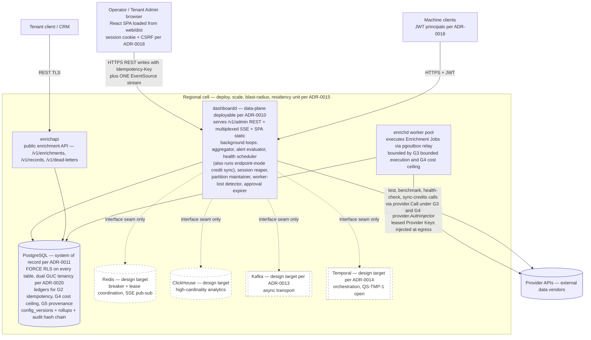
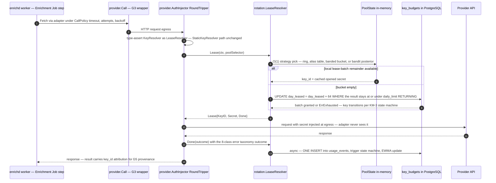
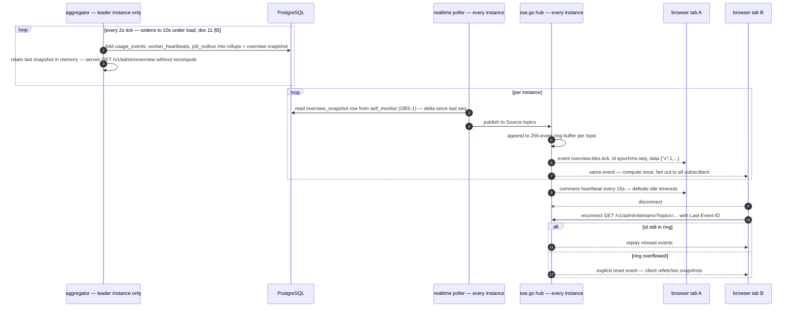

# 02 — Architecture

> **Status:** DRAFT · **Owner:** Solutions Architect · **Last updated:** 2026-07-04 · **Gated by:** /architecture-review, /security-audit

> Governing invariant, verbatim from the platform docs: **"the model proposes, a deterministic gate disposes."** Every mechanism in this document is a deterministic gate around state the dashboard reads or writes. The five platform gates are referenced by their exact labels: **G1 tenant isolation, G2 idempotency, G3 bounded execution, G4 cost ceiling, G5 provenance.** All terminology follows the canonical Glossary (`docs/00-Project-Overview.md` §7): Tenant, Provider, Provider Key, Key Pool, Waterfall, Enrichment Job, Field, Confidence, Cost Ceiling, Idempotency Key. This document supersedes the concept-level `docs/17-Dashboard-Planning.md` while honoring its rule that **every panel maps to a backing service and table — no orphan UI.**

---

## 1. System context

`dashboardd` is a new Go binary at `cmd/dashboardd`, occupying the **dashboard/admin API slot that ADR-0010 reserved in the data-plane** ("(d) dashboard/admin API — read-mostly, replica + analytics store"). It is deployed inside the regional cell (ADR-0015), scales independently of the control-plane modulith, and is stateless: all authority state lives in PostgreSQL (ADR-0011). Two honest deltas against ADR-0010's sketch: (1) reads are served from Postgres rollup tables now, with ClickHouse remaining a design-target analytics store behind Go interfaces (§7); (2) `dashboardd` is read-mostly but also the **only** admin write path — every write goes through `/v1/admin/*` with an `Idempotency-Key` header, RBAC, and the audit hash chain.

The SPA (React + TypeScript + Vite, ADR-0016) is served statically from `web/dist` by `dashboardd` and is architecturally just another API consumer. `enrichapi` (public enrichment API) and the `enrichd` worker fleet are untouched deployables; the dashboard integrates with them exclusively through shared Postgres tables it is permitted to touch (one-owner-per-table registry, doc 03) and through the `rotation.LeaseResolver` seam consumed by the engine's egress `provider.AuthInjector`.



Boundary rules the diagram encodes:

| Boundary | Rule |
|---|---|
| Browser → dashboardd | Session cookie + CSRF (ADR-0018); one multiplexed SSE stream `GET /v1/admin/streams?topics=` (ADR-0019); uniform error body `{"error":{"code","message"}}`; cursor pagination with limit cap 200. |
| dashboardd → Postgres | Only via the dual-GUC RLS tx helper (`internal/dash/db`); app role `app_rls` has no BYPASSRLS; migrations applied at boot via `internal/pgmigrate`. |
| dashboardd → Provider APIs | Only through `provider.Call` with a leased Provider Key — test/benchmark/health-check/sync-credits traffic (manual actions and the scheduled endpoint-mode credit sync alike) obeys the same G3 bounded execution CallPolicy and records spend in the G4 cost ceiling ledgers as engine traffic. Scheduled credit sync (`credit_sync.interval_s`, mode `endpoint`) is owned by the health-scheduler loop's bounded worker pool under the `dash_health_scheduler` advisory lock — there is no eighth background loop (§2.2, ARCH-6). |
| dashboardd → enrichd | No network channel. Intent is written to `workers.desired_state`; workers converge via their 10s heartbeat upsert (doc 06). Queue actions delegate to `internal/pgoutbox` APIs (redrive). |
| Dashed nodes | Design targets only. No code path may import a client for them; they exist strictly behind the Go interfaces in §7. |

---

## 2. The seven architecture principles

Each principle names its concrete mechanism in this design. A principle without a mechanism is marketing; these are the seams implementation agents build 1:1.

### 2.1 Modular feature folders → `internal/dash/<feature>/`

Every module is a self-contained package under `internal/dash/`: the five shared **seams** (`db`, `httpx`, `secrets`, `rbac`, `realtime`) and the **feature** packages (`security`, `audit`, `providers`, `keys`, `rotation`, `health`, `configver`, `routing`, `workflows`, `queues`, `workers`, `cost`, `alerts`, `approvals`, `overview`). Each **feature** package ships the same five files — `types.go`, `service.go`, `store.go` (consumer-side interface), `pgstore.go`, `http.go` exposing `Routes(mux, mw)` — plus tests and a package doc comment stating purpose and which gates it enforces. The seam packages are not features and ship their own shapes per §6 — the dual-GUC tx helper and cursor codec (`db`), the middleware chain (`httpx`), the envelope `Backend` (`secrets`), the role×action matrix (`rbac`), the poller/SSE hub (`realtime`) — and mount no `Routes` of their own. Cross-feature calls go through the `store.go`/service interfaces with `var _ Iface = (*Impl)(nil)` compile-time assertions; no feature imports another feature's `pgstore.go`. The one-owner-per-table registry (doc 03) makes the folder boundary a data boundary: `queues` never writes `job_outbox` directly — it delegates to `pgoutbox` APIs.

### 2.2 Plugin provider adapters → one adapter seam, zero core-engine changes

Adding a Provider is **one in-repo adapter file plus one `providers` row** — the core engine changes for zero Provider additions, and every tunable lives in the row so *config* changes never require a deploy. The honest split, pinned against `internal/provider/httpadapter.go` ground truth:

- **The row owns every tunable.** `POST /v1/admin/providers` creates a `providers` row (migration 0005) whose columns — `base_url`, `api_version`, `auth_scheme`/`auth_header`/`auth_query_param` (the serialized `provider.AuthDescriptor`), `timeout_ms`, `retry_policy`, `rate_limit_rpm`, `breaker_threshold`/`breaker_cooldown_s`, `capabilities jsonb` — parameterize the adapter's runtime behavior. Adapters are (re)built at catalog-epoch refresh (below), so a `PATCH` to any of these propagates to running instances with no deploy and no restart.
- **Code owns request/response shape.** A row alone cannot drive `provider.HTTPAdapter`: its `Build` (canonical `Request` → vendor HTTP request) and `Decode` (2xx body → `Result`) fields are code — `Fetch` fails closed with `ClassBadRequest` `"adapter has no Decode function"` when `Decode` is nil, and the nil-`Build` default is a bare GET to `BaseURL` that ignores `Request.Known`, so a row-only adapter can neither form a vendor lookup request nor parse a response. **Every Provider therefore requires exactly one adapter file** — supplying `Build`/`Decode` closures for HTTP vendors, or implementing the full strict `provider.Adapter` interface (`Name() string; Capabilities() []Capability; Fetch(ctx, Request) (Result, error)`) for bespoke protocols. The onboarding claim is *"new Provider = one adapter file + one row; config changes without deploy"* — never "zero code change." A data-driven request/response-mapping descriptor that would compile `Build`/`Decode` from validated columns was considered and deferred (ARCH-4, now RESOLVED); docs 01 (Domain-1 row) and 12 (Self-Verification scaffold row) carry the corrected phrasing.
- **Registration touches no shared file.** Adapter files self-register via `init()` into a package-level registry in `internal/dash/providers`, keyed by Provider id. A bespoke Provider addition touches exactly one *new* adapter file plus one `providers` row — no central registry file is edited, and the core engine (`router.Planner`, `provider.Call`, the `Breaker`, the G3/G4 wrappers) is untouched.
- **Catalog changes propagate by epoch, not deploy.** Every provider/pool/key mutation that affects adapter construction or `PoolState` bumps a dedicated sentinel-tenant `config_epochs` row **in the same transaction as the mutation, with `NOTIFY` in that transaction**: `('platform','provider_catalog')` for providers CRUD and op-state actions, `('platform','key_pool')` for `key_pools` strategy/membership writes and `provider_keys` rotation/compromise transitions (kind literal is the SINGULAR `'key_pool'`, consistent with `routing_policy`/`waterfall_workflow`/`alert_ruleset`/`provider_catalog`; pinned by the doc 03 `config_epochs` kind constraint). Because `config_epochs` has exactly one owner (`internal/dash/configver`, doc 03 §6), mutating features never write the table — they call a configver-owned `BumpEpoch(ctx, kind)` API. The doc 03 §6 registry's enumerated second-writer exception (`internal/dash/keys`, kind=`key_pool` only, per the doc 07 §8.1 Principle-3 exemption) executes exclusively through this same configver-owned `BumpEpoch` API — one mechanism, two registered call sites, never a second upsert path. Instances observe the bump (NOTIFY + 1s poll fallback) and rebuild the adapter set and `PoolState`, the same propagation path as a versioned-config publish (§2.3; §5 rows 1–4). This is what makes `PUT /key-pools/{id}/strategy` → rebuild and the compromise-rotation "immediate epoch bump" (§5 row 4) mechanisms rather than assertions (ARCH-5).

The dashboard extends the seam with two optional capability interfaces, feature-detected by type assertion (the same pattern `provider.AuthInjector` uses to detect `rotation.LeaseResolver`):

```go
// internal/dash/providers — optional adapter capabilities, feature-detected.
type HealthChecker interface {
    HealthCheck(ctx context.Context, key rotation.Lease) (HealthResult, error)
}
type CreditSyncer interface {
    SyncCredits(ctx context.Context, key rotation.Lease) (CreditBalance, error)
}
```

Adapters without them fall back to descriptor-driven defaults (a capability probe request for health; the `credit_sync jsonb` mode `header|endpoint|manual` for credits). Each `credit_sync` mode has an owned capture point (ARCH-6): **endpoint** mode is pulled on `credit_sync.interval_s` by the health-scheduler loop's bounded worker pool (under its `dash_health_scheduler` advisory lock — no eighth background loop), through `CreditSyncer` or the descriptor fallback, sharing one code path with manual `POST /providers/{id}/sync-credits`; **header** mode is harvested passively on the egress response path — vendor balance/quota response headers surface through `Lease.Done` outcome metadata, costing zero extra egress calls; **manual** mode is the POST action alone. All modes write `providers.credits_remaining`/`last_sync_at` through `providers.Store` methods, preserving one-owner-per-table (doc 03 §6); scheduled-sync failure behavior rides the health-scheduler failure row (doc 10 §6). Adapters never hold Provider Keys: the `AuthInjector` RoundTripper injects the leased secret at egress.

### 2.3 Config-as-versioned-data → `config_versions` / `config_active` / `config_epochs`

Routing policies and Waterfall workflows are JSON payloads in `config_versions` rows with an explicit lifecycle: `draft → validated → published → archived` (migration 0006). The 0006 `kind` CHECK also admits `'alert_ruleset'`; that kind is **reserved-for-future** — no v1 endpoint reads or writes it, and doc 07 §1.1 recognizes exactly two live kinds. Alert rules are deliberately live, audited CRUD rows instead (`alert_rules`, owned by `internal/dash/alerts`, doc 04 §2.11): they observe and notify but never gate execution (the G4 doctrine — budgets alert, Cost Ceilings enforce), so a misconfigured rule cannot corrupt work and does not need publish/rollback provenance (ARCH-7). Validation pins `payload_hash`; any subsequent draft edit reverts `validated → draft`. Publish is a single transaction serialized on the `config_active` pointer row: `SELECT active_version_id … FOR UPDATE` (`INSERT … ON CONFLICT DO NOTHING` first for the first-ever publish, then lock), `409 version_conflict` unless the locked `active_version_id` equals the caller's `expected_active_version_id` (defaults to the draft's `parent_version_id`); then under the lock re-check the gate (publish: `status='validated'` and the pinned hash; rollback: `status IN ('archived','published')`, `published_at IS NOT NULL`, `payload_hash` intact, fresh validator pass), archive the previous active version, flip the pointer, bump `config_epochs`, append an audit row, `NOTIFY` (doc 03 §9.3). Rollback is a publish of a prior version id — nothing is destroyed. Two recorded live-config exemptions ride audited CRUD + epoch propagation instead of this versioned lifecycle: `key_pools` strategy/params (doc 07 §8.1 Principle-3 exemption) and `rotation_triggers` (doc 03 OI-DB-8). Enrichment Jobs pin `config_version_id` at start, which extends **G5 provenance** to configuration: every result is attributable to the exact config version that produced it. This realizes ADR-0010's grafted "config-as-versioned-data" decision and ADR-0011's versioned-config placement in Postgres.

### 2.4 API-first → the UI consumes only `/v1/admin`

The SPA has no privileged channel. Every panel binds to a real endpoint in the ~110-endpoint `/v1/admin/*` surface (doc 04), specified in `docs/waterfall-dashboard/openapi-admin.yaml` and enforced by the `TestAdminOpenAPIParity` contract test; the docs/17 no-orphan-UI rule is thereby machine-checked. All conventions are uniform regardless of caller: snake_case JSON, `Idempotency-Key` required on writes (reuse with a different body → 409), uniform error body `{"error":{"code","message"}}`, cursor pagination with opaque base64url cursors and a hard limit cap of 200, `202 {"job_id"}` for bulk work and `202 {"approval_request_id"}` for approval-gated actions. Machine clients (CI, scripts) use the identical surface with JWT auth (ADR-0018) — the browser is not special.

### 2.5 Horizontal scale → stateless handlers, one leader, O(1) selection, no in-process authority

Any `dashboardd` instance can serve any request: sessions, idempotency records, approvals, and config live in Postgres, never in process memory. Exactly one instance at a time performs aggregation writes, elected by `pg_try_advisory_lock(hashtext('dash_aggregator'))`; every other background loop takes its own analogous advisory lock (doc 11 §1). Provider Key selection is O(1) per call against in-memory per-pool `PoolState` (atomic ring index, alias-method table, banded EWMA buckets — spec §5 strategies), rebuilt on config-epoch change; quota safety is preserved by batched leases against `key_budgets` (batch ≤ 64), so the database write rate is ≈ rps/64 per Provider Key rather than per call. In-memory structures are caches over Postgres authority (§5), never the authority itself — instance loss loses no state and at most one lease batch.

### 2.6 Realtime via pub/sub fan-out → SSE + aggregator + deltas, no per-client polling

Live views are computed once and broadcast (ADR-0019). The leader aggregator folds `usage_events`, heartbeats, and queue state into rollups and a 2s overview snapshot; a per-instance poller reads deltas; `internal/dash/realtime` fans them out over one multiplexed SSE stream per browser tab (`GET /v1/admin/streams?topics=a,b,c` — per-topic endpoints would exhaust the HTTP/1.1 six-connection pool). Database read load is O(instances), not O(clients). Event QoS is split: `*.tick` events replace query-cache snapshots and may be coalesced under load; `*.changed`/`*.fired`/`*.progress` events carry invalidation semantics and are never silently dropped. A 256-event ring buffer per topic serves `Last-Event-ID` replay; overflow emits an explicit `reset` event forcing a snapshot refetch. Clients never poll while the stream is healthy; disconnect degrades to a 15s refetch fallback.

### 2.7 Everything reversible → version pointers, soft-archive, audit

No admin action destroys history. Config rollback re-points `config_active`; Provider archive sets `archived_at` with config history intact; Provider Key rotation creates a successor row with `rotated_from` lineage and an overlap window rather than mutating ciphertext in place; keys archive, never hard-delete, outside the approval-gated bulk path; dead-lettered jobs park for audited redrive rather than being purged. Every state transition appends to the per-Tenant SHA-256 hash-chained `audit_log` (serialized by `audit_chain_heads` row lock, range-partitioned, never deleted), so reversal is itself evidenced. Destructive verbs (`key_bulk_delete`, `provider_delete`, …) are gated by the approvals engine with four-eyes quorum and TOTP step-up, executing exactly-once with Idempotency Key = approval request id.

---

## 3. Hard-gate compliance

The five platform gates apply unchanged: **G1 tenant isolation** (FORCE RLS + dual GUC), **G2 idempotency** (`Idempotency-Key` ledger on all admin writes; redrive's `WHERE dead=true` guard), **G3 bounded execution** (dashboard-originated Provider calls run under `provider.Call` CallPolicy), **G4 cost ceiling** (budgets alert, Cost Ceilings enforce — the dashboard never adds a second enforcement path), **G5 provenance** (jobs pin `config_version_id`; audit chain). On top of those, the dashboard build has five hard gates of its own; each row below is a release obligation.

| Gate | Mechanism | Where enforced | Test that proves it |
|---|---|---|---|
| **Tenant isolation** (realizes G1 tenant isolation) | `tenant_id` + `ENABLE`/`FORCE ROW LEVEL SECURITY` on every table; dual GUCs `app.current_tenant` + `app.current_role` bound per transaction from the verified Principal (ADR-0020 sentinel `platform` Tenant for Class P tables); operator cross-tenant SELECT only on the enumerated list, always audit-logged; cross-tenant existence never disclosed (404) | Postgres policies (migrations 0004–0009) + `internal/dash/db` tx helper reading Tenant only from `tenant.FromContext(ctx)`, fail-closed; `app_rls` role has no BYPASSRLS | Integration: cross-tenant zero-rows test for EVERY new table — release blocker (doc 13); RLS fuzz in the P12 security pass; CI negative-isolation test per ADR-0011 |
| **Bounded queries** | Cursor pagination, opaque base64url `{k,id}` cursor, hard limit cap 200; typed filter whitelists mapped to partial indexes; server-side resolution clamp (coarsest rollup yielding ≤ ~500 buckets); windows beyond a rollup tier's retention rejected `400 window_out_of_range` (doc 04 §1.6/§1.8); analytics reads served only from rollups, never raw `usage_events` scans | `internal/dash/db` bounded-query guard + cursor codec; each feature's `pgstore.go` sort/filter whitelist; `dash/health` + `dash/cost` resolution clamp | Contract tests: limit>200 → `400 invalid_filter` (server rejects — clamping is client-side, doc 08 §4); cursor round-trip property test; EXPLAIN assertions that hot list queries hit their partial indexes (doc 13) |
| **Pool safety** | (a) Connection-pool hygiene: GUCs set with `set_config(..., true)` — transaction-local, so a pooled connection can never leak a prior Tenant or role; (b) Key Pool lease safety: atomic batched leases `UPDATE key_budgets SET day_leased = day_leased + $2 WHERE key_id=$1 AND day_leased + $2 <= daily_limit RETURNING day_leased`, batch ≤ 64, crash loses ≤ 1 batch, nightly reconcile from `usage_events` ground truth; per-key `atomic.Bool` availability in `PoolState` | `internal/dash/db` tx helper (a); `internal/dash/rotation` lease budgets + selection state (b) | (a) Test proving GUC is empty on a reused pooled connection outside a tx; (b) P2 gate: `-race` at 10k selections/s with zero over-lease under 50 concurrent goroutines — both rates UNVERIFIED targets until measured |
| **Online-safe migrations** | Expand → migrate → contract playbook (doc 03); migrations `NNNN_snake_description.sql`, no BEGIN/COMMIT (runner wraps), applied at boot by `pgmigrate.Apply` before serving; partition create/detach performed by the runtime partition-maintainer loop, never by migrations; blue-green overlap requires binary N−1 to run against the expanded schema | `internal/pgmigrate` + migration review checklist in doc 03; deploy sequence in doc 11 §6 | CI applies the full migration chain against a populated snapshot; doc 03 carries a worked expand→migrate→contract example; P12 blue-green drill with mixed-version fleet |
| **Cache correctness** | Every cache enumerated in §5 with its invalidation trigger, TTL, and stale-read consequence — a cache absent from that table may not exist in code; `PoolState` keyed by config epoch; SSE QoS split (ticks coalescible, `*.changed` never dropped); sessions deliberately uncached so revocation is immediate | `internal/dash/rotation` (epoch rebuild), `internal/dash/realtime` (QoS), `internal/dash/overview` (tick snapshot), `web/src/api/sse.ts` (cache patcher) | Epoch-bump propagation test covering **both** bump sites — config publish AND catalog mutations (provider PATCH, key-pool strategy write, compromise rotation via `BumpEpoch`, §2.2) → all instances rebuilt ≤ 1s (UNVERIFIED until P2/P7/P12 gates, doc 13); Last-Event-ID replay + ring-overflow reset test (P7 gate); session-revocation-is-immediate test (doc 13) |

---

## 4. Sequence diagrams

### 4.1 Config publish (atomic pointer flip)

```mermaid
sequenceDiagram
    autonumber
    participant SPA as SPA routing editor
    participant HX as dashboardd httpx middleware
    participant CV as configver service
    participant AP as approvals.Gate
    participant PG as PostgreSQL
    participant RT as realtime poller on each instance

    SPA->>HX: POST /v1/admin/routing/{scope}/versions/{id}/publish with Idempotency-Key
    HX->>HX: session + CSRF, RBAC requireRole, idempotency ledger check
    HX->>CV: Publish(ctx, versionID)
    CV->>AP: Gate(ctx, routing_publish, payload pinned {version_id, payload_hash, expected_active_version_id})
    Note over AP: FAIL-CLOSED — an absent approval_policies row applies the built-in default policy (doc 04 §5.1); an explicit row customizes, never disarms
    AP-->>SPA: 202 {"approval_request_id"}
    AP->>CV: executor re-enters Publish on quorum with Idempotency Key = approval request id
    CV->>PG: BEGIN one tx
    PG->>PG: SELECT active_version_id FROM config_active WHERE (tenant_id,kind,scope_key) FOR UPDATE — INSERT .. ON CONFLICT DO NOTHING first on first-ever publish
    PG->>PG: 409 version_conflict unless locked active_version_id = expected_active_version_id (default: draft's parent_version_id)
    PG->>PG: re-check status = validated AND payload_hash matches
    PG->>PG: archive previous active version, UPDATE config_active SET active_version_id
    PG->>PG: UPDATE config_epochs SET epoch = epoch + 1
    PG->>PG: INSERT audit_log row into hash chain
    PG->>PG: NOTIFY config epoch channel
    PG-->>CV: COMMIT
    CV-->>SPA: 200 published version
    RT->>PG: observe epoch bump — NOTIFY or 1s poll
    RT->>RT: rebuild PoolState and adapter set for the new epoch
    RT-->>SPA: SSE event provider.health.changed and workflow list invalidation
```

Failure honesty: the `config_active` pointer row is the lock and staleness point — if the locked `active_version_id` differs from `expected_active_version_id` (a concurrent publish won; the expectation is pinned into the approval payload at request time, so a gated publish approved after a competing flip also loses), or the gate re-check fails (a concurrent edit reverted the draft), the transaction aborts and the caller receives `409 {"error":{"code":"version_conflict","message":"…"}}` — never a partial flip, and never a superseded version left `published` while unpointed. Jobs already running keep their pinned `config_version_id` (G5 provenance); only new plans see the new epoch.

### 4.2 Provider Key lease on the engine hot path



The hot path performs exactly one durable write (`usage_events`); lease accounting amortizes to ≈ rps/64 writes per Provider Key (UNVERIFIED until the P2 load gate). A `QUOTA` outcome drives `active → exhausted → probing → active`; `AUTH` drives `active → auth_failed → disabled` with an alert — transitions are made by the deterministic state machine, never by the UI.

### 4.3 SSE fan-out tick



---

## 5. Cache inventory

Rule: **a cache that is not in this table may not exist in the code.** Rollup tables are deliberately excluded from cache semantics — they are *materialized state, not cache*: the system of record for telemetry reads, refoldable from the 48h `usage_events` raw stream; their staleness bound is the aggregator fold lag, documented as part of the alert-detection SLA (doc 10), not an invalidation problem.

| # | Cache | Location | Keyed by | TTL / refresh | Invalidation trigger | Stale-read consequence |
|---|---|---|---|---|---|---|
| 1 | `PoolState` (per-Key-Pool selection state: rings, alias tables, EWMA bands, per-key availability bools; references rows 2–4) | in-memory, each dashboardd/enrichd-egress instance | config epoch + pool id | rebuilt on epoch change; EWMA re-banding by 1s background loop | `config_epochs` bump — versioned-config publish (§2.3) **or** catalog/pool `BumpEpoch` on provider/pool/key mutations (§2.2) — via NOTIFY, 1s poll fallback | ≤ ~1s (UNVERIFIED) of selections may route to a just-disabled/re-weighted Provider Key; bounded by lease budgets (≤ 1 batch of 64 over-admit worst case); never a correctness break because rotation uses overlap windows |
| 2 | Per-key lease token bucket (batched-lease remainders per Provider Key) | in-memory inside `dash/rotation`, held by each instance's `PoolState` | Provider Key id | refilled on exhaustion by the guarded `key_budgets` UPDATE (batch ≤ 64); lives until the batch is consumed or the epoch rebuilds | batch exhaustion → next guarded refill; key state leaving `active`/`rotating`; epoch rebuild | crash leaks ≤ 1 batch (≤ 64) of leased-but-unused calls per key — `day_leased` overstates true usage until the nightly reconcile from `usage_events` ground truth; never an over-lease, because the `WHERE day_leased + $2 <= daily_limit` guard is the database-side invariant (§3 Pool safety) |
| 3 | Resolved-config cache (engine config reader, dashboardd resolvers, planner priors) | in-memory, per instance | `(tenant_id, kind, scope, epoch)` | entry dropped the moment a newer epoch is observed (NOTIFY + 1s poll fallback) | `config_epochs` bump in the publish transaction — doc 07 §10 is the semantic authority for this row | reader is at most one epoch behind for ≤ ~1s (UNVERIFIED, P3); worst case an Enrichment Job plans under the prior version — safe because the Job pins `config_version_id` (G5 provenance) and G3/G4 are engine-enforced at call time regardless of which config proposed the plan |
| 4 | Opened-secret cache (unwrapped DEK plaintexts held for egress injection) | in-memory inside `dash/secrets`, referenced by `PoolState` | envelope id + config epoch | lives exactly as long as its epoch's `PoolState` | epoch bump — including `('platform','key_pool')` bumps written in-transaction by rotation/compromise transitions (§2.2); key state leaving `active`/`rotating` | a rotated-out key's secret may be injected for ≤ ~1s post-cutover — harmless by design: the `rotating` overlap state keeps the old Provider Key valid; compromise flow (overlap=0) forces an immediate `BumpEpoch` + rebuild |
| 5 | Overview snapshot (last computed tile set) | in-memory in the leader aggregator; followers read the `self_monitor` snapshot row (component `overview_snapshot`, payload jsonb + seq — OBS-1 DDL addendum, doc 03 §2.6) | tick seq | replaced every 2s tick (10s degraded) | next tick overwrites | tiles lag their *inputs* by ≤ 2s (≤ 10s degraded); the worst-queue tile's input is the 15s queue-stats sample (row 6), so its end-to-end staleness against `job_outbox` is ≤ ~17s; payload carries `ts` so the UI shows freshness; no gate or write decision reads these numbers |
| 6 | Queue-stats last sample (per-queue depth vector + `oldest_age_s` + per-Tenant top-10 breakdown) | in-memory in the leader aggregator; followers serve `GET /v1/admin/queues`, `by_tenant`, and their realtime poller from the `self_monitor` snapshot row (component `queue_stats_sample`, payload jsonb + seq — OBS-1, doc 03 §2.6) the sampler upserts each tick (doc 06 §6–7) | queue name | replaced every 15s sample tick (default, doc 06 §6) | next sample overwrites | `GET /v1/admin/queues`, `queue.stats.tick`, and the overview worst-queue tile lag `job_outbox` by ≤ 15s; leader and followers share that ≤ one-sample bound because both serve the same persisted sample; a missed sample (leader loss) is lag not loss, and staleness is detected by the `queue.stats_stale` dead-man alert (doc 06 §7, doc 10) |
| 7 | Alert evaluator last-state (open-episode map) | in-memory in the leader alert-evaluator loop | alert rule id / open episode | rebuilt on start and leader failover from open `alert_events` episodes; updated every 30s evaluation | episode fire/resolve transitions written to `alert_events` (doc 10 §5.5) | a lost/rebuilt state cannot double-fire: the single-firing partial unique index `(tenant_id, rule_id) WHERE state='firing'` (doc 10 §5.2) makes the rebuild race-free; worst case is a delayed renotify, inside the ~100s detection SLA (doc 10 §5.6) |
| 8 | react-query config-class queries (providers, Provider Key metadata, Key Pools, users, rules, versions, budgets — the doc 08 §4 config tier), including the `lib/permissions.ts` role-matrix mirror hydrated from `GET /v1/admin/roles` (doc 08 §7) | browser memory | query key from typed hooks | `staleTime: 30s` | SSE `*.changed` invalidation; mutation invalidate-on-settle | UI may show pre-change config ≤ 30s **only if** the SSE stream and the 15s refetch fallback are both down; server remains the authority on every write (409/422 on conflict); stale permissions-mirror reads are cosmetic-only guard drift — the server re-authorizes every request (doc 08 §7) |
| 9 | react-query telemetry-class queries (stats, timelines, cost) | browser memory | query key | `staleTime: 5s` | SSE `*.tick` events replace snapshots via `setQueryData` | charts ≤ 5s behind rollups (which are themselves fold-lagged); read-only surface |
| 10 | Session cache | **none — deliberately** | — | — | — | sessions are read from Postgres on every request so revocation and idle/absolute expiry are immediate; the accepted cost is one indexed PK lookup per request |
| 11 | Idempotency-Key ledger | not a cache — durable G2 idempotency state in Postgres | — | — | — | replays return the stored result; reuse with a different body → 409 |
| 12 | SSE ring buffer | in-memory per instance, per topic | event id `epochms-seq` | 256 events per topic | overwritten by newer events | not an authority: a reconnect whose `Last-Event-ID` scrolled out receives an explicit `reset` event and refetches — staleness is impossible to miss silently |
| 13 | SPA static assets | browser/CDN HTTP cache | content-hashed filenames | immutable, cache-forever; `index.html` no-cache | new deploy changes hashes | none — stale hashed assets are the previous complete build; `index.html` always fetches current manifest |

---

## 6. Module dependency diagram

Dependencies point strictly downward: feature packages → shared dash seams → existing repo packages. No feature imports another feature's storage; no seam imports a feature.

```mermaid
flowchart TB
    subgraph FEATURES["internal/dash feature packages"]
        overview["overview"]
        providersF["providers"]
        keysF["keys"]
        rotationF["rotation"]
        healthF["health"]
        configverF["configver"]
        routingF["routing"]
        workflowsF["workflows"]
        queuesF["queues"]
        workersF["workers"]
        costF["cost"]
        alertsF["alerts"]
        approvalsF["approvals"]
        securityF["security"]
        auditF["audit"]
    end

    subgraph SEAMS["shared dash seams"]
        dbS["dash/db\ndual-GUC tx helper, cursor codec, bounded-query guard"]
        httpxS["dash/httpx\nauthn, CSRF, RBAC guard, Idempotency-Key ledger, audited wrapper"]
        secretsS["dash/secrets\nenvelope Backend — Seal, Open, Rotate"]
        rbacS["dash/rbac\nrole x action matrix + ABAC"]
        realtimeS["dash/realtime\nSource, poller, SSE hub"]
    end

    subgraph CORE["existing repo packages — reused, not modified"]
        pgC["internal/pg\nwire client, SCRAM, TLS"]
        pgstoreC["internal/pgstore\nRLS tx pattern"]
        pgmigrateC["internal/pgmigrate"]
        metricsC["internal/metrics"]
        authC["internal/auth JWT"]
        tenantC["internal/tenant Principal"]
        providerC["internal/provider\nAdapter, Call, Breaker, AuthInjector, KeyResolver"]
        pgoutboxC["internal/pgoutbox\noutbox, DLQ, redrive"]
        jobC["internal/job"]
    end

    routingF --> configverF
    workflowsF --> configverF
    FEATURES --> dbS
    FEATURES --> httpxS
    keysF --> secretsS
    securityF --> secretsS
    alertsF --> secretsS
    providersF --> providerC
    rotationF --> providerC
    healthF --> providerC
    queuesF --> pgoutboxC
    queuesF --> jobC
    overview --> realtimeS
    approvalsF --> auditF
    httpxS --> rbacS
    httpxS --> authC
    httpxS --> tenantC
    httpxS --> metricsC
    dbS --> pgC
    dbS --> pgstoreC
    dbS --> tenantC
    realtimeS --> pgC
    secretsS --> dbS
```



(The `FEATURES --> dbS` / `FEATURES --> httpxS` edges abbreviate the uniform rule that every feature uses the tx helper and the middleware chain; the remaining edges are the exceptional, load-bearing dependencies. `routing`/`workflows` are thin kind-specific services over the shared `configver` engine — one lifecycle, one publish path, one audit story.)

---

## 7. Deferred-infra interfaces

Locked stack decision: Redis, ClickHouse, Kafka, and Temporal are **design-time targets behind Go interfaces, Postgres-backed implementations now.** The interface is the adoption; the deployment is the deferral. No dashboard package may reference these systems except through the seams below.

| Target | What it would carry | Go interface seam (consumer-side) | Postgres/stdlib implementation now | Swap trigger |
|---|---|---|---|---|
| **Redis** (ADR-0011 cache/coordination) | cross-instance breaker state, lease coordination, SSE pub/sub fan-out across instances | `rotation.BudgetStore` (batched lease grant/return), `provider.Breaker` state seam, `realtime.Source{Subscribe(topics)(ch, cancel)}` | in-memory `PoolState` + `key_budgets` atomic UPDATE batches; per-provider in-memory Breaker; per-instance poller (`poller.go`) with LISTEN/NOTIFY extension timeboxed (ADR-0019) | measured cross-instance convergence > 1s at production fan-out, or lease-batch DB write rate saturating PG (P12 evidence, all current figures UNVERIFIED) |
| **ClickHouse** (ADR-0011 analytics) | high-cardinality, long-retention telemetry: per-key × per-minute at 1,000+ Provider Keys per Provider, ad-hoc drill-downs | each feature's read `store.go`: `cost.Store` (summary/group-by/export), `providers` StatsReader, `health` TimelineReader — all take bounded windows and return bucketed series | additive `INSERT … ON CONFLICT` rollups (`provider_stats_*`, `key_usage_*`, `cost_rollup_1d`, `queue_stats_1m`) folded by the leader aggregator; retention tiers per doc 03 | rollup cardinality math (doc 11 §4) exceeding PG comfort, or product need for dimensions beyond the five fixed ones — which is a schema decision first, an engine decision second |
| **Kafka** (ADR-0013 async transport) | queue transport for Enrichment Jobs; import/replay streams | `queues` read-model interfaces: `QueueStats`, `JobLister`, `Redriver`; `job.Submitter` + `pgoutbox.Store` for writes | `internal/pgoutbox` transactional outbox with FOR UPDATE SKIP LOCKED relay, visibility timeout, DLQ + redrive | ADR-0013 activation for the engine itself; the dashboard follows the engine — panels are engine-agnostic by construction (QS-TMP-1 hedge, doc 06) |
| **Temporal** (ADR-0014, cost-gated; QS-TMP-1 open) | durable orchestration of multi-step Waterfall workflows | same `queues`/`workers` read-model interfaces; workflow config stays in `config_versions` regardless of engine | pgoutbox relay + `enrichd` workers with heartbeat/desired-state convergence | QS-TMP-1 resolution; if adopted, Temporal's own UI covers per-job history — another reason the dashboard never builds per-job event timelines |

The queue/worker panels never render pgoutbox-specific vocabulary: the closed state set (`depth/running/scheduled/delayed/retry/failed/dead/enq/deq/oldest_age_s`) is the contract, served via `GET /v1/admin/meta/enums`, so an engine swap is a new `store.go` implementation plus zero UI changes.

---

## Open items

| ID | Item | Status | Owner |
|---|---|---|---|
| ARCH-1 | Optional adapter capability interfaces `HealthChecker`/`CreditSyncer` (§2.2) are a consistent extension of the spec's feature-detection pattern; exact method signatures to be ratified in doc 04 + P1 code review | OPEN (decision recorded, consistent with MASTER SPEC §5 LeaseResolver detection) | Senior Backend Engineer |
| ARCH-2 | Per-loop advisory lock keys beyond `dash_aggregator` (one lock per background loop) — decided here for §2.5/§3, detailed in doc 11 §1 | OPEN (decision recorded; ratify at /architecture-review) | Solutions Architect |
| ARCH-3 | All timing/throughput figures in §3–§5 (1s epoch convergence, 10k selections/s, rps/64 lease write rate) are UNVERIFIED until the P2/P7/P12 load gates | OPEN — converted by doc 11 §4 load-test plan | Senior Backend Engineer |
| ARCH-4 | §2.2 retracts "fully parameterize"/"zero code change": `provider.HTTPAdapter` requires code-supplied `Build`/`Decode` (ground truth `internal/provider/httpadapter.go` — `Fetch` fails closed without `Decode`; nil-`Build` ignores `Request.Known`), so the onboarding claim is **"new Provider = one adapter file + one row; config changes without deploy."** A validated request/response-mapping descriptor (JSON-Schema'd jsonb compiled into `Build`/`Decode` at epoch refresh — explicitly NOT `attrs`) was considered and **deferred**; revisit if adapter-file volume becomes the onboarding bottleneck. Downstream corrections landed: 01-research-findings Domain 1 row and doc 12's Self-Verification scaffold row now carry the corrected phrasing ("new Provider = one adapter file (Build/Decode closures for HTTP vendors, full Adapter for bespoke protocols) + one providers row; zero core-engine changes; provider CONFIG changes propagate by catalog epoch without deploy or restart"; registration via `init()` self-registration, no shared registry file) | RESOLVED | Solutions Architect |
| ARCH-5 | Catalog/pool epoch semantics (§2.2): sentinel-tenant `config_epochs` rows `('platform','provider_catalog')` and `('platform','key_pool')` (singular kind literal, per the closed kind vocabulary pinned in doc 03) bumped via configver-owned `BumpEpoch(ctx, kind)` in the same transaction as every provider/pool/key mutation affecting adapter construction or `PoolState` (providers CRUD + op-state actions; `key_pools` strategy/membership writes; `provider_keys` rotation/compromise transitions), `NOTIFY` in-tx — preserves one-owner-per-table (second-writer exception for `internal/dash/keys`, kind=`key_pool` only, executes through the same `BumpEpoch` API, doc 03 §6). Downstream landed: doc 03 `config_epochs` kind constraint/comment, doc 04 §2.3/§2.9 endpoint notes, doc 07 §10 absorbs the two catalog/pool bump-site sentences, doc 13 P2/P7 two-site epoch-propagation test asserts the exact kind literals (§3) | RESOLVED | Solutions Architect |
| ARCH-6 | Credit-sync ownership (§1, §2.2): endpoint-mode scheduled sync (`credit_sync.interval_s`) folded into the health-scheduler loop's bounded worker pool under `dash_health_scheduler` — no eighth background loop; header-mode balances harvested on the egress response path via `Lease.Done` outcome metadata; all writes to `providers.credits_remaining`/`last_sync_at` via `providers.Store`. Downstream: doc 04 §2.3 sync-credits row gains the "G3-bounded via `provider.Call` under CallPolicy" annotation its sibling test/benchmark rows carry; doc 10 §3.3 absorbs the schedule and §6 gains the credit-sync failure row; doc 11 §1 notes the fold | OPEN (decision recorded) | Senior Backend Engineer |
| ARCH-7 | `'alert_ruleset'` in the 0006 `kind` CHECK is **reserved-for-future** (§2.3): no v1 endpoint uses it; alert rules stay live, audited CRUD rows (`alert_rules`) because alerts observe, never enforce. Downstream: doc 03 §2.3 DDL comment and doc 07 §1.1 carry the reserved-kind note, or a later migration drops the CHECK literal | OPEN (decision recorded; ratify at /architecture-review) | Solutions Architect |
