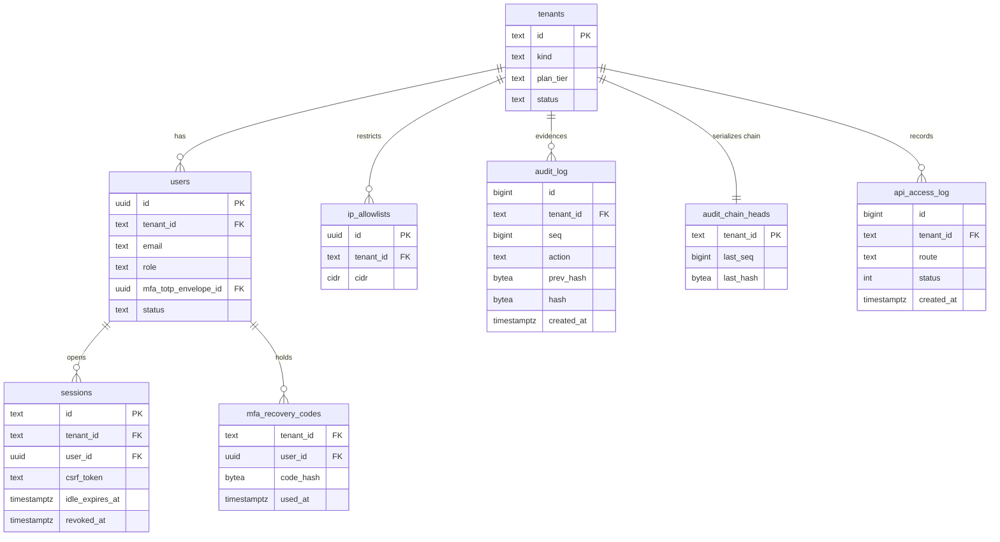
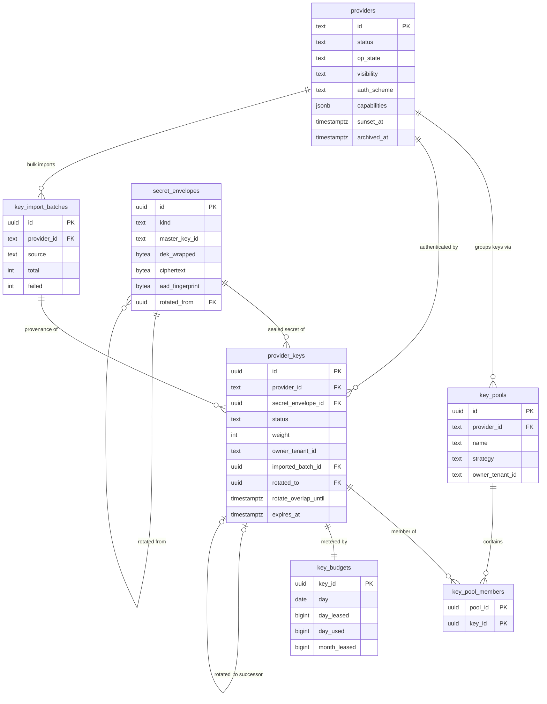
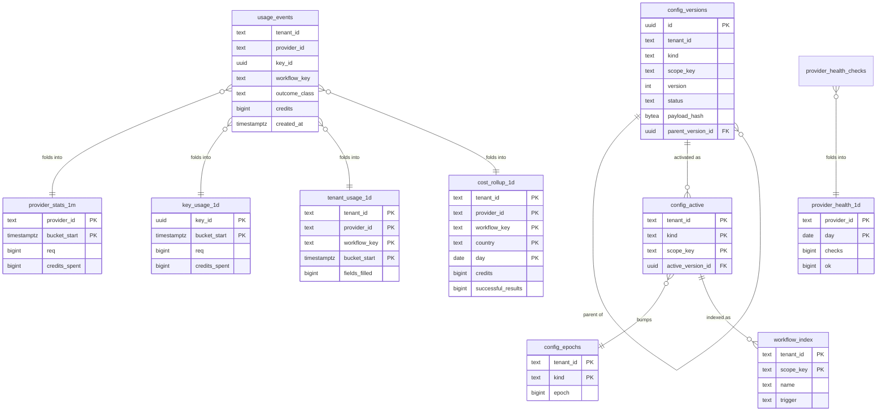

# 03 — Database Schema

> **Status:** ACCEPTED · **Owner:** Senior Backend Engineer · **Last updated:** 2026-07-06 · **Gated by:** /architecture-review, /security-audit

This is **the authoritative schema document** for the Waterfall Enrichment Engine Management Dashboard: migrations `0004`–`0009`, their row-level-security policies, partitioning and retention, index rationale, table ownership, and the online-migration playbook. Implementation agents copy the DDL here 1:1 into `migrations/NNNN_snake_description.sql` files. Terminology follows the canonical Glossary (`docs/00-Project-Overview.md` §7) verbatim: Tenant, Provider, Provider Key, Key Pool, Waterfall, Enrichment Job, Field, Confidence, Cost Ceiling, Idempotency Key. The five gates are referenced by their exact labels — **G1 tenant isolation, G2 idempotency, G3 bounded execution, G4 cost ceiling, G5 provenance** — under the governing invariant: **"the model proposes, a deterministic gate disposes."** Every table here backs a real panel and endpoint (the docs/17 no-orphan-UI rule); every panel's data lives in a table in this document.

Migration conventions (repo-binding): files are `migrations/NNNN_snake_description.sql`, 4-digit, **no `BEGIN`/`COMMIT`** (the runner `internal/pgmigrate` wraps each file in a transaction with its `schema_migrations` record), and a top comment stating intent plus the doc/gate it realizes. The RLS mechanics copy `migrations/0001_init.sql` verbatim: `tenant_id text NOT NULL`, `ENABLE` + `FORCE ROW LEVEL SECURITY`, policy `USING (tenant_id = app_current_tenant()) WITH CHECK (tenant_id = app_current_tenant())`, GUCs bound per transaction by the tx helper, tenant read only from `tenant.FromContext(ctx)` (fail-closed). All timestamps are `timestamptz` in UTC.

---

## 1. Table-class taxonomy (ADR-0020)

Three table classes, **one mechanism**. The existing `app.current_tenant` GUC is kept; ADR-0020 adds a second GUC `app.current_role` (values `operator` | `tenant_admin` | `tenant_user`). Both are bound per transaction by the `internal/dash/db` tx helper from the verified Principal — the role is derived from the JWT/session scope `role:<r>`, **never** from request bodies. A reserved system tenant row `platform` (`tenants.kind = 'platform'`) is seeded by migration 0004; signup only ever creates `kind = 'customer'`.

| Class | Definition | RLS shape | Members |
|---|---|---|---|
| **P — platform** | Global operational state with **no** `tenant_id` column. Owned and written by operator-scoped code paths. | `FORCE` RLS; policy `USING (app_current_tenant() = 'platform')` for ALL commands; plus **explicitly enumerated** tenant read-projections only where needed: `providers` catalog rows (`visibility = 'tenant_readable'`, catalog fields via the `providers_catalog` view), BYO Provider Keys / Key Pools (`owner_tenant_id = app_current_tenant()`). `secret_envelopes` has **no tenant policy ever**. | `providers`, `provider_keys`, `key_pools`, `key_pool_members`, `key_budgets`, `secret_envelopes`, `key_import_batches`, `provider_health_checks`, `provider_health_1d`, `provider_stats_1m/1h/1d`, `key_usage_1m/1h/1d`, `workers`, `worker_heartbeats`, `worker_stats_5m`, `queue_stats_1m/1h`, `queue_defs`, `health_schedules`, `rotation_triggers` |
| **T — tenant** | Tenant-scoped config and evidence; `tenant_id text NOT NULL`, 0001-style isolation policy. Platform-scoped rows simply use `tenant_id = 'platform'`. | 0001 policy verbatim; **operator cross-tenant SELECT policies** (`USING (app_current_role() = 'operator')`) ONLY on the enumerated list: `cost_rollup_*`, `tenant_usage_*`, `audit_log`, `alert_events`, `config_versions`, `config_active`, `workflow_index`, `users`, `tenants`. Every handler serving a cross-tenant operator view writes an `audit_log` row. Operator cross-tenant access is **SELECT-only everywhere** — including `tenants`: operators read all Tenants, but tenant lifecycle writes (signup, plan/status changes) happen via the signup/provisioning path outside this surface (doc 05 SEC-3). **Never** a blanket operator policy on `sessions`, `secret_envelopes`, `mfa_recovery_codes`, or the G2/G4/G5 ledgers. | `tenants` (isolation policy keyed on `id`, its PK; operator SELECT-only), `users`, `sessions`, `mfa_recovery_codes`, `ip_allowlists`, `audit_log`, `audit_chain_heads`, `api_access_log`, `config_versions`, `config_active`, `config_epochs`, `workflow_index`, `budgets`, `bulk_jobs`, `alert_channels`, `alert_rules`, `alert_events`, `alert_notifications`, `approval_policies`, `approval_requests`, `approval_decisions`, `tenant_usage_1h/1d`, `cost_rollup_1d`, `usage_events` |
| **R — telemetry/rollups** | Time-series tables RANGE-partitioned by time (1m tables weekly, others monthly, raw feeds daily), written ONLY by their designated writer — rollups by the leader-elected aggregator (`pg_try_advisory_lock(hashtext('dash_aggregator'))`), raw feeds by their hot path — and read via bounded windows (limit cap 200). Partition create/detach is performed by the **runtime partition-maintainer job, never by migrations** (§4). | Class R is orthogonal to P/T: each Class R table also carries a Class P or Class T policy per the columns it has. | `usage_events` (T), `provider_stats_*`, `key_usage_*`, `queue_stats_*`, `worker_heartbeats`, `worker_stats_5m`, `provider_health_checks`, `provider_health_1d` (P), `tenant_usage_*`, `cost_rollup_1d` (T), plus the partitioned evidence tables `audit_log`, `api_access_log` (T) |

**Why sentinel-tenant + dual GUC, and not the alternatives (ADR-0020):**

- **Separate `platform` schema** for Class P tables was rejected because it creates a second, differently-audited code path: the tx helper, the RLS fuzz test, and the zero-rows release blocker all operate on one mechanism today. A schema split would exempt platform tables from `FORCE` RLS discipline (or require a parallel policy regime), and the one-owner-per-table registry would need schema-qualified duplication. One mechanism means one proof obligation.
- **Nullable `tenant_id`** (NULL = platform) was rejected because NULL never equals anything in policy predicates: every policy would need `tenant_id IS NULL OR …` branches — a classic fail-open footgun — and `WITH CHECK` clauses could silently admit NULL rows from tenant paths. `NOT NULL` everywhere keeps policies total functions.
- **Sentinel `'platform'` tenant** keeps `FORCE ROW LEVEL SECURITY` on every table, keeps the single audited tx helper (`select set_config('app.current_tenant', $1, true)` + `set_config('app.current_role', $2, true)`), makes operator cross-tenant access an *enumerated policy list* rather than ambient privilege, and keeps cross-tenant existence undisclosed (404, never 403). The app role `app_rls` is non-superuser with no `BYPASSRLS`; only the outbox relay role has `BYPASSRLS`, and it touches only `job_outbox`.

Policies on partitioned parents govern all access through the parent (the only access path the application has — `app_rls` holds no grants on individual partitions, so direct partition access fails on privilege). The partition maintainer additionally sets `ENABLE` + `FORCE ROW LEVEL SECURITY` on each partition it creates as defense-in-depth.

---

## 2. Full DDL — migrations 0004–0010

Each subsection below is one migration file, presented exactly as it ships. Shared preamble for every file (repeated in each file's top comment): applied atomically by `internal/pgmigrate`; no `BEGIN`/`COMMIT`; RLS pattern copied from `migrations/0001_init.sql`.

### 2.1 `migrations/0004_dash_identity_rbac.sql`

Identity, sessions, and the evidence tables. Realizes G1 tenant isolation for the dashboard surface and the audit backbone of doc 05. Introduces the `app.current_role` GUC helper (ADR-0020) and seeds the sentinel `platform` Tenant.

```sql
-- Migration 0004 — dashboard identity, RBAC, and audit evidence (ADR-0018, ADR-0020; doc 03 §2.1, doc 05).
--
-- Adds the second GUC accessor app_current_role() (ADR-0020 dual-GUC model): both
-- app.current_tenant and app.current_role are bound per transaction by the internal/dash/db
-- tx helper from the verified Principal — never from request bodies (G1 tenant isolation).
-- Seeds the reserved sentinel Tenant 'platform' (signup only creates kind='customer').
--
-- audit_log is the per-Tenant SHA-256 hash chain (hash = sha256(prev_hash || canonical_json)),
-- serialized by an audit_chain_heads row lock (doc 03 §9.2). RANGE-partitioned by year;
-- never deleted. api_access_log is written by an async batch inserter (never blocks requests).
--
-- Partitions are created by the runtime partition maintainer, whose ensure pass runs
-- synchronously at dashboardd startup (doc 03 §4) — migrations create parents and a DEFAULT
-- backstop partition only. Applied atomically by internal/pgmigrate; no BEGIN/COMMIT here.

-- Helper: the current request role for this transaction, from the session setting (ADR-0020).
CREATE OR REPLACE FUNCTION app_current_role() RETURNS text
    LANGUAGE sql STABLE AS $$
    SELECT current_setting('app.current_role', /* missing_ok = */ true)
$$;

-- ---------------------------------------------------------------------------
-- tenants — Tenant registry, including the sentinel 'platform' row.
-- ---------------------------------------------------------------------------
CREATE TABLE tenants (
    id         text PRIMARY KEY CHECK (id ~ '^[a-z0-9-]{1,64}$'),
    name       text NOT NULL,
    kind       text NOT NULL CHECK (kind IN ('platform', 'customer')),
    plan_tier  text,
    status     text NOT NULL DEFAULT 'active',
    created_at timestamptz NOT NULL DEFAULT now()
);

-- Seed BEFORE enabling RLS: with FORCE RLS and no GUC bound, the insert below would be blocked.
INSERT INTO tenants (id, name, kind, plan_tier, status)
VALUES ('platform', 'Platform', 'platform', 'internal', 'active');

ALTER TABLE tenants ENABLE ROW LEVEL SECURITY;
ALTER TABLE tenants FORCE ROW LEVEL SECURITY;
-- Isolation policy keyed on id (this table's PK IS the tenant id): a Tenant sees and manages
-- only itself. Operators get the enumerated cross-tenant SELECT policy below — SELECT-ONLY,
-- like every other operator cross-tenant policy (ADR-0020; doc 05 §3.3 footnote 6: WITH CHECK
-- blocks operator cross-tenant writes). There is deliberately NO operator write path here:
-- tenant lifecycle writes (signup, plan/status changes) happen via the signup/provisioning
-- path outside this surface, in a transaction bound to the affected Tenant's own id (doc 05
-- SEC-3); an operator Principal writes only the 'platform' row (its own tenant scope).
CREATE POLICY tenants_tenant_isolation ON tenants
    USING (id = app_current_tenant())
    WITH CHECK (id = app_current_tenant());
CREATE POLICY tenants_operator_read ON tenants
    FOR SELECT USING (app_current_role() = 'operator');

-- ---------------------------------------------------------------------------
-- users — human logins (RBAC principals). password_hash format: pbkdf2$<iters>$<salt>$<dk>,
-- sha256, 600k iterations (doc 05). mfa_totp_envelope_id references secret_envelopes (0005);
-- the FK is added in 0005 because of migration ordering.
-- ---------------------------------------------------------------------------
CREATE TABLE users (
    id                   uuid PRIMARY KEY,
    tenant_id            text NOT NULL REFERENCES tenants(id),
    email                text NOT NULL,
    password_hash        text NOT NULL,
    role                 text NOT NULL CHECK (role IN ('operator', 'tenant_admin', 'tenant_user')),
    abac                 jsonb,               -- {region, plan_tier, ...} attribute checks (doc 05)
    mfa_totp_envelope_id uuid,                -- FK to secret_envelopes added in 0005
    mfa_enrolled_at      timestamptz,
    status               text NOT NULL DEFAULT 'active',
    created_at           timestamptz NOT NULL DEFAULT now(),
    updated_at           timestamptz NOT NULL DEFAULT now()
);
CREATE UNIQUE INDEX users_tenant_email_uq ON users (tenant_id, lower(email));

-- ---------------------------------------------------------------------------
-- mfa_recovery_codes — hashed one-time recovery codes. tenant_id is present because this is
-- a Class T table (ADR-0020); it is NEVER operator-readable.
-- ---------------------------------------------------------------------------
CREATE TABLE mfa_recovery_codes (
    tenant_id text  NOT NULL,
    user_id   uuid  NOT NULL REFERENCES users(id),
    code_hash bytea NOT NULL,
    used_at   timestamptz,
    PRIMARY KEY (user_id, code_hash)
);

-- ---------------------------------------------------------------------------
-- sessions — browser sessions (ADR-0018). id is 256-bit random, base64url. Reaped by the
-- session-reaper loop 24h after expiry. NEVER operator-readable across Tenants.
-- ---------------------------------------------------------------------------
CREATE TABLE sessions (
    id                  text PRIMARY KEY,
    tenant_id           text NOT NULL,
    user_id             uuid NOT NULL REFERENCES users(id),
    csrf_token          text NOT NULL,
    ip                  inet,
    user_agent          text,
    created_at          timestamptz NOT NULL DEFAULT now(),
    last_seen_at        timestamptz NOT NULL DEFAULT now(),
    idle_expires_at     timestamptz NOT NULL,
    absolute_expires_at timestamptz NOT NULL,
    mfa_verified_at     timestamptz,
    revoked_at          timestamptz
);
CREATE INDEX sessions_tenant_user_idx ON sessions (tenant_id, user_id);
CREATE INDEX sessions_idle_expiry_idx ON sessions (idle_expires_at);

-- ---------------------------------------------------------------------------
-- ip_allowlists — per-Tenant CIDR allowlists enforced by httpx middleware (doc 05).
-- ---------------------------------------------------------------------------
CREATE TABLE ip_allowlists (
    id         uuid PRIMARY KEY,
    tenant_id  text NOT NULL,
    cidr       cidr NOT NULL,
    label      text,
    created_by uuid,                -- users.id; soft reference (users are never hard-deleted)
    created_at timestamptz NOT NULL DEFAULT now()
);

-- ---------------------------------------------------------------------------
-- audit_log — per-Tenant SHA-256 hash chain; append-only evidence; never deleted.
-- hash = sha256(prev_hash || canonical_json(entry)); (tenant_id, seq) uniqueness is
-- guaranteed by the audit_chain_heads row-lock serialization (§9.2), not by a global
-- unique index (a partitioned table cannot enforce uniqueness without the partition key).
-- id uses an explicit sequence: identity columns on partitioned parents require PG 17;
-- DEFAULT nextval() is version-safe.
-- ---------------------------------------------------------------------------
CREATE SEQUENCE audit_log_id_seq;
CREATE TABLE audit_log (
    id            bigint NOT NULL DEFAULT nextval('audit_log_id_seq'),
    tenant_id     text   NOT NULL,
    seq           bigint NOT NULL,
    actor_user_id uuid,
    actor_role    text,
    action        text   NOT NULL,
    object_kind   text,
    object_id     text,
    before        jsonb,
    after         jsonb,
    ip            inet,
    prev_hash     bytea  NOT NULL,
    hash          bytea  NOT NULL,
    created_at    timestamptz NOT NULL DEFAULT now(),
    PRIMARY KEY (id, created_at)
) PARTITION BY RANGE (created_at);
CREATE TABLE audit_log_default PARTITION OF audit_log DEFAULT;
CREATE INDEX audit_log_chain_idx ON audit_log (tenant_id, seq);

-- audit_chain_heads — one row per Tenant chain; SELECT ... FOR UPDATE on this row
-- serializes appends per Tenant (§9.2).
CREATE TABLE audit_chain_heads (
    tenant_id text  PRIMARY KEY,
    last_seq  bigint NOT NULL DEFAULT 0,
    last_hash bytea  NOT NULL
);

-- ---------------------------------------------------------------------------
-- api_access_log — request telemetry, written by the async batch inserter; monthly
-- partitions, 90d retention (§4). No secrets, no PII beyond ip.
-- ---------------------------------------------------------------------------
CREATE SEQUENCE api_access_log_id_seq;
CREATE TABLE api_access_log (
    id         bigint NOT NULL DEFAULT nextval('api_access_log_id_seq'),
    tenant_id  text   NOT NULL,
    user_id    uuid,
    method     text   NOT NULL,
    route      text   NOT NULL,
    status     int    NOT NULL,
    dur_ms     int    NOT NULL,
    ip         inet,
    created_at timestamptz NOT NULL DEFAULT now(),
    PRIMARY KEY (id, created_at)
) PARTITION BY RANGE (created_at);
CREATE TABLE api_access_log_default PARTITION OF api_access_log DEFAULT;
CREATE INDEX api_access_log_tenant_idx ON api_access_log (tenant_id, created_at DESC);

-- ---------------------------------------------------------------------------
-- FORCE RLS + 0001-style tenant isolation on every Class T table above (tenants already has
-- its isolation policy, keyed on id). Enumerated operator read-projections follow.
-- ---------------------------------------------------------------------------
DO $$
DECLARE t text;
BEGIN
    FOREACH t IN ARRAY ARRAY['users', 'mfa_recovery_codes', 'sessions', 'ip_allowlists',
                             'audit_log', 'audit_chain_heads', 'api_access_log'] LOOP
        EXECUTE format('ALTER TABLE %I ENABLE ROW LEVEL SECURITY', t);
        EXECUTE format('ALTER TABLE %I FORCE ROW LEVEL SECURITY', t);
        EXECUTE format($f$
            CREATE POLICY %1$s_tenant_isolation ON %1$I
                USING (tenant_id = app_current_tenant())
                WITH CHECK (tenant_id = app_current_tenant())
        $f$, t);
    END LOOP;
END $$;

-- Operator cross-tenant SELECT: ONLY the ADR-0020 enumerated list. Every handler that
-- serves a cross-tenant operator view writes an audit_log row.
CREATE POLICY users_operator_read ON users
    FOR SELECT USING (app_current_role() = 'operator');
CREATE POLICY audit_log_operator_read ON audit_log
    FOR SELECT USING (app_current_role() = 'operator');

-- ---------------------------------------------------------------------------
-- secret_envelopes — Deviation D-1 (doc 12 P0): pulled forward from 0005 into 0004 because P0's
-- MFA enroll/verify must seal/open totp_seed envelopes (doc 05 §5.2). Class P (platform-only RLS,
-- no tenant policy ever); only internal/dash/secrets reads it (one-owner-per-table). No plaintext
-- column exists anywhere. AAD on Open = envelope_id || kind; aad_fingerprint is a KEYED
-- HMAC-SHA256(fingerprint_pepper, plaintext) used for provider_key duplicate detection (P1).
-- ---------------------------------------------------------------------------
CREATE TABLE secret_envelopes (
    id              uuid PRIMARY KEY,
    kind            text NOT NULL CHECK (kind IN
                    ('provider_key', 'totp_seed', 'webhook_secret', 'channel_config')),
    master_key_id   text  NOT NULL,     -- keyring entry that wraps this DEK (KEK rotation)
    dek_wrapped     bytea NOT NULL,
    nonce           bytea NOT NULL,
    ciphertext      bytea NOT NULL,
    aad_fingerprint bytea,              -- HMAC-SHA256(fingerprint_pepper, plaintext); KEYED
    created_at      timestamptz NOT NULL DEFAULT now(),
    rotated_from    uuid REFERENCES secret_envelopes(id)
);
CREATE INDEX secret_envelopes_fingerprint_idx ON secret_envelopes (aad_fingerprint);
ALTER TABLE secret_envelopes ENABLE ROW LEVEL SECURITY;
ALTER TABLE secret_envelopes FORCE ROW LEVEL SECURITY;
CREATE POLICY secret_envelopes_platform_only ON secret_envelopes
    USING (app_current_tenant() = 'platform')
    WITH CHECK (app_current_tenant() = 'platform');

-- users.mfa_totp_envelope_id FK, inline now that secret_envelopes lives in this migration.
ALTER TABLE users ADD CONSTRAINT users_mfa_envelope_fk
    FOREIGN KEY (mfa_totp_envelope_id) REFERENCES secret_envelopes(id);

-- Release-blocker test (docs/21 §1 pattern, CI against real Postgres): for EVERY table in
-- this file — insert as tenant A, select as tenant B, count MUST be 0.
```

### 2.2 `migrations/0005_dash_providers_keys.sql`

The Provider catalog, Provider Keys, Key Pools, envelope-encrypted secrets (ADR-0017), lease budgets, import batches, per-Provider health-check schedules, and rotation trigger configuration. All Class P (sentinel-tenant RLS) with two enumerated tenant read-projections.

```sql
-- Migration 0005 — Provider catalog, Provider Keys, Key Pools, secret envelopes (doc 03 §2.2,
-- ADR-0009 inclusion trichotomy, ADR-0017 envelope encryption, ADR-0020 Class P RLS).
--
-- providers.status is the ADR-0009 catalog lifecycle (ACTIVE-CANDIDATE / DEPRIORITIZED /
-- EXCLUDED) and is DISTINCT from runtime op_state (enabled/disabled/paused/maintenance).
-- Effective availability is COMPUTED (providers.EffectiveAvailability), never stored.
--
-- secret_envelopes is the ONLY place ciphertext lives; consuming tables store envelope ids.
-- No plaintext column exists anywhere in the schema. aad_fingerprint is the KEYED duplicate-
-- detection fingerprint HMAC-SHA256(fingerprint_pepper, plaintext) — keyed, never bare
-- SHA-256, so a leaked row cannot be brute-forced against low-entropy vendor keys; the AES-GCM
-- AAD binds envelope id || kind to the ciphertext (swap/splice detection). ADR-0017.
--
-- attrs jsonb is presentation-only: anything read by planner/breaker/rotation MUST be a typed
-- column (doc 01 risk register). Applied atomically by internal/pgmigrate; no BEGIN/COMMIT.

-- ---------------------------------------------------------------------------
-- providers — the platform-owned catalog row IS the connector definition: auth_* columns
-- serialize provider.AuthDescriptor; capabilities feeds Adapter.Capabilities() and the
-- Adaptive Router's Planner.
-- ---------------------------------------------------------------------------
CREATE TABLE providers (
    id                       text PRIMARY KEY,      -- slug
    display_name             text NOT NULL,
    category                 text,
    description              text,
    logo_url                 text,
    status                   text NOT NULL DEFAULT 'DEPRIORITIZED'
                             CHECK (status IN ('ACTIVE-CANDIDATE', 'DEPRIORITIZED', 'EXCLUDED')),
    compliance_review_status text,
    op_state                 text NOT NULL DEFAULT 'disabled'
                             CHECK (op_state IN ('enabled', 'disabled', 'paused', 'maintenance')),
    visibility               text NOT NULL DEFAULT 'tenant_readable',
    priority                 int,
    base_url                 text,
    api_version              text,
    auth_scheme              text CHECK (auth_scheme IN
                             ('api-key-header', 'api-key-query', 'bearer', 'basic', 'oauth2-cc')),
    auth_header              text,
    auth_query_param         text,
    capabilities             jsonb,                 -- [{field, cost_credits, expected_confidence}]
    region                   text[],
    docs_url                 text,
    webhook_config           jsonb,
    bulk_api                 boolean,
    batch_api                boolean,
    retry_policy             jsonb,
    timeout_ms               int,
    rate_limit_rpm           int,
    concurrency_limit        int,
    daily_limit              bigint,
    monthly_limit            bigint,
    breaker_threshold        int,
    breaker_cooldown_s       int,
    credit_sync              jsonb,                 -- {mode: header|endpoint|manual, endpoint, interval_s}
    credits_remaining        bigint,
    unit_cost_credits        bigint,
    cost_currency            text,
    sla_uptime_pct           real,
    correlation_group        text,
    sunset_at                timestamptz,
    confidence_score         real,
    cost_score               real,
    performance_score        real,
    success_score            real,
    failure_score            real,
    health_score             real,
    avg_latency_ms           real,
    last_health_at           timestamptz,
    last_failure_at          timestamptz,
    last_success_at          timestamptz,
    last_sync_at             timestamptz,
    tags                     text[],
    notes                    text,
    attrs                    jsonb,                 -- presentation-only; never planner-read
    archived_at              timestamptz,
    created_at               timestamptz NOT NULL DEFAULT now(),
    updated_at               timestamptz NOT NULL DEFAULT now(),
    updated_by               uuid
);

-- ---------------------------------------------------------------------------
-- secret_envelopes — AES-256-GCM envelope store (ADR-0017). Created before its consumers
-- so their FKs can reference it. Operator-only; ONLY internal/dash/secrets reads it.
-- ---------------------------------------------------------------------------
-- secret_envelopes + the users.mfa_totp_envelope_id FK were moved to migration 0004 by
-- Deviation D-1 (doc 12 P0): P0's MFA enroll/verify must seal/open totp_seed envelopes, so the
-- sealed store and its FK ship in 0004 alongside users. This migration assumes it already exists.

-- ---------------------------------------------------------------------------
-- key_import_batches — audited async bulk import provenance (25MB/50k caps enforced in code).
-- ---------------------------------------------------------------------------
CREATE TABLE key_import_batches (
    id          uuid PRIMARY KEY,
    provider_id text NOT NULL REFERENCES providers(id),
    source      text NOT NULL CHECK (source IN ('csv', 'xlsx', 'json', 'paste')),
    total       int  NOT NULL DEFAULT 0,
    succeeded   int  NOT NULL DEFAULT 0,
    failed      int  NOT NULL DEFAULT 0,
    errors      jsonb,
    status      text NOT NULL DEFAULT 'running',
    created_by  uuid,
    created_at  timestamptz NOT NULL DEFAULT now(),
    finished_at timestamptz
);

-- ---------------------------------------------------------------------------
-- key_pools — Key Pool per Provider; selector = provider_id || ':' || name matches
-- provider.AuthDescriptor.KeyPoolSelector. owner_tenant_id NULL = platform-managed,
-- non-NULL = Tenant BYO (enumerated read-projection below).
-- ---------------------------------------------------------------------------
CREATE TABLE key_pools (
    id              uuid PRIMARY KEY,
    provider_id     text NOT NULL REFERENCES providers(id),
    name            text NOT NULL,
    strategy        text NOT NULL CHECK (strategy IN
                    ('round_robin', 'least_used', 'weighted', 'credit_based', 'region_based',
                     'lowest_latency', 'highest_success', 'ai_routing', 'random', 'priority',
                     'failover', 'overflow')),
    strategy_params jsonb,
    owner_tenant_id text,
    status          text NOT NULL DEFAULT 'active',
    created_at      timestamptz NOT NULL DEFAULT now(),
    UNIQUE (provider_id, name)
);

-- ---------------------------------------------------------------------------
-- provider_keys — Provider Key metadata + runtime counters. status is the KM-3 state machine
-- (spec §5): active/disabled/paused/exhausted/rate_limited/auth_failed/expired/rotating/
-- archived. The secret itself lives ONLY in secret_envelopes.
-- ---------------------------------------------------------------------------
CREATE TABLE provider_keys (
    id                   uuid PRIMARY KEY,
    provider_id          text NOT NULL REFERENCES providers(id),
    label                text,
    secret_envelope_id   uuid NOT NULL REFERENCES secret_envelopes(id),
    secret_last4         text,
    auth_method          text,
    status               text NOT NULL DEFAULT 'active' CHECK (status IN
                         ('active', 'disabled', 'paused', 'exhausted', 'rate_limited',
                          'auth_failed', 'expired', 'rotating', 'archived')),
    disable_reason       text,
    health               text,
    weight               int NOT NULL DEFAULT 100,
    priority             int,
    region               text,
    environment          text,
    team                 text,
    owner                text,
    notes                text,
    daily_limit          bigint,
    monthly_limit        bigint,
    rpm_limit            int,
    concurrency_limit    int,
    credits_remaining    bigint,
    credits_used         bigint,
    credits_synced_at    timestamptz,
    consecutive_failures int    NOT NULL DEFAULT 0,
    timeout_count        bigint NOT NULL DEFAULT 0,
    retry_count          bigint NOT NULL DEFAULT 0,
    error_counters       jsonb,
    latency_ewma_ms      real,
    success_ewma         real,
    cost_per_call        bigint,
    active_requests      int NOT NULL DEFAULT 0,
    last_used_at         timestamptz,
    last_success_at      timestamptz,
    last_failure_at      timestamptz,
    last_health_at       timestamptz,
    last_rotated_at      timestamptz,
    rotated_to           uuid REFERENCES provider_keys(id),
                         -- successor Provider Key created by POST /keys/{id}/rotate
                         -- (doc 04 §2.4): durable rotation lineage on the key row itself
    rotate_overlap_until timestamptz,
                         -- overlap deadline while status='rotating' (old + new both valid);
                         -- the rotation state machine auto-archives the old key
                         -- (rotating -> archived) when overlap ends (doc 07 §9) — durable
                         -- across instance restarts
    expires_at           timestamptz,
    owner_tenant_id      text,
    rotation_group       text,
    imported_batch_id    uuid REFERENCES key_import_batches(id),
    tags                 text[],
    created_by           uuid,
    created_at           timestamptz NOT NULL DEFAULT now(),
    updated_at           timestamptz NOT NULL DEFAULT now()
);
CREATE INDEX provider_keys_provider_status_idx ON provider_keys (provider_id, status);
CREATE INDEX provider_keys_active_idx ON provider_keys (provider_id) WHERE status = 'active';

-- ---------------------------------------------------------------------------
-- key_pool_members — Key Pool membership.
-- ---------------------------------------------------------------------------
CREATE TABLE key_pool_members (
    pool_id uuid NOT NULL REFERENCES key_pools(id),
    key_id  uuid NOT NULL REFERENCES provider_keys(id),
    PRIMARY KEY (pool_id, key_id)
);

-- ---------------------------------------------------------------------------
-- key_budgets — atomic lease counters per Provider Key (batched leases, §9.1). One row per
-- key; day/month windows roll over in place under the same row lock.
-- ---------------------------------------------------------------------------
CREATE TABLE key_budgets (
    key_id       uuid PRIMARY KEY REFERENCES provider_keys(id),
    day          date    NOT NULL,
    day_used     bigint  NOT NULL DEFAULT 0,
    day_leased   bigint  NOT NULL DEFAULT 0,
    month        char(7) NOT NULL,   -- 'YYYY-MM' (UTC)
    month_used   bigint  NOT NULL DEFAULT 0,
    month_leased bigint  NOT NULL DEFAULT 0,
    updated_at   timestamptz NOT NULL DEFAULT now()
);

-- ---------------------------------------------------------------------------
-- health_schedules — per-Provider health-check schedule backing GET/PUT /health/schedules
-- (doc 04 §2.6; editor in doc 09; scheduler contract in doc 10 §3.3, default 60s). Typed
-- columns, deliberately NOT providers.attrs: attrs is presentation-only and may never be
-- read by the scheduler. Owned by internal/dash/health (§6); missing row = defaults below.
-- ---------------------------------------------------------------------------
CREATE TABLE health_schedules (
    provider_id text PRIMARY KEY REFERENCES providers(id),
    interval_s  int  NOT NULL DEFAULT 60,
    jitter_pct  int  NOT NULL DEFAULT 10,
    regions     text[],
    enabled     boolean NOT NULL DEFAULT true,
    updated_at  timestamptz NOT NULL DEFAULT now(),
    updated_by  uuid
);

-- ---------------------------------------------------------------------------
-- rotation_triggers — persisted trigger thresholds/cooldowns backing GET/PUT
-- /rotation/triggers (doc 04 §2.5; semantics in doc 07 §9). One row per trigger kind; the
-- kind vocabulary is CLOSED and validated in the service layer against the doc 07 §9
-- mapping table. Missing row = in-code default, but every PUT persists here — a PUT
-- endpoint may never write to memory only. Owned by internal/dash/rotation (§6).
--
-- DELIBERATELY live config, not a config_versions kind (OI-DB-8). Justification: this is a
-- handful of operator-only single-row knobs, not tenant-authored payloads — (a) the surface
-- is operator-only (Class P platform_only RLS + RBAC O on GET/PUT); (b) every PUT flows
-- through the audited() wrapper, so audit_log carries full before/after images of each row;
-- (c) the doc 04 §2.5 validator rejects unsafe configs (AUTH -> auth_failed handling can
-- never be disabled); (d) a bad change is reversible by re-PUTting the audit row's `before`
-- image (each row is one self-contained document — no partial state), and deleting a row
-- restores the in-code default. The configver lifecycle (draft/validate/publish, approval
-- pinning, epochs) exists for multi-object tenant payloads; grafting it here would add a
-- publish path without adding recoverability the audit before-image doesn't already provide.
-- Operational rollback procedure: GET /v1/admin/audit-log?object_kind=rotation_triggers,
-- take the last-known-good `before` image, re-PUT it (itself audited).
-- ---------------------------------------------------------------------------
CREATE TABLE rotation_triggers (
    trigger    text PRIMARY KEY,      -- trigger kind (closed vocabulary, doc 07 §9)
    thresholds jsonb,
    cooldown_s int,
    enabled    boolean NOT NULL DEFAULT true,
    updated_at timestamptz NOT NULL DEFAULT now(),
    updated_by uuid
);

-- ---------------------------------------------------------------------------
-- Class P RLS: platform-only for ALL commands, then the two enumerated tenant
-- read-projections. secret_envelopes gets NO tenant policy, ever.
-- ---------------------------------------------------------------------------
DO $$
DECLARE t text;
BEGIN
    -- secret_envelopes is omitted here: it and its platform-only policy moved to 0004 (Deviation D-1).
    FOREACH t IN ARRAY ARRAY['providers', 'key_import_batches',
                             'key_pools', 'provider_keys', 'key_pool_members', 'key_budgets',
                             'health_schedules', 'rotation_triggers'] LOOP
        EXECUTE format('ALTER TABLE %I ENABLE ROW LEVEL SECURITY', t);
        EXECUTE format('ALTER TABLE %I FORCE ROW LEVEL SECURITY', t);
        EXECUTE format($f$
            CREATE POLICY %1$s_platform_only ON %1$I
                USING (app_current_tenant() = 'platform')
                WITH CHECK (app_current_tenant() = 'platform')
        $f$, t);
    END LOOP;
END $$;

-- Enumerated tenant read-projections (ADR-0020). Catalog fields only, via the view below;
-- BYO rows expose the owning Tenant's own keys/pools.
CREATE POLICY providers_tenant_catalog_read ON providers
    FOR SELECT USING (visibility = 'tenant_readable');
CREATE POLICY provider_keys_byo_read ON provider_keys
    FOR SELECT USING (owner_tenant_id = app_current_tenant());
CREATE POLICY key_pools_byo_read ON key_pools
    FOR SELECT USING (owner_tenant_id = app_current_tenant());

-- Tenant-facing catalog projection: catalog/presentation columns ONLY — no limits, breaker
-- tunables, credit balances, or scores. FORCE RLS on providers applies to the view's owner
-- as well, so this view cannot widen row access; it only narrows columns.
CREATE VIEW providers_catalog AS
    SELECT id, display_name, category, description, logo_url, status, capabilities,
           region, docs_url, tags, sunset_at, archived_at
    FROM providers
    WHERE visibility = 'tenant_readable';
```

### 2.3 `migrations/0006_dash_config_versions.sql`

The single config-versioning lifecycle (draft → validated → published → archived) shared by Request Routing Center and Waterfall Configuration. Publish is an atomic pointer flip on `config_active` (§9.3); rollback is a publish of a prior version id; nothing is ever destroyed.

```sql
-- Migration 0006 — config versioning: routing policies, Waterfall workflows, alert rulesets
-- (doc 03 §2.3, doc 07). One lifecycle, one publish path, one audit story.
--
-- config_versions rows are immutable once published/archived; drafts are mutable and any
-- edit after validate reverts status to 'draft' (payload_hash is pinned at validate — the
-- approval-pinning property, doc 05). config_active is the pointer table: publish = single
-- UPDATE in one tx (re-check status='validated' + payload_hash, flip pointer, bump
-- config_epochs, append audit row, NOTIFY). Enrichment Jobs pin config_version_id at start
-- (G5 provenance). Applied atomically by internal/pgmigrate; no BEGIN/COMMIT here.

CREATE TABLE config_versions (
    id                uuid PRIMARY KEY,
    tenant_id         text NOT NULL,
    kind              text NOT NULL CHECK (kind IN
                      ('routing_policy', 'waterfall_workflow', 'alert_ruleset')),
    scope_key         text NOT NULL,
    version           int  NOT NULL,
    status            text NOT NULL DEFAULT 'draft' CHECK (status IN
                      ('draft', 'validated', 'published', 'archived')),
    payload           jsonb NOT NULL,
    payload_hash      bytea,              -- pinned at validate; re-checked at publish
    validation_report jsonb,
    parent_version_id uuid REFERENCES config_versions(id),
    created_by        uuid,
    created_at        timestamptz NOT NULL DEFAULT now(),
    published_at      timestamptz,
    published_by      uuid,
    UNIQUE (tenant_id, kind, scope_key, version)
);

CREATE TABLE config_active (
    tenant_id         text NOT NULL,
    kind              text NOT NULL,
    scope_key         text NOT NULL,
    active_version_id uuid NOT NULL REFERENCES config_versions(id),
    updated_at        timestamptz NOT NULL DEFAULT now(),
    PRIMARY KEY (tenant_id, kind, scope_key)
);

-- Readers cache resolved config by epoch; publish bumps the epoch (per-instance PoolState
-- and planner caches rebuild on epoch change, cross-instance convergence <= 1s [UNVERIFIED]).
-- The kind vocabulary is CLOSED and pinned here as a CHECK so the bump sites and the rebuild
-- watchers can never drift on the literal (doc 13's epoch-propagation test asserts the exact
-- strings): the three config_versions kinds plus the two SENTINEL kinds bumped outside the
-- publish path — ('platform','provider_catalog') for providers CRUD/op-state changes and
-- ('platform','key_pool') (SINGULAR) for key-pool strategy/membership and provider-key
-- rotation/compromise (doc 02 §2.2/§5, doc 07 §8.1/§10). All bumps, sentinel or not, execute
-- through the configver-owned BumpEpoch API (§6).
CREATE TABLE config_epochs (
    tenant_id text   NOT NULL,
    kind      text   NOT NULL CHECK (kind IN
              ('routing_policy', 'waterfall_workflow', 'alert_ruleset',
               'provider_catalog', 'key_pool')),
    epoch     bigint NOT NULL DEFAULT 0,
    PRIMARY KEY (tenant_id, kind)
);

-- Denormalized Waterfall workflow list view (maintained by configver in the publish tx).
CREATE TABLE workflow_index (
    tenant_id  text NOT NULL,
    scope_key  text NOT NULL,
    name       text NOT NULL,
    trigger    text,
    updated_at timestamptz NOT NULL DEFAULT now(),
    PRIMARY KEY (tenant_id, scope_key)
);

-- budgets — Deviation D-2 (doc 12 P3): moved here from 0008 so P3's VR-7 validator can
-- cross-check max_cost_credits against a real Tenant budget row. Class T (0001-style
-- isolation). Doctrine: budgets alert, G4 Cost Ceilings enforce — this table never gates
-- execution. Owned by internal/dash/cost once it lands (P6); read-only in P3's validator.
CREATE TABLE budgets (
    tenant_id     text NOT NULL,
    scope         text NOT NULL CHECK (scope IN ('tenant', 'provider', 'workflow')),
    scope_key     text NOT NULL DEFAULT '',
    period        text NOT NULL CHECK (period IN ('day', 'month')),
    limit_credits bigint NOT NULL,
    alert_pct     int[],
    PRIMARY KEY (tenant_id, scope, scope_key, period)
);

DO $$
DECLARE t text;
BEGIN
    FOREACH t IN ARRAY ARRAY['config_versions', 'config_active', 'config_epochs',
                             'workflow_index', 'budgets'] LOOP
        EXECUTE format('ALTER TABLE %I ENABLE ROW LEVEL SECURITY', t);
        EXECUTE format('ALTER TABLE %I FORCE ROW LEVEL SECURITY', t);
        EXECUTE format($f$
            CREATE POLICY %1$s_tenant_isolation ON %1$I
                USING (tenant_id = app_current_tenant())
                WITH CHECK (tenant_id = app_current_tenant())
        $f$, t);
    END LOOP;
END $$;

-- Operator cross-tenant READ (enumerated, ADR-0020): config review + the sunset sweep
-- (every serving handler writes an audit_log row). budgets is NOT on the operator-read list.
CREATE POLICY config_versions_operator_read ON config_versions
    FOR SELECT USING (app_current_role() = 'operator');
CREATE POLICY config_active_operator_read ON config_active
    FOR SELECT USING (app_current_role() = 'operator');
CREATE POLICY workflow_index_operator_read ON workflow_index
    FOR SELECT USING (app_current_role() = 'operator');
```

### 2.4 `migrations/0007_dash_alerts_approvals.sql`

Alert channels/rules/events, the **alert_notifications** delivery outbox (resolves research open item **RF-5**), and the approvals engine. One deliberate physical-design decision is recorded here: PostgreSQL cannot enforce a global partial unique index on a partitioned table unless the index includes the partition key, and the MASTER SPEC §10b invariant — *at most one `firing` episode per rule, enforced by the database* — is a correctness property that outranks partition-drop convenience on a low-volume table. `alert_events` is therefore **unpartitioned**, with 180-day retention enforced by the maintenance job as batched `DELETE` (open item OI-DB-2 records this reconciliation for /architecture-review).

```sql
-- Migration 0007 — alerting and approvals (doc 03 §2.4, docs 05/10; resolves RF-5).
--
-- alert_events is the edge-triggered episode row (firing -> resolved); the partial unique
-- index (tenant_id, rule_id) WHERE state='firing' makes "one open episode per rule" a
-- database invariant (evaluator inserts use ON CONFLICT DO NOTHING). alert_events is NOT
-- partitioned: a global partial unique index cannot coexist with declarative partitioning,
-- and the invariant wins (OI-DB-2); retention is a batched DELETE at 180d (doc 03 §4).
--
-- alert_notifications is the delivery outbox (RF-5): a notification row is inserted in the
-- SAME transaction as the episode transition, then delivered by the notifier loop with
-- FOR UPDATE SKIP LOCKED claims — transactional intent, at-least-once delivery, dedupe via
-- the partial unique index on (dedupe_key) WHERE status='pending'.
--
-- Approvals: payload is fully resolved and pinned at request time; quorum is counted under
-- SELECT ... FOR UPDATE on the request row; execution is exactly-once with Idempotency Key
-- = request id (P4 gate). Applied atomically by internal/pgmigrate; no BEGIN/COMMIT here.

CREATE TABLE alert_channels (
    id                 uuid PRIMARY KEY,
    tenant_id          text NOT NULL,
    kind               text NOT NULL CHECK (kind IN
                       ('email', 'slack', 'teams', 'discord', 'webhook')),
    name               text NOT NULL,
    config_envelope_id uuid NOT NULL REFERENCES secret_envelopes(id),  -- URLs + secrets encrypted
    status             text NOT NULL DEFAULT 'active',
    created_at         timestamptz NOT NULL DEFAULT now()
);

CREATE TABLE alert_rules (
    id          uuid PRIMARY KEY,
    tenant_id   text NOT NULL,
    name        text NOT NULL,
    metric      text NOT NULL,         -- CLOSED vocabulary (doc 10); never free-form
    scope       jsonb,
    op          text NOT NULL CHECK (op IN ('gt', 'lt', 'gte', 'lte')),
    threshold   double precision NOT NULL,
    window_s    int NOT NULL,
    cooldown_s  int NOT NULL,
    severity    text,
    channels    uuid[],                -- alert_channels ids; validated in the service layer
    enabled     boolean NOT NULL DEFAULT true,
    muted_until timestamptz,           -- NULL = not muted; snoozes are audited PATCH writes
                                       -- (doc 04 §2.11); the evaluator skips rules with
                                       -- muted_until > now() (doc 10 §5.1)
    created_by  uuid,
    updated_at  timestamptz NOT NULL DEFAULT now()
);

CREATE TABLE alert_events (
    id          bigint GENERATED ALWAYS AS IDENTITY PRIMARY KEY,
    tenant_id   text NOT NULL,
    rule_id     uuid NOT NULL REFERENCES alert_rules(id),
    state       text NOT NULL CHECK (state IN ('firing', 'resolved')),
    value       double precision,
    fired_at    timestamptz NOT NULL DEFAULT now(),
    resolved_at timestamptz,
    notified_at timestamptz,
    ack_by      uuid,
    ack_at      timestamptz,
    dedupe_key  text NOT NULL           -- sha256(tenant_id || rule_id || canonical scope-instance)
);
-- MASTER SPEC §10b: at most one open episode per rule — a database invariant, not
-- evaluator memory. Evaluator INSERT ... ON CONFLICT DO NOTHING targets this index.
CREATE UNIQUE INDEX alert_events_one_firing_uq ON alert_events (tenant_id, rule_id)
    WHERE state = 'firing';
CREATE INDEX alert_events_tenant_fired_idx ON alert_events (tenant_id, fired_at DESC);

-- alert_notifications — delivery outbox (RF-5), owned by internal/dash/alerts.
-- dedupe_key here is NOTIFICATION-grained: hex(sha256(event_dedupe_key || ':' || channel_id
-- || ':' || occasion)) where occasion is 'fired', 'renotify:<cooldown-bucket>', or
-- 'resolved' — so one episode fans out to N channels without colliding, while retries of
-- the same send occasion dedupe.
CREATE TABLE alert_notifications (
    id            bigint GENERATED ALWAYS AS IDENTITY PRIMARY KEY,
    tenant_id     text NOT NULL,
    event_id      bigint NOT NULL REFERENCES alert_events(id),
    channel_id    uuid   NOT NULL REFERENCES alert_channels(id),
    dedupe_key    text   NOT NULL,
    status        text   NOT NULL DEFAULT 'pending' CHECK (status IN ('pending', 'sent', 'failed')),
    attempts      int    NOT NULL DEFAULT 0,
    next_retry_at timestamptz,
    sent_at       timestamptz,
    created_at    timestamptz NOT NULL DEFAULT now()
);
CREATE UNIQUE INDEX alert_notifications_pending_dedupe_uq ON alert_notifications (dedupe_key)
    WHERE status = 'pending';
CREATE INDEX alert_notifications_claim_idx ON alert_notifications (next_retry_at)
    WHERE status = 'pending';
CREATE INDEX alert_notifications_event_idx ON alert_notifications (tenant_id, event_id);

CREATE TABLE approval_policies (
    tenant_id          text NOT NULL,
    action_kind        text NOT NULL CHECK (action_kind IN
                       ('key_bulk_delete', 'provider_delete', 'provider_archive',
                        'routing_publish', 'workflow_publish', 'secrets_backend_change')),
    required_approvals int  NOT NULL DEFAULT 1,
    approver_role      text NOT NULL DEFAULT 'tenant_admin',
    expires_after_s    int  NOT NULL DEFAULT 86400,
    PRIMARY KEY (tenant_id, action_kind)
);

CREATE TABLE approval_requests (
    id                 uuid PRIMARY KEY,
    tenant_id          text NOT NULL,
    action_kind        text NOT NULL,
    payload            jsonb NOT NULL,   -- fully resolved at request time (payload pinning)
    requested_by       uuid NOT NULL,
    status             text NOT NULL DEFAULT 'pending' CHECK (status IN
                       ('pending', 'approved', 'rejected', 'expired', 'cancelled',
                        'executed', 'failed')),
    required_approvals int NOT NULL DEFAULT 1,
    expires_at         timestamptz NOT NULL,
    executed_at        timestamptz,
    execution_result   jsonb,
    created_at         timestamptz NOT NULL DEFAULT now()
);
CREATE INDEX approval_requests_pending_idx ON approval_requests (expires_at)
    WHERE status = 'pending';

-- approval_decisions — PRIMARY KEY (request_id, approver_user_id) makes distinct-approver
-- quorum a DB constraint; requester != approver (four-eyes) is enforced in the service.
-- tenant_id present because this is a Class T table (ADR-0020).
CREATE TABLE approval_decisions (
    request_id       uuid NOT NULL REFERENCES approval_requests(id),
    tenant_id        text NOT NULL,
    approver_user_id uuid NOT NULL,
    decision         text NOT NULL CHECK (decision IN ('approve', 'reject')),
    comment          text,
    mfa_verified     boolean NOT NULL DEFAULT false,
    created_at       timestamptz NOT NULL DEFAULT now(),
    PRIMARY KEY (request_id, approver_user_id)
);

DO $$
DECLARE t text;
BEGIN
    FOREACH t IN ARRAY ARRAY['alert_channels', 'alert_rules', 'alert_events',
                             'alert_notifications', 'approval_policies', 'approval_requests',
                             'approval_decisions'] LOOP
        EXECUTE format('ALTER TABLE %I ENABLE ROW LEVEL SECURITY', t);
        EXECUTE format('ALTER TABLE %I FORCE ROW LEVEL SECURITY', t);
        EXECUTE format($f$
            CREATE POLICY %1$s_tenant_isolation ON %1$I
                USING (tenant_id = app_current_tenant())
                WITH CHECK (tenant_id = app_current_tenant())
        $f$, t);
    END LOOP;
END $$;

-- Operator cross-tenant READ (enumerated, ADR-0020).
CREATE POLICY alert_events_operator_read ON alert_events
    FOR SELECT USING (app_current_role() = 'operator');
```

### 2.5 `migrations/0008_dash_workers_queues.sql`

Worker registry (desired-state convergence, doc 06), queue definitions (carrying the doc 06 OI-QW-3 scale-intent columns), and the shared `bulk_jobs` progress store behind every 202 `{job_id}` bulk operation (doc 04 §1.7/§4). **Tenant `budgets` moved to migration 0006 (Deviation D-2, doc 12 P3)** so P3's routing/Waterfall validator can cross-check `max_cost_credits` against a real budget row. Doctrine reminder embedded in the file: **budgets alert, G4 Cost Ceilings enforce** — `budgets` rows never gate execution.

```sql
-- Migration 0008 — worker registry, queue definitions, Tenant budgets, bulk jobs
-- (doc 03 §2.5, docs 04/06).
--
-- workers holds BOTH status (actual, heartbeat-reported every 10s) and desired_state
-- (intent, written by audited dashboard actions); workers converge on their next beat.
-- status='lost' is DERIVED by the worker-lost detector when last_heartbeat_at is older than
-- 3 heartbeat intervals — a crashed worker never reports its own death.
--
-- queue_defs carries the OI-QW-3 scale-intent columns: POST /workers/scale and
-- PUT /queues/{name}/workers persist desired_replicas here through the queues store;
-- actuation is deploy-tool territory (doc 06 §5).
--
-- bulk_jobs is the durable progress record behind every 202 {job_id} bulk operation
-- (doc 04 §1.7/§4): per-item results persist on the job row (errors capped at 1,000
-- entries in code); the partial unique index makes the one-in-flight-per-(tenant, kind,
-- scope fingerprint) guard (409 bulk_job_conflict, doc 04 §4.2) a database invariant.
-- A submitted row is admitted 'queued' and unclaimed (claimed_by/lease_expires_at NULL); a
-- dashboardd instance claims it via UPDATE ... WHERE status='queued' (or expired lease),
-- setting claimed_by + lease_expires_at, renews the lease while processing, and commits
-- per-row so work is resumable. The bulk-job janitor loop (advisory lock 'dash_bulk_janitor')
-- transitions expired-lease queued/running rows to partial/failed — or back to 'queued' for
-- the resumable kinds (import, replay, rolling_restart) — so a dead instance releases the
-- one-in-flight index instead of wedging it forever (§4).
--
-- budgets are ALERTING objects only (doc 10): enforcement authority is the engine's
-- G4 cost ceiling gate (cost_ledger Reserve/Release/Committed), never this table.
-- Applied atomically by internal/pgmigrate; no BEGIN/COMMIT here.

CREATE TABLE workers (
    id                text PRIMARY KEY,
    kind              text,
    region            text,
    queue             text,
    version           text,
    status            text NOT NULL DEFAULT 'starting' CHECK (status IN
                      ('starting', 'running', 'draining', 'paused', 'stopped', 'lost')),
    desired_state     text NOT NULL DEFAULT 'running' CHECK (desired_state IN
                      ('running', 'draining', 'paused', 'stopped')),
    started_at        timestamptz,
    last_heartbeat_at timestamptz,
    cpu_pct           real,
    mem_mb            real,
    jobs_active       int    NOT NULL DEFAULT 0,
    jobs_done         bigint NOT NULL DEFAULT 0,
    restarts          int    NOT NULL DEFAULT 0,
    attrs             jsonb
);
CREATE INDEX workers_heartbeat_idx ON workers (last_heartbeat_at);
CREATE INDEX workers_queue_idx ON workers (queue, status);

CREATE TABLE queue_defs (
    name                text PRIMARY KEY,
    kind                text,
    max_attempts        int,
    visibility_s        int,
    description         text,
    -- Scale intent (doc 06 §5, OI-QW-3): desired worker replica count per queue. Written by
    -- the workers feature's scale endpoints (POST /workers/scale, PUT /queues/{name}/workers)
    -- THROUGH the queues store (single writer, §6); actuation is deploy-tool territory.
    desired_replicas    int,
    replicas_updated_at timestamptz,
    replicas_updated_by uuid
);

-- budgets: moved to 0006 per Deviation D-2 (doc 12 P3). The CREATE + its Class-T RLS ship in
-- migration 0006 (§2.3) because P3's routing/Waterfall validator (VR-7) cross-checks
-- max_cost_credits against a real Tenant budget row. 0008 no longer creates it.

-- ---------------------------------------------------------------------------
-- bulk_jobs — durable progress record for every 202 {job_id} bulk operation (doc 04 §1.7/§4):
-- POST keys/bulk, queues/{name}/replay, providers/{id}/benchmark, workers/rolling-restart,
-- health/checks/run. Per-item results persist on the job (errors capped at 1,000 entries in
-- code; doc 06 §3.4); key imports keep their richer key_import_batches record and are read
-- via GET /key-imports/{job_id}. Platform-scoped operator jobs use tenant_id = 'platform'
-- (ADR-0020 sentinel). scope_fingerprint is the canonical hash of the operation's target set.
-- ---------------------------------------------------------------------------
CREATE TABLE bulk_jobs (
    id                   uuid PRIMARY KEY,
    tenant_id            text NOT NULL,
    kind                 text NOT NULL,
    scope_fingerprint    text NOT NULL,
    status               text NOT NULL DEFAULT 'queued' CHECK (status IN
                         ('queued', 'running', 'succeeded', 'partial', 'failed')),
    claimed_by           text,
                         -- executing dashboardd instance id; NULL until an instance claims the
                         -- queued row via UPDATE ... WHERE status='queued' (or expired lease),
                         -- re-set on any re-claim
    lease_expires_at     timestamptz,
                         -- liveness lease, NULL until claimed; renewed by the executor while it
                         -- processes; expired lease = owner died — the janitor (§4) transitions
                         -- the row out of 'queued'/'running', releasing the one-in-flight index
    attempts             int NOT NULL DEFAULT 0,
                         -- claim count, incremented on each (re-)claim; bounds re-claim retries
    total                int NOT NULL DEFAULT 0,
    succeeded            int NOT NULL DEFAULT 0,
    failed               int NOT NULL DEFAULT 0,
    matched_at_execution int,
    errors               jsonb,
    error_summary        jsonb,
    results              jsonb,
    created_by           uuid,
    created_at           timestamptz NOT NULL DEFAULT now(),
    started_at           timestamptz,
    finished_at          timestamptz
);
-- doc 04 §4.2: at most ONE in-flight bulk job per (tenant, kind, scope fingerprint) — a
-- duplicate submit conflicts and the handler returns 409 bulk_job_conflict.
CREATE UNIQUE INDEX bulk_jobs_one_in_flight_uq ON bulk_jobs (tenant_id, kind, scope_fingerprint)
    WHERE status IN ('queued', 'running');
CREATE INDEX bulk_jobs_tenant_created_idx ON bulk_jobs (tenant_id, created_at DESC);
-- Janitor sweep (advisory lock 'dash_bulk_janitor', §4): expired-lease in-flight rows.
-- Non-resumable kinds: some per-item progress recorded (succeeded + failed > 0) -> 'partial',
-- none -> 'failed'; error_summary records {"lease_expired": true, "claimed_by": ...}. Resumable
-- kinds (import, replay, rolling_restart) go back to 'queued' for another instance to re-claim
-- and resume from the last committed row (rows commit independently); rolling-restart wave
-- progress persists in results. Either transition releases the one-in-flight unique index.
CREATE INDEX bulk_jobs_lease_expiry_idx ON bulk_jobs (lease_expires_at)
    WHERE status IN ('queued', 'running');

-- Class P: workers + queue_defs (platform-only).
DO $$
DECLARE t text;
BEGIN
    FOREACH t IN ARRAY ARRAY['workers', 'queue_defs'] LOOP
        EXECUTE format('ALTER TABLE %I ENABLE ROW LEVEL SECURITY', t);
        EXECUTE format('ALTER TABLE %I FORCE ROW LEVEL SECURITY', t);
        EXECUTE format($f$
            CREATE POLICY %1$s_platform_only ON %1$I
                USING (app_current_tenant() = 'platform')
                WITH CHECK (app_current_tenant() = 'platform')
        $f$, t);
    END LOOP;
END $$;

-- Class T: bulk_jobs (0001-style isolation; not on the operator-read list — platform-scoped
-- bulk jobs are simply rows with tenant_id = 'platform'). budgets moved to 0006 (D-2).
DO $$
DECLARE t text;
BEGIN
    FOREACH t IN ARRAY ARRAY['bulk_jobs'] LOOP
        EXECUTE format('ALTER TABLE %I ENABLE ROW LEVEL SECURITY', t);
        EXECUTE format('ALTER TABLE %I FORCE ROW LEVEL SECURITY', t);
        EXECUTE format($f$
            CREATE POLICY %1$s_tenant_isolation ON %1$I
                USING (tenant_id = app_current_tenant())
                WITH CHECK (tenant_id = app_current_tenant())
        $f$, t);
    END LOOP;
END $$;
```

### 2.6 `migrations/0009_dash_telemetry.sql`

The raw telemetry feed and every rollup family. The engine hot path performs exactly **one** INSERT into `usage_events`; the leader aggregator folds all rollups with additive `INSERT … ON CONFLICT … DO UPDATE`. Latency is stored as 20 fixed log-spaced histogram buckets; percentiles are computed at read. Includes `provider_health_1d` (resolves research open item **RF-2**: raw checks retain only 30d, so the daily fold must exist from day one or the 90-day timeline bars can never be backfilled).

> **Cost dimension boundaries (resolves RF-3).** `cost_rollup_1d` deliberately does **not** carry `key_id`. Its dimension set is (Tenant, Provider, workflow, country, day); adding `key_id` at 1,000+ Provider Keys per Provider across hundreds of Providers would multiply row cardinality by roughly three orders of magnitude [UNVERIFIED at target scale] and break the doc-10 cardinality bounds. The drill-down split is therefore explicit and final for v1: **key-scoped cost questions are served by the `key_usage_1m/1h/1d` rollups (`credits_spent`) only; Tenant/workflow/country cost questions are served by `cost_rollup_1d`. Cross-dimension key joins (key × workflow, key × Tenant) are served by no rollup and by no endpoint — they are unavailable via the API in v1.** This is consistent with, not an exception to, doc 04 §2.10 ("reads serve exclusively from rollups — the API cannot scan raw `usage_events`") and doc 10 §2 (all API reads are rollup-only): the 48-hour `usage_events` raw window exists solely as the aggregator's refold source and the nightly reconcile's ground truth (§9.4), never as an API read path. `GET /v1/admin/cost/summary?group_by=key` reads `key_usage_1d`; the UI states the boundary at the drill point (doc 09 §10.1 mirrors this: the key → workflow drill is not offered, not "offered within 48h"). Operators needing a one-off key × workflow answer within the 48h window run SQL directly against `usage_events` as a manual investigation — a DB procedure, not an API capability. Escape hatch if product demand materializes: a sixth dimension is a schema migration under the §7 playbook — deliberately the right friction.

```sql
-- Migration 0009 — telemetry: raw usage_events feed + all rollup families (doc 03 §2.6,
-- doc 10; resolves RF-2 via provider_health_1d; RF-3 boundary documented in doc 03).
--
-- Hot-path contract: the engine writes exactly ONE row per Provider call into usage_events
-- (attributed to tenant/provider/key/workflow/country via rotation.LeaseResolver Done);
-- everything else is folded by the leader aggregator (advisory lock 'dash_aggregator').
-- Incremental folds are additive upserts: INSERT ... ON CONFLICT (dims, bucket) DO UPDATE
-- SET x = x + EXCLUDED.x; repair refolds recompute whole buckets and REPLACE (doc 03 §9.4).
-- lat_hist holds 20 fixed log-spaced buckets (code-enforced; Postgres does not enforce
-- array bounds); percentiles are computed at read time.
--
-- All tables here are RANGE-partitioned (1m tables weekly, raw feeds daily, others
-- monthly); partitions are created/dropped by the runtime partition maintainer (doc 03 §4),
-- whose ensure pass runs synchronously at dashboardd startup. Migrations create parents and
-- DEFAULT backstop partitions only. Applied atomically by internal/pgmigrate; no
-- BEGIN/COMMIT here.

-- ---------------------------------------------------------------------------
-- usage_events — append-only raw feed; daily partitions; 48h retention; refold source.
-- outcome_class: 'ok' or one of the 8 error classes AUTH, RATE_LIMIT, TRANSIENT, NOT_FOUND,
-- BAD_REQUEST, QUOTA, PROVIDER_DOWN, UNKNOWN (domain.ErrorClass).
-- ---------------------------------------------------------------------------
CREATE TABLE usage_events (
    tenant_id     text NOT NULL,
    provider_id   text NOT NULL,
    key_id        uuid,
    workflow_key  text,
    country       text,
    outcome_class text NOT NULL,
    credits       bigint NOT NULL DEFAULT 0,
    lat_ms        int,
    created_at    timestamptz NOT NULL DEFAULT now()
) PARTITION BY RANGE (created_at);
CREATE TABLE usage_events_default PARTITION OF usage_events DEFAULT;
CREATE INDEX usage_events_created_idx ON usage_events (created_at);

-- ---------------------------------------------------------------------------
-- provider_stats_{1m,1h,1d} — per-Provider outcome/latency/credit rollups; failure columns
-- mirror the 8-class error taxonomy 1:1. Retention 7d / 90d / 2y.
-- ---------------------------------------------------------------------------
CREATE TABLE provider_stats_1m (
    provider_id        text NOT NULL,
    bucket_start       timestamptz NOT NULL,
    req                bigint NOT NULL DEFAULT 0,
    ok                 bigint NOT NULL DEFAULT 0,
    fail_auth          bigint NOT NULL DEFAULT 0,
    fail_rate_limit    bigint NOT NULL DEFAULT 0,
    fail_transient     bigint NOT NULL DEFAULT 0,
    fail_not_found     bigint NOT NULL DEFAULT 0,
    fail_bad_request   bigint NOT NULL DEFAULT 0,
    fail_quota         bigint NOT NULL DEFAULT 0,
    fail_provider_down bigint NOT NULL DEFAULT 0,
    fail_unknown       bigint NOT NULL DEFAULT 0,
    timeout_count      bigint NOT NULL DEFAULT 0,
    credits_spent      bigint NOT NULL DEFAULT 0,
    lat_sum_ms         bigint NOT NULL DEFAULT 0,
    lat_hist           bigint[] NOT NULL DEFAULT '{}',
    PRIMARY KEY (provider_id, bucket_start)
) PARTITION BY RANGE (bucket_start);
CREATE TABLE provider_stats_1m_default PARTITION OF provider_stats_1m DEFAULT;
CREATE INDEX provider_stats_1m_bucket_idx ON provider_stats_1m (bucket_start);

CREATE TABLE provider_stats_1h (
    provider_id        text NOT NULL,
    bucket_start       timestamptz NOT NULL,
    req                bigint NOT NULL DEFAULT 0,
    ok                 bigint NOT NULL DEFAULT 0,
    fail_auth          bigint NOT NULL DEFAULT 0,
    fail_rate_limit    bigint NOT NULL DEFAULT 0,
    fail_transient     bigint NOT NULL DEFAULT 0,
    fail_not_found     bigint NOT NULL DEFAULT 0,
    fail_bad_request   bigint NOT NULL DEFAULT 0,
    fail_quota         bigint NOT NULL DEFAULT 0,
    fail_provider_down bigint NOT NULL DEFAULT 0,
    fail_unknown       bigint NOT NULL DEFAULT 0,
    timeout_count      bigint NOT NULL DEFAULT 0,
    credits_spent      bigint NOT NULL DEFAULT 0,
    lat_sum_ms         bigint NOT NULL DEFAULT 0,
    lat_hist           bigint[] NOT NULL DEFAULT '{}',
    PRIMARY KEY (provider_id, bucket_start)
) PARTITION BY RANGE (bucket_start);
CREATE TABLE provider_stats_1h_default PARTITION OF provider_stats_1h DEFAULT;

CREATE TABLE provider_stats_1d (
    provider_id        text NOT NULL,
    bucket_start       timestamptz NOT NULL,
    req                bigint NOT NULL DEFAULT 0,
    ok                 bigint NOT NULL DEFAULT 0,
    fail_auth          bigint NOT NULL DEFAULT 0,
    fail_rate_limit    bigint NOT NULL DEFAULT 0,
    fail_transient     bigint NOT NULL DEFAULT 0,
    fail_not_found     bigint NOT NULL DEFAULT 0,
    fail_bad_request   bigint NOT NULL DEFAULT 0,
    fail_quota         bigint NOT NULL DEFAULT 0,
    fail_provider_down bigint NOT NULL DEFAULT 0,
    fail_unknown       bigint NOT NULL DEFAULT 0,
    timeout_count      bigint NOT NULL DEFAULT 0,
    credits_spent      bigint NOT NULL DEFAULT 0,
    lat_sum_ms         bigint NOT NULL DEFAULT 0,
    lat_hist           bigint[] NOT NULL DEFAULT '{}',
    PRIMARY KEY (provider_id, bucket_start)
) PARTITION BY RANGE (bucket_start);
CREATE TABLE provider_stats_1d_default PARTITION OF provider_stats_1d DEFAULT;

-- ---------------------------------------------------------------------------
-- key_usage_{1m,1h,1d} — per-Provider-Key attribution (KM-3 triggers, per-key cost).
-- Retention 3d / 30d / 1y.
-- ---------------------------------------------------------------------------
CREATE TABLE key_usage_1m (
    key_id        uuid NOT NULL,
    bucket_start  timestamptz NOT NULL,
    req           bigint NOT NULL DEFAULT 0,
    ok            bigint NOT NULL DEFAULT 0,
    fail          bigint NOT NULL DEFAULT 0,
    credits_spent bigint NOT NULL DEFAULT 0,
    lat_hist      bigint[] NOT NULL DEFAULT '{}',
    PRIMARY KEY (key_id, bucket_start)
) PARTITION BY RANGE (bucket_start);
CREATE TABLE key_usage_1m_default PARTITION OF key_usage_1m DEFAULT;

CREATE TABLE key_usage_1h (
    key_id        uuid NOT NULL,
    bucket_start  timestamptz NOT NULL,
    req           bigint NOT NULL DEFAULT 0,
    ok            bigint NOT NULL DEFAULT 0,
    fail          bigint NOT NULL DEFAULT 0,
    credits_spent bigint NOT NULL DEFAULT 0,
    lat_hist      bigint[] NOT NULL DEFAULT '{}',
    PRIMARY KEY (key_id, bucket_start)
) PARTITION BY RANGE (bucket_start);
CREATE TABLE key_usage_1h_default PARTITION OF key_usage_1h DEFAULT;

CREATE TABLE key_usage_1d (
    key_id        uuid NOT NULL,
    bucket_start  timestamptz NOT NULL,
    req           bigint NOT NULL DEFAULT 0,
    ok            bigint NOT NULL DEFAULT 0,
    fail          bigint NOT NULL DEFAULT 0,
    credits_spent bigint NOT NULL DEFAULT 0,
    lat_hist      bigint[] NOT NULL DEFAULT '{}',
    PRIMARY KEY (key_id, bucket_start)
) PARTITION BY RANGE (bucket_start);
CREATE TABLE key_usage_1d_default PARTITION OF key_usage_1d DEFAULT;

-- ---------------------------------------------------------------------------
-- tenant_usage_{1h,1d} — Class T rollups (Tenant-visible usage). Retention 90d / 2y.
-- PK dimensions are NOT NULL with '' defaults so the composite PK is total.
-- ---------------------------------------------------------------------------
CREATE TABLE tenant_usage_1h (
    tenant_id     text NOT NULL,
    provider_id   text NOT NULL,
    workflow_key  text NOT NULL DEFAULT '',
    bucket_start  timestamptz NOT NULL,
    req           bigint NOT NULL DEFAULT 0,
    fields_filled bigint NOT NULL DEFAULT 0,
    credits       bigint NOT NULL DEFAULT 0,
    PRIMARY KEY (tenant_id, provider_id, workflow_key, bucket_start)
) PARTITION BY RANGE (bucket_start);
CREATE TABLE tenant_usage_1h_default PARTITION OF tenant_usage_1h DEFAULT;

CREATE TABLE tenant_usage_1d (
    tenant_id     text NOT NULL,
    provider_id   text NOT NULL,
    workflow_key  text NOT NULL DEFAULT '',
    bucket_start  timestamptz NOT NULL,
    req           bigint NOT NULL DEFAULT 0,
    fields_filled bigint NOT NULL DEFAULT 0,
    credits       bigint NOT NULL DEFAULT 0,
    PRIMARY KEY (tenant_id, provider_id, workflow_key, bucket_start)
) PARTITION BY RANGE (bucket_start);
CREATE TABLE tenant_usage_1d_default PARTITION OF tenant_usage_1d DEFAULT;

-- ---------------------------------------------------------------------------
-- cost_rollup_1d — Class T canonical cost rollup. Dimensions (tenant, provider, workflow,
-- country, day) — deliberately NO key_id (RF-3 boundary, doc 03 §2.6). Retention 2y.
-- ---------------------------------------------------------------------------
CREATE TABLE cost_rollup_1d (
    tenant_id          text NOT NULL,
    provider_id        text NOT NULL,
    workflow_key       text NOT NULL DEFAULT '',
    country            text NOT NULL DEFAULT '',
    day                date NOT NULL,
    credits            bigint NOT NULL DEFAULT 0,
    calls              bigint NOT NULL DEFAULT 0,
    successful_results bigint NOT NULL DEFAULT 0,
    PRIMARY KEY (tenant_id, provider_id, workflow_key, country, day)
) PARTITION BY RANGE (day);
CREATE TABLE cost_rollup_1d_default PARTITION OF cost_rollup_1d DEFAULT;

-- ---------------------------------------------------------------------------
-- queue_stats_{1m,1h} — queue state-vector rollups computed by the aggregator from
-- job_outbox scans (granted SELECT; doc 03 §6). Retention 7d / 30d.
-- ---------------------------------------------------------------------------
CREATE TABLE queue_stats_1m (
    queue        text NOT NULL,
    bucket_start timestamptz NOT NULL,
    depth        bigint NOT NULL DEFAULT 0,
    running      bigint NOT NULL DEFAULT 0,
    scheduled    bigint NOT NULL DEFAULT 0,
    delayed      bigint NOT NULL DEFAULT 0,
    retry        bigint NOT NULL DEFAULT 0,
    failed       bigint NOT NULL DEFAULT 0,
    dead         bigint NOT NULL DEFAULT 0,
    enq          bigint NOT NULL DEFAULT 0,
    deq          bigint NOT NULL DEFAULT 0,
    oldest_age_s int    NOT NULL DEFAULT 0,
    PRIMARY KEY (queue, bucket_start)
) PARTITION BY RANGE (bucket_start);
CREATE TABLE queue_stats_1m_default PARTITION OF queue_stats_1m DEFAULT;
CREATE INDEX queue_stats_1m_bucket_idx ON queue_stats_1m (bucket_start);

CREATE TABLE queue_stats_1h (
    queue        text NOT NULL,
    bucket_start timestamptz NOT NULL,
    depth        bigint NOT NULL DEFAULT 0,
    running      bigint NOT NULL DEFAULT 0,
    scheduled    bigint NOT NULL DEFAULT 0,
    delayed      bigint NOT NULL DEFAULT 0,
    retry        bigint NOT NULL DEFAULT 0,
    failed       bigint NOT NULL DEFAULT 0,
    dead         bigint NOT NULL DEFAULT 0,
    enq          bigint NOT NULL DEFAULT 0,
    deq          bigint NOT NULL DEFAULT 0,
    oldest_age_s int    NOT NULL DEFAULT 0,
    PRIMARY KEY (queue, bucket_start)
) PARTITION BY RANGE (bucket_start);
CREATE TABLE queue_stats_1h_default PARTITION OF queue_stats_1h DEFAULT;

-- ---------------------------------------------------------------------------
-- worker_heartbeats (raw 10s beats, 24h) + worker_stats_5m (fold, 30d). Sums and a
-- GREATEST-merged max keep the fold upsertable; averages computed at read (sum / beats).
-- ---------------------------------------------------------------------------
CREATE TABLE worker_heartbeats (
    worker_id   text NOT NULL,
    beat_at     timestamptz NOT NULL,
    status      text,
    cpu_pct     real,
    mem_mb      real,
    jobs_active int,
    jobs_done   bigint,
    PRIMARY KEY (worker_id, beat_at)
) PARTITION BY RANGE (beat_at);
CREATE TABLE worker_heartbeats_default PARTITION OF worker_heartbeats DEFAULT;

CREATE TABLE worker_stats_5m (
    worker_id       text NOT NULL,
    bucket_start    timestamptz NOT NULL,
    beats           int    NOT NULL DEFAULT 0,
    cpu_pct_sum     real   NOT NULL DEFAULT 0,
    mem_mb_sum      real   NOT NULL DEFAULT 0,
    jobs_active_max int    NOT NULL DEFAULT 0,
    jobs_done_delta bigint NOT NULL DEFAULT 0,
    PRIMARY KEY (worker_id, bucket_start)
) PARTITION BY RANGE (bucket_start);
CREATE TABLE worker_stats_5m_default PARTITION OF worker_stats_5m DEFAULT;

-- ---------------------------------------------------------------------------
-- provider_health_checks (raw scheduled checks, 30d) + provider_health_1d (daily fold, 2y).
-- RF-2: the daily fold ships from day one — raw retention can never backfill 90-day bars.
-- ---------------------------------------------------------------------------
CREATE TABLE provider_health_checks (
    provider_id text NOT NULL,
    key_id      uuid,
    region      text,
    checked_at  timestamptz NOT NULL DEFAULT now(),
    status      text NOT NULL,          -- up | degraded | down
    http_status int,
    lat_ms      int,
    error_class text                    -- 8-class taxonomy or NULL
) PARTITION BY RANGE (checked_at);
CREATE TABLE provider_health_checks_default PARTITION OF provider_health_checks DEFAULT;
CREATE INDEX provider_health_checks_idx ON provider_health_checks (provider_id, checked_at DESC);

CREATE TABLE provider_health_1d (
    provider_id       text NOT NULL,
    day               date NOT NULL,
    checks            bigint NOT NULL DEFAULT 0,
    ok                bigint NOT NULL DEFAULT 0,
    degraded          bigint NOT NULL DEFAULT 0,
    down              bigint NOT NULL DEFAULT 0,
    maintenance_s     int    NOT NULL DEFAULT 0,
    lat_sum_ms        bigint NOT NULL DEFAULT 0,
    worst_error_class text,
    PRIMARY KEY (provider_id, day)
) PARTITION BY RANGE (day);
CREATE TABLE provider_health_1d_default PARTITION OF provider_health_1d DEFAULT;

-- ---------------------------------------------------------------------------
-- RLS. Class P (platform-only): all Provider/key/queue/worker telemetry. Class T
-- (0001-style + enumerated operator read): usage_events, tenant_usage_*, cost_rollup_1d.
-- usage_events gets NO operator policy — the aggregator folds per Tenant through the
-- dual-GUC tx helper (doc 03 §9.4, OI-DB-3).
-- ---------------------------------------------------------------------------
DO $$
DECLARE t text;
BEGIN
    FOREACH t IN ARRAY ARRAY['provider_stats_1m', 'provider_stats_1h', 'provider_stats_1d',
                             'key_usage_1m', 'key_usage_1h', 'key_usage_1d',
                             'queue_stats_1m', 'queue_stats_1h',
                             'worker_heartbeats', 'worker_stats_5m',
                             'provider_health_checks', 'provider_health_1d'] LOOP
        EXECUTE format('ALTER TABLE %I ENABLE ROW LEVEL SECURITY', t);
        EXECUTE format('ALTER TABLE %I FORCE ROW LEVEL SECURITY', t);
        EXECUTE format($f$
            CREATE POLICY %1$s_platform_only ON %1$I
                USING (app_current_tenant() = 'platform')
                WITH CHECK (app_current_tenant() = 'platform')
        $f$, t);
    END LOOP;
END $$;

DO $$
DECLARE t text;
BEGIN
    FOREACH t IN ARRAY ARRAY['usage_events', 'tenant_usage_1h', 'tenant_usage_1d',
                             'cost_rollup_1d'] LOOP
        EXECUTE format('ALTER TABLE %I ENABLE ROW LEVEL SECURITY', t);
        EXECUTE format('ALTER TABLE %I FORCE ROW LEVEL SECURITY', t);
        EXECUTE format($f$
            CREATE POLICY %1$s_tenant_isolation ON %1$I
                USING (tenant_id = app_current_tenant())
                WITH CHECK (tenant_id = app_current_tenant())
        $f$, t);
    END LOOP;
END $$;

-- Operator cross-tenant READ (enumerated, ADR-0020): platform-wide cost/usage views.
CREATE POLICY tenant_usage_1h_operator_read ON tenant_usage_1h
    FOR SELECT USING (app_current_role() = 'operator');
CREATE POLICY tenant_usage_1d_operator_read ON tenant_usage_1d
    FOR SELECT USING (app_current_role() = 'operator');
CREATE POLICY cost_rollup_1d_operator_read ON cost_rollup_1d
    FOR SELECT USING (app_current_role() = 'operator');
```

---

### 2.7 `migrations/0010_dash_self_monitor.sql`

The `self_monitor` snapshot row-set (doc 10 OBS-1; doc 02 §5 rows 5–6; doc 12 OI-P7-1). A small
Class-P table of single-row-per-key upserts: persisted loop heartbeats, fold watermarks,
per-instance SSE client counts, and the leader aggregator's `overview_snapshot` /
`queue_stats_sample` payload snapshots that follower instances (and every instance's realtime
poller) serve from. It is the only cross-instance channel for the doc 10 §4 `system.*` alert
metrics (`system.sse_clients` sums `sse_clients`; `system.aggregator_lag_s` reads
`min(watermark_ts)`) and for the dead-man's-switch heartbeat ages. Rows are overwritten in place —
retention is n/a, no partitioning, no growth.

```sql
-- Migration 0010 — self_monitor snapshot row-set (doc 03 §2.7, doc 10 OBS-1, doc 12 OI-P7-1).
-- Single-row-per-key upserts: loop heartbeats, fold watermarks, per-instance SSE client
-- counts, and the leader aggregator's overview/queue snapshot payloads served by followers.
-- Class P: platform-only RLS, FORCE; written exclusively through internal/dash/realtime's
-- SelfMon store under PlatformTx. Applied atomically by internal/pgmigrate; no BEGIN/COMMIT.
CREATE TABLE self_monitor (
    key          text PRIMARY KEY,      -- e.g. overview_snapshot, queue_stats_sample,
                                        --      fold:usage, sse:<instance>
    component    text NOT NULL,         -- emitting loop family: overview | queue_sampler |
                                        --      aggregator | sse | evaluator | scheduler
    instance     text,                  -- emitting dashboardd instance id (NULL for
                                        --      leader-singleton rows)
    payload      jsonb,                 -- snapshot body (tiles / queue sample); aggregates only
    seq          bigint NOT NULL DEFAULT 0,  -- monotonic snapshot sequence (DB-side increment)
    sse_clients  bigint,                -- per-instance SSE client count (sse:* rows only)
    watermark_ts timestamptz,           -- fold watermark (fold:* rows only)
    updated_at   timestamptz NOT NULL DEFAULT now()
);

ALTER TABLE self_monitor ENABLE ROW LEVEL SECURITY;
ALTER TABLE self_monitor FORCE ROW LEVEL SECURITY;
CREATE POLICY self_monitor_platform_only ON self_monitor
    USING (app_current_tenant() = 'platform')
    WITH CHECK (app_current_tenant() = 'platform');
```

---

## 3. RLS policy registry

This registry is the **assertion target of the RLS fuzz test** (doc 13): the test enumerates `pg_policies` on a migrated database and fails CI unless the set of (table, policy, command, qual) tuples matches this table exactly — no missing policies, no extra policies. Reading conventions:

- Every policy is created without a `TO` clause, i.e. it applies **to `PUBLIC`**; the only login role is `app_rls` (non-superuser, no `BYPASSRLS`). The outbox relay's `BYPASSRLS` role bypasses RLS **only** for `job_outbox` claim/park operations; it holds no grants on any other table.
- For every `ALL`-command policy, `WITH CHECK` is identical to `USING`. `SELECT`-only policies have no `WITH CHECK`.
- Every table listed is `ENABLE` + `FORCE ROW LEVEL SECURITY`. Partitioned parents carry the policies; `app_rls` holds no grants on individual partitions (direct partition access fails on privilege), and the partition maintainer re-applies `ENABLE`+`FORCE` on each partition as defense-in-depth.
- The zero-rows cross-tenant test (insert as Tenant A, select as Tenant B, count MUST be 0) is a **release blocker for every table below** (repo rule from `migrations/0001_init.sql`).

| Table | Policy name | Cmd | USING clause | Roles |
|---|---|---|---|---|
| field_versions *(0001)* | field_versions_tenant_isolation | ALL | `tenant_id = app_current_tenant()` | PUBLIC (app_rls) |
| idempotency_ledger *(0001)* | idempotency_ledger_tenant_isolation | ALL | `tenant_id = app_current_tenant()` | PUBLIC (app_rls) |
| cost_ledger *(0001)* | cost_ledger_tenant_isolation | ALL | `tenant_id = app_current_tenant()` | PUBLIC (app_rls) |
| job_outbox *(0002)* | job_outbox_tenant_isolation | ALL | `tenant_id = app_current_tenant()` | PUBLIC (app_rls); relay role BYPASSRLS |
| tenants | tenants_tenant_isolation | ALL | `id = app_current_tenant()` (the PK **is** the tenant id) | PUBLIC (app_rls) |
| tenants | tenants_operator_read | SELECT | `app_current_role() = 'operator'` | PUBLIC (app_rls) — SELECT-only; no operator write path (tenant lifecycle writes via the signup/provisioning path, doc 05 SEC-3) |
| users | users_tenant_isolation | ALL | `tenant_id = app_current_tenant()` | PUBLIC (app_rls) |
| users | users_operator_read | SELECT | `app_current_role() = 'operator'` | PUBLIC (app_rls) |
| mfa_recovery_codes | mfa_recovery_codes_tenant_isolation | ALL | `tenant_id = app_current_tenant()` | PUBLIC (app_rls) — **never** an operator policy |
| sessions | sessions_tenant_isolation | ALL | `tenant_id = app_current_tenant()` | PUBLIC (app_rls) — **never** an operator policy |
| ip_allowlists | ip_allowlists_tenant_isolation | ALL | `tenant_id = app_current_tenant()` | PUBLIC (app_rls) |
| audit_log | audit_log_tenant_isolation | ALL | `tenant_id = app_current_tenant()` | PUBLIC (app_rls) |
| audit_log | audit_log_operator_read | SELECT | `app_current_role() = 'operator'` | PUBLIC (app_rls) |
| audit_chain_heads | audit_chain_heads_tenant_isolation | ALL | `tenant_id = app_current_tenant()` | PUBLIC (app_rls) |
| api_access_log | api_access_log_tenant_isolation | ALL | `tenant_id = app_current_tenant()` | PUBLIC (app_rls) |
| providers | providers_platform_only | ALL | `app_current_tenant() = 'platform'` | PUBLIC (app_rls) |
| providers | providers_tenant_catalog_read | SELECT | `visibility = 'tenant_readable'` | PUBLIC (app_rls); columns narrowed via `providers_catalog` view |
| secret_envelopes | secret_envelopes_platform_only | ALL | `app_current_tenant() = 'platform'` | PUBLIC (app_rls) — **no tenant policy ever**; only `internal/dash/secrets` reads |
| key_import_batches | key_import_batches_platform_only | ALL | `app_current_tenant() = 'platform'` | PUBLIC (app_rls) |
| key_pools | key_pools_platform_only | ALL | `app_current_tenant() = 'platform'` | PUBLIC (app_rls) |
| key_pools | key_pools_byo_read | SELECT | `owner_tenant_id = app_current_tenant()` | PUBLIC (app_rls) |
| provider_keys | provider_keys_platform_only | ALL | `app_current_tenant() = 'platform'` | PUBLIC (app_rls) |
| provider_keys | provider_keys_byo_read | SELECT | `owner_tenant_id = app_current_tenant()` | PUBLIC (app_rls) |
| key_pool_members | key_pool_members_platform_only | ALL | `app_current_tenant() = 'platform'` | PUBLIC (app_rls) |
| key_budgets | key_budgets_platform_only | ALL | `app_current_tenant() = 'platform'` | PUBLIC (app_rls) |
| health_schedules | health_schedules_platform_only | ALL | `app_current_tenant() = 'platform'` | PUBLIC (app_rls) |
| rotation_triggers | rotation_triggers_platform_only | ALL | `app_current_tenant() = 'platform'` | PUBLIC (app_rls) |
| config_versions | config_versions_tenant_isolation | ALL | `tenant_id = app_current_tenant()` | PUBLIC (app_rls) |
| config_versions | config_versions_operator_read | SELECT | `app_current_role() = 'operator'` | PUBLIC (app_rls) |
| config_active | config_active_tenant_isolation | ALL | `tenant_id = app_current_tenant()` | PUBLIC (app_rls) |
| config_active | config_active_operator_read | SELECT | `app_current_role() = 'operator'` | PUBLIC (app_rls) |
| config_epochs | config_epochs_tenant_isolation | ALL | `tenant_id = app_current_tenant()` | PUBLIC (app_rls) |
| workflow_index | workflow_index_tenant_isolation | ALL | `tenant_id = app_current_tenant()` | PUBLIC (app_rls) |
| workflow_index | workflow_index_operator_read | SELECT | `app_current_role() = 'operator'` | PUBLIC (app_rls) |
| alert_channels | alert_channels_tenant_isolation | ALL | `tenant_id = app_current_tenant()` | PUBLIC (app_rls) |
| alert_rules | alert_rules_tenant_isolation | ALL | `tenant_id = app_current_tenant()` | PUBLIC (app_rls) |
| alert_events | alert_events_tenant_isolation | ALL | `tenant_id = app_current_tenant()` | PUBLIC (app_rls) |
| alert_events | alert_events_operator_read | SELECT | `app_current_role() = 'operator'` | PUBLIC (app_rls) |
| alert_notifications | alert_notifications_tenant_isolation | ALL | `tenant_id = app_current_tenant()` | PUBLIC (app_rls) |
| approval_policies | approval_policies_tenant_isolation | ALL | `tenant_id = app_current_tenant()` | PUBLIC (app_rls) |
| approval_requests | approval_requests_tenant_isolation | ALL | `tenant_id = app_current_tenant()` | PUBLIC (app_rls) |
| approval_decisions | approval_decisions_tenant_isolation | ALL | `tenant_id = app_current_tenant()` | PUBLIC (app_rls) |
| workers | workers_platform_only | ALL | `app_current_tenant() = 'platform'` | PUBLIC (app_rls) |
| queue_defs | queue_defs_platform_only | ALL | `app_current_tenant() = 'platform'` | PUBLIC (app_rls) |
| budgets | budgets_tenant_isolation | ALL | `tenant_id = app_current_tenant()` | PUBLIC (app_rls) |
| bulk_jobs | bulk_jobs_tenant_isolation | ALL | `tenant_id = app_current_tenant()` | PUBLIC (app_rls) — platform-scoped operator jobs use `tenant_id = 'platform'` |
| usage_events | usage_events_tenant_isolation | ALL | `tenant_id = app_current_tenant()` | PUBLIC (app_rls) — aggregator folds per Tenant (§9.4) |
| provider_stats_1m | provider_stats_1m_platform_only | ALL | `app_current_tenant() = 'platform'` | PUBLIC (app_rls) |
| provider_stats_1h | provider_stats_1h_platform_only | ALL | `app_current_tenant() = 'platform'` | PUBLIC (app_rls) |
| provider_stats_1d | provider_stats_1d_platform_only | ALL | `app_current_tenant() = 'platform'` | PUBLIC (app_rls) |
| key_usage_1m | key_usage_1m_platform_only | ALL | `app_current_tenant() = 'platform'` | PUBLIC (app_rls) |
| key_usage_1h | key_usage_1h_platform_only | ALL | `app_current_tenant() = 'platform'` | PUBLIC (app_rls) |
| key_usage_1d | key_usage_1d_platform_only | ALL | `app_current_tenant() = 'platform'` | PUBLIC (app_rls) |
| tenant_usage_1h | tenant_usage_1h_tenant_isolation | ALL | `tenant_id = app_current_tenant()` | PUBLIC (app_rls) |
| tenant_usage_1h | tenant_usage_1h_operator_read | SELECT | `app_current_role() = 'operator'` | PUBLIC (app_rls) |
| tenant_usage_1d | tenant_usage_1d_tenant_isolation | ALL | `tenant_id = app_current_tenant()` | PUBLIC (app_rls) |
| tenant_usage_1d | tenant_usage_1d_operator_read | SELECT | `app_current_role() = 'operator'` | PUBLIC (app_rls) |
| cost_rollup_1d | cost_rollup_1d_tenant_isolation | ALL | `tenant_id = app_current_tenant()` | PUBLIC (app_rls) |
| cost_rollup_1d | cost_rollup_1d_operator_read | SELECT | `app_current_role() = 'operator'` | PUBLIC (app_rls) |
| queue_stats_1m | queue_stats_1m_platform_only | ALL | `app_current_tenant() = 'platform'` | PUBLIC (app_rls) |
| queue_stats_1h | queue_stats_1h_platform_only | ALL | `app_current_tenant() = 'platform'` | PUBLIC (app_rls) |
| worker_heartbeats | worker_heartbeats_platform_only | ALL | `app_current_tenant() = 'platform'` | PUBLIC (app_rls) |
| worker_stats_5m | worker_stats_5m_platform_only | ALL | `app_current_tenant() = 'platform'` | PUBLIC (app_rls) |
| provider_health_checks | provider_health_checks_platform_only | ALL | `app_current_tenant() = 'platform'` | PUBLIC (app_rls) |
| provider_health_1d | provider_health_1d_platform_only | ALL | `app_current_tenant() = 'platform'` | PUBLIC (app_rls) |
| self_monitor *(0010)* | self_monitor_platform_only | ALL | `app_current_tenant() = 'platform'` | PUBLIC (app_rls) |

Deliberate absences the fuzz test also asserts: **no** operator policy on `sessions`, `mfa_recovery_codes`, `secret_envelopes`, `field_versions`, `idempotency_ledger`, `cost_ledger` (the G2/G4/G5 ledgers), or `job_outbox`; **no** tenant policy of any kind on `secret_envelopes`; **no** operator cross-tenant policy anywhere with a command other than SELECT (the doc 05 §3.5 fuzz oracle depends on this: cross-tenant write attempts must affect zero rows even for operators). Every handler that serves rows under **any** operator cross-tenant policy — the SELECT policies enumerated in the table above are the complete set, whatever their names — writes an `audit_log` row (ADR-0020); cross-tenant existence is never disclosed — unauthorized object references return 404 with the uniform error body `{"error":{"code":"not_found","message":"..."}}`.

---

## 4. Partitioning & retention matrix

Partition creation and detachment is performed by the **runtime partition-maintainer job** (a `dashboardd` background loop holding advisory lock `dash_partition_maintainer`), **never by migrations**. The maintainer runs an ensure pass synchronously at `dashboardd` startup (immediately after `pgmigrate.Apply`), so a freshly migrated database has real partitions before first traffic; it then pre-creates partitions two periods ahead on a daily cycle and drops partitions past retention. Every partitioned parent has a `_default` backstop partition so an insert can never fail for lack of a partition; the maintainer exports a self-monitoring metric for rows found in any `_default` partition (target: always 0) and re-homes them when creating the proper partition. Retention for unpartitioned tables is enforced by the same job as bounded, index-assisted batched `DELETE`s.

| Table | Partition unit | Retention | Maintained by |
|---|---|---|---|
| audit_log | yearly (`created_at`) | **forever — never deleted** | partition maintainer (create-ahead only) |
| api_access_log | monthly (`created_at`) | 90d | partition maintainer (create + drop) |
| sessions | none | reaped 24h after `absolute_expires_at`/revocation | session-reaper loop (batched DELETE) |
| alert_events | none (OI-DB-2: global partial unique index is incompatible with declarative partitioning) | 180d | partition maintainer (batched DELETE on `fired_at`) |
| alert_notifications | none | `sent`/`failed` rows purged after 30d (OI-DB-5); `pending` never purged | partition maintainer (batched DELETE) |
| bulk_jobs | none | terminal rows (`succeeded`/`partial`/`failed`) purged 90d after `finished_at`; `queued`/`running` never purged — but never orphaned: the **bulk-job janitor** (advisory lock `dash_bulk_janitor`) transitions expired-lease `queued`/`running` rows to `partial`/`failed`, or back to `queued` for the resumable kinds (import, replay, rolling_restart) (§2.5), releasing the one-in-flight unique index | partition maintainer (batched DELETE); bulk-job janitor (expired-lease sweep via `bulk_jobs_lease_expiry_idx`, writing through the `bulkjobs` store) |
| usage_events | daily (`created_at`) | 48h | partition maintainer (create + drop) |
| provider_stats_1m | weekly (`bucket_start`) | 7d | partition maintainer |
| provider_stats_1h | monthly (`bucket_start`) | 90d | partition maintainer |
| provider_stats_1d | monthly (`bucket_start`) | 2y | partition maintainer |
| key_usage_1m | weekly (`bucket_start`) | 3d | partition maintainer |
| key_usage_1h | monthly (`bucket_start`) | 30d | partition maintainer |
| key_usage_1d | monthly (`bucket_start`) | 1y | partition maintainer |
| tenant_usage_1h | monthly (`bucket_start`) | 90d | partition maintainer |
| tenant_usage_1d | monthly (`bucket_start`) | 2y | partition maintainer |
| cost_rollup_1d | monthly (`day`) | 2y | partition maintainer |
| queue_stats_1m | weekly (`bucket_start`) | 7d | partition maintainer |
| queue_stats_1h | monthly (`bucket_start`) | 30d | partition maintainer |
| worker_heartbeats | daily (`beat_at`) | 24h | partition maintainer |
| worker_stats_5m | monthly (`bucket_start`) | 30d | partition maintainer |
| provider_health_checks | weekly (`checked_at`) | 30d | partition maintainer |
| provider_health_1d | monthly (`day`) | 2y | partition maintainer |
| self_monitor | none | n/a — single-row-per-key upserts, overwritten in place, never accumulated | — (no maintenance) |

Failure of the maintainer is itself alertable (closed-vocab metric `system.partition_maintainer_stale`, doc 10) and has a runbook (doc 14): the `_default` backstops mean the failure mode is growing default partitions and missed retention, never write outages.

---

## 5. Index rationale

Primary keys and unique constraints are listed in §2 and not repeated. Every non-obvious secondary index exists for a named query; an index that cannot be matched to a query in this table must not be created (and the reverse: a slow query earns an index here first).

| Index | Serves |
|---|---|
| `users_tenant_email_uq` (unique, `tenant_id, lower(email)`) | login lookup `POST /v1/admin/auth/login`; enforces case-insensitive per-Tenant email uniqueness |
| `sessions_tenant_user_idx` | `GET /v1/admin/auth/sessions` (a User's own sessions); revoke-all-for-user on password reset |
| `sessions_idle_expiry_idx` | session-reaper scan `WHERE idle_expires_at < now() - interval '24 hours'` |
| `audit_log_chain_idx` (`tenant_id, seq`) | audit cursor reads (`GET /v1/admin/audit-log`, keyset on seq) and the chain Verify walker (`GET /v1/admin/audit-log/verify` + nightly job) |
| `api_access_log_tenant_idx` (`tenant_id, created_at DESC`) | `GET /v1/admin/access-log` newest-first cursor pages |
| `secret_envelopes_fingerprint_idx` | import dedupe: "is this plaintext already sealed for this Provider?" via keyed fingerprint equality — duplicate detection without decryption |
| `provider_keys_provider_status_idx` | key grid server-side filter/sort and per-status counts on `GET /v1/admin/providers/{id}/keys` |
| `provider_keys_active_idx` (partial, `WHERE status = 'active'`) | hot: `PoolState` rebuild on config-epoch change and the `count(active keys) > 0` conjunct of `providers.EffectiveAvailability` |
| `alert_events_one_firing_uq` (partial unique, `WHERE state = 'firing'`) | §10b invariant — at most one open episode per rule; evaluator `INSERT ... ON CONFLICT DO NOTHING` target |
| `alert_events_tenant_fired_idx` | `GET /v1/admin/alerts/events` newest-first cursor pages |
| `alert_notifications_pending_dedupe_uq` (partial unique, `WHERE status = 'pending'`) | transactional at-least-once delivery with dedupe (RF-5): duplicate enqueue of the same send occasion conflicts |
| `alert_notifications_claim_idx` (partial, `WHERE status = 'pending'`) | notifier claim scan `FOR UPDATE SKIP LOCKED ... WHERE status='pending' AND (next_retry_at IS NULL OR next_retry_at <= now())` |
| `alert_notifications_event_idx` | episode detail drawer: delivery history per alert event |
| `approval_requests_pending_idx` (partial, `WHERE status = 'pending'`) | approval-expirer sweep (`expires_at < now()`) and the pending-approvals queue view |
| `bulk_jobs_one_in_flight_uq` (partial unique, `tenant_id, kind, scope_fingerprint` `WHERE status IN ('queued','running')`) | doc 04 §4.2 guard: at most one in-flight bulk job per (Tenant, kind, scope fingerprint) — a duplicate submit conflicts → `409 bulk_job_conflict` |
| `bulk_jobs_tenant_created_idx` (`tenant_id, created_at DESC`) | recent-bulk-jobs progress drawer (doc 09) newest-first cursor pages; `GET /v1/admin/bulk-jobs/{id}` itself is a PK lookup |
| `bulk_jobs_lease_expiry_idx` (partial, `lease_expires_at` `WHERE status IN ('queued','running')`) | bulk-job janitor sweep `WHERE lease_expires_at < now()` — transitions orphaned in-flight rows from dead instances, releasing `bulk_jobs_one_in_flight_uq` (§2.5) |
| `workers_heartbeat_idx` | worker-lost detector scan `WHERE last_heartbeat_at < now() - 3 * interval '10 seconds'` |
| `workers_queue_idx` (`queue, status`) | per-queue Workers panel; the "queue has depth but zero live workers" check (doc 06) |
| `usage_events_created_idx` | aggregator incremental fold: read rows past the fold watermark within the current daily partition |
| `provider_stats_1m_bucket_idx` | latest-bucket cross-Provider tick queries (overview tiles, providers list live columns) — PK leads with provider_id and cannot serve bucket-range scans across Providers |
| `queue_stats_1m_bucket_idx` | overview worst-queue tile: latest bucket across all queues |
| `provider_health_checks_idx` (`provider_id, checked_at DESC`) | 48h hourly timeline reads on `GET /v1/admin/health/providers/{id}/timeline` |
| `job_outbox_pending_idx` *(0002, partial `WHERE pending`)* | relay claim scan (pre-existing; listed for completeness) |
| `job_outbox_dead_idx` *(0003, partial `WHERE dead`)* | `GET /v1/admin/dead-letters` newest-first listing (pre-existing) |

---

## 6. One-owner-per-table registry

One package writes each table; everyone else reads through granted SELECT (subject to RLS) or through the owner's API. The dashboard **never** writes tables owned by other modules. This registry is normative for code review: a write to a table from outside its owning package is a defect.

| Table(s) | Owning package (sole writer) | Dashboard access | Notes |
|---|---|---|---|
| field_versions, idempotency_ledger, cost_ledger | `internal/pgstore` (engine `store.Store`: G2/G4/G5) | none at runtime; `cost_ledger` SELECT only inside the P6 reconciliation test ("group-bys match ledgers") | dashboard cost reads come from rollups, never ledgers |
| job_outbox | `internal/pgoutbox` (Store, Relay, Redrive) | **granted SELECT for the queues read model + aggregator; writes ONLY via `pgoutbox.Redrive(ctx, jobID)`** — the redrive API is the single mutation path | assignment-binding: redrive resets are pgoutbox's UPDATE, guarded `WHERE dead = true` |
| tenants, users, sessions, mfa_recovery_codes, ip_allowlists, api_access_log | `internal/dash/security` | owner | api_access_log written by the async batch inserter goroutine inside security |
| audit_log, audit_chain_heads | `internal/dash/audit` | owner | every other feature appends through `audit.Append` (hash chain, §9.2) — never direct INSERT |
| providers | `internal/dash/providers` | owner | health scheduler updates `last_health_at`/`health_score`/`credits_remaining` **through `providers.Store` methods**, keeping one code owner |
| provider_keys, key_pools, key_pool_members, key_import_batches | `internal/dash/keys` | owner | the rotation state machine writes runtime columns (status, counters, EWMAs, last_*) **through `keys.Store` methods** — single store, two services; `key_pools` strategy/params are live config (doc 07 §8.1 Principle-3 exemption), and each such write (plus provider-key rotation/compromise) bumps `config_epochs('platform','key_pool')` via configver's `BumpEpoch` — the second-writer exception below |
| key_budgets | `internal/dash/rotation` | owner | lease counters (§9.1); nightly reconcile rewrites `day_used`/`month_used` from `usage_events` |
| rotation_triggers | `internal/dash/rotation` | owner | trigger thresholds/cooldowns for the KM-3 trigger state machine (`GET/PUT /rotation/triggers`, doc 07 §9); missing row = in-code default, every PUT persists here; deliberately live config, not configver-versioned — justification and rollback procedure in §2.2 (OI-DB-8) |
| health_schedules | `internal/dash/health` | owner | per-Provider check interval/jitter/regions (`GET/PUT /health/schedules`, doc 04 §2.6); the jittered scheduler reads these typed columns only — never `providers.attrs` |
| secret_envelopes | `internal/dash/secrets` | owner | the ONLY package that reads or writes envelopes; all other packages hold envelope ids |
| config_versions, config_active, config_epochs, workflow_index | `internal/dash/configver` | owner | `routing` and `workflows` are thin services over configver — they own no tables; **`config_epochs` second registered writer: `internal/dash/keys` for `kind='key_pool'` only** (key-pool strategy/membership + provider-key rotation/compromise, doc 07 §8.1 Principle-3 exemption), executing **exclusively through the configver-owned `BumpEpoch` API** — one bump mechanism, one owner of the upsert |
| alert_channels, alert_rules, alert_events, alert_notifications | `internal/dash/alerts` | owner | alert_notifications is the alerts-owned delivery outbox (RF-5) |
| approval_policies, approval_requests, approval_decisions | `internal/dash/approvals` | owner | executor invokes target services' normal methods; it never writes their tables directly |
| workers, worker_heartbeats | `internal/dash/workers` | owner | heartbeat handler upserts; desired_state written only by audited action endpoints |
| worker_stats_5m | dashboardd leader aggregator loop | owner | fold from worker_heartbeats |
| queue_defs | `internal/dash/queues` | owner | queues is otherwise a pure read model (QS-TMP-1 hedge); scale-intent writes (`desired_replicas`, `replicas_updated_at/by`) from the workers feature's endpoints (`POST /workers/scale`, `PUT /queues/{name}/workers`) go THROUGH the queues store — single writer preserved (doc 06 §5, OI-QW-3) |
| bulk_jobs | `internal/dash/bulkjobs` (shared bulk-job store) | owner | keys/queues/providers/workers/health services create and update bulk jobs ONLY through its store API; backs `GET /bulk-jobs/{id}` and the doc 04 §4.2 one-in-flight guard; the bulk-job janitor loop (hosted in `dashboardd`) sweeps expired leases through this same store — single writer preserved (§2.5, §4) |
| queue_stats_1m, queue_stats_1h | dashboardd leader aggregator loop | owner | computed from job_outbox granted-SELECT scans |
| budgets | `internal/dash/cost` | owner | alerting objects only; G4 Cost Ceilings enforce |
| usage_events | engine hot path (`internal/job` execution, via LeaseResolver `Done`) | read-only (aggregator per-Tenant folds, nightly reconcile) | the ONE hot-path insert; dashboardd never writes it |
| provider_stats_1m/1h/1d, key_usage_1m/1h/1d, tenant_usage_1h/1d, cost_rollup_1d, provider_health_1d | dashboardd leader aggregator loop (advisory lock `dash_aggregator`) | read-only for all features | single writer; refoldable from usage_events / provider_health_checks |
| provider_health_checks | `internal/dash/health` (jittered scheduler) | owner | aggregator folds provider_health_1d from it |
| self_monitor | `internal/dash/realtime` (SelfMon store) | owner | every write goes through `realtime.SelfMon` under `PlatformTx` — the enumerated emitters (overview 2s aggregator snapshot, queue-stats sampler sample, telemetry fold watermark heartbeat, per-instance SSE client counts) are loops hosted in `cmd/dashboardd` that call this one store; readers: overview followers, the realtime poller, and the P6 `system.*` alert-metric branches |

The aggregator loop is hosted in `cmd/dashboardd` per doc 02 §2.5 (leader-elected); its code placement inside `internal/dash/` is a P4 implementation detail that must not change this registry's writer assignments.

---

## 7. Online-safe migration playbook (expand → migrate → contract)

Schema changes after 0009 land against live tables under continuous load (lease selection, heartbeats, hot-path inserts). Every change follows **expand → migrate → contract**, and every step must be compatible with the previous release's binaries still running (N−1 compatibility — `dashboardd` and `enrichd` deploy as rolling restarts). Migrations 0004–0009 themselves are exempt by construction: they apply as a single pre-traffic batch (`dashboardd` runs `pgmigrate.Apply` before serving its first request), so cross-file ALTERs inside that batch — the 0005 `users` FK is the one instance — touch empty, cold tables and need none of the rules below.

**Rules (binding):**

1. **Expand first, always additive.** New columns are nullable or carry a **constant** default. Never a volatile default (`now()`, `gen_random_uuid()`) on a large table: constant defaults are metadata-only ("fast default", PostgreSQL 11+), volatile defaults rewrite the entire table under `ACCESS EXCLUSIVE` — an outage on `provider_keys` or `audit_log`.
2. **`SET LOCAL lock_timeout = '2s'` at the top of every DDL migration.** Even a metadata-only `ALTER TABLE` takes `ACCESS EXCLUSIVE` briefly; without a lock timeout it queues behind any long transaction and every query behind *it* blocks. Fail fast and retry rather than stalling the lease path.
3. **No rewriting type changes.** `ALTER COLUMN ... TYPE` that cannot be done as a binary-compatible change (e.g. `text` → `int`) is expressed as: add new column → dual-write in code → backfill → swap reads → contract-drop the old column.
4. **Backfills are runtime jobs, never migration statements.** Batched keyset UPDATEs (≤ 1,000 rows per transaction, pause between batches, resumable by PK watermark). A single-statement `UPDATE` of a big table holds row locks for the duration, bloats, and stalls replication.
5. **`SET NOT NULL` via a validated CHECK constraint.** `ADD CONSTRAINT ... CHECK (col IS NOT NULL) NOT VALID` (instant) → `VALIDATE CONSTRAINT` (takes only `SHARE UPDATE EXCLUSIVE`, no write block) → `ALTER COLUMN ... SET NOT NULL` (PostgreSQL 12+ uses the validated constraint and skips the full scan) → drop the CHECK. **The `NOT VALID` step and the `VALIDATE` step MUST land in separate migration files** (OI-DB-7): `internal/pgmigrate` wraps each file in one transaction, and PostgreSQL holds every lock taken in a transaction until commit — in a single file, the `ACCESS EXCLUSIVE` lock from `ADD CONSTRAINT` is still held when `VALIDATE` runs, so the full-table scan (`NOT VALID` *defers* the scan; it never eliminates it) executes under `ACCESS EXCLUSIVE` and blocks all reads and writes for its duration — the exact outage this rule exists to prevent. Split across files, `VALIDATE` runs in its own transaction and takes only `SHARE UPDATE EXCLUSIVE`.
6. **Foreign keys the same way:** `ADD CONSTRAINT ... FOREIGN KEY ... NOT VALID`, then `VALIDATE CONSTRAINT` **in a later migration file** — the rule-5 single-file lock-retention hazard applies identically (OI-DB-7).
7. **`CREATE INDEX CONCURRENTLY` for any index on a large, hot table** — a plain `CREATE INDEX` takes `SHARE` lock and blocks writes for the build. **Runner caveat:** `CREATE INDEX CONCURRENTLY` cannot run inside a transaction block, and `internal/pgmigrate` wraps every migration file in a transaction with its `schema_migrations` record. The runner therefore needs a **no-transaction escape hatch** (proposed file directive `-- pgmigrate: no-transaction`, applying the file statement-by-statement with a compensating `schema_migrations` insert). This extension is **open item OI-DB-1**. Until it lands, plain `CREATE INDEX` is acceptable only on new/small tables (as in 0004–0009, where every table is created in the same file); indexes on already-hot tables are simply **blocked on OI-DB-1**. There is deliberately no out-of-band manual-build path (doc 14 defines no such runbook): unrecorded manual DDL would desynchronize `schema_migrations` from the real schema and break restore-from-backup verification (doc 14 RB-14).
8. **Contract only after two releases:** release N stops writing the old shape, release N+1 stops reading it, then a contract migration drops it. `DROP COLUMN` is metadata-only but irreversible — it requires the same approval discipline as any destructive verb.
9. **RLS is part of the schema contract.** Any migration touching a policied table (new table, new policy, changed predicate) re-runs the §3 registry fuzz test and the zero-rows suite — a release blocker. New tables ship with `ENABLE`+`FORCE` RLS **in the same migration file**; there is never a window where a table exists unpoliced.
10. **CHECK-enum evolution** (adding a state to a status column): `ADD CONSTRAINT ..._new CHECK (...) NOT VALID` in one migration file → `VALIDATE` + drop the old constraint **in the next file** (rule-5 file-split discipline, OI-DB-7). Never `DROP` then `ADD` (a window with no constraint).

**Migration review checklist (binding — answered explicitly in every migration PR; doc 11 §6 step 1 points here):**

1. **N−1 compatibility first:** does binary N−1 — the fleet still serving during the blue-green overlap (doc 11 §6) — run correctly against the expanded schema? No new `NOT NULL` column the old binary doesn't write, no renamed or dropped object it still reads, no constraint that rejects a value it still emits.
2. Is every statement additive (rule 1), with constant defaults only — no volatile default that rewrites a hot table?
3. Does the file open with `SET LOCAL lock_timeout = '2s'` (rule 2)?
4. Are `NOT VALID` and `VALIDATE CONSTRAINT` in **separate migration files** (rules 5/6/10, OI-DB-7)?
5. Are backfills expressed as resumable runtime jobs, never migration statements (rule 4)?
6. Does any new or re-policied table ship `ENABLE`+`FORCE` RLS in the same file, with the §3 registry fuzz and zero-rows suites re-run (rule 9)?
7. Is every destructive verb deferred to a contract migration after fleet N−1 is retired (rule 8), with the approval recorded?

A "no" on question 1 blocks merge outright: the doc 11 §6 zero-downtime sequence and its rollback guarantee ("binary N−1 remains schema-compatible by construction") are both premised on it.

**Worked example — adding `provider_keys.credit_unit` under load** (Provider vendors meter in different units; the rotation cost model needs it, so per §2.2 it must be a typed column, not `attrs`):

*Expand — `migrations/0010_provider_keys_credit_unit.sql` (release N):*

```sql
-- Migration 0010 — expand: provider_keys.credit_unit (doc 03 §7 worked example).
-- Constant default => fast default, metadata-only, no table rewrite (PG 11+).
SET LOCAL lock_timeout = '2s';
ALTER TABLE provider_keys ADD COLUMN credit_unit text DEFAULT 'credits';
```

*Migrate (release N, code + runtime):* the keys service writes `credit_unit` explicitly on every INSERT/UPDATE; readers treat `NULL` and `'credits'` identically. Rows created before the migration already read as `'credits'` via the fast default, so no backfill job is required here. (If the new value were *derived* — e.g. parsed from vendor metadata — this step would instead run the batched keyset backfill loop: `UPDATE provider_keys SET credit_unit = $derived WHERE id > $watermark ORDER BY id LIMIT 1000`, watermark persisted, resumable.)

*Contract, step 1 — `migrations/0011_provider_keys_credit_unit_nn_notvalid.sql` (release N+1, after all writers ship):*

```sql
-- Migration 0011 — contract step 1: NOT NULL check added as NOT VALID (instant, metadata-only).
-- MUST be its own file (rule 5, OI-DB-7): pgmigrate wraps each file in one transaction and the
-- ACCESS EXCLUSIVE lock this ADD CONSTRAINT takes is held until commit — putting VALIDATE in
-- the same file would run its full-table scan of hot provider_keys under that lock.
SET LOCAL lock_timeout = '2s';
ALTER TABLE provider_keys
    ADD CONSTRAINT provider_keys_credit_unit_nn CHECK (credit_unit IS NOT NULL) NOT VALID;
```

*Contract, step 2 — `migrations/0012_provider_keys_credit_unit_not_null.sql`:*

```sql
-- Migration 0012 — contract step 2: VALIDATE scans provider_keys, but under SHARE UPDATE
-- EXCLUSIVE only — reads and writes proceed during the scan (NOT VALID deferred the scan to
-- here; the benefit is the weaker lock, not scan avoidance). SET NOT NULL is then metadata-only
-- (PG 12+ reuses the validated constraint), and the scaffold CHECK is dropped.
SET LOCAL lock_timeout = '2s';
ALTER TABLE provider_keys VALIDATE CONSTRAINT provider_keys_credit_unit_nn;
ALTER TABLE provider_keys ALTER COLUMN credit_unit SET NOT NULL;
ALTER TABLE provider_keys DROP CONSTRAINT provider_keys_credit_unit_nn;
```

If the column also needed an index (say the grid filters by it), that index would be `CREATE INDEX CONCURRENTLY provider_keys_credit_unit_idx ON provider_keys (credit_unit)` in a `-- pgmigrate: no-transaction` file — blocked on **OI-DB-1**.

---

## 8. Entity-relationship diagrams

Attribute lists are trimmed to key and load-bearing columns so the diagrams stay readable; §2 is the authoritative column inventory.

### 8.1 Identity and RBAC (migration 0004)



### 8.2 Providers, Provider Keys, and secrets (migration 0005)



### 8.3 Config versioning and telemetry (migrations 0006, 0009)



---

## 9. Counters & concurrency

The schema's four concurrency-critical structures, each a deterministic gate around shared state.

### 9.1 `key_budgets` — batched lease semantics (G3/G4 support, spec §5)

Each `dashboardd`/engine instance holds an in-memory token bucket per Provider Key, refilled by a **batched lease** (batch ≤ 64) against the single `key_budgets` row:

```sql
UPDATE key_budgets
SET day_leased = day_leased + $2, updated_at = now()
WHERE key_id = $1
  AND day = current_date
  AND day_leased + $2 <= $daily_limit
RETURNING day_leased;
```

- **Atomicity:** the guard predicate and the increment are one statement on one row; the row lock serializes concurrent refills, so the daily limit can never be over-leased by racing instances (P2 gate: no over-lease at 50 goroutines, `-race`).
- **Rollover:** day (`current_date`, UTC) and month (`'YYYY-MM'`, UTC) windows roll over in place: when the `day = current_date` predicate misses, the caller issues the rollover upsert (`INSERT ... ON CONFLICT (key_id) DO UPDATE` resetting `day`, `day_leased`, `day_used` under the same row lock) and retries the lease once. Month columns follow identically.
- **Failure bound:** a crashed instance loses at most one in-memory batch (≤ 64 leased-but-unused calls per key); the nightly reconcile job rewrites `day_used`/`month_used` from `usage_events` ground truth (per-Tenant fold transactions, §9.4), converging leased-vs-used drift.
- **Write rate:** ≈ rps/64 per Provider Key worst case [UNVERIFIED until the P2 load gate]; cross-instance convergence of disable/exhaustion signals ≤ 1s via state refresh/NOTIFY [UNVERIFIED].
- **Per-key override:** Providers with hard overage penalties set batch size 1 (pure DB counter, zero crash loss) — a per-key `strategy_params` knob, documented in doc 07.

### 9.2 `audit_chain_heads` — row-lock serialization of the hash chain

`audit.Append` runs in one transaction per entry:

```sql
SELECT last_seq, last_hash FROM audit_chain_heads WHERE tenant_id = $1 FOR UPDATE;
-- compute: seq := last_seq + 1; hash := sha256(last_hash || canonical_json(entry))
INSERT INTO audit_log (tenant_id, seq, ..., prev_hash, hash) VALUES ($1, seq, ..., last_hash, hash);
UPDATE audit_chain_heads SET last_seq = $2, last_hash = $3 WHERE tenant_id = $1;
```

The `FOR UPDATE` on the per-Tenant head row is the serialization point: concurrent appends for one Tenant queue on the row lock, guaranteeing gapless `seq` and an unbroken `prev_hash` chain — this, not a unique index, is what enforces `(tenant_id, seq)` uniqueness (a partitioned table cannot carry that global unique index; §2.1). Genesis: the first append upserts the head row with `last_seq = 0`, `last_hash =` 32 zero bytes. Appends for different Tenants proceed in parallel; per-Tenant append throughput is bounded by single-row lock hold time [UNVERIFIED; acceptable because audit writes are per-admin-action, not per-enrichment]. The Verify walker recomputes the chain forward from any cursor and compares against `audit_chain_heads` — any mismatch is the doc-14 "audit-chain mismatch" incident.

### 9.3 `config_active` — pointer-swap atomicity (publish/rollback)

Publish and rollback share one pointer-swap transaction, differing only in the entry gate:

```sql
-- Publish/rollback SERIALIZE on the config_active POINTER row — the lock + staleness point.
-- The version row alone cannot order two publishers of DIFFERENT drafts (neither touches the
-- other's config_versions row); the shared pointer row can. First-ever publish seeds the row
-- (idempotently under the race) so it is always lockable:
INSERT INTO config_active (tenant_id, kind, scope_key, active_version_id)
VALUES ($t, $k, $s, $1)
ON CONFLICT (tenant_id, kind, scope_key) DO NOTHING;          -- first-ever publish only
SELECT active_version_id FROM config_active
WHERE tenant_id = $t AND kind = $k AND scope_key = $s FOR UPDATE;   -- serialization point
-- STALENESS GATE: 409 version_conflict unless the locked active_version_id =
-- $expected_active_version_id — a request parameter defaulting to the draft's parent_version_id
-- for a normal publish, or the value captured at publish/rollback request time and pinned into
-- the approval payload for a gated publish (doc 04 §2.7, doc 02 §4.1). (First-ever publish is
-- exempt: the row was just created by this tx — no prior active version to be stale against.)
-- This is what makes the concurrent-publish loser observe 409 instead of silently winning.
SELECT status, payload_hash, published_at FROM config_versions WHERE id = $1 FOR UPDATE;
-- OPERATION GATE (else 409 version_conflict) — publish and rollback split here:
--   publish  : status = 'validated' AND payload_hash = $expected_hash
--   rollback : status IN ('archived','published') AND published_at IS NOT NULL
--              AND payload_hash intact AND a fresh validator pass (doc 07 §6 / OI-RW-3)
-- Under the pointer lock: archive the previous active version (now lock-stable, doc 07 §6
-- step 4) — superseded versions never remain 'published' — flip the pointer, publish, bump epoch:
UPDATE config_versions SET status = 'archived'
WHERE id = $expected_active_version_id AND id <> $1;
UPDATE config_active SET active_version_id = $1, updated_at = now()
WHERE tenant_id = $t AND kind = $k AND scope_key = $s;
UPDATE config_versions SET status = 'published', published_at = now(), published_by = $u WHERE id = $1;
INSERT INTO config_epochs (tenant_id, kind, epoch) VALUES ($t, $k, 1)
ON CONFLICT (tenant_id, kind) DO UPDATE SET epoch = config_epochs.epoch + 1;
-- audit.Append (chain-head lock, §9.2) + NOTIFY in the same transaction
```

Two concurrent publishes of different drafts now serialize on the **pointer row** (`config_active`), not merely the version row — the earlier version-row-only lock could not order them, because neither publisher touches the other's `config_versions` row (the canonical concurrent-publish race, doc 12 P3 / doc 13 §3.3). The loser holds the pointer lock, finds `active_version_id` no longer equal to its `$expected_active_version_id`, and fails with `409 {"error":{"code":"version_conflict","message":"..."}}` — exactly one commits, never last-write-wins and never a winner left `published` but unpointed. Because any draft edit reverts `validated → draft` (0006 rule), a pending approval whose pinned `payload_hash` no longer matches is unexecutable, and the approval also pins `expected_active_version_id`, so a publish approved against a since-superseded active version 409s rather than clobbering: stale approvals fail closed. Publish and rollback share this pointer-swap path but split on the entry gate — publish requires `status='validated'` + pinned-hash match; rollback requires `status IN ('archived','published')` + `published_at IS NOT NULL` + intact `payload_hash` + a fresh validator pass (doc 07 §6 / OI-RW-3). Readers cache by epoch and rebuild `PoolState`/planner caches on change; running Enrichment Jobs are unaffected because they pinned `config_version_id` at start (G5 provenance). Rollback destroys nothing — it re-points to a prior immutable version through the same gate.

### 9.4 Aggregator folds, `alert_notifications` claims, and refold idempotency

- **Single writer:** all rollup writes come from the leader aggregator (`pg_try_advisory_lock(hashtext('dash_aggregator'))`); loss of the leader loses no data — the next leader resumes from the fold watermark over `usage_events` (48h window).
- **Per-Tenant folds under RLS (OI-DB-3):** `usage_events` has only the tenant-isolation policy, so the aggregator iterates Tenants (operator-readable `tenants` list) and folds each Tenant's events in its own dual-GUC transaction — Class T rollups (`tenant_usage_*`, `cost_rollup_1d`) are written inside that Tenant's transaction; Class P rollups (`provider_stats_*`, `key_usage_*`) are accumulated in memory across the pass and written under `app.current_tenant = 'platform'`. No operator INSERT policies exist or are needed.
- **Incremental vs repair folds:** the incremental fold processes each event exactly once (watermark cursor) with additive upserts (`DO UPDATE SET x = x + EXCLUDED.x`). Additive upserts are **not** idempotent under replay, so repair refolds (after an aggregation bug, within the 48h raw window) recompute affected buckets wholesale and **replace** (`DO UPDATE SET x = EXCLUDED.x`) — same fold code, different merge mode, per the P4 gate "rollup replay identical".
- **Notification delivery (RF-5):** the episode transition and its `alert_notifications` rows commit in one transaction (transactional intent — a crash cannot fire an episode without queuing its notifications, or vice versa). The notifier loop claims with `SELECT ... FOR UPDATE SKIP LOCKED WHERE status = 'pending' AND (next_retry_at IS NULL OR next_retry_at <= now())`, performs the SSRF-guarded send, then marks `sent` (or increments `attempts` with exponential backoff in `next_retry_at`; terminal `failed` after 8 attempts, OI-DB-5) in a new transaction. A crash between send and mark yields a resend — at-least-once — which downstream systems dedupe via the embedded `dedupe_key`; enqueue-side duplicates are impossible by the partial unique index (§2.4).

---

## Open items

| ID | Item | Status | Owner |
|---|---|---|---|
| OI-DB-1 | Extend `internal/pgmigrate` with a no-transaction escape hatch (proposed directive `-- pgmigrate: no-transaction`) so `CREATE INDEX CONCURRENTLY` can run from migration files (§7 rule 7); until then, hot-table index builds are blocked on this item | OPEN | Senior Backend Engineer |
| OI-DB-2 | `alert_events`: MASTER SPEC §4 says monthly partitions while §10b mandates the global partial unique index `(tenant_id, rule_id) WHERE state='firing'` — PostgreSQL cannot provide both. Resolved here: unpartitioned + maintainer batched DELETE at 180d (the invariant outranks partition-drop convenience at episode volume). Ratify at /architecture-review | DECISION RECORDED | Senior Backend Engineer |
| OI-DB-3 | Aggregator cross-tenant reads/writes run as per-Tenant dual-GUC transactions with in-memory accumulation for Class P rollups (§9.4); no operator INSERT policies and no `usage_events` operator SELECT policy were added | DECISION RECORDED | Senior Backend Engineer |
| OI-DB-4 | `tenant_id` column added to `mfa_recovery_codes` and `approval_decisions`: MASTER SPEC §3 classes them as Class T (tenant_id NOT NULL) but the §4 column lists omit it; Class T definition wins | DECISION RECORDED | Senior Backend Engineer |
| OI-DB-5 | `alert_notifications` operational defaults chosen here: notification-grained `dedupe_key` composition (event key ‖ channel ‖ occasion), max 8 delivery attempts with exponential backoff, 30d purge of `sent`/`failed` rows — ratify in doc 10 | DECISION RECORDED | Senior Backend Engineer |
| OI-DB-6 | Storage added beyond MASTER SPEC §4's column lists to back documented endpoints (spec preamble: missing details decided consistently, recorded here): `alert_rules.muted_until` (doc 04 §2.11 snooze; doc 10 §5.1 skip), `queue_defs.desired_replicas/replicas_updated_at/replicas_updated_by` (doc 06 §5, OI-QW-3), `bulk_jobs` table + one-in-flight partial unique index + claim/lease columns (`claimed_by`, `lease_expires_at`, `attempts`) and janitor sweep so a dead instance cannot wedge the one-in-flight guard (doc 04 §1.7/§4.2), `health_schedules` (doc 04 §2.6, doc 10 §3.3), `rotation_triggers` (doc 04 §2.5, doc 07 §9), `provider_keys.rotated_to`/`rotate_overlap_until` (doc 04 §2.4, doc 07 §9 auto-archive), and the §9.3 archive-previous-active-version step (doc 07 §6 step 4) | DECISION RECORDED | Senior Backend Engineer |
| OI-DB-7 | Any multi-step lock-downgrade DDL sequence (§7 rules 5/6/10: `NOT VALID` → `VALIDATE`; `ADD` new CHECK → drop old) is unsafe inside a single migration file: pgmigrate's per-file transaction retains the strongest lock taken (e.g. `ACCESS EXCLUSIVE` from `ADD CONSTRAINT`) until commit, so the later `VALIDATE` scan runs under it — the same runner-transaction conflict OI-DB-1 records for `CREATE INDEX CONCURRENTLY`, generalized. Resolved by mandating file splits in rules 5/6/10 and the §7 worked example (0011/0012) | DECISION RECORDED | Senior Backend Engineer |
| OI-DB-8 | `rotation_triggers` (KM-3 trigger thresholds/cooldowns) is deliberately **live config**, not a `config_versions` kind: operator-only surface, audited before/after images on every PUT, doc 04 §2.5 validator floor (AUTH handling cannot be disabled), rollback = re-PUT the audit `before` image, DELETE = revert to in-code default (§2.2). Mirror items: doc 07 §9 should state the same rationale; doc 14 should fold the bad-threshold rollback steps into the RB-1/RB-2 prevention sections | DECISION RECORDED | Senior Backend Engineer |
| RF-2 | `provider_health_1d` daily fold pinned in 0009 from day one (raw checks retain 30d; a late fold could never backfill the 90-day timeline bars) | RESOLVED (§2.6) | — |
| RF-3 | Cost dimension boundary: `key_id` is NOT added to `cost_rollup_1d` (cardinality explosion risk); key-scoped cost served by `key_usage_*` rollups only, Tenant/workflow/country cost by `cost_rollup_1d`; key × workflow / key × Tenant joins are **unavailable via the API** (rollup-only reads per doc 04 §2.10 / doc 10 §2 — `usage_events` is a fold/reconcile source, never an API read path; within-48h answers are a manual DB procedure). Doc 09 §10.1 / OI-WF-3 boundary copy must mirror this (drill not offered, not "offered within 48h") | RESOLVED (§2.6) | — |
| RF-5 | `alert_notifications` outbox-style table added in 0007 (alerts-owned): transactional, at-least-once notification delivery with database-enforced dedupe | RESOLVED (§2.4, §9.4) | — |
