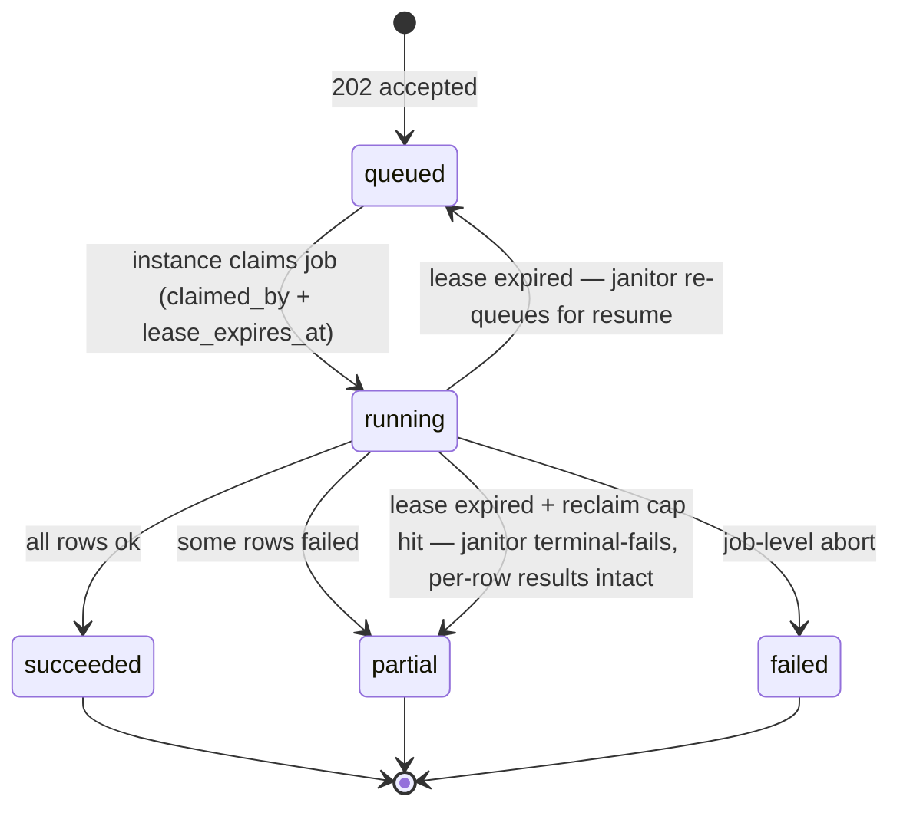
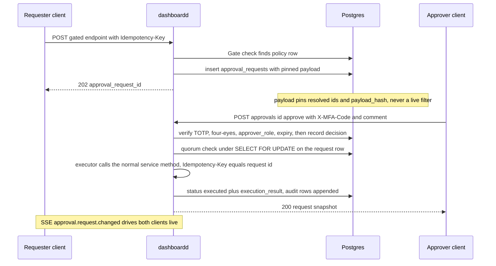

# 04 — API Contracts: `/v1/admin` Surface

> **Status:** DRAFT · **Owner:** Senior Backend Engineer · **Last updated:** 2026-07-04 · **Gated by:** /architecture-review, /security-audit

> This document is **the authoritative contract** for the Management Dashboard admin API until
> `docs/waterfall-dashboard/openapi-admin.yaml` reaches parity (§6, open item OI-API-1).
> Implementation agents follow it 1:1. It is consistent with the MASTER DESIGN SPEC §8, mirrors the
> conventions of `internal/api` (`server.go`, `dto.go`) and `docs/api/openapi.json`, honors the
> [doc 17](../17-Dashboard-Planning.md) panel → backing-service rule (every endpoint here backs a
> real panel; no orphan UI), and uses the [Glossary](../00-Project-Overview.md) verbatim: Tenant,
> Provider, Provider Key, Key Pool, Waterfall, Enrichment Job, Field, Confidence, Cost Ceiling,
> Idempotency Key. The governing invariant applies to every write on this surface: **"the model
> proposes, a deterministic gate disposes"** — the five gates **G1 tenant isolation**,
> **G2 idempotency**, **G3 bounded execution**, **G4 cost ceiling**, **G5 provenance** bind the
> dashboard exactly as they bind the engine.

---

## 1. Conventions

Every rule in this section applies to every endpoint in §2 unless a row's Notes column states an
enumerated exception. There are no per-module convention forks.

### 1.1 Base path, transport, payloads

- Base path: **`/v1/admin`**. All paths below are relative to it. Server: `cmd/dashboardd`
  (Go 1.22 mux patterns, e.g. `"POST /v1/admin/providers"`, `r.PathValue`).
- JSON only: requests and responses are `application/json` (exception: key import accepts
  `multipart/form-data`; cost export streams `application/x-ndjson`; the stream endpoint emits
  `text/event-stream`). All JSON is **snake_case**. Request decoding uses `DisallowUnknownFields`
  + `MaxBytesReader` (1 MiB default; import 25 MiB) — unknown body fields are a 400 `invalid_json`.
- Timestamps: UTC, format `2006-01-02T15:04:05Z`, everywhere (request params, response fields,
  SSE envelopes).
- Status codes used: 200, 201, 202, 400, 401, 403, 404, 409, 422, 429, 500 (per ADR-0012), plus
  **503** solely for SSE connection saturation (§3.5) — a deliberate, enumerated extension of the
  ADR-0012 set. 404 is returned for cross-Tenant objects — existence is never disclosed (G1).

### 1.2 Authentication and authorization (ADR-0018)

Two authenticators, one `Principal`, one middleware chain
(instrument → protected → requireRole → recoverer, extending `internal/api`):

| Caller | Mechanism | Details |
|---|---|---|
| Browser (SPA) | **Session cookie + CSRF** | Cookie `dash_session` (256-bit random id, `HttpOnly`, `Secure`, `SameSite=Lax`), row in `sessions`. Every non-GET request MUST carry `X-CSRF-Token` matching `sessions.csrf_token` (issued at login / MFA verify); mismatch → 403 `csrf_invalid`. Idle and absolute expiry per doc 05. |
| Machine (CI, scripts) | **JWT Bearer** | `Authorization: Bearer <jwt>` (HS256/RS256 via `internal/auth`). The scope claim MUST include exactly one role scope `role:operator` \| `role:tenant_admin` \| `role:tenant_user`, **plus** `admin:read` for read requests and `admin:write` for writes (doc 05 §1.1/§4.2); zero or multiple role scopes → 401 `unauthorized`. No CSRF (no cookie). |

- The role is derived **only** from the verified session/JWT scope, never from request bodies, and
  is bound per transaction as the `app.current_role` GUC alongside `app.current_tenant`
  (ADR-0020). All authorization is server-side; the SPA role guards are cosmetic.
- RBAC shorthand in §2 tables: **O** = operator, **TA** = tenant_admin, **TU** = tenant_user;
  `TA+` means tenant_admin or operator; `TU+` means any authenticated principal. `TA (BYO)` means
  tenant_admin, restricted by RLS to rows with `owner_tenant_id = app_current_tenant()`.
  Operator cross-Tenant reads exist only where ADR-0020 enumerates a policy, and every handler
  serving one writes an `audit_log` row.
- **IP allowlist**: when a Tenant has `ip_allowlists` rows, requests from other addresses fail
  403 `ip_not_allowed` (evaluated after authentication, before the handler).
- **MFA step-up**: the **closed catalog in doc 05 §5.4** — not only approval decisions — requires
  a fresh TOTP proof in the `X-MFA-Code` header (RFC 6238, ±1 step skew, recovery-code fallback):
  `POST approvals/{id}/approve|reject`, `POST providers/{id}/keys`,
  `POST providers/{id}/keys/import`, `POST keys/{id}/rotate`, `POST alerts/channels` (and any
  future channel-update endpoint), and `POST auth/mfa/enroll` when already enrolled
  (re-enrollment). Missing or invalid → 401 `mfa_required`. A valid `sessions.mfa_verified_at`
  does **not** substitute — the code is demanded per request. JWT machine principals cannot call
  step-up endpoints in v1 (no TOTP seed; doc 05 §5.4).

### 1.3 Idempotency (G2)

- **Every authenticated write** (POST, PUT, PATCH, DELETE) requires the `Idempotency-Key` header
  (opaque string, ≤ 128 chars). Missing → 400 `missing_idempotency_key`.
- The admin idempotency ledger is keyed `(tenant_id, key)`. Reuse with an **identical** body
  replays the stored response (same status and body, plus header `Idempotency-Replayed: true`).
  Reuse with a **different** body → **409 `idempotency_key_reuse`**.
- Enumerated exceptions (inherently replay-safe, pre-session): `POST auth/login`,
  `POST auth/mfa/verify`, `POST auth/logout`. All other auth writes (enroll, confirm, session
  delete) require the header.
- Approval-gated actions execute server-side with **Idempotency Key = approval request id** (§5),
  making quorum-triggered execution exactly-once.

### 1.4 Cursor pagination

- List endpoints take `?limit=&cursor=`. `limit` default 50, **hard cap 200** (the bounded-query
  guard); `limit > 200` or `limit < 1` → 400 `invalid_filter`.
- `cursor` is **opaque**: base64url of JSON `{"k": <last sort-key value>, "id": "<tie-break id>"}`
  produced by the `dash/db` cursor codec. Clients MUST NOT construct or parse it. Corrupt or
  undecodable cursor → 400 `invalid_cursor`. Cursors carry no authority — a replayed cursor is
  still filtered by RLS under the caller's Principal.
- Response envelope, uniform on every list:

```json
{
  "items": [],
  "next_cursor": "eyJrIjoiMjAyNi0wNy0wMlQwOToxNDowMloiLCJpZCI6ImItMTcifQ"
}
```

  `next_cursor` is `null` when the page is the last. Keyset (never offset) semantics: pages are
  stable under concurrent inserts; a row created after the cursor position may appear on a later
  page.

### 1.5 Filtering and sorting

- Filters are **typed query parameters** from a per-endpoint whitelist (§2 Notes) mapping to
  indexed columns. Repeating a parameter ORs its values; distinct parameters AND:
  `?status=active&status=paused&provider_id=hunter` ⇒ `status IN (active,paused) AND
  provider_id = 'hunter'`. Unknown parameter or malformed value → 400 `invalid_filter` (strict,
  the query-string analog of `DisallowUnknownFields`).
- Sorting: `?sort=<field>` ascending, `?sort=-<field>` descending, from a per-endpoint whitelist;
  default `-created_at` unless the table states otherwise. Unknown sort field → 400
  `invalid_filter`.
- There is no free-form query language anywhere on this surface (closed-vocabulary doctrine).

### 1.6 Uniform error body and error-code table

Every non-2xx response has exactly this shape (identical to `internal/api.writeError`):

```json
{ "error": { "code": "snake_case_code", "message": "human-readable detail" } }
```

The `code` vocabulary is **closed**. This table is the registry; adding a code is a doc change
first (repo discipline).

| HTTP | `error.code` | Meaning | Notes |
|---|---|---|---|
| 400 | `invalid_json` | Body not valid JSON, or unknown field | `DisallowUnknownFields` |
| 400 | `missing_idempotency_key` | Write without `Idempotency-Key` | §1.3 exceptions only |
| 400 | `invalid_cursor` | Cursor not decodable | §1.4 |
| 400 | `invalid_filter` | Unknown/malformed query param, sort field, limit out of range, unknown SSE topic | §1.5, §3 |
| 400 | `window_out_of_range` | Time-series `from`/`to` beyond the serving rollup's retention | §1.8 |
| 400 | `payload_too_large` | Body exceeds the endpoint's byte/row cap (import: 25 MiB / 50k rows; zip-ratio guard) | kept at 400 per the ADR-0012 status-code set |
| 401 | `unauthorized` | Missing/invalid/expired session or JWT | mirrors `internal/api` |
| 401 | `mfa_required` | MFA step not completed: login awaiting `auth/mfa/verify`, or a decision endpoint missing/failing `X-MFA-Code` | **new** |
| 403 | `forbidden` | Role/scope/ABAC does not permit the action (incl. four-eyes: approver = requester) | mirrors `requireScope` semantics |
| 403 | `csrf_invalid` | Session-cookie write without a matching `X-CSRF-Token` | browser callers only |
| 403 | `ip_not_allowed` | Caller IP outside the Tenant's `ip_allowlists` | **new** |
| 404 | `not_found` | Object absent — including objects belonging to another Tenant (G1: existence never disclosed) | |
| 409 | `idempotency_key_reuse` | `Idempotency-Key` reused with a different body | G2 |
| 409 | `conflict` | Lifecycle-state conflict: decision on a non-pending or expired approval, invalid Key state transition, action on an archived object | |
| 409 | `version_conflict` | Config-version lifecycle conflict: PATCH on a `published`/`archived` version; publish/rollback re-check failed — version not `validated`, `payload_hash` drifted since validate, or the locked `config_active` pointer no longer equals `expected_active_version_id` (losing a concurrent publish) | **new**; docs 02 §4.1, 07 §6, 12 P3 gate, 13 §9.3 |
| 409 | `approval_required` | The action is approval-gated and a **pending** approval request already exists for the same target; message carries the pending `approval_request_id` | **new**; first submission returns 202, not this |
| 409 | `bulk_job_conflict` | A bulk job with an overlapping scope fingerprint is already in flight (one in-flight job per kind + scope) | **new**; message carries the running `job_id` |
| 422 | `validation_failed` | Body is well-formed but semantically invalid (bad enum value, threshold out of range, unknown Field name, budget alert_pct not in 1..100, …) | **new** on the admin surface; the engine API keeps `validation_error` — deliberate, recorded divergence |
| 429 | `rate_limited` | Per-principal rate limit exceeded; `Retry-After` header set | mirrors `internal/api` |
| 429 | `queue_full` | Async submission backpressure (bulk job intake saturated) | |
| 500 | `internal` | Unhandled error / recovered panic; no internals leaked | |
| 503 | `sse_saturated` | SSE connect refused: instance at `SSE_MAX_CONNS`; `Retry-After` header set | **new**; §3.5 — SPA degrades to the 15s refetch fallback |

### 1.7 Asynchronous 202 envelopes

Two — and only two — 202 body shapes exist:

```json
{ "job_id": "7e2c4a6b-8d0f-4a1c-9e3b-5d7f9a0c2e4b" }
```

for accepted bulk/async work (`job_id` IS the durable job row's uuid — `bulk_jobs.id`, or
`key_import_batches.id` for key imports; poll `GET /bulk-jobs/{id}` or `GET /key-imports/{job_id}`;
progress on SSE, §3), and

```json
{ "approval_request_id": "9b2f6a3e-4c1d-4e8a-9f00-2d5c8a7b1e42" }
```

when the approvals gate intercepts the write (§5). A single endpoint may return either (e.g.
`POST keys/bulk` returns `{job_id}` for `op=disable` but `{approval_request_id}` for `op=delete`).
Clients MUST discriminate on the field name.

### 1.8 Time-series windows, budget periods, and UTC (resolves RF-4)

- Time-series endpoints (`providers/{id}/stats`, `health/.../timeline`, `keys/{id}/usage`,
  `queues/{name}/stats`, `cost/*`) take `from`, `to` (UTC timestamps) and an advisory `res`
  (`1m` | `1h` | `1d`). The server picks the coarsest rollup resolution yielding ≤ ~500 buckets;
  `res` never forces a finer resolution than the window allows.
- Windows are **bounded by rollup retention** (retention matrix: doc 03 — e.g. 1m/7d, 1h/90d,
  1d/2y for `provider_stats_*`; 2y for `cost_rollup_1d`). A `from` earlier than the serving
  rollup's retention horizon, or `from >= to`, → **400 `window_out_of_range`** with the permitted
  horizon in the message. All buckets are UTC-aligned.
- **Budget periods are UTC-anchored (normative; closes RF-4).** A budget with `period = "day"`
  covers a UTC calendar day `[00:00:00Z, 24:00:00Z)`; `period = "month"` covers a UTC calendar
  month. Periods **latch and roll over on UTC day/month boundaries** — never on Tenant-local
  time. An *actual*-spend threshold alert for a given (budget scope, period instance,
  threshold_pct) **latches at most once per UTC period** and re-arms only at the UTC rollover;
  *forecast* threshold alerts may re-arm when the projection drops back below the threshold and
  stay suppressed entirely until ≥ 14 days of history exist (doc 10 owns evaluator mechanics).
  Doctrine: **budgets alert, G4 Cost Ceilings enforce** — nothing in this API adds a second
  enforcement path.

---

## 2. Endpoint reference

One subsection per module. Columns: Method | Path (relative to `/v1/admin`) | Purpose | RBAC
(§1.2 shorthand) | Notes. Every write requires `Idempotency-Key` (§1.3); every list paginates per
§1.4; approval-gated rows say so explicitly. Request/response examples follow each table for the
load-bearing endpoints.

### 2.1 Auth and sessions

| Method | Path | Purpose | RBAC | Notes |
|---|---|---|---|---|
| POST | `/auth/login` | Verify email+password (PBKDF2); start session | public | Idempotency-Key exempt; sets `dash_session` cookie; MFA-enrolled Users get `status:"mfa_required"` |
| POST | `/auth/mfa/verify` | Complete login with TOTP or recovery code | pre-session | Idempotency-Key exempt; returns `csrf_token` |
| POST | `/auth/mfa/enroll` | Begin TOTP enrollment; returns provisioning URI + secret (once) | TU+ | seed sealed to `secret_envelopes` (`totp_seed`); re-enrollment (already enrolled) requires `X-MFA-Code` (doc 05 §5.4) |
| POST | `/auth/mfa/enroll/confirm` | Confirm enrollment with first code; returns recovery codes (once) | TU+ | |
| POST | `/auth/logout` | Revoke current session | TU+ | Idempotency-Key exempt |
| GET | `/auth/me` | Current User, role, Tenant, ABAC attrs, session expiry | TU+ | SPA bootstrap call |
| GET | `/auth/sessions` | List sessions (own; TA+ sees Tenant's) | TU+ | filters: `user_id` (TA+) |
| DELETE | `/auth/sessions/{id}` | Revoke a session | TU+ (own) / TA+ | 404 across Tenants |

**POST `/v1/admin/auth/login`**

```json
// request
{ "email": "ops@acme.example", "password": "correct horse battery staple" }

// 200 — MFA-enrolled User: session exists but is not yet usable for writes
{ "status": "mfa_required" }

// 200 — MFA not enrolled (permitted only where doc 05 policy allows)
{
  "status": "ok",
  "csrf_token": "vX2ap0N4qkzB8m1cQfTL7w",
  "user": { "id": "6f6f6c2e-6f70-4552-a001-9f2d3c4b5a69", "email": "ops@acme.example",
            "role": "tenant_admin", "tenant_id": "acme", "mfa_enrolled": false }
}

// 401 {"error":{"code":"unauthorized","message":"invalid email or password"}}
```

**POST `/v1/admin/auth/mfa/verify`**

```json
// request
{ "code": "492817" }

// 200
{
  "status": "ok",
  "csrf_token": "vX2ap0N4qkzB8m1cQfTL7w",
  "user": { "id": "6f6f6c2e-6f70-4552-a001-9f2d3c4b5a69", "email": "ops@acme.example",
            "role": "tenant_admin", "tenant_id": "acme", "mfa_enrolled": true }
}

// 401 {"error":{"code":"mfa_required","message":"invalid or expired code"}}
```

### 2.2 Users, roles, IP allowlists

| Method | Path | Purpose | RBAC | Notes |
|---|---|---|---|---|
| GET | `/users` | List Users | TA+ | filters: `role`, `status`, `email` (exact); O cross-Tenant read is enumerated + audited |
| POST | `/users` | Create User (invite) | TA+ | 201; password set via reset flow |
| GET | `/users/{id}` | User detail | TA+ | |
| PATCH | `/users/{id}` | Update role/status/ABAC attrs | TA+ | role changes audited; cannot self-demote last tenant_admin → 409 `conflict` |
| DELETE | `/users/{id}` | Deactivate User (soft: `status`) | TA+ | sessions revoked in same tx |
| POST | `/users/{id}/reset-password` | Issue reset (invalidates sessions) | TA+ | |
| GET | `/roles` | Static role×action matrix (doc 05) | TU+ | drives SPA guards; server remains authority |
| GET | `/ip-allowlists` | List Tenant CIDR allowlist | TA+ | |
| PUT | `/ip-allowlists` | Replace the allowlist set | TA+ | full-replacement PUT; empty list disables enforcement; lockout guard: the caller's current IP must match the new set → else 422 `validation_failed` |

### 2.3 Providers

Provider catalog rows are Class P (platform-owned). Tenants read the `tenant_readable` catalog
projection (identity, capabilities, `health_score`) — never breaker/limit internals. The
`status` trichotomy (ADR-0009: `ACTIVE-CANDIDATE` / `DEPRIORITIZED` / `EXCLUDED`) is distinct
from runtime `op_state` (`enabled`/`disabled`/`paused`/`maintenance`); `effective_available` is
**computed server-side** (one function) and returned — clients never derive it.

> **Open item OI-M2-1 (P1, `internal/dash/providers`):** the `providers_catalog` view (migration
> 0005) does not project `op_state`, so a Tenant-scope response computes `effective_available` from
> the **inclusion-status conjunct only** (op_state treated as `enabled`); the full status × op_state
> conjunction is returned to Operators (full-row) and drives all engine routing. Projecting
> `op_state` into `providers_catalog` would let Tenants receive the full conjunction — a schema
> follow-up for the view owner. P1 also serves `GET /providers/{id}/stats` as an empty-series stub
> and runs `POST /providers/{id}/benchmark` inline (no async `job_id`) until the observability
> rollups / job queue land; `List` keyset-orders on `id` (the documented sort menu is deferred).

| Method | Path | Purpose | RBAC | Notes |
|---|---|---|---|---|
| GET | `/providers` | List catalog | TU+ (projection) / O (full) | filters: `status`, `op_state`, `category`, `region`, `tag`, `q` (name prefix); sort: `priority`, `health_score`, `credits_remaining`, `-created_at` (`credits_remaining` backs the doc 09 §1.2 overview-tile drill-down) |
| POST | `/providers` | Create Provider (config-first onboarding) | O | 201; new Providers default `status=DEPRIORITIZED` until compliance review (ADR-0009) |
| GET | `/providers/{id}` | Detail | TU+ (projection) / O (full) | includes computed `effective_available` + failed conjunct |
| PATCH | `/providers/{id}` | Update catalog/ops fields | O | partial update; `attrs` is presentation-only (planner-read tunables are typed columns) |
| DELETE | `/providers/{id}` | Delete Provider | O | **approval-gated** (`provider_delete`) → 202 `{approval_request_id}` |
| POST | `/providers/{id}/enable` | `op_state=enabled` | O | body optional `{"reason":""}` |
| POST | `/providers/{id}/disable` | `op_state=disabled` | O | |
| POST | `/providers/{id}/pause` | `op_state=paused` | O | |
| POST | `/providers/{id}/maintenance` | `op_state=maintenance` | O | suppresses that Provider's alert scope (doc 10) |
| POST | `/providers/{id}/test` | Smoke-test descriptor via `provider.Call` with a leased Provider Key | O | G3-bounded; spends real credits — G4-capped |
| POST | `/providers/{id}/health-check` | Run one health check now | O | |
| POST | `/providers/{id}/refresh-metadata` | Re-pull descriptor metadata | O | |
| POST | `/providers/{id}/sync-credits` | Pull provider-reported credit balance | O | measured signal for modeled-vs-measured drift |
| POST | `/providers/{id}/benchmark` | Run fixed sample through the real adapter | O | 202 `{job_id}`; G3/G4-bounded; spend recorded in cost ledgers |
| POST | `/providers/{id}/duplicate` | Clone catalog row as new draft Provider | O | 201 |
| POST | `/providers/{id}/archive` | Soft-archive (`archived_at`; history intact) | O | **approval-gated** (`provider_archive`) → 202 |
| GET | `/providers/{id}/health` | Current health summary | O | Tenant-visible health arrives via the catalog projection |
| GET | `/providers/{id}/stats` | Time series from `provider_stats_*` | O | `?res=&from=&to=` per §1.8; per-error-class failure columns |
| GET | `/providers/compare` | Side-by-side declared vs measured per Field | O | `?ids=a,b,c` (≤ 10) |
| GET | `/providers/rankings` | Measured cost-per-hit ranking per Field | O | |
| GET | `/providers/coverage` | Fields × Providers declared-capability grid | TU+ | catalog data only |

**GET `/v1/admin/providers?status=ACTIVE-CANDIDATE&op_state=enabled&limit=2`** (pagination envelope)

```json
{
  "items": [
    {
      "id": "hunter", "display_name": "Hunter", "category": "email_finder",
      "status": "ACTIVE-CANDIDATE", "op_state": "enabled",
      "effective_available": true, "unavailable_reason": null,
      "capabilities": [
        { "field": "work_email", "cost_credits": 1, "expected_confidence": 0.90 }
      ],
      "health_score": 0.98, "priority": 10, "sunset_at": null,
      "created_at": "2026-06-01T09:00:00Z", "updated_at": "2026-07-01T17:20:00Z"
    },
    {
      "id": "prospeo", "display_name": "Prospeo", "category": "email_finder",
      "status": "ACTIVE-CANDIDATE", "op_state": "paused",
      "effective_available": false, "unavailable_reason": "op_state_paused",
      "capabilities": [
        { "field": "work_email", "cost_credits": 1, "expected_confidence": 0.86 }
      ],
      "health_score": 0.91, "priority": 20, "sunset_at": null,
      "created_at": "2026-06-03T11:30:00Z", "updated_at": "2026-07-02T08:05:00Z"
    }
  ],
  "next_cursor": "eyJrIjoyMCwiaWQiOiJwcm9zcGVvIn0"
}
```

**POST `/v1/admin/providers`** (create; headers `Idempotency-Key: 7f3c…`)

```json
// request (catalog + integration descriptor; full column reference: doc 03)
{
  "id": "prospeo",
  "display_name": "Prospeo",
  "category": "email_finder",
  "base_url": "https://api.prospeo.io",
  "api_version": "v1",
  "auth_scheme": "api-key-header",
  "auth_header": "X-KEY",
  "capabilities": [
    { "field": "work_email", "cost_credits": 1, "expected_confidence": 0.86 }
  ],
  "timeout_ms": 8000,
  "rate_limit_rpm": 300,
  "concurrency_limit": 20,
  "retry_policy": { "max_attempts": 3, "backoff_ms": 250 },
  "breaker_threshold": 5,
  "breaker_cooldown_s": 60,
  "unit_cost_credits": 1,
  "region": ["us", "eu"],
  "tags": ["email"]
}

// 201 — status defaults to DEPRIORITIZED pending compliance review (ADR-0009)
{
  "id": "prospeo", "display_name": "Prospeo", "status": "DEPRIORITIZED",
  "compliance_review_status": "pending", "op_state": "disabled",
  "effective_available": false, "unavailable_reason": "status_deprioritized",
  "created_at": "2026-07-02T10:00:00Z", "updated_at": "2026-07-02T10:00:00Z"
}
```

**POST `/v1/admin/providers/hunter/pause`** (Provider action)

```json
// request (optional)
{ "reason": "vendor maintenance window announced for 2026-07-03" }

// 200 — audited; SSE provider.health.changed follows
{ "id": "hunter", "op_state": "paused", "effective_available": false,
  "unavailable_reason": "op_state_paused", "updated_at": "2026-07-02T10:04:11Z" }
```

### 2.4 Provider Keys, imports, bulk, Key Pools

No endpoint ever returns a secret: responses carry `secret_last4` and `fingerprint_prefix`
(keyed HMAC, 8 hex chars) only. There is **no reveal endpoint** (write-only secrets).

| Method | Path | Purpose | RBAC | Notes |
|---|---|---|---|---|
| GET | `/providers/{id}/keys` | List a Provider's Keys | O / TA (BYO) | filters: `status`, `health`, `region`, `environment`, `tag`, `rotation_group`, `imported_batch_id`, `pool_id`; sort: `-last_used_at`, `label`, `weight` |
| POST | `/providers/{id}/keys` | Create Provider Key (seal secret) | O / TA (BYO) | 201; plaintext sealed immediately, never persisted; `X-MFA-Code` required (doc 05 §5.4) |
| GET | `/keys/{id}` | Key metadata + computed availability | O / TA (BYO) | |
| PATCH | `/keys/{id}` | Update metadata/limits/weight | O / TA (BYO) | never mutates ciphertext |
| DELETE | `/keys/{id}` | Archive a single Key (soft, terminal) | O / TA (BYO) | audited; only **bulk** delete is approval-gated |
| POST | `/keys/{id}/enable` | `status=active` (from paused/disabled) | O / TA (BYO) | invalid transition → 409 `conflict` (KM-3 state machine, doc 07) |
| POST | `/keys/{id}/disable` | `status=disabled` | O / TA (BYO) | |
| POST | `/keys/{id}/rotate` | Create successor Key with overlap window | O / TA (BYO) | see example; `overlap_s=0` = compromise mode; `X-MFA-Code` required (doc 05 §5.4) |
| POST | `/keys/{id}/test` | One `provider.Call` with this Key | O / TA (BYO) | G3-bounded, spends credits |
| POST | `/keys/{id}/health-check` | Probe this Key now | O / TA (BYO) | |
| POST | `/keys/{id}/refresh-credits` | Sync provider-reported balance for this Key | O / TA (BYO) | |
| POST | `/providers/{id}/keys/import` | Bulk import (csv/xlsx/json/paste) | O / TA (BYO) | 202 `{job_id}`; multipart `file`+`format` or JSON `{"format":"paste","data":"…"}`; caps 25 MiB / 50k rows (§4); `X-MFA-Code` required (doc 05 §5.4) |
| GET | `/key-imports/{job_id}` | Import batch progress/results | O / TA (BYO) | §4 progress schema; `job_id` IS the `key_import_batches.id` uuid |
| POST | `/keys/bulk` | Bulk op by ids or filter | O / TA (BYO) | 202 `{job_id}`; `op=delete` **approval-gated** (`key_bulk_delete`) → 202 `{approval_request_id}`; `"preview":true` → 200 `{"matched":N}` |
| GET | `/bulk-jobs/{id}` | Bulk job progress/results | O / TA (BYO) | §4 |
| GET | `/keys/{id}/usage` | Per-Key usage time series (`key_usage_*`) | O / TA (BYO) | `?res=&from=&to=` per §1.8; **operator-only in v1 except BYO**: tenant_admin may read usage for Keys whose `owner_tenant_id` = caller's Tenant — `key_usage_*` is Class P (doc 03 §3), so the BYO read executes through a service method under the platform RLS context after the `owner_tenant_id` check (doc 05 §3.2 pattern) |
| GET | `/key-pools` | List Key Pools | O / TA (BYO) | filters: `provider_id`, `strategy`, `owner_tenant_id` (O) |
| POST | `/key-pools` | Create Key Pool | O / TA (BYO) | 201; selector = `provider_id:name` matches `AuthDescriptor.KeyPoolSelector` |
| GET | `/key-pools/{id}` | Pool detail + member summary | O / TA (BYO) | |
| PATCH | `/key-pools/{id}` | Rename/params/status | O / TA (BYO) | |
| DELETE | `/key-pools/{id}` | Delete pool (members unaffected) | O / TA (BYO) | 409 `conflict` if referenced by an active routing policy |
| PUT | `/key-pools/{id}/members` | Replace member Key set | O / TA (BYO) | full-replacement PUT `{"key_ids":[…]}` |
| PUT | `/key-pools/{id}/strategy` | Set selection strategy + params | O / TA (BYO) | strategy enum of 12 (doc 07 catalog); bumps the `key_pool` config epoch in-tx (see below); rebuilt `PoolState` visible ≤ 1s UNVERIFIED |

**Key-pool epoch propagation (normative).** Every mutation that changes what the rotation engine
may select — `PUT /key-pools/{id}/strategy`, `PUT /key-pools/{id}/members`,
`PATCH /key-pools/{id}`, `DELETE /key-pools/{id}`, and Provider Key status transitions
(enable/disable/rotate/archive, including their bulk-job row commits) — bumps
`config_epochs (tenant_id = 'platform', kind = 'key_pool')` **inside the same write
transaction**, through the configver-owned `BumpEpoch(ctx, kind)` API (doc 03). Propagation then follows
doc 07 §10 verbatim (NOTIFY + 1s epoch poll): each instance's `PoolState` builder observes the
new epoch and rebuilds the affected pool state, which is the mechanism behind the strategy row's
"≤ 1s" claim (the latency figure itself stays UNVERIFIED until the P12 soak). The `key_pool`
epoch has a second registered writer (`internal/dash/keys` / `keypools`) alongside `configver`,
which executes **exclusively through that same configver-owned `BumpEpoch` API** so both docs
describe one mechanism — recorded in the doc 03 §6 one-owner registry as an enumerated exception
for `kind = key_pool` only (the doc 07 §8.1 Principle-3 exemption).

**POST `/v1/admin/providers/hunter/keys`** (create Key)

```json
// request — `secret` is write-only; it is sealed (AES-256-GCM envelope, ADR-0017) in-request
{
  "label": "hunter-prod-07",
  "secret": "hk_live_9a8b7c6d5e4f3a2b1c0d",
  "auth_method": "api-key-header",
  "weight": 100,
  "priority": 1,
  "region": "us",
  "environment": "production",
  "daily_limit": 5000,
  "monthly_limit": 100000,
  "rpm_limit": 60,
  "expires_at": "2027-01-01T00:00:00Z",
  "pool_ids": ["c3a1f8e2-2b4d-4f6a-8e0c-1d9b7a5c3e21"],
  "tags": ["prod"]
}

// 201 — never echoes the secret
{
  "id": "b8f4c2e0-9d3a-4b7c-a1e5-6f2d8c0b4a97",
  "provider_id": "hunter",
  "label": "hunter-prod-07",
  "status": "active",
  "health": "unknown",
  "secret_last4": "1c0d",
  "fingerprint_prefix": "3fa9c1d2",
  "secret_envelope_id": "5e7a9c1b-3d5f-4a8e-b0c2-4f6e8a0d2b13",
  "weight": 100, "priority": 1, "region": "us", "environment": "production",
  "daily_limit": 5000, "monthly_limit": 100000, "rpm_limit": 60,
  "expires_at": "2027-01-01T00:00:00Z",
  "created_at": "2026-07-02T10:12:00Z", "updated_at": "2026-07-02T10:12:00Z"
}
```

**POST `/v1/admin/keys/{id}/rotate`**

```json
// request — new vendor-issued secret; overlap keeps the old Key serving during cutover (KM-3)
{ "secret": "hk_live_NEW0aa11bb22cc33dd44", "overlap_s": 86400 }

// 200
{
  "successor_key_id": "e2d4f6a8-0b1c-4d3e-9f5a-7c8b9d0e1f2a",
  "old_key_id": "b8f4c2e0-9d3a-4b7c-a1e5-6f2d8c0b4a97",
  "old_key_status": "rotating",
  "overlap_until": "2026-07-03T10:15:00Z"
}
// overlap_s: 0 is the compromise path — old Key archives immediately (runbook: key compromise)
```

**POST `/v1/admin/providers/hunter/keys/import`** (bulk import)

```json
// request (paste variant; csv/xlsx/json via multipart file= + format=)
{ "format": "paste", "data": "label,secret,region\nhunter-08,hk_live_aa11,us\nhunter-09,hk_live_bb22,eu\n" }

// 202 — job_id IS the key_import_batches.id uuid
{ "job_id": "1f7a3b58-9c2d-4e6f-8a1b-3c5d7e9f0a2b" }
```

**POST `/v1/admin/keys/bulk`** (bulk op)

```json
// request — filter predicate, not an id list; re-evaluated under RLS at execution (§4)
{
  "filter": { "provider_id": "hunter", "status": ["auth_failed"], "imported_batch_id": "d2b8f0a4-6c1e-4f3a-9b7d-5e0c2a4b6d8f" },
  "op": "disable",
  "reason": "poisoned import batch"
}

// 202
{ "job_id": "4a8c0e2b-6d1f-4b3a-8c5e-7f9a1b3d5c7e" }

// same body with "op":"delete" → approval-gated:
// 202 { "approval_request_id": "9b2f6a3e-4c1d-4e8a-9f00-2d5c8a7b1e42" }
```

**`op=delete` semantics (the irreversibility boundary).** Bulk `delete` is the only irreversible
Key operation: the execution transaction **hard-deletes** the matched `provider_keys` rows *and*
their `secret_envelopes`, after the audit `before`-snapshot pins each Key's metadata,
`secret_last4`, and `fingerprint_prefix` (ciphertext is never snapshotted — the secret is
unrecoverable by design). `key_usage_*` rollups are **retained** and keep the deleted `key_id`,
so G5 cost/usage attribution survives the delete. Every other path — single-Key
`DELETE /keys/{id}`, `op=disable`, archive — is a soft, history-preserving state change; that
asymmetry is why only bulk `delete` is approval-gated (`key_bulk_delete`, §5.1).

**PUT `/v1/admin/key-pools/{id}/strategy`**

```json
// request
{ "strategy": "weighted", "strategy_params": { "reband_interval_s": 1 } }

// 200
{
  "id": "c3a1f8e2-2b4d-4f6a-8e0c-1d9b7a5c3e21",
  "provider_id": "hunter", "name": "default",
  "selector": "hunter:default",
  "strategy": "weighted", "strategy_params": { "reband_interval_s": 1 },
  "member_count": 12, "status": "active", "updated_at": "2026-07-02T10:20:00Z"
}
```

### 2.5 Rotation engine

| Method | Path | Purpose | RBAC | Notes |
|---|---|---|---|---|
| GET | `/key-pools/{id}/selection-state` | Debug view of in-memory `PoolState` (bands, ring index, availability bools) | O / TA (BYO) | diagnostic; values are per-instance caches; operator-only in v1 except pools whose `owner_tenant_id` = caller's Tenant (BYO), which tenant_admin may read (doc 05 §3.2 service-method path) |
| GET | `/rotation/strategies` | Static catalog of the 12 strategies + param schemas | TU+ | drives the strategy picker; closed vocab |
| POST | `/key-pools/{id}/simulate` | Simulate N selections against current state — zero egress | O / TA (BYO) | body `{"draws":1000}`; returns per-Key distribution |
| GET | `/rotation/triggers` | Current error-class → state-machine trigger config | O | KM-3 mapping (doc 07) |
| PUT | `/rotation/triggers` | Update trigger thresholds/cooldowns | O | validators reject configs that disable AUTH → `auth_failed` handling |

### 2.6 Provider health

| Method | Path | Purpose | RBAC | Notes |
|---|---|---|---|---|
| GET | `/health/providers` | Fleet health summary (worst-first) | O | filters: `status`, `region` |
| GET | `/health/providers/{id}/timeline` | 90-day day-buckets + 48h hour-buckets | O | from `provider_health_1d` fold + raw checks; §1.8 windows |
| GET | `/health/schedules` | Per-Provider check schedules | O | |
| PUT | `/health/schedules` | Replace schedule set (interval, jitter, regions) | O | bounded concurrency enforced server-side |
| POST | `/health/checks/run` | Run checks now (`{"provider_ids":[…]}`) | O | 202 `{job_id}` when > 5 Providers, else 200 inline |
| GET | `/health/regional` | Health by region matrix | O | |

### 2.7 Routing policies and Waterfall workflows (config versioning)

Both kinds share one lifecycle engine (`configver`): draft → validate → publish → rollback, with
`config_versions` immutable once published/archived — the `payload_hash` pinned at validate is
cleared by any subsequent edit — and `config_active` as the pointer (doc 07 owns payload JSON
Schemas and validation rules). Path shape (pinned here; see Open items OI-API-3):
`/{kind}/{scope_key}/versions[/{id}[/{action}]]` with `kind` ∈ `routing` | `workflows` and
`scope_key` a URL-safe token from doc 07 (e.g. `default`, `country:DE`, `product:pro`). Version
`{id}` is the `config_versions` uuid.

**Publish/rollback concurrency token (normative).** Publish and rollback accept an optional
`expected_active_version_id` body field — the `config_active` pointer value the caller expects to
supersede. It **defaults to the draft's `parent_version_id`** for a normal publish, and to the
current active version for a rollback. The publish/rollback transaction serializes on the
`config_active` pointer row (`SELECT active_version_id … FOR UPDATE`; doc 03 §9.3, doc 07 §6): if
the locked `active_version_id` ≠ `expected_active_version_id` the caller lost a concurrent race and
gets **409 `version_conflict`**. For gated publishes the value is captured at request time and
pinned into the approval payload (doc 02 §4.1), so quorum executes against the exact pointer state
the approver reviewed.

| Method | Path | Purpose | RBAC | Notes |
|---|---|---|---|---|
| GET | `/routing` | List routing scopes + active version + epoch | TU+ | resolver returns effective values with source scope (tri-state inherit/off/on) |
| GET | `/routing/{scope_key}/versions` | Version history for a scope | TU+ | sort `-version` |
| POST | `/routing/{scope_key}/versions` | Create draft (payload = routing_policy schema) | TA+ | 201 `status:"draft"` |
| GET | `/routing/{scope_key}/versions/{id}` | Version detail incl. `validation_report` | TU+ | |
| PATCH | `/routing/{scope_key}/versions/{id}` | Edit draft/validated payload | TA+ | allowed while status ∈ {`draft`, `validated`}; a PATCH on a `validated` version clears `payload_hash` and reverts it to `draft` (must re-validate); `published`/`archived` → 409 `version_conflict` |
| POST | `/routing/{scope_key}/versions/{id}/validate` | Run validators; pin `payload_hash` | TA+ | 200 with report (report may contain errors — validation failure is not an HTTP error) |
| POST | `/routing/{scope_key}/versions/{id}/publish` | Atomic pointer flip + epoch bump | TA+ | **approval-gated** (`routing_publish`); 409 `version_conflict` if not `validated` or hash drift |
| POST | `/routing/{scope_key}/versions/{id}/dry-run` | `router.Planner` vs draft — **zero egress** | TA+ | G3: no Provider calls; uses current reservation values |
| POST | `/routing/{scope_key}/versions/{id}/clone` | Copy version to new draft | TA+ | 201 |
| POST | `/routing/{scope_key}/rollback` | Publish a prior version (`{"to_version":N}`) | TA+ | **approval-gated** (it *is* a publish); re-check failure → 409 `version_conflict`; nothing destroyed |
| GET | `/workflows` | Denormalized Waterfall workflow index (`workflow_index`) | TU+ | filters: `trigger`, `q` |
| GET | `/workflows/{scope_key}/versions` | As routing | TU+ | payload = waterfall_workflow schema |
| POST | `/workflows/{scope_key}/versions` | Create draft | TA+ | validators reject G3/G4 overrides |
| GET | `/workflows/{scope_key}/versions/{id}` | Detail | TU+ | |
| PATCH | `/workflows/{scope_key}/versions/{id}` | Edit draft/validated | TA+ | same PATCH rules as routing |
| POST | `/workflows/{scope_key}/versions/{id}/validate` | Validate + pin hash | TA+ | |
| POST | `/workflows/{scope_key}/versions/{id}/publish` | Publish | TA+ | **approval-gated** (`workflow_publish`) |
| POST | `/workflows/{scope_key}/versions/{id}/dry-run` | Simulate — zero egress | TA+ | returns Provider order, expected cost/Confidence |
| POST | `/workflows/{scope_key}/versions/{id}/clone` | Clone to draft | TA+ | |
| POST | `/workflows/{scope_key}/rollback` | Publish prior version | TA+ | approval-gated |
| GET | `/config/epochs` | Current epoch per (kind) for cache validation | TU+ | cheap poll target for machine clients |

**POST `/v1/admin/routing/country:DE/versions`** (create draft)

```json
// request — payload conforms to the routing_policy JSON Schema (doc 07 §2)
{
  "payload": {
    "schema_version": 1,
    "scope": { "country": "DE" },
    "provider_overrides": {
      "hunter":  { "mode": "on", "priority": 1 },
      "prospeo": { "mode": "inherit" }
    },
    "waterfall": {
      "order": ["hunter", "prospeo"]
    },
    "thresholds": {
      "confidence_target": 0.85,
      "max_cost_credits_per_record": 5
    }
  }
}

// 201
{
  "id": "3c9d1e5f-7a2b-4c8d-9e0f-1a3b5c7d9e2f",
  "kind": "routing_policy", "scope_key": "country:DE", "version": 13,
  "status": "draft", "parent_version_id": "aa11bb22-cc33-4d44-9e55-ff6677889900",
  "created_by": "6f6f6c2e-6f70-4552-a001-9f2d3c4b5a69",
  "created_at": "2026-07-02T11:00:00Z"
}
```

**POST `…/versions/{id}/validate`**

```json
// 200 — report stored on the version; payload_hash pinned (sha256, plain hex); status validated
// only when errors is empty. Report shape and entry shape {rule, code, severity, path, message}
// are normative in doc 07 §5 (validation rule catalog VR-1..VR-16).
{
  "id": "3c9d1e5f-7a2b-4c8d-9e0f-1a3b5c7d9e2f",
  "status": "validated",
  "payload_hash": "7d1a9c2e4b6f8a0c1d3e5f7a9b0c2d4e6f8a1b3c5d7e9f0a2b4c6d8e0f1a3b5c",
  "validation_report": {
    "validated_at": "2026-07-02T11:03:00Z",
    "payload_hash": "7d1a9c2e4b6f8a0c1d3e5f7a9b0c2d4e6f8a1b3c5d7e9f0a2b4c6d8e0f1a3b5c",
    "errors": [],
    "warnings": [
      { "rule": "VR-12", "code": "provider_sunsetting", "severity": "warning",
        "path": "/waterfall/order/1",
        "message": "provider prospeo sunsets 2026-07-20; plan failover order" }
    ]
  }
}
```

**POST `…/versions/{id}/publish`**

```json
// request (optional) — expected_active_version_id defaults to this draft's parent_version_id;
// it is captured now and pinned into the approval payload for the gated execution
{ "expected_active_version_id": "aa11bb22-cc33-4d44-9e55-ff6677889900" }

// 202 — always: routing_publish is approval-gated fail-closed (§5; built-in default policy
// applies when no approval_policies row exists, doc 05 §9.1)
{ "approval_request_id": "9b2f6a3e-4c1d-4e8a-9f00-2d5c8a7b1e42" }

// 200 — executor result after quorum (one tx = SELECT config_active FOR UPDATE, re-check
// validated+hash+expected_active_version_id, archive prior active, flip config_active,
// epoch bump, audit row, NOTIFY); stored in execution_result, replayed via the G2 ledger
{
  "kind": "routing_policy", "scope_key": "country:DE",
  "active_version_id": "3c9d1e5f-7a2b-4c8d-9e0f-1a3b5c7d9e2f",
  "version": 13, "epoch": 42, "published_at": "2026-07-02T11:06:00Z"
}

// 409 {"error":{"code":"version_conflict","message":"version is not validated or payload changed since validate"}}
```

**POST `…/versions/{id}/dry-run`** (zero egress — G3)

```json
// request (optional sample subject context)
{ "sample": { "country": "DE", "want": ["work_email", "mobile_phone"] } }

// 200 — resolved_scope/by_field/max_committed_credits/stop_projection/warnings are normative in
// doc 07 §7; zero_egress and diff_vs_active are additive fields of this admin surface
{
  "zero_egress": true,
  "resolved_scope": {
    "levels_consulted": ["country", "default"],
    "overrides": { "hunter": { "effective": "on", "source": "country:DE", "source_version": 13 } }
  },
  "by_field": {
    "work_email": [
      { "provider": "hunter",  "cost_credits": 1, "expected_confidence": 0.90 },
      { "provider": "prospeo", "cost_credits": 1, "expected_confidence": 0.86 }
    ],
    "mobile_phone": [
      { "provider": "twilio-lookup", "cost_credits": 2, "expected_confidence": 0.88 }
    ]
  },
  "max_committed_credits": 4,
  "stop_projection": { "condition": "target-met", "expected_providers_used": 2 },
  "warnings": [],
  "diff_vs_active": { "provider_order_changed": true, "removed": [], "added": ["prospeo"] }
}
```

**POST `/v1/admin/routing/country:DE/rollback`**

```json
// request — expected_active_version_id defaults to the current active version
{ "to_version": 12, "expected_active_version_id": "3c9d1e5f-7a2b-4c8d-9e0f-1a3b5c7d9e2f" }

// 202 — rollback is a publish; same gate, same code path
{ "approval_request_id": "c4e6a8b0-1d2f-4a3c-8e5b-9f0a1b2c3d4e" }
```

### 2.8 Queues and dead letters

Read model over `job_outbox` (owned by `pgoutbox`; the dashboard never writes it directly —
redrive delegates to `pgoutbox` APIs). Engine-agnostic vocabulary (QS-TMP-1 hedge): states
`waiting` `running` `scheduled` `delayed` `retry` `failed` `dead`.

| Method | Path | Purpose | RBAC | Notes |
|---|---|---|---|---|
| GET | `/queues` | Queue list with per-state count vector + `oldest_age_s` | O | from `queue_stats_1m` + `queue_defs` |
| GET | `/queues/{name}/stats` | Time series enq/deq/depth/oldest-age | O | `?res=&from=&to=` per §1.8 |
| GET | `/queues/{name}/jobs` | List Enrichment Jobs by state | TA+ (own rows) / O | filters: `state` (required), `workflow_key`, `error_class`; payloads redacted per doc 05 |
| GET | `/dead-letters` | List parked jobs (`dead=true`) | TA+ | uses partial index; filters: `error_class`, `before`, `after` |
| POST | `/dead-letters/{id}/redrive` | Re-deliver one parked job | TA+ | single UPDATE guarded `WHERE dead=true`; G2-safe; audited |
| POST | `/queues/{name}/replay` | Filtered bulk redrive | TA+ | 202 `{job_id}` (§4); rate-limited |
| GET | `/jobs/{id}` | Outbox row detail: payload, attempts, `last_error`, timestamps | TA+ | 404 across Tenants |
| PUT | `/queues/{name}/workers` | Desired worker count intent for a queue | O | intent only — actuation is deploy-tool territory (doc 06 honesty note) |

**POST `/v1/admin/dead-letters/{id}/redrive`**

```json
// 200 — attempts reset, pending again; double-click is a no-op via the WHERE dead=true guard
{ "job_id": "j-8842", "redriven": true }

// 404 {"error":{"code":"not_found","message":"no such dead-lettered job"}}
```

**POST `/v1/admin/queues/enrich-default/replay`**

```json
// request — filter predicate; the replay job re-evaluates it under RLS at execution
{ "filter": { "error_class": ["PROVIDER_DOWN", "TRANSIENT"], "before": "2026-07-02T09:00:00Z" } }

// 202
{ "job_id": "9c1e3a5b-7d2f-4c4a-b6e8-0a2c4e6f8a1d" }
```

### 2.9 Workers

Desired-state convergence model: the dashboard writes `desired_state`; workers converge via the
10s heartbeat channel and report `status`. `lost` is server-derived (heartbeat age > 3 intervals).

| Method | Path | Purpose | RBAC | Notes |
|---|---|---|---|---|
| GET | `/workers` | Fleet list: `status`, `desired_state`, heartbeat age, `jobs_active` | O | filters: `kind`, `queue`, `region`, `status` |
| GET | `/workers/{id}` | Worker detail | O | |
| POST | `/workers/{id}/restart` | `desired_state=stopped` then restart intent | O | |
| POST | `/workers/{id}/drain` | Finish in-flight Enrichment Jobs, then stop | O | drain ≠ stop: in-flight jobs hold leased Provider Keys + reserved credits (doc 06) |
| POST | `/workers/{id}/pause` | Stop claiming; keep running | O | |
| POST | `/workers/{id}/resume` | `desired_state=running` | O | |
| POST | `/workers/scale` | Scale intent `{"kind":"","queue":"","replicas":N}` | O | intent record only; deploy tooling actuates |
| POST | `/workers/rolling-restart` | Sequenced drains honoring `max_unavailable` | O | 202 `{job_id}` (§4) |
| GET | `/workers/{id}/stats` | Time series from `worker_stats_5m` | O | §1.8 windows |

**POST `/v1/admin/workers/w-enrich-7/drain`** (worker action)

```json
// 200 — converging: status trails desired_state until the worker's next heartbeat
{
  "id": "w-enrich-7",
  "status": "running",
  "desired_state": "draining",
  "converging": true,
  "jobs_active": 4,
  "last_heartbeat_at": "2026-07-02T11:41:52Z"
}
```

### 2.10 Cost analytics and budgets

All figures are **modeled** from rate cards (`source:"modeled"`); measured Provider balances
arrive via sync-credits and drift is surfaced, never hidden. Reads serve exclusively from
rollups (`cost_rollup_1d`, `tenant_usage_*`, `key_usage_1d`) — the API cannot scan raw
`usage_events`.

| Method | Path | Purpose | RBAC | Notes |
|---|---|---|---|---|
| GET | `/cost/summary` | Group-by spend | TU+ (own Tenant) / O (cross-Tenant, audited) | `?group_by=provider\|key\|tenant\|workflow\|country&from=&to=&filter[dim]=v`; `group_by=key` is **operator-only** (serves Class P `key_usage_1d`, which has no tenant read projection — doc 03 §3); non-operator `group_by=key` → 403 `forbidden` (48h drill-down boundary to workflow — doc 09) |
| GET | `/cost/per-enrichment` | credits/call and credits/successful-result per dimension | TU+/O | numerator+denominator carried together |
| GET | `/cost/roi` | Cost per filled Field per Provider per workflow | TU+/O | from `tenant_usage_1d.fields_filled` |
| GET | `/cost/forecast` | Linear + 7d seasonality projection with ~80% band | TU+/O | `method:"insufficient_history"` when history < 14 days; band labeled indicative, math UNVERIFIED until backtested |
| GET | `/budgets` | List budget objects | TA+ | |
| PUT | `/budgets` | Replace the Tenant's budget set | TA+ | full-replacement PUT; UTC period semantics per §1.8 |
| GET | `/cost/export` | NDJSON stream of the same query as `/cost/summary` | TA+ | WYSIWYG: identical filter params; keyset-batched, `Content-Disposition: attachment` |

**GET `/v1/admin/cost/summary?group_by=provider&from=2026-06-01T00:00:00Z&to=2026-07-01T00:00:00Z`**

```json
{
  "group_by": "provider",
  "from": "2026-06-01T00:00:00Z",
  "to": "2026-07-01T00:00:00Z",
  "source": "modeled",
  "items": [
    { "provider_id": "hunter",  "credits": 412350, "calls": 431200, "successful_results": 371400,
      "credits_per_call": 0.956, "credits_per_successful_result": 1.110 },
    { "provider_id": "prospeo", "credits": 11820,  "calls": 130450, "successful_results": 96200,
      "credits_per_call": 0.906, "credits_per_successful_result": 1.229 }
  ],
  "next_cursor": null
}
```

**PUT `/v1/admin/budgets`**

```json
// request — full replacement; periods are UTC calendar day/month (§1.8, RF-4)
{
  "items": [
    { "scope": "tenant",   "scope_key": "acme",   "period": "month", "limit_credits": 2000000, "alert_pct": [50, 80, 100] },
    { "scope": "provider", "scope_key": "hunter", "period": "day",   "limit_credits": 20000,   "alert_pct": [80, 100] }
  ]
}

// 200 — echoes stored set; actual-threshold alerts latch once per UTC period per threshold
{
  "items": [
    { "scope": "tenant",   "scope_key": "acme",   "period": "month", "limit_credits": 2000000,
      "alert_pct": [50, 80, 100], "current_period_start": "2026-07-01T00:00:00Z", "consumed_credits": 91230 },
    { "scope": "provider", "scope_key": "hunter", "period": "day",   "limit_credits": 20000,
      "alert_pct": [80, 100], "current_period_start": "2026-07-02T00:00:00Z", "consumed_credits": 8110 }
  ]
}
```

### 2.11 Alerts

Rules bind a **closed metric vocabulary** (doc 10) — there is no query language. Channels are
reusable typed contact points with encrypted config; every notifier egress is SSRF-guarded.

| Method | Path | Purpose | RBAC | Notes |
|---|---|---|---|---|
| GET | `/alerts/rules` | List rules | TU+ | filters: `metric`, `severity`, `enabled` |
| POST | `/alerts/rules` | Create rule | TA+ | 201; `metric` outside vocab → 422 `validation_failed` |
| GET | `/alerts/rules/{id}` | Rule detail | TU+ | |
| PATCH | `/alerts/rules/{id}` | Update rule (incl. `muted_until` snooze) | TA+ | mutes are audited |
| DELETE | `/alerts/rules/{id}` | Delete rule | TA+ | open episodes auto-resolve |
| POST | `/alerts/rules/{id}/test` | Evaluate rule now against current rollups | TA+ | no notification sent; returns would-fire + value |
| GET | `/alerts/channels` | List channels | TA+ | config envelope never echoed decrypted |
| POST | `/alerts/channels` | Create channel (email/slack/teams/discord/webhook) | TA+ | 201; secrets sealed to `secret_envelopes`; `X-MFA-Code` required (doc 05 §5.4 — applies to any future channel-update endpoint too) |
| DELETE | `/alerts/channels/{id}` | Delete channel | TA+ | 409 `conflict` if referenced by enabled rules |
| POST | `/alerts/channels/{id}/test` | Test-send through the real notifier path | TA+ | returns delivery status + response code |
| GET | `/alerts/events` | Episode history (firing/resolved, ack state) | TU+ | filters: `state`, `rule_id`, `severity`, `from`, `to` |
| POST | `/alerts/events/{id}/ack` | Acknowledge (suppresses renotify; resolve still notifies) | TA+ | |

**POST `/v1/admin/alerts/rules`**

```json
// request
{
  "name": "hunter sustained error rate",
  "metric": "provider.error_rate",
  "scope": { "provider_id": "hunter" },
  "op": "gt",
  "threshold": 0.05,
  "window_s": 600,
  "cooldown_s": 3600,
  "severity": "critical",
  "channels": ["a1b2c3d4-e5f6-4a7b-8c9d-0e1f2a3b4c5d"],
  "enabled": true
}

// 201
{
  "id": "f0e1d2c3-b4a5-4968-8776-655443322110",
  "name": "hunter sustained error rate",
  "metric": "provider.error_rate",
  "scope": { "provider_id": "hunter" },
  "op": "gt", "threshold": 0.05, "window_s": 600, "cooldown_s": 3600,
  "severity": "critical",
  "channels": ["a1b2c3d4-e5f6-4a7b-8c9d-0e1f2a3b4c5d"],
  "enabled": true, "muted_until": null,
  "created_by": "6f6f6c2e-6f70-4552-a001-9f2d3c4b5a69",
  "updated_at": "2026-07-02T12:00:00Z"
}
```

### 2.12 Security, audit, approvals

| Method | Path | Purpose | RBAC | Notes |
|---|---|---|---|---|
| GET | `/audit-log` | Hash-chained audit trail | TA+ (own) / O (cross-Tenant, itself audited) | filters: `actor_user_id`, `action`, `object_kind`, `object_id`, `from`, `to` |
| GET | `/audit-log/verify` | Walk + verify the chain for a range | TA+ | returns first mismatch if any (runbook: audit-chain mismatch) |
| GET | `/access-log` | API access log (90d) | TA+ | filters: `user_id`, `route`, `status`, `from`, `to` |
| GET | `/change-history/{kind}/{id}` | Per-object timeline: versions + approvals + audit rows | TA+ | Stripe-style events view |
| GET | `/approvals` | List approval requests | TA+ | filters: `status`, `action_kind` |
| POST | `/approvals` | Create an explicit approval request | TA+ | rare — most requests are created by gated endpoints (§5) |
| GET | `/approvals/{id}` | Detail: pinned payload, decisions, quorum, expiry, execution result | TA+ | |
| POST | `/approvals/{id}/approve` | Record approval decision | TA+ holding `approver_role` | **`X-MFA-Code` required** (else 401 `mfa_required`); approver = requester → 403 `forbidden` (four-eyes); comment required |
| POST | `/approvals/{id}/reject` | Reject | same | terminal |
| POST | `/approvals/{id}/cancel` | Cancel pending request | requester or TA+ | terminal |

**POST `/v1/admin/approvals/{id}/approve`**
(headers: `Idempotency-Key: …`, `X-MFA-Code: 738201`)

```json
// request
{ "comment": "reviewed the pinned key list; batch d2b8f0a4-6c1e-4f3a-9b7d-5e0c2a4b6d8f confirmed compromised" }

// 200 — quorum reached: server-side executor already ran the stored payload through the normal
// service method with Idempotency Key = request id (exactly-once)
{
  "id": "9b2f6a3e-4c1d-4e8a-9f00-2d5c8a7b1e42",
  "action_kind": "key_bulk_delete",
  "status": "executed",
  "required_approvals": 1,
  "decisions": [
    { "approver_user_id": "77aa88bb-99cc-4dde-8eff-001122334455", "decision": "approve",
      "comment": "reviewed the pinned key list; batch d2b8f0a4-6c1e-4f3a-9b7d-5e0c2a4b6d8f confirmed compromised",
      "mfa_verified": true, "created_at": "2026-07-02T12:31:04Z" }
  ],
  "executed_at": "2026-07-02T12:31:04Z",
  "execution_result": { "job_id": "6b0d2f4a-8c3e-4d5b-a7f9-1c3e5a7b9d1f", "matched_at_execution": 37 },
  "expires_at": "2026-07-03T12:20:00Z"
}

// 401 {"error":{"code":"mfa_required","message":"X-MFA-Code missing or invalid"}}
// 403 {"error":{"code":"forbidden","message":"requester cannot approve own request"}}
// 409 {"error":{"code":"conflict","message":"request is expired"}}
```

### 2.13 Overview, streams, search, meta

| Method | Path | Purpose | RBAC | Notes |
|---|---|---|---|---|
| GET | `/overview` | Full tile snapshot (served from the aggregator's last 2s tick, not recomputed per request) | TU+ | tile ↔ endpoint map: doc 09 |
| GET | `/overview/tiles/{tile}` | Single tile (deep-link target) | TU+ | unknown tile → 404 |
| GET | `/streams` | **The** multiplexed SSE stream — `?topics=a,b,c&last_event_id=` | TU+ | §3; `last_event_id` = query mirror of the `Last-Event-ID` header (§3.1); topic outside caller's RBAC → 403 `forbidden`; unknown topic → 400 `invalid_filter`; over connection cap → 503 `sse_saturated` (§3.5) |
| GET | `/search` | Cross-entity search `?q=` | TU+ | RLS-scoped; entity kinds: provider, key, pool, workflow, worker, queue, user; `?q=&limit=&cursor=` per §1.4 (limit default 50, hard cap 200); **per-kind result cap**: each page returns at most `min(limit, 20)` rows per entity kind, kinds walked in the fixed order above; response is the §1.4 envelope — `items[]` of `{kind, id, label, match_field}` + `next_cursor`, whose keyset key is `(kind, rank, id)` so pagination resumes mid-kind rather than re-querying all 7 kinds |
| GET | `/meta/enums` | Closed vocabularies (statuses, strategies, metrics, topics, error codes) for UI parity | TU+ | backs the vocab ⊆ handler ⊆ UI parity tests |

**GET `/v1/admin/overview`**

```json
{
  "generated_at": "2026-07-02T12:40:02Z",
  "tiles": {
    "enrichments_24h":        { "value": 1284031, "delta_pct": 4.2 },
    "success_rate_1h":        { "value": 0.943 },
    "active_providers":       { "value": 87, "of": 112 },
    "keys_degraded":          { "value": 14 },
    "worst_queue_oldest_age": { "queue": "enrich-bulk", "value_s": 341 },
    "workers_lost":           { "value": 1 },
    "credits_today":          { "value": 88410, "budget_pct": 44 },
    "open_alerts":            { "critical": 1, "warning": 3 }
  }
}
```

**SSE handshake — GET `/v1/admin/streams?topics=overview,key,import`**

```http
GET /v1/admin/streams?topics=overview,key,import HTTP/1.1
Accept: text/event-stream
Cookie: dash_session=…            ← or Authorization: Bearer <jwt>
Last-Event-ID: 1782995994123-7    ← on browser-level reconnect only; client-initiated
                                    topic-set-change reconnects pass ?last_event_id= (§3.1)

HTTP/1.1 200 OK
Content-Type: text/event-stream
Cache-Control: no-cache
X-Accel-Buffering: no

retry: 5000

: hb

event: overview.tiles.tick
id: 1782996002101-1
data: {"v":1,"ts":"2026-07-02T12:40:02Z","scope":{"tenant_id":"acme"},"payload":{"tiles":{"enrichments_24h":{"value":1284031,"delta_pct":4.2}}}}

event: key.status.changed
id: 1782996004380-2
data: {"v":1,"ts":"2026-07-02T12:40:04Z","scope":{"tenant_id":"acme","provider_id":"hunter","key_id":"b8f4c2e0-9d3a-4b7c-a1e5-6f2d8c0b4a97"},"payload":{"status":"rate_limited","previous":"active"}}

: hb
```

---

## 3. SSE contract (ADR-0019)

### 3.1 One multiplexed stream

There is exactly **one** SSE endpoint: `GET /v1/admin/streams?topics=<csv>`. Clients open **one
`EventSource` per browser tab** carrying the union of topics its mounted views need. Per-topic
endpoints (`/streams/{topic}`) are **rejected and do not exist**: with 8 topics, one page
subscribing 3–4 topics plus a second tab exhausts the HTTP/1.1 six-connections-per-origin pool
and starves REST — recorded in ADR-0019. Changing the topic set = close the stream and
**reconnect with the new query string**, resuming from the last seen event id. Because a *fresh*
`EventSource` cannot set request headers (the browser sends `Last-Event-ID` only on its own
transport-level reconnects), the endpoint also accepts the id as a **`last_event_id` query
parameter**, treated identically to the `Last-Event-ID` header (header wins if both are present).
This closes doc 08 **OI-UI-1**; the parameter ships in `openapi-admin.yaml` with the P7 streams
module (OI-API-1).

Auth: session cookie (EventSource sends cookies natively) or JWT Bearer. A requested topic
outside the caller's RBAC → 403 `forbidden` (no silent filtering); an unknown topic → 400
`invalid_filter`.

### 3.2 Topics

Topic names are the **first segment of the event name** — the canonical topic vocabulary is
therefore singular (this doc normalizes the spec's informal plural list; Open items OI-API-2).
Served by `GET /meta/enums` for parity testing.

| Topic | Event names | QoS | Payload semantics | Min RBAC |
|---|---|---|---|---|
| `overview` | `overview.tiles.tick` | tick | full tile snapshot replace (2s cadence) | TU+ |
| `provider` | `provider.health.changed` | changed | Provider id + new health/op_state; client invalidates entity query | TU+ (projection) |
| `key` | `key.status.changed` | changed | Provider Key id + KM-3 state transition | O / TA (BYO) |
| `queue` | `queue.stats.tick` | tick | per-queue state-count vector + oldest_age_s (coalesced per topic, not per queue) | O |
| `worker` | `worker.state.changed` | changed | worker id, status, desired_state | O |
| `alert` | `alert.event.fired`, `alert.event.resolved` | changed | episode id, rule id, value, severity | TU+ |
| `import` | `import.batch.progress` | progress | §4 progress schema deltas (succeeded/failed/total) | O / TA (BYO) |
| `approval` | `approval.request.changed` | changed | request id + status transition | TA+ |

### 3.3 Event grammar and envelope

- **Event name**: `<domain>.<entity>.<verb>` — lowercase, dot-separated, closed vocabulary; the
  first segment IS the topic. New verbs are additive doc-first changes.
- **`id`**: `<epochms>-<seq>` (e.g. `1782996004380-2`) — monotonic per stream; `seq` disambiguates
  same-millisecond events.
- **`data`**: one JSON envelope per event:

```json
{ "v": 1, "ts": "2026-07-02T12:40:04Z", "scope": { "tenant_id": "acme", "provider_id": "hunter" }, "payload": {} }
```

  `v` is the envelope schema version (bump = additive only within `/v1`); `ts` is the server
  emission time (UTC); `scope` identifies the entity for cache routing; `payload` is
  event-specific.

### 3.4 QoS split (binding for client and server)

- **`*.tick` events replace snapshots**: the client applies them via query-cache replacement
  (`setQueryData`). Ticks are coalescible — under load the server may widen tick intervals or
  drop intermediate ticks (degradation mode, doc 11).
- **`*.changed` / `*.fired` / `*.resolved` / `*.progress` events invalidate**: the client
  invalidates and refetches the entity query. These carry invalidation semantics and are **never
  silently dropped** by the server — when a subscriber cannot keep up, the server closes the
  connection instead of shedding its events (§3.5 slow-client policy), so the failure mode is a
  visible disconnect + replay/reset, never a missing invalidation.

### 3.5 Replay, heartbeat, reset

- The server keeps a **256-event ring buffer per topic**. On reconnect with `Last-Event-ID` —
  header, or the `last_event_id` query parameter for client-initiated topic-set-change reconnects
  (§3.1); identical semantics — all buffered events after that id are replayed in order. If the id has scrolled out of the ring
  (burst overflow — e.g. a 50k-row import), the server emits a control event `event: reset` with
  `data: {"v":1,"topics":["import"]}`; the client MUST refetch snapshots for those topics.
  Staleness is impossible to miss silently.
- **Heartbeat**: a comment line `: hb` every **15s** defeats idle timeouts; proxies must not
  buffer (`X-Accel-Buffering: no`; deployment requirements in doc 11).
- `retry: 5000` is hinted; clients add jitter to resubscription (thundering-herd guard). On
  disconnect the SPA degrades to a 15s refetch fallback until the stream is re-established.
- **Connection cap (enforced, not just alerted)**: each instance accepts at most
  **`SSE_MAX_CONNS`** concurrent streams (default 500, the doc 11 §4.2 sizing figure; doc 10's
  `system.sse_clients > 400` alert fires before saturation). A connect beyond the cap is
  **rejected** with 503 `{"error":{"code":"sse_saturated"}}` + `Retry-After` — the SPA treats it
  as a disconnect and degrades to the existing 15s refetch fallback, resubscribing with jitter.
  Capacity grows by adding instances (ADR-0019 fan-out is per-instance).
- **Per-write deadline (slow-client policy)**: every event/heartbeat write is bounded by
  **`SSE_WRITE_DEADLINE`** (default 10s) via `http.ResponseController.SetWriteDeadline`; a missed
  deadline **closes the connection**. A stalled client therefore costs one bounded goroutine for
  at most one deadline, never a pinned goroutine with growing buffers.
- **Bounded send buffer, close-don't-drop**: each subscriber has a fixed-size send buffer; if it
  overflows (client slower than event rate), the server **closes the connection instead of
  dropping events**. The client reconnects with `Last-Event-ID` and receives the missed events
  from the ring (or `reset` on ring overflow) — converting slow-client back-pressure into a
  visible disconnect + replay/reset, which is what preserves §3.4's "`*.changed` never silently
  dropped" guarantee. Doc 10's delivery metric counts these **forced disconnects** (there is no
  silent-drop counter to count). `SSE_MAX_CONNS` and `SSE_WRITE_DEADLINE` are deployment knobs
  (doc 11 §2 env table) and P7 `sse.go` deliverables (doc 12).

---

## 4. Bulk operation contract

Applies to every 202 `{job_id}` producer: `POST providers/{id}/keys/import`, `POST keys/bulk`,
`POST queues/{name}/replay`, `POST providers/{id}/benchmark`, `POST workers/rolling-restart`,
`POST health/checks/run` (large sets). One lifecycle, one progress schema, one SSE topic family,
one reusable progress drawer in the SPA.

### 4.1 Lifecycle



- Terminal statuses: `succeeded` (failed = 0), `partial` (some per-row failures), `failed`
  (job-level abort — nothing or an indeterminate subset applied; the error says which).
- **Execution model — claims, leases, crash recovery (normative).** The 202 does **not** bind the
  job to the instance that accepted it. Any `dashboardd` instance claims a `queued` job with a
  single guarded UPDATE (`SET claimed_by = <instance_id>, lease_expires_at = now() + <lease>
  WHERE status = 'queued'`) and **renews the lease** while processing; rows commit independently
  (§4.4), so progress is durable row-by-row, not per-job. A **janitor loop** — running under its
  own advisory lock `dash_bulk_janitor`, the doc 02 background-loop pattern — sweeps `running`
  jobs whose `lease_expires_at` has passed (instance crash, deploy, partition): it re-queues the
  job for another instance to resume (imports resume after the last committed row via the batch's
  row offset; queue replays and redrives are idempotent through the `WHERE dead = true` guard;
  per-object ops are idempotent state transitions), or — after the reclaim cap — terminally
  records `partial` with the per-row results accumulated so far. A dead instance can therefore
  never strand a job in `running`.
- No cancellation endpoint in v1 (Open items OI-API-4); jobs run to completion under G3 bounds.

### 4.2 Submission semantics

- `Idempotency-Key` required; a retry with the same key replays the same `{job_id}` (G2).
- **Scope = ids or filter, never both.** A `filter` predicate is **re-evaluated server-side under
  RLS inside the job transaction** at execution time; the result records `matched_at_execution`
  (rows can change between preview and execution — TOCTOU is documented, not hidden).
  `"preview": true` returns 200 `{"matched": N}` synchronously (same filter, same RLS tx) and
  creates nothing.
- **Concurrency guard**: at most one in-flight job per (kind, scope fingerprint). A conflicting
  submission → 409 `bulk_job_conflict` with the running `job_id` in the message.
- Intake backpressure → 429 `queue_full`.
- Caps (import): 25 MiB, 50,000 rows, zip-ratio guard, formula-injection escaping; exceeded →
  400 `payload_too_large` / 422 `validation_failed` per §1.6.

### 4.3 Progress schema

`GET /bulk-jobs/{id}` and `GET /key-imports/{job_id}` return; `import.batch.progress` SSE events
carry incremental versions of the same fields:

```json
{
  "job_id": "1f7a3b58-9c2d-4e6f-8a1b-3c5d7e9f0a2b",
  "kind": "key_import",
  "status": "running",
  "total": 1000,
  "succeeded": 412,
  "failed": 3,
  "started_at": "2026-07-02T10:12:05Z",
  "finished_at": null,
  "matched_at_execution": null,
  "errors": [
    { "row": 17,  "id": null, "code": "validation_failed", "message": "secret column empty" },
    { "row": 118, "id": null, "code": "conflict", "message": "duplicate of key b8f4c2e0 by fingerprint" },
    { "row": 244, "id": null, "code": "validation_failed", "message": "unknown region: mars" }
  ],
  "error_summary": { "validation_failed": 2, "conflict": 1 },
  "errors_truncated": false
}
```

### 4.4 Partial failure and per-row errors

- `errors[]` entries: `row` (source row for imports, else `null`), `id` (target object id for
  bulk ops), `code` (from the §1.6 registry), `message`. The array is capped at **1,000**
  entries; overflow sets `errors_truncated: true` and the full set persists in
  `key_import_batches.errors` / the bulk-job record with counts in `error_summary`.
- Per-row failures never roll back completed rows (each row commits independently); the batch is
  recallable as a unit via `imported_batch_id` — "disable everything from batch B" is a one-filter
  bulk op.
- Terminal state emits a final `import.batch.progress` event; the SPA toast deep-links to
  `/key-imports/{job_id}` or `/bulk-jobs/{id}`.

---

## 5. Approval-gated mutation contract

### 5.1 Gated endpoints (closed catalog, per `approval_policies.action_kind`)

| `action_kind` | Gated endpoint(s) |
|---|---|
| `key_bulk_delete` | `POST /keys/bulk` with `op=delete` |
| `provider_delete` | `DELETE /providers/{id}` |
| `provider_archive` | `POST /providers/{id}/archive` |
| `routing_publish` | `POST /routing/{scope_key}/versions/{id}/publish`, `POST /routing/{scope_key}/rollback` |
| `workflow_publish` | `POST /workflows/{scope_key}/versions/{id}/publish`, `POST /workflows/{scope_key}/rollback` |
| `secrets_backend_change` | reserved for the future settings surface (no v1 endpoint; the policy row exists so the gate is armed before the endpoint ships) |

The gate is **fail-closed** (normative semantics in doc 05 §9.1): when no `approval_policies`
row exists for `(tenant_id, action_kind)`, the built-in default policy applies
(`required_approvals=1`, `approver_role='tenant_admin'` — `operator` for platform actions —
`expires_after_s=86400`); an explicit row customizes the knobs but can never disarm the gate.
Every endpoint in the table above therefore always returns 202 `{approval_request_id}` on first
submission (§5.3), never an inline write. Single-object toggles are deliberately ungated
(approval fatigue), always audited.

### 5.2 Flow



### 5.3 Semantics (normative)

1. **202 on first submission.** The gated endpoint stores a fully-resolved payload
   (`key_bulk_delete` pins resolved key ids with a hard cap; publishes pin
   `{version_id, payload_hash, expected_active_version_id}` from validate + request) and returns
   202 `{approval_request_id}`. The
   approver approves **exactly what executes** — never a re-read of current state.
2. **Retry behavior.** Retrying the original call with the **same** Idempotency Key replays the
   same 202. Submitting the same action with a **different** key while a request is pending →
   409 `approval_required` (message carries the pending request id) — no duplicate requests pile
   up.
3. **Decisions.** `POST approvals/{id}/approve|reject` requires `X-MFA-Code` (401 `mfa_required`
   otherwise), a non-empty `comment`, `approver_role` per policy, and approver ≠ requester
   (403 `forbidden`; four-eyes is unconditional, regardless of role — including operator).
   Distinct approvers are a DB constraint (`approval_decisions` PK). Decision on a non-pending or
   expired request → 409 `conflict`; expiry is re-checked **inside** the decision and execution
   transactions, not only by the sweeper.
4. **Execution: exactly-once, server-side.** On quorum (counted under `SELECT … FOR UPDATE` on
   the request row) dashboardd executes the stored payload through the **normal service method**
   with **Idempotency Key = approval request id** through the same admin idempotency ledger —
   crash-and-retry replays the stored result rather than re-executing. Result lands in
   `execution_result`; status becomes `executed` or `failed` (failures park for triage — never
   silently retried into a changed world).
5. **Staleness.** For publishes, any draft edit after validate reverts the version to `draft`;
   the executor's re-check of `status='validated' AND payload_hash` then fails the request —
   the stale-approval analog of dismissing stale reviews. The request ends `failed` with the
   reason in `execution_result`.
6. **Terminal states.** `pending → approved → executed|failed`, or `pending →
   rejected|expired|cancelled`. Every transition appends to the hash-chained `audit_log` and
   emits `approval.request.changed`.

---

## 6. OpenAPI file

`docs/waterfall-dashboard/openapi-admin.yaml` is authored **incrementally during P0–P11**, module
by module as each phase lands, with a `TestAdminOpenAPIParity` contract test mirroring the
existing `docs/api/openapi.json` + `openapi_test.go` pattern (spec ⊆ mux routes ⊆ spec). Until
that file reaches full parity, **this document is the authoritative contract**; on conflict, this
doc wins and the YAML is corrected. Tracked as **OI-API-1** below. The SPA's `types.gen.ts` is
generated from the YAML, so parity gaps surface at frontend compile time as well.

---

## 7. Versioning and deprecation policy

- **Additive within `/v1`.** Permitted without version change: new endpoints, new optional request
  fields, new response fields, new enum values in *response* positions, new SSE event verbs, new
  error codes (doc-first per §1.6). Clients MUST ignore unknown response fields and tolerate
  unknown enum values when reading. Enum values accepted in *request* positions are only widened,
  never narrowed.
- **Breaking changes → `/v2/admin/*`** (removing/renaming fields or endpoints, changing types or
  semantics, narrowing request enums, changing error codes for an existing condition). `/v1` and
  `/v2` then run in parallel for a **minimum 6-month overlap**.
- During overlap, deprecated `/v1` endpoints respond with `Deprecation: true` and a `Sunset:
  <RFC 3339 UTC date>` header, and the deprecation is listed in this doc and the YAML. Removal
  before the sunset date is prohibited.
- The SSE `data` envelope version `v` follows the same rule: additive under `"v":1`; a breaking
  envelope change ships as `"v":2` events on `/v2` streams only.
- The error-code registry (§1.6) and every closed vocabulary (§2.13 `meta/enums`, §3.2 topics)
  are part of the contract surface: parity tests pin vocab ⊆ handler ⊆ UI enum, and changes are
  doc-first.

---

## Open items

| ID | Item | Status | Owner |
|----|------|--------|-------|
| OI-API-1 | `openapi-admin.yaml` authored incrementally during P0–P11 with `TestAdminOpenAPIParity` mirroring `docs/api/openapi.json`; this doc is authoritative until parity is green. | OPEN — closes at P11 | Senior Backend Engineer |
| OI-API-2 | SSE topic vocabulary pinned **singular** (= event-name first segment: `overview, provider, key, queue, worker, alert, import, approval`), normalizing the MASTER SPEC §8 plural shorthand; unknown/plural topic strings → 400 `invalid_filter`. | RESOLVED (§3.2) | Senior Backend Engineer |
| OI-API-3 | Config-version path shape pinned as `/{kind}/{scope_key}/versions/{id}/{action}` with `scope_key` token format owned by doc 07 (MASTER SPEC §8 left the shape implicit). | RESOLVED (§2.7) | Senior Backend Engineer |
| OI-API-4 | Bulk-job cancellation endpoint deliberately omitted from v1 (jobs are G3-bounded and run to completion); revisit if 50k-row imports prove abort-worthy in P12 load tests. | OPEN — revisit P12 | Senior Backend Engineer |
| OI-API-5 | `last_event_id` query parameter pinned as the exact mirror of the `Last-Event-ID` header on `GET /streams` (§2.13, §3.1, §3.5) — closes doc 08 OI-UI-1; ships in `openapi-admin.yaml` with the P7 streams module (OI-API-1). | RESOLVED (§3.1) | Senior Backend Engineer |
| OI-API-6 | **Alert-config versioning deferred (decision recorded).** MASTER SPEC 0006 reserves `kind='alert_ruleset'` in `config_versions`, but v1 ships alert rules/channels as plain audited CRUD (§2.11) per the spec's own endpoint list — the reserved kind stays unused. For all non-versioned config surfaces (alert rules/channels, budgets, IP allowlists, rotation triggers, health schedules, pool strategy/membership) the recovery path is the audit log's before/after images (reconstructable, no one-click rollback). Wire alerts into the configver lifecycle only if alert-config rollback demand materializes post-v1; the reserved enum value makes that additive. | OPEN — deferred decision recorded | Senior Backend Engineer |
| RF-4 | Budget period timezone (from doc 01): resolved normatively — periods latch and roll over on **UTC** day/month boundaries; actual-threshold alerts latch once per UTC period. | RESOLVED (§1.8) | Solutions Architect |
| OI-API-7 | **`csrf_required` added to the §1.6 error-code table (P0).** A cookie-session mutating request missing `X-CSRF-Token` returns 403 `csrf_required`; a present-but-mismatched token returns 403 `csrf_invalid`. This reconciles §1.6 (which listed only `csrf_invalid`) with the doc 12 P0 acceptance criterion #4, which names `csrf_required`. Both codes are in the closed vocabulary. | RESOLVED (P0, `internal/dash/httpx`) | Senior Backend Engineer |
| OI-API-8 | **P0 admin idempotency ledger is in-process (Deviation D-P0-2).** The §1.3 contract (identical body replays with `Idempotency-Replayed: true`; different body → 409 `idempotency_key_reuse`) is honored exactly; only the backing store is in-memory in P0. A durable `(tenant_id, key)` ledger table replaces it in the phase that also backs approval-gated exactly-once execution. | OPEN — durable ledger in a later phase | Senior Backend Engineer |
