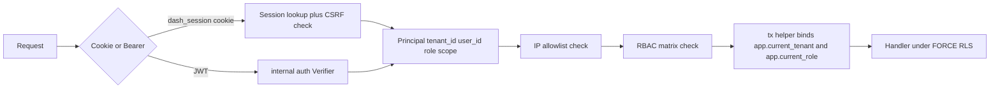
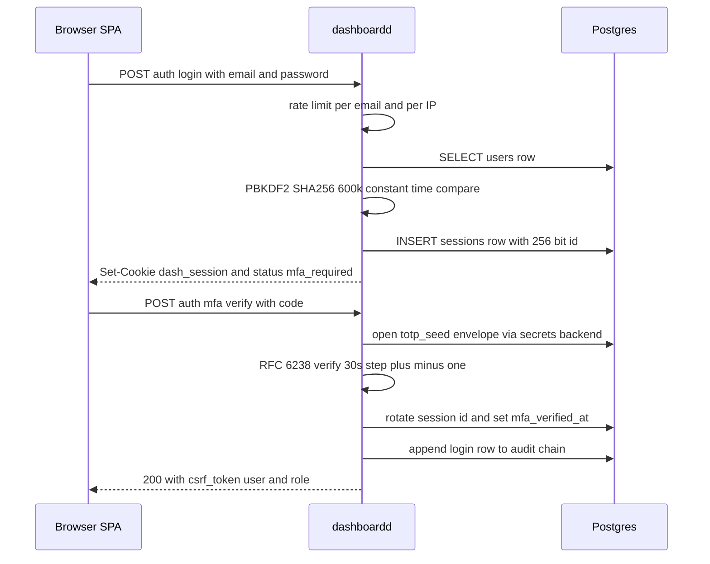
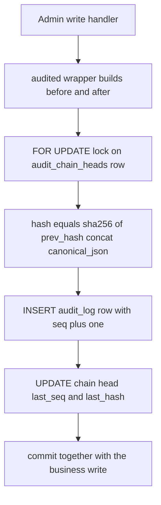
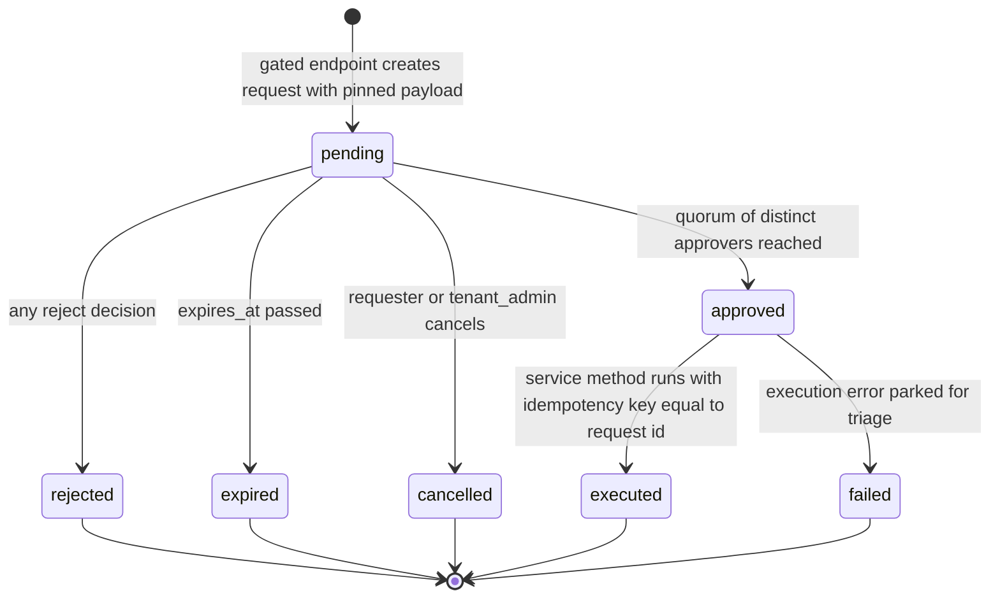

# 05 — RBAC, Sessions, Secrets & Security

> **Status:** ACCEPTED · **Owner:** Senior Backend Engineer · **Last updated:** 2026-07-06 · **Gated by:** /architecture-review, /security-audit

This document is the security contract for the Waterfall Enrichment Engine Management Dashboard
(`cmd/dashboardd`, `/v1/admin/*`). It extends `docs/18-Security.md` — the platform security model —
onto the new dashboard surface: it keeps the two-layer tenant isolation model (ADR-0010; identity
binding + Postgres `FORCE ROW LEVEL SECURITY`), the per-tenant audit hash chain, and the STRIDE
per-boundary approach, and adds the pieces the dashboard introduces: browser sessions (ADR-0018),
envelope-encrypted secrets (ADR-0017), the dual-GUC platform/tenant table taxonomy (ADR-0020),
MFA/step-up, IP allowlists, approval quorums, and the dashboard-specific threat-model deltas.
API shapes referenced here are normative in doc 04 (`/v1/admin/*`, snake_case JSON, uniform error
body `{"error":{"code","message"}}`, `Idempotency-Key` on writes, cursor pagination with limit cap
200). Per the rule inherited from `docs/17-Dashboard-Planning.md`, every control described here is
backed by a real table and endpoint — no orphan UI, no orphan policy.

Governing invariant, verbatim: **"the model proposes, a deterministic gate disposes."** The five
gates are referenced by their exact labels: **G1 tenant isolation**, **G2 idempotency**, **G3
bounded execution**, **G4 cost ceiling**, **G5 provenance**. This document is primarily the G1
specification for the dashboard, plus the human-authorization layer (RBAC, MFA, approvals) that
sits in front of every gated write.

---

## 1. Principals and roles

A **User** (glossary: a human login belonging to a Tenant, the RBAC principal — never confused with
a Person, which is enrichment data) authenticates to the dashboard and is bound to the same
`tenant.Principal` (`internal/tenant/context.go`) the engine already uses: `{TenantID, UserID,
Scopes}`. Machine callers (CI, scripts) carry the same Principal via JWT (`internal/auth`). There
is exactly one Principal type, one context-binding point (`tenant.WithPrincipal` at the trust
boundary), and one fail-closed read path (`tenant.FromContext`; no principal → `ErrNoPrincipal`,
never "all Tenants").

### 1.1 Roles

| Role | Population | Scope |
|---|---|---|
| `operator` | Platform staff (Users of the sentinel `platform` Tenant, ADR-0020) | Platform tables (Class P) fully; cross-Tenant **reads** only via the enumerated RLS policy list (§3.3), each read audited |
| `tenant_admin` | Customer Tenant administrators | Their Tenant's config, Users, budgets, alerts, BYO Provider Keys and Key Pools; publish/rollback of their routing policies and Waterfall workflows (approval-gated) |
| `tenant_user` | Customer Tenant members | Read-only visibility into their Tenant's usage, cost, catalog projection, and alert history |

The role is stored on `users.role` (CHECK constraint) and issued into the credential:

- **Session path:** the session row belongs to a User; the role is read from `users.role` at
  authentication time and materialized into the Principal's scopes as `role:<r>`.
- **JWT path:** the scope claim MUST include exactly one of `role:operator`, `role:tenant_admin`,
  `role:tenant_user`, plus `admin:read` and/or `admin:write` (doc 04 §1.2). Zero or multiple role
  scopes → 401 `unauthorized`.

The role is derived **only** from the verified session or JWT scope. It is never read from request
bodies, query parameters, or headers, exactly as `tenant_id` is never read from payloads
(`internal/tenant` cardinal rule; docs/18 §1 layer 1).

### 1.2 ABAC attributes

ABAC attributes refine RBAC decisions server-side (docs/18 §3): **tenant_id** (from the Principal),
**region**, and **plan_tier** (from `users.abac jsonb` and `tenants.plan_tier`). v1 ABAC checks are:
region-scoped operator duties (an operator with a region attribute sees region-filtered fleet views
by default; enforcement is a server-side filter, not cosmetic), and plan_tier gating of feature
endpoints (e.g. approval-policy customization). All authorization is server-side; SPA role guards
(`lib/permissions.ts`) mirror the matrix for UX only and are never trusted.

### 1.3 Dual GUC binding (ADR-0020)

Every database transaction opened by the dashboard binds **two** GUCs from the verified Principal
via the `internal/dash/db` tx helper, per transaction, using `set_config(..., true)` (transaction-
local, as in `internal/pgstore`):

```sql
SELECT set_config('app.current_tenant', $1, true),
       set_config('app.current_role',   $2, true);
-- $1 = principal.TenantID (fail-closed from tenant.FromContext)
-- $2 = role derived from the role:<r> scope; CHECK-validated enum
--      operator | tenant_admin | tenant_user
```

`app_current_tenant()` and `app_current_role()` are the SQL functions RLS policies evaluate. The
database role `app_rls` is a non-superuser without `BYPASSRLS`; only the outbox relay role has
`BYPASSRLS` (unchanged from migrations 0001–0003). A transaction that skips the helper has empty
GUCs and matches no policy — fail closed.



---

## 2. Role × action authorization matrix

Rows are the action groups of doc 04 §2; columns are the three roles. Cell vocabulary:
**allow** · **deny** · **own-tenant-only** (allowed, RLS-scoped to the caller's Tenant) ·
**approval-gated** (allowed for the role, but executes only through the §9 quorum — the endpoint
returns 202 `{approval_request_id}`). Footnote markers qualify cells. This matrix is data, not
prose: it ships as the table in `internal/dash/rbac`, is served verbatim at `GET /v1/admin/roles`,
and a parity test asserts every mounted `/v1/admin` route appears in exactly one row (doc 13).

| Action group (doc 04 §) | operator | tenant_admin | tenant_user |
|---|---|---|---|
| Overview read (§2.13) | allow | own-tenant-only | own-tenant-only |
| Providers read (§2.3) | allow — full row | allow ¹ | allow ¹ |
| Providers write — create, PATCH (§2.3) | allow | deny | deny |
| Providers actions — enable, disable, pause, maintenance, test, health-check, refresh-metadata, sync-credits, benchmark, duplicate (§2.3) | allow | deny | deny |
| Providers delete, archive (§2.3) | approval-gated | deny | deny |
| Provider health, stats, compare, rankings (§2.3, §2.6) | allow | deny ¹ | deny ¹ |
| Keys read (§2.4) | allow | own-tenant-only ² | deny |
| Keys write — create, PATCH, enable, disable, rotate, test, health-check, refresh-credits, single delete (§2.4) | allow ³ | own-tenant-only ² ³ | deny |
| Keys bulk — import, bulk op except delete (§2.4) | allow ³ | own-tenant-only ² ³ | deny |
| Keys bulk delete (§2.4) | approval-gated | own-tenant-only ² + approval-gated | deny |
| Key Pools — CRUD, members, strategy (§2.4) | allow | own-tenant-only ² | deny |
| Rotation config — triggers read/write, selection-state (§2.5) | allow | deny | deny |
| Rotation simulate (§2.5) | allow | own-tenant-only ² | deny |
| Rotation strategy catalog read (§2.5) | allow | allow | allow |
| Routing/Workflow read — lists, versions, epochs (§2.7) | allow ⁴ | own-tenant-only | own-tenant-only |
| Routing/Workflow draft — create, edit, validate, dry-run, clone (§2.7) | allow | own-tenant-only | deny |
| Routing/Workflow publish, rollback (§2.7) | approval-gated | own-tenant-only + approval-gated | deny |
| Queues fleet read — queue list, stats (§2.8) | allow | deny | deny |
| Queues jobs + dead letters read (§2.8) | own-tenant-only ⁵ | own-tenant-only | deny |
| Queues replay — single redrive, filtered replay (§2.8) | own-tenant-only ⁵ | own-tenant-only | deny |
| Workers read (§2.9) | allow | deny | deny |
| Workers actions — restart, drain, pause, resume, scale, rolling-restart, desired worker count (§2.8–2.9) | allow | deny | deny |
| Cost read — summary, per-enrichment, roi, forecast (§2.10) | allow ⁴ | own-tenant-only | own-tenant-only |
| Cost export (§2.10) | allow ⁴ | own-tenant-only | deny |
| Budgets read/write (§2.10) | allow ⁶ | own-tenant-only | deny |
| Alerts read — rules, events (§2.11) | allow ⁴ | own-tenant-only | own-tenant-only |
| Alerts rules/channels CRUD + test (§2.11) | allow ⁶ ³ | own-tenant-only ³ | deny |
| Alerts ack (§2.11) | allow ⁶ | own-tenant-only | deny |
| Users read (§2.2) | allow ⁴ | own-tenant-only | deny |
| Users write — create, PATCH, delete, reset-password (§2.2) | own-tenant-only ⁶ | own-tenant-only | deny |
| IP allowlists read/write (§2.2) | own-tenant-only ⁶ | own-tenant-only | deny |
| Sessions read (§2.1) | own-tenant-only ⁶ | own-tenant-only | allow — own sessions only |
| Sessions revoke (§2.1) | own-tenant-only ⁶ | own-tenant-only | allow — own sessions only |
| Audit read (§2.12) | allow ⁴ | own-tenant-only | deny |
| Audit verify (§2.12) | allow | own-tenant-only | deny |
| Access log read (§2.12, §11) | allow | own-tenant-only | deny |
| Change history read (§2.12) | allow ⁴ | own-tenant-only | deny |
| Approvals read, create, cancel (§2.12) | own-tenant-only ⁶ | own-tenant-only | deny |
| Approvals decide — approve, reject (§2.12) | allow ³ — four-eyes | own-tenant-only ³ — approver_role + four-eyes | deny |

¹ Tenants read Providers only through the `visibility = 'tenant_readable'` catalog projection
(identity, capabilities, `health_score`, computed `effective_available`) — never breaker/limit
internals, keys, or raw health/stat tables. The projection is an enumerated RLS SELECT policy on a
Class P table (§3.2).
² BYO rows only: RLS restricts to `owner_tenant_id = app_current_tenant()` on `provider_keys` and
`key_pools`. Platform-managed Provider Keys (`owner_tenant_id IS NULL`) are invisible to Tenants.
³ TOTP step-up required — `X-MFA-Code` header per the closed catalog in §5.4.
⁴ Operator cross-Tenant **read**, permitted only by the enumerated SELECT policies of §3.3, and the
serving handler writes a mandatory `audit_log` row.
⁵ `job_outbox` is Tenant-scoped and is deliberately **not** on the operator cross-Tenant list; an
operator Principal acts within the `platform` Tenant scope. Cross-Tenant dead-letter triage is a
runbook procedure through the owning Tenant's tenant_admin or the engine relay tooling — never an
ambient dashboard capability.
⁶ Operator writes are confined to the `platform` Tenant's own rows (`tenant_id = 'platform'`); the
cross-Tenant policies of §3.3 are SELECT-only, so RLS `WITH CHECK` blocks cross-Tenant writes even
for operators. The first `tenant_admin` User of a customer Tenant is provisioned at Tenant signup,
outside this surface (open item SEC-3).

Deny is the default: any route absent from the matrix fails closed with 403 `forbidden` (or 404
where existence must not be disclosed, §3.4).

---

## 3. Tenant isolation (G1)

The dashboard inherits the two-layer model of docs/18 §1 (ADR-0010) unchanged:

1. **Identity binding.** `tenant_id` comes only from the authenticated Principal (session row or
   JWT `tenant_id` claim — `internal/auth` rejects tokens without it), bound immutably into the
   request context. Never from bodies, params, or record fields.
2. **Enforcement floor.** Postgres `FORCE ROW LEVEL SECURITY` on **every** table introduced by
   migrations 0004–0009, evaluated against the dual GUCs of §1.3. The dashboard adds zero
   non-RLS tables.

### 3.1 Table classes, one mechanism (ADR-0020)

| Class | Contents | Policy shape |
|---|---|---|
| **P — platform** (no `tenant_id` column) | `providers`, `secret_envelopes`, `provider_keys`, `key_pools`, `key_pool_members`, `key_budgets`, `key_import_batches`, `health_schedules`, `rotation_triggers`, `provider_health_checks`, `provider_health_1d`, `provider_stats_*`, `key_usage_*`, `workers`, `worker_heartbeats`, `worker_stats_5m`, `queue_stats_*`, `queue_defs` | `USING (app_current_tenant() = 'platform')` for ALL commands, plus the enumerated read projections of §3.2 |
| **T — tenant config** (`tenant_id text NOT NULL`) | `tenants`, `users`, `sessions`, `mfa_recovery_codes`, `mfa_used_steps` *(SEC-1 addendum, §5.1)*, `ip_allowlists`, `audit_log`, `audit_chain_heads`, `api_access_log`, `config_versions`, `config_active`, `config_epochs`, `workflow_index`, `budgets`, `bulk_jobs`, `usage_events`, `alert_channels`, `alert_rules`, `alert_events`, `alert_notifications`, `approval_policies`, `approval_requests`, `approval_decisions`, `tenant_usage_*`, `cost_rollup_*` | 0001-style: `USING (tenant_id = app_current_tenant()) WITH CHECK (tenant_id = app_current_tenant())`, plus the enumerated operator SELECT policies of §3.3 |
| **R — telemetry rollups** | time-partitioned members of the P/T lists above | Same policies as their class; written only by the advisory-locked aggregator |

The member lists above are a **summary synchronized to doc 03**; the complete, normative
per-table registry is **doc 03 §3** (mirrored in code by the `internal/dash/db` registry constant
and enforced by the §3.5 coverage meta-test). A table added later joins its class in doc 03 first
(the OI-DB-6 addendum path) and is back-propagated here; on any divergence between this summary
and doc 03 §3, doc 03 governs.

The sentinel `platform` Tenant (a `tenants.kind='platform'` row) means platform-scoped work flows
through the **same** audited tx helper and the same FORCE-RLS policies as tenant work — one code
path, no NULL-tenant footguns, one-owner-per-table stays auditable.

### 3.2 Class P policy design

Pattern (migration 0005 carries the full registry; illustrative DDL):

```sql
ALTER TABLE providers ENABLE ROW LEVEL SECURITY;
ALTER TABLE providers FORCE ROW LEVEL SECURITY;

CREATE POLICY platform_all ON providers
  USING (app_current_tenant() = 'platform')
  WITH CHECK (app_current_tenant() = 'platform');

-- enumerated tenant read projection: catalog fields only, served via a view
CREATE POLICY tenant_catalog_read ON providers
  FOR SELECT USING (visibility = 'tenant_readable');
```

Enumerated tenant projections on Class P — the complete list:

| Table | Extra policy | Exposes |
|---|---|---|
| `providers` | `FOR SELECT USING (visibility = 'tenant_readable')` | Catalog view columns only (identity, capabilities, `health_score`); handlers serve the view, never `SELECT *` |
| `provider_keys` | `FOR SELECT USING (owner_tenant_id = app_current_tenant())` | Tenant BYO Provider Keys (metadata + last4, never ciphertext) |
| `key_pools` | `FOR SELECT USING (owner_tenant_id = app_current_tenant())` | Tenant BYO Key Pools |
| `secret_envelopes` | **none, ever** | Nothing. Operator platform policy only, and only `internal/dash/secrets` reads it (one-owner-per-table) |

Tenant **writes** to BYO `provider_keys`/`key_pools` rows execute through service methods running
under the platform policy on behalf of the verified owner (the service checks
`owner_tenant_id = principal.TenantID` before mutating); the RLS SELECT projection is what makes
the rows visible to their owner. This keeps a single write path per table.

### 3.3 Operator cross-Tenant access: enumerated, SELECT-only, always audited

Cross-Tenant operator SELECT policies (`USING (app_current_role() = 'operator')`) exist ONLY on:

`cost_rollup_*`, `tenant_usage_*`, `audit_log`, `alert_events`, `config_versions`,
`config_active` (read), `workflow_index`, `users`, `tenants`.

**Never** on: `sessions`, `secret_envelopes`, `mfa_recovery_codes`, `mfa_used_steps`, or the G2/G4/G5 ledgers
(`idempotency_ledger`, `cost_ledger`, `field_versions`) — nor on `job_outbox` (§2 note ⁵).

Every handler that serves a cross-Tenant operator view writes an `audit_log` row (action
`operator_cross_tenant_read`, `object_kind` = table/route, target `tenant_id` in `after`) through
the §8 chain — including background jobs with no request Principal (sunset sweep, approval
expirer), which run as an explicit operator system Principal and are held to the same rule. The
enumerated list is checked into `internal/dash/db` as a registry constant; the §3.5 fuzz suite
fails if the live policies and the registry drift.

### 3.4 Cross-Tenant existence is never disclosed

Any addressable resource that exists in another Tenant returns **404** with the uniform error body
`{"error":{"code":"not_found","message":"..."}}` — identical bytes, identical timing profile, to a
genuinely absent id. Under RLS this is the natural outcome (zero rows); handlers must not add
"exists but forbidden" branches, and the IDOR release-blocker test of docs/18 §1 extends to every
new resource type here.

### 3.5 RLS fuzz test specification (release blocker)

`TestRLSFuzz` (integration suite, doc 13) is the mechanized proof of G1 for the dashboard schema:

1. **Coverage meta-test.** Query `pg_catalog` and assert every table created by migrations
   0004–0009 has `relrowsecurity AND relforcerowsecurity` true and at least one policy. A table
   with RLS off — or a policy referencing neither `app_current_tenant()` nor an enumerated
   projection predicate — fails the build.
2. **Seeding.** Create Tenants `platform`, `tenant_a`, `tenant_b`; seed every table with rows
   attributable to each (Class P rows plus BYO rows owned by each Tenant).
3. **Principal sweep.** For each principal in {operator, tenant_admin, tenant_user} ×
   {platform, tenant_a, tenant_b}: open a tx via the dual-GUC helper and execute randomized
   SELECT / INSERT / UPDATE / DELETE statements (seeded `math/rand/v2` generator; the seed is
   logged so every failure replays deterministically).
4. **Oracle.** Every row visible or affected must satisfy the class predicate for that principal:
   Class T → `tenant_id = principal tenant`, or the row's table is on the §3.3 enumerated list and
   the principal role is operator (SELECT only); Class P → principal tenant is `platform`, or the
   statement is a SELECT matching an enumerated projection. Any other row → assertion failure.
   Cross-Tenant write attempts must affect **zero rows** — the zero-rows property is the release
   blocker (P0 exit gate).
5. **Special cases asserted explicitly.** `secret_envelopes` returns zero rows to every
   non-platform principal under every statement; `sessions` and `mfa_recovery_codes` return zero
   rows cross-Tenant even for operator; the §3.3 registry matches the live `pg_policies` catalog
   exactly; a mismatched-Tenant `GET /{id}` at the HTTP layer returns 404 (never 403).
6. **No-GUC probe.** A connection that never calls the tx helper sees zero rows on every table.

---

## 4. Session model (ADR-0018)

Two authenticators, one Principal, one middleware chain (doc 04 §1.2):
`instrument → authenticate → ip-allowlist → rbac → idempotency → recoverer → handler`.

### 4.1 Browser sessions (cookie + CSRF)

| Property | Value |
|---|---|
| Cookie | `dash_session`; value = `<tenant_id>\|<session_id>` (tenant is a non-secret routing hint so RLS can scope the session lookup — Deviation SEC-6; the 256-bit session id remains the sole authenticator); `Path=/`; `HttpOnly`; `Secure`; `SameSite=Lax` |
| Session id | 256-bit from `crypto/rand`, base64url (43 chars), PK of `sessions` |
| CSRF | Double-submit with server-side comparison: 128-bit `csrf_token` issued at login / MFA verify, returned in the JSON body (never a cookie), held in SPA memory; every non-GET request MUST send `X-CSRF-Token` equal to `sessions.csrf_token`; mismatch → 403 `csrf_invalid` |
| Idle expiry | 30 minutes sliding: `idle_expires_at = last_seen_at + 30m`; `last_seen_at` updated at most once per minute to bound write load |
| Absolute expiry | 12 hours fixed: `absolute_expires_at = created_at + 12h`; never extended, not even by MFA verify or id rotation |
| Revocation | `revoked_at` set by logout, `DELETE /auth/sessions/{id}`, password reset (all Tenant sessions), User deactivation |
| Reaper | Background loop deletes rows 24h after expiry/revocation (forensic grace window). Expiry is enforced at authentication time by comparing timestamps — a dead reaper can never extend a session |
| Fixation defense | The session id is rotated (new row, old revoked) on login and again on MFA verify — every privilege transition gets a fresh id (§10) |

`SameSite=Lax` blocks cross-site POSTs while allowing top-level navigation into the SPA; the CSRF
header closes the remaining gap (Lax still sends cookies on top-level GETs, and GET handlers are
side-effect-free by API convention, but the header is required on all non-GET regardless). SSE
(`GET /v1/admin/streams`) authenticates with the same cookie — no credential ever appears in a URL
(§10).

### 4.2 Machine path (JWT)

`Authorization: Bearer <jwt>` verified by the existing `internal/auth` Verifier, whose properties
carry over verbatim: verification algorithm pinned by the **key**, never the token header (defeats
alg-confusion and `alg:"none"`); HS256/RS256 with `kid` rotation; `exp` REQUIRED; `iss`/`aud`
matched; 60s leeway; constant-time HMAC comparison; `tenant_id` claim REQUIRED and non-empty so G1
can never fall back to an ambient Tenant. Required scopes: `admin:read` for reads, `admin:write`
for writes, plus exactly one `role:<r>` (§1.1). JWT callers are CSRF-exempt — there is no cookie,
hence no ambient browser authority to forge — and do not touch the `sessions` table. IP allowlists
(§6) apply equally.

### 4.3 Login flow

1. `POST /v1/admin/auth/login {email, password}` — Idempotency-Key exempt (doc 04).
2. **Rate limits first**: per-email 10 attempts / 5 min and per-IP 30 attempts / 5 min sliding
   windows (policy defaults, tunable via env); exceeded → 429 `rate_limited` with `Retry-After`.
   Failures are recorded in the audit chain (action `login_failed`, no password material).
3. Password verification: `users.password_hash` stores `pbkdf2-sha256$600000$<salt>$<dk>`
   (PBKDF2-HMAC-SHA256, 600,000 iterations, 16-byte random salt, 32-byte derived key — stdlib
   `crypto/pbkdf2` + `crypto/sha256`). Comparison via `crypto/subtle.ConstantTimeCompare`. For
   unknown emails the handler runs PBKDF2 against a fixed dummy hash so response timing does not
   distinguish "no such User" from "wrong password".
4. **Generic failure message**: every failure path — unknown email, wrong password, deactivated
   User — returns the identical 401
   `{"error":{"code":"unauthorized","message":"invalid email or password"}}`.
5. Success: session row inserted. MFA-enrolled Users (and all Users whose role **requires** MFA,
   §5.3) receive `{"status":"mfa_required"}` — the session exists but authenticates nothing except
   `auth/mfa/*` until verified. Non-MFA Users (where permitted) receive `csrf_token` + User summary.
6. `POST /auth/mfa/verify {code}` — on success: session id rotated, `mfa_verified_at` set,
   `csrf_token` (re)issued, audit row `login` appended.



---

## 5. MFA (TOTP, RFC 6238)

### 5.1 Algorithm

Stdlib-only TOTP: HMAC-SHA1 per the RFC 6238 default (authenticator-app compatibility), 6 digits,
**30-second time step**, acceptance window **±1 step** (skew tolerance), dynamic truncation per
RFC 4226, comparison via `crypto/subtle`. Implemented in `internal/dash/security` with
`crypto/hmac` + injectable clock; verified against the RFC 6238 Appendix B test vectors (doc 13).
Replay guard — **persisted, no in-process authority** (resolves SEC-1): an accepted `(user_id,
time_step)` pair is never accepted twice, and the only replay record is the database, never
instance memory. `mfa_used_steps(tenant_id text NOT NULL, user_id uuid NOT NULL, time_step
bigint NOT NULL, used_at timestamptz NOT NULL DEFAULT now(), PRIMARY KEY (user_id, time_step))`
— Class T (0001-style RLS; §3.1), a DDL addendum to migration 0004 recorded for absorption into
the doc 03 §2.1 DDL and §3 registry — takes an INSERT in the **same transaction** that accepts
the code (login MFA verify and every §5.4 step-up); a primary-key conflict rejects the code with
the uniform 401 `mfa_required`. Because the guard is a durable uniqueness constraint, an instance
restart or a replay routed to a different instance inside the ±1-step window is still rejected —
consistent with doc 02 §2.5 (no in-process authority) — and since no in-memory replay map exists
at all, there is nothing for the doc 02 §5 cache inventory to declare. Rows are purged after 24h
by the partition maintainer's batched-DELETE path (doc 03 §4); the acceptance window spans only
~90s, so retention is forensic slack, not correctness. TOTP verification is low-frequency (login
plus step-up), so the indexed write is negligible. Recovery codes need no entry here — their
single-use guarantee is already transactional (`used_at`, §5.2).

### 5.2 Enrollment and recovery codes

- `POST /auth/mfa/enroll` generates a 20-byte seed (`crypto/rand`), seals it via the secrets
  backend into `secret_envelopes` with `kind='totp_seed'` (§7), stores the envelope id on
  `users.mfa_totp_envelope_id`, and returns the `otpauth://totp/...?secret=...&issuer=Waterfall&period=30&digits=6&algorithm=SHA1`
  provisioning URI exactly once (QR rendered client-side by the SPA's `qrcode` dependency). The
  plaintext seed never persists anywhere.
- `POST /auth/mfa/enroll/confirm {code}` activates enrollment (`mfa_enrolled_at`) and returns
  **10 recovery codes**, exactly once. Each code is 10 random base32 characters (50 bits,
  `crypto/rand`); the server stores only `sha256(code)` in `mfa_recovery_codes(user_id,
  code_hash)`. Codes are single-use: consumption sets `used_at` in the same transaction that
  accepts them. Regeneration invalidates all prior codes. The remaining-count is shown in the SPA;
  a recovery code is accepted anywhere a TOTP code is (login verify and step-up), and its use is
  audited distinctly (`mfa_recovery_code_used`).
- Lost device: a `tenant_admin` (or operator, for platform Users) resets MFA via
  `PATCH /users/{id}` — audited, revokes all the User's sessions, forces re-enrollment at next
  login.

### 5.3 Requirement policy

**MFA is REQUIRED for `operator` and `tenant_admin`.** An unenrolled User holding either role
completes login and is then confined to the `auth/mfa/enroll*` endpoints — every other route
returns 401 `mfa_required` — until enrollment is confirmed. `tenant_user` enrollment is
self-service and optional in v1 (a per-Tenant requirement knob is open item SEC-5).

### 5.4 Step-up re-verification (closed catalog)

A fresh proof is demanded **per request** via the `X-MFA-Code` header (TOTP or recovery code) for:

| Step-up action | Reason |
|---|---|
| `POST /approvals/{id}/approve` and `/reject` | Quorum decisions bind a human to a dangerous change (§9); doc 04 §1.2 |
| `POST /providers/{id}/keys` (create) | Carries Provider Key plaintext into Seal |
| `POST /providers/{id}/keys/import` | Carries bulk plaintext |
| `POST /keys/{id}/rotate` | Creates a successor credential |
| `POST /alerts/channels` and channel updates | Config envelopes contain webhook URLs/secrets — an egress target change |
| `POST /auth/mfa/enroll` when already enrolled (re-enrollment) | Seed replacement |

A valid `sessions.mfa_verified_at` does **not** substitute; missing or invalid code → 401
`mfa_required` (uniform error body). This catalog is data in `internal/dash/rbac` beside the §2
matrix and is covered by the same parity test. JWT machine principals cannot perform step-up
actions in v1 (they have no TOTP seed); gated and secrets-touching actions are human-only.

---

## 6. IP allowlists

Per-Tenant CIDR allowlist in `ip_allowlists(tenant_id, cidr, label, created_by, created_at)`:

- **Semantics.** No rows → no restriction. One or more rows → every request authenticated to that
  Tenant must originate from an address inside at least one CIDR; otherwise 403 `ip_not_allowed`
  (uniform error body), recorded in `api_access_log` (§11) and counted in metrics.
- **Enforcement point.** `internal/dash/httpx` middleware, **after authentication** (the Tenant is
  known only from the Principal) and before RBAC/handler — no handler side effects can precede the
  check. Applies identically to session, JWT, and SSE-connect requests.
- **Peer address.** The check uses the **direct peer address** (`r.RemoteAddr`) — authoritative by
  default. `X-Forwarded-For` is honored **only** when `DASH_TRUSTED_PROXIES` (comma-separated
  CIDRs) is set **and** the direct peer is inside that set; the effective client address is then
  the rightmost `X-Forwarded-For` entry not belonging to a trusted proxy. **Caveat (binding):**
  with `DASH_TRUSTED_PROXIES` unset, `X-Forwarded-For` is ignored entirely — honoring a
  client-controlled header without a trusted-proxy contract would let any caller spoof its way
  through the allowlist. Doc 11 owns the per-environment proxy topology.
- **Management.** `GET/PUT /v1/admin/ip-allowlists` (full-replacement PUT, tenant_admin+). Lockout
  guard: the caller's current effective address must match the new set, else 422
  `validation_failed` (doc 04 §2.2). All changes are audited.

---

## 7. Secrets: envelope encryption (ADR-0017)

One sealed store — `secret_envelopes` — holds every secret the dashboard custodies: Provider Key
material (`kind='provider_key'`), TOTP seeds (`totp_seed`), webhook secrets (`webhook_secret`),
and alert channel configs (`channel_config`). Consuming tables store envelope **references** only
(`provider_keys.secret_envelope_id`, `users.mfa_totp_envelope_id`,
`alert_channels.config_envelope_id`). **No plaintext column exists anywhere in the schema**, so
"secrets never at rest in clear" is a schema invariant, not a code-review hope.

### 7.1 Construction (AES-256-GCM, per-secret DEK)

`Seal(ctx, kind, plaintext) → envelope_id`:

1. Generate a fresh 32-byte DEK (`crypto/rand`) — one per secret, never reused.
2. `ciphertext = AES-256-GCM(DEK, nonce, plaintext, AAD)` with a fresh 12-byte nonce (stored in
   `nonce`); `AAD = envelope_id || kind`, binding the ciphertext to its own row so a spliced or
   swapped envelope fails authentication on Open.
3. Wrap the DEK with the active master key: `dek_wrapped = wrap_nonce || AES-256-GCM(KEK, wrap_nonce, DEK)`;
   record `master_key_id`.
4. For `provider_key` envelopes additionally compute the **keyed** duplicate-detection fingerprint
   `aad_fingerprint = HMAC-SHA256(fingerprint_pepper, plaintext)` (pepper from env; keyed — never
   bare SHA-256, so a leaked row cannot be brute-forced against low-entropy vendor keys) and
   capture `secret_last4` for display.

`Open(ctx, id)` reverses the wrap locally (no network round-trip on the lease path);
`Rotate(ctx, id)` re-seals under a new envelope with `rotated_from` lineage. Interface (spec §7):

```go
type Backend interface {
    Seal(ctx context.Context, kind string, plaintext []byte) (EnvelopeID, error)
    Open(ctx context.Context, id EnvelopeID) ([]byte, error)
    Rotate(ctx context.Context, id EnvelopeID) (EnvelopeID, error)
}
```

### 7.2 Master key and rotation

The KEK comes from env `DASH_MASTER_KEY` as a keyring — `<master_key_id>:<base64 32B>` entries,
comma-separated — so two KEKs can be live during rotation; the first entry seals new envelopes.
**Rotation procedure** (runbook, doc 14): (1) add the new key id to the keyring and restart;
(2) a background loop re-wraps: for each envelope with the old `master_key_id`, unwrap the DEK
with the old KEK, wrap with the new KEK, update `dek_wrapped` + `master_key_id` — **only the
~40-byte wrapped DEK is rewritten; data ciphertext is never re-encrypted**, so rotation is
O(rows) tiny updates, not an outage; (3) verify zero envelopes reference the old id;
(4) remove the old entry. Every step is audited. Changing the secrets **backend** (e.g. to a
Vault/ASM adapter — interfaces designed, deployment deferred per ADR-0017) is approval-gated
(`secrets_backend_change`, §9).

**Custody statement (ADR-0017, explicit):** a KEK in process env is weaker custody than KMS/HSM —
host-env or memory-dump compromise exposes all DEKs. The trade buys hot-path availability and
latency (no external unwrap per lease at up to 10k selections/s — UNVERIFIED until the P2 load
test); the pluggable Backend keeps the Vault/ASM reversal path warm. Doc 11 restricts env exposure
and disables core dumps in production.

### 7.3 Plaintext handling rules

- The `Secret` Go wrapper type redacts `String()` and `MarshalJSON()` (both return `[REDACTED]`),
  so `log/slog`, panics, and accidental serialization cannot leak values.
- Plaintext exists in memory only on: import/create (sealed immediately, §5.4 step-up), test
  actions, and the lease path — `rotation.LeaseResolver` → `provider.AuthInjector` injecting at
  egress so Adapters never hold keys.
- There is **no reveal endpoint** anywhere in the API surface — identification is
  `label + secret_last4 + fingerprint prefix`; API responses and `audit_log` before/after carry
  envelope ids and last4 only.

---

## 8. Audit: per-Tenant hash chain

Mechanized immutability per docs/18 §6, now fully specified:

### 8.1 Chain construction

- `audit_log(tenant_id, seq, actor_user_id, actor_role, action, object_kind, object_id, before,
  after, ip, prev_hash, hash, created_at)`; RANGE-partitioned by year; **never deleted**; the
  writing DB role holds INSERT only (no UPDATE/DELETE grants).
- `hash = sha256(prev_hash || canonical_json(row))`. **Canonical JSON:** UTF-8, keys sorted
  lexicographically, no insignificant whitespace, RFC 3339 UTC timestamps, bytea as base64; the
  hashed document contains `tenant_id, seq, actor_user_id, actor_role, action, object_kind,
  object_id, before, after, ip, created_at`. Genesis: `prev_hash` = 32 zero bytes at `seq = 1`.
- Appends are serialized per Tenant by a `SELECT ... FOR UPDATE` on the
  `audit_chain_heads(tenant_id PK, last_seq, last_hash)` row, inside the **same transaction** as
  the business write (the `audited(action, kind, handler)` wrapper in `internal/dash/httpx`), so
  a write and its audit row commit or roll back together.



### 8.2 What gets audited (binding list)

1. **Every admin write** under `/v1/admin/*` — enforced structurally: mutating routes mount only
   through the `audited()` wrapper; a route-parity test (doc 13) fails if a mutating route lacks it.
2. **Every operator cross-Tenant read** (§3.3), including background jobs acting as the operator
   system Principal.
3. **Logins and login failures**, MFA verify failures, recovery-code use, lockouts, session
   revocations, password resets.
4. **Approval lifecycle**: request created, each decision (with `mfa_verified`), cancel, expiry,
   execution result (§9).
5. Key state-machine transitions, config publish/rollback (with `payload_hash`), alert
   mute/silence, IP-allowlist changes, secrets rotation events.

`before`/`after` snapshots are redacted per §7.3 (envelope ids + last4, never secrets); no PII
beyond actor identifiers and ip.

### 8.3 Verification and anchoring

- `GET /v1/admin/audit-log/verify` walks a bounded range (cursor-paginated, limit cap 200 per
  page) recomputing hashes; returns the first mismatch `{seq, expected_hash, actual_hash}` if any.
- A **nightly job** walks every Tenant chain incrementally from its last verified checkpoint; a
  mismatch fires the self-monitoring alert vocabulary entry (doc 10) and triggers the
  audit-chain-mismatch runbook (doc 14).
- **WORM anchoring (design-target, deferred):** a nightly anchor record
  `(tenant_id, last_seq, last_hash, anchored_at)` shipped through an `AnchorSink` interface to
  WORM object storage (S3 Object Lock or equivalent, per docs/18 §6) for retention/legal hold —
  an attacker with full DB write access can rewrite a suffix and recompute hashes, but cannot
  rewrite the external anchor. Sink selection is open item SEC-2.

---

## 9. Approval workflows

Approval quorums are the human gate in front of the most dangerous writes; execution then flows
through the same deterministic service methods as any other write — the model (or the human)
proposes, a deterministic gate disposes.

### 9.1 Gated actions (closed catalog)

`approval_policies.action_kind` CHECK enum, exactly: `key_bulk_delete`, `provider_delete`,
`provider_archive`, `routing_publish`, `workflow_publish`, `secrets_backend_change`. Per-Tenant
knobs: `required_approvals` (default 1), `approver_role` (default `tenant_admin`),
`expires_after_s` (default 86400). Rows with `tenant_id='platform'` govern operator-level actions.
Policy writes are validated against the live User roster: `required_approvals` must be satisfiable
by eligible approvers excluding any single requester, else 422 `validation_failed` (deadlock
guard; recovery in doc 14).

**Defaulting is fail-closed (normative — closes the gap doc 01 flagged for this doc).** The gate
never disarms for lack of configuration: when no `approval_policies` row exists for `(tenant_id,
action_kind)`, the **built-in default policy** applies — `required_approvals = 1`,
`approver_role = 'tenant_admin'` (`operator` for `tenant_id='platform'` actions),
`expires_after_s = 86400`, the same values as the doc 03 0007 column defaults. An explicit row
only **customizes** these knobs; neither the absence of a row nor any writable row state can
disarm the gate (`required_approvals ≥ 1` always). The built-in default is deliberately chosen
over seeding rows at signup so the guarantee never depends on seed-migration completeness and
automatically covers action_kinds added later. Consequence, spelled out: every approval-gated
cell in the §2 matrix returns 202 `{approval_request_id}` on every Tenant from its very first
request — a fresh tenant_admin's `POST /keys/bulk` with `op=delete` and an operator's
`DELETE /providers/{id}` execute only through the §9.2 quorum, never inline. This supersedes doc
04 §5.1's former "otherwise the write executes inline" sentence and the "200 — no approval
policy configured" publish example in doc 04 §2.7, both reconciled to these semantics (a gated
endpoint always answers 202; the 200 pointer-flip body is the executor's result, stored in
`execution_result` and replayed via the G2 ledger) — doc 04 §5.3's "202 on first submission"
rule was already the matching normative statement.

**Single-approver Tenants.** Four-eyes (§9.2) is unconditional, so a Tenant whose only eligible
approver is the requester cannot meet even the default quorum — a deliberate consequence of
hard-forbidding self-approval (doc 01's LaunchDarkly divergence), not a bug, and the gate never
weakens to compensate. The roster validation above covers explicit policy writes; under the
built-in default the same roster check runs at **request creation**: if no eligible approver
other than the requester exists, the gated endpoint returns 422 `validation_failed` with a
message naming the remedy (add a second `tenant_admin`; for platform actions, a second operator)
instead of parking a request that can only expire. Recovery is the doc 14 deadlock runbook;
first-admin provisioning remains SEC-3.

### 9.2 Semantics (normative)

| Property | Rule |
|---|---|
| Quorum | N-of-M **distinct** approvers; distinctness is a DB constraint — `approval_decisions PRIMARY KEY(request_id, approver_user_id)` |
| Four-eyes | `approver ≠ requester`, unconditional, all roles including operator → 403 `forbidden`. Self-approval is not configurable (deliberate divergence from LaunchDarkly, doc 01) |
| Approver authority | Approver must hold `approver_role` per the §2 matrix |
| Step-up | Each decision requires `X-MFA-Code` (§5.4); `approval_decisions.mfa_verified` records the proof; a justification comment is required |
| Payload pinning | `approval_requests.payload` stores the fully resolved action at request time — bulk deletes pin resolved Provider Key ids (bounded list, never a live filter); publishes pin `{version_id, payload_hash}` from validate. Approvers decide on the exact bytes that will execute; any draft edit reverts `validated → draft` (doc 07), making a mutated config unexecutable — our stale-review dismissal |
| Expiry | `expires_at = created_at + expires_after_s`; the approval-expirer loop flips `pending → expired`, **and** expiry is re-checked inside the decision and execution transactions, so a dead sweeper cannot leave zombie-approvable requests |
| Exactly-once execution | Quorum is counted inside one transaction holding `SELECT ... FOR UPDATE` on the request row; on quorum, dashboardd executes the pinned payload through the **normal service method** with **Idempotency-Key = approval request id** via the standard httpx idempotency ledger (G2) — crash-and-retry replays into the stored result, never a second execution. Result lands in `execution_result`; status `executed` or `failed` (failures stay parked for triage — never silently retried) |
| Audit | Every transition appends to the §8 chain; `GET /change-history/{kind}/{id}` joins versions + approvals + audit rows into one timeline |



---

## 10. Threat-model deltas (STRIDE)

The engine-side STRIDE table remains canonical in docs/18 §8. The dashboard adds these surfaces;
each row is a required mitigation, tested per doc 13.

| Surface | STRIDE class | Threat | Mitigation |
|---|---|---|---|
| Alert webhook / Slack / Teams / Discord URLs | Server-side request forgery — Information disclosure + Elevation | A tenant_admin configures a channel URL pointing at metadata endpoints or internal services; test-send or real notification becomes an internal request | Reuse the engine's SSRF-guarded egress client (`internal/provider`): resolve-then-dial with private-range/loopback/link-local/metadata denial, redirect refusal, response-size caps, 5s timeout — applied to **both** real sends and test-sends. Channel configs live in `secret_envelopes` and are never echoed decrypted |
| CSV/XLSX export and import | Tampering (client-side execution) | Formula injection: a value beginning `=`, `+`, `-`, or `@` executes when the file opens in a spreadsheet | Escape cells starting with `= + - @` (prefix `'`) on **export AND import** paths — cost export, key-grid export, and `key_import_batches.errors` report rendering all pass through one shared escaper |
| Bulk key import | Denial of service | Zip bomb: a small XLSX expanding to gigabytes exhausts memory/disk | Hard caps 25 MiB upload / 50k rows, plus a decompression **ratio guard** (abort when expanded/compressed exceeds 100:1) in the stdlib `archive/zip` reader; parsing is streaming, never whole-file in memory |
| Login / session issuance | Spoofing (session fixation) | An attacker pre-plants a session id, victim authenticates onto it | Session id **rotated on login and on MFA verify** (§4.1); ids are only ever minted server-side from `crypto/rand`; no id is ever accepted from a request to name a new session |
| SSE stream (`GET /v1/admin/streams`) | Information disclosure | Bearer credentials in URLs leak via logs, proxies, Referer headers | **Cookie-auth only** for SSE; no token query parameter exists. Access logs record route patterns, never query strings (§11) |
| Audit chain | Tampering + Repudiation | An attacker with DB write access rewrites history | INSERT-only grants; per-Tenant hash chain + `verify` endpoint + nightly walker (§8.3); WORM anchoring design-target makes suffix-rewrite detectable externally |
| Login endpoint | Spoofing (credential stuffing) | Bulk password guessing | Per-email + per-IP rate limits, PBKDF2 600k cost, generic failure message, timing-equalized unknown-email path (§4.3), failures audited |
| Cross-Tenant resource probing | Information disclosure | Enumerating other Tenants' resource ids via status-code oracles | Uniform 404 for cross-Tenant existence (§3.4); RLS zero-rows floor; fuzz suite §3.5 |

---

## 11. API access log

`api_access_log` is the request-level operational record — distinct from the audit chain (§8),
which records intent and outcome of privileged actions.

| Property | Specification |
|---|---|
| Recorded per request | `tenant_id`, `user_id` (null for pre-auth failures), `method`, `route` (the **mux pattern**, e.g. `/v1/admin/keys/{id}` — never the raw path, never query strings; bounded cardinality), `status`, `dur_ms`, `ip`, `created_at` |
| Explicitly NOT recorded | Request/response bodies, headers, query strings, session ids, any Field/Attribute values — **no PII beyond `ip` and the User id** |
| Retention | 90 days; monthly RANGE partitions dropped by the partition-maintenance job (never by migration) |
| Write path | Asynchronous batch inserter (bounded channel + periodic flush); on overflow it drops rows and increments a metric — request handling is **never** blocked by access logging |
| Read path | `GET /v1/admin/access-log` — tenant_admin own-Tenant, operator platform scope (§2); filters `user_id`, `route`, `status`, `from`, `to`; cursor pagination, limit cap 200 |
| Uses | IP-allowlist denial forensics (§6), rate-limit tuning, session-anomaly investigation (unfamiliar `ip` for a User), UNVERIFIED-scale capacity inputs for doc 11 |

---

## Open items

| ID | Item | Status | Owner |
|---|---|---|---|
| SEC-1 | TOTP replay guard: persisted `mfa_used_steps` `(user_id, time_step)` table (Class T, migration 0004 DDL addendum) written in the acceptance transaction (§5.1); no per-instance replay state remains, so doc 02 §5's cache inventory is unaffected. Remaining action: doc 03 absorbs the addendum into its §2.1 DDL and §3 registry | RESOLVED (§5.1) | Senior Backend Engineer |
| SEC-2 | WORM anchor sink: **DECIDED** — reference is **AWS S3 Object Lock (compliance mode)** with per-cloud equivalents (Azure Blob immutability policy / GCP Bucket Lock), anchor cadence **nightly** (tail-truncation exposure ≤ 24h; the in-DB per-Tenant hash chain plus `GET /audit-log/verify` remain the primary tamper-evidence, so the WORM anchor is a defense-in-depth backstop, not the sole control). The anchor writer is a deployment-time ops job (a bucket + a nightly export of `audit_chain_heads` + the day's `audit_log` range), **not application code** — it activates when the platform is deployed to a cloud with an object-lock store, which this dev build does not have. | DECISION RECORDED (activate at deploy) | Solutions Architect |
| SEC-3 | First `tenant_admin` provisioning at Tenant signup is outside this surface; operator cross-Tenant User **writes** are deliberately not enumerated — revisit if support workflows demand an audited, approval-gated path | OPEN | Principal Product Architect |
| SEC-4 | Fingerprint pepper rotation: re-fingerprinting requires plaintext, so it can only occur at rotate/import; document the limitation and procedure in ADR-0017 | RESOLVED (closeout: RefingerprintOnRotate at rotate/import) | Senior Backend Engineer |
| SEC-5 | Per-Tenant knob requiring MFA for `tenant_user` (v1 ships optional/self-service, §5.3) | OPEN | Principal Product Architect |
| SEC-6 | **Deviation D-P0-1: `dash_session` cookie value is `<tenant_id>\|<session_id>`, not the bare session id (§4.1).** The tenant is a non-secret routing hint that lets the resolver bind `app.current_tenant` *before* RLS will disclose the `sessions` row, keeping the app role non-BYPASSRLS (G1 self-check) with no privileged session-lookup path. The 256-bit id remains the sole authenticator; tampering with the prefix fails closed (RLS returns zero rows — a mismatched tenant sees no session). Implemented in `internal/dash/security.Sessions`. | RESOLVED (P0) | Senior Backend Engineer |
| SEC-7 | **Deviation D-P0-3: the generic `audited(action, kind, handler)` wrapper appends its audit row in a follow-up transaction, not the business write's transaction (§8.1).** Chain integrity and `verify` still hold (each `Append` is atomic and per-Tenant serialized by the chain-head lock); only the write+audit atomicity of §8.1 is deferred to the phase that threads a `*pg.Conn` into handlers. The security-critical login/MFA audit rows are written inline on their own paths. | OPEN — same-tx wrapper in a later phase | Senior Backend Engineer |
| SEC-8 | **TOTP replay guard (`mfa_used_steps`, SEC-1) not yet wired in P0.** RFC 6238 verification with the ±1-step window ships (`internal/dash/security.VerifyTOTP`) and recovery-code single-use is transactional, but the persisted `(user_id, time_step)` single-use guard from §5.1 is deferred (its table is not among the 9 that migration 0004 created). Add with the migration that introduces `mfa_used_steps`; the verify path is structured to take the INSERT in the accepting transaction. | RESOLVED (closeout: mfa_used_steps single-use guard, migration 0011) | Senior Backend Engineer |
