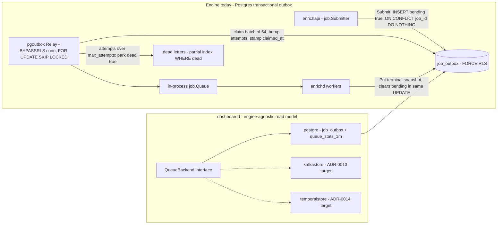
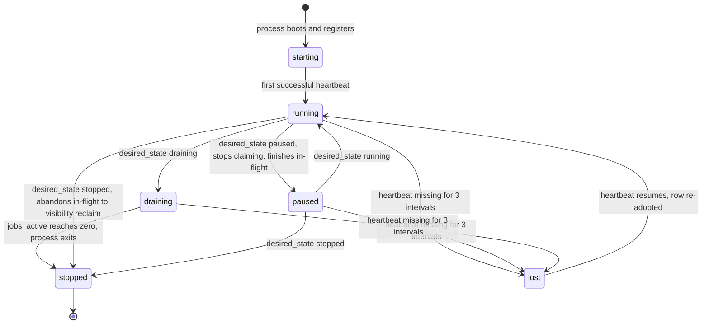
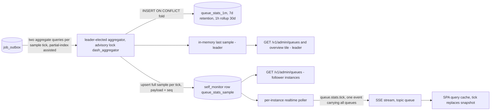

# 06 — Queue & Worker Design

> **Status:** DRAFT · **Owner:** Senior Backend Engineer · **Last updated:** 2026-07-04 · **Gated by:** /architecture-review, /security-audit

This document specifies the Queue Management (module 8) and Worker Management (module 9) panels of
the dashboard: what they read, what they may write, and the exact semantics of every action. It
supersedes the "Jobs & queues" rows of `docs/17-Dashboard-Planning.md` while honoring its rule that
every panel maps to a real backing service and table (no orphan UI). The queue engine itself is
owned by `docs/10-Queue-System.md` and `internal/pgoutbox`; this document builds a **read model plus
two narrow write verbs** (redrive, desired-state) on top of it and never a second queue.

Governing invariant throughout: **"the model proposes, a deterministic gate disposes."** The
dashboard proposes intent (redrive a job, drain a worker, scale a fleet); deterministic mechanisms
— the relay's claim query, G2 idempotency, G3 bounded execution, G4 cost ceiling, the heartbeat
convergence loop — dispose. Gates are referenced by their exact labels: **G1 tenant isolation, G2
idempotency, G3 bounded execution, G4 cost ceiling, G5 provenance.**

---

## 1. Queue topology: today vs target

### 1.1 Today — the Postgres transactional outbox (`internal/pgoutbox`)

The production queue is `job_outbox` (migrations 0002/0003), a transactional outbox with a relay,
exactly as implemented in `internal/pgoutbox/store.go` and `relay.go`:

- **Submit** (`pgoutbox.Store`, implements `job.Store` + `job.Submitter`): one `INSERT ... ON
  CONFLICT (job_id) DO NOTHING` with `pending=true` and the full Enrichment Job payload (including
  the captured principal) in the same RLS-scoped transaction pattern as every tenant write
  (`app.current_tenant` GUC set per transaction). Re-submitting an existing job id is a no-op —
  durability, not back-pressure, is the point.
- **Relay**: a trusted system consumer on the **only** BYPASSRLS connection in the system. It claims
  batches with `FOR UPDATE SKIP LOCKED` over rows `WHERE pending AND NOT dead AND (claimed_at IS
  NULL OR claimed_at < now() - visibility)`, ordered by `created_at`, stamping `claimed_at` and
  incrementing `attempts` in the same statement. Competing relay replicas cannot double-claim.
- **Visibility timeout**: a claimed-but-unfinished row becomes re-claimable once `claimed_at` is
  older than the visibility window. This is the entire crash-recovery story — no heartbeats on
  jobs, no fencing, just at-least-once redelivery that G2 idempotency makes free of double effect.
- **Terminal write**: workers `Put` the terminal snapshot; `pending` is cleared **in the same
  UPDATE** as the terminal status. A crash before durable-terminal leaves the row pending and
  therefore re-drivable.
- **Dead-lettering**: a claim that would push `attempts` past `max_attempts` parks the row instead
  of delivering it: `dead=true, pending=false`, `last_error` explains ("dead-lettered after N
  delivery attempts without reaching a terminal state"). A dead-letter hook fires once per parked
  row for metrics/alerting.

Relay parameters (code defaults in `NewRelay`, mirrored declaratively in `queue_defs`):

| Parameter | Default | Where set | Notes |
|---|---|---|---|
| `visibility` | 30s | `NewRelay` arg / `queue_defs.visibility_s` | reclaim window for crashed consumers |
| `batch` | 64 | relay internal | claim batch size |
| `max_attempts` | 10 | `WithMaxAttempts` / `queue_defs.max_attempts` | park threshold |
| poll interval | 200ms | `Start` arg | drain cadence; drains once at startup to recover pending rows |

`queue_defs` (migration 0008, Class P) is the declarative registry the dashboard reads (`name`,
`kind`, `max_attempts`, `visibility_s`, `description`). Today it is **descriptive** — the relay is
configured in code — and the read model surfaces a warning badge when `queue_defs` and the relay's
reported configuration diverge. Under the target engines it becomes prescriptive.



### 1.2 Target — Kafka/Redpanda transport, Temporal orchestration

`docs/10-Queue-System.md` pins two orthogonal design targets:

- **ADR-0013**: Kafka-protocol log (Redpanda preferred) as the async transport; intake topic
  partitioned by `tenant_id`, hashed by record id; consumer lag as the back-pressure and autoscale
  signal.
- **ADR-0014**: Temporal for Waterfall orchestration, **cost-gated** — open item **QS-TMP-1**
  (Temporal Action-cost spike; hand-rolled saga is the documented fallback) is unresolved and
  stays open in docs/10.

Because QS-TMP-1 is unresolved, **every queue/worker panel in this dashboard is engine-agnostic by
construction**. The panels bind to a closed vocabulary and a Go interface, never to `job_outbox`
column names; the SPA binds only to `types.gen.ts` from the OpenAPI contract. Swapping the engine
means writing a new store implementation, not touching a panel. If Temporal is adopted, its own UI
provides per-job event history — one more reason this dashboard deliberately builds no per-job
event timeline (rejected in doc 01, Domain 3).

### 1.3 The `QueueBackend` read-model interface

Consumer-side interface in `internal/dash/queues/store.go`, composed of the three narrow interfaces
named in doc 02 §cache/container inventory (`QueueStats`, `JobLister`, `Redriver`), per repo style
(small consumer-side interfaces, `var _ Iface = (*Impl)(nil)`):

```go
// QueueBackend is everything the queue/worker panels need from a queue engine.
// pgstore satisfies it over job_outbox + queue_stats_1m today; a kafkastore or
// temporalstore satisfies it later (QS-TMP-1 hedge). The vocabulary is closed:
// panels can never observe an engine-specific concept through this seam.
type QueueBackend interface {
    QueueStats
    JobLister
    Redriver
}

type QueueStats interface {
    // Queues returns every queue_defs row joined with its live state-count
    // vector and oldest_age_s (from the aggregator's last sample, never a
    // COUNT(*) at request time).
    Queues(ctx context.Context) ([]QueueSummary, error)
    // Stats returns the bounded time series for one queue from queue_stats_1m
    // (resolution clamped server-side per doc 04 §1.8).
    Stats(ctx context.Context, queue string, w Window) ([]StatsBucket, error)
}

type JobLister interface {
    // Jobs lists Enrichment Jobs in one engine-agnostic state. state is
    // REQUIRED so every scan stays on a partial index. Cursor pagination,
    // limit capped at 200 (out-of-range → 400 invalid_filter, doc 04 §1.4).
    Jobs(ctx context.Context, queue string, state State, cur Cursor, limit int) (Page[JobRow], error)
    // DeadLetters lists parked jobs (dead=true), newest first, filterable by
    // error class and time bounds. Cursor pagination, limit capped at 200
    // (out-of-range → 400 invalid_filter, doc 04 §1.4).
    DeadLetters(ctx context.Context, f DeadFilter, cur Cursor, limit int) (Page[DeadLetterRow], error)
}

type Redriver interface {
    // Redrive re-delivers ONE parked job. Delegates to pgoutbox.Store.Redrive —
    // the dashboard never writes job_outbox directly (one-owner-per-table).
    // Returns false when no dead row matched (idempotent no-op).
    Redrive(ctx context.Context, jobID string) (bool, error)
    // Replay starts a filtered bulk redrive as an async 202 job and returns
    // its bulk-job id. The filter is re-evaluated under RLS at execution.
    Replay(ctx context.Context, queue string, f DeadFilter) (string, error)
}

var _ QueueBackend = (*PGStore)(nil)
```

Both backends satisfy the same contract:

| Method | pgstore (now) | kafkastore / temporalstore (target) |
|---|---|---|
| `Queues` | `queue_defs` + the sampler's last sample (leader memory; `self_monitor` snapshot row on followers, §6) | topic/task-queue registry + consumer-group lag |
| `Stats` | `queue_stats_1m` (1m/7d, 1h/30d) | same rollup tables, folded from lag/offset metrics |
| `Jobs` | `job_outbox` predicates on partial indexes | visibility-store queries (Temporal) / offset windows |
| `DeadLetters` | `job_outbox WHERE dead` partial index | per-stage DLQ topics / parked workflows |
| `Redrive` | `pgoutbox.Store.Redrive` single UPDATE | DLQ-topic re-publish / workflow reset |
| `Replay` | 202 bulk job paging dead rows | batch operation scoped by query (Temporal-style) |

---

## 2. Read model

### 2.1 Queue list

`GET /v1/admin/queues` returns one row per `queue_defs` entry: the declarative config
(`max_attempts`, `visibility_s`) plus the live state-count vector and `oldest_age_s`. Live counts
come from the sampler's last sample — the leader serves its in-memory copy; a follower instance
serves the `self_monitor` queue-stats snapshot row the sampler upserts each tick (§6), so **any**
dashboardd instance answers with the same ≤ one-sample-old vector — **never** from a per-request
`COUNT(*)` over
`job_outbox` — read-time aggregation over the live store was explicitly rejected (doc 01, Domain 3).
Each count deep-links to `GET /v1/admin/queues/{name}/jobs?state=X`.

### 2.2 State vocabulary and the outbox mapping

Doc 04 §2.8 pins the engine-agnostic state vector: `waiting` `running` `scheduled` `delayed`
`retry` `failed` `dead` (closed enum, served by `GET /v1/admin/meta/enums`). The engine's own job
lifecycle is `job.Status`: **queued → running → succeeded | failed**. The outbox adds three
orthogonal row flags: `pending`, `claimed_at`, `dead`. The mapping is exact and testable:

| Engine-agnostic state | `job_outbox` predicate | `job.Status` seen | Meaning |
|---|---|---|---|
| `waiting` | `pending AND NOT dead AND claimed_at IS NULL AND attempts = 0` | `queued` | never delivered |
| `running` | `pending AND NOT dead AND claimed_at >= now() - visibility_s` | `running` | claimed within the visibility window |
| `retry` | `pending AND NOT dead AND attempts >= 1 AND (claimed_at IS NULL OR claimed_at < now() - visibility_s)` | `queued` | delivered before, awaiting redelivery |
| `scheduled` | none — always 0 on pgoutbox | — | reserved for target engines (Temporal timers) |
| `delayed` | none — always 0 on pgoutbox | — | reserved for target engines (delay topics) |
| `failed` | `NOT pending AND NOT dead AND status = 'failed'` | `failed` | terminal failure snapshot |
| `dead` | `dead = true` | last status before park | parked poison job (§3) |

Identities the read model asserts (and tests): `depth = waiting + running + retry` — `depth` in
`queue_stats_1m` is the durable backlog including claimed rows. `succeeded` rows leave the
operational vector (terminal); they remain reachable via `GET /v1/admin/jobs/{id}` and are counted
by the `deq` flow counter. Known approximation, documented in UI copy: a row claimed by the relay
whose in-process enqueue failed (queue saturated) reads as `running` until its claim goes stale —
harmless, self-correcting within one visibility window.

### 2.3 Bounded queries only

Every list is keyset-cursored (opaque base64url `{k,id}` codec from `dash/db`), with the uniform
**limit cap 200** enforced by the bounded-query guard *before* delegation — an out-of-range
`limit` is rejected with **400 `invalid_filter`** per doc 04 §1.4, never silently clamped
(pgoutbox's own `DeadLetters` clamps to [1,500] internally; the dashboard's stricter reject-first
guard is the binding one).
The `state` filter on `GET /queues/{name}/jobs` is **required** so every scan rides a partial index
(`job_outbox_pending_idx WHERE pending`, `job_outbox_dead_idx WHERE dead` — migration 0003 built
these for exactly this). Stats windows are clamped to rollup retention (7d at 1m resolution, 30d at
1h) and rejected with **400 `window_out_of_range`** beyond it (doc 04 §1.8). Terminal-row retention in `job_outbox` is owned by the
engine's outbox maintenance (docs/10), not by the dashboard.

### 2.4 Tenancy split (G1)

The queues feature joins two table classes and must never blur them:

- `job_outbox` is **tenant-scoped** (FORCE RLS, `tenant_id = app_current_tenant()`): a
  `tenant_admin` lists, inspects, and redrives only their own rows; cross-tenant existence is never
  disclosed (404). Payloads carry captured principals and are redacted per doc 05 before display.
- `queue_defs`, `queue_stats_1m`, `workers`, `worker_heartbeats` are **platform tables** (Class
  P/R, sentinel-tenant policy per ADR-0020): aggregate numbers only, no per-row tenant data except
  the operator-only per-Tenant breakdown of §7.

`job_outbox` is deliberately **not** on the ADR-0020 enumerated operator cross-tenant list (doc 03
§3 records the absence as a fuzz-tested invariant; doc 05 §3.3 binds it) — no operator SELECT
policy exists on it, in migration 0008 or anywhere else. Operators see only **aggregate** queue
state: the §6 sampler's counts and the operator-only per-Tenant depth breakdown of §7. Raw
cross-Tenant dead-letter row access is a runbook procedure (doc 14) through the owning Tenant's
tenant_admin or the engine relay tooling — never an ambient dashboard capability. Dashboard
**writes** to `job_outbox` remain exactly one verb: redrive via the `pgoutbox` API under the
caller's tenant principal — never the relay's BYPASSRLS path, never a raw UPDATE
(one-owner-per-table).

---

## 3. DLQ and replay

### 3.1 `dead=true` semantics (existing, unchanged)

A row is parked when a claim would exceed `max_attempts`: `dead=true, pending=false`, `last_error`
records the park reason, the dead-letter hook emits a metric. Parked rows are low-volume,
indexed (`WHERE dead`), and are the **only** live-store rows the dashboard inspects row-by-row —
peek/purge on the active queue is rejected (purging a transactional outbox destroys durable intent
and breaks G2 accounting; doc 01, Domain 3). `GET /v1/admin/dead-letters` lists them;
`GET /v1/admin/jobs/{id}` returns payload (redacted per doc 05), `attempts`, `last_error`, and
timestamps so operators see **why it died before replaying it** — blind replay burns another
`max_attempts` cycle of worker time and paid Provider credits.

### 3.2 Single redrive

`POST /v1/admin/dead-letters/{id}/redrive` (Idempotency-Key required, audited) delegates to
`pgoutbox.Store.Redrive` — verbatim semantics from `store.go`:

```sql
UPDATE job_outbox SET
    dead = false, pending = true, attempts = 0,
    claimed_at = NULL, last_error = NULL, status = 'queued', updated_at = now()
WHERE job_id = $1 AND dead
RETURNING job_id
```

The `WHERE ... AND dead` guard makes a double-click a structural no-op (rowcount 0 → 404
`{"error":{"code":"not_found","message":"no such dead-lettered job"}}` per doc 04); the httpx
Idempotency-Key ledger covers HTTP retries. RLS scopes the UPDATE: a Tenant can only redrive its
own parked job. **The payload is untouched**, so the identical Enrichment Job re-executes under the
same pinned `config_version_id` (G5 provenance intact). That pin set — `{config_version_id,
routing_version_ids: [{level, version_id|null} × 8]}` — is embedded in the `job_outbox` payload at
admission (doc 07 §10), so redrive and replay read it from the immutable payload and never
re-resolve live config. The relay's normal claim loop picks it up —
redrive-to-source, never an ad-hoc requeue path. Prior redrives of the same job are surfaced in the
dead-letter drawer via an audit-log join (no `redrive_count` column exists; the audit chain is the
record).

### 3.3 The G2 proof: replay never double-charges

Replay is safe by construction, on three ledgered legs:

1. **Job identity is deterministic.** The Enrichment Job id derives from `(tenant_id,
   Idempotency-Key)` at submission, and `Submit` is `ON CONFLICT (job_id) DO NOTHING` — the same
   logical job can never exist twice in the outbox.
2. **Every Provider call is idempotency-keyed.** Each planned step carries an Idempotency Key
   `hash(tenant, record, field, provider, params, config_version)` (docs/10 §4) checked against the
   `idempotency_ledger` (G2) before egress. When a replayed job reaches a step that already
   completed in a prior attempt, the Execution Engine reads the **ledgered result** — no second
   Provider call, no second spend.
3. **Spend and results are ledgered once.** The `cost_ledger` (G4: Reserve/Release/Committed) keys
   commits by the same idempotency identity — credits for a step commit exactly once regardless of
   delivery count; `field_versions` (G5) attributes each Field value to its Provider, cost,
   Confidence, and config version exactly once.

Therefore: at-least-once delivery (relay) + deterministic identity + ledgered effects = replay is
free. `attempts=0` reset means a *still-poisonous* job will burn another `max_attempts` delivery
cycle of worker time — that cost is bounded by G3 and mitigated by the inspection-first UX (§3.1)
and the storm guard (§3.4, §8).

### 3.4 Filtered bulk replay — 202 job with per-item results

`POST /v1/admin/queues/{name}/replay` accepts a **filter predicate, never an id list**
(`{"filter":{"error_class":[...],"before":...,"after":...,"workflow_key":...}}`) and returns
`202 {"job_id":"..."}` per the uniform bulk envelope (doc 04 §4). Execution:

- The bulk job re-evaluates the filter **under RLS at execution time** (rows change between preview
  and execution — matched-at-execution count is recorded), pages matching dead rows in keyset
  batches, and applies the §3.2 single-row UPDATE per item.
- Per-item results are persisted on the bulk job: `{job_id, outcome}` with outcome ∈
  `redriven | skipped_not_dead | error` — a row redriven or completed by someone else mid-replay is
  a recorded skip, not a failure.
- Progress streams on the SSE bulk-jobs machinery (same progress drawer as key imports); terminal
  toast deep-links to `GET /v1/admin/bulk-jobs/{id}`.
- Rate cap (storm guard): at most **one active replay job per queue**, and redrives are metered by
  a token bucket (default 600 redrives/min per queue, configurable) so a 20k-row replay refills the
  backlog gradually instead of spiking `depth` and worker claim contention. The replay job excludes
  itself from its own filter scope by kind.
- **Where the bucket lives (binding):** in-memory in the replay job's executor — correct by
  construction, not by luck, because bulk-job execution is single-instance: exactly one dashboardd
  instance holds the job's lease (`claimed_by` + `lease_expires_at`, doc 04 §4.1), and the
  one-active-replay-per-queue guard (the `bulk_jobs` one-in-flight partial unique index) means at
  most one executor redrives a given queue at any time, so its private bucket *is* the queue's
  bucket. That lease guarantee is load-bearing for the cap: if replay execution were ever fanned
  out across N instances, N private buckets would silently multiply the effective rate to
  N × 600/min — a future parallel-replay design must move the meter to shared state before
  sharding. A janitor lease reclaim hands the re-queued job to a successor with a fresh bucket;
  worst case is one extra bucket-depth burst across the handover, bounded and one-off.
- Every replay is audited (initiator, filter, matched count) into the hash-chain audit log.

---

## 4. Worker lifecycle

Workers (enrichd processes) register and heartbeat-upsert their `workers` row (migration 0008,
Class P) **every 10s**: `status`, `cpu_pct`, `mem_mb`, `jobs_active`, `jobs_done`, `version`,
`queue`, `region`. The heartbeat response echoes `desired_state` — the heartbeat channel is the
*only* control channel; dashboardd has no SSH, no broker broadcast, no exec path (rejected in doc
01, Domain 3). The dashboard **writes intent** (`desired_state` ∈ running | draining | paused |
stopped); **workers converge** and report actual `status`; the UI renders both columns plus a
"converging" badge with elapsed time whenever they differ (declared-vs-derived doctrine, doc 00).



- **`lost` is server-derived, never self-reported** (a crashed worker cannot report its own death):
  the worker-lost detector loop marks `status='lost'` when `last_heartbeat_at` is older than 3×10s.
  To avoid flapping on GC pauses and network jitter, the transition to `lost` requires **two
  consecutive detector passes** (hysteresis) before the `worker.state.changed` SSE event and any
  alert fire (decision recorded in Open items).
- **Drain ≠ stop** (binding refinement, MASTER SPEC §10b): `draining` stops claiming from the queue
  but finishes in-flight Enrichment Jobs — which hold **leased Provider Keys and reserved credits**
  mid-Waterfall — before exit. `stopped` abandons in-flight work to the §1.1 visibility-timeout
  reclaim path: nothing is lost (G2), but partially-spent Provider calls are wasted. The UI presents
  Drain and Stop as distinct actions with exactly this copy, and `jobs_active` is live in the grid
  so operators watch it fall to zero.
- The most important derived signal the panels render: **"queue has depth but zero live workers"**
  — a prominent warning on `/queues/:name` backed by the `workers.lost` and `queue.zero_workers`
  alert metrics (doc 10 closed vocabulary).
- Raw `worker_heartbeats` retain 24h and fold to `worker_stats_5m` (30d) for
  `GET /v1/admin/workers/{id}/stats`.

Convergence surfaced in the UI: intent write timestamp is kept with `desired_state`; the fleet list
shows non-convergence age, and a worker that has not converged within a threshold (default 3
heartbeat intervals) renders a "not converging" badge — a wedged worker never converges, and the UI
must say so rather than imply the action took effect (§5 honesty note). The P5 acceptance gate
("drain converges; lost detection") tests this loop end to end.

---

## 5. Worker action semantics

All actions are operator-RBAC, Idempotency-Key-required writes that mutate **only** `desired_state`
(or an intent record), are audited into the hash chain, and emit `worker.state.changed` on SSE.

| Action | Endpoint | Intent written | Converged when | Semantics |
|---|---|---|---|---|
| Pause | `POST /v1/admin/workers/{id}/pause` | `desired_state='paused'` | `status='paused'` | stops claiming; process stays up; in-flight Enrichment Jobs finish |
| Resume | `POST /v1/admin/workers/{id}/resume` | `desired_state='running'` | `status='running'` | resumes claiming |
| Drain | `POST /v1/admin/workers/{id}/drain` | `desired_state='draining'` | `status='stopped'` and `jobs_active=0` | finish in-flight (leased Provider Keys + reserved credits released cleanly), then exit |
| Restart | `POST /v1/admin/workers/{id}/restart` | `desired_state='stopped'` + restart marker in `attrs` | new registration heartbeats `running`; handler resets `desired_state='running'` | graceful exit after a drain grace period; **relaunch is the process supervisor's restart policy**, not the dashboard's doing |
| Scale | `POST /v1/admin/workers/scale` `{"kind":"","queue":"","replicas":N}` (equivalently `PUT /v1/admin/queues/{name}/workers`) | `queue_defs.desired_replicas` intent columns + `dash_worker_scale_intent{queue}` gauge | live worker count on the queue equals intent | **intent record only — see honesty note** |
| Rolling restart | `POST /v1/admin/workers/rolling-restart` `{"kind":"","queue":"","max_unavailable":M}` | staged `desired_state` waves | all matched workers relaunched at target version | 202 `{job_id}`; see below |

**Honesty note (binding, reaches UI copy):** the dashboard **cannot spawn or kill processes**.
`scale` records intent and emits a metric; **actuation belongs to the deploy layer** — a K8s
HorizontalPodAutoscaler, an ASG policy, or an operator running the deploy tool — which may consume
the intent gauge as its signal. The panels therefore render **intent vs actual divergence**
(`desired_replicas` vs live registered workers, with divergence age) and never pretend the click
scaled anything. The same honesty applies to `restart`: the dashboard asks the process to exit;
only the supervisor brings it back.

**Rolling restart** is a server-side staged sequence in `internal/dash/workers` (Deployment-style):

1. Resolve the matched worker set (kind/queue filters) and order it deterministically.
2. Wave k: set `desired_state='draining'` (+ restart marker) on at most `max_unavailable` workers.
3. Wait for each to converge through drain → stopped → supervisor relaunch → `running` heartbeat.
4. Advance to the next wave only when the previous wave is fully re-converged; abort (and report
   per-worker results on the 202 job) if a wave exceeds its convergence timeout — never proceed
   into a fleet-wide outage.

**Orchestrator crash-safety (binding):** the orchestrator is not a privileged in-memory loop — it
executes as a normal bulk job under the uniform claim/lease/janitor model of doc 04 §4.1
(`claimed_by` + `lease_expires_at` on the `bulk_jobs` row, heartbeat-extended while running, swept
by the `dash_bulk_janitor` janitor loop). Wave progress is durable, never orchestrator-memory: at
each wave boundary the executor commits the deterministic worker order, the current wave index,
and per-worker `{worker_id, outcome}` entries into the job's `results` jsonb, so the row always
records the last fully converged wave. If the orchestrating instance dies mid-wave, its lease
expires and the janitor re-queues the job; the successor that claims it re-reads `results` and
resumes at the first non-converged wave — safe to repeat because the wave verb is an idempotent
per-worker state transition (re-writing `desired_state='draining'` + restart marker on an
already-relaunched worker is a no-op) and convergence is always re-observed from live `workers`
rows, never remembered. Workers mid-drain at the moment of orchestrator death are unaffected —
their drain and supervisor relaunch proceed without the orchestrator; the successor merely
observes the convergence. If the reclaim cap is hit, the janitor terminal-records `partial` with
the per-worker results accumulated so far: a partially restarted fleet is an explicitly reported
outcome, and resubmission is permitted because the one-in-flight guard is released. The 202 job
therefore can never be stranded in `running`, and a half-restarted fleet is never silent.

Because every wave is drain-first, a rolling restart is loss-free by default: no in-flight
Enrichment Job is abandoned, no leased Provider Key is orphaned mid-call.

---

## 6. Queue stats pipeline

Rollup-first discipline (doc 00 doctrine): panels read pre-folded stats; the live table is sampled
by exactly one process.



- **Sampler**: the advisory-locked aggregator (`pg_try_advisory_lock(hashtext('dash_aggregator'))`,
  one leader across N dashboardd instances) samples `job_outbox` every 15s (default): per-queue
  state-vector counts and `oldest_age_s = now() - min(created_at)` over pending rows
  (index-assisted via `job_outbox_pending_idx`), plus the per-Tenant top-N breakdown of §7. Because
  `job_outbox` is tenant-scoped and the aggregator has no request Principal, this sampler runs its
  two read-only aggregate queries on the privileged relay-role connection — the one enumerated
  BYPASSRLS reader — returning counts only, never row payloads (decision recorded in Open items;
  flagged for /security-audit). Sampling cost at multi-million-row backlogs is UNVERIFIED until the
  P12 load test.
- **Fold**: gauges (`depth`, `running`, `scheduled`, `delayed`, `retry`, `failed`, `dead`,
  `oldest_age_s`) are last-sample-wins per 1m bucket; flow counters (`enq`, `deq`) are derived from
  `created_at` / terminal `updated_at` ranges and folded additively (`INSERT ... ON CONFLICT ...
  DO UPDATE`). `queue_stats_1m` retains 7d, with a 1h rollup at 30d (migration 0009).
- **Snapshot persistence (leader and followers)**: mirroring the overview-snapshot pattern (doc
  02 §4.3 / §5 row 5), the sampler upserts each tick's **full sample** — per-queue state vectors,
  `oldest_age_s`, and the §7 top-10 `by_tenant` breakdown — into a `self_monitor` snapshot row
  (component `queue_stats_sample`, payload jsonb + seq; OBS-1 row set, doc 03 §2.6). The leader
  serves `GET /v1/admin/queues` and the overview worst-queue tile from its in-memory copy;
  **follower instances serve the same endpoints — and feed their per-instance realtime poller —
  from the snapshot row**, so no instance ever aggregates `job_outbox` at request time and every
  instance's answer is at most one sample (15s default) old. Registered in doc 02 §5's cache
  inventory (row 6) with exactly that staleness bound. Request cost stays O(1) regardless of
  viewer count (followers pay one PK row read).
- **Push**: the per-instance realtime poller emits `queue.stats.tick` on the SSE `queue` topic —
  **coalesced per topic, one event carrying every queue's vector**, never one event per queue (doc
  04 §3; protects the 256-event replay ring). Ticks replace react-query snapshots; under load the
  degradation mode is tick widening, never dropping `*.changed` events (QoS split, ADR-0019).
- Derived UI signal: an "accumulating" badge when `enq > deq` for 5+ consecutive buckets —
  distinguishing "burst being absorbed" from "workers can't keep up".
- Alert vocabulary entries backed by this pipeline (doc 10 closed vocab): `queue.oldest_age_s`,
  `queue.depth`, `queue.zero_workers`, `workers.lost`, `queue.stats_stale` (dead-man's-switch:
  absence of fresh buckets is itself the breach).

---

## 7. Whale-Tenant fairness (QS-4 visibility)

The pgoutbox claim order is global FIFO by `created_at`: a single Tenant submitting a 50k-job bulk
import will head-of-line block every other Tenant on that queue — this is exactly open item
**QS-4** in docs/10. The engine-level fix belongs to the target transports; the dashboard's job is
to make the condition **visible before customers report it**:

- The §6 sampler additionally groups pending rows by `tenant_id` and keeps the **top 10 Tenants by
  depth per queue** (plus each one's `oldest_age_s`) in the sample — carried in the §6
  `self_monitor` snapshot row like the rest of the sample, so follower instances serve `by_tenant`
  identically to the leader. Bounded cardinality, and still no rollup table (decision recorded in
  Open items): the snapshot row is one bounded, last-sample-wins jsonb payload with no history —
  not a per-Tenant time series.
- Surfaced as a `by_tenant` array on `GET /v1/admin/queues/{name}/stats` and in the
  `queue.stats.tick` payload — **operator-only** (RBAC O): per-Tenant identities across Tenants are
  cross-tenant data; a `tenant_admin` sees only their own Tenant's share. Operator views of it are
  audit-logged per the enumerated-access rule.
- The queue detail page renders a dominance strip ("tenant acme holds 78% of depth; oldest 341s")
  so an operator can correlate a spiking `oldest_age_s` with its cause in one glance.

**Design note — partition routing later (not built now):** ADR-0013 already plans partition-by-
`tenant_id` on the intake topic, which converts whale dominance into per-partition lag; the QS-4
fallback options (dedicated whale topic; Temporal fairness keys if QS-TMP-1 resolves toward
Temporal) slot behind the same `QueueBackend` seam, and the per-Tenant stats defined here are the
signal a future partition-router or autoscaler would consume. An interim pgoutbox mitigation
(relay claim interleaving across Tenants) is an engine change owned by docs/10, deliberately out of
scope for the dashboard.

---

## 8. Failure modes

| # | Failure | Detection | Recovery | Invariant preserved |
|---|---|---|---|---|
| F1 | Relay crash mid-claim | claimed rows stop reaching terminal; `retry` count rises after visibility window | rows with stale `claimed_at` (> `visibility_s`, default 30s) become re-claimable; surviving/restarted relay drains at startup | at-least-once; G2 dedupes redelivery |
| F2 | Worker crash mid-Enrichment-Job | no terminal `Put`; row stays pending-claimed; worker goes `lost` (§4) | visibility reclaim redelivers; already-completed steps replay from the idempotency ledger, spend committed once (G4) | G2, G4; lease-batch loss ≤ 64 reconciled nightly from `usage_events` (doc 07 §8 note) |
| F3 | Poison job (crashes its worker every delivery) | `attempts` climbs on each claim; parked at `max_attempts` (default 10) with `last_error`; dead-letter hook metric + alert | human inspects payload/error in the dead-letter drawer, fixes root cause, redrives (§3.2) — bounded automation, then audited human action | G3 bounds the damage; no infinite retry by construction |
| F4 | In-process queue saturated | `DrainOnce` enqueue returns false; row stays claimed | re-claimed after visibility timeout — natural back-pressure, no shedding, no loss | durability over back-pressure (Submit never sheds) |
| F5 | Replay storm (bulk redrive refloods a broken pipeline) | replay job active; `depth`/`enq` spike | storm guard: one active replay per queue + token-bucket redrive cap (default 600/min); ConfirmDialog shows matched count and error-class histogram before start | G4 — credits are not re-burned on completed steps; cap bounds worker time on still-poison jobs |
| F6 | Aggregator leader dies | advisory lock releases on connection close; `queue.stats_stale` metric | another dashboardd instance acquires the lock next cycle; gap ≤ one sample; reads keep serving the last persisted `self_monitor` sample meanwhile (§6); dead-man's-switch cross-check fires if not (doc 10) | stats freshness self-monitored |
| F7 | Worker `lost` flapping (GC pause, network jitter) | `lost`→`running` oscillation | two-pass hysteresis before `lost` is published or alerted (§4) | alert trustworthiness |
| F8 | Wedged worker ignores intent | desired/actual divergence age grows | "not converging" badge + non-convergence alert; operator escalates to the deploy layer (which owns actuation, §5) | honesty: UI never claims un-actuated success |

---

## Open items

| ID | Item | Status | Owner |
|---|---|---|---|
| OI-QW-1 | No operator SELECT policy on `job_outbox` — it stays off the ADR-0020 enumerated list (doc 03 §3 deliberate absence, doc 05 §3.3). Operators get aggregate stats and the per-Tenant depth breakdown only (§6/§7); cross-Tenant dead-letter triage is a runbook procedure (doc 14). Decision recorded §2.4. | RESOLVED (aligned with docs 03/05 + ADR-0020) | Senior Backend Engineer |
| OI-QW-2 | Aggregator queue sampler runs two read-only aggregate queries on the privileged relay-role connection (counts only, no payloads). Decision recorded §6. | open — awaiting /security-audit sign-off | Senior Backend Engineer |
| OI-QW-3 | `queue_defs` gains `desired_replicas`, `replicas_updated_at`, `replicas_updated_by` intent columns in 0008 (scale-intent store, §5). | RESOLVED (decision, this doc) | Senior Backend Engineer |
| OI-QW-4 | Per-Tenant depth breakdown served from the sampler's top-10 sample (operator-only), persisted per tick in the `self_monitor` queue-stats snapshot row so followers can serve it (§6/§7) — still no per-Tenant rollup table. | RESOLVED (decision, this doc) | Senior Backend Engineer |
| OI-QW-5 | Sampler cadence 15s and its cost at multi-million-row backlogs; replay cap default 600/min — UNVERIFIED until P12 load test. | open — P12 | Senior Backend Engineer |
| OI-QW-6 | QS-TMP-1 (Temporal vs hand-rolled saga) — owned by docs/10; panels engine-agnostic by construction (§1.3) regardless of outcome. | open — tracked in docs/10 | Distributed Systems Engineer |
