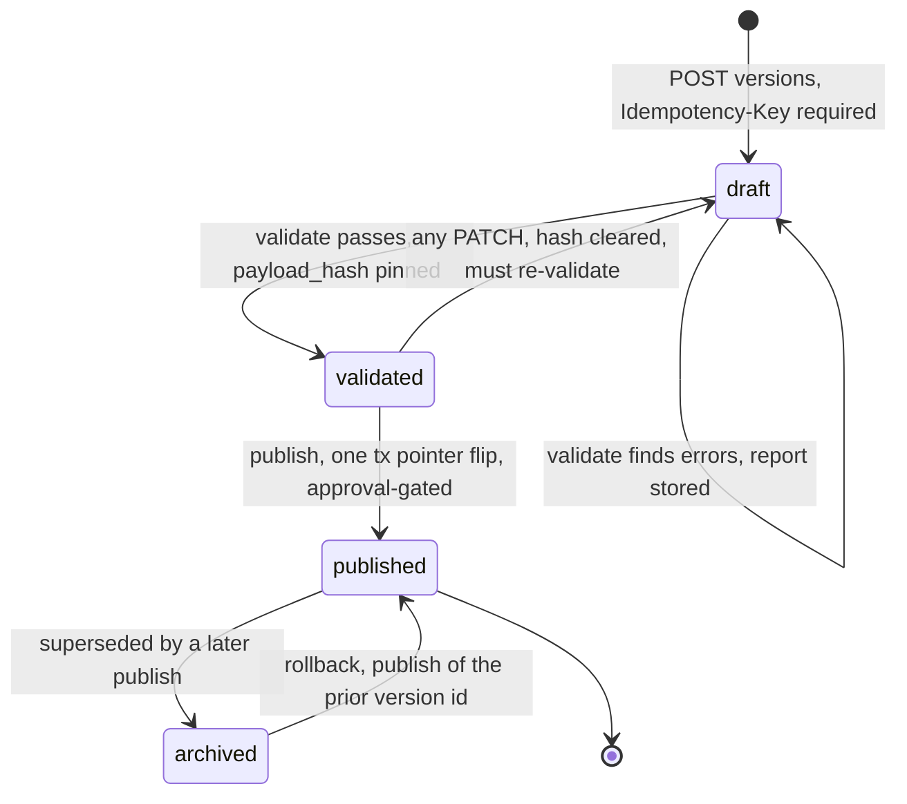
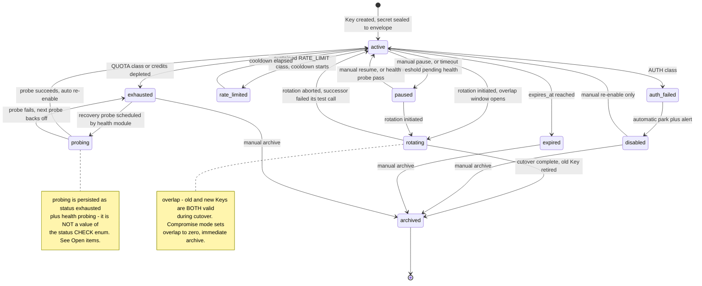

# 07 — Routing & Waterfall Configuration

> **Status:** DRAFT · **Owner:** Principal Product Architect · **Last updated:** 2026-07-02 · **Gated by:** /architecture-review, /security-audit

This document is the contract for the Request Routing Center (module 6), Waterfall Configuration
(module 7), and the Key Rotation Engine's strategy/state-machine surface (module 4). It owns: the
two config payload JSON Schemas, the `scope_key` grammar (handed off from doc 04 open item
OI-API-3), the validation rule catalog, the config lifecycle, the dry-run simulator promised by
`docs/17-Dashboard-Planning.md` §2, the rotation strategy catalog, and the **KM-3 Provider Key
state machine** — formally pinning open item KM-3 from `docs/12-Provider-Key-Management.md`.

Gates by their exact labels: **G1 tenant isolation, G2 idempotency, G3 bounded execution, G4 cost
ceiling, G5 provenance.** Governing invariant: **"the model proposes, a deterministic gate
disposes."**

---

## 1. Concepts

### 1.1 Two payload kinds, one lifecycle

A **Routing Policy** and a **Waterfall workflow** are both `config_versions` payloads (migration
0006, `kind` ∈ `routing_policy` | `waterfall_workflow`) sharing one lifecycle engine (`configver`):
one draft→validate→publish path, one `config_active` pointer, one epoch counter, one audit story.
They differ only in what they govern:

| | Routing Policy (`routing_policy`) | Waterfall workflow (`waterfall_workflow`) |
|---|---|---|
| Governs | *which Providers, in what order, at what bounds* for a scope | *the shape of one Waterfall*: entry, parallel prefix, sequential legs, fallback, stop conditions |
| Scope granularity | Tenant / product / country precedence lattice (§3) | one named workflow per `scope_key`, indexed in `workflow_index` |
| Consumed by | Adaptive Router (`router.Planner`) as overrides/priors/bounds | Execution Engine as the per-Job execution template |
| Endpoints | `/v1/admin/routing/{scope_key}/versions...` | `/v1/admin/workflows/{scope_key}/versions...` |
| Approval gate | `routing_publish` | `workflow_publish` |

### 1.2 Relation to the planner (ADR-0007) and the bandit (ADR-0008)

`router.Planner.Plan` (see `internal/router/plan.go`) produces, per requested Field, a
deterministic Provider ordering by **reservation value** — expected Confidence per credit, highest
first, ties broken by cost then name (the Pandora/Weitzman-style index policy of ADR-0007;
"cascade" in that ADR's title names the index algorithm, never a Waterfall). The `Scorer` seam lets
the Beta-Thompson bandit (ADR-0008) replace static priors with sampled posteriors; each Provider is
scored exactly once per plan, outside the sort comparator, so plans stay reproducible and diffable.

Config's role relative to that machinery is strictly bounded:

- **Priors**: `providers.capabilities` (`[{field, cost_credits, expected_confidence}]`) seed the
  planner; the bandit refines them at runtime.
- **Overrides**: a Routing Policy can turn Providers off/on per scope, bias ordering via
  `priority`, pin explicit orders, or select Key Pools — all of which shape the **proposal**.
- **Bounds**: thresholds and ceilings in config may **tighten** the engine's stop conditions and
  spend limits — never loosen them.

The invariant holds end to end: config and planner together only *propose*. The Execution Engine
re-checks **G3 bounded execution** and **G4 cost ceiling** before every Provider call
(`provider.Call` CallPolicy; `store.Store` CostLedger Reserve/Committed with `ErrCeilingExceeded`).
As `plan.go` states: a routing bug can waste ordering, but it can never overspend or bypass a
bound. Consequently **config can NEVER override G3/G4** — the §5 validators reject any payload that
attempts to exceed engine caps (VR-7, VR-9, VR-15, VR-16), and there is no soft-warn override path.

---

## 2. Routing Policy payload — JSON Schema

Payload of `config_versions` rows with `kind='routing_policy'`. Per-Provider overrides are
**tri-state** (`inherit`/`off`/`on`, MASTER SPEC §10b): `inherit` is transparent to precedence
resolution; a nullable boolean is deliberately not used because it cannot distinguish "no opinion"
from "explicitly off". Lists are atomic under resolution — never merged element-wise (§3).

```json
{
  "$schema": "https://json-schema.org/draft/2020-12/schema",
  "$id": "waterfall:config/routing_policy/v1",
  "title": "routing_policy",
  "description": "Routing Policy payload. Shapes the Adaptive Router proposal only; G3/G4 are enforced by the Execution Engine and cannot be overridden here. Validated by VR-1..VR-16 (doc 07 section 5).",
  "type": "object",
  "additionalProperties": false,
  "required": ["schema_version"],
  "properties": {
    "schema_version": { "const": 1 },
    "scope": {
      "type": "object",
      "description": "Echo of the scope dimensions; must agree with the row scope_key and tenancy (VR-14).",
      "additionalProperties": false,
      "properties": {
        "tenant":  { "type": "string", "pattern": "^[a-z0-9-]{1,64}$", "description": "Present iff the row is Tenant-scoped; must equal the row tenant_id." },
        "product": { "type": "string", "pattern": "^[a-z0-9-]{1,64}$" },
        "country": { "type": "string", "pattern": "^[A-Z]{2}$", "description": "ISO 3166-1 alpha-2, uppercase." }
      }
    },
    "provider_overrides": {
      "type": "object",
      "description": "Per-Provider tri-state override, keyed by Provider id (slug).",
      "additionalProperties": false,
      "patternProperties": {
        "^[a-z0-9-]{1,64}$": {
          "type": "object",
          "additionalProperties": false,
          "required": ["mode"],
          "properties": {
            "mode": { "enum": ["inherit", "off", "on"] },
            "priority": { "type": "integer", "minimum": 0, "maximum": 1000, "description": "Ordering bias fed to the Scorer; higher is tried earlier. Influences proposal order only." },
            "key_pool": { "type": "string", "maxLength": 130, "description": "Key Pool selector in provider_id:name form (matches AuthDescriptor.KeyPoolSelector). When absent and a Tenant BYO pool exists, the BYO pool is preferred (VR-13)." }
          }
        }
      }
    },
    "waterfall": {
      "type": "object",
      "additionalProperties": false,
      "properties": {
        "order": {
          "type": "array", "items": { "type": "string", "pattern": "^[a-z0-9-]{1,64}$" },
          "uniqueItems": true, "maxItems": 16,
          "description": "Explicit Provider order override for this scope. Absent means pure planner ordering by reservation value."
        },
        "parallel_group": {
          "type": "object",
          "additionalProperties": false,
          "required": ["providers"],
          "properties": {
            "providers": {
              "type": "array", "items": { "type": "string", "pattern": "^[a-z0-9-]{1,64}$" },
              "uniqueItems": true, "minItems": 2, "maxItems": 4,
              "description": "Bounded cheap prefix fanned out concurrently per ADR-0007. Size bound enforced by VR-6; every member still passes G3/G4 individually."
            }
          }
        },
        "sequential_chains": {
          "type": "array", "maxItems": 8,
          "items": {
            "type": "array", "items": { "type": "string", "pattern": "^[a-z0-9-]{1,64}$" },
            "uniqueItems": true, "minItems": 2, "maxItems": 8
          },
          "description": "Strict-order chains, for example an email-finder feeding a verifier. Acyclicity across all ordering constructs enforced by VR-5."
        },
        "retry_order": {
          "type": "array", "items": { "type": "string", "pattern": "^[a-z0-9-]{1,64}$" },
          "uniqueItems": true, "maxItems": 8,
          "description": "Which Providers to revisit, in order, when the first pass leaves a Field unfilled. Retry counts stay bounded by the engine CallPolicy (G3)."
        },
        "failover_order": {
          "type": "array", "items": { "type": "string", "pattern": "^[a-z0-9-]{1,64}$" },
          "uniqueItems": true, "maxItems": 8,
          "description": "Substitution order when a planned Provider is unavailable at execution time, for example breaker open or op_state paused."
        }
      }
    },
    "thresholds": {
      "type": "object",
      "additionalProperties": false,
      "properties": {
        "confidence_target":          { "type": "number", "minimum": 0, "maximum": 1, "description": "Stop filling a Field once its Confidence reaches this (stop condition target-met)." },
        "min_confidence":             { "type": "number", "minimum": 0, "maximum": 1, "description": "Results below this Confidence are discarded, never merged." },
        "max_cost_credits_per_field": { "type": "integer", "minimum": 1 },
        "max_cost_credits_per_record": { "type": "integer", "minimum": 1, "description": "May tighten the effective Cost Ceiling for this scope; must not exceed the Tenant budget or Cost Ceiling (VR-7). G4 remains engine-enforced." }
      }
    }
  }
}
```

---

## 3. Scope precedence resolution

### 3.1 `scope_key` grammar (pins doc 04 OI-API-3)

The **tenant dimension is carried by row tenancy**, not by the key: rows with `tenant_id` equal to
a customer Tenant are Tenant-scoped; platform defaults live on `tenant_id='platform'` (ADR-0020
sentinel). `scope_key` encodes only the remaining dimensions, in fixed order, `+`-joined:

```
scope_key := "default" | dim | "product:" slug "+" "country:" alpha2
dim       := "product:" slug | "country:" alpha2
slug      := lowercase [a-z0-9-]{1,64}
alpha2    := uppercase ISO 3166-1 alpha-2
```

Examples: `default`, `country:DE`, `product:prospector`, `product:prospector+country:DE`.
Malformed keys are rejected at draft creation with 400
`{"error":{"code":"invalid_scope_key","message":"..."}}`.

### 3.2 Precedence — most-specific-wins, exactly this order

| Level | Row tenancy | `scope_key` | Scope meaning |
|---|---|---|---|
| 1 | Tenant row | `product:P+country:C` | tenant+product+country |
| 2 | Tenant row | `product:P` | tenant+product |
| 3 | Tenant row | `country:C` | tenant+country |
| 4 | Tenant row | `default` | tenant |
| 5 | platform row | `product:P+country:C` | product+country |
| 6 | platform row | `product:P` | product |
| 7 | platform row | `country:C` | country |
| 8 | platform row | `default` | default |

**Deterministic tie-break:** none is ever needed — the eight levels form a total order, and within
a level `config_active`'s primary key `(tenant_id, kind, scope_key)` guarantees at most one active
version. Resolution is therefore a **pure function**, implemented once in `configver` and reused by
the API resolver, the dry-run simulator, and the engine's config reader (the "computed in exactly
one place" doctrine, doc 00):

```go
// Resolve folds the active payloads for the request dimensions, most-specific-
// wins. Pure: inputs are the up-to-eight candidate payloads plus the request
// dims; output carries the effective value AND its source level for every
// setting, so the UI and dry-run can show provenance, never re-derive it.
func Resolve(dims ScopeDims, active map[ScopeLevel]Payload) Effective
```

Fold rules: **scalar settings and lists are atomic** — the first level (1→8) that defines a
setting supplies it entirely; lists are never merged element-wise. **`provider_overrides` fold
per Provider**: walk levels 1→8 and take the first entry whose `mode` is not `inherit`
(`inherit` is transparent); the winning entry's `priority`/`key_pool` travel with it. Every
resolved setting is returned with its source level (for example "inherited from country:DE, v12").

### 3.3 Three worked examples

Active versions on file: **T4** = tenant acme `default`; **T3** = tenant acme `country:DE`;
**P5** = platform `product:prospector+country:DE`; **P8** = platform `default`.

1. **Level selection.** Request dims `{tenant: acme, product: prospector, country: DE}`. Candidate
   levels present: 3 (T3), 4 (T4), 5 (P5), 8 (P8). Level 1 and 2 have no active rows. For any
   setting defined in T3, T3 wins — tenant+country (level 3) beats tenant `default` (4) and beats
   the more-dimensioned but platform-owned P5 (5). Tenant specificity always outranks platform
   specificity.
2. **Tri-state fold.** Provider `hunter` has `mode:"on"` in P8, `mode:"off"` in T4, and
   `mode:"inherit"` in T3. Walking 1→8: level 3 (T3) says `inherit` → transparent, keep walking;
   level 4 (T4) says `off` → **effective off, source = tenant scope (T4)**. The platform `on` at
   level 8 is never reached. The UI shows the chip "off — inherited from tenant default, v7".
3. **Platform-only fallthrough.** Request dims `{tenant: beta, country: FR}`, and Tenant beta has
   published nothing. Levels 1–4 are empty; level 5–6 empty (no product dim, no product rows);
   platform `country:FR` (level 7) supplies any setting it defines; anything it leaves undefined
   falls to platform `default` (level 8). A setting defined nowhere takes the engine's built-in
   default and is reported with source `engine_default`.

---

## 4. Waterfall workflow payload — JSON Schema

```json
{
  "$schema": "https://json-schema.org/draft/2020-12/schema",
  "$id": "waterfall:config/waterfall_workflow/v1",
  "title": "waterfall_workflow",
  "description": "Waterfall workflow payload. The execution template for Enrichment Jobs in scope. Every bound here may tighten, never loosen, G3/G4. Validated by VR-1..VR-16.",
  "type": "object",
  "additionalProperties": false,
  "required": ["schema_version", "name", "trigger", "fields", "entry_provider",
               "timeout_ms", "confidence_threshold", "max_cost_credits",
               "max_providers", "stop_conditions"],
  "properties": {
    "schema_version": { "const": 1 },
    "name":    { "type": "string", "minLength": 1, "maxLength": 120, "description": "Denormalized into workflow_index for the list view." },
    "trigger": { "enum": ["api", "batch", "webhook"], "description": "How Enrichment Jobs enter this Waterfall; denormalized into workflow_index." },
    "fields": {
      "type": "array", "minItems": 1, "maxItems": 32, "uniqueItems": true,
      "items": { "type": "string", "pattern": "^[a-z0-9_]{1,64}$" },
      "description": "Target Fields, canonical snake_case vocabulary only (docs/00 section 7), for example work_email, mobile_phone, direct_dial."
    },
    "entry_provider": { "type": "string", "pattern": "^[a-z0-9-]{1,64}$", "description": "First Provider tried. Must differ from fallback_provider (VR-10)." },
    "parallel_providers": {
      "type": "array", "items": { "type": "string", "pattern": "^[a-z0-9-]{1,64}$" },
      "uniqueItems": true, "maxItems": 4,
      "description": "Bounded cheap prefix fanned out after entry, per ADR-0007. Size bound enforced by VR-6."
    },
    "sequential_providers": {
      "type": "array", "items": { "type": "string", "pattern": "^[a-z0-9-]{1,64}$" },
      "uniqueItems": true, "maxItems": 8,
      "description": "Ordered fall-through legs after the parallel group."
    },
    "retry_logic": {
      "type": "object",
      "additionalProperties": false,
      "properties": {
        "max_retries": { "type": "integer", "minimum": 0, "maximum": 3 },
        "backoff_ms":  { "type": "integer", "minimum": 100, "maximum": 30000 },
        "retry_on": {
          "type": "array", "uniqueItems": true,
          "items": { "enum": ["TRANSIENT", "RATE_LIMIT", "PROVIDER_DOWN"] },
          "description": "Retryable classes of the 8-class error taxonomy only. The engine CallPolicy applies its own attempt cap regardless — config tightens, never loosens (G3)."
        }
      }
    },
    "timeout_ms": { "type": "integer", "minimum": 250, "maximum": 120000, "description": "Whole-Waterfall deadline. Per-call timeouts remain owned by provider rows plus the G3 CallPolicy; bounds enforced by VR-9." },
    "confidence_threshold": { "type": "number", "minimum": 0, "maximum": 1, "description": "Per-Field Confidence at which the target-met stop condition fires." },
    "min_score": { "type": "number", "minimum": 0, "maximum": 1, "description": "Floor below which a candidate value is rejected before merge." },
    "max_cost_credits": { "type": "integer", "minimum": 1, "description": "Per-Job spend bound; must not exceed the Tenant budget or Cost Ceiling (VR-7). The ceiling stop condition and G4 enforce at run time." },
    "max_providers": { "type": "integer", "minimum": 1, "maximum": 16, "description": "Hard cap on distinct Providers called per Job (VR-16); the exhausted stop condition fires when the plan runs out earlier." },
    "fallback_provider": { "type": "string", "pattern": "^[a-z0-9-]{1,64}$", "description": "Tried last, once, if targets are unmet and budget remains." },
    "stop_conditions": {
      "type": "array", "minItems": 1, "uniqueItems": true,
      "items": { "enum": ["target-met", "ceiling", "exhausted", "timeout"] },
      "description": "Which stop reasons this Waterfall honors; must be non-empty (VR-11). ceiling and timeout are ALSO engine-enforced unconditionally via G4/G3 whether listed or not."
    }
  }
}
```

---

## 5. Validation rule catalog

`POST .../versions/{id}/validate` runs every rule, stores the full report in
`config_versions.validation_report`, and pins `payload_hash`. Validation always returns HTTP 200 —
**a failed rule is report content, not a transport error** (doc 04 §2.7); the version transitions
to `validated` iff the report has zero `error`-severity entries. Warnings never block publish but
are shown to approvers.

Report entry shape (uniform, machine-readable):

```json
{
  "rule": "VR-2",
  "code": "provider_excluded",
  "severity": "error",
  "path": "/waterfall/order/1",
  "message": "provider clearbit has inclusion status EXCLUDED and cannot be referenced"
}
```

`validation_report` = `{"validated_at": "...", "payload_hash": "<hex>", "errors": [...],
"warnings": [...]}`. Message shape: lowercase sentence, names the offending object and the
violated bound, no PII, no secrets.

| ID | Rule | Checked against | Severity | Error code |
|---|---|---|---|---|
| VR-1 | Every referenced Provider id exists in the catalog | `providers` | error | `provider_unknown` |
| VR-2 | No referenced Provider has inclusion status `EXCLUDED`; a tri-state `mode:"on"` for an EXCLUDED Provider is equally rejected | `providers.status` (ADR-0009 trichotomy) | error | `provider_excluded` |
| VR-3 | A `DEPRIORITIZED` Provider may be referenced only when `compliance_review_status='approved'` | `providers.compliance_review_status` | error | `provider_compliance_unreviewed` |
| VR-4 | Runtime `op_state` must be `enabled` (pass) or `maintenance` (warn); `disabled`/`paused` block | `providers.op_state` | error / warning | `provider_op_state_blocked` / `provider_in_maintenance` |
| VR-5 | No cycles across `order`, `sequential_chains`, `retry_order`, `failover_order`, entry→parallel→sequential→fallback | payload graph | error | `waterfall_cycle` |
| VR-6 | Parallel group size within the bounded cheap prefix cap (`maxItems` 4, `PARALLEL_GROUP_MAX`) | payload + ADR-0007 bound | error | `parallel_group_too_large` |
| VR-7 | `max_cost_credits` (and per-field/per-record thresholds) must not exceed the Tenant's applicable budget row and Cost Ceiling — config may tighten G4, never loosen it | `budgets`, Tenant Cost Ceiling | error | `cost_exceeds_budget` |
| VR-8 | All Confidence-typed values in [0,1] | payload | error | `threshold_out_of_range` |
| VR-9 | `timeout_ms` within engine bounds [250, 120000] and never above the G3 CallPolicy envelope | payload + engine caps | error | `timeout_out_of_bounds` |
| VR-10 | `fallback_provider` differs from `entry_provider` | payload | error | `fallback_equals_entry` |
| VR-11 | `stop_conditions` non-empty and a subset of the closed enum | payload | error | `stop_conditions_empty` / `stop_condition_unknown` |
| VR-12 | Referenced Provider sunsetting within 30 days → warning; past `sunset_at` → error | `providers.sunset_at` | warning / error | `provider_sunsetting` / `provider_sunset` |
| VR-13 | When both a Tenant BYO Key Pool and a platform pool exist for a referenced Provider, resolution prefers BYO; explicitly pinning the platform pool while BYO exists warns | `key_pools.owner_tenant_id` | warning | `byo_pool_available` |
| VR-14 | `scope` echo agrees with the row's `scope_key` and tenancy | row metadata | error | `scope_mismatch` |
| VR-15 | Referenced Providers advertise at least one capability for the payload's target Fields; Fields must be canonical vocabulary | `providers.capabilities`, docs/00 §7 | warning / error | `provider_no_capability` / `field_unknown` |
| VR-16 | `max_providers` within [1,16]; no duplicate Provider within any single ordering list; catch-all rejection of any construct that would exceed a G3/G4 engine cap | payload + engine caps | error | `max_providers_out_of_bounds` / `duplicate_provider` / `gate_override_rejected` |

Parity obligation (doc 00 doctrine): rule ids ⊆ validator switch ⊆ `GET /v1/admin/meta/enums`
error-code list, enforced by a test alongside the OpenAPI parity test.

---

## 6. Lifecycle



- **Draft**: `draft` and `validated` versions are mutable — **a `PATCH` on a `validated` version
  clears the pinned `payload_hash` and reverts it to `draft`** (must re-validate); `PATCH` on
  `published`/`archived` returns 409 `version_conflict`. The `payload_hash` pinned at validation is
  the tamper-evidence: approvals bind to bytes, not intent, so a mutated payload makes a pending
  approval unexecutable (stale-review dismissal, doc 05).
- **Publish transaction** (single tx, exactly this sequence): (1) **lock the serialization
  point** — the `config_active` pointer row, not the version row: `INSERT INTO config_active
  (tenant_id, kind, scope_key, ...) VALUES (...) ON CONFLICT DO NOTHING` (first-ever publish only),
  then `SELECT active_version_id FROM config_active WHERE (tenant_id, kind, scope_key) FOR UPDATE`;
  409 `{"error":{"code":"version_conflict","message":"..."}}` unless the locked `active_version_id`
  equals the request's `expected_active_version_id` (a publish/rollback request parameter that
  defaults to the draft's `parent_version_id`, and is pinned into the approval payload for gated
  publishes so the executor commits against the same expectation the approver saw), AND the version
  row still has `status='validated'` with stored `payload_hash` matching the pinned hash — any
  check failing → 409; (2) `approvals.Gate` (`routing_publish` / `workflow_publish`) — an existing
  policy returns 202 `{approval_request_id}` and the executor later re-enters this same transaction
  with idempotency key = request id; (3) still under the pointer lock: archive the previous active
  version → `archived`, flip the `config_active` pointer for `(tenant_id, kind, scope_key)` to the
  new version, and set it → `published` (the pointer is authority; statuses are bookkeeping, and a
  superseded version never remains `published`); (4) `config_epochs` bump for `(tenant_id, kind)`;
  (5) `audit_log` append into the hash chain; (6) `NOTIFY` for cache refresh (poller fallback
  independent of NOTIFY, §10). Nothing is ever destroyed.
- **Concurrent publish**: with two different `validated` drafts racing on the same
  `(tenant_id, kind, scope_key)`, the second transaction blocks on the `config_active` pointer's
  `FOR UPDATE` lock; when it acquires the lock the winner has already moved `active_version_id`, so
  the loser's `expected_active_version_id` no longer matches → 409 `version_conflict`. Exactly one
  commits, the loser observes 409. This is the P3 acceptance gate ("lifecycle + concurrent-publish
  conflict").
- **Rollback** = `POST .../rollback {"to_version": N}` — literally a publish of the prior version
  id: same `config_active` pointer lock, same transaction, same audit spine, and the same
  `expected_active_version_id` staleness check (captured at rollback-request time and pinned into
  the approval payload). Rollback differs from publish only in its **status gate**: instead of
  `status='validated'` it requires the target version to be `status IN ('archived','published')`
  AND `published_at IS NOT NULL` AND its `payload_hash` intact. Validators are **re-run at
  rollback** because the world drifts — a Provider EXCLUDED since that version shipped must block
  the rollback; hard errors → 409 `version_conflict` with the fresh report attached (decision
  recorded in Open items).

---

## 7. Dry-run / Provider simulator

`POST .../versions/{id}/dry-run` is the Provider simulator promised in
`docs/17-Dashboard-Planning.md` §2, honored verbatim: **read-only, zero Provider calls, no paid
credits.** It runs the real `router.Planner` against the **draft** payload with **current
reservation values** (live capabilities, current bandit posteriors via the `Scorer` seam) — never a
reimplementation, so simulator and engine can never disagree.

Guarantees: the Planner is a pure function over adapter capabilities and scores — no
`provider.Call`, no egress client anywhere on the code path; a P3 test asserts zero egress.
The response returns, per Field:

```json
{
  "resolved_scope": {
    "levels_consulted": ["tenant+country", "tenant", "default"],
    "overrides": { "hunter": { "effective": "off", "source": "tenant", "source_version": 7 } }
  },
  "by_field": {
    "work_email": [
      { "provider": "prospeo",  "cost_credits": 2, "expected_confidence": 0.88 },
      { "provider": "hunter",   "cost_credits": 3, "expected_confidence": 0.81 },
      { "provider": "zoominfo", "cost_credits": 9, "expected_confidence": 0.90 }
    ]
  },
  "max_committed_credits": 14,
  "stop_projection": { "condition": "target-met", "expected_providers_used": 2 },
  "warnings": []
}
```

- `by_field` is the planned Provider order with declared cost and expected Confidence per step.
- `max_committed_credits` is `Plan.MaxCommitted` — the worst case if every step ran; the engine's
  G4 gate will not actually let spend exceed the ceiling, so this is a planning-time surfacing of
  "this Record cannot be fully satisfied within budget".
- `stop_projection` names which stop condition is projected to fire first under declared
  expectations — a model, labeled as such in the UI.
- `resolved_scope` carries the §3 provenance (effective value + source scope per setting) so the
  editor's dry-run panel can explain *why* the order is what it is.

Approvers review this same artifact: the `/approvals` detail view renders draft-vs-active diff +
`validation_report` + dry-run output — review the machine-checked consequence, not the request.

---

## 8. Rotation strategy catalog (module 4)

The 12 Key Pool strategies (`key_pools.strategy` CHECK, migration 0005; catalog served by
`GET /v1/admin/rotation/strategies`; params live in `key_pools.strategy_params` jsonb — change
semantics and the Principle 3 exemption are pinned in §8.1). Hot-path
selection is O(1) per MASTER SPEC §5: per-pool in-memory `PoolState` rebuilt on config-epoch
change; score-driven strategies are re-banded by a 1s background loop into 16 approximate-priority
buckets so the hot path only picks from the best non-empty bucket — never scans or sorts. Ordered
walks are bounded by pool size with a first-hit fast path. Every selection is concurrency-safe
(atomics, never locks on the hot path) and every lease outcome flows back via
`rotation.LeaseResolver` → `Lease.Done(Outcome)`.

| Strategy | Semantics | `strategy_params` schema | Hot-path mechanism |
|---|---|---|---|
| `round_robin` | uniform cycle over available pool members | `{}` | atomic uint64 index mod ring size |
| `least_used` | prefer the Key with the lowest recent usage | `{"window_s": 300}` | 16-bucket banding by usage EWMA; round-robin within best bucket; 1s re-band |
| `weighted` | draws proportional to `provider_keys.weight` | `{}` (weights on the Key rows) | alias-method table rebuilt on epoch change; O(1) two-probe draw |
| `credit_based` | prefer Keys with the most `credits_remaining`; starve near-empty Keys | `{"reserve_floor": 0}` | 16-bucket banding by remaining credits |
| `region_based` | route to the Key sub-pool matching the request region, inner strategy within | `{"fallback_region": "us", "inner_strategy": "round_robin"}` | map region → sub-ring, inner strategy per sub-ring |
| `lowest_latency` | prefer the lowest `latency_ewma_ms` | `{"window_s": 300}` | 16-bucket banding by latency EWMA |
| `highest_success` | prefer the highest `success_ewma` | `{}` | 16-bucket banding by success EWMA |
| `ai_routing` | Beta-Thompson bandit across Keys — explores under uncertainty, exploits winners | `{"prior_alpha": 1, "prior_beta": 1}` | per-Key Beta posteriors (ADR-0008 machinery reused); sampled scores refreshed by the 1s re-band loop; hot-path pick from best bucket stays O(1) |
| `random` | uniform random member | `{}` | `math/rand/v2` index |
| `priority` | strict priority order (`provider_keys.priority`), skip unavailable | `{}` | ordered walk with per-Key `atomic.Bool` availability |
| `failover` | primary serves until unhealthy, then next; optional automatic failback | `{"failback": true}` | ordered walk; availability bools flipped by the KM-3 state machine |
| `overflow` | primary serves until a rate/quota threshold, excess spills to the next Key | `{"spill_threshold_pct": 80}` | ordered walk gated by the per-Key lease token bucket |

Quota safety is strategy-independent: batched leases against `key_budgets`
(`UPDATE ... WHERE day_leased + $2 <= daily_limit RETURNING`, batch ≤ 64); a crash loses at most
one batch; nightly reconcile rewrites `day_used` from `usage_events` ground truth. Cross-instance
convergence ≤ 1s is a design target, UNVERIFIED until the P2 load test.
`GET /v1/admin/key-pools/{id}/selection-state` exposes the live `PoolState` (bands, ring index,
availability bools) for debugging; `POST /v1/admin/key-pools/{id}/simulate` draws N selections with
zero egress.

### 8.1 Strategy assignment is live operational config — recorded decision (Principle 3 exemption)

Pool `strategy` + `strategy_params` are deliberately **exempt** from the doc 02 Principle 3
draft→validate→publish lifecycle (`configver`): they are mutated in place via
`PUT /v1/admin/key-pools/{id}/strategy` and `PATCH /v1/admin/key-pools/{id}` (doc 04 §2.4). This is
a recorded decision (OI-RW-6), not an omission, with these load-bearing reasons and semantics:

- **Why exempt.** `key_pools` is a **Class P platform operational table** (ADR-0020): its RLS grants
  tenants at most a read projection (BYO `FOR SELECT`), so writes are operator-only, single-owner
  (`keys`/`rotation` features) — not tenant-authored config. Strategy selection tunes *which Key
  serves next* against volatile runtime state (availability bools, budgets, EWMAs), and the doc 14
  key-exhaustion / key-compromise runbooks require flipping a pool to `failover`/`priority` in
  seconds — an approval-gated publish cycle would gate incident response. The blast radius is
  bounded by construction: a strategy shapes only the *proposal* of a Key; quota safety is
  strategy-independent (batched leases above), spend stays G4-enforced, attempts stay G3-enforced,
  and G5 attribution rides `Lease.Done` per `key_id` regardless of which strategy picked the Key.
- **Validation is still synchronous.** The write handler validates `strategy` against the 0005
  CHECK enum and `strategy_params` against the per-strategy schema column of the §8 table before
  any row is touched; mismatch → 422
  `{"error":{"code":"strategy_params_invalid","message":"..."}}`. Unvalidated params can never
  reach `PoolState`.
- **Audit + reversal.** Every strategy/params write appends an `audit_log` hash-chain row carrying
  the full `before`/`after` tuples. Rollback = re-`PUT` the `before` tuple from the change history —
  version history lives in the audit chain instead of `config_versions`, and reversal is one write.
- **Concurrent-write semantics: last-write-wins, serialized and idempotent.** The mutation is a
  single-row `UPDATE` — the row lock serializes racing writers, so there is no torn
  strategy/params state, only a deterministic last winner plus one audit row per writer.
  `Idempotency-Key` is required as on every admin write (same key + different body → 409, doc 04
  conventions), so retries never double-apply. LWW is acceptable here precisely because writers
  are few (operator RBAC, Class P), the tuple is atomic, and a lost intent is fully recoverable by
  re-`PUT` from the audit `before` image.
- **Propagation.** The same write bumps `config_epochs('platform', 'key_pool')` through the
  configver-owned `BumpEpoch` API — the doc 03 §6 one-owner registry's enumerated second-writer
  exception (`internal/dash/keys`, kind=`key_pool` only), so `config_epochs` keeps a single write
  mechanism even for this live-config path. This is the "config-epoch change" that triggers the §8
  `PoolState` rebuild (epoch mechanics in §10) — and emits SSE `key.pool.changed`. Cross-instance
  convergence is bounded by the OI-RW-5 ≤ 1s target.

---

## 9. KM-3 — the Provider Key state machine (formally pinned)

This section resolves open item **KM-3** of `docs/12-Provider-Key-Management.md` ("auto
disable/enable/failover state machine — drafted; detail at impl"). States are the
`provider_keys.status` CHECK vocabulary (0005); transitions are triggered **exclusively** by the
8-class error taxonomy reported through `Lease.Done(Outcome)` — the dashboard never parses
Provider response bodies.



Trigger mapping (the 8-class taxonomy → transitions):

| Error class / event | Transition | Recovery path |
|---|---|---|
| `QUOTA` (incl. HTTP 402) or credits depleted | `active → exhausted` | auto: recovery probe → `probing → active` |
| `RATE_LIMIT` (HTTP 429) sustained | `active → rate_limited` | auto: cooldown elapse |
| `AUTH` (HTTP 401) | `active → auth_failed → disabled` + alert | **manual re-enable only** — a possibly-compromised Key must never self-heal; compromise runbook defaults to immediate archive |
| timeout count over threshold | `active → paused` pending health | health probe pass or manual resume |
| `PROVIDER_DOWN` | **no Key transition** — Provider-level breaker opens | breaker half-open probe (Provider scope) |
| `expires_at` reached | `active → expired` | rotation (successor Key) |
| rotation initiated | `any → rotating` (overlap: old + new valid) | successor test-call pass → weight shift → old `→ archived`; abort → old `→ active` |
| manual archive | `any → archived` | none — terminal |

**Breaker-open is orthogonal** to this state machine: the three-state `provider.Breaker` operates
per (Provider, Key) and gates calls independently of `status`; effective Key availability is the
computed conjunction `rotation.KeyAvailable` (inclusion status × op_state × key state × breaker ×
budget), computed in exactly one Go function and returned by the API — never derived by the UI
(MASTER SPEC §10b). Every transition writes an `audit_log` row and emits SSE `key.status.changed`;
G5 provenance is unaffected because usage attribution rides `Lease.Done` regardless of state.

---

## 10. Config epochs & caching

- **Epoch counter**: `config_epochs(tenant_id, kind, epoch)` is bumped inside every publish
  transaction (§6). Readers — the engine's config reader, the rotation engine's `PoolState`
  builder, dashboardd's own resolvers — cache resolved config keyed by `(kind, scope, epoch)` and
  drop the cache entry the moment they observe a newer epoch. Beyond the versioned
  `routing_policy`/`waterfall_workflow` publish path, two live-config sentinel kinds are bumped by
  the same configver-owned `BumpEpoch` API from their own in-transaction sites:
  `('platform','provider_catalog')` on providers CRUD / op-state writes, and
  `('platform','key_pool')` on `key_pools` strategy/membership (§8.1) and `provider_keys`
  rotation/compromise writes (the latter via the registered `internal/dash/keys` second writer) —
  each bump invalidating the matching resolver / `PoolState` caches, including the
  compromise-rotation immediate-rebuild path.
- **Propagation**: publish emits `NOTIFY`; each instance additionally refreshes epochs on a 1s
  poll loop, so correctness never depends on NOTIFY delivery (the poller ships first; LISTEN/NOTIFY
  is the timeboxed extension, ADR-0019).
- **Jobs pin the full resolved set, not one id**: effective routing config is a §3.2 fold of up to
  eight active routing-policy versions plus one Waterfall workflow version — pinning a singular id
  would leave the other levels floating under mid-flight publishes. At admission, every Enrichment
  Job therefore records a **config pin set**, captured in one epoch-consistent read of
  `config_active`: (1) `workflow_version_id` — the `waterfall_workflow` version id, stored as the
  Job's `config_version_id`; and (2) `routing_version_ids` — the `(level, config_version_id)` pair
  for **every §3.2 level that had an active row at resolution time**, absent levels recorded as
  absent. This pin set is embedded in the `job_outbox` payload at admission
  (`{config_version_id, routing_version_ids: [{level, version_id|null} × 8]}`), so replay and
  redrive (doc 06 §3) read it back from the immutable payload rather than any mutable engine column.
  The Job runs under this pin set to completion: a mid-flight publish at ANY level never
  mutates running work; replay (doc 06 §3) re-executes `Resolve` over exactly the pinned version
  payloads — version rows are immutable once published and never destroyed (§6), so the fold
  reproduces the identical `Effective` config, including per-setting source levels; and G5
  provenance can name every version that contributed to every Field value, not just the workflow.
  Percentage-based traffic splitting between versions was rejected (doc 01, Domain 1) precisely to
  keep this pinning deterministic.
- **Stale-read consequence (bounded and safe)**: a reader is at most **one epoch behind for at most
  ~1s** (one poll interval; UNVERIFIED until P3 measurement). The worst case is an Enrichment Job
  planned under the previous version — which is exactly as safe as a Job admitted one second
  earlier: it pins the version it read (G5), and G3/G4 are enforced by the Execution Engine at
  call time regardless of which config proposed the plan. `GET /v1/admin/config/epochs` exposes
  current epochs as a cheap poll target for machine clients; the SPA treats config queries as
  30s-stale and invalidates on `*.changed` SSE events.

Cache inventory entries (trigger, TTL, stale-read consequence) for the resolver cache and
`PoolState` are registered in doc 02's cache inventory; this section is their semantic authority.

---

## Open items

| ID | Item | Status | Owner |
|---|---|---|---|
| OI-RW-1 | KM-3 `probing` is persisted as `status='exhausted'` + `health='probing'` — the 0005 status CHECK is unchanged; the state machine diagram shows probing as a distinct state for operator comprehension. | RESOLVED (decision, §9) — pins KM-3 | Principal Product Architect |
| OI-RW-2 | `scope_key` grammar pinned (§3.1); resolves the handoff from doc 04 open item OI-API-3. | RESOLVED (§3.1) | Principal Product Architect |
| OI-RW-3 | Validators re-run at rollback; hard errors block with 409 `version_conflict` + fresh report (world-drift protection). | RESOLVED (decision, §6) | Principal Product Architect |
| OI-RW-4 | `PARALLEL_GROUP_MAX` default of 4 (VR-6) is a design bound; revisit against measured Provider fan-out cost after the P12 load test. UNVERIFIED. | open — P12 | Senior Backend Engineer |
| OI-RW-5 | Rotation cross-instance convergence ≤ 1s and 10k selections/s are design targets. UNVERIFIED until the P2 gate load test. | open — P2 | Senior Backend Engineer |
| OI-RW-6 | Key Pool `strategy`/`strategy_params` are **exempt from the Principle 3 configver lifecycle** — recorded decision with full semantics (validation, audit reversal, LWW concurrency, `key_pool` epoch propagation) in §8.1. The exemption is now mirrored into doc 03 §6's one-owner registry (`config_epochs` second writer `internal/dash/keys` via the configver `BumpEpoch` API, kind=`key_pool` only; `key_pools` row notes the §8.1 Principle 3 exemption) and doc 02's principles-compliance table. | RESOLVED (decision, §8.1; doc 02/03 mirrors landed) | Principal Product Architect |
