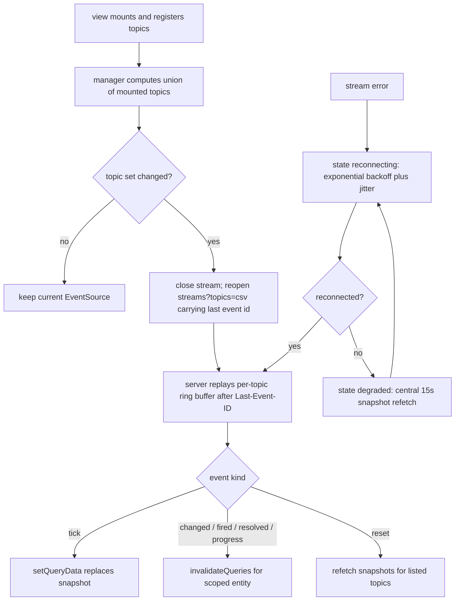

# 08 — UI Architecture

> **Status:** DRAFT · **Owner:** Enterprise UX Architect · **Last updated:** 2026-07-02 · **Gated by:** /architecture-review, /security-audit

> This document specifies the frontend of the Management Dashboard: a React + TypeScript + Vite
> SPA in `web/`, served statically by `cmd/dashboardd`, consuming **only** the `/v1/admin` surface
> defined in [doc 04](04-api-contracts.md). It is consistent with the MASTER DESIGN SPEC §9,
> honors the [doc 17](../17-Dashboard-Planning.md) panel → backing-service rule (no orphan UI —
> every screen binds to endpoints in doc 04; the proof table lives in
> [doc 09](09-ui-wireframes.md)), and uses the [Glossary](../00-Project-Overview.md) verbatim:
> Tenant, Provider, Provider Key, Key Pool, Waterfall, Enrichment Job, Field, Confidence,
> Cost Ceiling, Idempotency Key. The SPA is a pure consumer: it renders server truth and proposes
> writes; every write is disposed of by a deterministic server-side gate — **"the model proposes,
> a deterministic gate disposes"** (**G1 tenant isolation**, **G2 idempotency**, **G3 bounded
> execution**, **G4 cost ceiling**, **G5 provenance**). Nothing in this document weakens a gate;
> the client never derives what the server computes.

---

## 1. Stack and rationale (ADR-0016)

The repo's core value is zero third-party dependencies in Go. A hand-rolled browser UI at the
AWS-Console/Datadog quality bar is not a realistic stdlib-equivalent exercise, so **ADR-0016**
records a **frontend-only exception**: a fixed, enumerated dependency allowlist, each entry
individually justified, everything else forbidden. The backend remains stdlib-only; the exception
does not leak across the `web/` boundary.

### 1.1 Runtime dependency allowlist (closed)

| Package | Why it is on the list |
|---|---|
| `react` | Component model and renderer core; the single rendering abstraction — no second UI framework may enter. |
| `react-dom` | Browser renderer for React; version-pinned in lockstep with `react`. |
| `react-router` | Client route tree with nested layouts and route-segment tabs, so every view (including a Provider detail tab) is deep-linkable and refresh-safe. |
| `@tanstack/react-query` | The **sole owner of server state**: cache, staleTime tiers, `useInfiniteQuery` cursor pagination, and the `setQueryData`/`invalidateQueries` seams the SSE manager patches into (§4, §5). |
| `@tanstack/react-table` | Headless table logic (column defs, sort state, selection) for high-density grids; ships zero styles — rendering stays in our primitives (§6). |
| `@tanstack/react-virtual` | Row virtualization for grids that exceed 100 rows (1,000+ Provider Keys per Provider); windowed DOM is the only way to hold the 60fps scroll target (§10). |
| `recharts` | Declarative SVG time-series/stacked charts for stats, health, and cost views; wrapped once in `lib/charts/` and fed exclusively by design tokens (§6). |
| `dnd-kit` | Drag-and-drop with first-class keyboard sensors and ARIA announcements — required for an accessible routing-lane editor and Waterfall builder (doc 09 §6–7). |
| `zustand` | Minimal store for **UI-only** state (wizard step, drawer open, grid selection) without context re-render storms; never holds server data (§4). |
| `qrcode` | Renders the TOTP provisioning URI as a QR code at MFA enrollment, entirely client-side — the seed is displayed once and never re-fetched (doc 05). |

### 1.2 Dev-time dependencies

| Package | Why |
|---|---|
| `vite` | Dev server (proxy to dashboardd) and production build with content-hashed assets (§11). |
| `typescript` | `types.gen.ts` from `openapi-admin.yaml` makes the API contract a compile-time check (doc 04 §6). |
| `vitest` | Unit tests: cursor helpers, status mapping, SSE event routing, permission mirror (doc 13). |
| `playwright` | E2E flows: login+MFA, import, publish-with-approval, DLQ replay (doc 13). |

### 1.3 Amendment rule

**Any package not in §1.1/§1.2 requires an amendment to ADR-0016 before it may appear in
`package.json`.** No CSS framework, no component library, no date library, no HTTP client, no
state framework, no icon pack: styling is `tokens.css` + primitives, HTTP is `fetch` in
`api/client.ts`, dates are `Intl`/`Date` in `lib/format.ts`, icons are inline SVG in primitives.
A CI check fails the build when `package.json` dependencies deviate from the allowlist (P8).

---

## 2. Directory structure

Per MASTER SPEC §9, with file-level detail. Small single-purpose files, mirroring the repo's Go
style. Feature directories match `internal/dash/<feature>` names one-to-one so a panel, its
hooks, and its backend feature are always co-navigable — with **one recorded exception**: the
Key Pool pages (`/key-pools`, `/key-pools/:id`) live in `features/rotation` even though pool
CRUD endpoints are owned by `internal/dash/keys` (doc 00 module 3), because the pool screens'
defining interactions — strategy assignment, selection-state inspection, simulation — are owned
by `internal/dash/rotation` (doc 00 module 4) and a pool is meaningless UX without its rotation
semantics. The exception is deliberate, not drift; it is recorded as **OI-UI-4**, and
`rotation/api.ts` remains the only place those endpoint paths are named.

```
web/
  index.html                 SPA shell; no external assets (strict same-origin CSP, §11)
  package.json               allowlist-locked (§1.3)
  tsconfig.json
  vite.config.ts             dev proxy /v1 + /healthz -> :8080; build -> dist/ (§11)
  src/
    main.tsx                 mounts <App/> from app/providers.tsx
    app/
      router.tsx             route tree (§3); React.lazy per feature chunk (§10)
      providers.tsx          QueryClientProvider (staleTime tiers §4), SSE manager provider (§5),
                             Toast region, top-level ErrorBoundary (§8), theme attribute owner
      guards.tsx             RequireAuth, RequireRole wrappers around lib/permissions.ts (§7)
    api/
      client.ts              fetch wrapper: CSRF header injection, Idempotency-Key generation,
                             uniform error-envelope parsing, 401 interceptor (§7)
      sse.ts                 the SSE manager: ONE EventSource per tab, topic refcounting,
                             tick-patch / changed-invalidate routing, degradation fallback (§5)
      types.gen.ts           generated from docs/waterfall-dashboard/openapi-admin.yaml;
                             never hand-edited; regenerated in the build (§11)
      keys.ts                query-key factory: hierarchical keys per feature for precise
                             invalidation (['providers','detail',id], ['queues','stats',name,win])
    design/
      tokens.css             custom properties: color/space/type/status scales + dark mode (§6)
      primitives/            one file per primitive + index.ts barrel (§6.2):
        Button.tsx Input.tsx Select.tsx Table.tsx Modal.tsx Drawer.tsx Tabs.tsx Toast.tsx
        Badge.tsx StatTile.tsx EmptyState.tsx ConfirmDialog.tsx CodeBlock.tsx TimeRangePicker.tsx
    features/                overview providers keys rotation health routing workflows queues
                             workers cost security alerts approvals auth — each contains:
      <feature>/routes.tsx   route objects consumed by app/router.tsx (lazy boundary)
      <feature>/api.ts       typed react-query hooks over api/client.ts + types.gen.ts;
                             the ONLY place a feature names endpoint paths
      <feature>/components/  feature components (compose primitives; no raw CSS values)
      <feature>/state.ts     zustand store, UI state only (selection, wizard step, panel toggles)
      <feature>/*.test.ts(x) co-located vitest unit tests beside the code under test (doc 13 §1);
                             lib/ and api/ follow the same co-location rule (cursors.test.ts,
                             status.test.ts totality, sse.test.ts routing, permissions.test.ts)
    lib/
      cursors.ts             useInfiniteQuery helpers for the opaque {"k","id"} cursor envelope
                             (doc 04 §1.4): getNextPageParam, page flattening, limit cap guard
      format.ts              credits, durations, EWMA, relative time ("41s ago"), UTC timestamps
      permissions.ts         role x action matrix mirror hydrated from GET /v1/admin/roles;
                             cosmetic only — the server is the authority (§7)
      status.ts              the single mapping of EVERY closed enum (Provider Key status,
                             op_state, worker status, alert state, ErrorClass) to
                             {token, icon, label} — defined once, unit-tested for totality
      charts/                recharts wrappers (TimeSeries, StackedBars, Histogram, UptimeBar,
                             Heatmap) bound to tokens; no hardcoded hex anywhere
  dist/                      build output, served by dashboardd (§11); never committed
```

Two files extend the MASTER SPEC §9 listing — `api/keys.ts` and `lib/status.ts` — both direct
consequences of research findings (doc 01, Domain 7: single status-token mapping; query-key
discipline for SSE cache patching). Recorded in Open items (OI-UI-2).

---

## 3. Route map

31 registered paths across the ~26 route families of MASTER SPEC §9. Every route is lazy-loaded
at the feature boundary. Guards are the `lib/permissions.ts` mirror of the doc 05 role matrix —
**cosmetic**; the server re-authorizes every request (RBAC shorthand per doc 04 §1.2: O =
operator, TA+ = tenant_admin or operator, TU+ = any authenticated principal). Data deps are
relative to `/v1/admin`; SSE topics use the singular vocabulary pinned in doc 04 §3.2.

| Route | Component (feature) | Data dependencies | SSE topics | Guard |
|---|---|---|---|---|
| `/login` | `auth/LoginPage` | `POST /auth/login` | — | public |
| `/mfa` | `auth/MfaPage` | `POST /auth/mfa/verify` | — | pre-session |
| `/` | `overview/OverviewPage` | `GET /overview`, `GET /overview/tiles/{tile}` | `overview`, `alert` | TU+ |
| `/providers` | `providers/ProviderListPage` | `GET /providers` | `provider` | TU+ (projection) / O (full) |
| `/providers/compare` | `providers/ComparePage` | `GET /providers/compare?ids=`, `GET /providers/coverage`, `GET /providers/rankings` | — | O |
| `/providers/:id` (tabs `config·keys·health·stats·history`) | `providers/ProviderDetailPage` | `GET/PATCH /providers/{id}` + actions; `GET /providers/{id}/keys`; `GET /providers/{id}/health`; `GET /providers/{id}/stats`; `GET /change-history/provider/{id}` | `provider`, `key` | TU+ (projection) / O |
| `/keys` | `keys/KeyGridPage` | `GET /providers/{id}/keys` (Provider context selector), `POST /keys/bulk`, per-Key actions | `key` | O / TA (BYO) |
| `/keys/import` | `keys/ImportWizardPage` | `POST /providers/{id}/keys/import`, `GET /key-imports/{job_id}` | `import` | O / TA (BYO) |
| `/key-pools` | `rotation/PoolListPage` | `GET/POST /key-pools` | `key` | O / TA (BYO) |
| `/key-pools/:id` | `rotation/PoolDetailPage` | `GET/PATCH/DELETE /key-pools/{id}`, `PUT …/members`, `PUT …/strategy`, `GET …/selection-state`, `POST …/simulate` | `key` | O / TA (BYO) |
| `/rotation` | `rotation/RotationPage` | `GET /rotation/strategies`, `GET/PUT /rotation/triggers` | `key` | O |
| `/health` | `health/FleetHealthPage` | `GET /health/providers`, `GET /health/regional`, `GET/PUT /health/schedules`, `POST /health/checks/run` | `provider` | O |
| `/health/:providerId` | `health/TimelinePage` | `GET /health/providers/{id}/timeline`, `GET /providers/{id}/stats` | `provider` | O |
| `/routing` | `routing/ScopeListPage` | `GET /routing`, `GET /config/epochs` | `approval` | TU+ (read) |
| `/routing/:scope/edit` | `routing/RoutingEditorPage` | `GET/POST/PATCH /routing/{scope_key}/versions[/{id}]`, `POST …/validate`, `POST …/dry-run`, `POST …/publish`, `POST …/clone`, `POST /routing/{scope_key}/rollback` | `approval` | TA+ |
| `/workflows` | `workflows/WorkflowIndexPage` | `GET /workflows` | — | TU+ |
| `/workflows/:scope` | `workflows/WorkflowDetailPage` | `GET /workflows/{scope_key}/versions[/{id}]` | `approval` | TU+ |
| `/workflows/:scope/edit` | `workflows/WaterfallBuilderPage` | draft/validate/dry-run/publish/clone/rollback as routing | `approval` | TA+ |
| `/queues` | `queues/QueueConsolePage` | `GET /queues` | `queue` | O |
| `/queues/:name` | `queues/QueueDetailPage` | `GET /queues/{name}/stats`, `GET /queues/{name}/jobs?state=`, `POST /queues/{name}/replay`, `PUT /queues/{name}/workers` | `queue`, `worker` | O (stats) / TA+ (own jobs) |
| `/dead-letters` | `queues/DeadLetterPage` | `GET /dead-letters`, `GET /jobs/{id}`, `POST /dead-letters/{id}/redrive`, `POST /queues/{name}/replay` | `queue` | TA+ |
| `/workers` | `workers/WorkerConsolePage` | `GET /workers[/{id}]`, `POST /workers/{id}/restart\|drain\|pause\|resume`, `POST /workers/scale`, `POST /workers/rolling-restart`, `GET /workers/{id}/stats` | `worker` | O |
| `/cost` | `cost/CostAnalyticsPage` | `GET /cost/summary`, `GET /cost/per-enrichment`, `GET /cost/roi`, `GET /cost/forecast`, `GET /cost/export` | — (telemetry staleTime 5s) | TU+ (own Tenant) / O |
| `/budgets` | `cost/BudgetsPage` | `GET/PUT /budgets` | `alert` | TA+ |
| `/alerts` (tabs `rules·channels·events`) | `alerts/AlertsPage` | `GET/POST /alerts/rules`, `GET/POST/DELETE /alerts/channels[/{id}]`, `POST /alerts/channels/{id}/test`, `GET /alerts/events`, `POST /alerts/events/{id}/ack` | `alert` | TU+ (read) / TA+ (write) |
| `/alerts/rules/:id` | `alerts/RuleEditorPage` | `GET/PATCH/DELETE /alerts/rules/{id}`, `POST /alerts/rules/{id}/test`, `GET /meta/enums` | `alert` | TA+ |
| `/security/users` | `security/UsersPage` | `GET/POST /users`, `GET/PATCH/DELETE /users/{id}`, `POST /users/{id}/reset-password`, `GET /roles` | — | TA+ |
| `/security/sessions` | `security/SessionsPage` | `GET /auth/sessions`, `DELETE /auth/sessions/{id}` | — | TU+ (own) / TA+ |
| `/security/audit` | `security/AuditLogPage` | `GET /audit-log`, `GET /audit-log/verify`, `GET /access-log`, `GET /change-history/{kind}/{id}` | — | TA+ |
| `/approvals` | `approvals/ApprovalsInboxPage` | `GET /approvals[/{id}]`, `POST /approvals/{id}/approve\|reject\|cancel` | `approval` | TA+ |
| `/settings` | `security/SettingsPage` | `GET /auth/me`, `POST /auth/mfa/enroll[/confirm]`, `GET/PUT /ip-allowlists`, `GET /meta/enums` | — | TU+ (profile) / TA+ (Tenant) |

Global chrome (all authenticated routes): nav rail (12 modules), top bar with `GET /search?q=`
command palette, Tenant/role indicator from `GET /auth/me`, and the SSE connection indicator (§5).

---

## 4. Server-state strategy

**react-query is the sole owner of server state.** No server data ever lives in zustand, context,
refs, or component state; UI state (selection, wizard step, open drawers) never lives in
react-query. This split is what makes SSE cache patching (§5) safe.

- **staleTime tiers.** Two, exactly: **config 30s** (Providers, Provider Keys metadata, Key Pools,
  users, rules, versions, budgets) and **telemetry 5s** (stats, health, queue/worker snapshots,
  cost, overview snapshot). The tier is declared in `api/keys.ts` alongside the query key, not
  ad hoc per call site. `refetchOnWindowFocus: false` and `refetchInterval` **unset globally** —
  freshness is the SSE manager's job (§5); component-level polling is forbidden.
- **Lists = `useInfiniteQuery` + cursors.** `lib/cursors.ts` supplies
  `getNextPageParam: (last) => last.next_cursor` over the doc 04 §1.4 envelope. Cursors are
  opaque; the client never constructs or parses them. `limit` is clamped client-side to the
  server's hard cap of 200 — a request that would exceed it is a programming error surfaced in
  dev, not a 400 discovered in production.
- **Mutations invalidate-on-settle.** Every mutation's `onSettled` invalidates the entity detail
  key and its parent list key from `api/keys.ts` — success or failure, the cache re-converges on
  server truth. Mutation `retry: 0`; retrying a write is an explicit user action that reuses the
  **same Idempotency Key** (§7), so a replay is safe (G2).
- **Optimistic updates only for reversible single-entity toggles**: enable/disable/pause on
  Provider Keys and Providers, worker `desired_state` actions. Pattern: snapshot cache → apply
  optimistic state → `onError` restore snapshot + error Toast → `onSettled` invalidate. If a
  toggle unexpectedly returns **202 `{approval_request_id}`**, the optimistic state is reverted
  immediately and a pending-approval banner renders — the UI never shows a state change that has
  not happened (doc 01, Domain 7 risk). Publishes, rollbacks, bulk operations, rotation, and
  anything approval-gated are **never optimistic**: they render explicit server-driven lifecycle
  states (`draft → validated → pending approval → published`).
- **202 `{job_id}` responses** register the job with the shared progress drawer (doc 09 §3),
  which subscribes the `import` topic and polls nothing.
- **Derived values are never computed client-side.** `effective_available`, `converging`,
  forecast bands, budget percentages arrive from the API and are rendered verbatim (research
  doctrine: declared vs derived state, one computation point, server-side).

---

## 5. Realtime integration (ADR-0019)

`api/sse.ts` implements the client half of the doc 04 §3 contract.

- **Exactly ONE `EventSource` per browser tab**, connected to
  `GET /v1/admin/streams?topics=<csv>` where the topic list is the **union of topics declared by
  currently mounted views** (`useSseTopics(['queue'])` registers on mount, deregisters on
  unmount; the manager refcounts). Per-topic connections are forbidden — they exhaust the
  HTTP/1.1 six-connections-per-origin pool (ADR-0019).
- **Topic-set changes reconnect with `Last-Event-ID`.** When the union changes, the manager
  closes the stream and reopens it with the new query string, resuming from the last seen event
  id so no `*.changed` event is lost across the reconnect. Because a *fresh* `EventSource`
  cannot set headers (the browser sends `Last-Event-ID` only on its own transport-level
  reconnects), the manager passes the id as a **`last_event_id` query parameter** that the
  server treats identically to the header (header wins if both are present) — specified in
  doc 04 §2.13 (`GET /streams` row), §3.1, and §3.5, mirrored in `openapi-admin.yaml` with the
  P7 streams module and covered there by the contract test (doc 04 OI-API-5). **OI-UI-1 is
  closed.**
- **Event routing follows the QoS split (binding, doc 04 §3.4):**
  - `*.tick` events (`overview.tiles.tick`, `queue.stats.tick`) **replace snapshots** via
    `queryClient.setQueryData` on the snapshot key for the event's `scope`. Ticks are coalescible;
    a dropped tick is corrected by the next one.
  - `*.changed` / `*.fired` / `*.resolved` / `*.progress` events **invalidate** the entity query
    (`queryClient.invalidateQueries`) — the client refetches authoritative state rather than
    merging payloads, sidestepping ordering bugs. These events are never dropped by the server.
  - The `reset` control event (ring-buffer overflow) forces a snapshot refetch for the listed
    topics — staleness cannot be silent.
- **Disconnect degradation.** Stream error → state `reconnecting` with exponential backoff plus
  jitter (thundering-herd guard) starting from the server's `retry: 5000` hint. While
  disconnected, a **single central 15-second interval** owned by the manager invalidates the
  snapshot queries of the active topics — this is the only interval timer permitted in the
  application. On reconnect the interval stops and ring-buffer replay closes the gap.
- **NO component-level polling, ever.** No `refetchInterval`, no `setInterval` in features. The
  scripted no-orphan-UI check (P11) greps for both.
- The top bar renders the connection state — `live` / `reconnecting` / `degraded` — from the
  manager's store, announced via a polite live region (§9).



---

## 6. Design system

Hand-rolled: `design/tokens.css` (CSS custom properties) + 14 primitives. No CSS framework
(ADR-0016). Features compose primitives and reference tokens; a stylelint rule bans raw hex/px
values outside `design/`.

### 6.1 Tokens (`design/tokens.css`)

```css
:root {
  /* Neutral surface/text scale (light) */
  --color-bg: #ffffff;          --color-bg-raised: #f6f7f9;   --color-bg-sunken: #eef0f3;
  --color-border: #d8dde4;      --color-border-strong: #b6bec9;
  --color-text: #17202b;        --color-text-muted: #5b6472;  --color-text-faint: #8b93a1;
  /* Action */
  --color-accent: #2653c4;      --color-accent-hover: #1e46ab; --color-accent-text: #ffffff;
  /* Status (semantic; consumed ONLY via lib/status.ts mappings) */
  --status-ok: #1a7f37;         --status-ok-bg: #e6f4ea;
  --status-warn: #9a6700;       --status-warn-bg: #fff4d6;
  --status-error: #b42318;      --status-error-bg: #fdebe9;
  --status-info: #175cd3;       --status-info-bg: #e8f0fd;
  --status-neutral: #5b6472;    --status-neutral-bg: #eef0f3;
  --status-paused: #7048b6;     --status-paused-bg: #f1eafb;
  /* Space scale, 4px base */
  --space-0: 0; --space-1: 2px; --space-2: 4px; --space-3: 8px; --space-4: 12px;
  --space-5: 16px; --space-6: 24px; --space-7: 32px; --space-8: 48px; --space-9: 64px;
  /* Type scale */
  --font-sans: system-ui, -apple-system, "Segoe UI", sans-serif;
  --font-mono: ui-monospace, "Cascadia Mono", Consolas, monospace;
  --text-xs: 12px/16px; --text-sm: 13px/18px; --text-md: 14px/20px;
  --text-lg: 16px/24px; --text-xl: 20px/28px; --text-2xl: 24px/32px;
  /* Shape and focus */
  --radius-1: 4px; --radius-2: 8px;
  --shadow-1: 0 1px 2px rgba(16,24,40,.06); --shadow-2: 0 8px 24px rgba(16,24,40,.16);
  --focus-ring: 0 0 0 2px var(--color-bg), 0 0 0 4px var(--color-accent);
}
[data-theme="dark"] {
  --color-bg: #0e1116;          --color-bg-raised: #161b22;   --color-bg-sunken: #0a0d12;
  --color-border: #2b323c;      --color-border-strong: #444d5a;
  --color-text: #e8ecf1;        --color-text-muted: #9aa4b1;  --color-text-faint: #6b7683;
  --color-accent: #6b96f2;      --color-accent-hover: #86aaf5; --color-accent-text: #0e1116;
  --status-ok: #4cc38a;   --status-ok-bg: #12281c;
  --status-warn: #e2b93b; --status-warn-bg: #2a2210;
  --status-error: #f2705f;--status-error-bg: #2e1512;
  --status-info: #74a8f7; --status-info-bg: #12233d;
  --status-neutral: #9aa4b1; --status-neutral-bg: #1c222b;
  --status-paused: #b195e8; --status-paused-bg: #221a33;
}
```

Rules:

- **Dark mode** defaults from `prefers-color-scheme`, overridable via `data-theme` persisted in
  `localStorage`. Every token has a dark value; components never branch on theme.
- **Contrast**: status/text foreground tokens meet WCAG AA — ≥ 4.5:1 for text, ≥ 3:1 for large
  text and UI glyphs — against their paired surfaces **in both themes**; a vitest token-contrast
  test computes the ratios and is a P8 gate (values above are candidates until that test is
  green).
- **Status is never color-only** (WCAG 1.4.1): `lib/status.ts` returns `{token, icon, label}` for
  every enum value, and `Badge`/`StatTile` always render icon + text with the color. The
  ADR-0009 inclusion trichotomy (`ACTIVE-CANDIDATE`/`DEPRIORITIZED`/`EXCLUDED`) uses a visually
  distinct badge family (outlined) from runtime `op_state` (filled) so the two axes are never
  conflated.
- **Charts consume the same tokens** via `lib/charts/`; series palettes are ordered for
  color-blind safety (deuteranopia-tested pairings — validated by the same P8 test) and every
  series is also distinguishable by marker/dash in line charts.

### 6.2 Primitives (props sketches)

| Primitive | Props sketch | Notes |
|---|---|---|
| `Button` | `variant: "primary"\|"secondary"\|"danger"\|"ghost"; size: "sm"\|"md"; loading?; disabled?; iconStart?` | `loading` disables + spinner; danger reserved for destructive intents |
| `Input` | `label; value; onChange; error?; description?; required?; type?; mono?` | label always rendered; `error` wired via `aria-describedby`; `mono` for secrets/ids |
| `Select` | `options: {value,label,icon?}[]; value; onChange; placeholder?; disabled?` | options typed to closed vocabularies from `GET /v1/admin/meta/enums` |
| `Table` | `columns: ColumnDef[]; data; sort; onSortChange; selection?; onSelectionChange?; virtualized?; rowHeight?; ariaRowCount?; rowActions?` | react-table headless core; `virtualized` engages react-virtual; server totals feed `aria-rowcount` |
| `Modal` | `open; onClose; title; size?; initialFocusRef?` | focus trap + restore (§9); Escape closes unless a mutation is in flight |
| `Drawer` | `open; onClose; side?: "right"; width?; title` | same focus contract as Modal; hosts detail/inspection panels |
| `Tabs` | `tabs: {id,label,badge?}[]; value` | value is a route segment — tabs are deep links, not local state |
| `Toast` | `kind: "success"\|"error"\|"info"; message; action?: {label, href}; ttl?` | rendered in the `providers.tsx` live region; `action` deep-links (job results, approvals) |
| `Badge` | `status: StatusToken; label; icon` | consumes `lib/status.ts` output only — no free-form colors |
| `StatTile` | `label; value; unit?; delta?; spark?: number[]; href?; freshness?: "live"\|"stale"` | overview/cost tiles; `href` is the drill-down deep link (doc 09 map) |
| `EmptyState` | `variant: "zero-data"\|"zero-results"\|"error"; title; body; action?: {label, onClick\|href}` | the three-state system of §8 |
| `ConfirmDialog` | `title; body; consequences?: string[]; confirmLabel; danger?; requireTypedPhrase?` | destructive ops list consequences ("last used 2h ago — 14,203 calls this month") |
| `CodeBlock` | `code; language?: "json"; copyable?` | payload/diff display; copy button copies ids/envelope ids — never secrets (none exist client-side) |
| `TimeRangePicker` | `value: {from,to,res}; presets: "15m"\|"1h"\|"24h"\|"7d"\|"30d"\|"custom"; maxWindow` | `maxWindow` bounded by the serving rollup's retention (doc 04 §1.8); custom range validated client-side, enforced server-side |

---

## 7. Auth flows

- **Login → optional MFA → session cookie.** `POST /v1/admin/auth/login`; `status:"mfa_required"`
  routes to `/mfa` → `POST /v1/admin/auth/mfa/verify`. The `dash_session` cookie is `HttpOnly` —
  the SPA never reads or stores it. The `csrf_token` from the login/verify response is held **in
  memory only** (module scope in `client.ts`), rehydrated on reload via `GET /v1/admin/auth/me`.
- **CSRF injection in `client.ts`.** Every non-GET request carries `X-CSRF-Token`. A 403
  `csrf_invalid` is not retried: the client forces re-authentication (session state is
  irrecoverably desynced).
- **Idempotency-Key generation in `client.ts`.** Every write generates a UUID per *logical
  mutation* — held for the lifetime of that mutation object so user-initiated retries of the same
  action replay (G2) instead of double-applying. A 409 `idempotency_key_reuse` is surfaced as a
  programming error, never silently regenerated.
- **401 interceptor → `/login`.** Any 401 `unauthorized` clears the react-query cache, closes the
  SSE stream, and redirects to `/login?next=<current-path>`. 401 `mfa_required` on approval
  decisions is handled locally by the MFA step-up dialog (doc 09 §11), not by redirect.
- **Role guards mirror the server matrix; the server is authoritative.** `lib/permissions.ts`
  hydrates from `GET /v1/admin/roles`; `guards.tsx` hides nav entries and blocks routes the role
  cannot use. Guards are UX, not security: every response is still authorized server-side, RLS
  filters every row (G1), and cross-Tenant objects 404. A guard miss therefore degrades to a
  server 403/404 rendered by the §8 error state — never to data exposure.
- **MFA enrollment** (`/settings`): `POST /auth/mfa/enroll` returns the provisioning URI once;
  `qrcode` renders it client-side; `POST /auth/mfa/enroll/confirm` returns recovery codes once,
  displayed with an explicit "you will not see these again" ConfirmDialog.

---

## 8. Error, loading, and empty conventions

Uniform across all features (research: Cloudscape/Stripe/Datadog state systems).

- **Loading = layout-matching skeletons.** Tables render skeleton rows matching the real column
  layout; tile grids render skeleton tiles; detail pages render labeled skeleton sections. No
  full-page spinners. Skeletons appear only on first load — background refetches and SSE patches
  update in place (no flicker; `keepPreviousData` on paginated queries).
- **Errors = boundary + inline retry.** A route-level ErrorBoundary per feature chunk catches
  render failures with a reset action. Query errors render the `EmptyState` error variant showing
  the uniform envelope's `error.code` and `message` (doc 04 §1.6) plus a Retry button
  (`refetch()`). Mutation errors render an error Toast with the same code; 422
  `validation_failed` details render inline at the offending field. 429 `rate_limited` honors
  `Retry-After` before re-enabling the action.
- **Empty states distinguish zero-data from zero-results.** Zero-data = onboarding with a primary
  action ("No Provider Keys yet" → "Import keys" → `/keys/import`). Zero-results = "No rows match
  the current filters" → "Clear filters". The two are never conflated; per-feature copy lives with
  the feature, the shell is the `EmptyState` primitive.
- **Freshness is explicit.** Views fed by SSE show the manager's `live`/`reconnecting`/`degraded`
  state (§5); telemetry panels show the snapshot's `generated_at` age when degraded. A dashboard
  that might be stale must say so.

---

## 9. Accessibility and keyboard

- **Focus management**: `Modal`/`Drawer`/`ConfirmDialog` trap focus, set initial focus
  (`initialFocusRef`, defaulting to the first non-destructive control), restore focus to the
  invoking element on close, and close on Escape. Route changes move focus to the new page's `h1`.
- **Grid keyboard navigation**: virtualized grids implement the ARIA grid pattern — arrow keys
  move cell/row focus, Home/End jump, PageUp/PageDown move a viewport, Space toggles row
  selection, Enter opens the row's detail. Virtualization sets `aria-rowcount`/`aria-rowindex`
  from **server totals**, keeping windowed DOM legible to screen readers.
- **Live regions**: the Toast region is `aria-live="polite"`; SSE-driven status changes announce
  once ("Provider Key hunter-prod-07 is rate limited"), tick updates do **not** announce (a 2s
  announcement stream is hostile); the connection indicator announces on state change only.
- **Color-blind-safe status palette**: §6.1 tokens are chosen and tested for deuteranopia/
  protanopia separability, and every status renders icon + label alongside color (never
  color-only). Charts add dash/marker differentiation.
- **dnd-kit editors** (routing lanes, Waterfall builder) enable keyboard sensors: pick up with
  Space, move with arrows, drop with Space, cancel with Escape, with `aria-live` move
  announcements ("hunter moved to position 2 of 5").
- Forms: every `Input`/`Select` has a visible label; errors bind via `aria-describedby`; the MFA
  code input is `autocomplete="one-time-code"`.
- Target: WCAG 2.1 AA; axe checks run in the Playwright suite (doc 13).

---

## 10. Performance budgets

| Budget | Value | Enforcement |
|---|---|---|
| Initial bundle (app shell + overview, gzipped) | **< 400 KB UNVERIFIED** | CI size check from P8; recharts and dnd-kit are excluded from the initial chunk by construction |
| Route-level code splitting | every feature is a `React.lazy` chunk behind `routes.tsx` | build-graph assertion: no feature statically imported by the shell |
| Grid rendering | virtualization mandatory for any grid that can exceed 100 rows; fixed row height; overscan ~10 | `Table` prop contract; review checklist |
| Scroll performance | 60fps on the 10k-row Provider Key grid **UNVERIFIED** | Playwright trace profiling in P11 |
| Chart payloads | ≤ ~500 buckets per series | server-enforced resolution selection (doc 04 §1.8); client never requests finer |
| SSE render cost | tile patches at most every 2s; per-tile memoization; one render per tick batch | `setQueryData` on tile-scoped keys; React profiler check in P11 |
| First contentful paint on `/` | snapshot from `GET /v1/admin/overview` served from the aggregator's last tick — no per-request recomputation | backend property (doc 04 §2.13); UI adds no blocking fetches before shell paint |

All numeric targets carry UNVERIFIED until the P11/P12 measurements per repo discipline.

---

## 11. Build and serve

- **Production**: `vite build` emits `web/dist` — content-hashed, immutable assets
  (`Cache-Control: public, max-age=31536000, immutable`) plus `index.html` served with
  `no-cache`. `cmd/dashboardd` serves `web/dist` via the stdlib file server with an **index
  fallback**: any non-`/v1`, non-`/healthz|/readyz|/metrics` GET without a file-extension match
  returns `index.html`, so client routes survive refresh and deep links. `/v1/admin/*` never
  falls back — an unknown API path is a JSON 404, not HTML.
- **Same-origin, no external assets**: fonts are system-stack, icons inline SVG, so dashboardd
  can ship a strict CSP (`default-src 'self'`) — SPA and API share the origin, which is also what
  makes the `SameSite=Lax` cookie + CSRF-header model of ADR-0018 sufficient.
- **Development**: `vite` dev server on `:5173` proxies `/v1`, `/healthz`, `/readyz`, `/metrics`
  to dashboardd on **`:8080`**, preserving cookies; the SSE proxy path disables buffering so
  `text/event-stream` flushes through (mirrors the `X-Accel-Buffering: no` production requirement,
  doc 11).
- **Contract generation**: `types.gen.ts` is regenerated from
  `docs/waterfall-dashboard/openapi-admin.yaml` as a build step; a drifted spec fails
  `tsc` — the frontend compile is a second parity gate beside `TestAdminOpenAPIParity` (doc 04 §6).
- **Versioning**: the built SPA embeds the git SHA; the top bar's about panel shows SPA SHA and
  the server version from `GET /healthz`, making UI/API skew diagnosable during rollouts.

---

## Open items

| ID | Item | Status | Owner |
|----|------|--------|-------|
| OI-UI-1 | `last_event_id` query parameter as an exact mirror of the `Last-Event-ID` header on `GET /v1/admin/streams` — required because a fresh `EventSource` cannot set headers on topic-set-change reconnects. **Landed in doc 04**: the §2.13 `GET /streams` row, §3.1 (identical semantics; header wins if both present), and §3.5 replay both forms against the ring buffer. Doc 04 OI-API-5 (RESOLVED) pins the parameter into `openapi-admin.yaml` when the yaml ships with the P7 streams module, where `openapi_admin_test.go` (doc 13 §1 contract row) covers it. | RESOLVED (doc 04 §3.1) | Enterprise UX Architect |
| OI-UI-2 | Added `api/keys.ts` (query-key factory) and `lib/status.ts` (single enum→token/icon/label mapping) beyond the MASTER SPEC §9 file list, per doc 01 Domain 7 findings; recorded here as the consistent-extension decision the spec permits. | RESOLVED (§2) | Enterprise UX Architect |
| OI-UI-3 | Bundle-size CI check and token-contrast test are named P8 gates but their harness (size-limit script in `vitest`/CI) is not yet specified; define in P8 plan. | OPEN — P8 | Enterprise UX Architect |
| OI-UI-4 | Key Pool pages (`/key-pools` → `rotation/PoolListPage`, `/key-pools/:id` → `rotation/PoolDetailPage`) live under `features/rotation` while pool CRUD endpoints belong to `internal/dash/keys` (doc 00 module 3) — a deliberate, recorded exception to §2's one-to-one feature mapping: the screens' defining interactions (`PUT …/strategy`, `GET …/selection-state`, `POST …/simulate`) are rotation-owned (doc 00 module 4), and splitting list/detail across two features would split one surface. `rotation/api.ts` is still the sole namer of those endpoint paths. | RESOLVED (§2) | Enterprise UX Architect |
