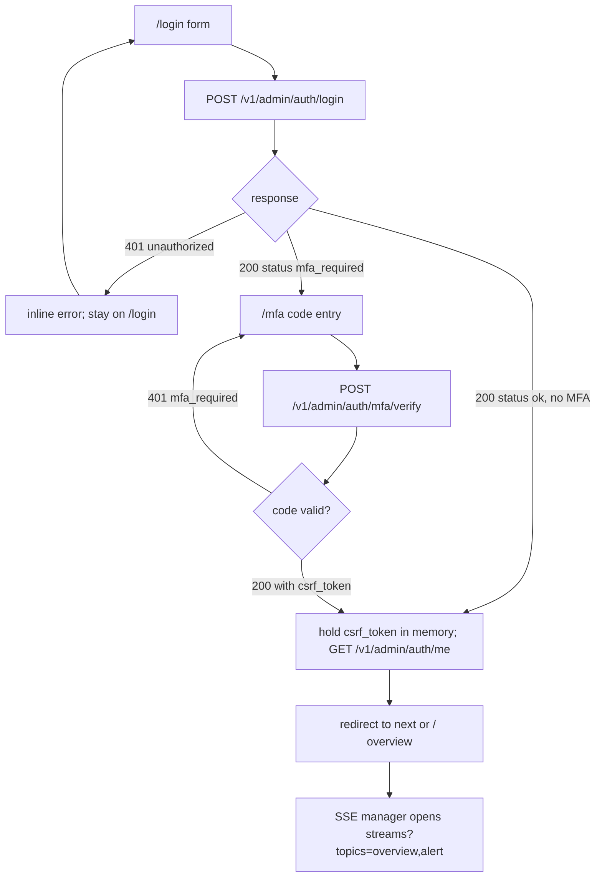
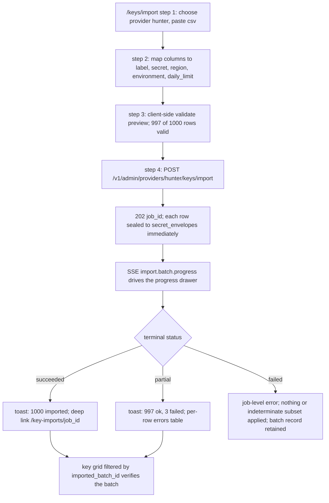
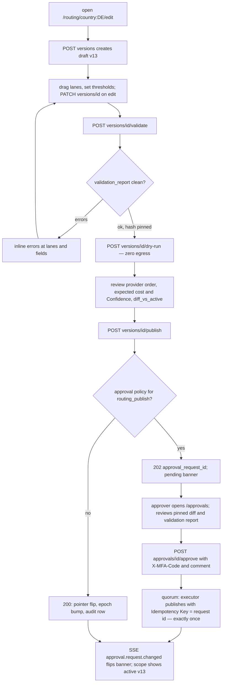
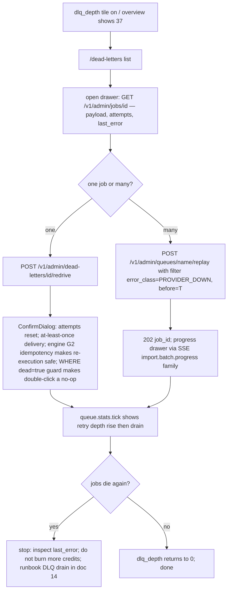
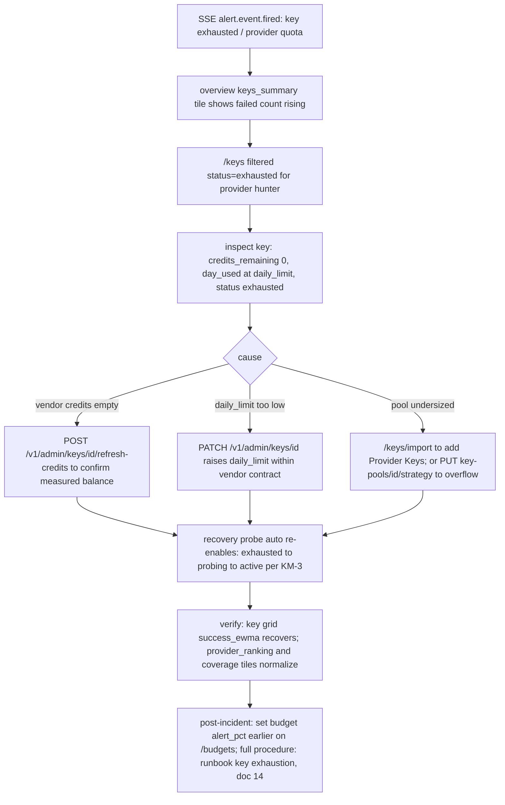

# 09 — UI Wireframes & User Flows

> **Status:** ACCEPTED · **Owner:** Enterprise UX Architect · **Last updated:** 2026-07-06 · **Gated by:** /architecture-review, /security-audit

> Wireframes and interaction specs for all **12 modules** of the Management Dashboard. Every
> panel binds to a real endpoint from [doc 04](04-api-contracts.md) and/or an SSE topic —
> the completeness proof is the map in §14, honoring the
> [doc 17](../17-Dashboard-Planning.md) panel → backing-service rule (**no orphan UI**).
> Component and state conventions come from [doc 08](08-ui-architecture.md); column and field
> names come from [doc 03](03-database-schema.md); Glossary terms are used verbatim: Tenant,
> Provider, Provider Key, Key Pool, Waterfall, Enrichment Job, Field, Confidence, Cost Ceiling,
> Idempotency Key. Gates bind every interaction shown here: **G1 tenant isolation** (RLS scopes
> every list; cross-Tenant objects 404), **G2 idempotency** (every write carries an Idempotency
> Key), **G3 bounded execution**, **G4 cost ceiling** (test/benchmark actions are capped),
> **G5 provenance** — "the model proposes, a deterministic gate disposes."

---

## 0. Layout conventions

Every authenticated screen = **global nav rail + top bar + content**. The rail lists the 12
modules; the top bar carries search (`GET /v1/admin/search?q=`), the SSE connection state
(doc 08 §5), and the Tenant/role identity from `GET /v1/admin/auth/me`.

Rail abbreviations used in the wireframes (an asterisk marks the active module):

```
OV Overview      PR Providers   KY Keys      RT Rotation   HL Health     RC Routing
WF Waterfalls    QU Queues      WK Workers   CO Cost       SE Security   AL Alerts
```

State conventions (doc 08 §8) apply to every view: skeleton rows/tiles on first load;
`EmptyState` with `zero-data` / `zero-results` / `error` variants; error variant shows the
uniform `{"error":{"code","message"}}` body plus Retry. Per-module sections below list only the
state details specific to that module.

---

## 1. Module 1 — Global Overview (`/`)

### 1.1 Wireframe — tile grid

```
+----+----------------------------------------------------------------------------------------+
| OV*| Waterfall Admin   [ /  search ]                        SSE: live | tenant: acme | ops  |
| PR +----------------------------------------------------------------------------------------+
| KY | GLOBAL OVERVIEW                                     generated_at 12:40:02Z            |
| RT |                                                                                        |
| HL | +- providers_summary ---+ +- provider_health_split + +- keys_summary ----------------+ |
| RC | | Providers             | | Provider health        | | Provider Keys                 | |
| WF | | 112 total             | | 87 healthy             | | 2,340 total   2,101 active    | |
| QU | | 87 active             | | 9  degraded            | | 31 failed     14 expired      | |
| WK | | 25 disabled           | | 16 offline             | | -> /keys?status=auth_failed   | |
| CO | +-----------------------+ +------------------------+ +-------------------------------+ |
| SE |                                                                                        |
| AL | +- credits_remaining ---+ +- requests_today -------+ +- rps_now -+ +- system_health -+ |
|    | | 1,912,400 credits     | | 1,284,031 requests     | | 14.9 rps  | | OK              | |
|    | | modeled [=======-] 81%| | +4.2% vs yesterday     | | sparkline | | aggregator 2s   | |
|    | +-----------------------+ +------------------------+ +-----------+ | evaluator 30s   | |
|    |                                                                    +-----------------+ |
|    | +- jobs_summary --------------------+ +- retry_depth -+ +- dlq_depth --------------+  |
|    | | Enrichment Jobs                    | | 1,204 retry   | | 37 dead                  |  |
|    | | 312 running  8,411 queued  56 fail | | depth         | | -> /dead-letters         |  |
|    | +------------------------------------+ +---------------+ +--------------------------+  |
|    |                                                                                        |
|    | +- worker_health -------+ +- queue_health ---------------+ +- success_failure_rate -+  |
|    | | 46/48 running, 1 lost | | worst oldest_age_s: 341s     | | 94.3% ok / 5.7% fail   |  |
|    | | 1 draining            | | queue: enrich-bulk           | | 1h window              |  |
|    | +-----------------------+ +------------------------------+ +------------------------+  |
|    |                                                                                        |
|    | +- avg_cost_per_result -+ +- avg_response_ms -+ +- provider_ranking ----------------+  |
|    | | 1.11 credits/success  | | p50 412ms         | | 1. hunter    1.11 cr/hit          |  |
|    | | 0.96 credits/call     | | p95 1,840ms       | | 2. prospeo   1.23 cr/hit          |  |
|    | +-----------------------+ +-------------------+ | 3. twilio-lu 1.9  cr/hit          |  |
|    |                                                 +-----------------------------------+  |
|    | +- coverage ---------------------------------+ +- cost_today ---+ +- cost_month ---+   |
|    | | overall 78% | work_email 84%               | | 88,410 credits | | 91,230 credits |   |
|    | | mobile_phone+direct_dial 61% | intent 44%  | | budget 44%     | | modeled        |   |
|    | +---------------------------------------------+ +----------------+ +----------------+  |
+----+----------------------------------------------------------------------------------------+
```

There is deliberately **no time-range control** on this screen: every tile's window is fixed by
its definition (`requests_today`, `success_failure_rate` = 1h window, `cost_today`,
`cost_month`), and `GET /v1/admin/overview` takes no window parameters (doc 04 §2.13).
Historical exploration lives in each tile's drill-down module (§1.2), where the
`TimeRangePicker` is backed by documented `res=&from=&to=` parameters.

### 1.2 Tile → endpoint + SSE map (normative tile vocabulary; the no-orphan-UI map)

Snapshot for **every** tile: `GET /v1/admin/overview` (served from the aggregator's last 2s
tick). Deep link per tile: `GET /v1/admin/overview/tiles/{tile}`. Live updates for every tile:
SSE topic `overview`, event `overview.tiles.tick` (replace-snapshot QoS). The doc 04 §2.13
response example shows an illustrative subset; **this table pins the full tile vocabulary**
(recorded as OI-WF-2).

| Tile id | Values shown | Drill-down (route → endpoint) | Extra SSE |
|---|---|---|---|
| `providers_summary` | total / active / disabled Providers | `/providers` → `GET /v1/admin/providers?op_state=` | `provider` |
| `provider_health_split` | healthy / degraded / offline | `/health` → `GET /v1/admin/health/providers` | `provider` |
| `keys_summary` | total / active / failed / expired Provider Keys | `/keys` → `GET /v1/admin/providers/{id}/keys?status=` | `key` |
| `credits_remaining` | sum of `providers.credits_remaining` (modeled) | `/providers` → `GET /v1/admin/providers?sort=credits_remaining` | — |
| `requests_today` | requests today + delta vs yesterday | `/cost` → `GET /v1/admin/cost/summary?group_by=provider` (calls) | — |
| `rps_now` | current requests/s (latest `provider_stats_1m` bucket) | `/health` → `GET /v1/admin/health/providers` | — |
| `jobs_summary` | Enrichment Jobs running / queued / failed | `/queues` → `GET /v1/admin/queues` | `queue` |
| `retry_depth` | jobs in `retry` state across queues | `/queues` → `GET /v1/admin/queues` | `queue` |
| `dlq_depth` | `dead=true` count | `/dead-letters` → `GET /v1/admin/dead-letters` | `queue` |
| `worker_health` | running / lost / draining workers | `/workers` → `GET /v1/admin/workers` | `worker` |
| `queue_health` | worst `oldest_age_s` + owning queue | `/queues/:name` → `GET /v1/admin/queues/{name}/stats` | `queue` |
| `success_failure_rate` | 1h success % / failure % | `/health/:providerId` → `GET /v1/admin/providers/{id}/stats` | — |
| `avg_cost_per_result` | credits/successful-result, credits/call | `/cost` → `GET /v1/admin/cost/per-enrichment` | — |
| `avg_response_ms` | p50/p95 latency (from `lat_hist`) | `/health/:providerId` → `GET /v1/admin/providers/{id}/stats` | — |
| `provider_ranking` | top Providers by measured cost-per-hit | `/providers/compare` → `GET /v1/admin/providers/rankings` | — |
| `coverage` | overall + per-Field: `work_email`, `mobile_phone`/`direct_dial`, `intent_topics` | `/providers/compare` → `GET /v1/admin/providers/coverage` | — |
| `cost_today` | today's credits + budget % | `/cost` → `GET /v1/admin/cost/summary?group_by=provider&from=&to=`; `GET /v1/admin/budgets` | `alert` |
| `cost_month` | month-to-date credits (modeled) | `/cost` → `GET /v1/admin/cost/summary` | — |
| `system_health` | aggregator/evaluator heartbeat freshness (doc 10 self-monitoring) | — (no SPA drill-down; the tile's data already arrives in `GET /overview`. Operators consult doc 10's `/healthz` + `/metrics` out-of-band — deliberately not doc 04 admin surfaces) | — |

### 1.3 Interaction spec

| Action | Endpoint | Behavior |
|---|---|---|
| Load page | `GET /v1/admin/overview` | one snapshot render; tiles then live-patch from `overview.tiles.tick` |
| Click any tile | drill-down route from §1.2 | navigates with the tile's filter pre-applied (deep link); `system_health` is the single non-navigating tile (§1.2) |
| Open alert badge (top bar) | `GET /v1/admin/alerts/events?state=firing` | firing episodes list; `alert.event.fired` updates it live |

### 1.4 States

- **Loading**: 19 skeleton tiles matching the grid layout.
- **Empty**: overview has no zero-data state (the aggregator always returns tiles); a tile whose
  underlying rollup has no rows renders an em-dash with "no data yet".
- **Error**: snapshot failure renders the `EmptyState` error variant with the envelope code +
  Retry; if the SSE stream drops, the top-bar indicator shows `degraded` and tiles show
  `generated_at` age (doc 08 §8).

---

## 2. Module 2 — Provider Management (`/providers`, `/providers/:id`, `/providers/compare`)

### 2.1 Wireframe — Provider detail with tabs `config | keys | health | stats | history`

```
+----+----------------------------------------------------------------------------------------+
| OV | Waterfall Admin   [ /  search ]                        SSE: live | tenant: acme | ops  |
| PR*+----------------------------------------------------------------------------------------+
| KY | Providers > hunter                                                                     |
| RT |                                                                                        |
| HL | Hunter        [ACTIVE-CANDIDATE] [enabled] effective_available: yes                    |
| RC | email_finder · health_score 0.98 · avg_latency_ms 412 · credits_remaining 214,300      |
| WF |                                                                                        |
| QU | [ Enable ] [ Pause ] [ Maintenance ] [ Test ] [ Sync credits ] [ Benchmark ] [ ... ]   |
| WK |   ... menu: Duplicate | Refresh metadata | Archive (approval) | Delete (approval)      |
| CO |                                                                                        |
| SE | [ config ] [ keys ] [ health ] [ stats ] [ history ]        <- tabs are route segments |
| AL | +------------------------------------------------------------------------------------+ |
|    | | CONFIG (operator-writable catalog + ops)                                           | |
|    | |  base_url        https://api.hunter.io      api_version   v2                      | |
|    | |  auth_scheme     api-key-header              auth_header   X-API-KEY               | |
|    | |  timeout_ms      8000    rate_limit_rpm 300  concurrency_limit 20                  | |
|    | |  daily_limit     50,000  monthly_limit 1.2M  breaker_threshold 5 / cooldown_s 60   | |
|    | |  retry_policy    {max_attempts:3, backoff_ms:250}                                  | |
|    | |  capabilities    work_email: 1 credit, expected_confidence 0.90                    | |
|    | |  credit_sync     mode:endpoint, interval_s 3600     sunset_at  —                   | |
|    | |  status ACTIVE-CANDIDATE | compliance_review_status approved | priority 10         | |
|    | |                                                     [ Save changes ]  (PATCH)      | |
|    | +------------------------------------------------------------------------------------+ |
+----+----------------------------------------------------------------------------------------+
```

List page (`/providers`): virtualized table — columns `display_name`, `category`, `status`
(outlined trichotomy badge), `op_state` (filled badge), `effective_available` (with
`unavailable_reason` tooltip naming the failed conjunct), `health_score`, `avg_latency_ms`,
`credits_remaining`, `priority`, `sunset_at`, row actions. Compare page (`/providers/compare`):
Fields × Providers heat grid (declared `cost_credits`/`expected_confidence` vs measured
hit-rate/p95/cost-per-hit).

### 2.2 Interaction spec

| Action | Endpoint | Behavior |
|---|---|---|
| List / filter / sort | `GET /v1/admin/providers?status=&op_state=&category=&region=&tag=&q=` | infinite scroll via cursors |
| Open detail (tab per concern) | `GET /v1/admin/providers/{id}` | tabs deep-link: `/providers/hunter/keys` |
| Save config tab | `PATCH /v1/admin/providers/{id}` | Idempotency-Key; audited; `attrs` is presentation-only |
| Enable / Disable / Pause / Maintenance | `POST /v1/admin/providers/{id}/enable\|disable\|pause\|maintenance` | optimistic toggle + rollback (doc 08 §4); maintenance suppresses that Provider's alert scope |
| Test descriptor | `POST /v1/admin/providers/{id}/test` | ConfirmDialog states "spends real credits, G4-capped"; result inline |
| Health check now | `POST /v1/admin/providers/{id}/health-check` | result patches health tab |
| Sync credits | `POST /v1/admin/providers/{id}/sync-credits` | updates measured balance; drift % callout vs modeled |
| Refresh metadata | `POST /v1/admin/providers/{id}/refresh-metadata` | re-pulls descriptor metadata |
| Benchmark | `POST /v1/admin/providers/{id}/benchmark` | 202 `{job_id}` → progress drawer; G3/G4-bounded |
| Duplicate | `POST /v1/admin/providers/{id}/duplicate` | 201 → navigates to the new draft Provider |
| Archive | `POST /v1/admin/providers/{id}/archive` | **approval-gated** → 202 `{approval_request_id}` + pending banner |
| Delete | `DELETE /v1/admin/providers/{id}` | **approval-gated** → 202 + pending banner |
| Keys tab | `GET /v1/admin/providers/{id}/keys` | embeds the §3 Key grid scoped to this Provider |
| Health tab | `GET /v1/admin/providers/{id}/health` + `GET /v1/admin/health/providers/{id}/timeline` | §5 timeline component reused |
| Stats tab | `GET /v1/admin/providers/{id}/stats?res=&from=&to=` | per-error-class failure series; TimeRangePicker bounded by retention |
| History tab | `GET /v1/admin/change-history/provider/{id}` | Stripe-style event timeline: versions + approvals + audit rows |
| Compare | `GET /v1/admin/providers/compare?ids=` (≤ 10), `GET /v1/admin/providers/coverage`, `GET /v1/admin/providers/rankings` | declared vs measured grid |
| New Provider | `POST /v1/admin/providers` | 201; lands as `DEPRIORITIZED` pending compliance review (ADR-0009) — banner explains |

Live: SSE `provider.health.changed` invalidates the entity query; the list stays live without
polling.

### 2.3 States

- **Loading**: list = skeleton rows; detail = labeled skeleton sections per tab.
- **Empty**: zero-data → "No Providers in the catalog" + primary action "Add Provider" (O only);
  zero-results → "No Providers match filters" + Clear filters.
- **Error**: envelope code + Retry; a 202-pending approval renders the pending-approval banner,
  not an error.

---

## 3. Module 3 — API Key Management (`/keys`, `/keys/import`)

### 3.1 Wireframe — virtualized Key grid with bulk action bar

```
+----+----------------------------------------------------------------------------------------+
| OV | Waterfall Admin   [ /  search ]                        SSE: live | tenant: acme | ops  |
| PR +----------------------------------------------------------------------------------------+
| KY*| PROVIDER KEYS         provider: [ hunter v ]   [ + Add key ] [ Import ] [ Export view ]|
| RT | filter: [status v] [health v] [region v] [env v] [tag v] [pool v] [batch v]           |
| HL |                                                                                        |
| RC | [x] 2 selected on page  ·  Select all 4,213 matching filter                            |
| WF | +------------------------------------------------------------------------------------+ |
| QU | | BULK: [ Enable ] [ Disable ] [ Pause ] [ Rotate ] [ Delete (approval) ]  preview:  | |
| WK | |       "matched: 4,213" via preview:true before confirm                             | |
| CO | +------------------------------------------------------------------------------------+ |
| SE | |LABEL          LAST4 STATUS       HLTH POOL     REGION ENV  CREDITS      TODAY      | |
| AL | |hunter-prod-07 *1c0d [active]     ok   default  us     prod [======--]   1,204      | |
|    | |hunter-prod-08 *aa11 [rate_limtd] warn default  us     prod [====----]   3,911      | |
|    | |hunter-eu-01   *bb22 [exhausted]  err  eu-pool  eu     prod [--------]   5,000      | |
|    | |hunter-dev-01  *cc33 [paused]     —    default  us     dev  [========]   0          | |
|    | |  ... virtualized: 4,213 rows, fixed row height, aria-rowcount=4213 ...             | |
|    | |SUCC(EWMA) LAT(EWMA)  EXPIRES     LAST USED          <- continued columns           | |
|    | |0.97       412ms      2027-01-01  41s ago                                           | |
|    | +------------------------------------------------------------------------------------+ |
|    |  columns: label · secret_last4 · status · health · pool · region · environment ·       |
|    |  credits_remaining bar · usage today · success_ewma · latency_ewma_ms ·                |
|    |  expires_at · last_used_at                                                             |
+----+----------------------------------------------------------------------------------------+
```

Row click opens a Drawer: full metadata (`fingerprint_prefix`, `weight`, `priority`,
`daily_limit`/`monthly_limit`/`rpm_limit`, `consecutive_failures`, `error_counters`,
`imported_batch_id`, `rotation_group`), per-Key usage chart, and actions. **No secret is ever
displayed — there is no reveal endpoint** (doc 04 §2.4); copy actions copy ids, never secrets.

**Select-all-matching-filter semantics**: page selection checkboxes escalate to "Select all N
matching filter"; a filter-scoped bulk op sends **the filter predicate, not ids** — the server
re-evaluates it under RLS at execution and reports `matched_at_execution` (TOCTOU documented,
doc 04 §4.2). The ConfirmDialog shows the `preview:true` count and, for delete, routes through
the approvals gate.

**Filter bar = the doc 04 §2.4 whitelist, nothing more**: the dropdowns map 1:1 to the
`GET /providers/{id}/keys` filter params (`status`, `health`, `region`, `environment`, `tag`,
`rotation_group`, `imported_batch_id`, `pool_id`). There is deliberately **no free-text `q`
param** on this endpoint — an unknown query parameter is a 400 `invalid_filter` (doc 04 §1.5,
strict) — so the grid carries no free-text box; free-text Provider Key lookup goes through the
top-bar `GET /search?q=` (OI-WF-1).

**Export view is client-side — there is no keys-export endpoint**: the button serializes
**exactly the rows already fetched** into the grid's `useInfiniteQuery` cache (the
cursor-bounded WYSIWYG of the active filters + sort) into a CSV Blob download. It is **buffered
in memory, never streamed**, fetches **no additional pages** (zero extra egress), and calls no
endpoint of its own — the data source is the `GET /providers/{id}/keys` responses already held
by the client; the only server-side streaming export in doc 04 remains `GET /cost/export`.
Cell values beginning `=`, `+`, `-`, or `@` pass through the shared formula escaper — this is
the "key-grid export" path named in doc 05 §7's threat table. The downloaded filename embeds
provider, filter summary, and row count, so a partial (not-fully-scrolled) export is
self-evident to the operator.

### 3.2 Wireframe — import wizard, 4 steps (`/keys/import`)

```
Step 1 — SOURCE                                  Step 2 — MAP COLUMNS
+----------------------------------------+       +-----------------------------------------+
| provider: [ hunter v ]                 |       | detected 6 columns in file               |
| ( ) csv  ( ) xlsx  ( ) json  (o) paste |       |  file column     ->  key field           |
| [ paste area / file drop 25MB max ]    |       |  "name"          ->  [ label        v ]  |
| caps: 25 MiB · 50,000 rows             |       |  "api_key"       ->  [ secret       v ]  |
| NOTE: secrets are write-only; they     |       |  "region"        ->  [ region       v ]  |
| cannot be viewed again after import.   |       |  "env"           ->  [ environment  v ]  |
|                        [ Continue ]    |       |  "daily"         ->  [ daily_limit  v ]  |
+----------------------------------------+       |  "team"          ->  [ ignore       v ]  |
                                                 |            [ Back ]      [ Continue ]    |
                                                 +------------------------------------------+
Step 3 — VALIDATE PREVIEW                        Step 4 — IMPORT PROGRESS
+----------------------------------------+       +------------------------------------------+
| 1,000 rows parsed · 997 valid          |       | importing batch ib_01J9X0A2               |
| row 17   secret column empty           |       | [==============----------]  412 / 1,000  |
| row 118  duplicate of key *1c0d        |       | succeeded 409 · failed 3                  |
|          (fingerprint match)           |       | per-row errors:                           |
| row 244  unknown region: mars          |       |  17  validation_failed  secret empty     |
| [x] skip invalid rows                  |       |  118 conflict           duplicate (fp)   |
| [ Back ]        [ Start import ]       |       |  244 validation_failed  unknown region   |
+----------------------------------------+       | live via SSE import.batch.progress        |
                                                 | on finish: toast -> /key-imports/{job_id} |
                                                 +------------------------------------------+
```

### 3.3 Interaction spec

| Action | Endpoint | Behavior |
|---|---|---|
| List Keys (Provider context) | `GET /v1/admin/providers/{id}/keys?status=&health=&region=&environment=&tag=&rotation_group=&imported_batch_id=&pool_id=` | `useInfiniteQuery`, virtualized; server-side sort whitelist; no `q` param — free-text lookup via top-bar `GET /search?q=` (OI-WF-1) |
| Export view | — client-side (data source: the `GET /v1/admin/providers/{id}/keys` pages already fetched) | buffered CSV Blob of the currently loaded (cursor-bounded) rows, WYSIWYG on active filters/sort; fetches no extra pages, zero egress, no dedicated endpoint (doc 04's only streaming export is `GET /cost/export`); `= + - @` cells escaped via the shared formula escaper (doc 05 §7 "key-grid export") |
| Add single Key | `POST /v1/admin/providers/{id}/keys` | 201; secret sealed in-request (ADR-0017), never echoed |
| Key detail / edit | `GET /v1/admin/keys/{id}`, `PATCH /v1/admin/keys/{id}` | metadata only; ciphertext never mutated |
| Enable / Disable | `POST /v1/admin/keys/{id}/enable\|disable` | optimistic toggle; invalid KM-3 transition → 409 `conflict` |
| Rotate | `POST /v1/admin/keys/{id}/rotate` | dialog: new secret + `overlap_s` (default 86400; 0 = compromise mode); shows successor id + `overlap_until` |
| Test / probe / refresh | `POST /v1/admin/keys/{id}/test\|health-check\|refresh-credits` | test warns: spends credits (G4-capped) |
| Archive single Key | `DELETE /v1/admin/keys/{id}` | ConfirmDialog shows idleness proof from usage ("last used 2h ago — 14,203 calls this month") |
| Per-Key usage | `GET /v1/admin/keys/{id}/usage?res=&from=&to=` | drawer chart from `key_usage_*` |
| Bulk op | `POST /v1/admin/keys/bulk` `{ids\|filter, op, patch}` | 202 `{job_id}`; `op=delete` → 202 `{approval_request_id}` (gated `key_bulk_delete`); `preview:true` → `{"matched":N}` |
| Bulk progress | `GET /v1/admin/bulk-jobs/{id}` + SSE `import.batch.progress` | shared progress drawer |
| Import (wizard step 4) | `POST /v1/admin/providers/{id}/keys/import` | 202 `{job_id}`; multipart `file`+`format` or `{"format":"paste","data":"…"}` |
| Import progress | `GET /v1/admin/key-imports/{job_id}` + SSE topic `import` | per-row errors capped at 1,000 with `error_summary` |

Live: `key.status.changed` invalidates row queries — a Key tripping to `rate_limited` recolors
its status pill without polling.

### 3.4 States

- **Loading**: skeleton rows matching the 13-column layout.
- **Empty**: zero-data → "No Provider Keys for hunter yet" + primary action **Import keys** →
  `/keys/import`; zero-results → clear-filters.
- **Error**: per doc 08 §8; import step 4 job-level `failed` shows the job error with a link to
  the batch record; partial results (`status: partial`) render succeeded/failed counts + error
  table — completed rows are never rolled back.

---

## 4. Module 4 — Key Rotation Engine (`/rotation`, `/key-pools`, `/key-pools/:id`)

### 4.1 Wireframe — Key Pool detail with strategy, selection-state, simulate

```
+----+----------------------------------------------------------------------------------------+
| OV | Waterfall Admin   [ /  search ]                        SSE: live | tenant: acme | ops  |
| PR +----------------------------------------------------------------------------------------+
| KY | Key Pools > hunter:default            selector: hunter:default   [platform-managed]    |
| RT*|                                                                                        |
| HL | strategy: [ weighted v ]   strategy_params: { }            [ Save strategy ] (PUT)     |
| RC | 12 strategies: round_robin least_used weighted credit_based region_based               |
| WF |   lowest_latency highest_success ai_routing random priority failover overflow          |
| QU |                                                                                        |
| WK | MEMBERS (12)                              [ Edit members ] (PUT members)               |
| CO | | label            status      weight  success_ewma  latency_ewma_ms  credits    |    |
| SE | | hunter-prod-07   active      100     0.97          412              214,300    |    |
| AL | | hunter-prod-08   rate_limtd  100     0.81          977              90,100     |    |
|    |                                                                                        |
|    | +- SELECTION STATE (per-instance debug) ---+  +- SIMULATE ---------------------------+ |
|    | | strategy: weighted (alias table built)   |  | draws: [1000]        [ Run simulate ]| |
|    | | ring index: 7   epoch: 42                |  | result distribution (zero egress):   | |
|    | | availability: 10 of 12 keys available    |  |  hunter-prod-07  ############  61%   | |
|    | | bands: [0.9+]: 6  [0.8]: 3  [0.5]: 1     |  |  hunter-prod-08  #####         27%   | |
|    | +------------------------------------------+  |  hunter-eu-01    ##            12%   | |
|    |                                               +--------------------------------------+ |
|    | ROTATION TRIGGERS (/rotation)   error class -> KM-3 transition (doc 07)                |
|    | | QUOTA -> exhausted -> probing -> active (auto)   RATE_LIMIT -> rate_limited (cooldown)|
|    | | AUTH -> auth_failed -> disabled (manual only, + alert)   expires_at -> expired       |
|    | |                                              [ Edit thresholds ] (PUT triggers)     |
+----+----------------------------------------------------------------------------------------+
```

### 4.2 Interaction spec

| Action | Endpoint | Behavior |
|---|---|---|
| List pools | `GET /v1/admin/key-pools?provider_id=&strategy=` | grouped by ownership (platform vs BYO `owner_tenant_id`) |
| Create pool | `POST /v1/admin/key-pools` | 201; selector `provider_id:name` matches `AuthDescriptor.KeyPoolSelector` |
| Pool detail | `GET /v1/admin/key-pools/{id}` | member summary + strategy |
| Change strategy | `PUT /v1/admin/key-pools/{id}/strategy` | epoch bump rebuilds `PoolState` ≤ 1s UNVERIFIED; UI shows "propagating" until `key` events confirm |
| Replace members | `PUT /v1/admin/key-pools/{id}/members` `{"key_ids":[…]}` | full-replacement PUT |
| Delete pool | `DELETE /v1/admin/key-pools/{id}` | 409 `conflict` if referenced by an active routing policy — error surfaced inline |
| Selection-state debug | `GET /v1/admin/key-pools/{id}/selection-state` | labeled "per-instance cache — diagnostic, not truth" |
| Simulate | `POST /v1/admin/key-pools/{id}/simulate` `{"draws":1000}` | per-Key distribution bars; **zero egress** |
| Strategy catalog | `GET /v1/admin/rotation/strategies` | drives the picker; closed vocab of 12 |
| Triggers | `GET /v1/admin/rotation/triggers`, `PUT /v1/admin/rotation/triggers` | validators reject configs disabling AUTH → `auth_failed` handling → 422 inline |

### 4.3 States

- **Loading**: skeleton panels for members/selection-state/simulate.
- **Empty**: zero-data pools list → "No Key Pools" + "Create pool"; simulate panel before first
  run → explanatory empty state ("run a simulation to preview selection distribution").
- **Error**: selection-state 404 (pool not resident on this instance) renders an info state, not
  an error; PUT validation failures render field-level.

---

## 5. Module 5 — Provider Health Center (`/health`, `/health/:providerId`)

### 5.1 Wireframe — fleet health + provider timeline

```
+----+----------------------------------------------------------------------------------------+
| OV | Waterfall Admin   [ /  search ]                        SSE: live | tenant: acme | ops  |
| PR +----------------------------------------------------------------------------------------+
| KY | PROVIDER HEALTH                    [ Run checks now ] [ Schedules ]   region: [all v]  |
| RT |                                                                                        |
| HL*| worst first:                                                                           |
| RC | | provider    health  uptime 90d                              p95     p99    last err | |
| WF | | prospeo     down    ############################----######  2.1s    4.0s   AUTH     | |
| QU | | twilio-lu   degrade ##########################-#########--  900ms   2.2s   RATE_LIM | |
| WK | | hunter      ok      ##########################################  412ms 1.8s  —       | |
| CO |                                                                                        |
| SE | hunter — 90-day uptime bar (provider_health_1d fold; day buckets)                      |
| AL | [##########################################——##########]  99.2% · worst: TRANSIENT    |
|    |                                                                                        |
|    | hour x day heatmap (last 48h, provider_stats_1h)        P95/P99 overlay                |
|    | 00 04 08 12 16 20                                        [line chart: p95, p99,       |
|    | [.][.][#][#][.][.]  success rate by hour                  error-rate secondary axis]   |
|    | [.][.][.][#][#][.]                                                                     |
|    |                                                                                        |
|    | check schedule: interval 60s · jitter 10% · regions us,eu   [ Edit ] (PUT schedules)   |
+----+----------------------------------------------------------------------------------------+
```

### 5.2 Interaction spec

| Action | Endpoint | Behavior |
|---|---|---|
| Fleet summary | `GET /v1/admin/health/providers?status=&region=` | worst-first sort |
| Timeline | `GET /v1/admin/health/providers/{id}/timeline` | 90 day-segments (`provider_health_1d`) + 48h hour buckets; per-bucket tooltip: `status`, `uptime_pct`, `worst_error_class`, `check_count` |
| Regional matrix | `GET /v1/admin/health/regional` | region × Provider grid |
| Schedules | `GET /v1/admin/health/schedules`, `PUT /v1/admin/health/schedules` | full-replacement; bounded concurrency server-enforced |
| Run checks now | `POST /v1/admin/health/checks/run` `{"provider_ids":[…]}` | 200 inline ≤ 5 Providers, else 202 `{job_id}` → progress drawer |
| Stats overlay | `GET /v1/admin/providers/{id}/stats?res=&from=&to=` | P95/P99 computed at read from `lat_hist` buckets |

Live: `provider.health.changed` invalidates fleet + timeline queries. The timeline component is
the same one embedded in the Provider detail health tab (§2).

### 5.3 States

- **Loading**: skeleton uptime bars (90 gray segments).
- **Empty**: a Provider with no checks yet renders `no_data` segments with a "first check pending"
  note; zero Providers → zero-data EmptyState linking `/providers`.
- **Error**: window beyond retention → 400 `window_out_of_range` rendered as an inline notice
  with the permitted horizon (server message passthrough).

---

## 6. Module 6 — Request Routing Center (`/routing`, `/routing/:scope/edit`)

### 6.1 Wireframe — routing editor (lanes, thresholds, diff, publish)

```
+----+----------------------------------------------------------------------------------------+
| OV | Waterfall Admin   [ /  search ]                        SSE: live | tenant: acme | ops  |
| PR +----------------------------------------------------------------------------------------+
| KY | Routing > country:DE            version 13 [draft]   active: v12    epoch 42           |
| RT |                                                                                        |
| HL | [ Validate ] [ Dry-run ] [ Diff vs active ] [ Publish ]   Publish disabled until       |
| RC*|                                                           server validate passes        |
| WF | +---------------------------- PRIORITY ORDER (drag) -----------+ +- THRESHOLDS ------+ |
| QU | | 1 = hunter        mode:on       priority 1                   | | confidence_thresh | |
| WK | | 2 = [ PARALLEL GROUP (bounded cheap prefix) ]                 | |  [0.85]           | |
| CO | |     = prospeo     mode:inherit  (from country=DE v12)        | | max_cost_credits  | |
| SE | |     = dropcontact mode:on                                    | |  [5]  (cannot     | |
| AL | | 3 = twilio-lu     mode:on       priority 3                   | |  exceed G4 gate)  | |
|    | | 4 = snov          mode:off  <- excluded from waterfall_order | | retry order       | |
|    | +---------------------------------------------------------------+ | failover order    | |
|    | ! inline validation: "snov is EXCLUDED — mode:on rejected"       +-------------------+ |
|    |                                                                                        |
|    | +- DIFF vs active v12 (payload_hash-pinned) --------------------------------------+    |
|    | |  waterfall_order: [hunter, prospeo] -> [hunter, prospeo, twilio-lu]   (+1)      |    |
|    | |  confidence_threshold: 0.80 -> 0.85                                             |    |
|    | +---------------------------------------------------------------------------------+    |
|    | [ pending approval banner when publish returns 202 approval_request_id ]               |
+----+----------------------------------------------------------------------------------------+
```

Lanes are dnd-kit sortable lists; **parallel groups are nested containers** inside the priority
lane; tri-state per-Provider override `inherit | off | on` renders the resolved effective value
with its source scope ("inherited from country=DE policy v12") — resolver output, never
client-derived. A version rail lists `config_versions` history with the active version pinned;
rollback is "publish version N".

### 6.2 Interaction spec

| Action | Endpoint | Behavior |
|---|---|---|
| Scope list | `GET /v1/admin/routing` | scopes + active version + epoch + effective values with source scope |
| Version history | `GET /v1/admin/routing/{scope_key}/versions` | version rail, sort `-version` |
| Create draft | `POST /v1/admin/routing/{scope_key}/versions` | 201 draft; editor opens |
| Edit draft (every lane/threshold change, debounced) | `PATCH /v1/admin/routing/{scope_key}/versions/{id}` | non-draft → 409 `conflict`; **any edit after validate reverts `validated`→`draft`** — the editor demotes its own state badge |
| Validate | `POST /v1/admin/routing/{scope_key}/versions/{id}/validate` | 200 with `validation_report`; errors render inline at the offending lane/field; warnings (e.g. `provider_sunset_within_30d`) render as banners; pins `payload_hash` |
| Dry-run | `POST /v1/admin/routing/{scope_key}/versions/{id}/dry-run` | **zero egress** (G3); shows Provider order, `expected_total_cost_credits`, expected Confidence, `diff_vs_active` |
| Diff vs active | dry-run's `diff_vs_active` + client JSON diff of draft vs active payload | pre-publish ConfirmDialog shows the hash-pinned diff |
| Publish | `POST /v1/admin/routing/{scope_key}/versions/{id}/publish` | **approval-gated** (`routing_publish`): 202 `{approval_request_id}` → pending banner + link to `/approvals`; ungated Tenants get 200 with new `epoch` |
| Rollback | `POST /v1/admin/routing/{scope_key}/rollback` `{"to_version":12}` | approval-gated (it *is* a publish); version rail action |
| Clone | `POST /v1/admin/routing/{scope_key}/versions/{id}/clone` | 201 new draft |

Live: `approval.request.changed` flips the pending banner to published/failed; `GET
/v1/admin/config/epochs` validates cached scope lists.

### 6.3 States

- **Loading**: editor skeleton (lanes + side panel).
- **Empty**: scope with no versions → zero-data "No routing policy for this scope" + "Create
  draft" (inherits from the next scope in precedence until published — copy explains).
- **Error**: validation errors are **inline, field-anchored**, not toasts; publish 409 `conflict`
  (hash drift / not validated) re-runs validate and explains "draft changed since validate".

---

## 7. Module 7 — Waterfall Configuration (`/workflows`, `/workflows/:scope`, `/workflows/:scope/edit`)

### 7.1 Wireframe — Waterfall builder with node inspector and dry-run panel

```
+----+----------------------------------------------------------------------------------------+
| OV | Waterfall Admin   [ /  search ]                        SSE: live | tenant: acme | ops  |
| PR +----------------------------------------------------------------------------------------+
| KY | Waterfalls > work_email-default        v7 [draft]   active v6    [ Validate ][ Dry-run]|
| RT |                                                                    [ Publish ]         |
| HL | CANVAS (stepped: entry -> parallel -> sequential -> fallback)                          |
| RC |                                                                                        |
| WF*|  [ENTRY]      [PARALLEL GROUP]        [SEQUENTIAL]         [FALLBACK]                  |
| QU |  ( hunter ) -> ( prospeo    )    ->  ( twilio-lu )   ->   ( snov )                     |
| WK |               ( dropcontact )        ( clearbit-x )                                    |
| CO |                                                                                        |
| SE |  stop_conditions: [target-met] [ceiling] [exhausted] [timeout]                         |
| AL |                                                                                        |
|    | +- NODE INSPECTOR: twilio-lu ----------+  +- DRY-RUN RESULT (zero egress) -----------+ |
|    | | timeout_ms      [8000]               |  | plan for sample {country: DE}:           | |
|    | | retry_logic     {max_attempts: 2}    |  |  work_email:  hunter -> prospeo          | |
|    | | min_score       [0.70]               |  |   1cr @0.90     1cr @0.86                | |
|    | | confidence_threshold [0.85]          |  |  mobile_phone: twilio-lu  2cr @0.88      | |
|    | | max_cost_credits [5] (G4: cannot     |  | expected_total_cost_credits: 4           | |
|    | |  override the gate — validator       |  | expected_confidence: 0.87                | |
|    | |  rejects)                            |  | diff_vs_active: +prospeo, order changed  | |
|    | | max_providers   [4]                  |  +------------------------------------------+ |
|    | +--------------------------------------+                                               |
+----+----------------------------------------------------------------------------------------+
```

Payload fields mirror the `waterfall_workflow` JSON Schema (doc 07): `trigger`, entry Provider,
`parallel_providers[]`, `sequential_providers[]`, `retry_logic`, `timeout_ms`,
`confidence_threshold`, `min_score`, `max_cost_credits`, `max_providers`, `fallback_provider`,
`stop_conditions[]`. G3/G4 gate values render read-only context — validators reject overrides.

### 7.2 Interaction spec

| Action | Endpoint | Behavior |
|---|---|---|
| Workflow index | `GET /v1/admin/workflows?trigger=&q=` | denormalized `workflow_index` list |
| Version history / detail | `GET /v1/admin/workflows/{scope_key}/versions[/{id}]` | version rail as §6 |
| Create / edit draft | `POST /v1/admin/workflows/{scope_key}/versions`, `PATCH …/versions/{id}` | canvas edits PATCH the draft payload |
| Validate | `POST /v1/admin/workflows/{scope_key}/versions/{id}/validate` | graph acyclicity, Provider existence & non-EXCLUDED, threshold ranges, ceiling-vs-budget; inline errors on the offending node |
| Dry-run | `POST /v1/admin/workflows/{scope_key}/versions/{id}/dry-run` | zero-egress plan: Provider order, expected cost, expected Confidence |
| Publish / Rollback / Clone | `POST …/versions/{id}/publish`, `POST /v1/admin/workflows/{scope_key}/rollback`, `POST …/versions/{id}/clone` | publish approval-gated (`workflow_publish`); Enrichment Jobs pin `config_version_id` at start — copy in the publish dialog says in-flight work is unaffected |

### 7.3 States

- **Loading**: canvas skeleton with placeholder nodes.
- **Empty**: zero-data → "No Waterfall for this scope" + "Create draft"; dry-run panel empty
  state prompts "run a dry-run to preview the plan — no Provider calls are made".
- **Error**: validation errors anchor to nodes (red outline + message); node inspector field
  errors render inline; publish conflicts as in §6.3.

---

## 8. Module 8 — Queue Management (`/queues`, `/queues/:name`, `/dead-letters`)

### 8.1 Wireframe — queue console + DLQ view

```
+----+----------------------------------------------------------------------------------------+
| OV | Waterfall Admin   [ /  search ]                        SSE: live | tenant: acme | ops  |
| PR +----------------------------------------------------------------------------------------+
| KY | QUEUES                                                                                 |
| RT | +- enrich-default ------------------+  +- enrich-bulk ---------------------+           |
| HL | | waiting 8,411   running 312       |  | waiting 41,207  running 96        |           |
| RC | | scheduled 120   delayed 40        |  | retry 1,204 !   failed 56         |           |
| WF | | retry 89        failed 12         |  | dead 37 !!      oldest_age_s 341  |           |
| QU*| | dead 3          oldest_age_s 12   |  | enq 122/s vs deq 84/s ACCUMULATING|           |
| WK | | enq 90/s ~ deq 91/s               |  | [ 0 live workers on this queue! ] |           |
| CO | +-----------------------------------+  +-----------------------------------+           |
| SE |                                                                                        |
| AL | DEAD LETTERS (37)                        filter: [error_class v] [before/after]        |
|    | | job_id  workflow_key        attempts  last_error              created_at   |         |
|    | | j-8842  work_email-default  5         AUTH: 401 invalid key   09:02:11Z    |  [ > ]  |
|    | | j-8843  work_email-default  5         PROVIDER_DOWN: timeout  09:03:40Z    |  [ > ]  |
|    | [ Replay all matching filter ]                                                         |
|    | +- DRAWER: j-8842 -------------------------------------------------------------------+ |
|    | | payload (CodeBlock, principal fields redacted)   attempts 5   dead=true            | |
|    | | last_error: AUTH: 401 invalid key                                                  | |
|    | | [ Redrive this job ]  ConfirmDialog: "Redrive resets attempts to 0 and re-delivers | |
|    | |  at-least-once. Re-execution is safe: the engine's G2 Idempotency Key ledger makes | |
|    | |  Provider calls exactly-once-effective. Double-click is a no-op (dead=true guard)."| |
|    | +------------------------------------------------------------------------------------+ |
+----+----------------------------------------------------------------------------------------+
```

`/queues/:name` adds paired enq/deq sparklines (`queue_stats_1m`), the state-filtered Enrichment
Job table (each state count on the card links to `?state=`), and the workers panel with the
"queue has depth but zero live workers" warning.

### 8.2 Interaction spec

| Action | Endpoint | Behavior |
|---|---|---|
| Queue cards | `GET /v1/admin/queues` | per-state count vector + `oldest_age_s`; live via `queue.stats.tick` (replace-snapshot) |
| Queue stats | `GET /v1/admin/queues/{name}/stats?res=&from=&to=` | enq/deq/depth/oldest-age series; ACCUMULATING badge when enq>deq for 5+ buckets |
| Job list by state | `GET /v1/admin/queues/{name}/jobs?state=&workflow_key=&error_class=` | `state` required; payloads redacted per doc 05 |
| Job detail | `GET /v1/admin/jobs/{id}` | payload, `attempts`, `last_error`, timestamps; 404 across Tenants (G1) |
| Dead-letter list | `GET /v1/admin/dead-letters?error_class=&before=&after=` | partial-index-backed |
| Redrive one | `POST /v1/admin/dead-letters/{id}/redrive` | single UPDATE guarded `WHERE dead=true` — idempotent by construction; HTTP retry covered by the Idempotency-Key ledger (G2); audited |
| Filtered replay | `POST /v1/admin/queues/{name}/replay` `{"filter":{…}}` | 202 `{job_id}` → progress drawer; filter re-evaluated under RLS at execution; rate-limited |
| Desired workers | `PUT /v1/admin/queues/{name}/workers` | intent only — actuation is deploy-tool territory (doc 06 honesty note, repeated in UI copy) |

### 8.3 States

- **Loading**: skeleton queue cards; skeleton rows in job/DLQ tables.
- **Empty**: DLQ zero-data → "No dead letters — nothing is parked" (a *good* empty state, styled
  ok, no CTA); job list zero-results → clear-filters; queue with depth but zero workers → the
  prominent warning panel (not an empty state).
- **Error**: redrive of an already-redriven job → 404 `not_found` rendered as "already redriven
  or gone" info toast (row invalidated).

---

## 9. Module 9 — Worker Management (`/workers`)

### 9.1 Wireframe — worker grid + drain/rolling-restart dialogs

```
+----+----------------------------------------------------------------------------------------+
| OV | Waterfall Admin   [ /  search ]                        SSE: live | tenant: acme | ops  |
| PR +----------------------------------------------------------------------------------------+
| KY | WORKERS (48)      [ Scale intent ] [ Rolling restart ]   filter: [kind][queue][region] |
| RT |                                                                                        |
| HL | | id          kind    queue          status    desired    heartbeat  jobs  cpu   mem | |
| RC | | w-enrich-7  enrich  enrich-default draining  draining   9s ago     4     41%  312M| |
| WF | | w-enrich-8  enrich  enrich-default running   running    2s ago     11    72%  401M| |
| QU | | w-enrich-9  enrich  enrich-bulk    running   paused *   4s ago     0     3%   288M| |
| WK*| |             * converging 34s: status trails desired_state                         | |
| CO | | w-enrich-12 enrich  enrich-bulk    LOST      running    97s ago !  ?     —    —   | |
| SE |                                                                                        |
| AL | +- DRAIN w-enrich-7 -------------------------+ +- ROLLING RESTART -------------------+ |
|    | | Drain finishes the 4 in-flight Enrichment  | | kind: [enrich v]  queue: [all v]    | |
|    | | Jobs (they hold leased Provider Keys and   | | max_unavailable: [2]                | |
|    | | reserved credits), then stops. Stop        | | Sequenced drains; never more than   | |
|    | | abandons them to the visibility-timeout    | | max_unavailable down at once.       | |
|    | | reclaim path. jobs_active is live below:   | | [ Cancel ]  [ Start ] -> 202 job    | |
|    | |   jobs_active: 4 -> watch it fall          | +-------------------------------------+ |
|    | | [ Cancel ]        [ Drain ]                |                                         |
|    | +--------------------------------------------+                                         |
+----+----------------------------------------------------------------------------------------+
```

`status` and `desired_state` are **two visible columns**; when they differ the row shows a
`converging` Badge with elapsed time. `lost` (heartbeat age > 3 × 10s) renders the error token +
relative heartbeat age.

### 9.2 Interaction spec

| Action | Endpoint | Behavior |
|---|---|---|
| Fleet list | `GET /v1/admin/workers?kind=&queue=&region=&status=` | live via `worker.state.changed` (invalidate) |
| Worker detail / stats | `GET /v1/admin/workers/{id}`, `GET /v1/admin/workers/{id}/stats` | `worker_stats_5m` series |
| Drain | `POST /v1/admin/workers/{id}/drain` | dialog above; optimistic `desired_state` toggle + rollback |
| Restart / Pause / Resume | `POST /v1/admin/workers/{id}/restart\|pause\|resume` | desired-state writes; workers converge via heartbeat |
| Scale intent | `POST /v1/admin/workers/scale` `{"kind","queue","replicas"}` | UI copy states plainly: intent record only; deploy tooling actuates (doc 06) |
| Rolling restart | `POST /v1/admin/workers/rolling-restart` | 202 `{job_id}`; sequenced drains honoring `max_unavailable`; progress drawer |

### 9.3 States

- **Loading**: skeleton grid rows.
- **Empty**: zero-data → "No workers have ever registered" with a pointer to deployment docs
  (doc 11); zero-results → clear-filters.
- **Error**: non-convergence is not an error state — a row converging > 5 minutes escalates its
  Badge to warn with "worker not converging; see runbook: lost workers" (doc 14).

---

## 10. Module 10 — Cost Analytics (`/cost`, `/budgets`)

### 10.1 Wireframe

```
+----+----------------------------------------------------------------------------------------+
| OV | Waterfall Admin   [ /  search ]                        SSE: live | tenant: acme | ops  |
| PR +----------------------------------------------------------------------------------------+
| KY | COST ANALYTICS      group by: [ provider v ]  (provider|key|tenant|workflow|country)   |
| RT |                     range: [ 30d v ]   filter: none        [ Export NDJSON ]           |
| HL |                                                                                        |
| RC | +- MTD credits -----+ +- EOM forecast --------+ +- credits/success -+ +- top mover --+ |
| WF | | 91,230 [modeled]  | | 187,400 +/- band      | | 1.11              | | prospeo +38% | |
| QU | |                   | | ~80% indicative       | | credits/call 0.96 | | vs 7d mean   | |
| WK | |                   | | [modeled, UNVERIFIED] | |                   | |              | |
| CO*| +-------------------+ +-----------------------+ +-------------------+ +--------------+ |
| SE |                                                                                        |
| AL | stacked daily bars by provider          forecast: dashed line + shaded ~80% band       |
|    | |#########                                                          . . . . .        | |
|    | |#########    ########   #########   ########    ########   . -"-.                   | |
|    | |hunter... prospeo... twilio-lu...                                                    | |
|    | | breakdown table:                                                                    | |
|    | | provider   credits   calls    successful_results  cr/call  cr/success   drill      | |
|    | | hunter     412,350   431,200  371,400             0.956    1.110        [ > ]      | |
|    | | prospeo    11,820    130,450  96,200               0.906    1.229        [ > ]      | |
|    |                                                                                        |
|    | BUDGETS (/budgets)                                                                     |
|    | | tenant:acme month  [=========|====!====|=========] 44% of 2,000,000   alerts 50/80/100|
|    | | provider:hunter day [==============!==] 81% of 20,000    forecast line: 103% by EOD | |
+----+----------------------------------------------------------------------------------------+
```

Every figure carries the `modeled from rate card` Badge (`source:"modeled"`); the forecast band
is labeled **indicative ~80%, modeled — UNVERIFIED until backtested** (doc 04 §2.10). Clicking a
breakdown row pushes the value into the filter and advances `group_by` (drill-down = re-query).
`group_by=key` serves from `key_usage_1d`; key → workflow drill-down is bounded by the 48h
`usage_events` window — the UI states this boundary at the drill point (doc 04 §2.10 note).

### 10.2 Interaction spec

| Action | Endpoint | Behavior |
|---|---|---|
| Summary + breakdown | `GET /v1/admin/cost/summary?group_by=&from=&to=&filter[dim]=v` | one query model; drill-down re-queries |
| Unit economics tiles | `GET /v1/admin/cost/per-enrichment` | credits/call + credits/successful-result |
| ROI view | `GET /v1/admin/cost/roi` | cost per filled Field per Provider per workflow |
| Forecast | `GET /v1/admin/cost/forecast` | `method: linear\|seasonal_7d\|insufficient_history`; < 14 days history → "collecting history (N/14 days)" instead of a line |
| Budgets | `GET /v1/admin/budgets`, `PUT /v1/admin/budgets` | full-replacement PUT; progress meters with tick marks at each `alert_pct`; UTC period semantics |
| Export | `GET /v1/admin/cost/export` | WYSIWYG NDJSON stream of the current filters (`Content-Disposition: attachment`) |

Budget-breach awareness arrives via `alert.event.fired` (SSE `alert` topic) — there is no spend
ticker; cost views use the 5s telemetry staleTime. Doctrine repeated in UI copy: **budgets
alert, G4 Cost Ceilings enforce**.

### 10.3 States

- **Loading**: skeleton tiles + skeleton chart area.
- **Empty**: no spend in window → zero-data "No usage recorded in this range"; forecast
  `insufficient_history` renders its dedicated collecting-history state (not an error).
- **Error**: `window_out_of_range` → inline notice with permitted horizon; export failures →
  error toast with retry (stream restart).

---

## 11. Module 11 — Security (`/security/users`, `/security/sessions`, `/security/audit`, `/approvals`)

### 11.1 Wireframe — users, sessions, audit, approvals inbox

```
+----+----------------------------------------------------------------------------------------+
| OV | Waterfall Admin   [ /  search ]                        SSE: live | tenant: acme | ops  |
| PR +----------------------------------------------------------------------------------------+
| KY | SECURITY   [ users ] [ sessions ] [ audit log ] [ approvals ]                          |
| RT |                                                                                        |
| HL | USERS                                      [ + Invite user ]                           |
| RC | | email             role          status  mfa_enrolled  last_seen    actions        | |
| WF | | ops@acme.example  tenant_admin  active  yes           2m ago       [edit][reset]  | |
| QU | | ana@acme.example  tenant_user   active  no !          3d ago       [edit][reset]  | |
| WK |                                                                                        |
| CO | SESSIONS                                                                               |
| SE*| | id (prefix)  user             ip            user_agent   created    last_seen  [x] | |
| AL | | 3fa9c1…      ops@acme.example 203.0.113.9   Firefox      08:11Z     2m ago    revoke| |
|    |                                                                                        |
|    | AUDIT LOG      chain: [ VERIFIED 09:00Z ]  (GET /audit-log/verify)   [ Verify now ]   |
|    | | seq   actor            action            object_kind/id      ip           at      | |
|    | | 4211  ops@acme…        provider.pause    provider/hunter     203.0.113.9  10:04Z  | |
|    | | 4210  approval-executor keys.bulk_delete bulk-job/bj_01J9ZN8Q —            12:31Z  | |
|    |                                                                                        |
|    | APPROVALS INBOX (2 pending)                                                            |
|    | | kind             requested_by      expires_at   quorum   status    | [ review ]     |
|    | | key_bulk_delete  ops@acme.example  in 21h       0/1      pending   |                |
|    | +- REVIEW: key_bulk_delete ---------------------------------------------------------+ |
|    | | pinned payload (CodeBlock): 37 resolved key ids from batch ib_01J9X0A2            | |
|    | | decisions: none yet · four-eyes: requester cannot approve                         | |
|    | | [ Reject ]                [ Approve ] -> MFA STEP-UP DIALOG:                      | |
|    | |   +--------------------------------------------------+                           | |
|    | |   | Enter TOTP code (X-MFA-Code): [______]           |                           | |
|    | |   | comment (required): [________________________]   |                           | |
|    | |   | [ Cancel ]                     [ Confirm ]       |                           | |
|    | |   +--------------------------------------------------+                           | |
|    | +-----------------------------------------------------------------------------------+ |
+----+----------------------------------------------------------------------------------------+
```

### 11.2 Interaction spec

| Action | Endpoint | Behavior |
|---|---|---|
| Users CRUD | `GET/POST /v1/admin/users`, `GET/PATCH/DELETE /v1/admin/users/{id}` | last-tenant_admin self-demotion → 409 `conflict` surfaced inline |
| Reset password | `POST /v1/admin/users/{id}/reset-password` | invalidates the User's sessions |
| Sessions | `GET /v1/admin/auth/sessions`, `DELETE /v1/admin/auth/sessions/{id}` | revoking own current session logs out |
| Audit log | `GET /v1/admin/audit-log?actor_user_id=&action=&object_kind=&object_id=&from=&to=` | cursor-paged; row expand shows `before`/`after` jsonb in CodeBlock |
| Chain verify | `GET /v1/admin/audit-log/verify` | VERIFIED badge with timestamp; mismatch renders the first bad `seq` + link to runbook "audit-chain mismatch" (doc 14) |
| Access log | `GET /v1/admin/access-log?user_id=&route=&status=` | 90d window |
| Change history | `GET /v1/admin/change-history/{kind}/{id}` | per-object timeline (also embedded in Provider history tab) |
| Approvals list/detail | `GET /v1/admin/approvals?status=&action_kind=`, `GET /v1/admin/approvals/{id}` | detail shows pinned payload, decisions, quorum, expiry, `execution_result` |
| Approve / Reject | `POST /v1/admin/approvals/{id}/approve\|reject` | headers `Idempotency-Key` + **`X-MFA-Code`** (step-up dialog); comment required; 401 `mfa_required` re-prompts in-dialog; 403 `forbidden` for self-approval renders "four-eyes: requester cannot approve" |
| Cancel | `POST /v1/admin/approvals/{id}/cancel` | requester or tenant_admin |
| IP allowlist (under `/settings`) | `GET/PUT /v1/admin/ip-allowlists` | lockout guard: 422 if the caller's IP is outside the new set — error shown verbatim |

Live: `approval.request.changed` updates the inbox and any pending-approval banners elsewhere
(routing/workflow/keys) simultaneously.

### 11.3 States

- **Loading**: skeleton tables per tab.
- **Empty**: approvals zero-data → "No approval requests — gated actions will appear here";
  audit log is never empty for an active Tenant (login events exist) — zero-results only.
- **Error**: verify mismatch is a **critical** state (error token, persistent banner), not a
  toast; decision on an expired request → 409 `conflict` rendered as "request expired" with the
  row refreshed.

---

## 12. Module 12 — Monitoring & Alerting (`/alerts`, `/alerts/rules/:id`)

### 12.1 Wireframe — rule builder, channels, events feed

```
+----+----------------------------------------------------------------------------------------+
| OV | Waterfall Admin   [ /  search ]                        SSE: live | tenant: acme | ops  |
| PR +----------------------------------------------------------------------------------------+
| KY | ALERTS   [ rules ] [ channels ] [ events ]                                             |
| RT |                                                                                        |
| HL | RULE BUILDER (field by field — no query language; closed metric vocabulary, doc 10)    |
| RC | | name        [ hunter sustained error rate      ]                                   | |
| WF | | metric      [ provider.error_rate           v ]  <- from GET /meta/enums           | |
| QU | | scope       provider_id: [ hunter v ]                                              | |
| WK | | condition   op [ gt v ]   threshold [ 0.05 ]                                       | |
| CO | | window_s    [ 600 ]       cooldown_s [ 3600 ]                                      | |
| SE | | severity    [ critical v ]                                                         | |
| AL*| | channels    [x] ops-slack   [ ] ops-email                                          | |
|    | | enabled     (o) on  ( ) off        [ Test rule ]  [ Save ]                         | |
|    | | "sustained" metrics explain dual-window semantics inline                           | |
|    |                                                                                        |
|    | CHANNELS                                       [ + Add channel ]                       |
|    | | name       kind     status   last test                                     actions | |
|    | | ops-slack  slack    active   ok 200 (09:12Z)              [ Test send ] [ delete ] | |
|    | | ops-email  email    active   —                            [ Test send ] [ delete ] | |
|    | | config is sealed to secret_envelopes — URLs are never echoed back                  | |
|    |                                                                                        |
|    | EVENTS FEED                                    filter: [state v][severity v][rule v]   |
|    | | state     rule                        value   fired_at   resolved_at   ack        | |
|    | | FIRING !  hunter sustained error rate 0.081   12:40:02Z  —             [ Ack ]    | |
|    | | resolved  budget 80pct tenant:acme    0.83    07:15Z     08:02Z        ack ops@   | |
+----+----------------------------------------------------------------------------------------+
```

### 12.2 Interaction spec

| Action | Endpoint | Behavior |
|---|---|---|
| List rules | `GET /v1/admin/alerts/rules?metric=&severity=&enabled=` | |
| Create / edit rule | `POST /v1/admin/alerts/rules`, `PATCH /v1/admin/alerts/rules/{id}` | metric picker from `GET /v1/admin/meta/enums`; out-of-vocab metric → 422 inline; `muted_until` snooze via PATCH (audited) |
| Delete rule | `DELETE /v1/admin/alerts/rules/{id}` | open episodes auto-resolve — copy states it |
| Test rule | `POST /v1/admin/alerts/rules/{id}/test` | evaluates now; returns would-fire + value; **no notification sent** |
| Channels | `GET/POST /v1/admin/alerts/channels`, `DELETE /v1/admin/alerts/channels/{id}` | delete of a referenced channel → 409 `conflict` inline |
| Test-send | `POST /v1/admin/alerts/channels/{id}/test` | exercises the real notifier path (SSRF-guarded); shows delivery status + response code |
| Events feed | `GET /v1/admin/alerts/events?state=&rule_id=&severity=&from=&to=` | live via `alert.event.fired` / `alert.event.resolved` |
| Acknowledge | `POST /v1/admin/alerts/events/{id}/ack` | suppresses renotify; resolve still notifies; re-fire clears ack (copy states PagerDuty semantics) |

### 12.3 States

- **Loading**: skeleton form (rule editor loads enums first), skeleton feed rows.
- **Empty**: rules zero-data → "No alert rules" + "Create rule"; events zero-data → "No episodes
  recorded" (good empty state); channels zero-data → "Add a channel — rules cannot notify
  without one" (warning-flavored CTA).
- **Error**: test-send failure shows the notifier's response code and error class inline in the
  channel row — the failure is the feature working.

---

## 13. User flows (Mermaid)

### 13.1 Login + MFA



### 13.2 Import 1,000 Provider Keys



### 13.3 Publish a routing change with approval



### 13.4 DLQ replay



### 13.5 Key-exhaustion incident response



---

## 14. Complete panel → endpoint map (no-orphan-UI proof)

Every rendered surface in this document, mapped to its backing endpoint(s) and SSE topic.
Overview tiles are itemized in §1.2 and summarized here. This table is the input to the scripted
no-orphan-UI check (P11 gate): **UI surface ⊆ doc 04 endpoints ⊆ backing service/table**
(doc 17 rule, extended).

| # | Module / panel | Route | Backing endpoint(s) (`/v1/admin` relative) | SSE topic |
|---|---|---|---|---|
| 1 | Overview tile grid (19 tiles, §1.2) | `/` | `GET /overview`, `GET /overview/tiles/{tile}`; drill-downs per §1.2 | `overview` (+ per §1.2) |
| 2 | Provider list | `/providers` | `GET /providers` | `provider` |
| 3 | Provider detail — config tab | `/providers/:id` | `GET/PATCH /providers/{id}`; actions `POST /providers/{id}/enable\|disable\|pause\|maintenance\|test\|health-check\|refresh-metadata\|sync-credits\|benchmark\|duplicate\|archive`; `DELETE /providers/{id}` | `provider` |
| 4 | Provider detail — keys tab | `/providers/:id/keys` | `GET /providers/{id}/keys` | `key` |
| 5 | Provider detail — health tab | `/providers/:id/health` | `GET /providers/{id}/health`, `GET /health/providers/{id}/timeline` | `provider` |
| 6 | Provider detail — stats tab | `/providers/:id/stats` | `GET /providers/{id}/stats` | — |
| 7 | Provider detail — history tab | `/providers/:id/history` | `GET /change-history/provider/{id}` | — |
| 8 | Provider compare / coverage / rankings | `/providers/compare` | `GET /providers/compare`, `GET /providers/coverage`, `GET /providers/rankings` | — |
| 9 | Key grid + drawer | `/keys` | `GET /providers/{id}/keys`; `GET/PATCH/DELETE /keys/{id}`; `POST /keys/{id}/enable\|disable\|rotate\|test\|health-check\|refresh-credits`; `GET /keys/{id}/usage` | `key` |
| 9a | Key grid — "Export view" (client-side CSV, §3.1/§3.3) | `/keys` | `GET /providers/{id}/keys` — serializes the already-fetched rows client-side; **no dedicated export endpoint** (doc 04's only export is `GET /cost/export`); formula-escaping per doc 05 §7 | — |
| 10 | Bulk action bar | `/keys` | `POST /keys/bulk` (+ `preview:true`), `GET /bulk-jobs/{id}` | `import` |
| 11 | Import wizard | `/keys/import` | `POST /providers/{id}/keys/import`, `GET /key-imports/{job_id}` | `import` |
| 12 | Key Pool list/detail | `/key-pools[/:id]` | `GET/POST /key-pools`, `GET/PATCH/DELETE /key-pools/{id}`, `PUT /key-pools/{id}/members`, `PUT /key-pools/{id}/strategy` | `key` |
| 13 | Selection-state debug + simulate | `/key-pools/:id` | `GET /key-pools/{id}/selection-state`, `POST /key-pools/{id}/simulate` | — |
| 14 | Rotation strategies + triggers | `/rotation` | `GET /rotation/strategies`, `GET/PUT /rotation/triggers` | `key` |
| 15 | Fleet health list | `/health` | `GET /health/providers`, `GET /health/regional` | `provider` |
| 16 | Health timeline + heatmap | `/health/:providerId` | `GET /health/providers/{id}/timeline`, `GET /providers/{id}/stats` | `provider` |
| 17 | Health schedules + run-now | `/health` | `GET/PUT /health/schedules`, `POST /health/checks/run` | — |
| 18 | Routing scope list | `/routing` | `GET /routing`, `GET /config/epochs` | `approval` |
| 19 | Routing editor (lanes/validate/dry-run/diff/publish/rollback/clone) | `/routing/:scope/edit` | `GET/POST/PATCH /routing/{scope_key}/versions[/{id}]`, `POST …/validate\|dry-run\|publish\|clone`, `POST /routing/{scope_key}/rollback` | `approval` |
| 20 | Workflow index | `/workflows` | `GET /workflows` | — |
| 21 | Waterfall builder (canvas/inspector/dry-run/publish) | `/workflows/:scope/edit` | `GET/POST/PATCH /workflows/{scope_key}/versions[/{id}]`, `POST …/validate\|dry-run\|publish\|clone`, `POST /workflows/{scope_key}/rollback` | `approval` |
| 22 | Queue cards | `/queues` | `GET /queues` | `queue` |
| 23 | Queue detail (stats, jobs, desired workers) | `/queues/:name` | `GET /queues/{name}/stats`, `GET /queues/{name}/jobs?state=`, `PUT /queues/{name}/workers` | `queue` |
| 24 | DLQ list + drawer + redrive + replay | `/dead-letters` | `GET /dead-letters`, `GET /jobs/{id}`, `POST /dead-letters/{id}/redrive`, `POST /queues/{name}/replay` | `queue` |
| 25 | Worker grid + actions | `/workers` | `GET /workers[/{id}]`, `POST /workers/{id}/restart\|drain\|pause\|resume`, `GET /workers/{id}/stats` | `worker` |
| 26 | Scale intent + rolling restart | `/workers` | `POST /workers/scale`, `POST /workers/rolling-restart` | `worker` |
| 27 | Cost tiles, chart, breakdown | `/cost` | `GET /cost/summary`, `GET /cost/per-enrichment`, `GET /cost/roi`, `GET /cost/forecast` | — |
| 28 | Cost export | `/cost` | `GET /cost/export` | — |
| 29 | Budget bars + forecast | `/budgets` | `GET/PUT /budgets` | `alert` |
| 30 | Alert rule builder + list | `/alerts`, `/alerts/rules/:id` | `GET/POST /alerts/rules`, `GET/PATCH/DELETE /alerts/rules/{id}`, `POST /alerts/rules/{id}/test`, `GET /meta/enums` | `alert` |
| 31 | Channel manager + test-send | `/alerts` | `GET/POST/DELETE /alerts/channels[/{id}]`, `POST /alerts/channels/{id}/test` | — |
| 32 | Events feed + ack | `/alerts` | `GET /alerts/events`, `POST /alerts/events/{id}/ack` | `alert` |
| 33 | Users table | `/security/users` | `GET/POST /users`, `GET/PATCH/DELETE /users/{id}`, `POST /users/{id}/reset-password`, `GET /roles` | — |
| 34 | Sessions + revoke | `/security/sessions` | `GET /auth/sessions`, `DELETE /auth/sessions/{id}` | — |
| 35 | Audit log + chain verify + access log | `/security/audit` | `GET /audit-log`, `GET /audit-log/verify`, `GET /access-log`, `GET /change-history/{kind}/{id}` | — |
| 36 | Approvals inbox + decisions + MFA step-up | `/approvals` | `GET/POST /approvals[/{id}]`, `POST /approvals/{id}/approve\|reject\|cancel` | `approval` |
| 37 | Settings (profile, MFA enroll, IP allowlist) | `/settings` | `GET /auth/me`, `POST /auth/mfa/enroll[/confirm]`, `GET/PUT /ip-allowlists`, `GET /meta/enums` | — |
| 38 | Top bar: search, identity, connection | global | `GET /search?q=`, `GET /auth/me`; SSE state from the stream itself | all subscribed |
| 39 | Login / MFA | `/login`, `/mfa` | `POST /auth/login`, `POST /auth/mfa/verify`, `POST /auth/logout` | — |
| 40 | Shared progress drawer | global | `GET /bulk-jobs/{id}`, `GET /key-imports/{job_id}` | `import` |

Every endpoint of doc 04 §2 appears in at least one row above or in §1.2; every panel above
names at least one endpoint. No orphan UI; no orphan endpoint.

---

## Open items

| ID | Item | Status | Owner |
|----|------|--------|-------|
| OI-WF-1 | The global `/keys` grid requires a Provider context selector because key listing is Provider-scoped (`GET /providers/{id}/keys`); cross-Provider key lookup goes through `GET /search?q=`. Recorded as the consistent-with-doc-04 decision; revisit only if a cross-Provider key list endpoint is ever added (doc-first). | RESOLVED (§3) | Enterprise UX Architect |
| OI-WF-2 | §1.2 pins the **normative overview tile vocabulary** (19 tiles), extending the illustrative 8-tile example in doc 04 §2.13; the overview aggregator (P7) and `GET /overview/tiles/{tile}` implement this list; parity-tested via `GET /meta/enums`. | RESOLVED (§1.2) — implement P7 | Enterprise UX Architect |
| OI-WF-3 | Key → workflow cost drill-down is bounded by the 48h `usage_events` window (doc 04 §2.10, doc 01 Domain 5 dimension-gap risk); the `/cost` UI states the boundary at the drill point. Adding `key_id` to `cost_rollup_1d` stays a doc 03 decision, not a UI one. | OPEN — tracked with doc 03 | Solutions Architect |
