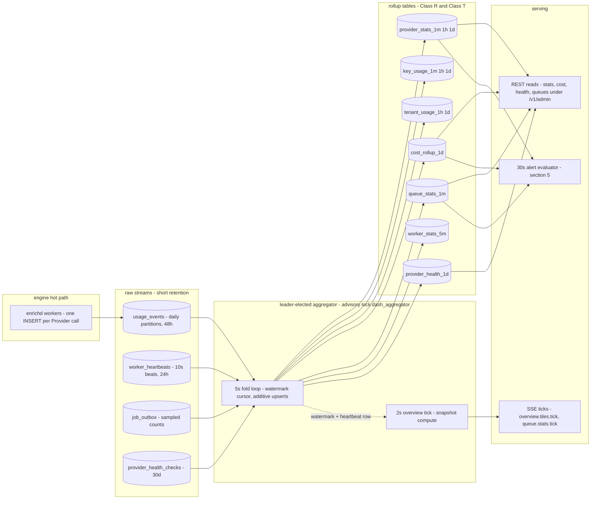
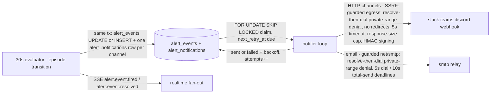

# 10 — Observability

> **Status:** DRAFT · **Owner:** Senior Backend Engineer · **Last updated:** 2026-07-02 · **Gated by:** /architecture-review, /security-audit

This document is the observability contract for `cmd/dashboardd`: the complete metric catalog, the
telemetry rollup pipeline, health-check semantics, the closed alert-rule metric vocabulary, alert
evaluation and notification-delivery semantics, the dashboard's self-monitoring, and the logging
policy. It extends `docs/20-Monitoring.md` (stack: Prometheus + Grafana + OTel + ELK; **no PII in
metrics or logs**) to the new deployable, and it honors `docs/17-Dashboard-Planning.md`'s rule that
every panel maps to a real backing service and table — here inverted: every metric and vocabulary
entry below maps to a real emitter and a real source table, and nothing else may be emitted.

Governing invariant: **"the model proposes, a deterministic gate disposes."** Telemetry observes;
it never enforces. Budgets and alert rules **alert**; the engine's **G4 cost ceiling** enforces.
Gates are referenced by their exact labels throughout: **G1 tenant isolation, G2 idempotency,
G3 bounded execution, G4 cost ceiling, G5 provenance.**

---

## 1. Metric catalog

All dashboardd metrics are registered on the in-repo `internal/metrics` registry
(Prometheus text exposition, served at `GET /metrics` per instance) and use the `dash_` prefix so
they never collide with the engine families already exported by `enrichapi`/`enrichd` in a shared
Grafana datasource. The registry supports labeled Counters, Gauges, Histograms, and label-less
GaugeFuncs — every entry below fits those four shapes.

**Cardinality rule (BINDING, per `internal/metrics/metrics.go` package doc and docs/20 §7):**
label values MUST come from closed, enumerable sets — route templates, Provider ids (bounded by
the operator-curated Class P catalog), the 8-class error taxonomy, closed enums from
`GET /v1/admin/meta/enums`. **`tenant_id` is NEVER a metric label** and neither is any other
unbounded id (Provider Key id, user id, session id, Enrichment Job id, Record id). Per-Tenant
analytics are served exclusively from the RLS-scoped rollup tables (`tenant_usage_*`,
`cost_rollup_*`) through `/v1/admin/cost/*` and `/v1/admin/*/stats` — metrics exist for platform
operations only. No PII (emails, names, Field values, secrets) ever appears in a label, a help
string, or a log line (G1; the `Secret` wrapper redacts).

Duration histograms use one shared log-spaced bucket set
`{0.005, 0.01, 0.025, 0.05, 0.1, 0.25, 0.5, 1, 2.5, 5, 10}` seconds (+`+Inf`), defined once in
`internal/dash/httpx`.

### 1.1 New dashboardd metrics

| # | Name | Type | Labels (closed value set) | Cardinality bound | Purpose |
|---|------|------|---------------------------|-------------------|---------|
| 1 | `dash_http_requests_total` | counter | `route` (mux template, ≤ ~120), `method` (≤ 6), `status` (HTTP code, ≤ 15 in use) | ≤ ~2,000 series (route implies method; status sparse) | RED rate + errors for every `/v1/admin/*` route, `/healthz`, `/readyz`, `/metrics`, SPA static |
| 2 | `dash_http_request_duration_seconds` | histogram | `route` (≤ ~120) | ≤ ~1,600 series (120 × 13 buckets) | RED duration; p95/p99 per route in Grafana |
| 3 | `dash_http_inflight` | gauge | — | 1 | Saturation: concurrent requests per instance (SSE streams excluded — see #4) |
| 4 | `dash_sse_clients` | gauge | — | 1 | Open `GET /v1/admin/streams` EventSource connections on this instance |
| 5 | `dash_sse_subscriptions` | gauge | `topic` (8 closed topics, doc 04 §3) | 8 | Per-topic subscription count across connected clients |
| 6 | `dash_sse_events_total` | counter | `topic` (8) | 8 | Events published into the per-topic 256-event ring buffers |
| 7 | `dash_sse_dropped_total` | counter | `topic` (8) | 8 | Deliveries dropped: slow client back-pressure or Last-Event-ID scrolled out of the ring (client receives `reset`) |
| 8 | `dash_aggregator_leader` | gauge | — | 1 | 1 iff this instance holds `pg_try_advisory_lock(hashtext('dash_aggregator'))`; identifies the leader in Grafana |
| 9 | `dash_aggregator_fold_duration_seconds` | histogram | `fold` (10: `overview_tick`, `provider_stats_1m`, `rollup_1h`, `rollup_1d`, `key_usage_1m`, `tenant_usage`, `cost_rollup_1d`, `queue_stats_1m`, `worker_stats_5m`, `provider_health_1d`) | 130 series | Fold cost per rollup family; a fold approaching its cadence is the first overload signal |
| 10 | `dash_aggregator_lag_seconds` | gauge | `fold` (10) | 10 | `now() − fold watermark`: how stale each rollup family is; feeds vocabulary entry `system.aggregator_lag_s` (§4) |
| 11 | `dash_aggregator_rows_folded_total` | counter | `fold` (10) | 10 | Fold throughput (rows consumed from `usage_events` / `worker_heartbeats` / `job_outbox` samples / `provider_health_checks`) |
| 12 | `dash_aggregator_last_run_age_seconds` | gaugefunc | — | 1 | Dead-man heartbeat of the fold loop (leader only; 0 on followers by convention) |
| 13 | `dash_rotation_selections_total` | counter | `provider` (catalog-bounded), `strategy` (12 closed strategies, migration 0005) | ≈ Key Pool count (a pool has one strategy; sparse) | Key-selection rate per Provider/strategy; P2 gate observability |
| 14 | `dash_rotation_leases_total` | counter | `provider`, `result` (`granted`, `denied_budget`, `denied_unavailable`, `error`) | ≤ 4 × catalog | Batched lease admissions vs `key_budgets` denials; `denied_budget` rising = pool exhaustion in progress |
| 15 | `dash_rotation_trigger_transitions_total` | counter | `from_state`, `to_state` (KM-3 states, 9 each; only the ~14 legal edges occur) | ≤ 14 series | Key state machine activity (e.g. `active→exhausted`, `probing→active`); per-Key detail lives in `key_usage_*` rollups and `audit_log`, not labels |
| 16 | `dash_rotation_pool_rebuilds_total` | counter | `reason` (`epoch`, `reband`, `startup`) | 3 | `PoolState` rebuild rate; runaway `epoch` rebuilds indicate config churn |
| 17 | `dash_health_checks_total` | counter | `provider`, `result` (`ok` + 8 error classes) | ≤ 9 × catalog | Scheduled Provider health-check outcomes by `domain.ErrorClass` |
| 18 | `dash_health_check_duration_seconds` | histogram | `provider` | ≤ 13 × catalog | Probe latency per Provider |
| 19 | `dash_health_checks_inflight` | gauge | — | 1 | Probes currently executing vs the bounded-concurrency cap (§3.3) |
| 20 | `dash_health_status_transitions_total` | counter | `provider`, `to_status` (`up`, `degraded`, `down`, `maintenance`) | ≤ 4 × catalog | Provider health status edges; each edge also emits SSE `provider.health.changed` |
| 21 | `dash_health_scheduler_last_run_age_seconds` | gaugefunc | — | 1 | Dead-man heartbeat of the health scheduler loop |
| 22 | `dash_alert_evaluations_total` | counter | `metric` (16 closed vocabulary entries, §4), `outcome` (`breach`, `clear`, `suppressed`, `error`) | 64 | Evaluator activity per vocabulary entry; `suppressed` = maintenance/`muted_until` skips |
| 23 | `dash_alert_events_total` | counter | `transition` (`fired`, `resolved`, `renotified`), `severity` (`info`, `warning`, `critical`) | 9 | Episode edges (mirrors `alert_events` writes) |
| 24 | `dash_alert_notifications_total` | counter | `channel_kind` (`email`, `slack`, `teams`, `discord`, `webhook`), `result` (`sent`, `failed`, `ssrf_blocked`) | 15 | Notifier delivery outcomes; `ssrf_blocked` is security telemetry (docs/20 §6) |
| 25 | `dash_alert_notifier_pending` | gaugefunc | — | 1 | `alert_notifications` rows in `status='pending'` (delivery backlog) |
| 26 | `dash_alert_evaluator_last_run_age_seconds` | gaugefunc | — | 1 | Dead-man heartbeat of the 30s evaluator loop |
| 27 | `dash_import_rows_total` | counter | `source` (`csv`, `xlsx`, `json`, `paste`), `result` (`succeeded`, `failed`, `duplicate`) | 12 | Per-row Provider Key import outcomes (`key_import_batches` aggregate) |
| 28 | `dash_import_batches_total` | counter | `source` (4), `status` (`succeeded`, `partial`, `failed` — doc 04 §4.1 terminal states) | 12 | Import batch completions |
| 29 | `dash_approval_transitions_total` | counter | `action_kind` (6 closed kinds, migration 0007), `transition` (`created`, `approved`, `rejected`, `expired`, `cancelled`, `executed`, `failed`) | 42 | Approval workflow throughput and failure surfacing (runbook: approval deadlock) |
| 30 | `dash_approvals_pending` | gaugefunc | — | 1 | Open `approval_requests` (pending, unexpired) platform-wide |
| 31 | `dash_audit_chain_verify_total` | counter | `result` (`ok`, `mismatch`) | 2 | Nightly walker + `GET /v1/admin/audit-log/verify` outcomes; any `mismatch` is a security incident (runbook: audit-chain mismatch) |
| 32 | `dash_audit_chain_verify_last_ok_age_seconds` | gaugefunc | — | 1 | Age of the last fully clean chain walk |
| 33 | `dash_sessions_active` | gaugefunc | — | 1 | Non-expired, non-revoked `sessions` rows (store-growth watch, §6) |
| 34 | `dash_partition_maintenance_runs_total` | counter | `op` (`create`, `drop`, `delete_batch`), `result` (`ok`, `error`) | 6 | Partition maintainer activity over the doc 03 §4 partition/retention matrix |
| 35 | `dash_partition_maintenance_last_success_age_seconds` | gaugefunc | — | 1 | Dead-man heartbeat of the partition maintainer |
| 36 | `dash_partitions_created_ahead` | gauge | `table` (≤ 15 partitioned tables, doc 03 §4) | ≤ 15 | Create-ahead margin (future partitions already existing); 0 for any table = imminent insert failures |
| 37 | `dash_bulk_jobs_stuck` | gaugefunc | — | 1 | `bulk_jobs` rows in `queued`/`running` whose `lease_expires_at` is past by more than one janitor sweep — janitor dead or lease reclaim wedged; nonzero means in-flight bulk work (imports, replays) is stranded and the one-in-flight guard is blocking resubmission with 409s (doc 04 §4.1; doc 11 §6 step 4 drain contract, L7 drill) |

Worst-case total across the catalog is ≈ 10,000 series per instance at the design-target catalog
size of hundreds of Providers — comfortably inside a single Prometheus scrape (UNVERIFIED until
the P12 load pass measures actual series counts).

### 1.2 Existing engine metrics reused (never re-registered by dashboardd)

The product dashboard's Grafana counterpart continues to read the engine families below from
`enrichapi`/`enrichd` scrapes. dashboardd does **not** duplicate them; its view of the same facts
is the rollup tables (§2), which are fed by `usage_events`, not by scraping.

| Name | Type | Labels | Registered in | Dashboard-side relationship |
|------|------|--------|---------------|------------------------------|
| `provider_calls_total` | counter | `provider`, `result` | `internal/engine/engine.go` | Same facts folded into `provider_stats_1m` per-class failure columns; Grafana cross-checks fold correctness |
| `provider_cost_credits_total` | counter | `provider` | `internal/engine/engine.go` | Modeled credits; rollup counterpart is `cost_rollup_1d.credits` / `provider_stats_*.credits_spent` |
| `queue_depth` | gaugefunc | — | `cmd/enrichapi/main.go` | Rollup counterpart `queue_stats_1m.depth`; vocabulary entry `queue.depth` reads the rollup, not the scrape |
| `outbox_dead_letter_total` | counter | — | `cmd/enrichapi/main.go` | Rollup counterpart `queue_stats_1m.dead`; vocabulary entry `queue.dead_count` |
| `dlq_redrive_total` | counter | — | `internal/api/server.go` | Dashboard-initiated redrives additionally appear as `dash_http_requests_total{route="/v1/admin/dead-letters/{id}/redrive"}` and as hash-chained `audit_log` rows |

---

## 2. Rollup pipeline

The engine hot path performs **exactly one INSERT** per Provider call — an append into
`usage_events` (daily partitions, 48h retention) carrying `tenant_id, provider_id, key_id,
workflow_key, country, outcome_class, credits, lat_ms`. Everything the dashboard serves is folded
from that stream (plus `worker_heartbeats`, `job_outbox` samples, and `provider_health_checks`) by
the **leader-elected aggregator** — a single loop per cluster, elected via
`pg_try_advisory_lock(hashtext('dash_aggregator'))`, running a **5s fold cadence** for rollups and
a **2s tick** for the Overview snapshot (10s degraded mode per doc 11).

Properties (normative, consistent with doc 03 §7):

- **Single writer.** Only the leader aggregator writes rollup tables (one-owner-per-table). All
  API reads are rollup-only; the bounded-query guard (cursor pagination, `limit` cap 200) makes
  raw-event scans from the API impossible.
- **Watermark cursor.** The incremental fold consumes each `usage_events` row exactly once past a
  persisted per-fold watermark; leader loss loses no data — the next leader resumes from the
  watermark. Watermarks and loop heartbeats persist in the `self_monitor` row set (open item
  OBS-1: DDL lands in doc 03 §2.6).
- **Replayability (48h).** Rollups are refoldable from `usage_events` within its 48h retention: a
  repair refold recomputes affected buckets wholesale and **replaces**
  (`DO UPDATE SET x = EXCLUDED.x`) — same fold code as the additive incremental mode
  (`DO UPDATE SET x = x + EXCLUDED.x`), different merge mode, per the P4 acceptance gate "rollup
  replay identical". An aggregation bug discovered within 48h is fully repairable; beyond 48h the
  1m rollups are the finest surviving truth.
- **Latency histograms.** `lat_hist bigint[20]` fixed log-spaced buckets, folded additively;
  percentiles (p95/p99, vocabulary entry `provider.p95_latency_ms`) are computed at read, never
  stored.
- **Freshness is measured, not assumed.** `dash_aggregator_lag_seconds{fold}` (#10) is exported
  per fold family and is part of the alert-detection SLA (§5.6).

---

## 3. Health checks

### 3.1 `/healthz` — liveness

Process-up probe. Returns `200` with `{"status":"ok","version":"<build>","commit":"<sha>"}` and
touches **no dependencies** — a dashboardd instance wedged on Postgres must still answer
`/healthz` so orchestrators restart it for the right reason. Never authenticated, never logged to
`api_access_log`.

### 3.2 `/readyz` — readiness

Answers "may this instance receive traffic?". Checks, in order:

| Check | Failure → | Detail |
|-------|-----------|--------|
| Postgres ping | `503` | `SELECT 1` through the pool with a 2s deadline |
| Migration drift | `503` | highest applied migration (via `internal/pgmigrate` state) equals the binary's embedded expectation; a binary ahead of or behind the schema must not serve |
| Master key presence | `503` | `DASH_MASTER_KEY` keyring parsed at boot and the active `master_key_id` resolvable; without it every `secrets.Backend.Open` would fail at first use — fail closed at the LB instead |
| Loop staleness (informational) | `200` + `"degraded":[...]` | stale singleton-loop heartbeats (§6) are reported in the body but do NOT fail readiness — the loops are cluster singletons that may legitimately run on another instance |

Body is snake_case JSON:
`{"status":"ready","degraded":["alert_evaluator"]}` or on failure
`{"status":"unready","failed":"migration_drift"}` with `503`.

### 3.3 Provider health-check scheduler

The health scheduler (background loop in `internal/dash/health`, own per-loop advisory lock per
doc 11) actively probes Providers and writes `provider_health_checks`:

- **Jittered intervals.** Per-Provider interval from `GET/PUT /v1/admin/health/schedules`
  (default 60s), with ±20% uniform jitter per scheduling decision so hundreds of Providers never
  probe in phase (thundering-herd avoidance against both our egress and vendors).
- **Bounded concurrency.** A fixed worker pool (default 8 concurrent probes, env-tunable per
  doc 11) drains the due set; `dash_health_checks_inflight` (#19) exposes saturation. A probe is a
  G3-bounded `provider.Call` (`CallPolicy` timeout, no retries) using a leased Provider Key
  through the normal `rotation.LeaseResolver` path, so probes are attributed, budget-checked, and
  SSRF-guarded exactly like production traffic.
- **Results.** Each probe INSERTs one `provider_health_checks(provider_id, key_id, region,
  checked_at, status, http_status, lat_ms, error_class)` row (30d retention) and increments
  `dash_health_checks_total{provider,result}` with the 8-class `domain.ErrorClass` mapping.
- **Status transitions.** The health service folds recent checks into an effective status
  (`up`, `degraded`, `down`, plus `maintenance` mirrored from `providers.op_state`). Every edge:
  increments `dash_health_status_transitions_total` (#20), updates `providers.health_score` /
  `last_health_at`, emits SSE `provider.health.changed`, and becomes visible to the alert
  evaluator through `provider_stats_1m` and `provider_health_checks`. Status is **computed, never
  stored as availability** — `providers.EffectiveAvailability` remains the single derivation
  point (MASTER SPEC §10b).
- **Auto re-enable probes.** Keys in KM-3 state `exhausted` get scheduled recovery probes; a
  successful probe drives `exhausted → probing → active` through the rotation trigger state
  machine (never by the dashboard mutating state directly), incrementing
  `dash_rotation_trigger_transitions_total` (#15).
- **Dead-man heartbeat.** The scheduler upserts its `self_monitor` heartbeat each cycle;
  `dash_health_scheduler_last_run_age_seconds` (#21) exports it (§6).

---

## 4. Alert rule metric vocabulary (CLOSED)

The rule builder (`POST /v1/admin/alerts/rules`, doc 04 §2.11) exposes **exactly these 16
entries** — `alert_rules.metric` is CHECK-able against this list, the evaluator switches over it,
and the SPA enum mirrors it via `GET /v1/admin/meta/enums`. There is no query language: each entry
compiles to one parameterized SQL aggregate over the named source. Adding an entry requires a
change to this table, the evaluator switch, and the UI enum in lockstep (parity test, doc 13;
open item OBS-2). Default thresholds below are rule-builder pre-fills, not enforcement —
**budgets and rules alert, G4 cost ceiling enforces**. All defaults are pre-tune values,
UNVERIFIED until production baselines exist (open item OBS-3).

| Metric | Source | Unit | Allowed scope keys | Default (op / threshold / window) |
|--------|--------|------|--------------------|------------------------------------|
| `provider.success_rate` | `provider_stats_1m` — `ok / NULLIF(req,0)` over window buckets | ratio 0..1 | `provider_id` | lt / 0.90 / 600s |
| `provider.error_rate` | `provider_stats_1m` — `(req − ok) / NULLIF(req,0)`; dual-window "sustained" variant per §5.1 | ratio 0..1 | `provider_id` | gt / 0.05 / 600s |
| `provider.p95_latency_ms` | `provider_stats_1m.lat_hist` — percentile computed at read over window | ms | `provider_id` | gt / 5000 / 600s |
| `provider.credits_remaining` | `providers.credits_remaining` (last `sync-credits` value; point-in-time — window ignored) | credits | `provider_id` | lt / 10000 / — |
| `key.credits_remaining` | `provider_keys.credits_remaining` (point-in-time) | credits | `provider_id`, `pool_id` | lt / 1000 / — |
| `key.consecutive_failures` | `provider_keys.consecutive_failures` (point-in-time) | count | `provider_id`, `pool_id` | gte / 5 / — |
| `key.active_ratio_in_pool` | `provider_keys` ⋈ `key_pool_members` — `count(status='active') / count(*)` per Key Pool | ratio 0..1 | `pool_id` | lt / 0.5 / — |
| `queue.depth` | `queue_stats_1m.depth` (latest bucket in window) | jobs | `queue` | gt / 10000 / 300s |
| `queue.oldest_age_s` | `queue_stats_1m.oldest_age_s` (latest bucket) | seconds | `queue` | gt / 900 / 300s |
| `queue.dead_count` | `queue_stats_1m.dead` (latest bucket) | jobs | `queue` | gt / 50 / 300s |
| `worker.lost_count` | `workers` — `count(*) WHERE status='lost'` | workers | `kind`, `queue` | gt / 0 / 120s |
| `worker.heartbeat_age_s` | `workers` — `max(now() − last_heartbeat_at)` over non-stopped workers | seconds | `kind`, `queue` | gt / 60 / 120s |
| `cost.daily_credits` | `cost_rollup_1d` — `SUM(credits)` for the current UTC day in scope | credits | `provider_id`, `workflow_key` | gt / `budgets.limit_credits` for the matching day-scope budget when one exists, else user-set / — |
| `cost.budget_burn_pct` | `cost_rollup_1d` (or `tenant_usage_1d`) SUM vs `budgets.limit_credits` for the budget's scope + period (UTC latching, RF-4/doc 04) | percent | `scope`, `scope_key`, `period` | gte / 80 / — |
| `system.sse_clients` | `self_monitor` rows — per-instance SSE client counts upserted by each dashboardd instance, summed | clients | — (platform) | gt / 400 / 120s |
| `system.aggregator_lag_s` | `self_monitor` fold watermarks — `max(now() − watermark_ts)` across fold families | seconds | — (platform) | gt / 30 / 120s |

Notes:

- Point-in-time entries (credits, consecutive failures, active ratio) are evaluated fresh each
  30s cycle; `window_s` is accepted but ignored, and the rule editor greys it out.
- `system.*` entries are platform-scoped: rules on them live under `tenant_id='platform'` and are
  operator-only (RBAC matrix, doc 05). They read `self_monitor` rather than the in-process
  registry because the evaluator and the emitting instance may be different processes — the
  database is the only cross-instance channel (ADR-0019 discipline).
- Every entry reads rollups or dashboard-owned tables under the dual-GUC RLS transaction — the
  evaluator never touches raw `usage_events` and can never see across Tenants beyond the
  enumerated operator policies (G1).

---

## 5. Alert evaluation semantics

### 5.1 Evaluation loop

The evaluator (`internal/dash/alerts`) runs every **30s** under its own per-loop advisory lock
(doc 11 §1), iterating enabled `alert_rules` per Tenant inside RLS-scoped transactions:

1. **Window aggregation.** `window_s` is read as `ceil(window_s/60)` 1m buckets from the source
   rollup. Breach requires ≥ 2/3 of **non-empty** buckets breaching (N-of-M flap suppression).
   Missing-data policy: empty buckets are not-breaching for rate/latency entries; for the
   staleness-shaped entries (`worker.heartbeat_age_s`, `system.aggregator_lag_s`) absence of
   fresh rows IS the breach.
2. **Suppression.** Scope instances whose Provider is in `op_state` `maintenance`/`paused` are
   skipped and their open episodes auto-resolved with a "suppressed by maintenance" note; rules
   with `muted_until > now()` are skipped. Both suppressions are audited and counted as
   `outcome="suppressed"` (#22).
3. **Resolve hysteresis.** A firing episode resolves only after **3 consecutive clean
   evaluations** — fastest resolve ≈ 90s after actual recovery; documented so operators trust the
   resolved signal in retrospectives.
4. Sustained (dual-window) variants of `provider.error_rate` require breach over both the last
   5m and the full `window_s` in a single conditional-aggregation query (Google SRE
   multiwindow insight, doc 01 Domain 4).

### 5.2 Single-firing invariant (resolves RF-1)

At most **one open episode per rule** is a database invariant, not evaluator memory: the partial
unique index on `alert_events` `(tenant_id, rule_id) WHERE state='firing'`
(`alert_events_one_firing_uq`, doc 03 §2.4; MASTER SPEC §10b). The evaluator INSERTs with
`ON CONFLICT DO NOTHING`; a concurrent or restarted evaluator cannot double-open an episode.
Consequences, resolving doc 01 open item RF-1:

- `dedupe_key` = `sha256(tenant_id ‖ rule_id ‖ canonical scope-instance)` is retained as a
  **correlation id** carried in webhook payloads (PagerDuty/Opsgenie-compatible), not as the
  uniqueness mechanism.
- Per-scope-instance fan-out folds into the single episode: the episode payload carries the
  breaching instance list, capped at 50, rendered as "N instances breaching" beyond the cap
  (degenerate Alertmanager grouping).
- Budget step laddering (`budgets.alert_pct[]`, `cost.budget_burn_pct`) operates within the one
  episode: crossing a higher step updates the episode `value` and **forces an immediate
  renotify** (bypassing the remaining cooldown), delivered under the standard renotify occasion.
  Actual-spend steps latch once per UTC period; forecast-based warnings stay disarmed until ≥ 14
  days of history (MASTER SPEC §10b).

### 5.3 Episode lifecycle

`firing → resolved`, edge-triggered: notifications happen on transitions (and cooldown renotify),
never per breaching evaluation. `POST /v1/admin/alerts/events/{id}/ack` suppresses renotify;
resolve still notifies; a re-fire clears the ack. Renotify fires iff `state='firing'` AND
`now() − notified_at > cooldown_s`, updating `notified_at` in the same transaction as the outbox
write (P6 gate: overrun alert once per cooldown).

### 5.4 Notification delivery (RESOLVES RF-5)

Delivery is transactional-outbox based, reusing the pattern of commit `0d0e550` but on an
**alerts-owned table** (one-owner-per-table: `job_outbox` is written only via `pgoutbox` APIs):

- **Atomic intent.** The `alert_notifications` row (one per channel in `alert_rules.channels`) is
  INSERTed **in the same transaction** as the `alert_events` transition. A crash after commit
  loses nothing (the notifier finds the pending row); a crash before commit loses the transition
  and the notification together — never a notified-but-unrecorded or recorded-but-unnotified
  split (the RF-5 failure mode).
- **At-least-once with dedupe.** The notifier loop claims due rows with
  `FOR UPDATE SKIP LOCKED`, delivers through the per-`channel_kind` builders (`slack`, `teams`,
  `discord`, `webhook` over the SSRF-guarded HTTP egress client; `email` over the guarded SMTP
  dialer below), and marks `sent` or `failed` with exponential `next_retry_at` backoff and
  bounded `attempts`. Duplicate enqueue of the same send occasion is impossible: the
  partial unique index `alert_notifications_pending_dedupe_uq (dedupe_key) WHERE
  status='pending'` (doc 03 §2.4) with notification-grained
  `dedupe_key = hex(sha256(event_dedupe_key ‖ ':' ‖ channel_id ‖ ':' ‖ occasion))`, occasion ∈
  `fired` | `renotify:<cooldown-bucket>` | `resolved`. Channels may still see a duplicate if a
  crash lands between vendor accept and the `sent` UPDATE — at-least-once is the contract, and
  the embedded correlation `dedupe_key` lets receivers (PagerDuty/Opsgenie) dedupe natively.
- **Email is SMTP, not HTTP.** The `email` builder (doc 12 P6: `net/smtp`) cannot ride the HTTP
  egress client, so it applies the same egress discipline natively: the configured SMTP host is
  resolved first and **every** resolved address is checked against the private-range / loopback /
  link-local / cloud-metadata denylist before dialing, and the dial targets the vetted IP (not
  the hostname) so a DNS re-resolution cannot bypass the check (same resolve-then-dial rule as
  the HTTP guard). The connection uses a `net.Dialer` with a **5s dial timeout** and
  `conn.SetDeadline` enforcing a **10s total-send budget** across the whole SMTP dialogue
  (EHLO/STARTTLS/AUTH/DATA/QUIT) — an unresponsive relay can never wedge the notifier loop. The
  HTTP-only properties (no-redirects, response-size cap, HMAC signing) have no SMTP analogue and
  do not apply; the denylist + deadlines are the SMTP equivalents. Outcomes are uniform with HTTP
  channels: denied hosts count as `result="ssrf_blocked"` in `dash_alert_notifications_total`
  (#24), and failures take the same exponential `next_retry_at` backoff with bounded `attempts`.
- **Test-send** (`POST /v1/admin/alerts/channels/{id}/test`) exercises the identical builder +
  SSRF guard path (never a shortcut), returning delivery status + response code.
- Every delivery outcome increments `dash_alert_notifications_total` (#24);
  `dash_alert_notifier_pending` (#25) exposes backlog.

### 5.5 Restart safety

Evaluator in-memory last-state is a cache rebuilt on start from open `alert_events` episodes; the
single-firing index (§5.2) makes the rebuild race-free.

### 5.6 Detection SLA (derived, UNVERIFIED until P12 measurement)

Worst-case alert latency ≈ fold lag (≤ 5s cadence + fold duration) + 1m bucket boundary +
30s evaluation cadence + notifier claim interval (5s) ≈ **≤ ~100s** for rollup-sourced entries;
point-in-time entries skip the bucket term. Resolve adds the 90s hysteresis (§5.1). This SLA is
why budget alerts must never be mistaken for the G4 cost ceiling: G4 rejects at request time,
alerts arrive within ~2 minutes.

---

## 6. Self-monitoring (the dashboard watching itself)

Every singleton loop upserts a heartbeat (component, instance, `last_run_at`, watermark where
applicable) into the `self_monitor` row set each cycle (OBS-1) and exports a label-less
`*_last_run_age_seconds` GaugeFunc. The **dead-man's-switch is reciprocal** (MASTER SPEC §10b):
the evaluator watches the aggregator through the closed-vocabulary rule
`system.aggregator_lag_s`; the **aggregator watches the evaluator** through a hard-coded check
(deliberately NOT a vocabulary entry — a dead evaluator cannot evaluate its own death) that
writes the episode and its `alert_notifications` rows directly through the same §5.4 outbox path.
Belt-and-braces: `/readyz` reports stale loops as `degraded` (§3.2) and Grafana alerts on the
scraped `*_last_run_age_seconds` externally (§8).

Default platform alert rules (seeded under `tenant_id='platform'` at bootstrap, operator-editable;
thresholds UNVERIFIED pre-tune values, OBS-3):

| Concern | Signal | Default rule | Failure it catches |
|---------|--------|--------------|--------------------|
| Aggregator lag | `system.aggregator_lag_s` (vocab, from `self_monitor` watermarks); `dash_aggregator_lag_seconds` in Grafana | gt 30s for 120s | Leader died with lock orphaned, fold overload, PG contention — all tiles/rollups/alerts go stale |
| Evaluator death | aggregator's hard-coded reciprocal check on evaluator heartbeat | age gt 120s → direct episode + notification | Every alert silently off precisely when unwatched |
| SSE fan-out saturation | `system.sse_clients` (vocab); `dash_sse_dropped_total` rate in Grafana | gt 400 clients for 120s; any sustained drop rate | Ring-buffer overruns → clients forced into `reset` refetch storms; degradation lever = widen tick interval (doc 11) |
| Session store growth | `dash_sessions_active` | Grafana: gt 10× 7-day median | Session-reaper death or login-bomb; unbounded `sessions` growth degrades auth lookups |
| Partition maintenance failure | `dash_partition_maintenance_runs_total{result="error"}` + `dash_partition_maintenance_last_success_age_seconds` + `dash_partitions_created_ahead` | Grafana: any error increase; last-success age gt 26h; created-ahead = 0 on any table | Missing future partitions → hot-path INSERT failures on `usage_events` (engine-visible outage); retention never applied |
| Health scheduler death | `dash_health_scheduler_last_run_age_seconds` (checked by aggregator alongside evaluator) | age gt 300s → direct episode | Provider health goes stale; auto re-enable probes stop; `exhausted` Keys never recover |
| Approval liveness | `dash_approvals_pending` + `dash_approval_transitions_total{transition="expired"}` | Grafana: pending gt 20 for 24h | Approval deadlock (runbook) — gated actions silently stuck |
| Bulk-job liveness | `dash_bulk_jobs_stuck` (#37) | Grafana: gt 0 for 10m | Janitor death or wedged lease reclaim — a deploy or crash strands an import/replay in `running`, progress drawer freezes, and resubmission is blocked by 409 `bulk_job_conflict` (doc 11 §6 drain contract violated) |

---

## 7. Logging

Three separated streams, one structured format (`log/slog`, JSON handler, stdout → ELK per
docs/20 §1). **Separation is by purpose and store, and nothing appears in two streams as the
authoritative copy:**

| Stream | Store | Retention | Purpose | Written by |
|--------|-------|-----------|---------|-----------|
| App log | stdout → ELK | per ELK policy | Operational events: loop cycles, fold stats, notifier outcomes, egress failures, panics (recovered with stack) | `slog` throughout dashboardd |
| Access log | `api_access_log` table (monthly partitions) | 90d | Authoritative per-request record served to Tenants at `GET /v1/admin/access-log` | async batch inserter in `internal/dash/security` (never blocks request handling) |
| Audit log | `audit_log` hash-chained table (yearly partitions) | forever | Security-relevant mutations: who changed what, before/after, per-Tenant SHA-256 chain (G5-grade provenance for admin actions) | `audited(action, kind, handler)` wrapper in `internal/dash/httpx` |

**Canonical request-scoped slog fields** (bound once via `slog.With` from request context;
every handler and background job touching a request carries them):

| Field | Type | Content |
|-------|------|---------|
| `req_id` | string | Per-request random id, echoed as `X-Request-Id` response header; the join key across app log ↔ `api_access_log` ↔ trace (future OTel span id, §8) |
| `tenant` | string | Tenant id from the verified Principal (`tenant.FromContext`) — an opaque id, never a name/email |
| `route` | string | Mux route **template** (`/v1/admin/keys/{id}`), never the raw path (raw paths could embed ids in unbounded variety) |
| `status` | int | Response HTTP status |
| `dur_ms` | int | Wall-clock request duration |

Background loops log `component`, `run_id`, and their fold/cycle stats instead of request fields.

**No-PII policy (restated from docs/20 §7, BINDING):** logs never contain Record/Subject data,
Field values (`work_email`, `mobile_phone`, …), user emails, passwords, TOTP codes, session ids,
CSRF tokens, or any secret material. Provider Key plaintext cannot reach a log by construction:
the `secrets.Secret` wrapper redacts `String()`/`MarshalJSON`, and only envelope ids + `last4`
travel through handlers. Error messages from Provider egress are logged with bodies truncated and
scrubbed (bodies may echo submitted PII). Logs identify people by opaque ids (`user_id` uuid)
only. The same rule applies transitively to metrics labels (§1) and SSE payloads.

---

## 8. Dashboards-for-ops note

Two dashboards, two audiences, deliberately not merged:

- **Grafana remains the ops view** (docs/20): Prometheus scrapes `/metrics` from `enrichapi`,
  `enrichd`, and every `dashboardd` instance (the §1 catalog); Grafana carries golden signals,
  the §6 self-monitoring boards, and alert-to-runbook links for the on-call operator. The
  engine's existing families (§1.2) and the new `dash_*` families land in the same datasource
  without collision.
- **This product dashboard serves control-plane users** — operators and Tenant admins managing
  Providers, Provider Keys, Waterfalls, Enrichment Job queues, and Cost Ceilings through
  `/v1/admin/*` with RBAC + RLS. It reads rollup tables, not Prometheus; it is a product surface,
  not a monitoring stack replacement, and it must never grow a Prometheus query proxy (that would
  bypass G1 tenancy).
- **OTel distributed tracing stays a design target** (docs/20 lists OTel in the stack): the
  stdlib-only constraint currently blocks an OTLP exporter dependency in dashboardd. `req_id`
  (§7) is the forward-compatible correlation key. Open item OBS-4 tracks the decision (hand-rolled
  W3C `traceparent` propagation + collector-side synthesis vs an ADR-0016-style exception).

---

## Open items

| ID | Item | Status | Owner |
|----|------|--------|-------|
| OBS-1 | `self_monitor` row-set DDL (component, instance, `last_run_at`, `watermark_ts`, value) — persisted loop heartbeats + fold watermarks backing §2, §4 `system.*` entries, §6; to be added to doc 03 §2.6 / migration 0009 | OPEN — doc 03 addendum | Senior Backend Engineer |
| OBS-2 | Four-way parity test: §4 vocabulary ⊆ evaluator switch ⊆ `meta/enums` ⊆ SPA rule-builder enum (plus §1 catalog ↔ registered families) | OPEN — doc 13 / at impl | Senior Backend Engineer |
| OBS-3 | All §4 default thresholds, §6 self-monitoring defaults, §1 series-count bound, and the §5.6 detection SLA are pre-tune design values, UNVERIFIED until the P12 load/chaos pass | OPEN — P12 | Senior Backend Engineer |
| OBS-4 | OTel tracing in dashboardd: hand-rolled `traceparent` propagation vs dependency exception; `req_id` reserved as correlation key meanwhile | OPEN — design target | Solutions Architect |
| RF-1 | Alert episode granularity vs one-firing index | RESOLVED — §5.2 (index is the invariant; `dedupe_key` correlation-only; instance fan-out capped at 50 inside the episode; budget steps force renotify within the episode) | Senior Backend Engineer |
| RF-5 | Alert notification delivery semantics | RESOLVED — §5.4 (alerts-owned `alert_notifications` outbox written in the transition transaction; notifier loop with per-channel retry + SSRF-guarded egress; at-least-once with dedupe via doc 03 partial unique indexes) | Senior Backend Engineer |
