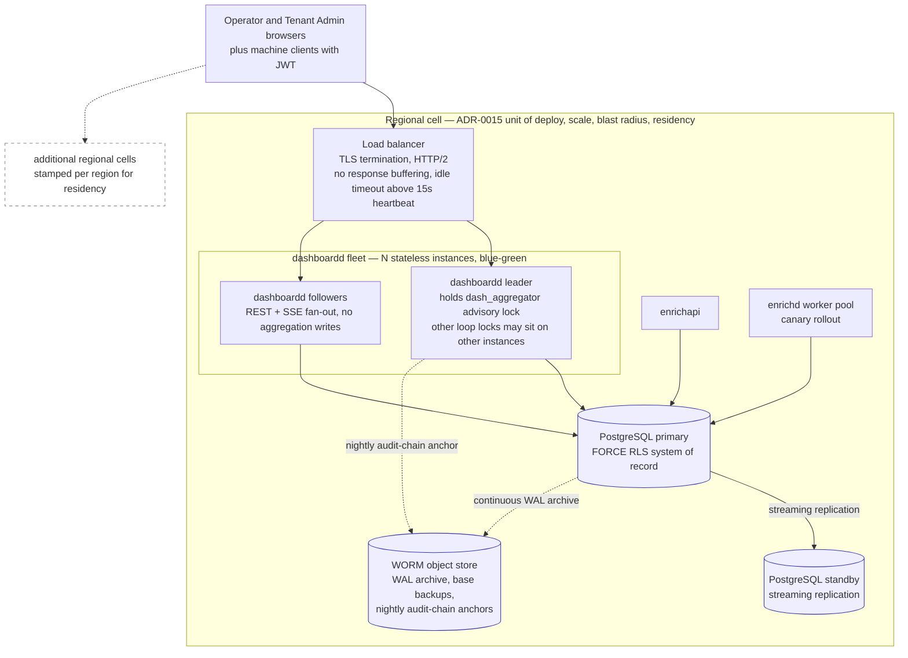

# 11 — Deployment & Scaling

> **Status:** ACCEPTED · **Owner:** GTM Infrastructure Engineer · **Last updated:** 2026-07-06 · **Gated by:** /architecture-review, /security-audit

> Scope: how `dashboardd` is deployed, configured, kept available, scaled, degraded, and upgraded without downtime. Architecture context is doc 02; schema/partition operations are doc 03; procedures are doc 14 runbooks. Repo discipline applies throughout: every numeric scale or performance claim that has not been measured carries the tag **UNVERIFIED**, and §4 names the P12 load test that converts each one. Gate labels used verbatim: **G1 tenant isolation, G2 idempotency, G3 bounded execution, G4 cost ceiling, G5 provenance.**

---

## 1. Deployables & topology

`dashboardd` is the ADR-0010 data-plane dashboard/admin deployable, running as **N stateless instances (N ≥ 2) behind a load balancer** inside a regional cell (ADR-0015: the cell is the unit of deployment, scale, blast radius, and data residency — "stamp another cell"). Instances are interchangeable: sessions, the Idempotency-Key ledger, approvals, and configuration live in PostgreSQL; in-memory structures are epoch-keyed caches (doc 02 §5). Any instance serves any REST or SSE request.

**Leadership.** Aggregator writes are performed by exactly one instance, elected with `pg_try_advisory_lock(hashtext('dash_aggregator'))`. Every other background loop takes its own advisory lock on the same pattern — `dash_alert_evaluator`, `dash_health_scheduler`, `dash_session_reaper`, `dash_partition_maintainer`, `dash_worker_lost`, `dash_approval_expirer`, `dash_bulk_janitor` (the doc 04 §4.1 bulk-job lease sweeper) — so leadership per loop is independent and may land on different instances. Advisory locks are session-scoped: when a leader's connection closes (crash or drain), the lock frees and a follower acquires it on its next retry (retry cadence `DASH_LOCK_RETRY_INTERVAL`, default 5s). Because the loops fold durable state (`usage_events`, heartbeats, outbox rows), a leadership gap produces fold **lag**, never data loss.

| Deployable | Role | Instances | Release strategy (ADR-0015) |
|---|---|---|---|
| `dashboardd` | `/v1/admin/*` REST + SSE + SPA static + background loops | N ≥ 2 stateless | blue-green (stateless control surface) |
| `enrichapi` | public enrichment API (`/v1/enrichments`, …) | per engine sizing | blue-green |
| `enrichd` | worker pool executing Enrichment Jobs | scales on IO concurrency | canary with automated rollback |
| PostgreSQL | system of record (ADR-0011, FORCE RLS) | primary + standby | managed failover |

**Load-balancer requirements (SSE-critical).** TLS terminates at the LB; HTTP/2 to the browser is preferred. The LB MUST NOT buffer streaming responses (`dashboardd` sets `X-Accel-Buffering: no`; nginx-class proxies need `proxy_buffering off`), and its idle timeout MUST exceed the 15s SSE heartbeat. No sticky sessions are required: a reconnect landing on a different instance presents `Last-Event-ID`; since ring buffers are per-instance, an unknown id yields an explicit `reset` event and a snapshot refetch — degraded freshness is always visible, never silent.

Cells never share a database; cross-cell aggregation is out of scope for v1 (operators select a cell in the SPA). The design-target stores (Redis/ClickHouse/Kafka/Temporal) are absent from this diagram deliberately — they exist only behind the Go interfaces of doc 02 §7.

---

## 2. Configuration reference

All configuration is environment variables read once at boot by `cmd/dashboardd/main.go`; there is no config file and no runtime mutation (config-as-versioned-data lives in the database, not the environment). Durations use Go syntax (`30s`, `12h`). Boot fails fast with a fatal log if a required variable is missing or malformed.

| Variable | Required | Default | Description |
|---|---|---|---|
| `PORT` | no | `8080` | HTTP listen port for `/v1/admin/*`, SSE, SPA static, `/healthz`, `/readyz`, `/metrics`. |
| `POSTGRES_DSN` | **yes** | — | DSN for the `app_rls` role (no BYPASSRLS) used by all request paths and loops through the dual-GUC tx helper (G1 tenant isolation). |
| `POSTGRES_ADMIN_DSN` | **yes** | — | DSN for the migration-owner role; used only by `pgmigrate.Apply` at boot, never by request paths. |
| `DASH_MASTER_KEY` | **yes** | — | Master-KEK keyring, `key_id:base64url-32B[,key_id:base64url-32B]`; first entry is the active wrap key; two entries are live only during master-key rotation (ADR-0017, runbook in doc 14). |
| `DASH_FINGERPRINT_PEPPER` | **yes** | — | Server-side pepper for keyed HMAC-SHA256 fingerprints of Provider Key plaintext (duplicate detection without a reveal path, ADR-0017). |
| `JWT_ALG` | no | `HS256` | Machine-principal verification algorithm, `HS256` or `RS256`, matching `internal/auth`. |
| `JWT_HS256_SECRET` | when `JWT_ALG=HS256` | — | HMAC signing secret for machine JWTs (ADR-0018). |
| `JWT_RS256_PUBLIC_KEY_PEM` | when `JWT_ALG=RS256` | — | Path to the PEM public key for RS256 verification. |
| `JWT_ISSUER` | no | `waterfall-dash` | Expected `iss` claim. |
| `JWT_AUDIENCE` | no | `v1-admin` | Expected `aud` claim. |
| `SESSION_IDLE_TTL` | no | `30m` | Browser-session idle expiry (`sessions.idle_expires_at`, ADR-0018). |
| `SESSION_ABSOLUTE_TTL` | no | `12h` | Browser-session absolute expiry (`sessions.absolute_expires_at`). |
| `SESSION_COOKIE_NAME` | no | `__Host-dash_session` | Session cookie; always `Secure`, `HttpOnly`, `SameSite=Lax`, path `/`. |
| `SESSION_REAP_AFTER` | no | `24h` | Session-reaper deletion delay after expiry (migration 0004 contract). |
| `CSRF_HEADER_NAME` | no | `X-CSRF-Token` | Header carrying the per-session CSRF value (`sessions.csrf_token`) on state-changing browser requests. |
| `DASH_LOCK_RETRY_INTERVAL` | no | `5s` | Advisory-lock acquisition retry cadence for all background-loop leaderships (§1). |
| `DASH_TICK_INTERVAL` | no | `2s` | Overview aggregator tick — the freshness bound of the tile grid. |
| `DASH_TICK_INTERVAL_MAX` | no | `10s` | Ceiling the tick widens to under load (§5). |
| `SSE_HEARTBEAT_INTERVAL` | no | `15s` | Comment heartbeat on every SSE stream; must stay below the LB idle timeout. |
| `SSE_RING_SIZE` | no | `256` | Per-topic replay ring buffer, events retained for `Last-Event-ID` replay (ADR-0019). |
| `ALERT_EVAL_INTERVAL` | no | `30s` | Alert-evaluator cadence over rollups. |
| `HEALTH_CHECK_CONCURRENCY` | no | `8` | Bounded concurrency for jittered per-Provider health checks (G3 bounded execution applies per call). |
| `IMPORT_MAX_BYTES` | no | `26214400` | Provider Key import upload cap (25 MiB, MASTER SPEC cap). |
| `IMPORT_MAX_ROWS` | no | `50000` | Provider Key import row cap. |
| `WEB_DIST_DIR` | no | `web/dist` | SPA static root served by dashboardd. |
| `TLS_CERT_FILE` / `TLS_KEY_FILE` | no | empty | Optional direct-TLS listener for topologies without an LB in front; empty means plain HTTP behind the TLS-terminating LB. |
| `LOG_LEVEL` | no | `info` | `log/slog` level; logs are structured and never carry PII or secret material (the `Secret` wrapper redacts). |

Secrets hygiene: `DASH_MASTER_KEY`, `DASH_FINGERPRINT_PEPPER`, `JWT_HS256_SECRET`, and both DSNs are injected from the deploy platform's secret store (Kubernetes Secrets in the ADR-0015 reference topology), never baked into images, never logged; `/metrics` and crash output must not echo the environment. ADR-0017 records the accepted trade that the KEK lives in process env pending the deferred Vault/ASM `secrets.Backend` adapters.

---

## 3. HA & DR

**Availability model.** `dashboardd` instances are stateless and disposable; availability of the dashboard reduces to (a) at least one healthy instance behind the LB and (b) PostgreSQL availability. `/healthz` is liveness; `/readyz` verifies a database round-trip and degrades when self-monitoring heartbeats go stale (dead-man's-switch, doc 10). Loop leaderships fail over automatically via advisory-lock release (§1); worst-case aggregation gap ≈ `DASH_LOCK_RETRY_INTERVAL` + one tick — lag, not loss, because all folds read durable state.

**PostgreSQL as the single system of record.** Primary + standby with streaming replication and continuous WAL archiving to the WORM object store; managed failover (Aurora Postgres in the ADR-0015 AWS reference; portable equivalents on Azure/GCP). Repo targets, adopted unchanged: **RPO ≤ 5 min, RTO ≤ 1 hr** — both UNVERIFIED until the P12 failover drill measures them. The dashboard inherits engine DR posture: no dashboard-only datastore exists to diverge.

**Backup & restore.** Daily base backup + continuous WAL archive gives point-in-time recovery inside the RPO target. The full operator procedure — restore, replay, then the mandatory **RLS verification pass** (cross-tenant zero-rows checks over restored tables) and audit-chain verification — is runbook territory: see doc 14, "restore-from-backup + RLS verify". A restore is not complete until both verifications pass; G1 tenant isolation after restore is proven, not presumed.

**Audit-chain WORM anchoring.** The hash-chained `audit_log` is tamper-evident but a restore-to-point-in-time could silently truncate it. Mitigation: a nightly leader job writes each Tenant's chain head (`audit_chain_heads.last_seq`, `last_hash`) to write-once object storage (S3 Object Lock, compliance mode, in the AWS reference). After any restore, the verify walker (`GET /v1/admin/audit-log/verify` + nightly job) recomputes chains and compares against the newest anchor at or before the restore point; a mismatch is an incident (doc 14, "audit-chain mismatch"). Exposure window: audit rows appended after the last anchor and lost within the RPO window are detectable as a sequence gap against the next anchor, and the anchoring cadence (nightly) bounds undetectable truncation to ≤ 24h of tail — an accepted, documented limit.

**Session continuity.** Sessions survive instance loss (they are rows); users do not re-authenticate on deploys or failovers. SSE streams drop on failover and recover via `Last-Event-ID` or `reset` + refetch, with the SPA's 15s polling fallback covering the gap.

---

## 4. Scaling strategy

### 4.1 What scales with what

| Axis | Scales with | Mechanism and cost shape |
|---|---|---|
| REST handling | admin request rate | goroutine-per-request stdlib server; stateless → add instances; DB cost bounded by the bounded-query guard (limit cap 200, rollup-only analytics reads) |
| SSE fan-out | concurrent dashboard viewers | one goroutine + one ring-buffer subscription per connection **per instance**; DB read load is O(instances), not O(clients) (compute-once fan-out, ADR-0019) → add instances to add viewers |
| Aggregator writes | active telemetry **cardinality**, not traffic | one leader; upserts per fold ≈ active Providers + active Provider Keys + queues + Tenant×Provider×workflow combinations — independent of request volume because `usage_events` rows fold additively |
| Key selection | engine call rate | O(1) in-memory per call; `PoolState` rebuild is O(keys in pool) per epoch bump; durable lease writes ≈ rps/64 per Provider Key (batch ≤ 64) |
| Storage | rollup cardinality × retention | tiered retention (doc 03); 1m tables weekly-partitioned, pruned by the partition maintainer |

### 4.2 Capacity model (Little's Law; every number UNVERIFIED until P12)

Little's Law, L = λ × W, applied per axis with design-target assumptions. **Every figure below is an unmeasured design target — UNVERIFIED.**

| Axis | λ (assumed) | W (assumed) | L (derived) | Headroom interpretation |
|---|---|---|---|---|
| Admin REST | 200 req/s peak UNVERIFIED | 30 ms mean UNVERIFIED | 6 in-flight | trivially inside one instance; N=3 gives redundancy, not capacity; PG pool of 20 conns/instance suffices UNVERIFIED |
| SSE connections | 500 concurrent/instance UNVERIFIED | long-lived | 500 goroutines, ~10 MB buffers/instance UNVERIFIED | heartbeat write load = 500/15s ≈ 33 writes/s/instance UNVERIFIED; scale viewers linearly with instances |
| Engine lease path | 5M Enrichment Jobs/day ≈ 58 rps avg, 580 rps peak ×10 burst UNVERIFIED | sub-ms in-memory selection UNVERIFIED | ≈ 1 in-flight selection | durable lease writes ≈ 580/64 ≈ 9 UPDATEs/s cluster-wide UNVERIFIED |
| Aggregator fold | cardinality: 200 Providers + 10,000 traffic-bearing Provider Keys + 20 queues + ~5,000 Tenant-usage combos ≈ 15,000 upserts/min ≈ 250/s UNVERIFIED | batched multi-row upserts | fold must complete ≪ 60 s per 1m bucket; target < 5 s UNVERIFIED | if fold time > 50% of interval, degradation modes engage (§5) |
| Rollup storage | `key_usage_1m` dominates: 10,000 keys × 1,440 buckets/day = 14.4M rows/day → ≈ 43M rows at 3d retention UNVERIFIED | — | — | justifies the 3d/30d/1y tiering and weekly partition drops; ClickHouse swap trigger if PG comfort is exceeded (doc 02 §7) |

### 4.3 P12 load-test plan — converting UNVERIFIED to measured

Each test names its pass gate; results replace the tags above and in doc 02, or force a redesign at the flagged seam.

| # | Test (doc 13 load/chaos list) | Converts | Pass gate |
|---|---|---|---|
| L1 | selection microbench, `-race`, 50 goroutines | 10k selections/s, sub-ms W, zero over-lease | P2 gate re-run at P12 scale: no over-lease beyond one 64-batch per Provider Key |
| L2 | SSE soak: 500 clients/instance, 30 min, forced reconnects | 500 conns/instance, delta latency, replay | deltas ≤ 2s end-to-end; `Last-Event-ID` replay and ring-overflow `reset` both correct |
| L3 | aggregator fold under synthetic 1M `usage_events`/hour | 250 upserts/s, fold < 5s | fold time < 50% of interval at target cardinality; leader failover gap ≤ retry + tick |
| L4 | admin REST at 200 rps mixed read/write | 30 ms W, pool sizing | P95 < 250 ms UNVERIFIED target; zero 5xx; Idempotency-Key replay correct under retry storm |
| L5 | import 50k-row Provider Key file during L2+L3 | import throttling interplay | import completes; no SSE starvation; caps enforced (25 MiB / 50k rows) |
| L6 | chaos: kill aggregator leader; PG failover; poison DLQ redrive | leadership gap, RPO/RTO, redrive idempotency | gap ≤ `DASH_LOCK_RETRY_INTERVAL` + tick; measured RPO ≤ 5 min, RTO ≤ 1 hr; redrive double-fire is a no-op (G2 idempotency) |
| L7 | chaos: kill the instance executing the L5 50k-row import mid-run — both `kill -9` and blue-green drain (SIGTERM at drain deadline) variants | in-flight bulk-job safety across deploys/crashes (§6 step 4) | job reaches resumed (`queued`→`running` on another instance) or terminal state within one lease interval + one janitor sweep — never stranded `running`; resume continues from the last committed row with zero duplicate sealed envelopes (G2); one-in-flight guard unwedges: post-terminal resubmit gets 202, not 409 `bulk_job_conflict`; `dash_bulk_jobs_stuck` returns to 0 |

---

## 5. Degradation modes

Ordered, reversible, and always visible to the operator (the SPA connection indicator and payload `ts` fields make staleness explicit — degraded is never silent).

| Mode | Trigger (detected by) | Action | User-visible effect | Recovery |
|---|---|---|---|---|
| **Tick widening 2s → 10s** | aggregator fold time > 50% of `DASH_TICK_INTERVAL` for 3 consecutive ticks (self-metric) | leader widens the tick stepwise toward `DASH_TICK_INTERVAL_MAX`; `*.tick` events coalesce; `*.changed` events are never dropped (QoS split, ADR-0019) | overview tiles refresh up to 10s apart; freshness stamp visible | fold time < 25% of interval for 5 ticks → step back toward 2s |
| **Rollup resolution drop 1m → 1h** | 1m fold backlog or partition bloat beyond maintainer thresholds | stats endpoints' server-side resolution clamp answers from `_1h` rollups; 1m folding may be paused while `usage_events` (48h) accumulates for refold | charts coarsen; API responses label the served resolution | backlog drained → refold 1m from `usage_events` (additive ON CONFLICT folds are idempotent) → resume 1m serving |
| **SSE → refetch fallback** | stream disconnect or proxy buffering detected client-side (missed heartbeats) | SPA switches to 15s query refetch + exponential resubscribe **with jitter** (reconnect thundering-herd guard); snapshot GETs serve from the aggregator's in-memory last tick, not fresh queries | "reconnecting / degraded to polling" indicator; data ≤ 15s stale | EventSource reconnect with `Last-Event-ID`; ring miss → `reset` + snapshot refetch |
| **Import throttling** | concurrent import/bulk jobs above per-instance cap, or aggregator/PG pressure signals | new `202 {"job_id"}` submissions accepted but queued; row-processing rate limited; beyond queue depth cap → `429 {"error":{"code":"import_backpressure","message":"…"}}` | progress drawer shows queued state; imports slower, never partial | pressure clears → queued batches drain FIFO; per-row results in `key_import_batches` are unaffected |

Doctrinal note: degradation touches **read freshness only**. The deterministic gates — G1 tenant isolation, G2 idempotency, G3 bounded execution, G4 cost ceiling, G5 provenance — never degrade; if PostgreSQL is unavailable, writes fail closed with the uniform error body rather than queueing in process memory. The governing invariant holds under every mode: "the model proposes, a deterministic gate disposes."

---

## 6. Zero-downtime deploys

`dashboardd` deploys **blue-green** per ADR-0015 (the stateless control surface; canary stays reserved for `enrichd` workers and new Provider adapters). Schema changes follow the **expand → migrate → contract** playbook — normative text and a worked example live in doc 03; this section defines the runtime sequence.

1. **Expand.** Green fleet (binary N) boots, runs `pgmigrate.Apply` via `POSTGRES_ADMIN_DSN` — expand-phase migrations only (additive: new tables/columns/indexes, no drops, no rewrites). Blue (binary N−1) must run correctly against the expanded schema; that compatibility is the first question on the doc 03 §7 migration review checklist, and a "no" there blocks the migration from merging at all.
2. **Verify.** Green passes `/readyz` (DB round-trip + migration version check) before receiving traffic. `TestAdminOpenAPIParity` and the RLS zero-rows suite have already gated the artifact in CI.
3. **Shift.** LB moves traffic to green. Sessions are rows, so users notice nothing; in-flight blue requests complete.
4. **Drain blue.** Blue stops accepting new SSE connections, sends a final `retry:` hint, and closes streams; clients reconnect to green with `Last-Event-ID` — green's rings won't contain blue's ids, so clients receive `reset` and refetch snapshots (visible-refresh, never silent staleness). Blue's DB sessions close, releasing every advisory lock; green followers acquire loop leaderships within `DASH_LOCK_RETRY_INTERVAL` (worst-case aggregation gap ≈ 5s + one tick; lag, not loss).
   **Bulk jobs drain with the instance, never die with it.** Bulk jobs execute in-process on the claiming instance (§5 per-instance cap), so drain handles them explicitly: at drain start blue stops claiming `queued` bulk jobs (new 202 submissions already land on green via the LB). An in-flight job — e.g. a running 50k-row import — either **completes within the drain deadline** (per-row commits are durable, doc 04 §4.4) or blue **exits without renewing its lease**: the `dash_bulk_janitor` (now leadered on green) sweeps the expired lease and re-queues the row for a green instance to resume from the last committed row offset (doc 04 §4.1), releasing the `bulk_jobs_one_in_flight_uq` guard instead of wedging it against resubmission. A routine deploy therefore costs an in-flight import at most one lease interval plus one janitor sweep of pause — never its progress and never a stranded `running` row. L7 (§4.3) is the drill that proves this; `dash_bulk_jobs_stuck` (doc 10 §1.1 #37, §6) alarms if it regresses.
5. **Contract — later release.** Destructive migration steps (drops, constraint tightening) ship only after fleet N−1 is retired everywhere, per doc 03.

**Config epoch handoff.** `config_versions` / `config_active` / `config_epochs` are shared database state, so a publish during the overlap is safe by construction: both fleets observe the same epoch bump (NOTIFY or 1s poll) and rebuild `PoolState` identically; running Enrichment Jobs keep their pinned `config_version_id` (G5 provenance). The only deploy-specific rule: green must not introduce a new `config_versions.kind` or payload schema field that blue's validator rejects until blue is gone — payload-schema changes are expand→contract subjects too (doc 07 versioning note).

**Rollback.** Blue-green rollback is re-pointing the LB at the still-running blue fleet; because contract steps are deferred, binary N−1 remains schema-compatible by construction. Database rollback is never attempted — a bad expand migration is fixed forward (doc 03 playbook), consistent with the everything-reversible principle operating at the pointer level, not the DDL level.

---

## Open items

| ID | Item | Status | Owner |
|---|---|---|---|
| DS-1 | Per-loop advisory lock names and `DASH_LOCK_RETRY_INTERVAL=5s` decided here (consistent with MASTER SPEC `dash_aggregator` lock); ratify at /architecture-review | OPEN (decision recorded) | Solutions Architect |
| DS-2 | Env-var names in §2 beyond those enumerated by the MASTER SPEC (`DASH_FINGERPRINT_PEPPER`, `DASH_LOCK_RETRY_INTERVAL`, TLS pair, import caps) — final names frozen at P0 code review | OPEN | Senior Backend Engineer |
| DS-3 | WORM anchor store selection per cloud (S3 Object Lock reference; Azure/GCP equivalents) and anchor cadence (nightly) vs. tail-truncation exposure ≤ 24h | OPEN | GTM Infrastructure Engineer |
| DS-4 | All §4 capacity figures are UNVERIFIED design targets; converted by load tests L1–L7 at P12, results to be written back into this doc | OPEN | Senior Backend Engineer |
