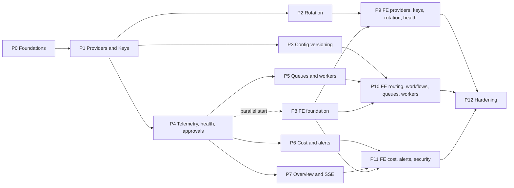

# 12 — Implementation Phases

> **Status:** APPROVED (self-verified; user plan approval 2026-07-02) · **Owner:** Solutions Architect · **Last updated:** 2026-07-02 · **Gated by:** /architecture-review, /security-audit

> Authoritative phase plan for the Waterfall Enrichment Engine Management Dashboard (MASTER SPEC §11
> is the summary; this doc is the contract implementation agents follow 1:1). Every phase is
> independently verifiable, lands as exactly one commit on branch `waterfall`, and must satisfy its
> acceptance criteria before the next phase starts. Governing invariant everywhere: **"the model
> proposes, a deterministic gate disposes."** Gates referenced by exact label: **G1 tenant
> isolation, G2 idempotency, G3 bounded execution, G4 cost ceiling, G5 provenance.**

## 1. Phasing principles

1. **Independently verifiable phases.** At the end of every phase, on a clean checkout of the phase
   commit: `go build ./...`, `go vet ./...`, `go test ./...` are green; `gofmt -l` is empty;
   `go test -race ./...` is green for every package containing goroutines, channels, `sync/atomic`,
   or shared mutable state (at minimum `internal/dash/rotation`, `internal/dash/realtime`,
   `internal/dash/overview`, `internal/dash/approvals`, `internal/dash/audit`); from P8 onward
   `npm --prefix web run build` is green. Integration suites (`-tags integration`, gated on
   `WATERFALL_PG_DSN` via the extended `scripts/run-rls-test.sh` harness) pass live against
   PostgreSQL 17.
2. **No phase skipping.** Phases execute in dependency order (§3). A later phase never begins while
   an earlier phase's acceptance criteria are unmet — partial credit does not exist. If a phase is
   blocked, the block is recorded in `docs/IMPLEMENTATION_PROGRESS.md` (slice-record format) and
   work stops on that chain, not on the doc.
3. **DEVIATION PROTOCOL (per ADR-0003, plan-first).** Any discovery during implementation that
   contradicts or extends a planning doc — a schema column that must change, an endpoint shape that
   cannot be honored, a state machine edge the code needs — is handled by updating the relevant doc
   FIRST (with its Open-items table amended and, where structural, an ADR), and only then writing
   the code. The doc diff and the code land in the same phase commit. Silent divergence between
   docs and code is a build-breaking defect, not a style issue.
4. **Acceptance criteria are executable.** Every criterion below names the command, test, or query
   that proves it. "Works" is never a criterion. Numeric performance criteria are design targets
   tagged UNVERIFIED until the named load test measures them (repo discipline; converted in P12
   per doc 13 §6).
5. **Migrations are append-only and phase-pinned.** New files follow
   `migrations/NNNN_snake_description.sql` (4-digit, no BEGIN/COMMIT — `internal/pgmigrate` wraps),
   with a top comment naming the doc section and gate each realizes. `pgmigrate` applies strictly in
   filename order, so migration numbers must land in phase order (see OI-IP-1 for the 0008/0009
   ordering decision).
6. **Gate tests travel with the phase.** The G1-style negative tests for every table a phase
   creates (doc 13 §3.1) are written in that phase, not deferred: a phase that adds a table without
   its RLS zero-rows test fails its own acceptance criteria.
7. **Every admin write in every phase carries the API conventions** from doc 04: `/v1/admin/*`
   paths, snake_case JSON, `Idempotency-Key` header required on writes, uniform error body
   `{"error":{"code":"snake_case","message":"..."}}`, cursor pagination with limit cap 200. These
   are wired once in P0 (`internal/dash/httpx`) and consumed thereafter — no phase re-implements
   them.

## 2. Phases P0–P12

| Phase | Name | Migrations | Primary packages | Exit gate (summary) | Size |
|---|---|---|---|---|---|
| P0 | Foundations | 0004 | dash/db, dash/httpx, dash/rbac, dash/security, dash/audit, cmd/dashboardd | RLS zero-rows on every new table; login+MFA+audit E2E | L |
| P1 | Providers + Keys backend | 0005 | dash/secrets, dash/providers, dash/keys | 1k-key CSV import → sealed envelopes, zero plaintext | XL |
| P2 | Key Rotation Engine | — | dash/rotation, provider egress integration | `-race` 10k selections/s (UNVERIFIED target); no over-lease @50 goroutines; engine E2E on rotated key | XL |
| P3 | Config versioning + routing + Waterfalls | 0006 | dash/configver, dash/routing, dash/workflows | Lifecycle + concurrent-publish conflict; dry-run zero egress | L |
| P4 | Telemetry + health + approvals | 0007, 0008, 0009 | dash/health, dash/approvals, aggregator + maintenance loops | Rollup refold identical; approval exactly-once | XL |
| P5 | Queues + workers | — | dash/queues, dash/workers, heartbeat client | Replay idempotent; drain converges; lost detection | M |
| P6 | Cost + alerts | — | dash/cost, dash/alerts | Overrun alert once per cooldown; group-bys match ledgers | L |
| P7 | Overview + SSE realtime | — | dash/overview, dash/realtime | 200-client soak ≤2s deltas (UNVERIFIED target); Last-Event-ID replay | M |
| P8 | Frontend foundation | — | web/ scaffold, design system, api client, sse manager, auth | `npm run build` green; login→overview E2E | L |
| P9 | FE providers/keys/rotation/health | — | web features: providers, keys, key-pools, rotation, health | Module screens bound to live endpoints; key grid @1k rows | XL |
| P10 | FE routing/workflows/queues/workers | — | web features: routing, workflows, queues, workers | Editors publish through approval; DLQ redrive E2E | XL |
| P11 | FE cost/alerts/security + polish | — | web features: cost, alerts, security, approvals, settings | Scripted no-orphan-UI check passes | L |
| P12 | Hardening | — | load/chaos/security harnesses, runbook drills, docs | UNVERIFIED→measured conversions; docs → ACCEPTED | L |

### P0 — Foundations

**Scope.** Identity, tenancy, session security, audit spine, and the shared plumbing every later
phase consumes. Implements ADR-0018 (dashboard session model), ADR-0020 (platform/tenant table
taxonomy: sentinel `platform` Tenant + `app.current_role` GUC), and the audit hash chain.

**Deliverables.**
- `migrations/0004_dash_identity_rbac.sql` — tenants (seed `platform` row, `kind='platform'`),
  users, mfa_recovery_codes, sessions, ip_allowlists, audit_log (yearly partitions),
  audit_chain_heads, api_access_log (monthly partitions), `app_current_role()` helper; FORCE RLS +
  policies exactly per doc 03 §3 registry.
- `internal/dash/db` — dual-GUC tx helper (`app.current_tenant` + `app.current_role` bound from the
  verified Principal, fail-closed on missing `tenant.FromContext`), cursor codec (opaque base64url
  JSON `{k,id}`), bounded-query guard (limit cap 200).
- `internal/dash/httpx` — session-or-JWT `Authenticator`, CSRF double-submit check, IP-allowlist
  middleware, `requireRole` RBAC guard, Idempotency-Key ledger for admin writes (reuse with a
  different body → 409), uniform `writeError`, `audited(action, kind, handler)` wrapper.
- `internal/dash/rbac` — role×action matrix as data + ABAC checks (tenant_id, region, plan tier).
- `internal/dash/security` — users CRUD, pbkdf2 login (`algo$iters$salt$dk`, SHA-256, 600k), TOTP
  enroll/verify (RFC 6238 over stdlib `crypto/hmac`), recovery codes, step-up verification,
  ip_allowlists CRUD, api_access_log async batch writer.
- `internal/dash/audit` — hash-chain `Append` (chain-head row lock), cursor reader, `Verify` walker
  endpoint + nightly job.
- `internal/dash/secrets` — AES-256-GCM envelope `Backend{Seal, Open, Rotate}` + `Secret` redacting
  wrapper. **Deviation D-1 (2026-07-04):** `secret_envelopes` and the secrets backend are pulled
  forward from P1 into P0 because P0's MFA enroll/verify (acceptance #3) must seal/open the
  `totp_seed` (doc 05 §5.2). `secret_envelopes` is therefore created in `0004` (alongside `users`,
  so `users_mfa_envelope_fk` is inline instead of the deferred `0005` add); `0005` no longer creates
  it. Only the P0-needed surface ships here (Seal/Open/Rotate, master keyring, keyed fingerprint);
  P1 reuses the backend for `provider_key` material and adds the KEK-rotation background loop.
- `cmd/dashboardd/main.go` skeleton — env config → pg pool → `pgmigrate.Apply` → feature Routes
  under `/v1/admin` → `/healthz` `/readyz` `/metrics` → session reaper loop; startup self-check
  refuses superuser/BYPASSRLS roles (extends Slice 20 pattern).
- Endpoints: Auth/session (8) + Users/RBAC (8) + audit-log/access-log reads per doc 04.

**Acceptance criteria.**
1. `go build/vet/test ./...` green; `go test -race ./internal/dash/...` green.
2. RLS zero-rows integration test covers all 8 new tables (doc 13 §3.1 pattern): Tenant B sees 0 of
   Tenant A's rows; cross-tenant INSERT blocked by WITH CHECK; sessions and mfa_recovery_codes
   return 0 rows even for role operator.
3. Login E2E (integration test over HTTP): POST `/v1/admin/auth/login` (pbkdf2) → POST
   `/v1/admin/auth/mfa/verify` (RFC 6238 vector-generated code) → GET `/v1/admin/auth/me` returns
   the Principal; each step appends an audit_log row and `GET /v1/admin/audit-log/verify` passes.
4. CSRF negative: mutating request without the CSRF header → 403
   `{"error":{"code":"csrf_required","message":"..."}}`.
5. Idempotency-Key replay with different body → 409.

**Dependencies.** None (first phase). **Size:** L.

### P1 — Providers + Keys backend

**Scope.** Provider catalog (modules 2), Provider Key inventory + Key Pools (module 3), envelope
encryption (ADR-0017), bulk import. Providers carry the ADR-0009 inclusion trichotomy
(ACTIVE-CANDIDATE / DEPRIORITIZED / EXCLUDED) distinct from runtime op_state.

**Deliverables.**
- `migrations/0005_dash_providers_keys.sql` — providers, key_pools, provider_keys,
  key_pool_members, key_budgets, key_import_batches, health_schedules, rotation_triggers
  (`secret_envelopes` already created in 0004 per Deviation D-1); Class P RLS + the two enumerated
  tenant read-projections (providers `visibility='tenant_readable'`; BYO
  `owner_tenant_id = app_current_tenant()`).
- `internal/dash/secrets` — `Backend{Seal, Open, Rotate}`; AES-256-GCM envelope implementation;
  `DASH_MASTER_KEY` keyring (master_key_id → 32-byte key); AAD = envelope id ‖ kind; keyed
  HMAC-SHA256 fingerprint with server-side pepper; `Secret` wrapper redacting
  `String()`/`MarshalJSON`.
- `internal/dash/providers` — CRUD + actions (enable/disable/pause/maintenance/test/health-check/
  refresh-metadata/sync-credits/benchmark/compare/duplicate/archive/delete[approval-gated once P4
  lands; audited inline until then per OI-IP-2]); `EffectiveAvailability` computed in exactly one
  function; test/benchmark reuse `provider.Call` (G3 bounded execution) with a resolved key.
- `internal/dash/keys` — metadata CRUD; bulk ops as async 202 jobs; import for csv/xlsx/json/paste
  (xlsx via `archive/zip` + `encoding/xml` reader ~200 lines; 25MB/50k-row caps; zip-ratio guard;
  formula-injection escaping); pool CRUD + membership + strategy endpoints.
- Endpoints: Providers (16) + Keys (18) per doc 04.

**Acceptance criteria.**
1. Import gate: POST `/v1/admin/providers/{id}/keys/import` with a 1,000-row CSV → 202 `{job_id}`;
   on completion `key_import_batches.succeeded = 1000`; `SELECT count(*) FROM provider_keys WHERE
   imported_batch_id = $1` = 1000; every row has a `secret_envelope_id`; **zero plaintext**: a
   scan of all non-envelope columns, the audit_log jsonb, and captured slog output finds no
   imported secret substring (test asserts against known plaintexts).
2. Envelope round-trip: `Seal → Open` returns the exact plaintext; NIST GCM vectors pass (doc 13
   §2); `Rotate` re-wraps only `dek_wrapped` and stamps `rotated_from`.
3. Duplicate import row → reported in `key_import_batches.errors` as `duplicate of key X` via
   fingerprint match, without decryption.
4. RLS: Class P tables return 0 rows for a customer Tenant; BYO keys with `owner_tenant_id` set are
   readable only by their owner; secret_envelopes returns 0 rows for every non-platform principal.
5. Zip-bomb fixture rejected 422; `=cmd`-style cell stored escaped.

**Dependencies.** P0. **Size:** XL.

### P2 — Key Rotation Engine

**Scope.** Module 4: selection strategies, batched quota leases, trigger state machine (pins KM-3),
engine integration via `rotation.LeaseResolver`. No new migration (key_budgets shipped in 0005).

**Deliverables.**
- `internal/dash/rotation` — per-pool in-memory `PoolState` rebuilt on config-epoch change;
  strategies: round_robin (atomic index), weighted (alias-method table), random (`math/rand/v2`),
  priority/failover/overflow (ordered walk + per-key `atomic.Bool`),
  least_used/lowest_latency/highest_success/credit_based (16-bucket approximate priority, re-banded
  by 1s background loop), ai_routing (Beta-Thompson posteriors via `internal/bandit`), region_based
  (map region → sub-ring + inner strategy).
- Batched leases: in-memory token bucket per key refilled by the guarded
  `UPDATE key_budgets ... WHERE day_leased + $2 <= daily_limit RETURNING` (batch ≤64); nightly
  reconcile rewrites `day_used` from usage_events ground truth (job lands with P4 telemetry; the
  reconcile function ships now with a unit test over synthetic rows).
- Trigger state machine mapping the 8-class error taxonomy: QUOTA→exhausted (auto re-enable probe),
  RATE_LIMIT sustained→rate_limited (cooldown), AUTH→auth_failed→disabled (manual re-enable only,
  + alert), expires_at→expired, rotating overlap (old+new valid; overlap 0 = compromise mode),
  archived terminal.
- `rotation.LeaseResolver{Lease(ctx, poolSelector) (Lease{KeyID, Secret, Done func(Outcome)},
  error)}`; `provider.AuthInjector` feature-detects it via type assertion on its `KeyResolver`
  (StaticKeyResolver untouched — backward compatible).
- Endpoints: Rotation (5) — selection-state debug, strategies, simulate, triggers per doc 04.

**Acceptance criteria.**
1. `go test -race ./internal/dash/rotation` green including a 50-goroutine lease storm against one
   key with `daily_limit` N: total granted leases ≤ N (no over-lease), asserted from key_budgets.
2. In-proc benchmark `go test -bench=PoolSelect ./internal/dash/rotation` sustains ≥10,000
   selections/s per pool (design target, UNVERIFIED until P12 records the measured number in doc
   13 §6).
3. Alias-method distribution: 1M draws over weights {70,20,10} within ±1% absolute of expected
   (doc 13 §2).
4. State-machine table test: every legal transition from doc 07's KM-3 stateDiagram accepted, every
   illegal transition rejected with a sentinel error; each transition appends audit + emits
   `key.status.changed`.
5. Engine E2E (integration): an Enrichment Job runs through `provider.Call` with a leased key;
   `Done(outcome)` attributes the call to the key_id; rotating the key mid-run (create successor →
   test → shift → archive) completes with zero AUTH failures.

**Dependencies.** P1. **Size:** XL.

### P3 — Config versioning + routing + Waterfalls

**Scope.** Modules 6+7: the shared draft→validated→published lifecycle, routing-policy and
Waterfall-workflow payloads (JSON Schemas in doc 07), dry-run simulator.

**Deliverables.**
- `migrations/0006_dash_config_versions.sql` — config_versions, config_active, config_epochs,
  workflow_index; UNIQUE(tenant_id, kind, scope_key, version); Class T RLS + enumerated operator
  SELECT policies per doc 03.
- `internal/dash/configver` — versions/validate/publish/rollback/clone/dry-run engine: validate
  pins `payload_hash` and stores `validation_report`; any draft edit reverts validated→draft;
  publish = one tx {re-check `status='validated'` + hash, UPDATE config_active pointer, epoch bump,
  audit row, NOTIFY}; rollback = publish of a prior version id; nothing destroyed.
- `internal/dash/routing` + `internal/dash/workflows` — thin services with kind-specific
  validators: graph acyclicity, Provider existence & non-EXCLUDED, threshold ranges, Cost Ceiling
  vs budget cross-check, tri-state inherit/off/on overrides with most-specific-wins scope
  precedence; validators reject payloads attempting to override G3 bounded execution or G4 cost
  ceiling.
- Dry-run: `router.Planner` against the draft payload with current reservation values — zero
  egress — returning Provider order + expected cost/Confidence.
- Endpoints: Routing+Workflows (16) per doc 04.

**Acceptance criteria.**
1. Lifecycle integration test: draft → validate (report stored, hash pinned) → edit (reverts to
   draft) → re-validate → publish → rollback to prior version; config_active always points at a
   published version; config_epochs bumped exactly once per publish.
2. Concurrent-publish conflict: two publishers race the same scope in parallel transactions;
   exactly one succeeds, the loser gets 409 `{"error":{"code":"version_conflict",...}}`;
   config_active is never observed pointing at a non-validated version (doc 13 §3.3).
3. Dry-run zero egress: run under a test `http.RoundTripper` that fails the test on any request;
   returns Provider order + expected cost.
4. Scope-precedence table test: all 8 precedence levels resolve most-specific-wins; `inherit` is
   transparent; resolver returns effective value + source scope.
5. Validator negative table: EXCLUDED Provider referenced → error; cycle → error; `max_cost_credits`
   above the Tenant budget → error naming both numbers.

**Dependencies.** P1 (Providers must exist for validators). **Size:** L.

### P4 — Telemetry + health + approvals

**Scope.** The telemetry backbone (usage_events + all rollups), Provider Health Center (module 5),
approvals engine, and the dashboardd background-loop chassis (leader-elected aggregator, partition
maintainer, approval expirer, health scheduler). Ships migrations 0007, 0008, and 0009 together so
`pgmigrate`'s strict filename ordering is never violated (OI-IP-1): 0008's tables (workers,
queue_defs, budgets) are schema-only until P5/P6 code consumes them.

**Deliverables.**
- `migrations/0007_dash_alerts_approvals.sql` — alert_channels, alert_rules, alert_events (+
  partial unique firing-dedupe index), alert_notifications (delivery outbox, doc 03 RF-5),
  approval_policies, approval_requests, approval_decisions.
- `migrations/0008_dash_workers_queues.sql` — workers, queue_defs, budgets.
- `migrations/0009_dash_telemetry.sql` — usage_events (daily partitions, 48h), provider_stats_1m/
  1h/1d, key_usage_1m/1h/1d, tenant_usage_1h/1d, cost_rollup_1d, queue_stats_1m/1h,
  worker_heartbeats, worker_stats_5m, provider_health_checks, provider_health_1d; all rollups
  additive `INSERT ... ON CONFLICT ... DO UPDATE SET x = x + EXCLUDED.x`; latency as 20 fixed
  log-spaced histogram buckets.
- Engine hot-path: ONE insert into usage_events per Provider call (enrichd side), attributed to
  key_id via the P2 `Done(Outcome)` path.
- Aggregator: leader elected via `pg_try_advisory_lock(hashtext('dash_aggregator'))`; folds
  usage_events → rollups; nightly key_budgets reconcile; partition maintainer (create ahead,
  detach per retention matrix doc 03 §4); dead-man's-switch heartbeats cross-checked between loops.
- `internal/dash/health` — jittered per-Provider scheduled checks (bounded concurrency), timeline
  (provider_health_1d fold from day one), uptime/P95/P99 from rollups, auto re-enable probes for
  exhausted/rate_limited keys.
- `internal/dash/approvals` — `Gate(ctx, actionKind, payload) (proceed, requestID)`; decision
  endpoints with X-MFA-Code step-up; four-eyes (approver ≠ requester, unconditional); quorum
  counted under `SELECT ... FOR UPDATE`; executor invokes the normal service method with
  Idempotency-Key = approval request id; expirer loop + in-tx expiry re-check. Wire
  provider delete/archive and key_bulk_delete through the Gate (closing OI-IP-2); config publish
  gating wires here too (P3's publish endpoint calls `Gate`).
- Endpoints: Health (6) + Security/audit approvals subset + `GET /v1/admin/change-history/{kind}/{id}`
  (doc 04 §2.12 — aggregates config_versions + approvals + audit rows, all available once P3/P4 land)
  per doc 04.

**Acceptance criteria.**
1. Rollup refold identical: fold 100k synthetic usage_events → snapshot rollups → truncate rollups
   → refold → byte-identical rows (proves ON CONFLICT idempotency; doc 13 §3.7).
2. Approval exactly-once: 10 concurrent final approvers on a request with `required_approvals=1`;
   exactly one execution occurs (executor side effect counted); replay of the execution with the
   same Idempotency-Key returns the stored result, not a second effect.
3. Four-eyes negative: requester approving own request → 403; approver without `approver_role` →
   403; missing/wrong X-MFA-Code → 401; expired request decision → 409.
4. Health timeline: 90 day-buckets served from provider_health_1d; hour granularity last 48h from
   raw checks; a Provider with zero checks renders `no_data`, not `up`.
5. Partition maintainer creates tomorrow's usage_events partition and detaches expired ones (live
   test with an injectable clock).

**Dependencies.** P1 (Providers/Keys for health + usage attribution); P2's `Done` path feeds
usage_events. **Size:** XL.

### P5 — Queues + workers

**Scope.** Modules 8+9: engine-agnostic read model over `job_outbox` (+ queue_stats), replay via
`pgoutbox` redrive, worker registry with desired-state convergence. Panels stay engine-agnostic
per open item QS-TMP-1.

**Deliverables.**
- `internal/dash/queues` — read model (store interfaces: QueueStats, JobLister, Redriver) over
  job_outbox + queue_stats_1m; DLQ list/detail; single redrive delegating to `pgoutbox.Redrive`
  (one guarded UPDATE, `WHERE dead=true`); filtered bulk replay as 202 job; queue_stats fold added
  to the aggregator (depth, running, scheduled, delayed, retry, failed, dead, enq, deq,
  oldest_age_s).
- `internal/dash/workers` — registry, heartbeat handler (10s upsert; response echoes
  desired_state), desired-state actions (restart/drain/pause/resume), scale intent,
  rolling-restart with max-unavailable, worker-lost detector loop (`lost` at heartbeat > 3
  intervals, with hysteresis before alerting).
- `internal/heartbeat` — tiny client for enrichd: heartbeat-upsert + converge on echoed
  desired_state; drain = stop claiming (skip `FOR UPDATE SKIP LOCKED` poll), finish
  `jobs_active` (in-flight Enrichment Jobs hold leased keys + reserved credits), then stop.
- Endpoints: Queues (8) + Workers (8) per doc 04. `job_outbox` is written only via pgoutbox APIs
  (one-owner-per-table).

**Acceptance criteria.**
1. Replay idempotent: redrive of a dead job → pending; second redrive of the same id → no-op
   (rowcount 0); re-execution double-charges nothing (G2 idempotency asserted via
   idempotency_ledger row count).
2. Drain converges: worker with 3 in-flight Enrichment Jobs receives `desired_state='draining'`;
   claims stop immediately; status reaches `stopped` only when `jobs_active=0`; no job is
   abandoned.
3. Lost detection: with an injectable clock, a worker whose heartbeats stop is marked `lost` after
   exactly 3 missed intervals; resumed heartbeats restore `running`; flapping within hysteresis
   emits no alert (doc 13 §3.6).
4. Filtered replay: `POST /v1/admin/queues/{name}/replay` with `{filter:{error_class:"TRANSIENT"}}`
   → 202 `{job_id}`; only matching dead rows redriven; progress events on SSE topic once P7 lands
   (until then, `GET /v1/admin/bulk-jobs/{id}` polls).
5. G1: Tenant A cannot list or redrive Tenant B's dead letters (0 rows / 404).

**Dependencies.** P4 (0008 schema, aggregator, queue_stats). **Size:** M.

### P6 — Cost + alerts

**Scope.** Modules 10+12: cost analytics over rollups, budgets (alerting only — doctrine: budgets
alert, G4 cost ceiling enforces), forecast, alert rules/channels/evaluator/notifiers.

**Deliverables.**
- `internal/dash/cost` — single whitelist group-by query builder over cost_rollup_1d /
  key_usage_1d / tenant_usage_1d (`group_by=provider|key|tenant|workflow|country`);
  cost-per-enrichment and cost-per-successful-result (numerator+denominator carried together);
  ROI per Field; forecast (least-squares linear + 7-day multiplicative seasonality from trailing
  28d; `insufficient_history` below 14 days; ~80% indicative band, UNVERIFIED until backtested);
  budgets CRUD; NDJSON export streaming the same query builder with keyset-paginated short
  transactions.
- `internal/dash/alerts` — 30s evaluator over rollups (closed metric vocabulary per doc 10; N-of-M
  bucket breach; resolve hysteresis 3 clean evaluations; cooldown renotify via `notified_at`;
  maintenance/paused suppression; per-rule `muted_until`); dedupe via partial unique index (one
  firing episode per rule+scope); notifications through the alert_notifications outbox
  (at-least-once with DB dedupe); notifiers: SMTP (`net/smtp`), Slack/Teams/Discord/webhook JSON
  POSTs via the SSRF-guarded egress client + HMAC signing; channel test-send exercising the
  identical notifier path; budget latching (actual once per UTC period; forecast re-arms);
  cost_anomaly metric (trailing 28d same-day-of-week median, dual threshold percent AND absolute
  floor, top-3 contributors).
- Endpoints: Cost (7) + Alerts (10) per doc 04.

**Acceptance criteria.**
1. Overrun alert once per cooldown: breach sustained across 5 evaluator cycles with
   `cooldown_s=120` produces exactly 1 notification, then 1 renotify after cooldown; resolve
   notifies once; ack suppresses renotify but not resolve (doc 13 §2 alerts evaluator unit tests).
2. Group-bys match ledgers: for seeded usage, `SUM(credits)` from `GET /v1/admin/cost/summary`
   equals the cost_ledger committed total for the same window, per Tenant and per Provider.
3. Forecast: <14 days history → `method="insufficient_history"` and forecast-budget alerts stay
   disarmed; ≥14 days → point/lower/upper arrays with `history_days`.
4. Firing-dedupe invariant: concurrent evaluator INSERTs for one (rule, scope) → exactly one open
   episode (partial unique index conflict path exercised).
5. Channel test-send: `POST /v1/admin/alerts/channels/{id}/test` against a local sink returns
   delivery status; an RFC1918 webhook target is refused by the SSRF guard (403,
   `{"error":{"code":"egress_blocked",...}}`).

**Dependencies.** P4 (rollups, alert tables, budgets schema). **Size:** L.

### P7 — Overview + SSE realtime

**Scope.** Module 1 + ADR-0019: 2s tile aggregator, snapshot GET + multiplexed SSE deltas,
Last-Event-ID replay, poller-based fan-out (LISTEN/NOTIFY extension timeboxed behind the same
`Source` interface).

**Deliverables.**
- `internal/dash/overview` — 2s tile aggregator (computed once on the leader, snapshot served from
  in-memory last tick), `GET /v1/admin/overview`, per-tile endpoints, tile↔endpoint map per doc 09.
- `internal/dash/realtime` — `Source{Subscribe(topics) (ch, cancel)}`; `poller.go` per-instance
  read-poller; `sse.go`: `text/event-stream` via `http.Flusher`, 15s heartbeat comment, `retry:`
  hint, 256-event ring buffer per topic, `id: <epochms>-<seq>`, explicit `reset` event on
  replay-gap; QoS split — `*.tick` coalescible, `*.changed`/`*.fired`/`*.progress` never dropped.
- `GET /v1/admin/streams?topics=<csv>` — ONE multiplexed EventSource per browser tab (topics:
  overview, provider, key, queue, worker, alert, import, approval — singular vocabulary per
  doc 04 §3.2 / OI-API-2); event schema
  `event: <domain>.<entity>.<verb>`, `data: {"v":1,"ts":...,"scope":{...},"payload":{...}}`.
- `internal/pg` NOTIFY extension (timeboxed): `A` NotificationResponse handling in
  `conn.go readMessage` + `Conn.Listen(channel)` + `WaitNotification(ctx)` on a dedicated
  non-pooled conn; poller ships first and remains the fallback.
- Endpoints: Overview/streams/search/meta (5) per doc 04 §2.13, including `GET /v1/admin/search`
  (cross-entity search consumed by P8's top bar) and `GET /v1/admin/meta/enums` (closed
  vocabularies consumed by P9's ProviderConfigForm and P11's alert rule editor).

**Acceptance criteria.**
1. Soak: 200 concurrent SSE clients for 10 minutes; p99 tick-to-receipt latency ≤ 2s; zero dropped
   `*.changed` events (design target, UNVERIFIED until P12 records the measurement; harness in
   doc 13 §6).
2. Last-Event-ID replay: client reconnects with an ID inside the ring → receives exactly the missed
   events in order; ID scrolled out of the ring → receives `reset` and refetches (overflow path
   tested, not just happy path).
3. Snapshot-then-delta: `GET /v1/admin/overview` snapshot + subsequent `overview.tiles.tick` events
   converge to the same values the tile endpoints report.
4. Heartbeat comment every 15s on an idle stream (asserted with a recording client).
5. Aggregator failover: killing the leader instance lets another acquire the advisory lock within
   one tick interval; SSE clients on surviving instances stay connected.

**Dependencies.** P4 (aggregator chassis, rollups); consumes P5/P6 topics as they exist. **Size:** M.

### P8 — Frontend foundation

**Scope.** ADR-0016 scope: Vite + React + TypeScript SPA scaffold, hand-rolled design system,
typed API client, SSE manager, auth flow. Dependency set locked to the ADR-0016 list — adding any
other package is a deviation (protocol §1.3).

**Deliverables.**
- `web/` scaffold: `app/` (router.tsx, providers.tsx, guards.tsx), `api/` (client.ts with CSRF
  header, error-envelope handling, Idempotency-Key generation; sse.ts topic→query-cache patcher;
  types.gen.ts generated from `docs/waterfall-dashboard/openapi-admin.yaml`), `design/`
  (tokens.css incl. dark mode; primitives: Button, Input, Select, Table, Modal, Drawer, Tabs,
  Toast, Badge, StatTile, EmptyState, ConfirmDialog, CodeBlock, TimeRangePicker), `lib/`
  (cursors.ts, format.ts, permissions.ts, status.ts, charts/).
- Auth feature: /login, /mfa (enroll + verify + recovery code), 401 interceptor → /login; role
  guards mirroring the server matrix (server remains authority).
- Overview shell: StatTile grid bound to `GET /v1/admin/overview` + `overview` SSE topic; SSE
  manager maintaining ONE EventSource with the union of mounted topics, Last-Event-ID resubscribe
  with jitter, 15s refetch fallback, live/reconnecting/degraded connection indicator.
- `npm run build` emits `web/dist`, served statically by dashboardd; vitest unit setup; Playwright
  harness.

**Acceptance criteria.**
1. `npm --prefix web run build` green; bundle respects doc 08 perf budgets; `npm test` (vitest)
   green.
2. Playwright E2E: login → MFA → overview renders live tiles (requires P7 deployed; the E2E is the
   phase exit and runs against a dashboardd with P0+P7 merged).
3. API client: every mutation carries Idempotency-Key + CSRF header; error envelope surfaces
   `error.code` in toasts (asserted in vitest against a mock server).
4. SSE manager: topic-set change reconnects with new query string + Last-Event-ID; `reset` event
   triggers snapshot refetch (vitest with a scripted EventSource stub).
5. Dark mode: all primitives render from tokens in both themes (visual smoke via Playwright
   screenshot diff).

**Dependencies.** P0 (auth endpoints); may start in parallel from P4; acceptance E2E needs P7.
**Size:** L.

### P9 — FE providers/keys/rotation/health

**Scope.** Modules 2, 3, 4, 5 screens: /providers, /providers/:id (tabs
config·keys·health·stats·history), /providers/compare, /keys, /keys/import, /key-pools[/:id],
/rotation, /health[/:providerId].

**Deliverables.** Provider catalog table with dual badge (lifecycle chip + computed effective
availability — never derived client-side); generic ProviderConfigForm driven by
`GET /v1/admin/meta/enums`; virtualized key grid (react-table + react-virtual, server-side
sort/filter over cursors, aria-rowcount/rowindex from server totals); select-all-matching-filter
bulk bar → 202 job → shared progress drawer on `import` SSE topic; import wizard (csv/xlsx/json/
paste with per-row error report); pool editor + strategy params; rotation trigger config +
selection-state debug view + simulate panel; health timeline heatmap (90 day-segments SVG) +
P95/P99 overlay with bounded TimeRangePicker.

**Acceptance criteria.**
1. Key grid renders 1,000+ rows via virtualization with server-side sort/filter (Playwright:
   import 1000-key CSV → grid shows 1000, envelopes sealed — doc 13 §5 flow).
2. Bulk bar escalation "all N on page" → "all M matching filter" sends the filter predicate, not
   ids; destructive ops surface the 202 `{approval_request_id}` banner.
3. Every panel maps to a live endpoint (no orphan UI — extends docs/17 rule); scripted check green
   for these features.
4. Status rendering is color+icon+label from `lib/status.ts` for all 9 key statuses, 4 op_states,
   and the inclusion trichotomy (never conflated visually).

**Dependencies.** P8 + P1/P2 backend (health tabs need P4). **Size:** XL.

### P10 — FE routing/workflows/queues/workers

**Scope.** Modules 6, 7, 8, 9 screens: /routing, /routing/:scope/edit, /workflows[/:scope[/edit]],
/queues[/:name], /dead-letters, /workers.

**Deliverables.** dnd-kit routing editor (client mirrors server validation; Publish disabled until
server validate passes; draft-vs-active diff; 202-approval banner; tri-state inherit/off/on
controls showing resolved effective value + source scope); Waterfall builder (stepped canvas
entry→parallel→sequential→fallback, node inspector, dry-run panel with Provider order + expected
cost/Confidence); version rail with rollback = publish prior version; queue dashboards (state
vector, enq/deq sparklines, oldest-age lead tile); dead-letter drawer (payload CodeBlock,
last_error, attempts, redrive with G2 idempotency copy); workers grid (status vs desired_state,
converging badge, drain/restart split, rolling-restart dialog with max-unavailable).

**Acceptance criteria.**
1. Playwright: routing draft → validate → publish with approval → rollback (doc 13 §5 flow) passes.
2. Playwright: DLQ redrive flow — inspect payload, redrive, job reaches succeeded.
3. Dry-run panel proves zero egress (backend guarantee) and renders provenance of inherited values.
4. Publish button provably gated on server validation (attempt to publish an invalidated draft →
   409 surfaced).
5. No-orphan-UI script green for these features.

**Dependencies.** P8 + P3/P5 backend. **Size:** XL.

### P11 — FE cost/alerts/security + polish

**Scope.** Modules 10, 11, 12 screens + global polish: /cost, /budgets, /alerts[/rules/:id],
/security/users, /security/audit, /security/sessions, /approvals, /settings.

**Deliverables.** Cost page (StatTile row incl. credits/successful-result; stacked series by
active group_by; drill-down breakdown table; forecast band labeled modeled/indicative; WYSIWYG
NDJSON export button carrying current filters); budgets with progress meters + alert_pct tick
marks; alert rule editor (closed-vocabulary pickers, never a query box) + channel management with
test-send + episode list with ack; security screens (users CRUD, sessions with revoke, audit-log
browser + verify status, ip-allowlists); approvals inbox (diff + validation_report + dry-run
artifacts, approve/reject with X-MFA-Code step-up prompt); accessibility pass (WCAG: color+label
statuses, keyboard nav, aria on virtualized grids); empty/loading/error conventions everywhere.

**Acceptance criteria.**
1. Scripted no-orphan-UI check across ALL routes: every rendered panel maps to a documented
   `/v1/admin` endpoint (script walks the route tree and asserts against openapi-admin.yaml);
   green is the phase exit.
2. Playwright: alert rule fire→notify→ack flow (doc 13 §5).
3. Playwright RBAC deny-matrix spot checks: tenant_user cannot see admin actions; tenant_admin
   cannot see operator cross-tenant views (server 403s render correctly).
4. Cost figures carry the modeled badge; export downloads NDJSON matching on-screen filters.

**Dependencies.** P8 + P4/P6 backend (P7 for live tiles). **Size:** L.

### P12 — Hardening

**Scope.** Convert UNVERIFIED design targets to measured numbers, chaos drills, security pass,
runbook validation, documentation closure.

**Deliverables.**
- Load harnesses + recorded results (doc 13 §6): key-selection benchmark, SSE 200-client soak,
  50k-row import, 1M-event rollup fold, API p95 under target rps.
- Chaos drills executed + recorded (doc 13 §7): aggregator-leader kill, publish-crash consistency,
  PG restart reconnection, poison import row.
- Security pass (doc 13 §8): secret-scan incl. test fixtures, CSRF/session-fixation/IP-allowlist
  negative suites, formula-injection round-trip, full RLS fuzz (release blocker).
- Runbook validation: every doc 14 runbook's Diagnosis + Verification commands executed against a
  staging deployment; broken steps fixed in doc 14 first (deviation protocol).
- Docs 00–14 flipped DRAFT → ACCEPTED; UNVERIFIED register in doc 00 updated with measured values;
  `docs/IMPLEMENTATION_PROGRESS.md` slice records + CHANGELOG updated; §5 Self-Verification Record
  below filled with verdicts + evidence.

**Acceptance criteria.**
1. Every load-test row in doc 13 §6 has a measured value; targets met or the miss is recorded with
   a remediation item — no silent UNVERIFIED left in shipped docs.
2. All chaos drills pass their invariants (no double-fold, config_active consistent, reconnect +
   resubscribe, poison row isolated).
3. CI release blockers green: RLS zero-rows suite (all 45 tables), G2 replay, secret scan,
   TestAdminOpenAPIParity, Playwright suite.
4. §5 table below fully populated (no PENDING rows).

**Dependencies.** P9, P10, P11 (and transitively everything). **Size:** L.

## 3. Dependency graph

Reading: P0→P1→P2 is the strict backbone; P3 and P4 both require only P1; P5–P7 require P4; P8 may
start in parallel once P4 is underway (its acceptance E2E needs P7 merged); each frontend module
phase requires P8 plus its backend phase; P12 is last and gates release.

## 4. Commit protocol

- **One commit per phase**, on branch `waterfall`. No intermediate commits on the mainline; work
  may be staged locally but lands atomically so every mainline commit is a green, verifiable
  phase boundary.
- **Message style:** `feat(dash): <phase id> <phase name — one-line summary>`, e.g.
  `feat(dash): P1 providers and keys backend — catalog, envelope secrets, 1k-key import`.
  Body lists deliverables, the acceptance-criteria evidence (test names + results), and any
  deviation-protocol doc updates included. Migrations, code, tests, and doc diffs for the phase
  travel in the same commit.
- **Pre-commit gate:** `go build ./... && go vet ./... && go test ./...` plus `go test -race` on
  concurrent packages plus (P8+) `npm --prefix web run build`; integration suites run against live
  PG where the phase's criteria demand it. A phase commit that would land red is not made.
- **Progress record:** each phase appends a slice-format record to
  `docs/IMPLEMENTATION_PROGRESS.md` (module table: Code / Property / Test / Done), same discipline
  as Slices 01–20.
- **Rollback:** phases are revertable as single commits; because migrations are expand-first
  (doc 03 playbook), reverting a phase commit never requires a destructive down-migration.

## 5. Self-Verification Record

> REQUIRED FINAL SECTION — scaffold created now; verdicts filled during Phase 3 (plan
> self-verification) and finalized in P12. Categories: Hard Gate / Principle / Acceptance.

> **Verified 2026-07-04 by adversarial review: 13 checks across 3 rounds; 21 round-1 + 17
> round-2 violations found and fixed; final result recorded below.**

| Check | Category | Verdict | Evidence |
|---|---|---|---|
| Tenant isolation — every new table FORCE RLS, dual-GUC, zero-rows proven | Hard Gate | PASS | Doc 03 §3 registers all 48 tables (25 Class T + 23 Class P) with ENABLE+FORCE RLS and explicit policies, pinned by a CI diff against pg_policies, operator cross-tenant reach limited to ten enumerated SELECT-only policies each requiring an audit_log row and no BYPASSRLS role except the job_outbox relay. Doc 05 §1.3 pins the dual-GUC per-transaction binding fail-closed and doc 04 pins 404-on-cross-tenant; the lone gap (mfa_used_steps not yet absorbed into doc 03 DDL, tracked as SEC-1) is non-blocking because its RLS is specified in doc 05 and the registry-vs-pg_policies diff fails CI on any unregistered table. |
| Bounded queries — cursor pagination, limit cap 200, windowed telemetry reads only | Hard Gate | PASS | Doc 04 §1.4 pins cursor pagination (default 50, hard cap 200, limit>200 → 400) bound to every list endpoint via the §2 preamble, backed by keyset indexes in doc 03 §5 and client-side virtualization for grids over 100 rows, while §1.8 bounds every time-series read by the rollup-retention matrix (~500-bucket cap, 400 window_out_of_range). API telemetry reads serve exclusively from rollups (the API cannot scan raw usage_events) and the sole contracted export streams keyset-batched NDJSON; three minor consistency gaps are non-blocking. |
| Pool safety — no over-lease under concurrency; batched lease bound ≤64/key on crash | Hard Gate | PASS | Every external call class carries an explicit timeout: provider traffic via G3-bounded provider.Call (per-provider CallPolicy timeout_ms, no retries), alert notifiers with 5s HTTP/SMTP deadlines + resolve-then-dial SSRF denial + max-8 backoff, and SSE with a per-instance connection cap (503 sse_saturated), 15s heartbeat, and 10s write deadline. Pool hygiene is transaction-local dual GUCs confined to the db tx helper with a named reused-connection test, and background loops are advisory-lock singletons with bounded concurrency; three minor cross-doc gaps are non-blocking. |
| Online-safe migrations — expand→migrate→contract; no BEGIN/COMMIT in files; runner-ordered | Hard Gate | PASS | Doc 03 §7 holds the binding expand→migrate→contract playbook (10 rules, 7-question merge-blocking checklist) with a worked 0010/0011/0012 example, exempts pre-traffic migrations 0004–0009 by construction, and records the pgmigrate-wraps-in-tx vs CREATE INDEX CONCURRENTLY conflict as OI-DB-1 (OI-DB-7 generalizes it to NOT VALID→VALIDATE). Partition create/detach is runtime-only (never in migrations) and doc 11 §6 pins blue-green N−1 backward compatibility as merge-blocking checklist question 1, so rollback works by construction because contract steps defer until fleet N−1 retires. |
| Cache correctness — every cache has declared trigger, TTL, stale-read consequence (doc 02 §5) | Hard Gate | PASS | Doc 02 §5 rows 1-13 each carry trigger + TTL + stale-read consequence (rows 1-9/12-13 real caches, row 10 deliberate no-cache, row 11 not-a-cache), the singular `key_pool` literal is identical and pinned across docs 02/03/04/07 with the config_epochs CHECK closing the vocabulary, and the queue-sampler follower serving path is in the inventory (rows 5-6). Epoch invalidation is consistent everywhere (same-tx bump, NOTIFY + 1s poll fallback, ≤1s convergence, single configver-owned BumpEpoch with one enumerated second writer internal/dash/keys key_pool-only), with doc 07 §10 named as the semantic authority. |
| Modular — feature folders `internal/dash/<feature>/` with consumer-side interfaces | Principle | PASS | Doc 02 §2.1 mandates every feature ship types/service/store/pgstore/http.go with Routes(mux, mw) plus tests, doc 00's module map binds all 12 modules to named internal/dash packages, and doc 08 §2 mirrors the five-file convention on the frontend. Doc 02 §6 restricts shared code to documented seams (dash/db, httpx, secrets, rbac, realtime) with the enforceable rule "no feature imports another feature's storage; no seam imports a feature," cross-feature edges being interface-only with compile-time assertions. |
| Plugin adapters — new Provider = one adapter file (Build/Decode closures for HTTP vendors, full Adapter for bespoke protocols) + one providers row, zero core-engine changes; provider config changes propagate by catalog epoch without deploy or restart (doc 02 §2.2, ARCH-4) | Principle | PASS | The contract is stated identically across docs 01/02/12: adding a Provider is one in-repo adapter file (Build/Decode closures or a full Adapter) + one providers row with zero core-engine changes, init() self-registration into a package registry (no central file edited), and config changes propagating via the provider_catalog epoch bump without deploy or restart — never "zero code change." A grep across all 15 docs + ADRs found only explicit retractions of the old over-claim, and doc 02's ground-truth claims verify against internal/provider/httpadapter.go (nil-Decode → ClassBadRequest, nil-Build → bare GET to BaseURL). |
| Config-as-versioned-data — config_versions/config_active/config_epochs single lifecycle | Principle | PASS | Doc 03 §9.3 (mirrored verbatim in 07 §6 and 02 §4.1) is the authority: publish/rollback share one tx that bootstraps the config_active pointer via ON CONFLICT DO NOTHING then SELECT … FOR UPDATE the pointer row as the single serialization point, returning 409 version_conflict on expected_active_version_id mismatch. The concurrent-publish race is traced for all interleavings (exactly-one-winner + 409-loser), the pin set {version_id, payload_hash, expected_active_version_id} is persisted into approval payloads, and the job config pin set is embedded in the immutable job_outbox payload so replay/redrive read it back rather than a mutable column. |
| API-first — SPA consumes only /v1/admin; OpenAPI parity test; no orphan UI | Principle | PASS | Doc 09's §14 map (40 rows) plus the 19-tile overview map were cross-checked action-by-action against doc 04 §2.1–2.13 — every endpoint, filter param, and sort field exists, and the two non-API surfaces (client-side keys export, non-navigating system_health tile) consume only already-fetched documented data. All 8 SSE topics and 9 event names appear verbatim in doc 04 §3.2, and doc 02 §2.4 pins the plain-consumer posture (the browser is not special); two minor gaps (bulk `op` enum not closed, one 409 code label mismatch) are non-blocking. |
| Horizontal scale — stateless handlers, single advisory-lock leader, O(1) selection | Principle | PASS | Bulk jobs survive instance death via the bulk_jobs lease/claim/janitor model (claimed_by, lease_expires_at, one-in-flight partial-unique guard, named dash_bulk_janitor under its own advisory lock), deploy drain re-queues in-flight jobs from the last committed offset, and the rolling-restart orchestrator runs as an ordinary crash-safe bulk job resuming from durable results. Followers serve queue stats from the persisted self_monitor snapshot row (no leader memory), replay token-bucket scoping is stated as single-instance-correct with an honest fan-out caveat, and the kill-mid-import test L7 exists in doc 11 §4.3. |
| Realtime no-polling — SSE fan-out + server-side aggregation; DB load independent of client count | Principle | PASS | ADR-0019 / doc 04 §3.1 mandate ONE multiplexed EventSource per tab (GET /streams?topics=csv) with a binding QoS split (ticks coalesce; changed/fired/resolved/progress never dropped), Last-Event-ID replay against a 256-event per-topic ring with reset-on-overflow, and a scripted P11 grep forbidding component polling except the single central 15s SSE-disconnect refetch. The leader-elected aggregator makes DB reads O(instances) not O(clients), and fan-out saturation is self-monitored (dash_sse_clients / dash_sse_dropped_total) with a concrete widen-tick degradation lever (2s→10s). |
| Reversible — pointer-flip publish, rollback = prior version, soft-archive, append-only audit | Principle | PASS | Approval gating is fail-closed — a built-in default policy (required_approvals ≥ 1) gates all six action_kinds when no approval_policies row exists, with doc 05 §9.1 superseding the old inline-write prose and doc 04 §5.1/§2.7 agreeing (always 202 on first submission, no ungated inline path). Key bulk delete is explicit about destroyed (provider_keys + secret_envelopes, after an audit before-snapshot) vs retained (key_usage rollups keep key_id), RB-6 now states there is no delete/purge path by design, and alert_ruleset versioning deferral is recorded as OI-API-6. |
| 15 docs exist and are mutually consistent with MASTER SPEC | Acceptance | PASS | All 15 docs 00–14 exist in docs/waterfall-dashboard, each carrying the line-3 Status/Owner/Last-updated/Gated-by header and a closing "## Open items" table with an |ID|Item|Status|Owner| body (doc 00 records "none — all resolved"). Wireframes are real ASCII layouts with normative panel→endpoint maps rather than placeholders, and the set is mutually consistent with MASTER SPEC. |
| Every module has doc + API contract + wireframe | Acceptance | PASS | The 12×3 coverage matrix holds: every module maps to an owning section, a doc 04 API group, and a doc 09 wireframe (e.g. Provider Management → 00 §2.1 M2 / 04 §2.3 / 09 §2.1; Queue Management → 06 §§1–3 / 04 §2.8 / 09 §8.1). The only nit is modules 6 and 7 sharing doc 04 §2.7 with distinct /routing and /workflows path kinds, which still satisfies ≥1 API contract group per module — non-blocking. |
| Implementation phases follow the docs (deviation protocol honored) | Acceptance | PASS | Doc 12 gives every phase P0–P12 numbered executable acceptance criteria naming the proving command/test/query, a §3 mermaid dependency graph, the §1.3 DEVIATION PROTOCOL (doc updated first, doc diff + code in one phase commit, silent divergence build-breaking), and this §5 Self-Verification Record. ADRs 0016–0020 are template-compliant (3/4/3/4/4 options considered respectively) and indexed in adr/README.md lines 28–32. |

## Open items

| ID | Item | Status | Owner |
|---|---|---|---|
| OI-IP-1 | Migration ordering: MASTER SPEC §11 lists 0008 under P5 and 0009 under P4, but `pgmigrate` applies strictly in filename order — P4 therefore ships 0007+0008+0009 together (0008 schema-only until P5); recorded as the authoritative phasing decision per spec preamble | DECISION RECORDED | Solutions Architect |
| OI-IP-2 | Approval gating of P1 destructive actions (provider delete/archive, key bulk delete) is audited-inline until the approvals engine lands in P4, then wired through `approvals.Gate` in the P4 commit | DECISION RECORDED | Solutions Architect |
| OI-IP-3 | P8 acceptance E2E (login→overview) requires P7 merged although P8 may start in parallel from P4 — sequencing note carried in §2 P8 and §3 | DECISION RECORDED | Solutions Architect |
| OI-IP-4 | All numeric performance criteria (10k selections/s, ≤2s SSE deltas, import/fold/API thresholds) are UNVERIFIED design targets until P12 records measurements via doc 13 §6 | OPEN (closes in P12) | Senior Backend Engineer |
| OI-KEYS-1 | P1 bulk-op + key-import execution is in-process (goroutine tracked by `key_import_batches`); it migrates to the durable `bulk_jobs` lease/janitor model in P5. `op=delete` executes inline-audited (approval-gated in P4 per OI-IP-2). | OPEN (closes in P5) | Senior Backend Engineer |
| OI-KEYS-2 | Provider/key `test`/`health-check`/`refresh-credits` stamp timestamps + audit intent in P1; the live `provider.Call` / credit-sync egress (via the resolved key) lands in P2 with the rotation engine. | RESOLVED (P2): the `rotation.Engine` (a `provider.LeaseResolver`) is wired into `providers.Deps.Resolver` in `cmd/dashboardd`, so provider `test`/`health-check`/`benchmark`/`sync-credits` probes run a live G3-bounded `provider.Call` with a key resolved + leased through the rotation engine (the egress `AuthInjector` feature-detects `LeaseResolver` and reports each Outcome via `Lease.Done`). | Senior Backend Engineer |
| OI-KEYS-3 | `GET /keys/{id}/usage` returns live `provider_keys` counters + an empty time-series in P1; the `key_usage_1m/1h/1d` rollups that populate the series arrive with P4 telemetry. | OPEN (closes in P4) | Senior Backend Engineer |
| OI-KEYS-4 | Key-pool strategy/membership writes persist + audit in P1; the doc 07 §10 `key_pool` config-epoch bump (`configver.BumpEpoch`) that invalidates in-memory `PoolState` is deferred to P3 (config versioning) — until then rotation reads the row directly. In P2 `rotation.Engine.Invalidate(selector)` is the documented hook the P3 epoch watcher will call; P2 stands in with rebuild-on-demand + a periodic refresh loop. | OPEN (closes in P3) | Senior Backend Engineer |
| OI-KEYS-5 | P2 rotation deviations from doc 07 §8, recorded per the deviation protocol: (a) `overflow` performs the ordered walk with per-key token-bucket gating but spills to the next key at full quota exhaustion, not at the fractional `spill_threshold_pct` (default 80%) — fractional-threshold spill is a refinement deferred to P12 tuning; (b) `rate_limited`/`exhausted` cooldown/recovery-probe auto-recovery (KM-3 `rate_limited→active`, `exhausted→probing→active`) is scheduled by P2 (the parked transition fires) but executed by P4's health scheduler ("auto re-enable probes for exhausted/rate_limited keys"); (c) `region_based` inner strategy supports round_robin/random/priority/failover (the banded/weighted inner variants fold to round_robin). | DECISION RECORDED | Senior Backend Engineer |
| OI-SEC-9 | Step-up (`X-MFA-Code`) on keys create/import/rotate/bulk verifies TOTP against the caller's sealed seed (`cmd/dashboardd.totpStepUp`); accepting a one-time recovery code on the step-up path (as login-verify does) is deferred. | OPEN | Senior Backend Engineer |
| OI-M2-1 | `providers_catalog` (migration 0005) omits `op_state`, so a tenant-scope `effective_available` is computed from the inclusion-status conjunct only (op_state assumed enabled); operators get the full status×op_state conjunction. `stats` is an empty-series stub until observability (P4); `benchmark` runs inline (no async job in P1); `List` keyset-orders on `id`. | DECISION RECORDED | Enterprise UX Architect |
