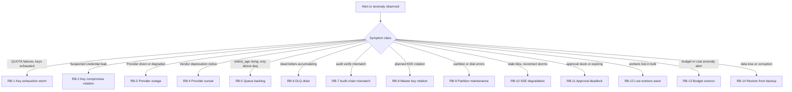

# 14 — Runbooks

> **Status:** ACCEPTED · **Owner:** GTM Infrastructure Engineer · **Last updated:** 2026-07-06 · **Gated by:** /architecture-review, /security-audit

> Operational procedures for the Waterfall Enrichment Engine Management Dashboard. Every runbook
> follows Symptoms → Diagnosis → Actions → Verification → Prevention, with exact endpoints
> (`/v1/admin/*`, `Idempotency-Key` required on every write, uniform error body
> `{"error":{"code","message"}}`), SQL (run as operator through the dual-GUC tx path — never as
> superuser), UI paths, and metric names (catalog: doc 10). Doctrine that recurs below: **budgets
> alert, G4 cost ceiling enforces**; availability is computed, never stored; nothing is destroyed
> (archive + pointer flips); every privileged action lands in the hash-chained audit log. Gates by
> exact label: G1 tenant isolation, G2 idempotency, G3 bounded execution, G4 cost ceiling,
> G5 provenance. All runbook Diagnosis/Verification steps are executed as drills in phase P12
> (doc 12) — a runbook that has not been drilled is not DONE.

Triage index — match the loudest symptom first:

---

## RB-1 — Key exhaustion (credits) storm

**Symptoms.** Alert episodes on `provider.error_rate` dominated by QUOTA; SSE
`key.status.changed` bursts to `exhausted`; Providers list shows rising `fail_quota`; Enrichment
Job success rate dips on affected Fields; Key Pool selection-state shows shrinking available set.

**Diagnosis.**
1. `GET /v1/admin/providers/{id}/stats?res=1m&from=<now-1h>&to=<now>` — confirm `fail_quota`
   concentration and onset time.
2. `GET /v1/admin/keys?provider_id={id}&status=exhausted&limit=200` (cursor-paginate) — count and
   spread (one key, one rotation_group, or the whole pool?).
3. `GET /v1/admin/key-pools/{poolId}/selection-state` — remaining available keys per strategy view.
4. SQL blast radius:
   `SELECT status, count(*) FROM provider_keys WHERE provider_id = $1 GROUP BY status;`
   `SELECT k.id, b.day_used, b.day_leased, k.daily_limit FROM key_budgets b JOIN provider_keys k ON k.id = b.key_id WHERE k.provider_id = $1 ORDER BY b.day_used DESC LIMIT 20;`
5. Distinguish causes: self-imposed `daily_limit` reached (day_used ≈ daily_limit) vs vendor
   credits truly exhausted (`credits_remaining` ≈ 0, confirmed by sync).

**Actions.**
- Vendor-truth refresh: `POST /v1/admin/providers/{id}/sync-credits` and per-key
  `POST /v1/admin/keys/{id}/refresh-credits` (both with `Idempotency-Key`).
- Self-imposed limit and vendor headroom exists: raise it —
  `PATCH /v1/admin/keys/{id}` body `{"daily_limit": <new>}` (audited).
- Vendor credits exhausted: import replacement Provider Keys —
  `POST /v1/admin/providers/{id}/keys/import` (202 `{job_id}`; progress drawer at /keys/import),
  then add to the pool: `PUT /v1/admin/key-pools/{poolId}/members`.
- Storm spans the whole Provider: shift the Waterfall away from it — draft a routing change
  demoting the Provider / promoting failover order, `POST .../versions/{id}/validate`, dry-run,
  `POST .../versions/{id}/publish` (202 `{approval_request_id}` if gated; see RB-11 if quorum
  stalls). Optionally `POST /v1/admin/providers/{id}/pause` to stop selection immediately.
- Do NOT manually flip key rows in SQL — the KM-3 state machine (doc 07) auto-recovers
  exhausted keys via health probes when credits return; manual edits desynchronize PoolState.

**Verification.** `fail_quota` in `provider_stats_1m` returns to baseline;
`GET /v1/admin/keys?provider_id={id}&status=active` count restored (auto re-enable probes return
exhausted keys to `active` after recovery); alert episode resolves (resolve notification arrives
~90s after real recovery — evaluator hysteresis, doc 10); overview tile for the Provider green.

**Prevention.** Budgets with early `alert_pct` steps (50/80/90) per Provider scope; `credit_sync`
mode `endpoint` with a sane `interval_s` so `credits_remaining` is measured, not modeled;
`credit_based` rotation strategy for pools with asymmetric credit balances; keep ≥20% key
headroom per pool (capacity model, doc 11).

---

## RB-2 — Key compromise emergency rotation (with overlap)

**Symptoms.** Vendor breach notice; anomalous usage on one key (`key_usage_1m` spike at odd
hours); `cost_anomaly` alert naming the key's Provider; keys flipping `auth_failed` after the
vendor revoked them server-side.

**Diagnosis.**
1. `GET /v1/admin/keys/{id}/usage` — usage shape vs the key's history (volume, timing).
2. `GET /v1/admin/audit-log?object_kind=provider_key&object_id={id}` — who touched it, when.
3. Blast radius by import lineage:
   `SELECT id, label, status FROM provider_keys WHERE imported_batch_id = (SELECT imported_batch_id FROM provider_keys WHERE id = $1);`
4. Confirm the secret was never revealable: there is no reveal endpoint by design (zero-reveal,
   doc 05) — compromise vectors are the vendor side, import-time capture, or host memory
   (ADR-0017 custody note), not the dashboard read path.

**Actions.**
1. **Compromise mode = zero overlap.** `POST /v1/admin/keys/{id}/rotate` body
   `{"overlap_s": 0}` — creates the successor row (new envelope, `rotated_from` lineage, pool
   memberships copied) and immediately archives the old key (Stripe expire-now analog; normal
   planned rotation uses the default 24h overlap instead).
2. Revoke the old credential **at the vendor console** — Provider Keys are vendor-issued; our
   archive stops our use, only the vendor kills the credential itself.
3. Whole batch poisoned: `POST /v1/admin/keys/bulk` body
   `{"filter":{"imported_batch_id":"<uuid>"},"op":"disable"}` → 202 `{job_id}`; follow with
   import of replacements; bulk delete (if chosen) is approval-gated → 202
   `{approval_request_id}`.
4. Prove the successor: `POST /v1/admin/keys/{newId}/test` (real call path through
   `provider.Call`, G3-bounded).
5. If exploitation is suspected inside our infra: revoke dashboard sessions
   (`GET /v1/admin/auth/sessions` → `DELETE /v1/admin/auth/sessions/{id}`) and open a security
   incident (doc 05 threat model).

**Verification.** Old key `status='archived'` and its `key_usage_1m` flatlines at zero from the
archive minute; successor serving in `GET /v1/admin/key-pools/{id}/selection-state`; zero AUTH
errors on the Provider in `provider_stats_1m`; audit chain shows rotate + archive + test entries
(`GET /v1/admin/audit-log/verify` green).

**Prevention.** Planned rotation cadence with the default 24h overlap (KM-3 `rotating` state —
old+new valid during cutover, zero-downtime); `auth_failed` auto-transitions to `disabled` with an
alert (manual re-enable only); keyed-fingerprint dedupe at import catches re-imported leaked keys;
`imported_batch_id` provenance makes batch recall a one-filter operation.

---

## RB-3 — Provider outage (pause + failover routing publish)

**Symptoms.** `alert.event.fired` for `provider.error_rate` / `provider.health_check_stale`;
breaker open (`fail_provider_down` dominant class); health timeline segments red; Waterfall
completion rate drops for Fields the Provider covers.

**Diagnosis.**
1. `GET /v1/admin/health/providers` — which Providers, which regions (`GET /v1/admin/health/regional`).
2. `GET /v1/admin/providers/{id}/health` and `GET /v1/admin/health/providers/{id}/timeline` —
   onset, error class mix, is it degraded or hard-down.
3. `POST /v1/admin/health/checks/run` body `{"provider_id":"..."}` — on-demand confirmation.
4. Check the vendor status page; check `correlation_group` — siblings sharing infrastructure may
   be about to follow (doc 07).

**Actions.**
1. Stop selection immediately: `POST /v1/admin/providers/{id}/pause` (`Idempotency-Key`;
   op_state=paused — inclusion status untouched per ADR-0009). Pausing also suppresses that
   scope's alert noise (maintenance/paused silencing, doc 10).
2. Publish failover routing: UI /routing/:scope/edit (or `POST .../routing/.../versions`) — demote
   the Provider, promote the failover order; `POST .../validate`;
   `POST .../versions/{id}/dry-run` (zero egress — shows the new Provider order + expected
   cost/Confidence); `POST .../versions/{id}/publish` → 202 `{approval_request_id}` where gated;
   approver decides at /approvals with `X-MFA-Code`.
3. If the outage victimized in-flight jobs into the DLQ, queue RB-6 after recovery.
4. On vendor recovery: `POST /v1/admin/providers/{id}/enable`; health probes must be green before
   restoring its routing position (publish the prior routing version back —
   `POST .../rollback` body `{"to_version": N}`, same approval path).

**Verification.** Dry-run of the active config no longer plans the paused Provider;
`fail_provider_down` at zero; substitute Providers' `req` rising in `provider_stats_1m` with
acceptable Confidence/cost (watch `GET /v1/admin/cost/summary?group_by=provider`); queue
`oldest_age_s` normal; alert episode resolved.

**Prevention.** Pre-staged, validated failover routing drafts per critical Provider (publish is
then a two-click approval); breaker thresholds tuned per Provider (`breaker_threshold`,
`breaker_cooldown_s`); health schedules with regional checks; `correlation_group` set so failover
never lands on a Provider sharing the failed vendor's infrastructure.

---

## RB-4 — Provider sunset / deprecation migration

**Symptoms.** Vendor end-of-life notice; nightly sweep alert "config references sunsetting
provider" (closed-vocab metric, doc 10) delivered to affected Tenants' channels; configver
validation warnings on publish for configs referencing the Provider.

**Diagnosis.**
1. `GET /v1/admin/providers/{id}` — confirm/inspect `sunset_at`.
2. Affected configs: `GET /v1/admin/workflows` (workflow_index) + per-scope
   `GET .../versions` — every active payload referencing the Provider id; the nightly sweep's
   alert payload lists them.
3. Replacement selection: `GET /v1/admin/providers/compare?ids=...` and
   `GET /v1/admin/providers/coverage` — declared {cost_credits, expected_confidence} vs measured
   {hit_rate, p95, cost_per_hit} per Field; optionally
   `POST /v1/admin/providers/{candidateId}/benchmark` (spends real credits — G4-capped).

**Actions.**
1. Record the deadline: `PATCH /v1/admin/providers/{id}` body `{"sunset_at":"2026-09-30T00:00:00Z"}`
   — from now on the validator warns on any publish referencing it within 30d of sunset and hard-errors
   past sunset.
2. Per affected scope: draft → replace the Provider in the routing policy / Waterfall workflow →
   validate → dry-run → publish (approval-gated). Work most-specific scopes first (precedence,
   doc 07).
3. After traffic reaches zero: `POST /v1/admin/providers/{id}/disable`, then
   `POST /v1/admin/providers/{id}/archive` (approval-gated; sets `archived_at` — non-destructive,
   config history and G5 provenance intact: deprecate, never yank silently).

**Verification.** `provider_stats_1d.req` for the Provider → 0; re-validate of every active config
passes with no sunset warnings; sweep alert stops firing; archived Provider still renders in
change history (`GET /v1/admin/change-history/provider/{id}`).

**Prevention.** The sweep alerts 30 days ahead by design; keep `sunset_at` populated the day a
vendor announces; quarterly coverage review on /providers/compare so replacements are known before
they are needed.

---

## RB-5 — Queue backlog growth

**Symptoms.** `queue.oldest_age_s` alert; overview worst-queue tile red; /queues/:name shows
"accumulating" (enq > deq for 5+ buckets); Tenant-visible enrichment latency complaints.

**Diagnosis.**
1. `GET /v1/admin/queues` — state vector per queue: is depth in `pending` (absorb capacity),
   `retry` (upstream errors), or `dead` (poison — go to RB-6)?
2. `GET /v1/admin/queues/{name}/stats` — enq vs deq rates, `oldest_age_s` trend.
3. `GET /v1/admin/workers?queue={name}` — live worker count, `jobs_active`, any `lost` (RB-12);
   zero live workers with depth > 0 is the headline failure.
4. Provider-side slowness inflating job duration: `GET /v1/admin/providers/{id}/stats?res=1m`
   latency columns; a slow Provider throttles the whole Waterfall (G3 bounds each call, but
   serialized retries add up).
5. One-off burst? Check `key_import_batches` / recent bulk replays — 50k-row imports enqueue
   legitimate spikes that absorb on their own.

**Actions.**
- Capacity: `POST /v1/admin/workers/scale` body `{"queue":"<name>","desired":<n>}` — this writes
  **intent**; actual process count is deploy-tool territory (doc 06 honesty note) — execute the
  scale-out there and confirm new workers register.
- Resume paused workers: `POST /v1/admin/workers/{id}/resume`.
- Slow-Provider drag: apply RB-3 step 2 (demote/pause the slow Provider) so jobs stop burning
  their G3 budgets on it.
- Retry-heavy: identify the failing class in queue stats + `provider_stats_1m`, fix the cause;
  bounded retries will park true poison in the DLQ (never infinite — G3).
- Never purge the queue: `job_outbox` rows are durable intent under G2 accounting; there is no
  purge endpoint by design.

**Verification.** deq ≥ enq for 5+ consecutive 1m buckets; `oldest_age_s` below alert threshold;
alert resolves; no growth in `dead`.

**Prevention.** `queue.oldest_age_s` alert with an early threshold (lag SLO proxy);
`queue.zero_workers` rule; capacity model + Little's-Law sizing per doc 11; drain-before-deploy
(RB-12 prevention) so deploys never masquerade as backlogs.

---

## RB-6 — DLQ drain after poison job

**Symptoms.** `outbox_dead_letter_total` rising; `GET /v1/admin/dead-letters` non-empty; queue
state vector shows `dead` > 0; dead-letter alert rule firing.

**Diagnosis.**
1. `GET /v1/admin/dead-letters?limit=200` (cursor-paginate) — volume and clustering (one Tenant?
   one workflow_key? one time window?).
2. Per job: `GET /v1/admin/jobs/{id}` — `payload`, `last_error`, `attempts`, timestamps. Read
   `last_error` against the 8-class taxonomy:
   - TRANSIENT / PROVIDER_DOWN / RATE_LIMIT around an incident window → **victims**, safe to
     replay after the incident is over.
   - BAD_REQUEST / UNKNOWN deterministic on the same payload → **poison**, replay is wasted
     credits + another max-attempts cycle.
3. G1 note: Tenant admins see only their own dead letters (RLS); the platform view runs as
   operator and is audit-logged.

**Actions.**
1. **Fix the cause first** (Provider recovered, config published, code deployed). Redriving into
   the same failure re-parks after another bounded cycle.
2. Single victim: `POST /v1/admin/dead-letters/{id}/redrive` (`Idempotency-Key`) — one guarded
   UPDATE (`WHERE dead = true`): dead→false, pending→true, attempts→0; a double-click is a no-op.
3. Bulk victims: `POST /v1/admin/queues/{name}/replay` body
   `{"filter":{"error_class":"TRANSIENT","from":"<incident start>","to":"<incident end>"}}` →
   202 `{job_id}`; track via `GET /v1/admin/bulk-jobs/{id}` + the SSE progress drawer. The filter
   is re-evaluated server-side under RLS at execution.
4. True poison: leave parked with a note (evidence + G5 provenance). There is no dead-letter
   delete or purge path by design (doc 02 §2.7, and RB-5's same rule for the live queue): parked
   rows are durable evidence, and the only exit is an audited redrive once the cause is fixed.
   Never redrive to "see if it works" — replays re-execute real Provider calls (G2 idempotency
   prevents double-charging completed work, not new spend on doomed work).

**Verification.** Redriven jobs reach `succeeded` (`GET /v1/admin/jobs/{id}`); `dead` count falls
and stays down (no immediate re-parking); idempotency_ledger shows no duplicate charges for
replayed work (G2); audit log carries one row per redrive.

**Prevention.** Bounded `max_attempts` (already the 0003 design — bounded automation, then audited
human redrive); DLQ-depth alert rule; inspect-before-replay drawer discipline; rate-limit bulk
replays during incident recovery so the replay wave does not become RB-5.

---

## RB-7 — Audit chain verification mismatch

**Symptoms.** Nightly Verify walker fires its alert; `GET /v1/admin/audit-log/verify` returns a
failure naming `tenant_id` + first bad `seq`; or spot verification during an investigation fails.

**Diagnosis.**
1. Re-run scoped: `GET /v1/admin/audit-log/verify?tenant_id={t}` — confirm deterministic failure
   at the same seq (rules out transient read anomalies).
2. Inspect the discontinuity:
   `SELECT seq, encode(prev_hash,'hex'), encode(hash,'hex'), action, created_at FROM audit_log WHERE tenant_id = $1 AND seq BETWEEN $2 - 2 AND $2 + 2 ORDER BY seq;`
   Classify: mutated row (hash mismatch on intact seq run), missing row (seq gap), or head
   divergence (`audit_chain_heads.last_seq/last_hash` disagree with the max row).
3. Cross-check writers in the window: `GET /v1/admin/access-log?from=&to=` for the mismatch
   timestamp; database-side, review who holds DDL/DML rights (only `app_rls` should write;
   no superuser application path — Slice 20 self-check).
4. Compare against the latest backup: restore the audit_log partition to a scratch instance and
   diff the seq range — divergence point separates "corrupted since backup" from "tampered before
   backup".

**Actions.**
1. **Treat as a security incident until proven otherwise.** The chain is append-only and is never
   rewritten — no UPDATE of hash/prev_hash under any circumstances.
2. Freeze forensics: `pg_dump --table=audit_log_<year> --table=audit_chain_heads` to secured
   storage before anything else changes.
3. Revoke and rotate: revoke all operator sessions (`DELETE /v1/admin/auth/sessions/{id}`), rotate
   DB credentials, review `users` with role operator.
4. Record the incident **in the chain itself**: append an audit row (action
   `audit_chain_incident`) documenting the affected range and forensic references, per the doc 05
   incident procedure; verification tooling reports the documented exception rather than silently
   passing it.
5. If the root cause is proven mechanical (e.g., a crash-window partial write bug), fix the bug,
   keep the incident row, and track the excepted range in the incident record — the history stays
   honest.

**Verification.** Verify walker green from the incident marker forward; scratch-restore comparison
documented; nightly job silent for 7 consecutive nights; incident review closed with the doc 05
security owner.

**Prevention.** Chain-head row-lock serialization (tested under concurrency, doc 13 §3.6); nightly
Verify walker (this alarm working as designed IS the prevention); WORM/offsite copies of audit
partitions per doc 05; least-privilege DB roles enforced by the startup self-check.

---

## RB-8 — Master key rotation (planned)

**Symptoms.** Not incident-driven: scheduled KEK rotation per ADR-0017 (policy cadence, personnel
change, or custody-hygiene requirement).

**Diagnosis (pre-flight).**
1. Current spread: `SELECT master_key_id, count(*) FROM secret_envelopes GROUP BY master_key_id;`
2. Confirm keyring capacity: `DASH_MASTER_KEY` supports multiple `master_key_id → 32-byte key`
   entries so two KEKs are live during rotation (ADR-0017).
3. Confirm healthy Seal/Open baseline: `POST /v1/admin/keys/{anyId}/test` succeeds; zero
   seal/open errors in dashboardd logs.

**Actions.**
1. Generate the new 32-byte KEK (offline, high-entropy); add it to the `DASH_MASTER_KEY` keyring
   with a new `master_key_id`; keep the old entry in place.
2. Rolling-restart dashboardd instances with the updated env (doc 11 topology — no downtime;
   sessions are DB-backed and unaffected).
3. Flip the seal-default to the new `master_key_id` (env/config per ADR-0017): all NEW envelopes
   wrap with the new KEK.
4. Start the re-wrap drain (the ADR-0017 background loop): it walks envelopes with the old
   `master_key_id` calling `Rotate(ctx, id)` — re-wrapping **only** `dek_wrapped` (an O(rows) set
   of tiny updates; bulk ciphertext is never touched), stamping `rotated_from` lineage.
5. Monitor: the §Diagnosis count for the old `master_key_id` must fall monotonically to zero.
6. Only at zero: remove the old KEK from the keyring at the next deploy. **Never remove a KEK
   that still wraps envelopes** — those secrets become permanently unopenable (zero-reveal means
   no recovery path).

**Verification.** `SELECT master_key_id, count(*) FROM secret_envelopes GROUP BY master_key_id;`
shows only the new id; spot `POST /v1/admin/keys/{id}/test` on keys sealed before, during, and
after the rotation; alert channel test-sends succeed (channel configs are envelopes too:
`config_envelope_id`); TOTP logins unaffected (`mfa_totp_envelope_id`); zero `secrets` errors in
logs for 24h.

**Prevention / notes.** Keep the keyring ≥2-slot capable at all times; rotation cadence in the
doc 05 security calendar; the env-custody trade (weaker than KMS/HSM) is recorded in ADR-0017
with the Vault/ASM `secrets.Backend` adapters as the designed upgrade path — a backend change is
itself approval-gated (`secrets_backend_change` action_kind).

---

## RB-9 — Partition maintenance failure (disk / DDL error)

**Symptoms.** Partition-maintainer loop errors in dashboardd logs (structured slog, component
field) and its dead-man's-switch staleness metric firing; inserts landing in a `_default`
partition; in the worst case usage_events/api_access_log INSERT errors; disk usage alarms.

**Diagnosis.**
1. What exists vs what should: `SELECT relname FROM pg_class WHERE relname LIKE 'usage_events_%' ORDER BY relname;`
   (repeat per partitioned family — retention matrix in doc 03 §5).
2. Default-partition leakage: `SELECT count(*) FROM usage_events_default;` (should be 0).
3. Disk: `SELECT pg_size_pretty(pg_database_size(current_database()));` and per-table
   `pg_total_relation_size` for the largest partitions; host-level disk free.
4. Log the exact DDL error: lock timeout (long transaction blocking `CREATE/DETACH`), permission,
   or disk full.

**Actions.**
- **Disk full:** detach + drop partitions already past retention (doc 03 §5 matrix), oldest first:
  `ALTER TABLE usage_events DETACH PARTITION usage_events_20260626; DROP TABLE usage_events_20260626;`
  (raw usage_events keep 48h; rollups make the raw rows redundant after fold — verify fold
  currency first via the aggregator lag metric).
- **Missing future partition:** create it manually, mirroring the maintainer's DDL:
  `CREATE TABLE usage_events_20260704 PARTITION OF usage_events FOR VALUES FROM ('2026-07-04') TO ('2026-07-05');`
- **Rows stuck in `_default`:** follow the doc 03 expand→migrate→contract playbook — create the
  proper partition, `INSERT ... SELECT` the misfiled rows in bounded batches, delete from default,
  then re-check constraint. Do this off-peak; the batches are online-safe.
- **Lock contention:** identify and end the blocking transaction
  (`SELECT pid, state, query_start, query FROM pg_stat_activity WHERE wait_event_type = 'Lock' OR state <> 'idle' ORDER BY query_start;`),
  then re-run the maintainer.
- Re-run: the maintainer is idempotent; restart its loop (or the instance) and watch one full
  cycle complete cleanly.

**Verification.** Partitions exist through tomorrow+lead for every family; `_default` partitions
empty; maintainer heartbeat metric fresh; retention matrix satisfied (oldest partition age ≤
retention + one period); insert error rate zero.

**Prevention.** Maintainer creates partitions with 7-day lead; disk alert at 80% with headroom
sized to the largest weekly growth; retention drops automated and drilled in P12; the
dead-man's-switch pairing (aggregator ↔ evaluator heartbeats, doc 10) catches a silently dead
maintainer.

---

## RB-10 — SSE degradation / fan-out saturation

**Symptoms.** Dashboard connection indicator shows reconnecting/degraded (15s polling fallback);
tiles visibly stale; delta latency > 2s (UNVERIFIED target from doc 13 §6 L2); frequent `reset`
events (ring-buffer overflow); reconnect storms after deploys.

**Diagnosis.**
1. `/metrics` on each dashboardd instance: SSE client gauge, ring-overflow counter, per-topic
   event rates, aggregator tick age (names per doc 10 catalog).
2. Proxy path check: `curl -N -H "Cookie: <session>" "https://<host>/v1/admin/streams?topics=overview"`
   — heartbeat comment must arrive every 15s unbuffered. If it arrives in bursts, the proxy is
   buffering: doc 11 mandates flush-through (`X-Accel-Buffering: no` / `proxy_buffering off`) and
   idle timeout > 15s.
3. Overflow source: a 50k-row import or bulk replay emits progress bursts that overrun the
   256-event per-topic ring — expected; clients must recover via `reset` + snapshot refetch, not
   hang.
4. Client-count vs instance count: fan-out cost scales per instance (DB read load is O(instances)
   — the poller reads once per instance regardless of clients).

**Actions.**
- Proxy misconfig: fix buffering/timeout config and reload the proxy (no dashboardd change
  needed).
- Saturation: widen the tick interval (doc 11 degradation lever, e.g. 2s → 5s) — `*.tick` events
  coalesce by design; `*.changed`/`*.fired`/`*.progress` are never dropped (QoS split, ADR-0019).
- Add dashboardd instances behind the balancer; clients rebalance on reconnect (jittered
  exponential resubscribe is built into `api/sse.ts`).
- If a single topic dominates, confirm tick coalescing per topic (not per entity) is active; a
  runaway emitter is a bug — capture rates and file against doc 10 self-monitoring.
- Reassure correctness during degradation: the 15s refetch fallback keeps data truthful while
  streams are down; SSE is a latency optimization, never the source of truth.

**Verification.** p99 delta latency back ≤ 2s (measure with `scripts/load/sse_soak.go -clients
<current>`); ring-overflow counter flat outside bulk operations; clients report live (indicator
green); reconnects subside to baseline.

**Prevention.** P12 200-client soak with reconnect-storm segment (doc 13 §6 L2 + §7 PG-restart
drill); deploy-time guidance: rolling restarts so only a fraction of clients reconnect at once;
proxy config codified in doc 11 and checked by a deploy-time smoke (`curl -N` heartbeat test).

---

## RB-11 — Approval deadlock (approver unavailable, request expiring)

**Symptoms.** `approval.request.changed` shows a request aging toward `expires_at`; requester
blocked on a gated action (provider_delete, key_bulk_delete, routing_publish, workflow_publish,
provider_archive, secrets_backend_change); during incidents: a rollback publish waiting on quorum.

**Diagnosis.**
1. `GET /v1/admin/approvals?status=pending&limit=200` — queue depth and ages.
2. `GET /v1/admin/approvals/{id}` — `action_kind`, `required_approvals`, decisions so far,
   `expires_at`, requester.
3. Eligible approvers: `GET /v1/admin/users?role=<approver_role>` — count those with the policy's
   `approver_role`, **excluding the requester** (four-eyes is unconditional). If eligible <
   required_approvals, the request is structurally undecidable — policy misconfiguration.
4. Approver reachable but MFA-blocked? TOTP step-up is required per decision (`X-MFA-Code`);
   a lost device means the recovery-code login path (doc 05), then re-enrollment.

**Actions.**
- **Approver available:** they decide at /approvals — `POST /v1/admin/approvals/{id}/approve`
  with header `X-MFA-Code` and a justification comment (required). Execution is server-side,
  exactly-once, Idempotency-Key = request id.
- **Approver lost MFA:** recovery-code login → `POST /v1/admin/auth/mfa/enroll` +
  `/confirm` re-enrollment → decide normally. Never bypass step-up.
- **Structural deadlock (not enough eligible humans):** fix the policy, not the instance:
  update `approval_policies` for the action_kind (lower `required_approvals` or widen
  `approver_role`) via the doc 05 policy path — policy writes are themselves validated against
  the live user roster and audited. Then `POST /v1/admin/approvals/{id}/cancel` the stale request
  and re-submit the action (fresh `expires_at`, fresh pinned payload).
- **Request expired mid-handling:** expiry is re-checked inside decision and execution
  transactions, so a late approve returns 409 `{"error":{"code":"approval_expired",...}}` —
  re-submit; the pinned payload of an expired request is intentionally dead (drift protection).
- **Incident rollbacks:** rollback is a publish and stays gated by design (integrity over speed);
  page the approver-on-call rather than seeking a bypass.

**Verification.** Request reaches `approved` → `executed` with `execution_result` populated;
exactly one execution (idempotency ledger); audit chain shows request → decisions (with
`mfa_verified=true`) → execution; for the policy-fix path, the new policy row's audit entry
exists.

**Prevention.** Policy validation against the roster (≥ required_approvals eligible approvers
excluding any single requester) at policy-write time; approver-on-call rotation for
`routing_publish`/`workflow_publish` so incident rollbacks never stall; `expires_after_s` sized
to the on-call SLA (default 86400); pending-approval notifications to channels with a deep link
to /approvals.

---

## RB-12 — Lost workers wave (heartbeats stop)

**Symptoms.** `workers.lost` alert; /workers grid shows a cohort flipping `lost`
(`worker.state.changed` burst); queue panels warn "no live workers on this queue" while depth
grows; `oldest_age_s` rising (RB-5 co-symptom).

**Diagnosis.**
1. `GET /v1/admin/workers?status=lost&limit=200` — cluster the cohort by `region`, `version`,
   `queue`, `kind`, and `last_heartbeat_at` (a shared timestamp ⇒ shared cause: deploy, network
   partition, host failure).
2. **Rule out the observer:** heartbeats are PG upserts — if PG or the network to it blipped,
   workers may be healthy but mute. Check `/readyz` on dashboardd, PG availability, and whether
   API traffic gapped in `GET /v1/admin/access-log`.
3. Correlate with deploys/infra events at the `last_heartbeat_at` cliff.
4. In-flight impact: sum `jobs_active` over the lost cohort — those Enrichment Jobs hold leased
   Provider Keys and reserved credits; their `job_outbox` rows return to `pending` via the
   visibility timeout (at-least-once), and G2 idempotency makes re-execution safe.

**Actions.**
1. Infra cause: restore hosts/processes via deploy tooling — the dashboard writes **intent only**
   (desired_state); it cannot spawn processes (doc 06 honesty note).
2. Bad release: roll back the worker build, then
   `POST /v1/admin/workers/rolling-restart` body `{"max_unavailable": 1}` to cycle survivors onto
   the good version without dropping capacity.
3. No manual state surgery: `lost` is **derived** (heartbeat > 3×10s) and self-heals — a returning
   worker's next heartbeat restores `running`.
4. After recovery: sweep consequences — RB-5 for backlog, RB-6 for anything that parked dead
   during the wave.

**Verification.** `GET /v1/admin/workers` shows the fleet `running` with fresh
`last_heartbeat_at`; `lost` count 0; `jobs_active` distributed normally; queue `oldest_age_s`
recovered; no orphaned pending rows older than the visibility timeout.

**Prevention.** Lost-detection hysteresis before alerting (flap guard — doc 13 §3.6 timing test);
heartbeat client resilience in enrichd (retry/backoff on PG blips); drain-before-stop as the
deploy default (in-flight Waterfalls finish; leased keys and reserved credits release cleanly);
dead-man's-switch between aggregator and evaluator so "everything looks lost because the observer
died" is itself alertable.

---

## RB-13 — Budget overrun / cost anomaly

**Symptoms.** `budget.pct_consumed` step alert (actual thresholds latch once per UTC period;
forecast alerts armed only with ≥14 days history); `cost_anomaly` episode with top-3 contributing
(provider, workflow) pairs attached; EOM forecast band crossing a budget line on /cost.

**Diagnosis.**
1. Read the anomaly payload first — contributors usually name the culprit outright.
2. Drill the canonical query: `GET /v1/admin/cost/summary?group_by=provider&from=<period>&to=<now>`
   → click-through drill: re-query with the top value as filter and `group_by=workflow`, then
   `group_by=key` (served from key_usage_1d).
3. `GET /v1/admin/cost/forecast` — trajectory vs `GET /v1/admin/budgets` limits; ignore forecast
   panic if `method="insufficient_history"`.
4. Classify: legitimate growth (new Tenant/workflow ramp) vs leak (runaway retry loop, a
   mispriced Provider, a leaked key — cross-check RB-2) vs modeled-vs-measured drift (rate card
   stale — check the drift badge on the Provider cost tab; credits are **modeled** from
   `unit_cost_credits`, reconciled against sync-credits actuals).

**Actions.**
- Remember the doctrine: **budgets alert, G4 cost ceiling enforces.** If G4 Cost Ceilings are set
  correctly, overspend is bounded at request time regardless of dashboard latency; the runbook's
  job is diagnosis + tightening, not emergency stop.
- Runaway workflow: publish a lower `max_cost_credits` (Cost Ceiling) in the Waterfall workflow
  payload — draft → validate (validator cross-checks ceiling vs budget) → publish
  (approval-gated).
- Expensive Provider dominating: reorder the Waterfall (cheaper-first for the affected Fields) via
  routing publish; or `POST /v1/admin/providers/{id}/pause` for an egregious leak.
- Leaking key: `POST /v1/admin/keys/{id}/disable`; if compromise is plausible → RB-2.
- Budget too tight for legitimate growth: `PUT /v1/admin/budgets` with the revised
  `limit_credits`/`alert_pct` ladder (audited; latched actual alerts stay latched until period
  rollover).
- Rate-card drift: update the Provider's `unit_cost_credits` (PATCH, audited) and note that
  historical rollups remain modeled-at-the-time (the modeled badge and rate-card version make
  this honest in the UI).

**Verification.** Daily credits for the culprit dimension return to baseline in
`cost/summary`; `cost_anomaly` episode resolves; G4 ledger shows reservations bounded by the new
ceiling (ErrCeilingExceeded rejections visible at the engine, none silently absorbed); forecast
band re-centers under the budget within a few days of history.

**Prevention.** `alert_pct` ladders (50/80/90/100) on every scope that matters (tenant, provider,
workflow × day, month); anomaly-lite dual threshold (percent AND absolute floor) tuned per Tenant
size; configver validator's ceiling-vs-budget cross-check at publish; per-action G4 caps on
benchmark/test calls so exploration can't burn pools.

---

## RB-14 — Restore from backup (incl. RLS + audit-chain verification)

**Symptoms / triggers.** Data corruption, operator error with data loss, failed contract-phase
migration, storage failure, ransomware. Targets (doc 11, repo): **RPO ≤ 5 min, RTO ≤ 1 hr** —
UNVERIFIED until the P12 restore drill measures them.

**Actions (sequenced — do not parallelize across numbered steps).**
1. **Declare + freeze.** Open the incident; stop writers: scale enrichapi/enrichd/dashboardd to
   zero (deploy tooling) or flip read-only at the balancer. Note the target restore timestamp.
2. **PITR restore** the PostgreSQL cluster to the target timestamp on a fresh instance (standard
   PITR; backup tooling per doc 11).
3. **Schema + roles verification** (before any traffic):
   - Migrations: `SELECT count(*) FROM schema_migrations;` matches the expected set;
     `pgmigrate.Pending` reports none (dashboardd startup runs this; a drift refuses start).
   - Roles: `SELECT rolname, rolsuper, rolbypassrls FROM pg_roles WHERE rolname IN ('app_rls','relay');`
     — `app_rls` non-superuser, no BYPASSRLS; only `relay` has BYPASSRLS. The startup self-check
     (Slice 20) enforces this fail-closed; verify manually anyway.
4. **G1 tenant isolation re-proof (restore acceptance gate).** Run the full RLS suite against the
   restored cluster: `WATERFALL_PG_DSN=<restored> scripts/run-rls-test.sh` — the 45-table
   zero-rows suite + RLS fuzz (doc 13 §3.1/§3.2) must pass. **A restore that fails RLS
   verification does not go live** — RLS policies and GUC helpers are schema objects; a partial
   restore can silently drop them.
5. **Audit-chain verification.** For every Tenant: `GET /v1/admin/audit-log/verify?tenant_id={t}`
   (walk the full chain) — heads in `audit_chain_heads` must match the walked tip. Rows appended
   after the restore point are expected losses: record the gap (first missing seq per Tenant) in
   the incident, and append an `audit_chain_incident` marker row per RB-7 step 4 so the gap is
   itself chained.
6. **Secrets verification.** `SELECT DISTINCT master_key_id FROM secret_envelopes;` — every id
   must exist in the deployed `DASH_MASTER_KEY` keyring (the keyring is env, backed up separately
   from the DB — ADR-0017; a DB restore without the keyring is unopenable by design). Spot-verify:
   `POST /v1/admin/keys/{id}/test` on several keys, one alert-channel test-send, one TOTP login.
7. **Session hygiene.** Revoke all restored sessions (bulk revoke per doc 05 — restored session
   rows predate the incident): users re-authenticate; MFA enrollment is unaffected (TOTP seeds are
   envelopes).
8. **Telemetry reconciliation.** Rollups are consistent as-of the restore point. For the window
   between restore point and freeze: if within the 48h usage_events retention captured by the
   backup, refold (aggregator refold path — idempotent additive upserts, doc 13 §3.7); older or
   uncaptured gaps are recorded as permanent telemetry gaps in the incident (rollup charts will
   show the notch; never fabricate).
9. **Queue recovery.** `job_outbox` restores as durable intent: the relay re-claims non-terminal
   rows via the visibility timeout; re-executions are safe under G2 idempotency (Slice 03/13
   proof). Check `GET /v1/admin/dead-letters` for jobs parked by the incident window → RB-6.
10. **Reopen traffic** gradually (one instance, then scale); watch /overview tiles, error rates,
    and queue `oldest_age_s` for 30 minutes.

**Verification.** The five-gate full-stack E2E (`fullstack_integration_test`) passes against the
restored cluster — G1 tenant isolation, G2 idempotency, G3 bounded execution, G4 cost ceiling,
G5 provenance asserted black-box; RLS suite green (step 4); audit verify green with documented
gaps (step 5); measured RPO/RTO recorded in the incident and compared to targets (doc 11).

**Prevention.** Scheduled restore drills (P12 chaos calendar — an unrehearsed restore is a
fiction); keyring backup custody separate from DB backups, tested together in the drill;
continuous archiving sized to RPO ≤ 5 min; the audit chain + `audit_chain_heads` included in
backup verification so RB-7 never starts from a restore.

---

## Open items

| ID | Item | Status | Owner |
|---|---|---|---|
| OI-RB-1 | Exact metric names used in Diagnosis steps to be pinned verbatim to the doc 10 catalog when it freezes (this doc references the catalog, not ad-hoc names) | OPEN (closes with doc 10 freeze) | GTM Infrastructure Engineer |
| OI-RB-2 | Bulk session-revoke mechanism for RB-14 step 7 (per-id DELETE today; bulk endpoint or SQL-with-audit procedure to be specified in doc 05) | OPEN (doc 05) | Senior Backend Engineer |
| OI-RB-3 | `audit_chain_incident` marker-row ceremony (who may append it, required fields) to be specified in doc 05 incident procedures; RB-7/RB-14 reference it | OPEN (doc 05) | Enterprise UX Architect → Security owner |
| OI-RB-4 | RPO/RTO and SSE-latency figures cited here are design targets, UNVERIFIED until the P12 drills measure them (doc 13 §6, doc 11 capacity model) | OPEN (closes in P12) | Solutions Architect |
